# (re)composition
Journal 2007-2022

 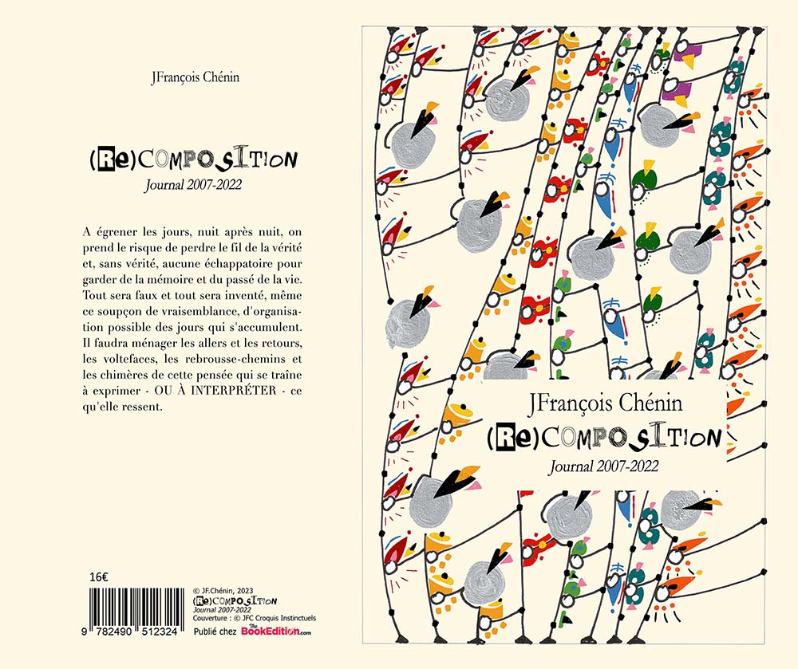

Chez [TheBookEdition](https://www.thebookedition.com/fr/recomposition-journal-2007-2002-p-401355.html?search_query=chenin&results=48)
## EN GUISE D'AVANT-PTOPOS

 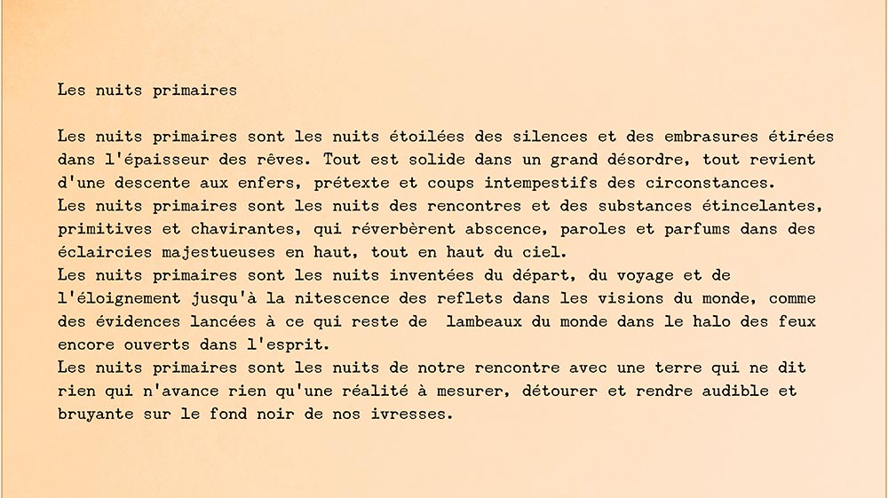

 ## MÉTHODE 
(dans *Entre-deux in Les dissonances,* 2017)

Qui dira la méthode ? Comment s’invente la méthode ? La méthode est proche de la 
partition et de ses répétitions, boucles, détours et re-bouclages.

On fixe la méthode dans le mouvement. Je ne réfléchis pas mieux que quand je me déplace. J’échafaude en roulant.

La méthode est complexe, déroutante tant elle fait partie de l’écriture et sans écriture pas de méthode. Elle est inextricable et invérifiable.

Elle permet de démembrer et de re-construire. Elle est intrinsèquement liée à l’épreuve du jointoiement des mots. Elle est le vide qui construit.

Elle est l’échafaudage qui s’élève dans la cathédrale ou qui s’enfonce dans la fosse. Elle est faite d’étais et d’arcboutants, d’élancements et de désertions.

Sans méthode, pas de surprise, pas d’étonnement, pas de plaisir, pas de saut ni sursaut, ni tout ce qui fait le désir. Elle est sous-jacente.

Elle est commune aux architectes, maçons et charpentiers. On la partage parce qu’on se 
ressemble pour les ventaux des portes dérobées que nous ouvrons ou inventons.

Elle compose et recompose, dit les renvois et les références, ajuste la mécanique des machineries cachées, s’égare parfois en notes de bas de page.

Elle est une écriture en soi tressant les fils des perspectives où s’ajustent les mots, où les mots ensemble finissent par dire.

Elle guide l’ordre des juxtapositions et des impositions. Elles provoquent les arrange-
ments indécidables et posent dans l’écriture les singularités du discours.

La méthode est un voyage qui place la vision avant les mots et non après, qui ne raconte pas les images et les ré-installe dans le fond caché du texte.

La méthode connaît les lieux, les liens, les linéaments, les origines comme les aboutissements et les choix de ce qui converse, échange et dispute. Elle n’automatise pas.

La méthode grappille dans les vides qui restent entre les mots les petits liens inaperçus, les renforce sans les mettre en avant, assurant solidité et demeurance.
Elle débusque les leurres de l’écriture étant un leurre dématérialisée, qui ne s’écrit pas, qui laisse écrire, qui ne dit pas, qui laisse ou ne laisse pas dire.

La méthode est toujours relative à un territoire, à une géographie pulsionnelle des mots. Elle marque les limites du texte même si elle n’est pas exhaustive dans ses recensions (lire l’avant propos de Au(x) Demeurant(s) in Figure Out).

Elle est l’errance des agencements et des ré-agencements et décloisonne les mots de leur proximité commune (lire l’avant-propos de Figures des sentiments).

La méthode est de se convertir à des tâches simples, non déroutantes : explorer, classer, aligner, ranger, vérifier, raturer, expurger, départager, arbitrer...

On pourrait confondre méthode et pensée. La méthode est en-deçà, souterraine en état de veille constante, elle est le substrat du nomadisme de la pensée.

La méthode n’est jamais à bout des mots contrairement à la pensée qui peut s’étioler ou se dépraver. Mais la méthode n’empêche rien.

Et si parfois il semblerait qu’il n’y ait pas de méthode, la méthode est là, dressant ses lignes d’hameçonnage.

---

*Toute journée commence dans cette errance entre la nuit et le jour. Toute journée commence dans ce 'moment de confusion' qui précède le jour et chaque jour chante dans cette démence universelle de l'éveil. Pendant quelques instants toute femme, tout homme, tout animal vivipare et même tout oiseau qui s'éveille est un 'égaré dans la lumière'. Toute journée commence dans l'indistinction des lieux, l'inintelligibilité des formes, l'évanescence de l'identité. Enfin le corps, après avoir recouvré le mouvement, hésite à avancer le pied dans l'absence temporelle initiale du temps. Quand ? Où ? Qui ? La source de chaque jour est un chaos mêlé d'ombres. Un remous où l'eau anténatale se mêle encore. Il se trouve qu'à chaque aurore, il faut reconstruire et sa vue et sa vie et l'horloge, la chronique, le lieu, la langue, le mot, le nom, le monde.*
Pascal Quignard

*Sans savoir pourquoi*
*J’aime ce monde*
*Où nous venons pour mourir.*
Natsume Sôseki

## 2007

Je vis à Courcy. 

Je pense commencer un journal pour raconter ce qui vient. Mais je tarde à m'y mettre et je retrace assez rarement mes journées et ce que je pense, vois, lis, rumine, engrange....

Comme je vis seul, je me déroute ailleurs.

J'écris peu cette année là. J'ai terminé en 2006 *Les royaumes-à-demi* et *Alep* qui figureront dans le volume *Figures de la disparition* publié dans sa version définitive en 2012. 
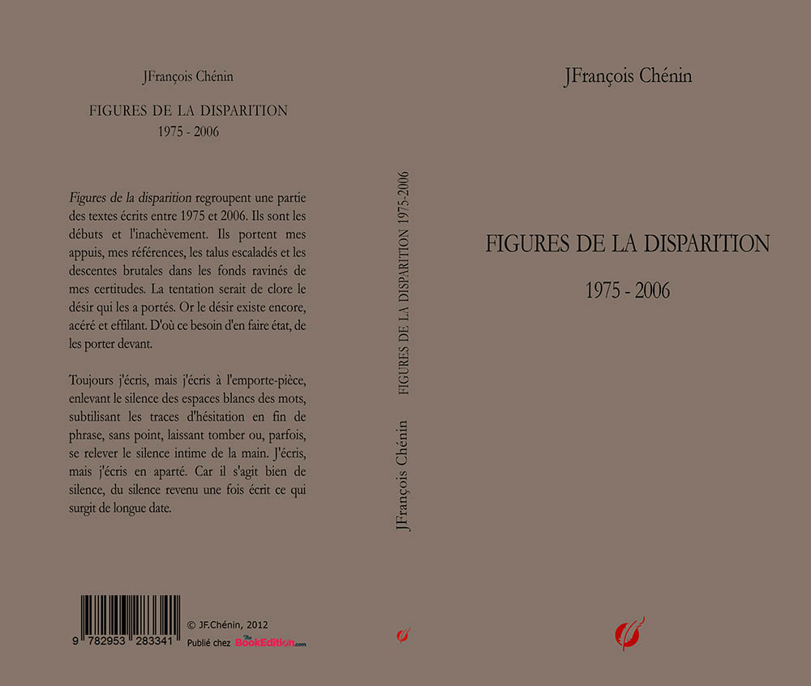
La première version de *Figures de la Disparition* (le Vol. 1 comprend *Quentin, Roman, Exeat, Saisons, Sur la route*) paraitra en quatre petits volumes en 2008.

Je travaille sur *Les Qualités Discrètes*, texte commencé en 1998 et que je terminerai en 2010 et qui figurera dans le volume *Figures des sentiments* publié en 2014.

 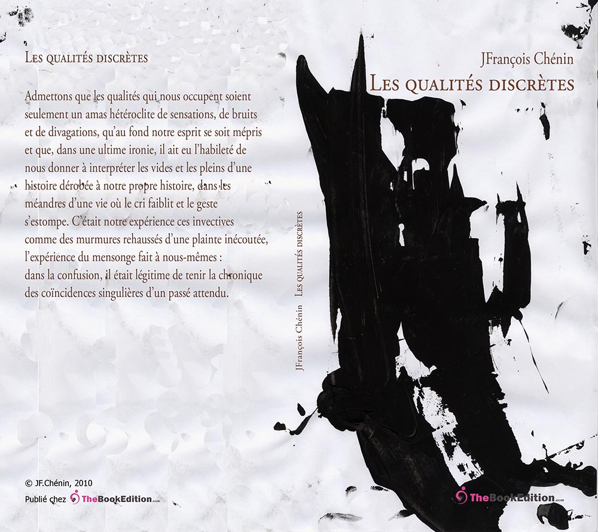

Je commence *A la pointe d'Uzès* que je terminerai en 2010 aussi et qui figurera dans *Figure Out, suites américaines* publié en 2015.

 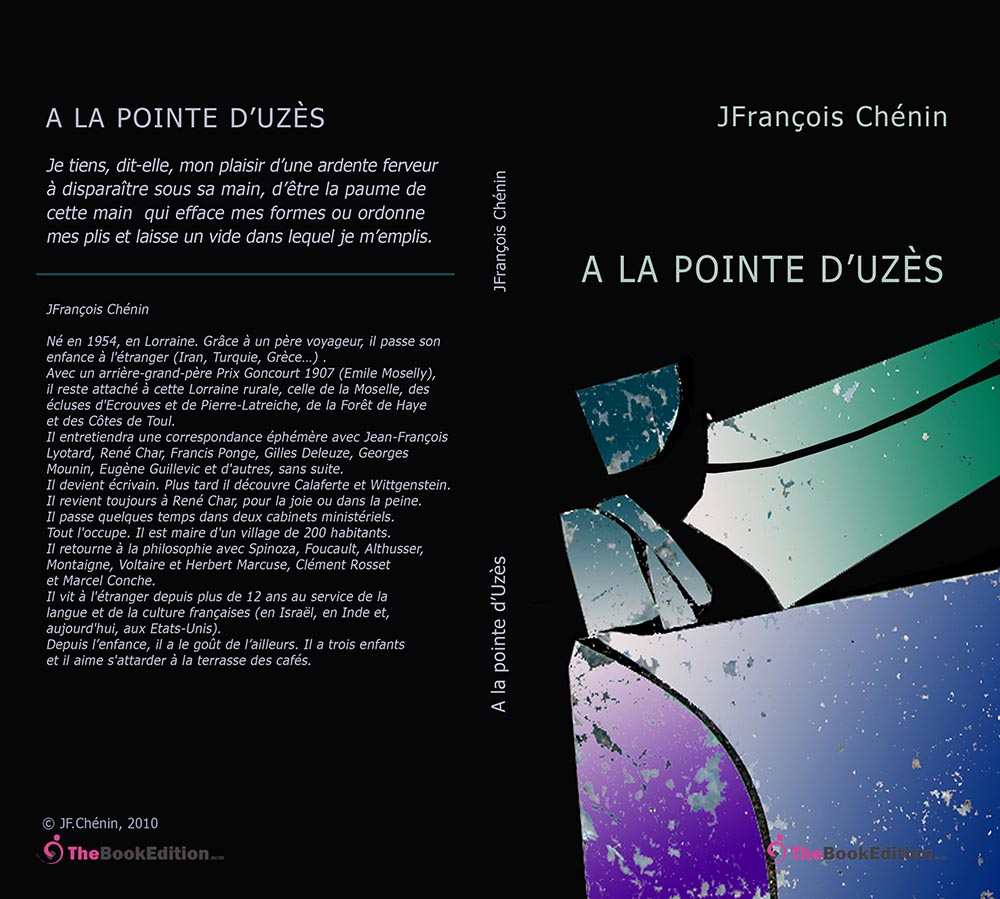

2007 est la fin du cycle dit "la disparition". Sans vraiment en avoir une claire idée le cycle qui commence est celui des "sentiments".

Avant 2007, il n’y a pas de journal.

---

Journal à venir. 
Bientôt 2008.
Troisième morceau du ciel
Ecrire par profusion, instamment. La peur sera arrachée de la page. La déroute pour 366 jours devant soi.

Engranger, déranger, préhistoire.
Revenir à l'interprétation. Je relis Quentin.

INTERPRÉTER
Grande avenue, grande venue.
Date, lieu, circonstance, fait, conséquence, explication.
J’écris : mon père est mort le 22 janvier 2006.
Illicitement ou licitement sur le gravier ?

Reprendre un page blanche, revenir au papier pour comprendre. Seul le papier permet de passer, d'outrepasser, de dépasser. Le papier le stylo la main tout le corps, même blotti, même à l'arrêt.

RIEN NE BOUGE
Entre temps, le feu entretient le feu.
Recommencer Les Qualités Discrètes

En cours A la pointe d'Uzès.

Louise emplit les pages de sa fine écriture. Pas d'arrêt. En même temps Alep, la ville mauve et souillon, ouverte, catin du ciel. Le journal à venir commence, en plein hiver.

Journal à venir préparer 2008

Grand trait : listes reprises, nouvelles listes. Ce qui était n'a pas disparu, n'est plus là pourtant.
AILLEURS
dans un ciel
toujours ouvert
Lumineux
NE SAIT PLUS VRAIMENT CE QU'IL VEUT.

ARTIFICIER
Gagner. Il y a souvent des voisinages inattendus !

Vue imprenable sur le Bosphore, les bateaux vont et viennent. Jour en chute libre. 
Phase de silence. Quentin revient encore à la mémoire.
Vue imprenable sur la vie.
La mer s'extirpe de ses lames / larmes.
Vue imprenable sur la mort.
Après ne rien écrire qui ferait défaut.

PLACE
Ne rien écrire qui ferait défaut.
Journal à venir, histoires finies pourtant.

Nous avons tous cette imperfection de mots qui ne viennent pas au bon moment, trop tôt, trop tard, mal placés. Je n'aime pas raturer. Je ne rature jamais ou pour me faire (me) comprendre à cause d'un mot mal écrit (faire comprendre à moi).

Tout est comme avant ! Haut le cœur - Bas les mains. 
Le contraire pour débuter : Bas les mains - Haut le cœur ! Oh, le cœur ! Oh, l’obéissance.

Une petite place au soleil, un rire, juste assez pour grandir, moi le petit homme, juste assez pour se sentir honnête, juste assez pour relever sa tête, le front droit et net, torse dehors. 

Juste assez pour comprendre qui je deviens, moi qui ne vient de rien, qui ne sait pas écrire, qui parle juste assez. UNE PETITE PLACE AU SOLEIL. Voyage à Uzès. Nos phrases toujours interrompues. A la pointe de la retenue. Foin des longueurs et des détours.  Aller droit au but.

Exercice : 	
compte les mots écrits
détruis ceux en trop
sacrifie l'incertain, 
le douteux, le maladroit
efface, efface, efface
prends de la distance
principal instrument : une gomme

366 jours. Une carte par jour pour en finir avec les lenteurs. S'en tenir à chaque jour et le 29 février, se donner congé. Se congédier.

Après *Alep,* après *A la pointe d'Uzès*, le récit épique et tragique du chiffre 1. Quelle bouffonnerie !

Le jour exponentiel
Chaque jour tu doubles la mise et cela soixante-quatre fois. L'histoire du grain de riz. La vie du grain de sable ! On obtient 18 446 744 073 709 551 615 grains. C'est aussi le 64e nombre de Mersenne. Machine rouillée. 
Tordre le fer, forger l'impensable, un regard pour le ciel, une main dans la poche, l'autre est un poing dressé. Tracer cette courbe qui va de bas en haut de la terre sur laquelle tu marches jusqu'à l'épuisement de toute matière en toi.

Journal d''un forçat
Deviens incontournable, heurte-toi à ce qui reste du ciel en toi. Tu mourras dans un accident, une gifle, une rature du temps (comme Louise). Ne désespère plus, ton tour viendra. Tout vient à point pour qui ne s'y attend pas.

Aller sans arriérés. Journal à venir, 2008 et 366 jours 
à combler. Une image par jour, un mot, une phrase, 
un texte. 
Faire des alignements comme exercice de soi. Se désaliéner après. Attendre 2009 intelligemment, avec candeur et douceur, mener pourtant un train d'enfer, ignorer la 
rancœur, donner du cœur.

HAUT LE cœur
Commencer par battre les cartes, distribuer, éviter de tricher, ne pas tenter de regarder ce qui tombe, la carte abattue est battue, inutile de revenir dessus.

Là le rêve de soi
Ici la trêve en soi

en marge : Ton orgueil est sans mesure, ce que tu prétends être n'est pas, ce que tu es n'est pas mieux, ce que tu deviens est une vaine espérance, un leurre pour continuer - heureusement - Avance, avance, va !

---

## 2008

Toujours à Courcy, le journal n'avance pas. Je sais que ce n'est pas ma tasse de thé, pour ainsi dire.

En réalité très occupé à écrire la première version du *Mouvement du Monde*, texte qui sera complété plusieurs fois les années suivantes.

Je commence *Grandeur Nature des Sentiments* repris dans *Figures des Sentiments*, publié en 2014, ainsi que *Quelques jours après Albuquerque*, repris dans *Figure Out* publié en 2015

 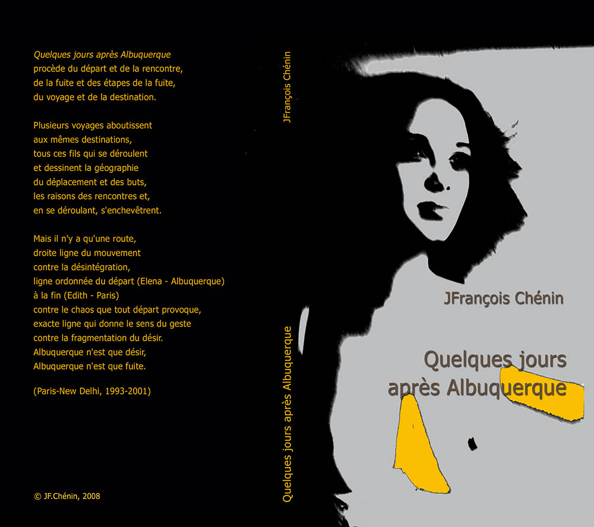

Je sais en septembre que je repartirai en poste l'année suivante. Où ? Je ne le sais pas encore. Ce ne sera qu'en février 2009 que je connaitrai ma destination : aux U.S.A., à Miami.

---

Tout sera faux dans ce journal 2008. 
A égrener les jours, nuit après nuit, on prend le risque de perdre le fil de la vérité et, sans vérité, aucune échappatoire pour garder de la mémoire et du passé de la vie. Tout sera faux et tout sera inventé, même ce soupçon de vraisemblance, d'organisation possible des jours qui s'accumulent. Il faudra ménager les allers et les retours, les volte-faces, les rebrousse-chemins et les chimères de cette pensée qui se traine à exprimer - OU À INTERPRÉTER - ce qu'elle ressent.

La pensée ressentie, voilà le terme du journal à venir 2008, écrit au jour le jour (sauf les oublis) toutes les nuits qui passent. Tout sera vrai et faux, de cette vérité qui fait les rêves et les bons moments, de cette vérité qui vient du tréfonds, toujours inexprimée, régulièrement transformée pour éviter la peur de son éclair, de la lucidité qu'elle ouvre sous les pas. CE SERA UNE VÉRITÉ, celle du moment où s'écrit le journal à venir 2008. 
Année du faux et du vrai dans le mélange des jours qui fuient. Je reviendrai alors à cet horizon qui soulève le ciel, le fait apparaitre transparent, élevé, cristallin, plein du bonheur de s'y égarer.
Pourquoi je me souviens de cette affiche photographiée à Calcutta et utilisée dans une carte titrée Marcus Imperator ? Est-ce le corps de femme que je place devant, offert, ouvert, élogieux, qui revient ou le sourire joyeux de ce footballeur indien qui semble dominer sa vie, 
LA VIE !
Marcus Imperator ou la joie diluvienne du corps à corps qui s'ouvre.
Le journal à venir pour exorciser le temps, de temps en temps, à rebours nécessairement, à la limite qui sépare un jour de l'autre, le long de frontières inexplorées, 
parfaitement inconnues. Elles ne sont que bornes, balises et passages, tout devient anodin. Y-a-t'il encore des secrets ? Frontières banales, frontières muettes, inextricablement vides.

 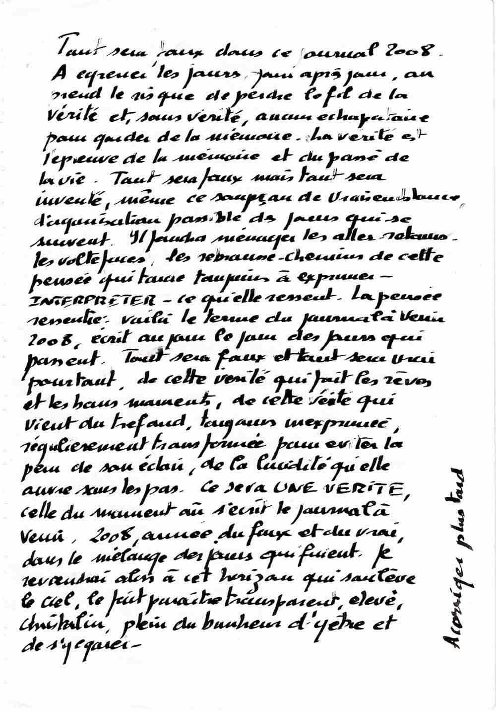

Je reviens à la vie. J'irai de l'avant, c'est-à-dire que j'ai le soleil en ligne de mire.

Cette expression "mise en veille". Traité des Marquises.

(en marge : PASSONS À AUTRE CHOSE)

Grandeur nature des sentiments

Sur l'estrade, entre les branches qui touchent le sol, au-dessus des franges bleues d'un ciel devenu transparent, plus haut, un blanc vide en liseré de l'horizon. Ainsi débute Grandeur nature des sentiments.
Placer le regard en contre-jour, organiser cette vision pour s'aveugler d'ombre et de traces lumineuses, voir sans voir.

Arrangement du désir avec ses fantômes, dérangement des phrases subreptices, sur la terre comme au ciel.

Aller voir ailleurs, c'est ailleurs.
*A la pointe d'Uzès* toujours en cours, Grandeur nature aussi

(en bas de page au verso : le 15 mars 2008)
Au recto : à l'écluse de nos truismes]

Le grain à moudre
Obsidienne des bleus désirs
Venue fantasque du premier rôle
La nuit grandit. Cette victoire !
Les alignements bouleversés du silence
Victoire ! Victoire !
Sur l'esplanade le vent frise 
Les dernières flaques d'eau
Il a plu cette nuit.
Et cette nuit pleuvra-t-il
Avons-nous encore le temps de danser ?

⁂

A genoux ! Terriblement à genoux !
Nouvelle venue, la femme qui tombe dans ses bras
Littéralement tombe dans ses bras
Elle pourrait être sans conscience !
Pire ! MORTE !
Presque rien sur elle
Que des mains fines et des lèvres rouges
Une poitrine de moineau
Essoufflée ! LA PEUR !

⁂

Organiser le trait
Prendre plus qu'il ne faut
Franchir la rivière
Voilà le feu souverain
L'autre déjà défaite.
Victoire !

⁂

Où le monde commence, il y a reddition. Un abandon des temps.

---

## 2009

Entre le départ de Courcy et l’installation à Miami, j'ai peu de temps pour écrire et ce journal se réduit à sa plus simple expression.

Je commence *Les Adolescences meurent sur les Talus* que je terminerai en 2010 et qui sera repris dans *Figures des Sentiments* publié en 2014.

 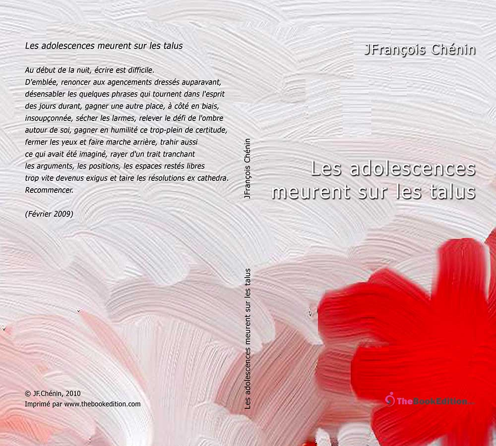

J'écris *Chant Premier*, ma version du *Cantique des Cantiques*.

 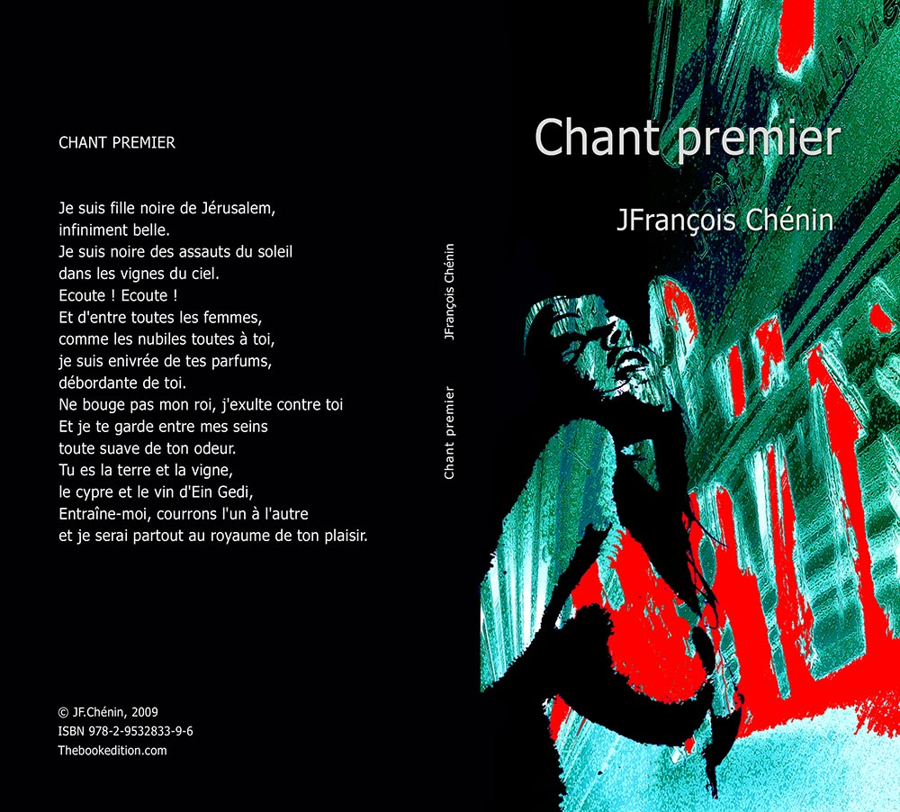

Et je publie *Curcuma* en début d'année - je suis encore à Courcy -, un album de photos prises en Inde avec des commentaires sur chaque photo.

 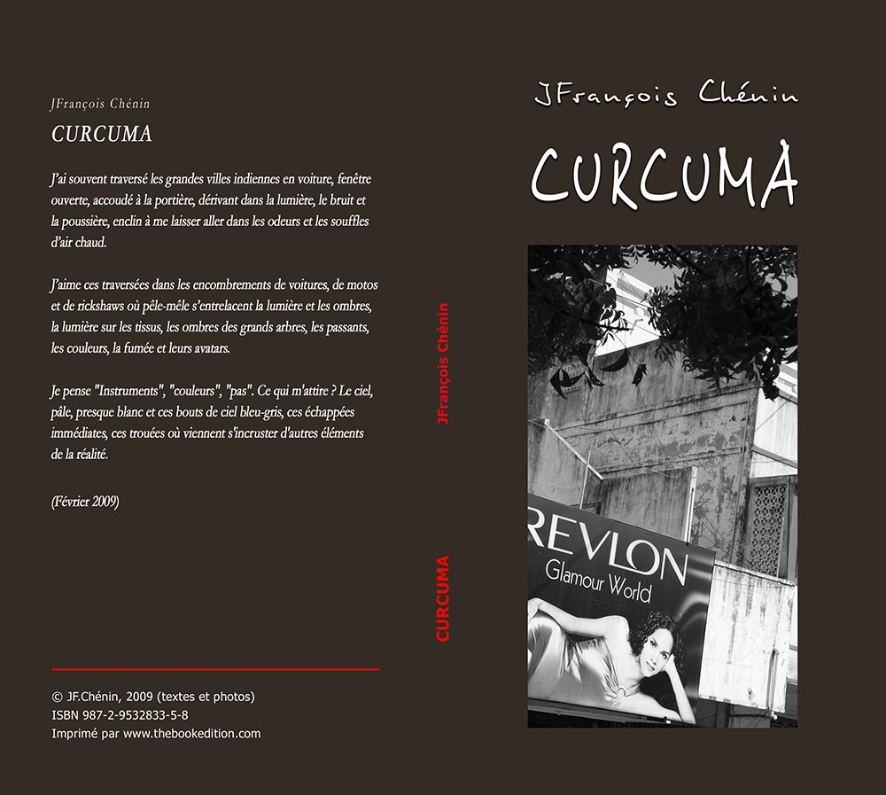

En réalité, j'accumule des notes dans ce journal ou dans d’autres carnets sans les ordonner vraiment. Je ressens mieux mon écriture, sa forme et son rythme, et les moments d'écriture, par longs à-coups la nuit, les moments d'assemblage, les moments de regroupement. Ainsi je peux écrire plusieurs textes à la fois, sans les identifier vraiment à ce stade. Ce n'est qu'avec un volume conséquent de brouillons et de notes que je commence le tri et l'ordonnancement des textes. Les titres viennent en écrivant. Il n'y a pas de préalable mais les thèmes sont là et se heurtent ou se chevauchent. Parfois les jointoiements sont évidents, d'autres fois ce sont de longues tergiversations pour trouver la bonne formule. 

Et je me plais dans cette écriture fragmentaire qui me va bien. Beaucoup de suites que je publierai plus tard ont pour origine l'année 2009, comme *Nous sommes des silencieux, Flyovers, En dehors des retours.*

 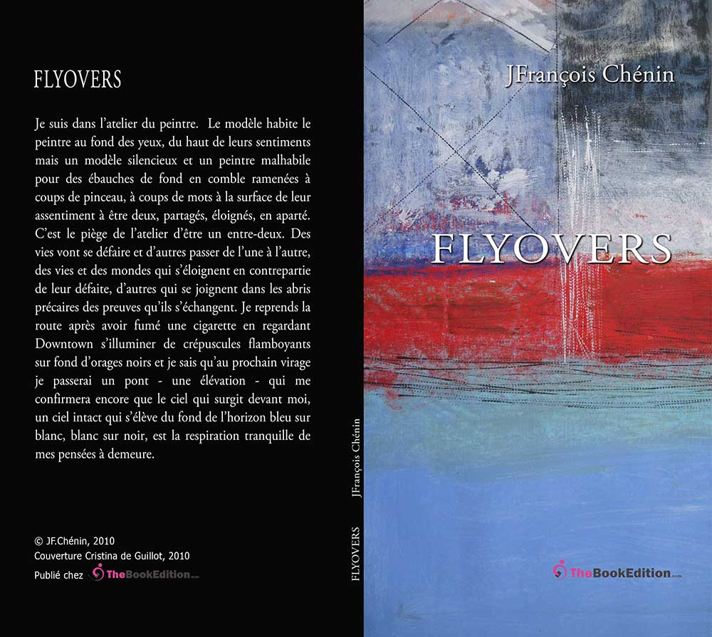

---

Sur tous les registres, un risque diablement bleu, mais un bleu d'un ciel lavé de ses orages, infiniment relevé.

Il n'y a plus de journal, mais une forme, un pas, des couleurs, un instrument lancé pour vivre.

Au bord de l'hiver, à la lisière incertaine d'une lumière prise dans la glace. L'éclat souverain du feu sur le ciel dans un éclat plus grand qui l'entoure, sur cette terre à mi-chemin de nos aventures, majesté du feu, au seuil 
d'un monde qui s'ouvre, bleuit, rugit, dans un mouvement du bas vers le haut, le vent soulève la lumière, irradiée 
en son centre, orgueil du matin, ligne franche dès la 
naissance.

La question de l'amorce, le début, le premier mot. 
Départ. Le premier mot est un seuil vers le dehors ou 
le dedans, selon. La première phrase suit. 
Importance du premier mot - et du dernier.
Son rôle est de donner le ton, l'allure, le rythme. Il imprime toute sa présence et donne toute sa densité au reste du reste. Tout en découle.
Le premier et le deuxième et le premier arrêt. Puis prendre son souffle, pause nécessaire sur la longueur.
A la recherche du premier mot. Mathilde me demandait donne moi la première phrase. C'était le premier mot et sa suite. Toujours revenir au dictionnaire et aux définitions, tous les alentours. Faire une interpolation.
Rien que du banal dans l'écriture.

Avril se déplie. Je sais où je pars.

A l'origine d'Albuquerque : la couleur.
A l'origine d'Uzès : le pas.
A l'origine de St Eustache : l'instrument.
Trois lieux de mes mythologies.

Une fois le silence, une fois le voyage. Nomadisme.

A l'origine des traces de feu.
Retrouver le toucher bleu du rêve.
En amont des mots, en amont des images. 
Ce que dit Voltaire est une bonne définition de mon écriture. Se fier aux mots, à leur rythmique réciproque et alternative.

---

## 2010

Je suis à Miami.

Je termine *A la Pointe d'Uzès.* Il m'a fallu quatre ans pour trouver la forme définitive de ce texte. Proche d'une réalité vécue et comme en suspension. 

En exergue de *A la pointe d'Uzès,* je reporte ces remarques écrites dans mon journal : Je partageais ma vie avec des ombres qui me sont revenues de leurs rêves, des rêves en moi qui ne disaient plus rien que la présence de ces ombres et, tenu par la promesse de les extraire de la douleur qui les enserrait au tréfonds de leur réalité, j’ai réparé ce qu’elles ne disaient qu’à moi, qui me soulevait de terre.

Je commence *Flyovers* qui paraîtra d'abord sous le titre de *Suites à Miami* puis repris dans dans *Figure Out* publié en 2015. Il s'agit d'instantanés journaliers sur les lieux que je visite et les personnes que je côtoie, en quelque sorte un journal dans mon journal.

 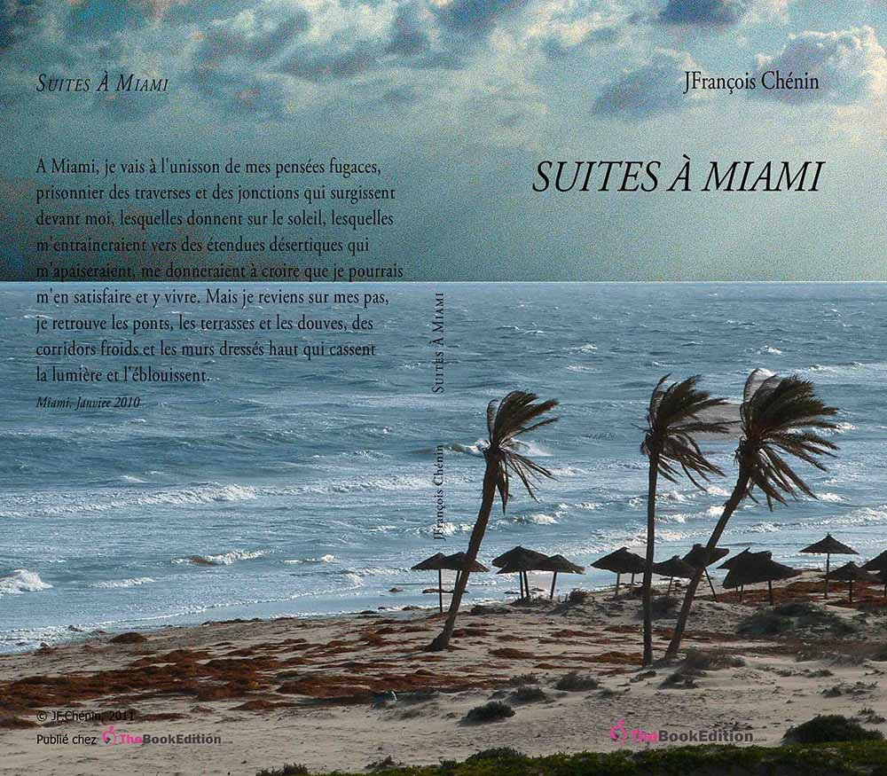

Je joins à ce texte *Aparté* qui sera repris et complété sous le titre *Nous sommes des Silencieux* dans *Flyovers*.

Ecrire est devenu une activité principalement nocturne ou arrêté au bord de la route quand je vais à Key West ou dans les Everglades

---

1er janvier
La terrible imprécision du silence : retourné, dénaturé, bouleversé sur ses propres aplats. 
La ville est parcourue de vide et de ciel fluorescent.
Là, tout près, souvent la nuit retombe dans ses gorges inassouvies.
La place est intermédiaire où les hommes ont fourvoyé leurs rêves, où les femmes les ont suivis, reines et rois, l'archet, les cavaliers morts à la charge, les fous, les soldats complices, tout un peuple d'à-côté.
Le vrai du faux qui balance et fait douter. En partance pour le début du monde. Gravité contraire. La folie est solidement arrimée aux cimaises vides de murs vides. Noirceur de cet échange entre faux et vrai.
Le nouveau monde en trois dimensions : ciel, verre, humains en perdition.

2 janvier
Nous sommes des silencieux, des feux perdus, des soldats désarmés à la recherche d'un abri, mais un réceptacle qui grandirait avec nos émotions et nos pleurs, une anfractuosité respirante à la mesure de nos retournements. Nous sommes transhumants et nous brûlons. L'espace autour de nous n'y suffit pas.
Ce qui change ne revient pas. Nous sommes des silencieux. Nous reculons parfois et les feux sont loin et parce que les lumières - scintilleuses - ne sont pas des feux, nous perdons nos repères et nous restons blessés. Notre parole meurt. Mais c'est un autre silence, un faux-semblant en arrière-goût quand tout se tait en nous.
Qu'il est insupportable parfois d'avancer ! Le pas est sans poids et les quelques souvenirs qui nous tiennent - fin du tréfonds - nous répugnent tant nous savons qu'ils sont vains. Nous sommes des silencieux, des natures 
généreuses au bord du gouffre où nous allons tomber. Nous nous précipitons sur nos faux-pas.
Nous sommes des feux perdus, dispersés, éloignés les uns des autres. Nous surgissons au hasard, mais notre volonté n'y est pour rien, seulement l'instinct, le très bas instinct de ne pas s'éteindre. Il nous sauvera, nous donnera à revivre ce que nous redoutions mais que nous avons accepté - de bon gré - exactement où nous avons surgi la première fois, dans un saut de l'air sur l'air qui fait notre clarté et notre dissidence, mais notre évidence et notre fragilité.
Combien sommes-nous ainsi ? Combien sommes-nous à gagner sur le feu qui nous ronge et nous consume, à devenir le trou noir qui nous absorbera ? Nous avons touché des mains sans pouvoir les saisir et - malgré nous - nous revenons aux racines en partie détruites de nos éclats. C'est cela : nos éclats et nos rêves d'incendie tout au long des horizons et des faîtes que nous souhaitions franchir. Nous sommes des feux perdus.

10 janvier (1)
De bas en haut des certitudes et des doutes, c'est la raison d'écrire au retour des raisons de rire comme de trembler, des sentiments qui vitupèrent ou qui se lassent. c'est la raison de fouiller les mots à travers les accidents qu'ils provoquent - à la prochaine bifurcation, je poserai un point, un sourire, une larme, un blanc jusqu'à la prochaine respiration.

10 janvier (2)
Entre nous, par devers nous, la vie se déroule par tous les bouts. Je n'ai de cesse de m'affranchir de cette mémoire en lambeaux que je traine - majestueuse - de texte en texte. Elle sera vaincue et elle m'étouffera pourtant parce que je n'aurai jamais assez d'elle.
Je m'installe à l'aplomb du vide qui me bouleverse, en déséquilibre parfait - c'est-à-dire droit à l'à-pic des murs qu'il dresse opportunément pour m'empêcher de tomber. Mais je tombe effrontément.
Je prends sur moi - belle expression du détour et du silence - je prends sur moi pour respirer mieux, voir mieux, saisir les alentours, en deviner les grâces particulières - je veux dire ce que j'en retiendrai quand je les aurai quittés et oubliés. Je m'installe au firmament.
Ma mémoire a une faculté d'oubli considérable. Elle reçoit, elle empile, agglomère, entasse des pans entiers de vie, amasse à plein, sédimente du centre jusqu'à 
ses bords, ne connait pas sa propre limite à enfouir 
à loisir ce qu'elle était sensé révéler. Elle prolifère sur 
les décombres.
J'ai placé des bombes sous ma mémoire. Ce sera un 
règlement de compte au sommet, un soudain détachement de ce qui ne revient pas (musique dans le fond). Alors 
je gagnerai ma plus mauvaise place dans l'entre-deux 
des escapades disparues.

19 janvier
Elle trouve son bonheur dans les linéaments des arrangements successifs de sa mémoire - en ordre de marche - et les ombres ordonnées qu'elle dérange - volontairement - dessinent les traits physiques de ce saut du passé au présent. Elle donne raison à ses sentiments - à la verticale de sa peur nouvelle - contre elle-même. Elle prend le parti du risque, du foisonnement, des rives abruptes qui la mettraient en danger s'il n'y avait - parce qu'elle le veut -, dans cette ligne de fuite, un point à l'horizon qui fixe son regard. Et ordonnant ce qui revient à elle, elle s'en sépare enfin.

8 février
J’écris : ma mère est morte.

11 février
La partie n'est jamais jouée. Quelquefois le chagrin n'est guéri par aucun moyen, le temps qui passe l'amplifie dit Pascal Quignard. Alors il faut ne faire qu'un, éviter de 
se scinder en deux, s'arc-bouter au dessus du vide qui s'ouvre en nous. Ce que nous sommes tient aux courbes et contre-courbes qui s'entrelacent en nous.

21 février
A défaut. Commencer par à défaut. La pensée est vide quand elle s'emballe. Seuls les coups pleuvent à mauvais escient. Nous nous sommes battus pour rien et rien n'est désormais à sa place.
Grandeur du sentiment quand il cède la place, légèreté du sentiment quand il croit renoncer. Nous serons traversés de nos doutes et de nos absences. Éreintés de nous-mêmes. Nous restons à la surface, incapables de passer l'onde de choc qui nous sert de barrière. La limite est en nous, les frontières nous partagent. Nous agonisons de pouvoir nous rejoindre. Il faudra se rendre heureux.
La vie est en quinconce, abrupte, à l'à-pic d'une autre vie plus silencieuse mais plus réelle - disons nécessaire - au droit-fil d'une autre vie, plus instinctive, majestueuse.
Nous avons perdu les mots, nous donnons des coups quand la parole n'y suffit plus. La violence est dans nos silences, volontaires ou imposés, le souffle coupé. La vie est en vrac, nous nous quittons.

8 mars
Au détour de cette route - une fois achevée une cigarette -, au détour des enclaves et des rixes fugitives, au détour de ce qui ressemble à des pleurs, mais des pleurs sans larme, juste un gémissement, au détour des jardins clos - illusoires abris - que chacun envie, où il n'entrera jamais, au détour des quais, des entrepôts et des impasses blanches, au détour des entre-deux et des arrière-cours, là-bas une porte est ouverte laissant filer une lumière, ici une autre, fermée à double tour depuis longtemps, pour preuve cette chaine rouillée, au détour des sentiments qui n'en peuvent plus, las, au détour de la prochaine cigarette, empoché le reste de cette certitude qui rend seul au monde, qui tombe mal, au détour d'une nuit à la dérive - la nuit manque d'horizon - dans les bas-fonds du ciel, au détour d'une controverse, rarement il faut se battre, mais se débattre, au détour d'un silence qui revient, opportunément, au détour des rêves et de la transe des rêves - ce qui n'est jamais qu'un rêve -, je n'ai pas la vie qu'on me prête, mais bien d'autres à trouver.

20 juin
De Marcel Schwob : Et parce que la douceur de l'amour est dans la caresse des yeux mi-ouverts et la pression tendre de la main et l'arôme de la chair embaumée parmi l'ivresse de la mort, je mêlai tout mon corps au sien depuis le pourpre de sa bouche jusqu'aux ténèbres chaudes d'entre ses jambes ouvertes et croisées sur mes reins. (*Maua* - La Table ronde).

22 août - Céreste
Il est temps de partager nos sentiments et nos actes contre l'ignominie. Prenons date et rompons les liens. Ce qui vient sera à l'opposé de notre nature à espérer une terre sans frontières.

19 septembre
La vision d'un silence déchiré. La vision éructée d'un sentiment qu'il faudra faire mourir, la vision même qui se défait et entame ce qu'elle imaginait au-delà d'elle-même. S'y reprendre à deux fois pour respirer, basculer dans l'entre-temps où se succèdent disparition, effacement, résolution du renoncement, dans l'entre-deux des craintes de perdre et du désir - enfin - de fermer les yeux.  
A côté, de côté, sur les bas-côtés de nous mêmes, juste au bord de l'effondrement. Mais rien ne sera ainsi.
Mais rien ne sera ainsi. Tout débutera.

23 octobre
Ne soyons pas avares de nos sentiments, ils sont rares, ils n'en restent pas beaucoup. Ne mettons pas dans la balance, ne pesons pas le pour et l'avec ; le contre et le pourtant. Quand on peut regarder avec clarté, quand on peut dire sans aparté, dans l'arrière-pensée du désir... du désir, oui ! Mais qui pourrait nous croire, nous qui sommes astreints à défaire et à défaire, à perdre au bout du compte, à taire à bout de sentiment.

***

## 2011

A Miami.

*Requiem*, commencé en 2010, me prend du temps. Le texte est accompagné 
de collages digitaux. 

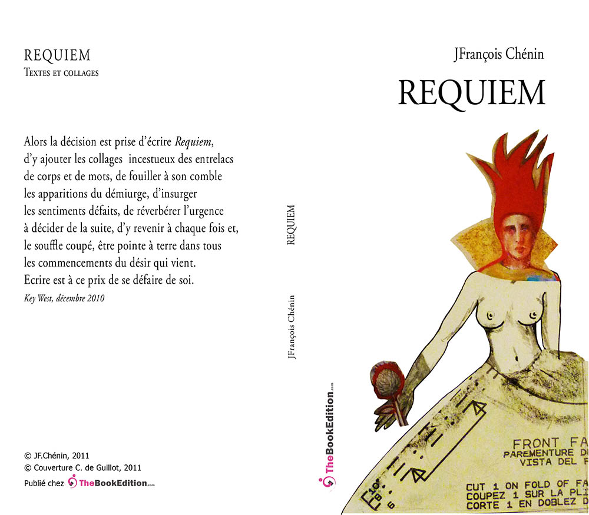 Chez [TheBookEdition](https://www.thebookedition.com/fr/recherche?controller=search&orderby=reference&orderway=desc&search_query=chenin)

*Requiem* est composé pour brouiller les pistes qui mènent à mon écriture, qui n’est jamais sincère sur le moment, qui le devient quand j’ai trouvé les chevilles pour articuler ou jointoyer les textes.

Tous mes textes deviennent sincères avec le temps.

*Requiem*, sans les collages,sera repris dans *Figure Out* publié en 2015.

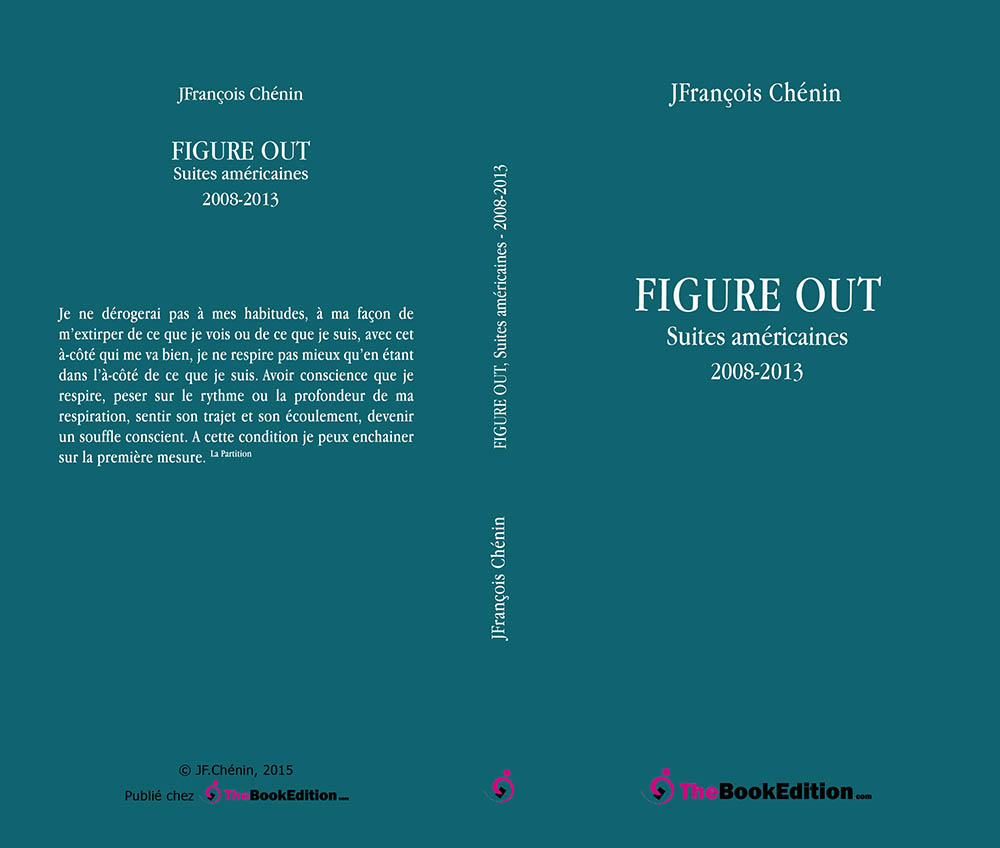

A la fin de l’année, je commence *Au(x) Demeurant(s)*. Suite que je considère la plus aboutie de ce que je vis et pense. Ce texte sera repris dans  *Figure Out*.

 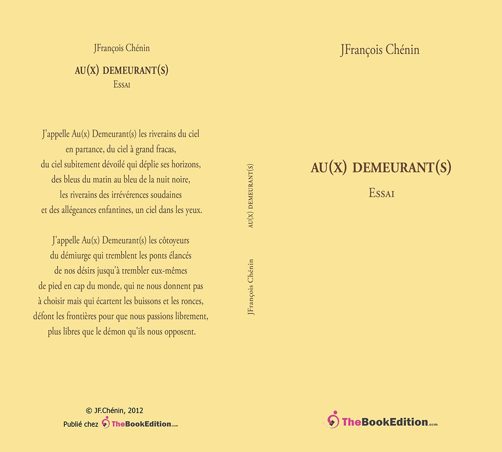

*Requiem* est la délivrance des sentiments anciens. Quand la nuit basculée ouvre ses portes sur le feu errant.

J'écris à bras levés dans l'ombre des ponts submergés de lumière, j'entre décidé dans le labyrinthe froid des colonnes soulevées de part en part du grand soleil qui vient de surgir. J'écris à bras levés au début du monde.

Poussière verticale qui pénètre dans les condos encore ouverts, toute une lumière qui s’infiltre, qui prend par la douceur tous les pans de verre des façades, qui arpente les reflets vert-bleu qui s’en échappent jusqu’au dessus de la nuit qui vient, qui imite le souffle du mouvement de l’eau, loin, très loin. On ne la voit plus. Elle se mélange au ciel. Il reste cet élancement de milliers de mains blanches qui soulève le monde devant nous.

---

14 février
Le noir manque à la nuit, elle délibère à perte de temps, qui vitupère insatisfaite, ne connait que des esquisses d'ombre, ne donne que des soubresauts d'ombre. Elle tremble d'ombres à la pointe-sèche, à peine relevées, à peine assombries et préoccupées. Elle craint et tressaille agitée de scintillements du fond de la ville. Elle n'est pas noire, ni silencieuse, ni repue. Elle se délite au bout de ses spasmes. Il lui faudrait un désert blanc et chaud pour s'abattre d'un coup et dégorger les rêves qui la tiennent encore debout, à contre-temps d'elle-même. Une vraie nuit en somme.

30 mars
Nous serons délivrés et libres de nos sentiments quand nous saurons jouer avec eux, à cœur demeurant.

26 avril
La face cachée des sentiments n'est jamais accessible à quiconque. La face visible est un liseré, une feinte éclairante du dedans. Ne jetez pas les feintes qui jouent la lumière. Revenez pas petits bouts, réparez, engrangez les retours. Ce qui est humain en nous, cet attachement aux traces, mérite d'être épargné. Rien à jeter en somme.

26 mai
A Key West, la nuit s'installe en aparté dans les arrières cours et sur les terrasses. Elle ne se mélange pas, ne se partage pas, ne donne pas à choisir. Il faut la prendre comme elle vient, irrésistible, ouverte sur un souffle de mer qui rabat la chaleur à terre. Et se partager en elle, et s'évader en elle.

4 juin
Nous sommes des rêves argumentés, au début de ce qui serait une vie tout au long du silence qui passe en nous. A demeure des sentiments qui respirent et se soulèvent, encore pleins d'arguments.

7 juin
A Cassis, sur les routes crépusculaires de Dali ou dans les alcoves d'une véranda ouverte sur la lumière, la main tenue ne désarme pas, ouverte sur les linéaments de son désir, virevoltée infiniment (Juin 2011, St Petersburg, 
Floride).

6 septembre
Les prophéties comme les coïncidences se construisent à reculons.

---
## 2012

Année d'intranquillité. 

Je me partage entre Miami et West Palm Beach. Je roule beaucoup. 
Puis je m'installe à West Palm Beach les neuf derniers mois. 
Mon blog me sert de journal avec plus ou moins de constance.

Renoir me laisse entrer dans sa vie.

Je termine *Au(x) Demeurant(s).*
Et j'écris, assez rapidement, *Le Dernier Roman,* un bout de vie de Thomas Moselly, écrivain, par lui-même.

 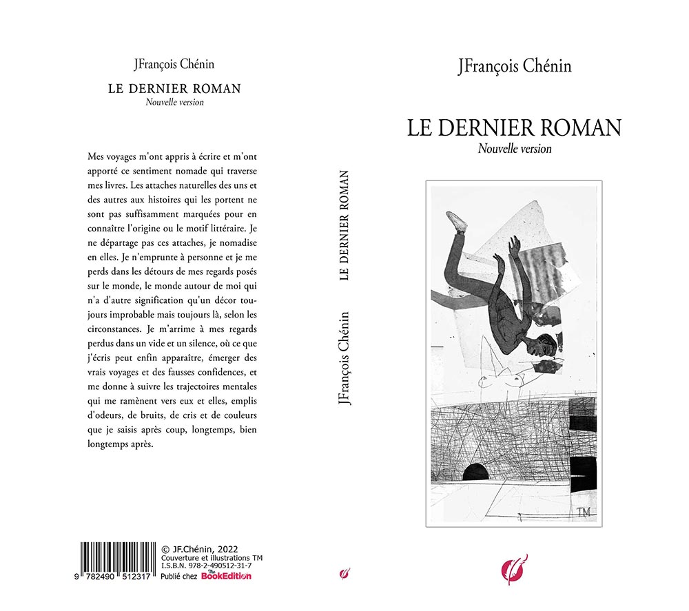
Chez [The BookEdition](https://www.thebookedition.com/fr/recherche?controller=search&orderby=reference&orderway=desc&search_query=chenin)

Je sais en juillet que je vais quitter Miami pour Karachi, au Pakistan. Même latitude. 

Je n’ai pas vraiment trouvé ma place à Miami. 
Je voyage beaucoup et je visite plus d’une cinquantaine de villes nord-américaines. Les longs paysages qui défilent me fascinent. Et le soir venant les feux de signalisation sont mes totems.

Key West a longtemps été un refuge puis les lumières sidérales des Everglades.

C'est à Clearwater que j'ai reconsidéré toute mon écriture, je veux dire que j'ai pris le parti d'écrire à l'instinct sans a priori sur les directions à prendre ou les destinations à atteindre. Et j'admets enfin que l'écriture est une errance. 
Je parcours un ciel où *“je me constelle en cachette et où je possède mon infini*" (Fernando Pessoa).

14 février
Pascal Quignard écrit dans La barque silencieuse : Il n'y a pas deux aubes. Tous les matins du monde sont sans retour. Il n'y a pas deux nuits. Chaque nuit est le fond de l'espace en personne. Il n'y a pas deux fleurs, deux rosées, deux vies. 
Il faut dire à tout instant : Toi. Il faut dire à tout ce qui vient : Arrive.
Notre besoin, inassouvi, ébloui, est comme un petit objet perdu : un pas de danse nu, de côté, latéral.

15 février
Dans chaque corps, il y a un peu de la nuit qui nous entoure et ces corps ont leurs ombres demeurantes, à la mesure du regard qui fait cercle autour d'elles et, sans les atteindre, sans les percer, ce regard dérive. Ecrire hèle le bonheur en nous. Sans le toucher ou sans le comprendre. Ou parce que nous le savions hors d'atteinte, nous étions devenus son fantôme, son rêve glissant en bordure de miroir. Il y a des caresses qui tombent droit.

24 avril
Ecrire, c'est lui donner un visage. Ecrire, c'est la déceler, faire irruption au bord du monde de sa réserve. Ecrire comme on devine, écrire à profusion de ses silences. Nous sommes à bout portant du désir. Mais ne plus écrire qui ne viendrait pas à bout des sentiments. Il faut s'endiabler une bonne fois pour toutes, s'exiler au fond des yeux, toucher par petits bouts ce regard en soi, se solidariser. Les vérités sont demeurantes qui nous donnent à vivre ce que nous sommes, vraiment.

25 avril
Une respiration, une lumière élancée, un ciel soulevé.
Une route, foin de la destination !
Des parfums à profusion, des parfums du fond du corps, ce ne sera pas ordinaire.
Et ces mots qu'on reçoit et ces mots qui reviennent.
Ces mots d'entre-temps. Ce caprice de mots, ces mots qui tombent dans le noir.
Avoir moins de larmes. Redoubler les feux, les placer de loin en loin, aller en éclaireur, traverser et ôter les épines, repérer les passages, allumer les feux.
Et dire comme on avance, sans détour de mots, sans mensonge.
Et les parfums, devenus vivants, alertés. Respiration, moins d'ordinaire.

16 décembre
Mais il arrive parfois que le ciel tombe dans le gris-vert de ses yeux.

31 décembre
Au départ de WPB / Ne plus penser / Ne plus écrire / Apnée indispensable
J'ai recommencé à fumer.
C'est comme être englouti et se noyer.
Ce que ton désir n’a pas dit.
Ce que la respiration a oublié. Un souffle par défaut qui fait perdre l’appétit, qui efface les visions, les lignes, les tangentes du cœur, les perspectives, les biais des regards, toutes les traces d’une vie.
Je suis heureux de ce détachement et je ressens une douleur noire, abyssale. La lumière vient à me manquer, les couleurs d’un soir, bras dessus-dessous, le siffle-
ment du dernier train, plus loin, sans voyageur, que des 
marchandises, le roulis de la nuit et la mer bleu-vert, 
en souvenir.

---

## 2013

J'arrive à Karachi le 6 janvier. 

Je retrouve les bruits, les souffles et les parfums de l'Inde, les lumières errantes du soir qui ont du mal à laisser la place à la nuit. 

Il n'y a pas de vraies nuits dans cette ville, mais des bouffées sombres et versatiles, mélanges d'étoiles, de respirations chaudes du désert et d'haleine marine. Je ne sais pas encore que j'y resterai cinq ans.

J'écris deux textes : *À Renoir,* commencé avant de quitter West Palm Beach 
et La Partition. Je les reprendrai dans *Figure Out, suites américaines* publié en 2015. Avec ces deux textes s'achève la période dite "américaine".

---

7 janvier
Trois raisons de partir et faire route. Une seule raison de rester : le choix est dans Les Demeurants. Le choix est dans *les escaliers de Chambord à double hélice génétique*
(P. Quignard), dans la partition où tout événement la ré-oriente à chaque instant (L. Louppe), dans *la course de la furtive* (R. Desnos), dans les abécédaires inassouvis du voyage. Je regorge d'instants là-bas à désordonner.

17 janvier
Une fois l'an, ranger ce qui sera jeté avec le vent. Sauf les étoiles, sauf le silence. Sauf les horizons effilés le long des lumières blanches, sauf les bas-côtés et les talus des routes anciennes. Sauf les grands yeux verts du retour. Tout jeter de ce qui sera ordonné. Et se tenir entier à la porte ouverte.

25 janvier
Il n'y a pas de silence mais des espaces bleus presque intacts. Au-dessus de soi, parfois en soi. S'échappent des bruits, des feux, des oiseaux noirs et des saveurs revenues qui retiennent un instant l'attention. Il y aurait une vie. 
Il y a une vie mais on ne sait pas la comprendre. A l'angle du 8ème et 9ème block, des enfants chassent les oiseaux à coups de pierre. Le territoire est sacré.

10 février
Se rassembler pour écrire, se rassembler du ciel et des avenues trop chargées et trop bruyantes, se rassembler des parfums nauséeux et des regards fuyants, surtout des regards qui passent au-dessus, ou au-dessous, ou à côté. Se rassembler de ne rien vraiment saisir, de ne rien vraiment voir. Mais que voit-on de soi dans ces occasions et que sait-on de ce qui entoure, de ce qui fait le tissu du ciel qui tombe à grands pans blêmes sur les avenues ? Où des ombres s'affairent. Se rassembler pour garder confiance, se rappeler - si peu - qu'il s'agit de passages et de détours qui ramènent au même lieu attendu du retour. Se rassembler pour écrire, à force de pages 
déchirées, à force de ratures, à force de trouver les mots qui ont manqué, qui remontent à la surface. Mais que sait-on de soi qui n'est pas encore là, que l'on pourrait deviner, qu'on tarde à comprendre ? Et le ciel plombe la ville, sans éclat, à peine éreinté d'oiseaux noirs.

21 février
Nous finissons seuls à détourer les sentiments dans des lieux improbables à notre vie, des lieux où les feux allumés de loin en loin, pour se chauffer, sont des rêves errants, des rêves d'autre chose. Nous gagnons sur notre déséquilibre, traversés de certitudes encombrantes et déplacées, que nous ravalons en cachette. Ce qui nous touche est là depuis des temps, nous soupçonnions qu'aller à cette rencontre était nécessaire. Et nous 
découpons avec des ciseaux grossiers des aplats de vie qui, soudain, nous sautent à la figure. Nos sommes, comme tous, déplacés.

20 mai
Revenir à la case départ. C'est à dire s'envoler à brûle-pourpoint.

23 mai
Nous naviguons à vue dans des moitiés de rêves, des parts de mondes fantasmés et surestimés. Quand nous en aurons fini avec cette errance, nous ne serons pas plus libres, seulement débarrassés de l'amertume d'avoir perdu les visages familiers qui étaient encore là et disaient la joyeuse surprise de nous retrouver.

25 juin
La pensée n'est que longues digressions avec ses frontières, bords, bordures, bornes, bouts, confins, délimitations, démarcations, extrémités, fins, lignes, limites, lisières, marches, murs, séparations et termes des élucidations. La pensée pense les seuils et les séparations. C'est la limite en-soi de la pensée.

---

## 2014

A Karachi.

J'écris peu. 

Je me lance dans les collages digitaux que je regroupe en saisons sous le titre *Monument Valley.* Je commence avec des collages dont les éléments sont pris 
du Pop Art.
 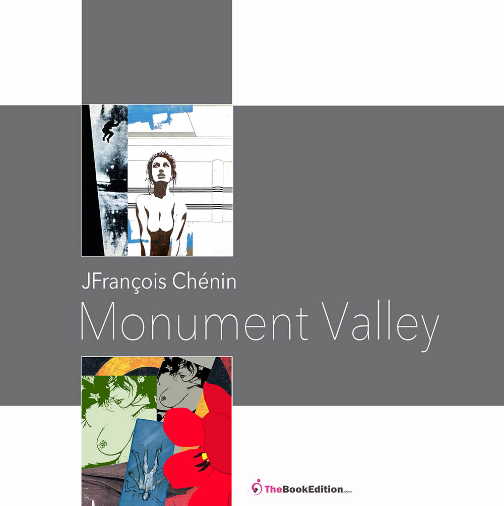

Chez [The BookEdition ](https://www.thebookedition.com/fr/recherche?controller=search&orderby=reference&orderway=desc&search_query=chenin&p=2)

C'est mon frère Nicolas qui m'a initié aux peintres du Pop Art, essentiellement américains et aux peintres français de la Figuration Narrative.

Je réalise ainsi une série de collages carrés, puis une série de triptyques. Je ferai deux expositions à Karachi au café-bibliothèque The Second Floor.

A ce jour (2023), j'ai dessiné / assemblé / collé douze saisons qui constituent *Monument Valley.*
 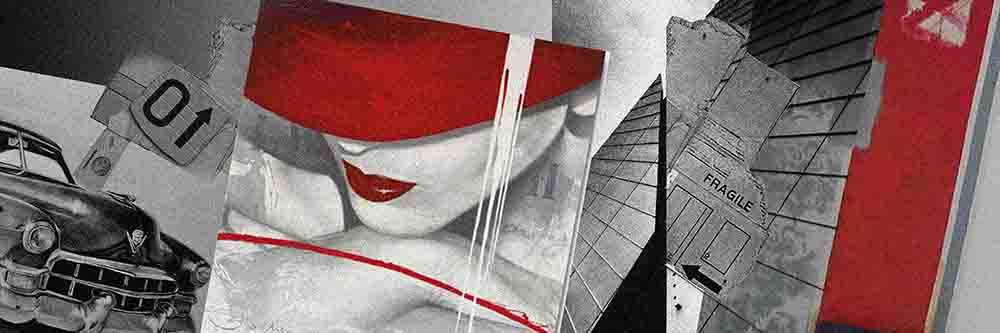

Il s'agit d'une écriture encore nomade, une écriture d'images, de couleurs et de formes, une écriture qui privilégie les visions à la recherche d'un équilibre, rarement d'une signification. Elle vient de surcroit, si elle vient.

A partir de 2020, chaque saison porte un titre, un thème et un texte : Saison 9, Objets mouvants / Saison 10, Mouvements de bascule / Saison 11, La charge de la preuve / Saison 12, Ce que j’en sais
 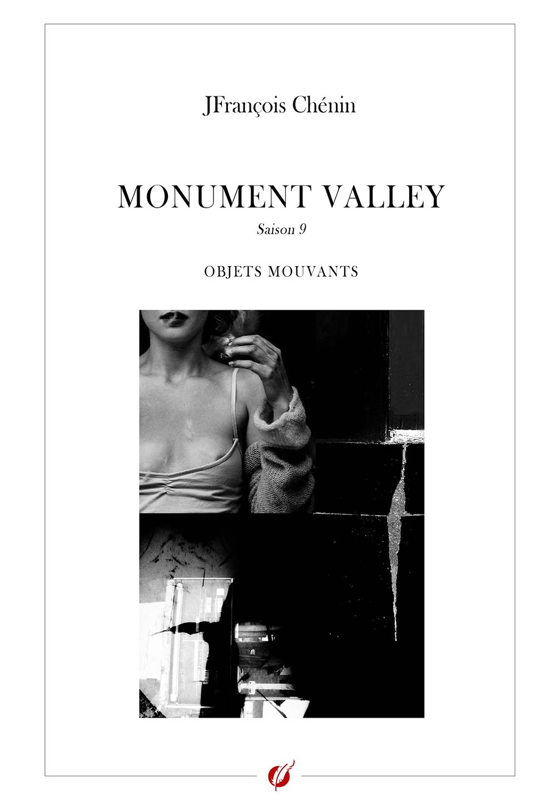

---

13-15 juillet
J'ouvre un nouveau cahier, arrimé à cette errance qui me va bien, de suites en suites. Pour autant, je ne veux rien sacrifier de ce qui me pousse à expliciter mieux ce que j'écris. J'ai besoin de lieux doublés d'instants tranquilles pour ré-agencer ce qui vient alors en rafale, en trombe d'états surgissants, quitte plus tard à élaguer en larges coups de ratures et de ciseaux. Je casse ce qui ne décide à rien et ne retiens rien qui ne serait pas urgent. Mais il s'agit d'une urgence qui compte avec le temps.
Je me veux errant à n'aller qu'à l'essentiel des détours qui absorbent ma pensée et cette écriture, si lente à venir, à prendre forme, est aussi errante dans sa forme et dans ses suites, qui me retourne si bien mon désir de ne pas en devenir totalement prisonnier. Je m'attache à la reconstruire. Je m'arcboute à des étais plus larges et plus hauts où je porte à incandescence les visions qui finiraient par me ronger sur place et ne laisseraient, à regret, aucune trace visible.
Alors débute le lent décloisonnement des mots. Ecrire est toujours en devenir, en instance de dire, et le texte n'avance qu'à coups de sauts, parfois à reculons, dans les rapprochements et les coïncidences qu'il impose.
Les rêves ne m'enchantent plus où je suis prisonnier, mais un détenu délétère qui m'astreint à ne plus relever ce qui me tient à cœur, même à corps défendant, contre moi-même. Je me force à déjouer les pièges d'une écriture qui ne m'écarterait pas d'images et de sentiments ressassés, sans craindre pour autant les répétitions et les retours comme une revanche à prendre. Ce que j'attends d'écrire est entièrement en devenir d'écrire, même si il faut bien, parfois, placer, quelque part dans les blancs d'entre les mots, un point final. Ou plutôt des points provisoires de suspension.
Les suites s'entrelacent et se répondent et forment les plis successifs d'une écriture qui ne fait pas l'impasse sur les silences qui la provoquent, ni manque de devenir là. Je ne théorise pas, j'expérimente les allers-retours de la pensée au texte mais un texte qui n'incarne pas la totalité de la pensée et qui, s'il est tentative de l'être, reste en-deçà de ce qu'elle fomente dans les plus lointains recoins de son devenir. Il y manque des mots et si je la compare à des étais lentement adossés les uns aux autres pour en estimer l'élévation et son équilibre, tant est précaire la détermination à en suivre les détours, c'est qu'il y a dans toute cathédrale un point focal où s'assemblent tous les silences retenus des mots qui n'affleurent qu'au risque, bien réel, de les perdre ou de les utiliser à contre-sens de ce qu'ils révèlent.
J'arpente en double-part, tantôt accroché à la certitude que le texte répond point par point aux trajectoires que je m'impose mentalement de suivre, ou du moins rend compte des détours que consciemment je prends pour arriver à mes fins, tantôt enclin à considérer ma pensée isolément du texte qui est sensé porter la traduction réelle de ce qu'elle dessine dans les innombrables sinuosités des mots qu'elle assemble pour être et devenir car la pensée devient à partir du point où on la laisse errer même si cette errance suit ou reprend des perspectives toutes tracées, toutes volontaires, qui sont ses habitudes de réverbération.
La pensée réverbère dans le texte qui la porte, mais imparfaitement, toujours à reprendre, toujours à préciser ou à détourer de ce qui l'entrave, toujours à parfaire. Ecrire, c'est assembler une pensée qui se détache des contingences matérielles de son apparition et de son expression et si, de suites en suites, comme des fragments dont on chercherait les jointoiements, elle parvient à prendre forme, à figurer une réalité ou une compréhension de ce qu'elle exprime, alors le texte approche au mieux ce tourment de la pensée à dire exactement ce qu'elle ressent, imagine et crée et projette d'inscrire à son apogée.
Il faut toujours revenir à la table d'écriture. Il en va de l'équilibre mental qui fait de la pensée une machine à explosion maîtrisée et assujettie à son rêve insensé de se matérialiser, même dans ses plus extrêmes exigences comme dans ses expressions les plus récalcitrantes ou les plus stupéfiantes. En somme elle résiste par devers nous. Ecrire est lui donner les formes et les étais, les voûtes, toute élévation, les escaliers et les coursives, les passages et les déambulatoires, les ponts comme les passerelles mais aussi les frontières à franchir et les limites à dépasser qui lui manquent mais qu'elle sait cependant imaginer et construire – pour devenir.
Ce que j'appelais dans un texte précédent *La table des étoiles* (*Figures de la disparition)* est cette table d'écriture qui est la planche figurée et figurative des relations exacerbées et silencieuses des mots et de la pensée jusqu'à la figuration matérielle de leur entrelacement, où j'écrivais : Tu les verras disparaître à peine rencontrés, s'extraire de ta pensée, s'évader, jaillir nus, car tu les imagines mal s'affranchir de toi, abandonner ton ventre, tricheuse d'amour. A ce prix, tu enfantes toute la lumière du monde.
Car la vie ajoute à la vie et juxtapose ce qui s'achève et ce qui nait. Nombreuses sont les ébauches que la pensée griffonne par devers soi, qui sont là, qui se dévoilent et cristallisent de nouvelles visions qui surgissent en travers de la route habituelle et détournent le regard vers autre chose. Car le texte ajoute à la vie et déjà entrelace ce qu'il est et ce qu'il deviendra.

21 décembre
*Figure out, suites américaines* achève le cycle des Figures qui, avec Figures de la disparition et Figures des sentiments, a constitué une grande part de mon travail d'écrivain jusqu'à aujourd'hui.
Nécessairement ces trois cycles se joignent, se chevauchent et s'interpénètrent tant l'écriture dévoile, au long des années, les rapprochements et les redites, les perspectives communes et leurs points d'appui, mais aussi les écarts et les pas de côté qui permettent d'en expliquer les partis pris.
Ces trois cycles sur près de quarante ans n'ont pas contredit ce que j'éprouvais alors de l'écriture : Nous vivons de paroles suspendues, forcément inachevées, à contrecœur et de mots débordants, pourvoyeurs hâtifs d'instants mal ordonnés (Voisins des arpents).
Je comprends maintenant que je n'avais pas d'autre choix que de m'aventurer dans une expression scripturale qui reniait la narration et le roman ou mettrait à l'écart la poésie tant la pensée procède de saut en saut, arrimée à ce qui l'exaspère et la déroute.
Comment éprouver l'impatience de la pensée à devenir un texte ? (Roman). Je réponds : en suivant ses linéaments opalins où réalité et fiction ne s'opposent pas et dessinent des suites qui, abruptement, en agrègent les lignes de fuite.
J'ai trouvé mon rythme (mon salut en quelque sorte et, ce  faisant, assouvi une fièvre d'écrire) dans le jointoiement des mots. J'ai basculé du côté des architectes, des charpentiers et des maçons qui assemblent des espaces qui pourraient demeurer vides ou silencieux parce qu'ils n'ont pas trouvé la mitoyenneté nécessaire à leur déploiement ou à leur dépaysement.
Et les balises que j'ai placées comme autant de pièges d'un feu revenant ont donné le rythme des mes déplacements dans la matière du texte, d'une destination à l'autre, qui n'étaient que les objets d'une convoitise qui m'échappait quand j'écrivais, qui me fuit encore, mais que je sais être cette pensée qui me guide.

---

## 2015

Toujours à Karachi, installé au Sind Club.

Je termine *Donner un Corps* sur les peintures d’Ainee Khalid, exposées à l’Alliance française. Une peintre pakistanaise chrétienne qui peint de magnifiques femmes nues, tourmentées d’érotisme et de passion silencieuse.

 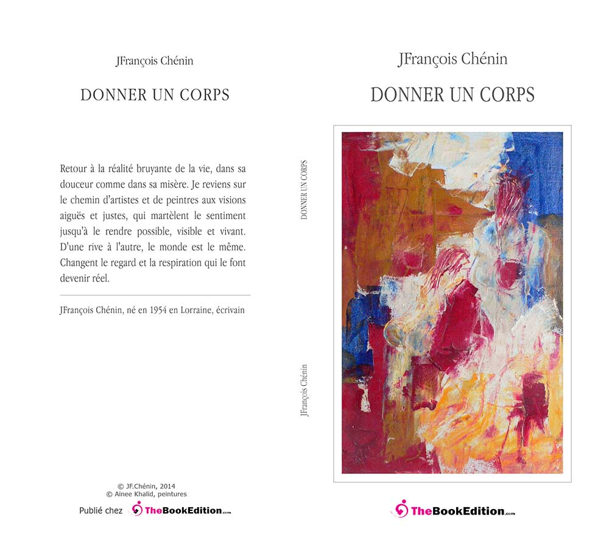
che [The BokkEdition ](https://www.thebookedition.com/fr/recherche?controller=search&orderby=reference&orderway=desc&search_query=chenin&p=2)

Je commence *KHI ou déposition d’une ville* que je publierai en français en 2016 et dans une traduction anglaise en 2017. 
 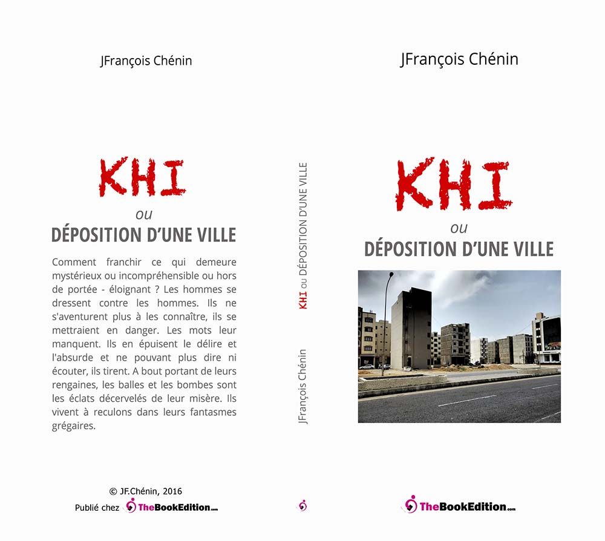

Chez  [The BookEdition](https://www.thebookedition.com/fr/recherche?controller=search&orderby=reference&orderway=desc&search_query=chenin&p=2) 

J’écris *Le Jardin Capital*, texte que je reprendrai dans le livre 1 de *Digressions du Réel* publié en 2022. Je sais, en écrivant cette suite, que le *Cantique des Cantiques* est encore à l’œuvre.

 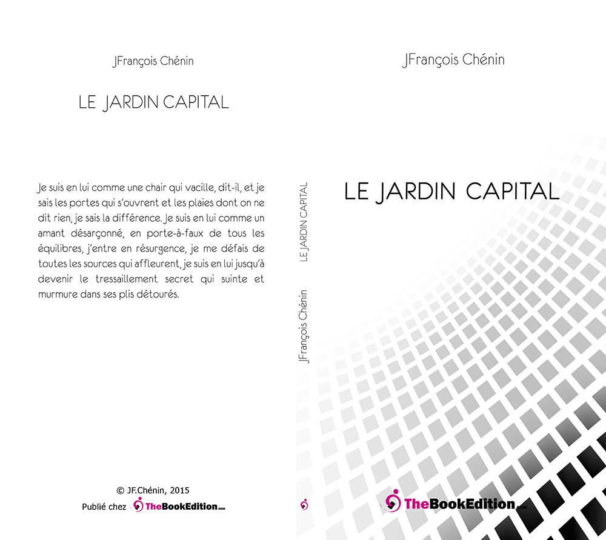

Je fais acte de solitude au Sind Club et je bois beaucoup en compagnie chez Okra ou Côte-Rôti. Ma vie ne se désemplit pas de ses langueurs.

---

12 juin
C'est d'abord un haut plafond aux poutres banches et des taches de lumière sur le parquet qui viennent des six fenêtres qui donnent sur le jardin. Un jardin comme une passerelle. C'est ensuite de longs moments de calme entrecoupés du bruit lointain de la circulation sur l’avenue. Le soleil pointe en fin d'après-midi sur la façade anglo-byzantine du bâtiment dont la pierre jaune orangée rehausse les effets du couchant.
La pièce est grande, sobrement meublée, rien n'encombre sa traversée hormis ce petit guéridon où j'ai posé mes livres. Un guéridon-bibliothèque !  L'autre pièce, plus petite, est carrelée de blanc et noir. Elle me sert de bureau. Rien d'inutile, une table, deux chaises, un petit canapé tout au fond, rien qui entraverait le long regard que je porte sur le silence qui vient la nuit venant.
J'ai trouvé mon refuge, ma maison de Karachi où, la nuit, j'ai encore du temps pour lire et écrire, dans une ville qui s'apaise à peine à partir de deux heures du matin. Parfois - il est trois heures - je sors dans le jardin, je traverse la pelouse vers les grands arbres de l'avenue. J'aime alors m'asseoir sur un banc et j'imagine la ville qui finit de souffler et qui, dans son demi-sommeil, répare ses blessures, oublie ce qui la tourmente et efface son trop plein d'exaspération.
Un passage d'air autour de moi m'enchante qui écarte les quelques nuages pour laisser passer une pleine lune miraculeuse. Je suis au bord du désert comme une vague chargée de tous les sentiments des êtres qui m'entourent, que je ne vois pas.
Alors je remonte dans ma chambre, il est l'heure où le muezzin lance l'appel à la prière et, depuis ma maison, je reprends mes lignes d'écriture qui m'entrainent dans les dédales d'une ville inassouvie qui va resurgir de la mort.
Je n'écris pas mieux qu'au Sind Club. Il y a comme un flux magique qui défie le temps, qui ramène ce qui était la richesse de cette ville : un havre entre le désert et la mer. Parfois, le samedi ou le dimanche, je vais m'asseoir dans un des grands fauteuils noirs du fumoir, près de la réception. La véranda laisse passer la lumière blanche du ciel et les feuillages alourdissent d'une ombre bleue les clairs effets du soleil. Je suis bercé de silence, j'oublie qui je suis et mon esprit vagabonde dans les peintures accrochées au mur, en face de moi.
Le temps s'efface au Sind Club et pour un écrivain cela donne tout son sens à l'écriture : un temps ni figé, ni pesant, estompage de l'esprit. Alors les mots viennent qui racontent l'histoire présente des sentiments. Je m'évade dans la petite écriture fine de mes cahiers. Je n'écris pas mieux qu'au Sind Club. J'y reviens apaisé du monde qui s'ébruite alors dans le couchant du soir.

25 juin 
Des murs succèdent aux murs, des vents chauds s'y perdent, des ombres s'y diluent dans les restes d'ombre des arbres blanchis à la chaux du ciel. La vie est mate, à peine le ciel respire, à peine il résiste. Des murs succèdent aux murs dans d'indécidables dédales avec ses entrailles rouillées, sonnantes et décharnées. On s'abrite comme on peut de la peur d'une vie qui se ferme, on ferme la porte.

Ce qui les sépare est un rite ancestral d'un respect forcé où chacun, isolé, cherche à se convaincre que c'est mieux ainsi. Mais ce rite n'est pas leur rêve, ni leur désir. Ils ont renoncé à se réinventer et je sais, dans son regard et son fin sourire, que par instinct elle pourrait rompre les faux sortilèges, cette invention humaine de l'injustice. Elle sait, dans le fond, faire la part des choses.

Nous les quitterons à la venue du soir. Sur la photo sa main fait signe, à peine visible et à peine retenue, qui l'empêche de tomber dans l'avant du monde et qui lui dit reviens.

13 novembre (écrit le 14 novembre 2015)
Il y a l'horreur sur notre vie qui tremble. Nous les perdons irrémédiablement. Nous ne sommes pas assez heureux pour les protéger, pas assez libres, pas assez fous. Les protéger en étant parmi eux dans la douve ensanglantée. Ils brandissent leurs cris d'espoir en même temps que leurs bras morts qui retombent sur nous. Tous sont nos enfants qui demandent des rêves à la vie brusquement dispersée, fragmentée, brusquement anéantie. Tous sont nos enfants qui ne se relèveront pas.

15 novembre
Ce-qu'il-y-a d'indicible
Face à la mort réitérée, on se dessèche. L'esprit ne contredit plus, devient misérable et erre d'incident en incident. Nos pauvres repères sont des hommes et des femmes abattus d'être ce qu'ils étaient.

16 novembre
Volte-Face. Comment franchir ce qui demeure mystérieux ou incompréhensible ou hors de portée - éloignant ? Les hommes se dressent contre les hommes. Ils ne s'aventurent plus à les connaître, ils se mettraient en danger. Les mots leur manquent. Ils en épuisent le délire et l'absurde et ne pouvant plus dire ni écouter, ils tirent.  A bout portant de leurs rengaines, les balles et les bombes sont les éclats décervelés de leur misère. Ils vivent à reculons dans leurs fantasmes grégaires.

---

## 2016

-Toujours à Karachi, installé maintenant à l’Alliance française.

De fortes douleurs dans le dos, persistantes et inexpliquées, m’obligent à aller en France. Cancer du poumon soigné de mars à août.

Je reviens à Karachi en septembre. Je loge alors dans une petite maison chez mon ami Naseer. Les parfums et les couleurs qui m’attachent à ce pays me reprennent et m’enchainent un peu plus.

J’écris un seul livre *Entre-deux* commencé à l’hôpital de Dijon, alors encore sous morphine. Ce texte figure comme livre 1 dans *Les Dissonances* publiés en 2019.

 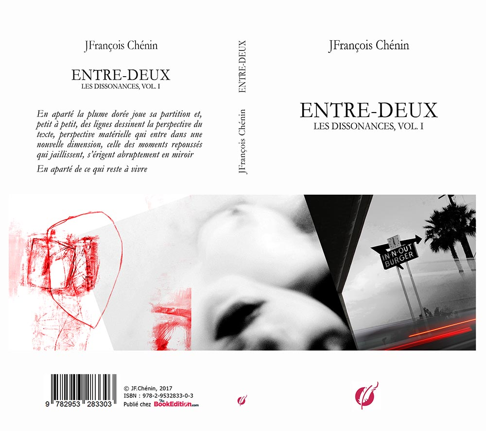

Le journal accueille toutes sortes de tentatives graphico-scripturales comme Le Carré. Ces exercices me reposent.

---

7 octobre
J’amalgame, je prends, je me déprends, j’organise la fuite à reculons, de travers, en toute lucidité du désir qu’on enfouit, qui s’abrège et se désagrège. S’enfuit. La militance n’a pas de désir, juste des renversements ou des révolutions. Elle est fomenteuse de discours dépourvus d’ambition, d’admiration, il lui manque la jouissance. Je n’apprécie pas les promesses non tenues. 

En contrepartie de nos allégeances, nous naviguons sans boussole. Les questions sont toujours lancinantes comme les douleurs et les remords. Ils pointent le manque, la désorganisation et les dépravations. Ils sont sans pudeur. Ils sont utilisés à contrer le bonheur. Nous soutenons la contradiction, jusqu’au bout. 

Dans Les Qualités Discrètes j’écrivais : A la recherche du bonheur et sa variante, le silence ; à la recherche de cet instant dissident, à la frontière, parce que le monde est incomplet et sans distinction, prêt à vaciller, qui n’abrite rien que des lignes de démarcation, d’une borne à l’autre, d’une ségrégation à l’autre, monde inchangé de la douleur et du renoncement ; à la recherche du bonheur comme on respire parfois à pleine voix élevée, pour faire exception et vérifier une fois encore que nous resterons étrangers et hérétiques, en mouvement, en chute libre, d’extraction en extraction. Seule réponse de continuité à l’approche du silence promis. Nous resterons étrangers et hérétiques aux promesses de révolution.

Parfois se détourner, en prévision. Nous sommes dans le détail, forcément, pas à pas, de branche en branche, afin d’éviter les dérives. La pluie qui tombe assure nos réminiscences, entre les voiles des gouttes et des souffles où la mémoire sille à l’aventure de ce qu’elle nous laisse entrevoir. Nous étions pourtant inaperçus, presque inavouables, on pouvait nous croire parjures et démobilisés. Nous feignons l’indifférence, et tout étranger que nous sommes, nous ne vivons pas éloignés ou retirés.

Ce besoin de bonheur est là dans le travers de la douleur qui s’installe, s’accroche à la chair et dans les os, ne s’immisce pas mais tranche. L’urgence est le passeur du bonheur. Voilà ce que j’ai appris. Nous attendons trop de demain, rien d’aujourd’hui, c’est notre tort et notre faiblesse. Tout est dans l’écriture du silence dans Le dessert de gaufrettes de Lubin Baugin.

La terrible sentence du silence sur la mémoire : tu n’as pas l’âge.

Dans l’entre-deux, j’obtempère, déplacé sur la courbe digitale qui coupe en deux le monde, qui scinde les sentiments, traverse d’autres courbures plus indicibles - mais là -, qui s’évasent et frôlent les orées tumultueuses du ciel, j’obtempère, je veux dire je me redresse de tout mon poids pour effleurer et sentir tout ce qui coule autour de moi, qui passe, qui s’enfuit, qui finit par manquer et cet entre-deux où je suis encore assis, écoutant les bruits diffus de la maison, qui viennent difficilement jusque là, je me redresse, je veux dire j’exulte de tous mes sens pour saisir ce qui va disparaitre, ce qui faisait de moi une existence.

Cet entre-deux est dans tous mes livres, à la fois ouvert et fermé, dedans dehors chaud et froid, lumineux et sombre, à la fois poste d’observation et lieu d’enfouissement, à la fois début et fin du monde matériel, j’y reviens depuis toujours. Il est au seuil des marches du monde, vers le bas, vers le haut, il se tient dans un espace fini ouvrant sur des perspectives éclatées dans tous les sens de l’horizon. J’y suis assis et j’explore. Il s’appelait l’entre-deux. Où es-tu ? Dans le fauteuil dans l’entre-deux. Je peux encore aujourd’hui en faire le plan et placer tous les meubles tapis objets et tableaux qui y étaient.

Le monde se découpe en tranches verticales, la mémoire en tranches  horizontales. L’entre-deux est à l’intersection où je bascule.

Ce que l’on sait du bonheur tient dans une tête d’épingle. Il n’y a pas d’ombre où je vis, que des cris d’oiseaux perturbés et envolés. La mémoire pourrait être un cri fibrillé de bas en haut par le battement des ailes des oiseaux décrochés de leur trajectoire. La mémoire est nécessaire au bonheur sinon il n’y aurait rien. Et sans trajectoire il n’y a rien.

10 décembre
Nous n’accordons pas assez d’importance aux mots, leur ordre apparent est l’apparence du sens. Il en faut plus pour les débusquer et leur rendre la grâce éreintée et désordonnée mais nécessaire du sens qu’ils manifestent en les rapprochant, en les heurtant, en les frottant les uns aux autres.
L’écriture magnifie les mouvements contraires et le mensonge est encore la vérité, et l’asphyxie une respiration.
L’émotion vient du côtoiement. Et côtoyer revient à trembler. Les mots tremblent dans la tête, vibrent et vibrillent dans une profusion d’émotions soudaines. Ecrire c’est éclater le vide sidérant.

J’écoute le concerto pour piano n°1 de Chostakovich. Je suis subjugué par les mots bousculés d’un silence à l’autre, dans le reste de vide qui les sépare mais dont ils comblent très vite la matière morte. Le silence est à ce prix de détourer les mots de ce qui les encombre ou de ce qui leur manque pour se transfigurer.

---

## 2017

Septembre, retour en France. Je m'installe à Granville.

Les derniers mois au Pakistan, j'ai surtout voyagé dans le Nord et l'Ouest du pays.
Je me souviens des étendues empierrées et désertiques au nord de Gwadar vers la frontière iranienne.

Je commence *Il n'y a rien c'est-à-dire il y a quelque chose de caché,* que je termine en 2018 et qui sera le livre 2 de *Digressions du Réel* publié en 2022.

 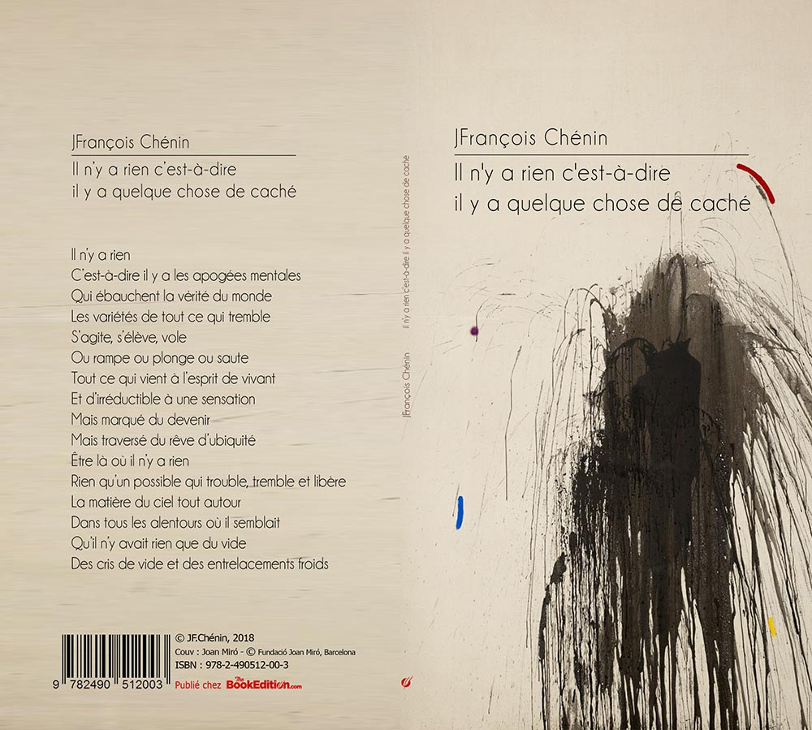

*Un parfum hologramme* est écrit durant les premiers mois en France et je commence à rassembler les textes de *Ecrire & Ecriture* qui sera le livre 2 des 
*Dissonances* paru en 2019.

 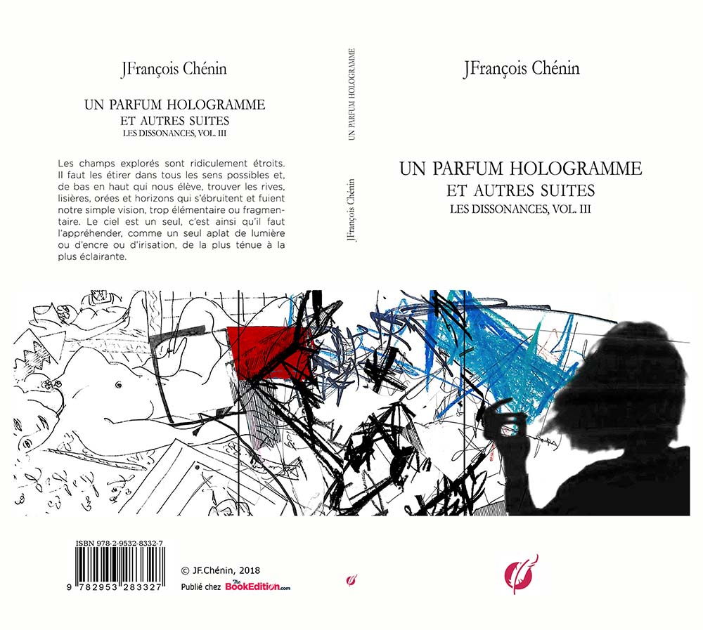

Le temps qu'il fait revient souvent dans ce journal.

---

1er septembre
Premier jour de ma retraite, pensionné civil. Je ne suis pas un retraité mais un pensionné civil (à la différence du pensionné militaire, je ne ferai pas état de mes blessures). A Granville, chez Sophie et Samuel. J’occupe la grande chambre de Samuel, agréable, ensoleillée. Je ne me sens pas vraiment chez moi, avec toutes les affaires que je ramène et toutes celles qui sont dans le garage, encartonnées. Où mettre tout ça ? Les livres que j’avais à Karachi tiennent sur une étagère laissée libre pour mes papiers. La première question venue à l’esprit : où vais-je écrire, quelle place, quelle vue, quelles senteurs et bruits autour ? Une belle ondée, forte, aujourd’hui, qui a en partie nettoyé le ciel. Je me sens bien au bord de la mer mais je pense qu’il va falloir que je me trouve un coin à moi, un lieu qui sera à ma façon.

3 septembre
Temps grisâtre, un peu doux, pluie silencieuse et droite. C’est la rentrée disent les uns, c’est la retraite pensent d’autres, c’est la fin de la guerre ailleurs, des essais atomiques là-bas. Ils vont finir par nous gâcher la vie. Départ au restaurant, à Julouville. C’est un rituel du dimanche : le déjeuner. Dans mon enfance, c’était côte d’agneau - flageolets et baba au rhum… Ça va me plaire ce journal, enfin une nouvelle écriture, une nouvelle manière d’aborder le monde. Comme j’y vais fort "le monde". OUI, LE MONDE.

5 septembre
Je ne suis pas vraiment là. Il faut un peu de temps pour mettre en place ce qui n’est plus, se donner de nouveaux repères. Et oublier.

9 septembre
Averses soudaines, soleil, grands nuages blancs et rembourrés emportés majestueusement jusqu’a la fin de la mer qui n’est pas plus haute ni plus violente, lente et respectueuse des soubassements du monde et des arches élevées d’une lumière qui tourne sur elle-même. Des passagers débarquent, surpris de perdre déjà ce qu’ils n’avaient pas vu, qu’ils voient trop tard.
Comment se repérer dans le quotidien et comment en avoir la mémoire ? Est-ce vraiment intéressant ?

13 Septembre
Beau ciel gris cendré et moiré. Parfois un grand rideau de pluie à l’oblique sur les arbres. Rien ne bouge, tout crépite. Je vais trouver mon rythme. Ça veut dire que ce n’est pas encore ça, pas encore dans la tête, pas encore là, pas encore en répercussion par plis dans le corps. Tout prend du temps et se refaire une identité n’est pas simple, une identité d’un lieu et d’un horizon devenu presque indépassable. Un horizon qui dresse ses lignes de perspectives bleu-cendré, des lignes de tressaillement qui dansent, qui exhortent à contempler.

15 septembre
Grosses grappes de pluie, intermittentes, lourdes et brutales, sans patience, qui s’affalent lourdement sur le sol, sans grâce, surtout sans souffle. Une pluie rudimentaire. J’ai commencé une petite série sur Emile Moselly, l’arrière-grand-père, écrivain. A la fois proche et lointain et comme je me sens plus proche de son père, Achille. Que de découvertes aussi.
L’arbre généalogique, en ligne directe, remonte au 
16ème siècle avec Demenge Chénin de Viterne, soit dix générations depuis mon père.

1er octobre
Du silence sur du silence qui vient par sursaut. Pluie fine, bruine, temps gris, on avance dans la saison comme on dit. On dit tant de choses mais on dit quoi ? Même pas le principal, des bribes d’instants comme les ondes pluvieuses qui se dispersent.

Je vais reprendre "*Ecrire*". Trouver un titre.

3 octobre
Démembrance (et remembrance) : ce qui échappe de toutes les façons, qui s’enfuit. Qui est le geste à reculons de la mémoire. Ecrire est de cet ordre : se perdre dans les rebuffades du temps. Une noyade, une absence soudaine d’air.

4 octobre
Rien n’est grave comme avant. 
Et tout s’enflamme cependant.

5 octobre
Départage, dérision, dé-réalité… 
Une grande aventure, de trop en fin de compte. La linéarité des trajectoires - ou leur perpendicularité, leur croisement, mais par milliers, et même dans l’angle aigu du regard qui les porte - cette linéarité n’est pas suffisante. Elle contracte les visions, elle ne les déplace pas, elle ne les met pas en perspective.
Impulsion, pulsation, respiration éponyme qui donne leur forme aux airs et aux cieux en dehors de tout arbitrage, humain, divin, animal. J’escompte rester sur place.
Pluie, soleil, vent, alternance de températures fraîches ou tièdes, marines ou apaisées. 
J’appartiens au désir des saisons.

6 octobre
C’est bon de savoir que des mondes roulent sans moi… Ça soulage.

7 octobre
Samedi, jour de marché. Ciel gris, élevé, froid, un gris blanc qui annonce l’hiver. Pas de vent. Et ce soir bruine disparate. Samuel a repris la voile. Il semble aimer ce qu’il fait, s’y investit en tous les cas.
Trouver un appartement face mer, avoir une table sous la fenêtre, sentir les marées.

15 octobre
L’idée des deux logements avance. La colocation n’est pas l’idéal. Il faut se préserver des retours malencontreux de ce qui n’est plus d’actualité (à exposer).

18 octobre
Comment s’effacer ? Qui laisse des traces sera rattrapé. Déjouer les traces laissées, taire et se taire. 

26 octobre
Hôtel sur le port de Granville. Un peu de calme. Des nappes de brouillard sur l’eau et le long des mats nus, une mer à peine ouatée, juste effacée du bout du doigt qui s’enveloppe à elle-même. Tout est frisson, pas froid. Bientôt un nouvel appartement. C’est dans la tête que tout s’organise, ensuite viendra ce qui viendra.

28 octobre
Il faudra trouver un rythme, définir des horaires et des promenades, s’organiser dans le silence du matin et l’animation du Cours Jonville le samedi. Ne pas remettre, ne pas fuir, faire travailler cette mémoire qui m’échappe, garder un crayon et une feuille à portée de main, noter, y revenir, passer de l’autre côté plus vite. Retrouver l’état mental de l’écriture. Une fois dans la place, rien n’existe autour, rien ne balance ses traits noirs. Seule l’écriture détient les évanouissements noirs de l’esprit, des traces, des traces, plein de traces inassouvies et nécessaires. Laisser ouvertes, pendantes, prêtes toutes les voies aperçues.
J’écrivais "j’arpente en pente douce". Quel est le sens de la pente ? Quelle est la direction ? Ce piano sonne la mélancolie, les feuilles d’automne, la fin de la lumière, l’ombre indécidable où l’esprit se défait. Très platement je pourrai dire "j’ai vu passer ma vie". Est-ce si vrai ?

1er novembre
A la surface, rien ne tremble. Fixité du regard, respiration lente, focalisation sur une absence de pensée construite, ralentissement de l’esprit à peine interrompu par des banalités, de strictes banalités. Imperceptible vibration exogène qui immobilise. Un doigt glisse sur le clavier à la recherche de la bonne touche, du son, de la note ou du mot. Une note qui ne serait qu’une note, un mot qui ne serait qu’un mot, qui ne dirait pas plus, qui n’emporterait pas ailleurs. Ne pas bouger de cette place, en faire un 
repère, une coque qui repousse les bruits, les sensations, le regard qui fouillerait ailleurs mais reste fixe, s’il pouvait être inerte, s’il pouvait ne plus se détacher du vide qu’il fixe. S’attarder à un linéament d’une vision arrêtée, un fil à peine ébauché qui vrille lentement dans sa chute, qui remonterait peut-être, qui s’affranchirait de la gravité. Tenir le temps qui passe et lui donner ce poids du ralenti. Ce qui serait une banalité, en somme.

2 novembre
Deux vieilles dames, plutôt populaires, l’une assise sur un banc, la seconde debout plantée sur ses deux cannes. Je passe à côté d’elle et j’entends : "on a passé du bon temps quand même"… Je m’éloigne, je me retourne pour les voir rire entre elles. Celle assise me regarde, petit clin d’œil, sourire.

12 novembre
Passé le 11 novembre à aménager l’appartement 
(2 pièces, une salle de bain avec douche - j’y tenais -, une petite cuisine, premier étage d’une vieille maison dans le centre de Granville, Cours Jonville). Mis des rideaux, des lumières, branché les machines, trouvé une place pour quelques affaires. Des réflexes d’utilité, de facilité et d’emmerdements minimum. Encore un meuble à déplacer, mais il ne passe pas la porte entre les deux pièces. 
Nécessaire d’enlever la porte, je n’y arrive pas tout seul. Je n’ai pas la bonne technique ou c’est vraiment bien collé. J’ai fait pourtant des progrès dans la levée de cette porte mais c’est insuffisant. Je vais attendre Samuel qui me donnera un coup de main. J’ai le bon levier maintenant. J’ai rêvé que je re-fumais, volontairement, avec plaisir. Une Gauloise. Dans le fond du rêve il y a des paquets de Camel sans filtre. Est-ce que je vais en acheter ? La fumée est bonne, j’aspire deux ou trois fois et je m’arrête. Je range les cartouches sur de grandes étagères en bois blanc. Quel intérêt finalement, j’ai cessé de fumer et je m’en passe. Je me dis que je me réveillerai sans. C’est un rêve tout en surface, lisible.
Bu mon premier café au lait ce matin dans cet appartement. Modeste moment solennel avec injonction d’avancer dans mes intentions. Le café était bon.

13 novembre
Longue séquence d’écriture et d’assemblage. Réitération, évanescence ou la grandiose perspective qui effraie murs, vagues et dunes, jusqu’au couchant qui la porte. Sous les feux jointoyés et élevés d’une fin d’après-midi. Le froid était légèrement coupant, presque acidulé.
Et comme tout maçon, je finis par avoir mal aux reins ou bien est-ce le métier qui revient ? Paul Auster et Philip Glass m’accompagnent encore.

16 novembre
La lisière du ciel est sanguine et mes amours sont mortes.

25 novembre
L’empreinte du visible.

26 novembre
Journée à pluie intermittente et froide. Le pavé (s’il existe encore) est glacé. Je m’installe dans une illusion, celle d’être maître de mon temps. Quand serai-je débarrassé de ces balivernes ? Passé un long moment à écrire "Dimension(s)". J’aime plus que tout écrire avec un stylo sur du papier et le carnet trouvé à la librairie de Granville me convient. Mais je retourne en arrière dans ce texte et je ne dois pas. Je fais une pause chocolat pour me projeter en avant. Mais "en avant" de quoi ? Mystère de l’esprit qui échafaude.

30 novembre
Passer, dépasser les jours. La question est : "comment se construit un voyage ?" Dans le train pour Paris. Granville-Paris, trois heures et un peu plus de trajet. Temps à l’écart, chargé de la musique qui m’évade (Mozart, Glass, Bach), long moment intemporel, je ne prête attention ni aux arrêts, ni aux personnes qui descendent ou montent. Je lève les yeux sur le défilement des bas-côtés et l’effilement vertigineux des arbres sur le ciel, sorte d’hypnose dans laquelle l’esprit déroule des brisures de mots et d’histoires. J’ai le temps dans mes visions et un grand ciel se lève pour moi.
Je me discipline. Je sais quand vient le moment d’écrire et d’entrer dans mes silences, exercice bien particulier de détruire tout ce qui bouge autour de soi, d’ignorer et de choisir les angles de vue et les perspectives. Exercice mental d’absorber les environs et de ne retenir que les lumières rasantes et irisées du monde. Je suis dans le détouré de paysages inconnus et qui deviennent, à mesure que le voyage progresse, les linéaments nécessaires à la construction (temporaire mais irrémédiable) d’une pensée. Je ne suis pas crédule et je plonge en toute connaissance de cause dans les sinuosités de ce qui, dans ces moments construits, me transforment. J’exulte et je vis charpenté d’imprévus qui participent à mon écriture. Ces moments sont précieux et viennent plus fréquemment. En ce sens j’ai besoin de temps et d’ordre pour en profiter. Je n’écris jamais pour rien. Il y faut le déclic mental de la vérité, ma vérité. Pas d’enjolivures, ni rien qui serait ornement ou futilité. Le monde, dans sa complexité, 
est trop présent et sensible pour en rajouter. Je me limite à l’essentiel.
A la recherche d’une identité dans un temps nouveau pour moi ? Un temps différent ? Moi qui ai vécu près de 20 ans à l’étranger, je (re)découvre le voyage et d’en avoir le choix. J’ai aimé les destinations, je vais aimer les voyages.  Arrêt à Surdon. Surdon, frontière indécidable de mon écriture !
S’affronter aux mots, débusquer ceux qui manquent, qui ont manqué. Ecrire est cette recherche de combler les vides dans les respirations successives des mots. Souvent j’évoque une île, celle qui donne enfin la respiration au naufragé, celle qui accueille la déshérence, qui reconstitue l’esprit qui s’était délité et éparpillé sous la pression de la noyade. Une île pour tout horizon et tout l’horizon autour quand on tourne à 360° sur soi-même. Je me souviens de "Trois couleurs - Bleu" et la musique de Zbigniew Preisner. Une longue et lente descente vers la (re)naissance. Là, il y avait une île, un matelas au milieu d’une pièce vide. L’occasion de se re-définir et la possibilité d’aimer. La construction réverbère les lumières qui la pénètrent et la fondent. "Et maintenant des altos…Attends, attends, peut-être plus léger, sans les percussions… Et les trompettes ? On en garde une… Piano, piano, sul, sul tasto … On reprend au la avec une flûte..." Tout la vie se déroule ainsi dans les répercussions qui séparent la réalité de la fiction et la vérité de l’histoire. Comme une valse, comme le Boléro de Ravel en réminiscence, ajusté dans ses répétions de mots. Répéter les mots et devancer la voix élevée qui les délivre de leur pesanteur. Etre cette voix. Parce qu’on a beaucoup perdu, on peut (re)trouver quelques objets, quelques mots ou quelques pensées qui n’étaient pas à leur place et (re)deviennent les nouvelles lignes de perspectives (re)naissantes. Et voilà tout écrit Virginia Woolf.

Halte à Verneuil-sur-Avre. A 10h59, le monde fait une pause.

4 décembre
Retour. Longue halte à Argentan. 
Avec Gilles ces derniers jours sur la trace de nos souvenirs d’enfance, Chaudeney, Toul, Nancy. Et puis plusieurs découvertes à Villey-le-Sec, Bicqueley, Pierre-la-Treiche, jusqu’à Viterne. Des surprises qu’il faudra mettre en forme, montrer et écrire, des images. Tout était sous la neige, juste tombée la veille. Gilles est plus attentif que moi aux détails alors que je me contente des grandes lignes délaissant l’accessoire. C’est aussi un style d’écriture. Les descriptions m’ennuient.  Heureux de cette escapade de trois jours. Nous sommes les derniers de la famille à faire ce voyage vers quelques lieux que nous connaissions par cœur, qui s’étaient effacés, et immédiatement reconnaissables, revenus à la surface quand nous y sommes. 
Je pense que nous tenons à ce petit endroit de terre dans le creux d’un vallon de la Moselle et nous imaginons, à travers ce que nous avons lu de Moselly, cette vie difficile et parfois révoltée qui fut celle de nos familles.
Ai pensé à prendre le nom de Chénin-Moselly. Coquetterie ou recherche d’une identité plus en rapport avec ce que je ressens ?

6 décembre
Police des mœurs, le pire est devant nous.  
Vie et mort d’une nation et d’un peuple, le pire est devant nous. Et la Terre nous refusera de vivre.

17 décembre
La matière nous gouverne et ne s’en laisse pas raconter. Si les fibrillations de notre nature ne lui conviennent pas, elles en tire les conclusions, elle cède (et nous avec).
La matière est à l’œuvre dans tous les recoins de notre existence. Et nous renverra au néant au moment de son choix.

18 décembre
Il y a des images qui remontent de la vie, floues et nettes à la fois, dans des tons gris et bleus, des tonalités du matin aux liserés découpés sur fond noir, sans excuse.

20 décembre
Où se fabriquent les jours qui ne reviennent pas ?

21 décembre
En revenant sur Granville, je n’ai pas vu la mer comme les autres soirs, noyée dans le ciel.

25 décembre
Lu de Gilles Deleuze, Qu’est-ce que l’acte de création ? (1987) : "Il faut qu’il y ait une nécessité, sinon il n’y a rien du tout". 
Passé du temps à mettre en ordre et en page "Ecrire & Ecriture". 
 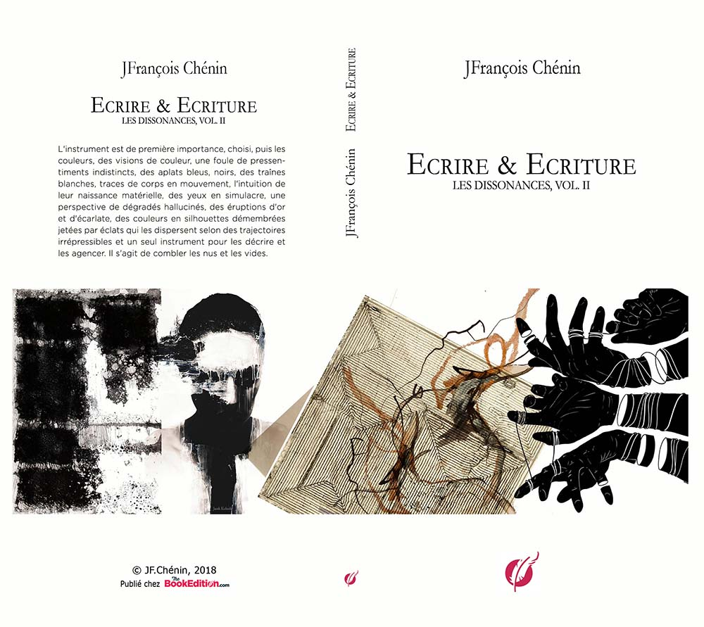
J’arpente cette nécessité, la création nette et la résistance dont parle Deleuze. Dans l’apparence du texte, dans ce qui sourd et sursoit, dans ce qui revient et échappe comme un mot perdu, ou des mots dispersés, dans cette apparence, dans ce décor sans fond, comme un creux, le texte - qui est cette apparence - se déplie, organise les lignes que nous suivons. Je suis au pire un trublion, au mieux un doux rêveur. Dans la littérature (ou l’art du texte) tout oppose le romancier au poète, le poète au philosophe, le philosophe au romancier… Le concept est une représentation mentale d’une formule immatérielle originale que le cerveau déplie dans ses circonvolutions. La matière est pure productrice de concepts. La matière m’en impose. Ni les uns, ni les autres ne manient avec autant d’ardeur l’intrication des concepts dans l’écriture que celui qui se hasarde sur les chemins de sa propre écriture. Qui chemine dans les détours, les croise, les enchevêtre et délibère dans des perspectives désarçonnantes.  (Je vais enfin me résoudre à écrire, pensa-t-il, en faire un acte d’existence et accepter l’idée qu’écrire n’est pas perdre du temps, mais en gagner sur ce qui vient.)
"Ecrire & Ecriture" (Vol. II de Les Dissonances) est une défibrillation de ce qui restait non-dit. Mais le dire sans plus de mots, ni d’exemples que le texte lui-même. Un concept est toujours un ré-agencement, ce que l’essayiste sait le mieux faire.

28 décembre
Depuis 4 ou 5 jours, une grosse mouche noire s'accroche à moi. Elle apparait, disparait. J’ai essayé de l’écraser, je n’y suis pas arrivé. Elle va et vient. Quand je suis dans la cuisine, elle vient dans la cuisine. Nous ne sommes pas vraiment amis, on se tient à distance l’un de l’autre. Je vais bien finir par l’avoir. Je viens de me rendre compte qu’elles sont deux. C’est insupportable cette invasion.
Départ pour Paris demain matin. Je vais passer la soirée avec Baptiste et trouver un bon restaurant.

31 décembre
J’émerge vers 13h30. Retour de Paris sans encombre. J’ai voyagé, jusqu’à Argentan où elle est descendue du train, en face de Jane Birkin, qui plisse les yeux quand elle réfléchit. Une bien belle femme toute de grâce rentrée.

---

## 2018

A Granville.

Mes intentions sont d’apprivoiser mes solitudes. 

J’écris, je dessine.

Je prépare *Les Dissonances* (qui comprend *Entre-deux, Ecrire & Ecriture, Un parfum hologramme et autres suites, Dimension(s)*), livre édité en 2019.

 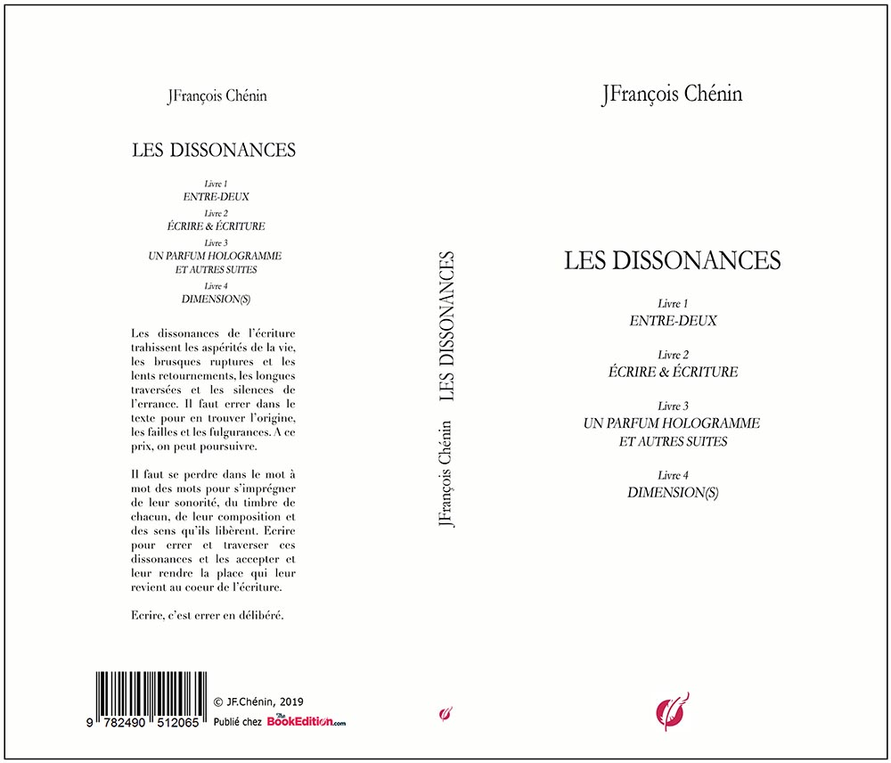
J’entame *Digressions du réel* (avec *Le jardin capital suivi de La réalité apparente du feu, il n’y a rien c’est-à-dire il y a quelques chose de caché, A minima - récit d’une digression et Le tiers regard suivi de l’empreinte des ombres*), qui sortira en 2022.

 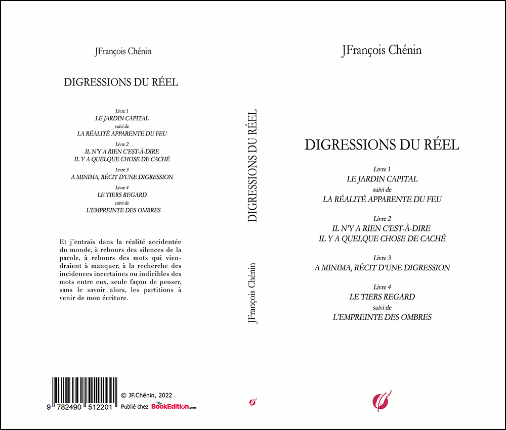

Cette année là je publie *Compositions, notes et poèmes* qui comprend tous les textes écrits entre 1974 et 1978.

Nous éditons avec Gilles *NC - 49.78 / Volume 1, NC-49.69*. Ce livre retrace les vingt premières années de la vie de Nicolas, notre frère. Le texte principal est de Nicolas, rédigé vraisemblablement entre 1972 et 1973, à la demande de son médecin. 
 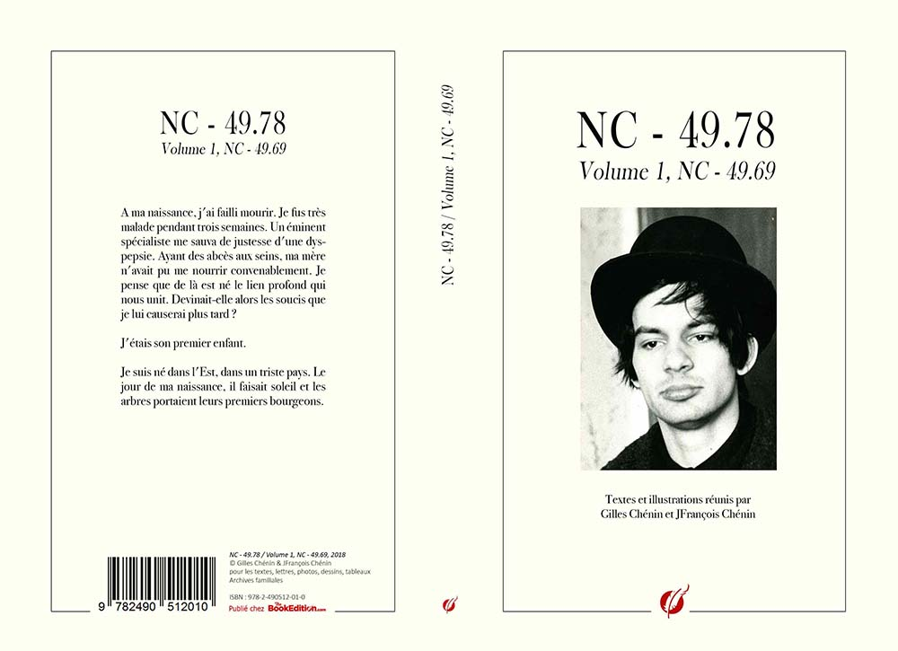
Chez [The BokkEdition](https://www.thebookedition.com/fr/recherche?controller=search&orderby=reference&orderway=desc&search_query=chenin&p=2)

---

1er janvier
De l’intérêt de s’aventurer plus avant. Avant ! La bonne (vraie ?) résolution pour ce début d’année. Le reste ira comme il ira, nul besoin de vœu, ni d’intention. C’est un travers d’espérer mieux sans vraiment le formuler.
Chaque paragraphe, une idée ; chaque nouveau paragraphe, une nouvelle idée, en écharpe ou différente. L’essentiel est d’arriver à destination.
Souvent tenté de faire un bilan, lequel en réalité ? Le seul qui me vient à l’esprit est que tout a été trop vite, oui trop vite, beaucoup trop vite. Et je m’arrête à ce fait : c’est bientôt fini.
*Ecrire & Ecriture* est bientôt terminé. Reste à rédiger une postface pas trop débile - qui ne sera justement pas un constat - pas trop alambiquée ou réductrice. Ou qui serait encore le nième testament d’un auteur qui n’aurait plus rien à dire.  Au contraire, ouvrir d’autres perspectives, déceler d’autres traces, balayer en somme.
Ce ne sera jamais comme avant. 
Pourquoi cette idée tout à coup et j’ai écrit ce ne sera jamais comme avant. Qu’est-ce qui ne sera jamais comme avant, comment c’était avant, mais avant quoi ? Ce sera donc différent et c’est comme un regret ou, peut-être est-ce juste un souhait qui a du mal à sortir ? Ce ne sera comme un futur certain, jamais comme un futur impossible, comme avant où on était, où on vivait, mais quoi ?
C’est cette période de nouvelle année où l’on souhaite n’importe quoi à n’importe qui. Mes vœux alors seraient Ce ne sera jamais comme avant. Oui un vœu de nette 
différence entre l’avant et l’après, sans retour vers l’avant. Et peu importe ce qu’il y avait avant, l’important est que ce ne soit pas comme avant.
C’est souhaiter la différence (et l’altérité). J’en ferai une conférence et tout sera dit dans les notes de bas de page, innombrables et presque illisibles, qui demanderont une patiente et minutieuse exégèse longue et peut-être incertaine dans ses résultats.
Ce ne sera jamais comme avant = souhait de la (d’une ?) différence. Ou regret ?
Il en faudrait beaucoup plus pour me tétaniser.
C’est le comme avant qui est problématique, qui est difficile à interpréter par son caractère peu clair ou ambigu. Y a-t-il un avant-en-soi ? Une parade à cette question ? Un avant qui serait la synthèse de tout ce qui n’est plus mais qui serait encore là comme avant et qui donnerait la mesure de ce qui change ou de ce qui a changé ? 
J’enfile les questions, j’affine les arguments.
L’avant comme une chose en soi.
C’est quoi l’espérance humaine dans cette histoire ? Car ce ne sera jamais comme avant a à voir avec l’espérance qui déborde (ou débride) la pensée humaine de l’avant et de l’après. Mais il n’est pas dit  Après, ce ne sera jamais comme avant. Il n’y a pas d’après dans cette marche en avant qui ne sera jamais comme avant. 
*Il n’y a plus d’après* chante Juliette Greco sur un texte de Guy Béart.
Je suis au plus près de ce qui va changer ou de ce qui a changé. Indécidable est la datation du comme avant.
Je suis en avance sur mon temps (affirmation rassurante et possible) qui me permet d’élucider la part de mystère de ces changements qui dérangent les logiques qui vont du passé à l’avenir, d’un avant avant et d’un avant maintenant ou demain. Le passé dérape et l’avenir ralentit ou accélère selon l’agilité technique du conducteur.
Qui peut affirmer (ou qui soutient) que ce ne sera jamais comme avant ? Qui peut omettre de dire plus jamais ? Voyez-vous toute la différence entre ce ne sera jamais comme avant et ce ne sera plus jamais comme avant ? Qui peut s’en contenter ? Ou en décider ? Ou l’ignorer ?
Comme avant renvoie à l’histoire personnelle de chacun d’entre nous (vous). Des histoires de temps, de durée et de passage. La temporalité est personnelle, pas vraiment collective. 
Les inventions sont toujours à reprendre. Je n’ai pas cette hantise des IA. 
Ce ne sera jamais comme avant est l’histoire d’un passé et d’un avenir. L’évolution future est directement liée à l’évolution passée (tel est le Vix de l’arpenteur temporel). Mais ne soyons pas dupes, jamais marque une rupture temporelle entre passé et présent (nul besoin en fait, et comme je l’ai fait, d’évoquer le futur qui est déjà là, toujours là) qui implique que l’évolution n’est jamais linéaire, qu’il y a des accidents qui ne sont même pas optionnels. Il y a des accidents, toujours, qui dérangent l’ordre des choses passées comme des choses présentes et ce ne sera jamais comme avant et ce sera autre chose qu’un accident (ou plusieurs) a fait naître. 
C’est bien une question de naissance ou de re-naissance selon que l’on estime le degré de nouveauté présente ou la nature plus ou moins irréversible du changement.
Rainer Maria Rilke écrit J’aimerais vous prier, autant qu’il est en mon pouvoir […], d’avoir la patience envers tout ce qu’il y a de non résolu dans votre cœur et d’essayer d’aimer les questions elles-mêmes comme des chambres verrouillées, comme des livres écrits dans une langue très étrangère. Ne partez pas maintenant à la recherche de réponses qui ne peuvent pas vous être données parce que vous ne pourriez pas les vivre. Et ce dont il s’agit, c’est de tout vivre. Vivez maintenant les questions. Peut-être, alors, cette vie, peu à peu, un jour lointain, sans que vous le remarquiez, vous fera-t-elle entrer dans la réponse. 
Dans ce ne sera jamais comme avant, il y a les questions et la réponse, approchées ensemble pas-à-pas, dans des lignes, parfois fortuites, qui s’approchent, se touchent, 
se repoussent, magnifient tout ce qui tremble en nous, dans les allers-retours qu’imposent le comme avant.
Avez-vous remarqué que rien n’est vraiment stable ou durable ou certain ? Ce ne sera jamais comme avant est l’horizon indécidable de l’esprit qui pense, qui croit avancer, qui avance, qui efface les certitudes et se satisfait mal des simples croisements. Ils sont trop unidimensionnels. 
Il faut ajouter ou empiler plusieurs dimensions pour fragmenter ce jamais comme avant qui est la pierre angulaire du changement et de la différence.
C’est bien d’altérité qu’il s’agit. Que l'on imagine quelque changement dans la forme ou la position de l'objet connu : en glissant sur lui avec sa rapidité ordinaire, le sens percevra tout de suite le changement, et s'arrêtera dans sa course ; mais le rapport d'altérité suppose bien celui d'identité perçue auparavant. (Maine de Biran, De l'influence de l'habitude sur la faculté de penser).
Affichons un principe d’in-décidabilité qui sera la ligne des accidents (comme des rêves accidentels) de notre perception. (Indécidabilité : propriété d'une théorie 
dans laquelle il n'existe pas de procédé effectif permettant de décider, pour toute formule, si elle est ou non démontrable.)
Ce que dit l’altérité c’est que ce ne sera jamais comme avant.
Note de fin de soirée : Il y a toujours un regard tiers dans une photo, qui pourrait être étranger ou voyeur, qui ne l’est pas, qui participe par son regard (sa photo) à la scène. 

3 janvier
Indécidable est la suite des événements. Est-ce que je peux écrire ça ? 
Imprévisible, oui… Indécidable ?
Rien ne me prouve que les événements en question sont la suite (la bonne suite, la mauvaise suite, la suite attendue, la suite possible, voire impossible, aléatoire ou nécessaire…). C’est bien là le côté indécidable de ce rapprochement entre suite et événements. Est-ce la bonne suite ? Sont-ce les bons événements de la suite ? 
Tout cela est bien alambiqué, on peut donc dire indécidable car il n’y a pas (selon le principe d’indécidabilité) de procédé permettant de décider s’il existe une vérité démontrable de cette suite des événements (au sens où il pourrait y avoir une suite qui serait démontrée vraie OU une suite démontrée fausse ou en dialectique quantique, vrai ET fausse à la fois, ce qui serait une singularité des événements, un trou noir !). Je ne sais pas si la suite des événements est vraie ou fausse.

Demain, je m’attaque à la poésie.

5 janvier
Pas eu le temps de penser poésie. La vision que j’en ai est délicate. C’est quoi un poète ? C’est quoi un poème ? Y en a qui parle de poétique. C’est quoi ?
J’invoquerai quelques sources et ressources.
Je lis dans les annales du bac cette question : La poésie a-t-elle pour fonction d'exprimer la réalité du monde ou de la transfigurer ? Très mauvaise question. Je vous laisse le soin de lire le corrigé type à cette adresse :[https://www.annabac.com/annales-bac/la-poesie-t-elle-pour-fonction-d-exprimer-la-realite-du-monde-ou-de-la-transfigurer]. 
C’est consternant !
Mieux : de Philippe Jacottet : La Semaison 
C’est le Tout-autre que l'on cherche à saisir. Comment expliquer qu'on le cherche et ne le trouve pas, mais qu'on le cherche encore? L'illimité est le souffle qui nous anime. L'obscur est un souffle ; Dieu est un souffle. On ne peut s'en emparer. La poésie est la parole que ce souffle alimente et porte, d'où son pouvoir sur nous. 
Toute l'activité poétique se voue à concilier, ou du moins à rapprocher, la limite et l'illimité, le clair et l'obscur, le souffle et la forme. C'est pourquoi le poème nous ramène à notre centre, à notre souci central, à une question métaphysique. 
Le souffle pousse, monte, s'épanouit, disparaît ; il nous anime et nous échappe ; nous essayons de le saisir sans l'étouffer. Nous inventons à cet effet un langage où se combinent la rigueur et le vague, où la mesure n'empêche pas le mouve-ment de se poursuivre, mais le montre, donc ne le laisse pas entièrement se perdre. 
Il se peut que la beauté naisse quand la limite et l'illimité deviennent visibles en même temps, c'est-à-dire quand on voit des formes tout en devinant qu'elles ne disent pas tout, qu'elles ne sont pas réduites à elles-mêmes, qu'elles laissent à l'insaisissable sa part.
Là encore, la référence au Tout-autre me gêne considérablement. La poésie cherche-t-elle à saisir un extérieur à elle-même qui nous irriguerait de métaphysique ?
Et à lire in extenso, ce texte Que dire de la poésie [http://www.maulpoix.net/definirlapoesie.htm]) de Jean-Philippe Maulpoix avec, ici, la conclusion : Si la tristesse prévaut dans les poèmes, si la pure expression de la joie y est si rare, c’est que la poésie saisit toute chose dans la fuite même du temps. Elle n’a pas affaire à des idées ni à des concepts. La présence n’est pour elle si vive que de se perdre. Un poème est un pont jeté en travers du temps : tous les reflets qu’on y peut voir par en dessous sont ceux de son écoulement. Poète : celui que rien ni personne ne peut consoler de mourir et que la connaissance de la disparition conduit à s’emparer fiévreusement du langage pour y fixer ce qui s’efface, aussi bien que pour y filer à tombeau ouvert sur les routes mêmes du temps.
Pas grand chose à ajouter. C’est plus humain.
Et aussi, trois approches de René Char :
Le poète est l'homme de la stabilité unilatérale.  
(Fureur et mystère, Seuls demeurent)
La poésie vit d'insomnie perpétuelle.  
(La parole en archipel, Les dentelles de Montmirail)
Le poème est l'amour réalisé du désir demeuré désir.  
(Fureur et mystère, Partage formel)
Maurice Blanchot, dans La Part du feu, observe que  l’une des grandeurs de René Char, celle par laquelle il n’a pas d’égal en ce temps, c’est que sa poésie est révélation de la poésie, poésie de la poésie. Ainsi, dans toute l’œuvre de Char, l’expression poétique est la poésie mise en face d’elle-même et rendue visible, dans son essence, à travers les mots qui la recherchent. Justesse du rattachement.
Je prends pour moi cette remarque de Yves Bonnefoy : Je n'écris pas de poèmes, s'il faut entendre par ce mot un ouvrage bien délimité, autonome [...] ce que j'écris ce sont les ensembles dont chacun de ces textes n'est qu'un fragment (Entretiens, 19). Ça me va bien.
Je reviens à ce que j’écrivais dans *En dehors des retours* : Le poème n'est pas un tarmac pour déambuler et se préparer avant le départ. Il est le départ, l'envol, tout à la fois porté et porteur, emporté et déporté. Le poème ne coule pas, il est la source, il est la somme aiguisée des mots qui passent en lui où la réverbération du sens vient d'un monde tremblé et toujours ouvert. Il ébruite, en dehors des retours, les voix qui nous hantent.
Cela étant, pourquoi s’intéresser au poème. J’en écris si peu, pas plus d’une dizaine en trente ans.
Un des derniers (2016)  
Collage perpétuel du feu sur l’ombre, la lumière haute  
S’arc-boute, plie, se ride presque, presque se casse  
Laisse des empreintes délavées tout au long de la chute  
Tout le long des rives où l’on accoste, en pure perte  
des scintillements qui s’éparpillent, qu’on dresse devant nous  
Qui nous plient, qui nous délient, élément essentiel  
Des drisses qui nous attachent, écartelant les rêves  
Et l’abîme bleu sous nos corps dépossédés, tout  
Blanc de la lumière verticale, qui fuse et nous relève.  

23h23 : la police sociale des mœurs est en route. Elle frappera demain à la porte de l’appartement. Qu’aurai-je à répondre ?

6 janvier
Trouvé un grille-pain comme celui de ma mère. J’ai grillé du pain, sur une face. C’est tout bon.

8 janvier
Parfois j’écris des petit poèmes.
Il est l’heure, l’heure abyssale  
Qui tombe dans l’ombre profonde  
De la nuit, qui ne revient pas  
L’heure d’aller dormir.  
Il est l’heure, l’heure matinale  
Qui ouvre l’ombre de l’ombre  
De la nuit, qui l’écarte et l’éclaire  
L’heure de se lever.
Je n’en reviens pas.

9 janvier
Le problème (s’il y a un problème) est que j’écris un peu partout et que *Ecrire & Ecriture* me pousse dans des retranchements auxquels je ne m’attendais pas. 
Dimension(s) est mal parti. Je vais me rabattre provisoirement sur Un parfum hologramme jusqu’à Key West.
Bien sûr.

10 janvier
La trilogie du serpent : débouter, défalquer, dormir.

14 janvier
Cette nouvelle vie m’enfonce dans le silence. Le silence du dehors, le silence du dedans. Je suis à l’arrêt. Le feu rouge dure trop longtemps. Je n’écoute plus. La prison est consubstantielle à l’esprit. 

17 janvier
Du mal à m’y mettre, à finir Ecrire & Ecriture. Qu’est-ce qui bloque, qu’est-ce qui manque ? Trois nouvelles petites suites à ajouter et je tergiverse. Il y a quelque part dans ce texte quelque chose qui manque. C’est un état d’âme plutôt qu’une âme, manque une décision, une frontière mal franchie, qui doit l’être, toujours ce petit reliquat d’honnêteté ou d’innocence qui tourne en rond et qui s’achève sur des bons sentiments. Où casser la logique qui me fait passer d’écrire à écriture ? Il n’y a même pas d’exemple de "matière textuelle" ou alors tout est "matière textuelle". Mais si oui, quels sont les noeuds que je n’ai pas vus et qui obstruent les visions que je cherche à dire ? Je vais à l’aveugle et je me noie. Trop démonstratif ? René Char disait : Les mots qui vont surgir savent de nous ce que nous ignorons d’eux. Il y aurait maldonne entre les mots et l’auteur, ou malversation ? 
Je ne vois pas encore tout, d’où cette tension qui traverse le texte et la tentation de réduire les écarts d’expression ou d’interprétation alors qu’il faudrait les accroître jusqu’à rompre le texte, le briser et en extraire les mots souverains, seuls. Principe du détourage. Dans un autre texte que j’ai commencé Dimension(s), j’écris : C’est le détouré noir qui fait le prix du mystère. Je sais où je commence, seulement. Je me surprends à m’évincer.

18 janvier
Ma pente naturelle est d’aller vers la lumière.
Ecrit à la main  
Mais ce que nous pensons  
Ou ce que nous disons  
Aura-t-il de la valeur ?  
Quelle valeur ?  
Qu’est-ce qui sera partagé ?  
Réalité ou vérité ?  
Mensonge ou fiction ?  
Interprétation ?
Quel sera le sens de cette parole  
Qui porte en elle  
Cet assentiment à la vérité  
Ou ce qui pourrait être la vérité  
Quelle valeur ?  
Et ce que nous penserons  
Ou ce que nous disons  
Quelle conséquence ?

19 janvier
Les rêves ne tombent jamais en vrac. La structure hiérarchique compositionnelle.  La compositionnalité existe car il y a des lois, sinon Dieu existe. (Application de l’organisation hiérarchique du discours - linguistique - au domaine du fonctionnement de l’intelligence - voir : [http://www.analyse-du-discours.com/structure-hierarchique-du-discours]. Un auteur est un catalyseur de silences entrelacés de ne pouvoir les raconter.

20 janvier 
Tu es la première de mes énièmes…

24 janvier
Mutzig (près de Strasbourg). Nous y sommes avec Samuel depuis dimanche. Je l’accompagne à un stage de pâtisserie chez Christophe Felder et Camille Lesecq (Les pÂtissiers à Mutzig). Sam semble satisfait de ce stage. Il part seul le matin. Je le retrouve l’après-midi et nous allons visiter ce petit coin d’Alsace empli de vignobles sur les contreforts du Jura - Nous visitons aussi des cimetières juifs.

J’ai quasiment fini *Ecrire & Ecritures*. C’est quoi l’enjeu ? Pas d’enjeu. Juste surpris et content d’avoir ré-agencé ces textes de mon travail d’auteur (et pour les plus anciens de 1978). Je n’ai pas vraiment changé, j’ai approfondi à chaque fois, à chaque texte. Ça se résume à : Je comprends maintenant que je n'avais pas d'autre choix que de m'aventurer dans une expression scripturale qui renierait la narration et le roman ou mettrait à l'écart la poésie tant la pensée procède de saut en saut, arrimée à ce qui l'exaspère et la déroute. C’est bien la question de l’expression. Cette expression exaspérée, cette écriture détourée pour déroutée. Et qui détoure les mots de leur surplus. En les rapprochant, je les détache de leur communauté. C’est une visée d’universalité.

27 janvier
Baptiste a 35 ans.

28 Janvier
Le grand voyageur  
L’humanisme : être simplement reconnu par autrui. selon Hegel.
Rentré à Granville. Formation et déformation des voyages. J’ai pris une bonne douche, meilleure façon d’atterrir, d’accoster, de débarquer, d’arriver. Surplus de visions qui ne s’agglomèrent pas et qui fuient dans l’espace carré de la fenêtre du train. Douche d’eau très chaude remet en compagnie.

95 morts à Kaboul. Ils n’en finiront pas. N’avoir de cesse, telle est l’expression.  
La construction est : n’avoir (pas ou point) de cesse que (+ ne) + subjonctif ou ne (pas ou point) connaître de cesse que (+ ne) + subjonctif. Fréquente mais inconnue de la plupart des dictionnaires, la construction n'avoir de cesse de + infinitif est condamnée par les puristes et peut toujours être remplacée par ne (pas) cesser de + infinitif.

Au bout du silence qui départage, qui désamorce, qui retient. 
Qu’est-ce que ça veut dire A mes Devanciers, comme je l’ai imaginé/inscrit en exergue de Ecrire & Ecritures ? Reconnaissance, salut bas, salutations, respect ? Qui sont ces Devanciers (j’ai même mis un d majuscule !) ? Ai-je des Devanciers ? Des références, certes oui. Autre chose ? Qui vous devance, qui était là avant vous. Qui vous devance dans le temps. La question du temps : les devanciers sont d’un autre temps, pas le mien. Suis-je dans leurs pas ? Pas sûr. Choisir plutôt mes Contemporains. Ils ne sont pas comme moi, je ne suis pas comme eux. Plutôt que la reconnaissance (qui n’est pas un mal en soi), préférer la différence. Et si ma dédicace était plus directe, personnalisée ? A qui Ecrire & Ecritures serait-il dédié ?
Aux artificiers du début du monde, aux magiciens du silence, aux nuits à deux heures du matin, aux grands aplats bleus du ciel, au ciel, à la résilience, aux samedis matins jour de marché, à la pluie diluvienne et très ancienne, à la sagesse des nations, au vide après l’amour, au vide autour de soi les soirs de fête, au vide d’entre les mots, au vide des précipices, aux grandes bibliothèques, à mes anges gardiens, à Louise revenue, au détour du chemin et au pas de côté, aux serments d’un peu trop près, aux rimes abstraites et désabusées ou défaites ou oubliées, aux rivières à gros remous qui déversent le vide illuminé autour d’elles, à celles et ceux qui finiront par se mélanger, aux confesseurs de l’absolu, à la résolution au bout d’un cœur qui tombe, à la parole qui nous révèle et aux mots que nous oublions, aux parfois, aux peut-être, à toujours, aux mains qui nous retiennent de tomber, à ceux qui nous poussent à tort et à travers et qui rient, qui rient, qui rient, aux siècles derrière nous, aux siècles devant nous, à la singularité des trous noirs et des jeunes femmes, aux souvenirs des jeunes gens et aux projets des vieillards, à toutes celles et tous ceux qui ferment les yeux et rougissent et se taisent, à Renoir que je n’oublie pas, au Pop Art, à Pascal Quignard et Philip Glass, au réveille-matin, à la bergeronnette et l’alouette, aux arcs-boutants des cathédrales qui tiennent la voûte céleste, aux hirondelles, toutes les hirondelles passées, présentes et d’avenir, à l’I95 du nord au sud, aux rêves inassouvis et recommencés, aux mots qui m’accompagnent et m’attachent, au silence retrouvé une fois dits les sentiments. Variante :  Au silence retrouvé une fois détourés les sentiments de la gangue qui les tenait.

29 janvier
La destruction des cadeaux.

4 février
Le tri, le classement, l’attribution, le rangement, les résolutions de dernière minute. Ce qu’il faut d’indécision pour terminer un héritage. 

6 février
Les minutes de la réalité sont parfois difficilement imaginables. Ce qui tombe droit dans l’horreur est toujours de l’horreur.

7 février
Bleu est un collage. Une décision picturale et scripturale rigoureuse, droite. Il en reste les larmes de la fin, devenues. Ce sera un des volumes à venir dans la série Les dissonances. 

10 février
Carnaval à Granville, grand carnaval froid et alcoolisé. L’apparence et le déguisement comptent autant que le flegme et la patience (ou l’abnégation) à supporter le vent vicieusement cinglant. 

18 février
Arborescence de la solitude, ça part évidemment dans tous les sens. Didier Lockwood, 62 ans, crise cardiaque. Keep quiet, un peu stoïque et rester sur sa réserve… Que faire d’autre ? Vraiment la vie est une cochonne, salope tout. Et si encore c’était fait avec délicatesse. 
Tout ça nous dépasse, bien évidemment. Ce qui en restera tiendra dans une tête d’épingle, l’univers quoi !

19 février
Ce matin, 6h30.Mon cerveau m’a empêché de prendre conscience ou de comprendre quelque chose au sujet de la mort. Senti physiquement un effacement de mes pensées, efface-ment et lissage méthodique de toutes les strates de synapses de mon cerveau. C’était très construit et déterminé, ça a duré une fraction de seconde que j’ai ressentie, comme un ébranlement des restes de la nuit.
Le cerveau fonctionne selon des strates ou des disques empilé.e.s de haut en bas. Tous.tes ont vibrillé.e.s, l’un.e après l’autre pour effacer ce que j’étais en train de comprendre (était-ce un reset ?). J’allais voir la mort, ce que mon cerveau n’a pu admettre. Pour me mettre à l’abri ? Pour me cacher autre chose, la suite de la vie ?
La sensation était à la fois une soulagement et une frustration. J’étais provisoirement sauvé mais au prix d’un savoir qui m’était soustrait. Mon cerveau a fonctionné et réagi indépendamment de ma conscience et de mon propre vouloir. En quelque sorte dépossédé, mais remis à neuf. Etait-ce que j’allais mourir et qu’un instinct plus fort a ré-agencé la vie en moi ?

23 février
Quelque part, il y a du temps qui fuit, qui coule ou qui tombe, qui finit par s’effacer dans l’obscurité. Il ne ralentit pas, ce n’est pas possible, il s’efface seulement. Il ne fait plus de bruit.

24 février
Et pourquoi faire ? Et pour quoi faire ? Equivalence du doute.

25 février
Carte postale de Granville 
Grand froid et aplat bleu d’un ciel pâle sur ses bords, eau bleue traversée de frissons plus verts ou plus bleus, plusieurs bleus séparés par un grand froid palpitant dans les nervures du vent. Heureusement, tout ça, au bord de la mer, sous un ciel d’un seul soleil, lumineux.
J’ai trop à faire. Livre sur Nicolas, reprise des premiers textes que je relis avec surprise, finir les volumes 3 et 4 de Les Dissonances, et les collages à assembler, commencer Allégorie des figures encore immatériel dans mon esprit, mais là. Tout tenir, est-ce possible ? S’arc-bouter, il n’y a que ça.
Pour Agnès, trouver (retrouver) les poètes femmes (ni poésie de femme, ni féministe, ni poésie sur la femme mais des urgences à dire et écrire). Je pense à Bella Akhmadoulina, Emily Dickinson, Else Lasker-Schüler, Gertrud Kolmar, Sylvia Plath. Trouver les textes.

1er mars
La neige n’est pas tombée. Elle est passée à l’Est en direction du Sud. Il pleut donc.
Les formes sont disjointes et disparates. Lu quelques extraits de Jean-Philippe Salabreuil (1940-1970). Une belle écriture, vagabonde, douce dans sa tonalité, brutale dans ses rapprochements tant lexicaux que thématiques. Il ne s’encombrait pas de vérité scripturale ou plutôt les réalités scripturales qu’il emploie sont stables dans leurs itérations ou leurs renoncements syntaxiques.
Je suis ailleurs dans le dessous du monde. Une neige endor-mie me surplombe. Et c'est le niveau des sources de la nuit pure. On ne peut connaître pays plus sombre. Il est mieux que natal. Il est sorti de moi. (Empire du pardon dans Juste retour d'abîme)
Difficile d’écrire. Ce n’est pas la première fois, ni la dernière. Les urgences sont toutes relatives. Ce que j’écrivais l’autre jour (trop à faire) est relatif au degré d’épuisement des mots en moi. Ça peut prendre des allures insoupçonnées avec des retentissements sur l’humeur et la disponibilité mentale. Qu’est-ce que j’attends ? Je passe aux collages. Je ne m’y ennuie pas. Comme si écrire, pour le coup, m’ennuyait. C’est pas vraiment nouveau. C’est un tel arrachement et une telle attente. Un ennui comme un problème, on a compris. Et je me réveille quand la nuit est déjà là, bien avancée. Alors je retrouve de l’énergie, j’écrirai ou je dessinerai jusqu’au matin. La tranche 18h-23h est la plus pénible. Pourquoi ? Le fait d’être seul ? Et alors ??? Et encore ??? Je ne vais pas me lancer dans une analyse. Pas le temps en fait. 

3 mars
La discorde et le chaos.

4 mars
Ça avance quand même. J’ai fini *Key West.* Un retour en arrière sur un voyage qui fut l’entame de la fin. Il m’a fallu cinq ans pour l’écrire. 

11 mars
Peu assidu à ce journal. Je n’en travaille pas moins. Plusieurs collages dans la saison 5 de *Monument Valley.* 
Essayer de penser à un nouveau livre avec : Everything will be OK, certes !, Dans la jungle, le lion est mort, Martel en tête ou Portrait de Mina Loy. Ça prend des allures plus politiques.
Commencé aussi une série de couvertures de *Œuvre et vie de Thomas Moselly* (si j’avais à refaire, j’aurais pris ce nom de plume…). J’en ferai un livre avec toutes les notices qui vont avec… Mais quel auteur prolifique et si divers (romans, nouvelles, essais, traités politiques, art…!)
Je ne suis pas un détail de l’histoire, ni une scorie de l’humanité. Je viens de plus loin que vous ne pourriez l’imaginer. Ni résidu, ni petit objet perdu. Je traverse les siècles.

13 mars
Relu Soleil de mai - Je suis encore attentif à cette écriture répétitive et assemblée. Je vais le ressortir. Enlever les scories, justement.

17 mars
Le nécessaire est fait, bouquet et pensée pour le 18 mars. Comme je l’ai déjà écrit, j’arpente en double part et ce que la parole dit ou soutient n’est pas forcément une preuve d’un langage compréhensible ou cohérent ou juste possible, ce qui laisse penser qu’il y a, quelque part, dans le cerveau un territoire du balbutiement.

Ça vous remonte à la figure (ou au cerveau) toujours au détour de rien. C’est inattendu quoi ! Mais on se demandait quand même comment c’était, comme s’il manquait des photos. Ce ne sont pas les images qui manquent, ce sont les mots et les mots parfois reviennent, remontent, remontent si vite qu’il faut les saisir, ne pas hésiter prendre, prendre, prendre.

18 mars
Froid, soleil, brocante Cours Jonville, promenade sur le port, marée basse. Voilà pour l’essentiel. Sinon l’humanité faiblit partout. Faiblit, c’est-à-dire s’effondre. En totale régression, communautarisme et fermeture étant les deux maîtres mots. Le Moyen-Âge était bien plus brillant que nous ne le sommes. 

A 2h30 du 19 mars. 
Ce soir pluie.

24 mars
Pas le temps de vraiment y voir !

30 mars
Dans l’attente de cette naissance. Mathilde fait la vie avec détermination, patience et douceur. Elle a une vision d’elle-même. Elle est une résolution par elle-même. Elle construit. Les rois mages sont éparpillés dans le monde comme les anges qui nous envient notre destin mortel. Les rois mages ont cet avantage de ne rien croire et de venir seulement quand c’est nécessaire. Ils apportent l'or, l’encens et la myrrhe. Seul le dernier cadeau est signe d’humanité.

1er avril
Pluie, pluie, pluie… Enfin fini Un parfum hologramme. Ça se tient. Ajout des Trois moments qui donne les antériorités et les à-côtés. J’avais oublié ce passage sur la mort, le cerveau et le reset. 
Retour à Lacan que je reprends après vingt ans d’oubli. Du langage, du discours, de l’écoute, de l’auto-écoute, de la mise en cercle, ça tourne donc.
A la première heure de toutes les vies qui suivront, reviendra cette mémoire du voyage inachevé. En réalité, il n’y a pas un seul voyage inachevé mais plusieurs qui m’ont pris 20 ans de ma vie à rester en arrière. Inutile de les nommer.
La lumière est matérielle, elle s’agite, va et vient, laisse des traces de ses passages. Elle est une voix qui soulève, une main qui modère, une vision traçante. Je l’héberge.

12 avril
J’ai noté : Ezra Chénin-Robert est né le 5 avril 2018, 3kg950. J’ajoute fils de Mathilde Chénin et Guillaume Robert. Il a également comme prénoms Milos, Alexis. J’ajoute Ezra est né à Belley (dans l’Ain).

16 avril
Parfois tout est lassitude, parfois tout est béatitude. Jusqu’aux larmes dans les deux cas. Il faut du temps pour ranger les vieux papiers, trier, classer et ranger. C’est dans l’entre-deux du classement (lecture et catégorie) que les décisions se prennent d’observer ce qui reste de mémoire. Entre-temps aussi.

22 avril
Brocante et rien de rien. Que des trucs, vieux, moches, banals et bancals, des trucs que tu ranges au fond d’une caisse pour tes héritiers. Ne pas les emmerder avec ça.

4 mai
Manquement inadmissible. J’écris cependant. Dans des dimensions inexpugnables. 
Pour le 1er mai, quelques brins de muguet.
Pour le 2 mai, des pensées errantes dans le passé.

12 mai
Ce qui reste d’une vie (vie pas tout à fait finie), ce qui reste est si fin, si fragile, si ténu. Ce qui reste de toutes ces heures, tous ces jours, ces années. Je me dis presque rien, pas même des images. Il n’y a pas de film, en fait, pas de panoramique, pas de plan, quelques bribes de bruit lointain ou de lumière en demi-teinte, même pas des parfums, rien. Surface blanche. Retour à la naissance de 2001. Ce que dit Pascal Quignard sur le jadis est une demi-vérité. Il omet de souligner que le jadis n’est déjà plus. Il n’est même pas dans la mémoire, à sa place une page blanche ou un trou noir, c’est tout comme.
Arrive ce moment de suspension qui n’est même pas un maintenant, qui ne semble plus être dans le temps, un arrêt sur toutes les images (alors forcément le mélange de couleurs c’est du blanc ou du noir), un arrêt ou plutôt une sorte de lenteur excessive du temps, tellement lent qu’il en devient insaisissable, un temps qui falsifie les repères, contracte les pensées, altère les sentiments.

Je suis assez d’accord pour dire que matière et sentiments ont quelque chose à voir ensemble. C’est dans cette compréhension que commence la mort. Quand la matière est débusquée, démasquée, elle qui agit et vitupère et donne à nos sentiments leurs couleurs, leurs ardeurs ou leurs défaites. Cette matière qui ne se laissera pas faire. 

Et pourtant combien sont puissants nos sentiments qui, toute notre vie, se sont battus pour nous redresser et nous donner à penser. Matière et sentiments, la peur de comprendre. Car nous manquons singulièrement d’esprit, d’a-propos et d’intelligence.

17 mai
Au fond du ciel, ce qui n’est pas une vision devient un mot puis d’autres mots, une suite, des suites qui se succèdent, qui découlent de cette absence de vision, qui était une vision quand même de quelque chose d’important, peut-être de fondamental, participation nécessaire à une vision qui ne dit pas son nom. Et la suite de mots égrène seule ce qu’elle a à dire. Quelles sont les significations qui n’ont pas besoin de vision, de cette vision qui n’en est pas une et pourtant vient du fond du ciel comme tous les mots qui ont été son support, sa manière d’apparaitre.

9 juin
Il n’y a pas de différence entre le réalisme et le fictionnel. Tous deux sont des principes de description de la réalité. Il n’y a rien d’autre en dehors de ça.

10 juin
Grand moment de détresse, fièvre, isolement, silence et désordre plat et figé. Limitation du mouvement. Je me suis repris après deux cachets d’aspirine, plus calme, la tension était tombée. Pourquoi cette fièvre depuis deux jours ? Pourquoi les larmes viennent si facilement ? 

11 juin
A la recherche d’un titre et d’une image.

24 juin
Comme une lettre à la poste. Les grands moments sont les moments de désertification et des engelures chaudes du vent qui remontent le long des bras. On se contente de ce qu’on rencontre.
Les espaces ne sont jamais assez larges et les instants assez furtifs pour en saisir les relations intimes, entre l’évasion du regard et la pointe acérée des sentiments, ce qui serait de l’ordre d’un point de côté si intense qu’il serait le seul fil possible d’être au monde. D’être tout court ?

13 juillet
Profond ennui, ennui profond. Rien de décidable !

23 juillet
Un petit mieux, lecture. On n’écrit pas tout.

15 août
Décidément, persévérance nulle, de la pure réactivité négative, de la paranoïa rudimentaire, tourner en rond et s’assoupir. Triste présage, triste érosion.

Revenir par petites bribes successives. Ce qui n’est pas en doute, ni en interrogation : continuer. Endosser toutes les imperfections, démembrer les rêves.

Il n’y a rien c’est-à-dire il y a quelque chose va paraître. Résultat d’une impulsion de longue date. Donner un rythme, un cadre, définir un planning, chaque jour à sa place.

17 août
Reconstituer une bibliothèque. Livres d’une vie. Presque. Certains m’ont suivi jusqu’à aujourd’hui depuis cinquante ans. On tient à ces révulsions laconiques des histoires oubliées. On est surpris de se défaire ainsi de ce qui était, hier encore, des classements sans fin d’illusions et de songes. Les oubliettes portent mal leur nom.

24 août
Il est temps de ne plus surseoir… dit-il, déterminé à y mettre fin. Je retiens le travail paragraphe par paragraphe de Paul Auster. Il n’y a pas d’histoire, pas de récit, pas de roman. De frêles avancées entre présent, passé et avenir. C’est dans l’entre-mots qu’on décide de poursuivre.
Je me remets à Dimension(s). Ce sera sans doute illisible, mais ça me correspond.  Affiner la destruction et déminer les reconstructions. Leitmotiv : le détouré noir qui créé le mystère. Ce que les mots cachent dans leurs plis et leurs traces. Des heures foisonnantes d’écrémage.

17h45 : se servir un whisky… Premiers pas d’une soirée d’écriture.

27 août
On dit le monde va mal. Il va, simplement, pas toujours comme on le souhaiterait. N’en prenons qu’à nous-mêmes des dérives inopportunes et imprévues, ou si bien prévues, qu’on y croit pas.

1er Septembre
Je recopie :  
Titre de livres (Introuvables en librairie) :
*L’injonction à l’orgasme - l’échange amoureux dans la pornographie*  
*Le négoce de l’esthétique - Histoire et géographie de l’apparence*  
*La destinée trompeuse des apparences, dictionnaire raisonné de la vraisemblance*  
*Peter Martin Gregor Heinrich Hellberg alias Igael Tumarkin*  
*Du tout mou au très dur, une histoire littéraire de l’érection*  
*L’amour et instinct de propriété*  
*La dimension spirituelle du dé à coudre. Pour une écologie du raccommodage.*  
*La vertu ne serait qu’un pis-aller et la bonté une supercherie*  
*Fumer, enfumer - les usages de la cigarette dans l’œuvre de Jim Harrison* 
*La génération de l’image. Voir à la place de penser, mais voir en trop*  
*Le lifting des petites lèvres (épopée d’une fente fine et sèche)*  
*La double injonction, du ménage à la fellation / T1 les années 50*  
*La fellation boudeuse ou la fin du ménage / T2 Les années 2000*  
*La vie de Sofia Wallon racontée par son père Adrien*  
*A la première incartade, récit commenté et illustré des disputes littéraires et autres caprices*  
*Une rue de traverse. Généalogie du désir masculin et ses variantes*  
*La place de parking ou une mort à bas prix*  
*Le répertoire des idées mortes suivi de les-z-enfants-de-la-patrie*  
*Le réquisitoire indulgent, Courte histoire de la critique littéraire au XXème siècle*  
*Le philosophe abasourdi - le langage de la plainte chez Wittgenstein*  
*La post-vérité ou les petits arrangements entre amis avec la réalité*   
*Le prénom du père ou le choix cardinal*  
*Le cœur scélérat - CG Jung et les femmes (les femmes au risque de l’entomologie jungienne)*  
*Le destin, du sacré à l’abattage - Essai sur le sens de la boucherie*  
*Les sexes dans tous leurs états - Pour une éducation à la pornographie et autres pratiques dites "déviantes"*  
*La fabrique des pyramides*

Les territoires de l’écriture sont des entrelacements d'échafaudages, d'arguments et de visions. Le reste s'efface à mesure qu'il s'écrit.

9 septembre
Ça et là.
Deux moitiés ne font jamais un.  
La verticalité des rêves, la face intime de la disparition.  
Les sociopathes en vadrouille.  
A ma fenêtre, les mille vies.  
Quatre jours sur un  nuage.  
La ronde des petits formats.  
Philip Glass et Paul Auster, principes et détours de la 
répétition.  Avec mesure.
Ce que nous ne savons pas dire, nous l’écrivons.  
NUDITÉS ! Attention travaux !

La matière est rédemptrice, l’eau lui apporte les strates de son évolution, ses histoires et sa conscience. La même eau depuis le début de la vie, enrichie de toutes les vies qui se sont succédées.
Comment décrire cette réalité du vivant ?

Octobre
Un journal en trop... Impossible à suivre en réalité… Et pour cause j’ai commencé une suite au Jardin Capital et j’ai largement avancé Dimension(s), le quatrième volume des Dissonances et… la table de la suite (100 feuilles de mots-clés ou phrases-partitions et de petits dessins).
Le seuil bleu de la réalité est dressé…
Et encore, commencé Commencer (titre provisoire), une suite sur la peinture, les photos, les collages… Histoire de relier tout ça.  Alors, ce journal va aller à son rythme. Mais c’est de moins en moins un journal. J’y reprends ce que j’omets dans d’autres textes. Ça fera un tout un jour (peut-être) je ne cherche pas forcément à exposer tout ça. Un an et un mois de retraite. Inexorablement, le temps me fuit.

---

## 2019

A Granville.

Installation à Hauteville-sur-Mer en novembre. Je publie *Thomas Moselly, une incidence ou l'invention des livres*

 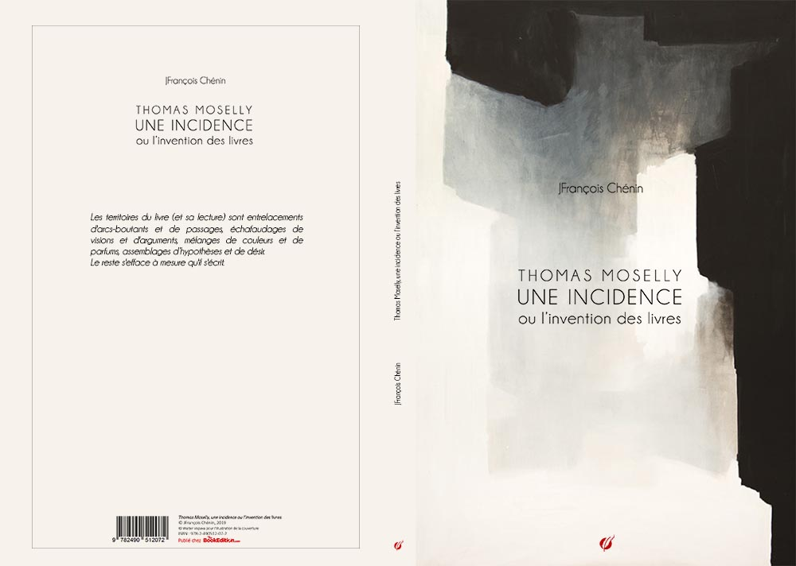

Je publie *Assemblages*, suite de poèmes et collages numériques. Sera suivi en 2021 de *Toucher la terre.* J’aime articuler textes et dessins. Ecrire est un métier d’architecte et de maçon.
 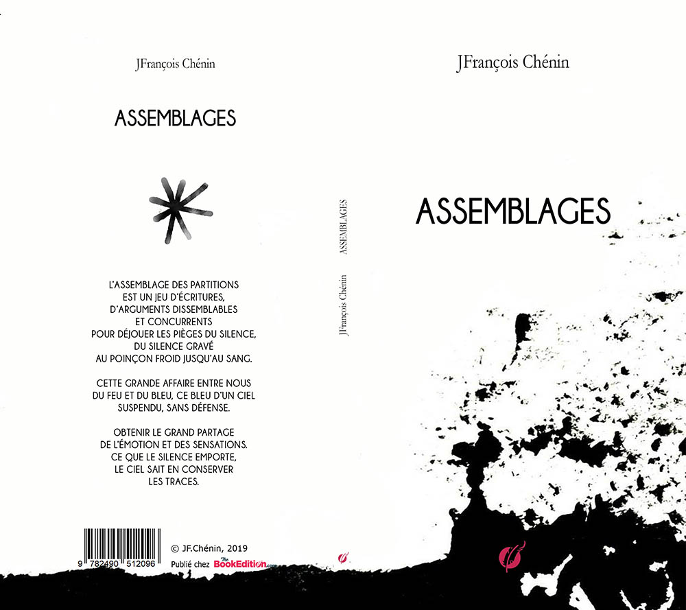

chez [TheBookEdition ](https://www.thebookedition.com/fr/recherche?controller=search&orderby=reference&orderway=desc&search_query=chenin&p=2)

Je commence *Reprendre la figuration,* publié en 2020.

Avec Gilles nous publions *NC - 49.78 - Vol 2,* les peintures 65.76 et quelques poèmes qui reprend toutes les peintures de Nicolas
 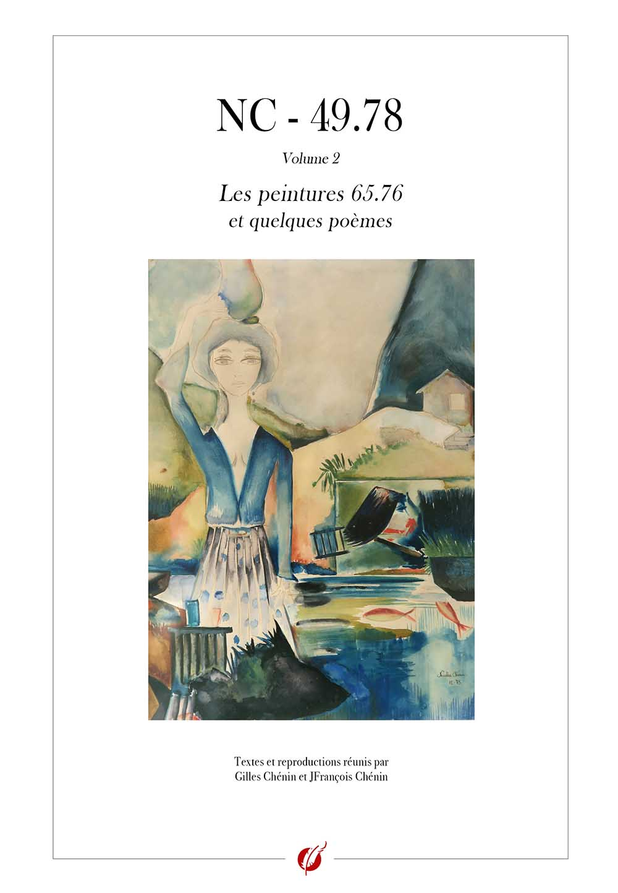

---

26 janvier
Décidément les derniers mois se sont vidés de toute substance. 

30 mars
Opportunément abandonné provisoirement.

10 juin, peut-être
Je ne suis pas l’auteur d’un journal, ça se sent, ça se voit.  
Pourquoi ? j’sais pas.

19 avril
J’écris : hier Jean-Claude, le compagnon de Brigitte, est mort. C’est toujours avant de tomber qu’on oublie.

5 août
Entendu sur la digue, des prénoms d’enfants : Eden et Céleste. L’aspiration au ciel.

6 août
Mais encore !

23 novembre
ASSEMBLAGES - C'est en s'arrimant qu'on avance, au ciel contre les brasiers répertoriés dans le cerveau ou autour du cerveau, s'arrimer avec les fils invisibles des sentiments ou avec de grosses cordes qui lâchent toute l'évidence des situations. Allons, allons, respirons et trouvons de nouvelles îles.

12 décembre
Assiduité est mère de toutes les vertus… laborieuses.
Je ne finirai pas cette année sans inscrire quelques mots dans ce journal épisodique, journal à trous, à grands trous d’absence ou de fuite.
En vérité (je vous le dis… ou pas) j’ai tellement d’autres choses à faire. Alors s’épancher sur soi, mais quelle besogne rudimentaire et vulgaire !
Ne nous plaignons pas. Trois écrits en route, des collages (maintenant des assemblages) et toujours des croquis 
et partitions. Voilà bien de la besogne tout court.
Installé depuis presque deux mois à Hauteville. Retour à la source de bien de désirs, d’images et de sensations. Manque le long grenier de la maison familiale. Mais c’est sans regret. La mer, les vagues, les dissonances entre le ciel et les longues langues de sable me suffisent. Et la nuit, quand le vent double sa force et que la mer et pleine, 
je vais sur la digue et j’admire.

15 décembre
Rendu visite à la mer pleine qui bat les enrochements de la digue. C’est vertigineux.

---

## 2020

A Hauteville-sur-Mer. C’est l’année des collages, dessins et croquis.

J’écris un peu en désordre. Je me disperse aussi ou je tente de rapprocher ce qui ne peut pas l’être. Je navigote à vue.

Je publie la saison 9 de *Monument Valley* avec *Objets mouvants.* J’utiliserai aussi ce texte dans *Digressions du réel.*

Les images et le rapport aux images m’occupent. Comme avec les Everglades.
 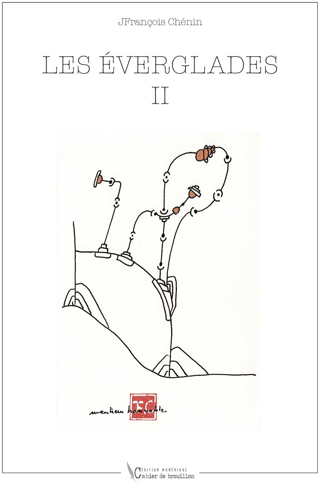

On passe de confinement en confinement. Cela a-t-il du sens ?

Je sors les *Croquis instinctuels*, suite de croquis sur le thème de la partition et de la répétition, deux mécaniques de la création instinctive.

---

 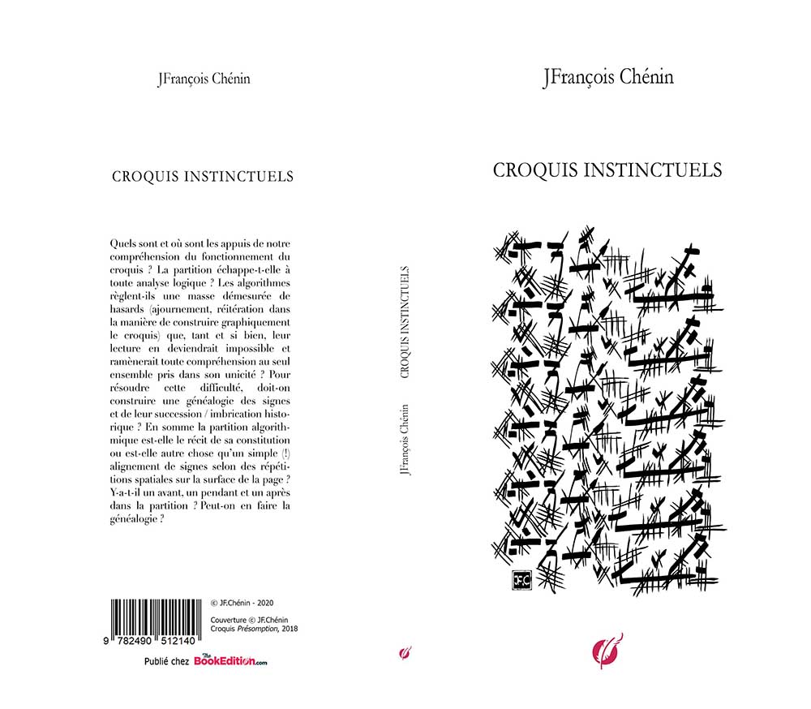
chez  [The BookEdition](https://www.thebookedition.com/fr/recherche?controller=search&orderby=reference&orderway=desc&search_query=chenin&p=2)

Je publie *Le silence     About You*, suites de dessins et de textes sur le thème des rendez-vous manqués des Everglades.
 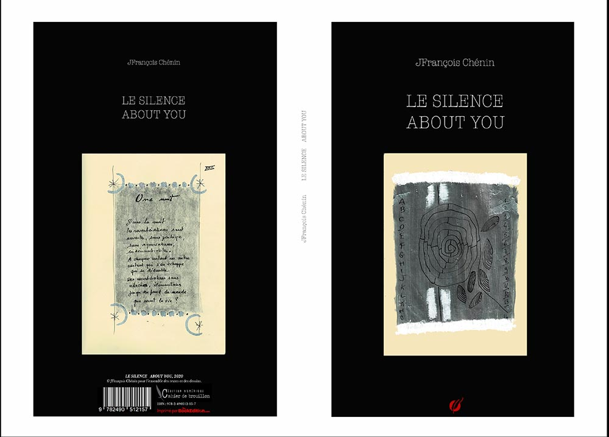

Je publie *Les tropiques bleus.* Le titre vient de dessins/croquis faits pour accompagner le texte composé en 29 chapitres et écrit à l’aide du générateur de texte aléatoire du site [voir](http://enneagon.org.)
 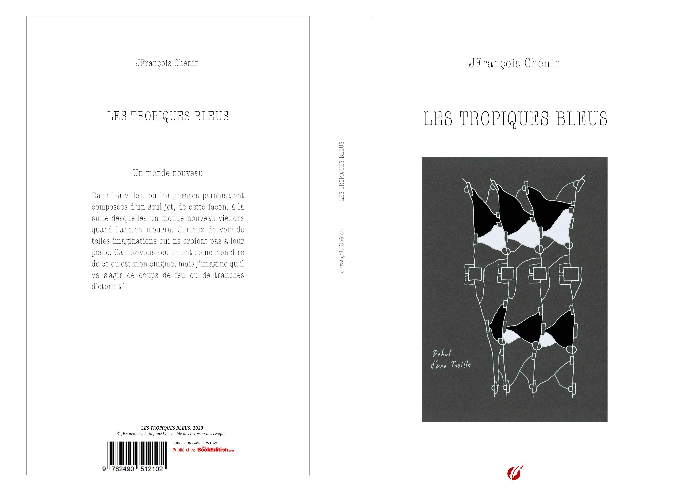
chez [The BookEdition](https://www.thebookedition.com/fr/recherche?controller=search&orderby=reference&orderway=desc&search_query=chenin&p=2)

Mon journal prend la forme d’un assemblage de croquis (*Grande Suite Noire, Petite Suite Noire, Les Nuits Primaires*) et de textes.

Je commence les encres de *Quelques apparences verticales* que je publierai en 2021
 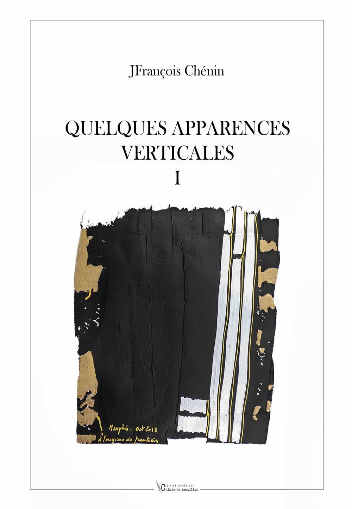
Chez  [The Book Edition](https://www.thebookedition.com/fr/recherche?controller=search&orderby=reference&orderway=desc&search_query=chenin)

---
10 juin  
Mis un peu d’ordre dans ce journal. Bien des mois manquants ou absents… Jeté le jetable.  
Où étais-je ? Je fais le tri des images.  
Depuis septembre en bord de mer. Ça me va.

12 juin  
Encore quelques jours à tenir ce journal.  
Probable, improbable, certain, incertain.  
Trouvé le titre des textes du grand livre illustré  
Le silence About you.  
Retour vers les Everglades.  
Tout ce que j’ai fait avant ou après n’efface pas  
les lumières des Everglades.

5 septembre  
Perdu mon huitième carnet ! Retrouver les morceaux !

24 septembre  
Grand vent, petite fatigue.  
Oublié de parler de l’infarctus de ces deux mois à  
reprendre pied. Ce fut épisodique et dépareillé.  
Pas d’incertitude cependant.  
Des parutions (sorties), des publications, des dessins.  
Les tropiques bleus, Le tiers regard, L’empreinte des ombres, Reprendre la figuration…  
Je me déplie contre les apparences.

6 novembre  
Parution de Le Silence About You.  
Sans dédicace, cette fois.

7 novembre  
Décidément, décidément. Je procrastine avec une ferveur. Tout à l’heure, demain, plus tard, un autre jour, dans l’éternité. Je suis dans un moment musical qui m’empêche d’écrire ou de faire des collages. Silence et vent debout en haut du ciel.

---
## 2021

A Hauteville-sur-Mer

Je voyage, je dessine, j’écris un peu. Je termine *Toucher la terre* une nouvelle suite de poèmes et collages numériques

 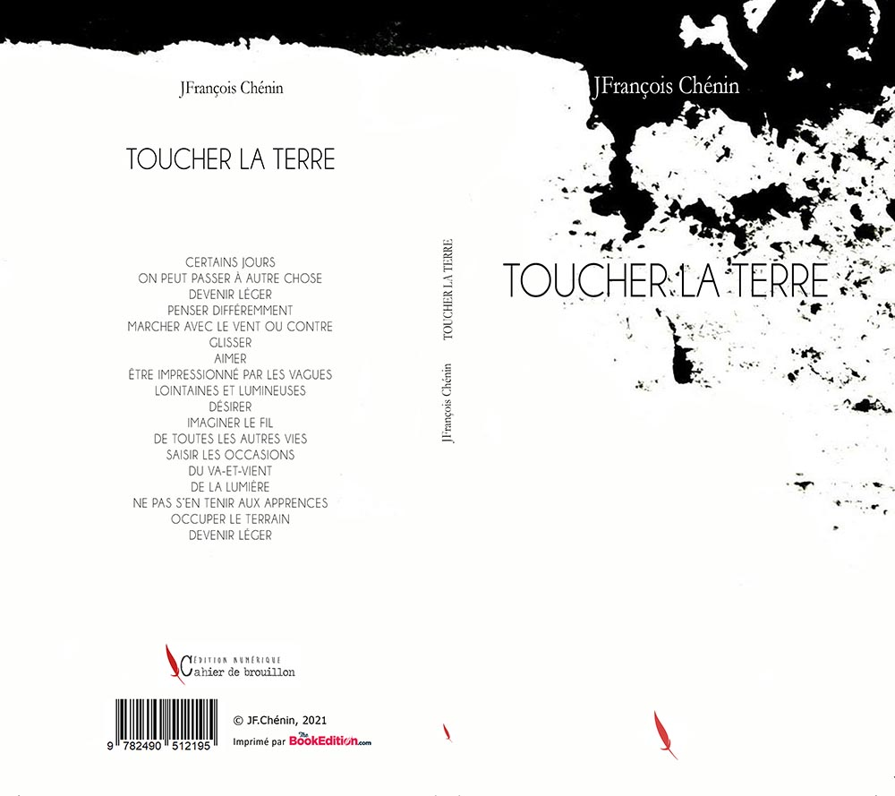

Le sentiment d’arriver au bout d’une histoire de mon écriture.

Je publie _De quelques écritures mises bout à bout, carnet 2011-2020_. Ce n’est pas ce journal, mais des notes au long des jours, des nuits et des routes qui sont entrées dans mes livres. Perdre permet de compiler !
 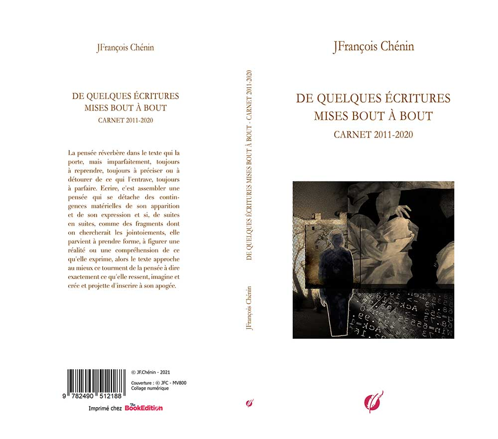

---

10 juin
Mis un peu d'ordre dans ce journal. Bien des mois 
manquants ou absents… Jeté le jetable.
Où étais-je ? Je fais le tri des images.
Depuis septembre en bord de mer. Ça me va.

12 juin
Encore quelques jours à tenir ce journal.
Probable, improbable, certain, incertain.
Trouvé le titre des textes du grand livre illustré 
Le silence      About you.
Retour vers les Everglades.
Tout ce que j'ai fait avant ou après n'efface pas 
les lumières des Everglades.

5 septembre
Perdu mon huitième carnet ! Retrouver les morceaux !

24 septembre
Grand vent, petite fatigue.
Oublié de parler de l'infarctus de ces deux mois à 
reprendre pied. Ce fut épisodique et dépareillé.
Pas d'incertitude cependant.
Des parutions (sorties), des publications, des dessins. 
Les tropiques bleus, Le tiers regard, L'empreinte des ombres, Reprendre la figuration…
Je me déplie contre les apparences.

6 novembre
Parution de Le Silence     About You.
Sans dédicace, cette fois.

7 novembre
Décidément, décidément. Je procrastine avec une ferveur. Tout à l’heure, demain, plus tard, un autre jour, dans l’éternité. Je suis dans un moment musical qui m’empêche d’écrire ou de faire des collages. Silence et vent debout en haut du ciel.

---

29 mai
Je n'ai pas de lignes de fuite en mémoire. Les apparences sont trompeuses. Les perspectives sont construites à l’inverse des sentiments. Et les îles comme refuge restent introuvables. Apparence, instinct le plus frustre, il n’y a de secret que dans les silences qui suivent la mort.  
Apparence, figure des conventions, dans l’amoncellement des larmes et des reflets qui les irisent, c’est promiscuité de pensées fausses, de pensées hagardes, blanches, blanches, amalgame de matins froids et de réminiscences inintelligibles. Il n’y a pas pas d’ivresse sans étonnement, d’inspiration sans exaltation, pas de sentiment sans crainte.  Apparence, emportement et volte-face des vérités, toutes les mues sont des palinodies de l’éternel. 
⁂
Ton silence est un tourbillon, un frisson et une extase.  Tu as donné ta sentence. La fatalité est dans le verbe. 
Elle est convulsive. 

30 mai
Je suis né en 1954 (le lundi 29 - ou le XXIX.XI.MCMLIV). A ce jour, le 30 mai 2021 à 17h , j’ai vécu 582 936 heures ou 24 289 jours ou 3 469 semaines ou encore 798 mois). Ce jour là, Vénus est en conjonction avec Saturne à 0h, à 2°32’ (mais ça signifie quoi ?).

 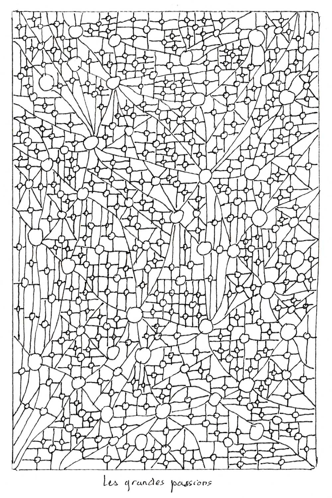

Le 1er novembre 1954 des attentats éclatent dans toute l’Algérie (la Toussaint rouge). C’est le début de la guerre d’Algérie. Cette guerre, comme toutes celles qui ont suivi dans le monde, m’a été épargnée et j’ai vécu dans un monde relativement calme, loin des atrocités des conflits. Cela fait 70 ans. Je dois aux hommes politiques de l’époque (Robert Schuman et Jean Monnet, Konrad Adenauer et Charles de Gaulle en particulier … et d’autres) la chance de vivre dans une Europe pacifiée, commune, unique. Ce fut la chance de toutes les générations nées après la Seconde Guerre Mondiale. Nous ne mesurons pas suffisamment cette chance qui a donné - aussi - à la France une place encore enviée dans le monde. Je peux témoigner de l’attrait que ce pays 
garde - encore aujourd’hui - auprès de quelques jeunes générations étrangères. 
Juillet 1954, fin de la Guerre d’Indochine qui durait depuis 1946. De 1958 à 1962, c’est aussi le grand mouvement de décolonisation des pays africains.

Le 25 novembre 1954, Première publication de la série La Patrouille des Castors dans le n° 867 du Journal de Spirou

Le 26 novembre 1954, une violente tempête déferle sur le nord de l’Europe. Elle est suffisamment violente pour être encore mentionnée dans les chronologies de l’année 1954. Cette tempête est évaluée à force 12 sur l'échelle de Beaufort. Les dégâts sont importants. En France, cette tempête touche les marins en pêche. Ainsi, les ports du Finistère sont particulièrement endeuillés, 64 marins disparus pour le sud du département. Le port de pêche de Concarneau est dévasté : cinq bateaux disparaissent, la commune voisine de Névez compte 17 disparus. e 16 décembre 1954, une célébration est faite en l'église de Concarneau, elle rassemble 7 000 personnes. On ne parlait pas encore de dérèglement climatique.

Le 24 novembre le film Papa, Maman, la bonne et moi de Jean-Paul Le Chanois avec Robert Lamoureux sort sur les écrans.
Mais aussi Le Signe du païen de Douglas Sirk avec Jack Palance, Track of the cat de William A. Wellman avec Robert Mitchum, La Reine Margot de Jean Dréville, J'avais sept filles de Jean Boyer, La vengeance de Scarface de Mark Stevens… Durant cette année, Fenêtre sur cour, les sept samouraïs, le crime était presque parfait et la Strada font partis des meilleurs films. J’ai vu à peu près tous ces films.

Le 28 novembre, Gaston Dominici est condamné à mort pour le triple meurtre de Lurs. Je relis les notes de Jean Giono à ce sujet. Mises bout à bout, elles dressent le portrait inéluctable d’un doute.
Le 29 novembre, des enfants remettent à l'abbé Pierre les clés d'une cinquantaine d'appartements lors du gala de clôture du Salon de l'enfance, à Paris. La mobilisation des Français ne faiblit pas. L'Etat a voté quelques mois plus tôt, en février 1954, un budget de 10 milliards de francs pour la construction de 12 000 logements sociaux.

Ce même jour, les éditions Gallimard sortent Les belles amours de Louise de Vilmorin - Voir la critique de Emile Henriot dans le Monde du 1 décembre 1954 :
[https://www.lemonde.fr/archives/article/1954/12/01/les-belles-amours-de-louise-de-vilmorin-la-machine-humaine-de-gabriel-veraldi-prix-femina\_2030643\_1819218.html]

Le 29 novembre, Albert Camus est avec le comte Ferdinando Visconti di Modrone au Lundi Littéraire du théâtre Manzoni, à Milan.

Henri Matisse et Enrico Fermi meurent en novembre 1954. La même année disparaissent Auguste Lumière, Robert Capa,  Alan Turing, Frida Kahlo, Colette...

On peut dire aussi du 29 novembre que c’était un lundi. Et sous le signe du Sagittaire, je nais. Le président américain était Dwight D. Eisenhower (républicain), le premier ministre britannique était Sir Winston Churchill (conservateur), le chancelier allemand est Konrad Adenauer, le pape Pie XII dirigeait l'Église catholique et le premier ministre israélien est Moshe Sharett (un peu oublié, il est un des pères fondateurs de l’orientation sioniste socialiste de l’Etat d’Israël). En France, René Coty est président de la république et Pierre Mendès France, président du Conseil, chef du gouvernement (en juillet 1954, avec les accords de Genève, il mettra fin à la guerre d’Indochine. Il rétrocèdera les cinq comptoirs français à l’Inde). Parmi les personnes plus ou moins connues nées ce jour-là figurent Joel Coen (cinéaste, les Frères Coen) et Dominique Richard (homme politique français). La même année naîtront, entre autres, Angela Merkel, Katherine Pancol, David Grossman. En cette semaine spéciale de novembre, les Américains écoutaient Let Me Go, Lover ! de Joan Weber. Au Royaume-Uni, Let's Have Another Party de Winifred Atwell était dans le top 5 des hits. Deep in My Heart, réalisé par Stanley Donen, est l'un des films les plus vus en 1954, tandis que No Time For Sergeants de Mac Hyman est l'un des livres les plus vendus. En France, J'ai rendez-vous avec vous (Patachou), Putain de toi (Georges Brassens), La goualante du pauvre Jean (Édith Piaf), Le piano du pauvre (Catherine Sauvage), Graine d'ananar (Léo Ferré) figurent au top des chansons les plus écoutées. Et durant cette année, Simone de Beauvoir reçoit le prix Goncourt pour Les mandarins, Pauline Réage publie Histoire d’O et Françoise Sagan Bonjour Tristesse. Et le 1er décembre 1954, Ernest Hemingway reçoit le prix Nobel de littérature.

5 juin
CE QUI RESTE DE LA MÉMOIRE
Parfois tout est lassitude, parfois tout est béatitude. Jusqu’aux larmes dans les deux cas. Il faut du temps pour ranger les vieux papiers, trier, classer et ranger.
C’est dans l’entre-deux du classement (lecture et catégorie) que les décisions se prennent d’observer ce qui reste de mémoire. Entre-temps aussi.

UNE GRANDE AFFAIRE
Les couleurs adviennent au passage d'un souffle d'air, à petits pas. Les plus claires dressent une frontière avec ce qui reste du ciel visible. Les plus sombres, peu nombreuses, se fondant bientôt dans le noir souverain, figurent un seuil, le seuil vers le silence. Le noir est silence. Entre les deux, des sarabandes à trois temps, légères, échevelées d'amandine dorée et d'organdi pourpre où il fait bon poser les lèvres. Voilà le vent se lève, met du désordre et de la joie dans un grand geste lumineux jusqu'au prochain soupir.

14 juin
ABANDON
Les trouées les plus brèves, les silences les plus longs, la lointaine litanie des commencements, au seuil de ce qui est encore une esquisse, en liseré de l’origine, quand le cœur descend, quand le corps est en prélude de son abandon, tout vient du corps à corps réveillant, sur le fil de l’ombre glissant dans le regard, les yeux ouverts nous regardant, mais cette simplicité et cette passion quand, dans les plis de la peau, il y a cet aveu d’une possession étincelée et d’un enchantement retrouvé.

18 juin
DEVENIR SOUDAIN DU FOND DU NOIR
Un feu blessé se relevant, un feu d’avant, de très loin, presque tu, juste des braises bientôt scintilleuses, tout au plus, un feu arraché de ses flammes, de son ambition à proliférer, ce feu mourant se relevant, presque là pour les yeux, dans les yeux, qui grandit, il lui suffit un souffle, un tremblement dans les feuillages bleus de la nuit, il lui suffit cette douce irisation pour renaître, réapparaître, venir, revenir. Le feu, venir, revenir.

20 juin
REQUIEM
L’histoire d’une mort et d’une naissance, de tous les morts en nous qu’on laisse mourir et une naissance seule. J’irai de la mort à la naissance, d’une fin à un début. J'irai seul. Mais ce ne sont pas les mêmes pages ni les mêmes haltes. Rien de commun avec nos destinations. Mort ou naissance, c'est la destination. Les morts sont des rives assombries ou des abîmes, des sonates répétées puis oubliées. Et les morts s'arc-boutent dans les pensées qu'ils nous laissent. Les morts dans les vies. Les vies sont parallèles comme les écrits, les vies se séparent et les mots disent cet écart qui grandit.

28 juin
L’écriture fragmentaire me va bien. Si l’on en croit R. Barthes - dit François Susini-Anastopoulos - orfèvre en la matière, la fragmentation serait le meilleur moyen d’exalter et de vivre ‘le bonheur du hasard, mais d’un hasard très voulu, très pensé ; épié en quelque sorte’. Cette capture, cette ‘drague’ des phrases, des citations, des formules et des fragments serait un véritable voyage du désir. (in *l’écriture fragmentaire* de François Susini-Anastopoulos).
Plus loin, citant P. Quignard : les fragments seraient alors comparables à ces petites flaques d’eau qui sont déposées sur le chemin après l’averse et que la terre n’a pas bues. Chacune d’entre elles reflètent tout le ciel, les nuages qui se sont déchirés et qui passent, le soleil qui luit de nouveau. 
Une grande mare, ou tout l’océan, n’auraient répété le ciel qu’une fois. (in Une gêne technique à l’égard des fragments).

Je reprends ce journal, qui n’est pas un journal. Il y manque la régularité journalière (ou autre - On pourrait imaginer une journal bi-hebdomadaire, tous les mardis et vendredis par exemple - ce ne sera pas le cas).

J'écoute Friedrich Gulda et son Concerto for Ursula. Excitant, suivi du Concerto n° 5 de Beethoven, magique.

30 juin
Bascule, mouvement de bascule. Répétiton, mouvement de répétition.
La lumière est une lumière de fin du monde. On peut se l’imaginer, enveloppée des derniers bruits et des derniers parfums de la terre.
Rien ne finit, pourtant. Bascule, répétition.
Le désir est surveillé, c’est ce qui reste de nos mensonges et de notre civilisation.
Le printemps se mélange à l’été. Tout revient à cette prémonition des voyageurs : s’égarer, écrire les contes des feuillages et de l’eau, s’évanouir.
Ecrire avec le loriot éveillant. Garde, garde l’oiseau magique loin de l’instinct mortel qui ébranle le cœur et la matière des sentiments. 
Bascule et répétition jusqu’au fond du monde.

3 juillet
Une parole démesurée

Dispersion des sentiments
La magie interrompue
La magie défaite
La magie oubliée

Il n'y a pas de décision outrancière
Il n'y a pas d'obstacle

Les interférences sont implacables

Nos rêves sont des silences, des inventions de silence qui n’admettent rien que le tournoiement du ciel, un seul ciel remué, une seule obsession d’un ciel qui ne supporte pas le vide

Où la poussière est devenue une ombre. Et il faut apprendre à respirer dans cette ombre, rester debout.

12 juillet
Mathilde a 41 ans.

Entendu ou lu :
Quand on est mort on est plus petit mais tranquille.
On ne trouve pas la paix en fuyant la vie.
Regarder le vie en face et la connaître pour ce qu'elle est 
et puis…. s'en défaire (Hours, film de Stephen Daldry).

24 juillet
Mon grand-père maternel, Papa Guillaume, était vannier. Un beau, très beau métier qui ne lui a pas rapporté grand chose. Je regrette de ne pas avoir appris auprès de lui quelques gestes de ce métier alors que j’avais eu tout le loisir de le faire ayant vécu un an avec mes grands-parents maternels à Lavelanet. J’étais plus intéressé par les métiers à tisser des usines Dumont où travaillait, comme contre-maître, Tonton Marius. J’allais assez souvent dans l’atelier de Tonton Maurice, son frère, aussi tisserand, qui avait trois métiers qu’il partageait avec Claude, son fils. 
Je rêvais à cette époque (j’ai 8-9 ans) de construire un métier à tisser et j’avais mis de côté, grâce à l'oncle Marieus des navettes, des lices et tout un lot de pièces diverses dans l’espoir d’en bâtir un, tout aussi performant que les machines que je voyais dans les ateliers de l’usine où j’aimais rester, passé maître en observation.

1er septembre
Saul, Marcel, fils de Pauline Maucort et de Baptiste Chénin, est né dans la nuit du 31 août 2021 à 1h51.

Avec Ezra, certains noms changent (pas les identités).

Maman (Brigitte) est devenue Mamita (choix de Ezra), Mamie Huguette (ainsi nommée par Mathilde et Baptiste) a pris le nom de Grand Mamie, Papé reste Papé (en Savoie), Mémé reste Mémé, et Pépé reste Pépé (en Savoie), Grand-père et Grand-mère le sont devenus à la naissance de Sophie (la première fille de Gilles) et j’ai pris la suite de Grand-père à la naissance d’Ezra. Bap reste Bap et Mamie Mamie (en Lorraine) tout comme Pépé et Mémé (en Normandie), Maman Paule et Papa Guillaume (en Ariège), avec aussi Tonton Marius. Et tout là haut il y a encore Maman Chénin avec son écrivain. Quel nom lui avaient donné ces enfants François, Germaine et Jean-Pierre ? Cette généalogie est étourdissante.

3 septembre
Période chargée
31 août, naissance de Saul, fils de Pauline et Baptiste.
2 Septembre, Ezra, 3 ans, fils de Mathilde et Guillaume, entre à l’école, petite section à Sergy.
4 Septembre, Samuel a 20 ans.

Baptiste pourrait être un ascète, une figure tutélaire, l'ange de territoires submergés et qui assemble les morceaux du ciel pour le tenir debout. De mes trois enfants, il a mon hésitation et mon indépendance.

Mathilde est une romancière - ce qu'elle feint d’ignorer encore. Donne-moi la première phrase disait-elle. Elle y viendra. Et une chroniqueuse doublée d'une critique. 
Impartiale et partiale, selon. De mes trois enfants, elle a mon sens de l'engagement.

Samuel est dans le rythme des saisons, grand rêveur et grand observateur, grand penseur, tout entier dans un monde qu'il reconstruit chaque jour. De mes trois enfants, il a ma fragilité.

---

## 2022

A Hauteville.

Le 24 février, la Russie envahit l'Ukraine. La folie humaine est illimitée et 
si banale. On aura vécu un peu plus de 70 ans sans conflit majeur sur le territoire européen.

Avec Gilles nous avons repris les livres d'Emile Moselly, notre arrière-grand-père, prix Goncourt 1907, avec l'intention de ré-éditer son œuvre complète. Fascinant travail qui permet de découvrir cette famille lorraine dont nous venons et d'explorer la charnière entre le XIX° et le XX° siècle. 
[En savoir plus](https://darkness.chenin.fr/emile-moselly/edition/)

Je publie *Figuration de l'absent* écrit en 1978 à la suite de la mort de Nicolas. 
Il avait 29 ans. J'ai mis du temps à "accepter" ces textes.

 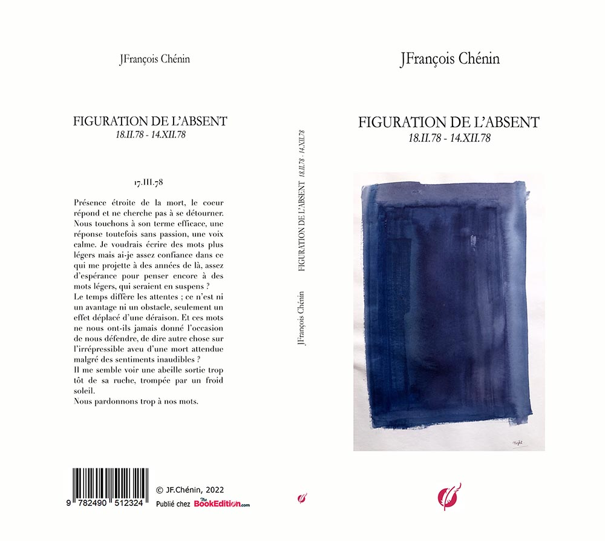
Chez[The BookEdition](https://www.thebookedition.com/fr/figuration-de-l-absent-p-392306.html?search_query=chenin&results=48)

Je publie aussi *Avant de tomber* qui rassemble une grande partie des poèmes écrits entre 2013 et 2021.

Je termine l'année avec *La Morte aux Charmes* (que je reprendrai l'année suivante dans *I95 ou la mémoire d'une nuit*). Que sommes-nous d'autre qu'une hésitation à fuir et une tentative de nous désassembler ?
 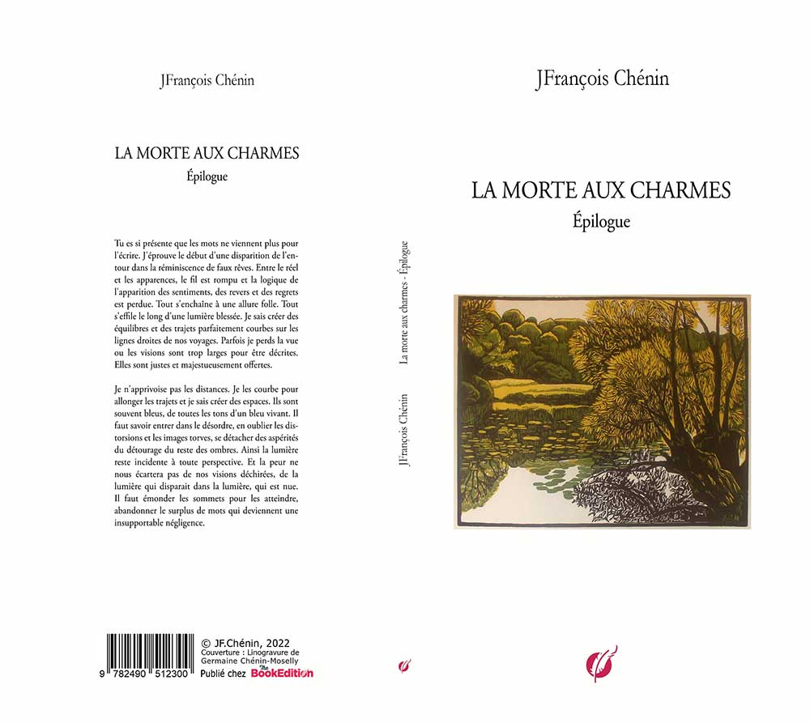

Après 2022, il n’y a plus de journal.

---

 Il y a quatorze ans j’ai commencé ce journal. Je n'y suis pas, je viens, je prends, je pars, j'évite, je me déroute. 
Pas vraiment fait pour ça. Faire fin.

Ce que nous devinons du temps. 
Le temps fini qui n'existe pas.
Un temps défini, jamais ouvert, défait.
Les histoires sont spectaculaires qui racontent les 
démembrements des horizons. Il n'en restera que des bribes incompréhensibles, des morceaux effondrés. 
Tout sera instantané sans retour.

Ce qui a changé !
Est-ce qu'on peut encore écrire avec le reste d'une encre ancienne ?

Je ne sais pas où on va, interminablement.

 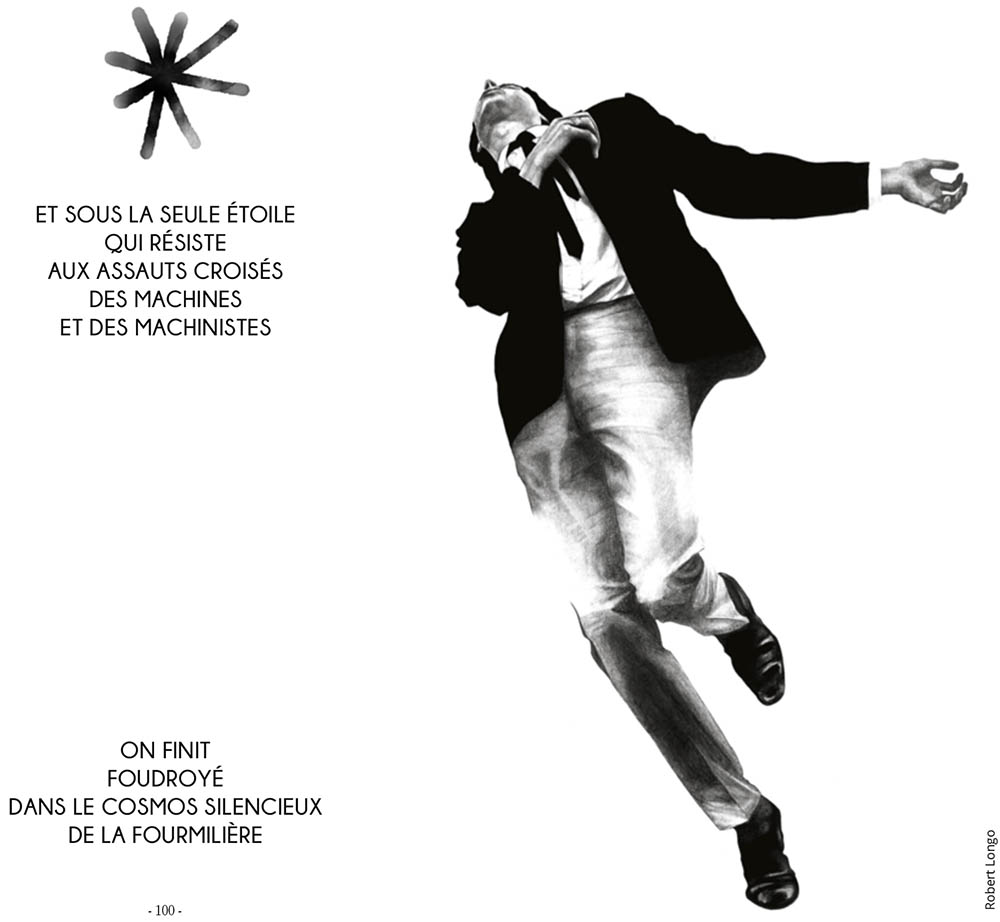

Ce que je sais de l'espace qui tremble, qui redevient une perle d'eau bleue, qui est la mémoire de la vague, une vague sans mesure. Cette mémoire qui vient comme une mémoire en réponse et d'autres qui sont ma parentèle.
Toujours continuer à dire les pages, à poursuivre l'effeuillement, les rencontres et les plus improbables.

Entre-temps des naissances : EZRA, SAUL.
Entre-temps quelques bribes d'époques passées, presque oubliées, à la charnière des jours perdus. Je mettrai tout ça à la fin.  Aucun mystère ne sera levé.
Dans un livre de poche pour ne plus y penser.
Un journal 	sans date
sans reprise
juste des détours
ça occupe la place qu'il faut.

Entre-temps des enfants sont venus nous trouver. 
Ils avaient leurs raisons de naître.

Jour x : dans la demeure fermée, une certitude : mort par étouffement.

A la condition de se réveiller.	

14 juillet
Mis un peu d'ordre dans tous les fichiers dispersés dans l'ordinateur.
Mis aussi de l'ordre dans ce journal en regroupant tout dans un seul fichier.
Je constate encore et encore que je manque d’ardeur. Je suis errant. Longue promenade sur la digue, retour par la plage, la mer se retire. Lente marée descendante.
Des vacanciers, ce n'est pas la foule.
On annonce une canicule mais un léger vent frais fait de cette journée une belle journée.
Presque terminé la nouvelle version d'un livre écrit en 2012, Le Dernier Roman. Biographie de Thomas Moselly. Qui parle dans ce livre ? La position du narrateur est 
indécidable. C'était le but.

La suite à la main… Faudra saisir, se ressaisir pour dessaisir la parole de sa bourbe.
Grande campagne !!
Ne pas oublier les intercalaires de l'avant et de l'après.

(En écoutant la musique de Zbigniew Preisner du film A woman in Berlin)

Arrêter les jours, accroitre l'incertitude. Préférer l'absence de datation. Il n'y a pas d'archéologie de l'écriture vagabonde, de suite en suite. Un archivage par empilement.

Dans la nuit, on se rappelle les chants et les psaumes de vérités transversales et inadaptées. bancales quoi ! On déroule les preuves des infractions et des retentissantes spoliations de la vertu, la soi-disant vertu ! Verrue bien pliée et placée dans un coin du cerveau par les monstres qui ont saccagé notre jeunesse. Pourquoi tant de haine des êtres vivants ! Je dis bien des êtres vivants ! Nonobstant cela, nous sommes bien parcellaires, faits de brumes juxtaposées jusqu'à saturation. C'est la densité des brumes qui nous fait tenir. Jusqu'au mensonge !

On se rappelle qu'on va mourir. Et rien d'autre.

Depuis, je n'ai vécu qu'un amoncellement de pages blanches. Ne rien dater, ne rien signer, ne porter aucune attention aux revirements. Juste ajuster la nécessité, l'obligation de rester debout.

Et si je t'attendais !

Ce qui serait une défense, un argument supplémentaire pour se démettre, s'évader ou s'extraire des feux qui 
retombent. La magie est antérieure au silence qui en revient. Surprise et balancement. Une folie qui ne dit pas son nom, sa redevance. Martel en tête du désordre sur la place d'abondance. Frange et vents contraires.

Journal - Sans la durée, sans l'espace, sans les balises qui nous situaient
entre les îles
dans les yeux
qui se déroutent
des regards.
Réel vs réalité
Journal d'une réserve dépassée
Représentation vs perception
Ecrire en déplacement.
Ecrire où les chemin s'enchevêtrent.

Où sont les pans des dates et des occasions ?
Des pans, devenus silencieux et aveugles. Ecrire sa vie est une tâche impossible et… ingrate. Il ne reste rien des sensations et des sentiments. 
Ni les sensations transversales, ni les sentiments traversés de part en part.
Désir de la vie vécue. Silence, silence. 
Que ferions-nous si nous avions toute la mémoire de tout à notre disposition ? Nous serions submergés et aveuglés.

1er août

POSSIBLE VÉRITÉ 

Où se trouve la porte qui permet de  passer les intempéries, les brusques détours des orages ou du mental, des orgies mentales et des mises à jour mais nous ne sommes pas vraiment vivants     nous nous déplaçons     nous exultons     et si     et si     et si 
nous ne sommes pas dominés, nous nous égarons entre les tombes et les arbres 
décharnés, nous dansons parfois
et nous avons oublié les pas d'un tango ou d'une salsa. nous devenons muets et mélancoliques. Nous sommes muets et mélancoliques. 
nous dériverons 
un piano - Waldstein, second mouvement  
A-t-on besoin de verité ? cette vérité
Nous parlons peu ou pas réellement ou dans le désordre des circonstances, dans une intimité dérangeante, ancienne, très loin de nos sentiments.
loin     loin     loin
dans l'ombre qui masque, dans l'ombre qui oublie, dans l'ombre qui tremble 
	et ce qui tombe du ciel  
	et ce qui nous revient, cette mélancolie  
	des passions meurtries et des rêves cassés.  
ce que tu penses, ce que tu dis     mais quelle importance 

si peu de réponses.  
et le vertige d'un oubli 
la peur n'est pas un rendez-vous, la peur qui coupe le souffle et saborde les îles 
dans l'entre-temps des silences. 
	c'est une différence  
une extase, de la fièvre et des rencontres. Nous dérivons      nous dérivons 
entre les balises le long des berges noires 
              le long des bonheurs passés     oubliés
on se cache     on se cache        
on est des instants parcellaires on plie 
et les descentes le long des pentes neigeuses 
et les glissades sous le vent froid  glacial  emporté  vivant 
et les heures, des heures l'une après l'autre à démentir ou se mentir ou rire. 
on se souvient on s'extasie  l'heure puis une autre on attend on siffle on grapille. 

On parlait d'autrefois, sans conviction mais on parlait, mais on parlait. 
Et le vertige d'un oubli ou d'une erreur ou d'un regret   toute pensée 
d'un martel en tête permanent, des coups  d'orage  et  des  lames de feux 
que rien n'arrête, que rien ne tient, avec toutes ces ombres qui s'élèvent et cachent 
les murs, les trouées vers la mer entre les façades vides des condos, qui s'élèvent 
en masse et repoussent les oiseaux, les étoiles et les lignes de l'horizon. 
On  ne sait plus rien, on n'apprécie plus, on dévale des escaliers qui débouchent 
encore sur des ombres, plus basses, comme des eaux noires, si noires 
si matérielles 

On se cache on se cache on perd nos rêves les maisons sont mouvantes 
et s'enfoncent dans des sables gris et noirs on regarde par la fenêtre  l'eau 
se soulève par longues vagues vertes et argent au centre des visions qui 
cannibalisent notre cerveau on ne s'en passe pas puis une autre qui déferle,
qui reprend sa place dans les assauts répétés  du ciel vers le cielaccroché aux cimaises des rêves et des craintes  

POSSIBLE VÉRITÉ / FIN 
On est parti de si loin. On s'est perdu, on a perdu la route et les forêts et le ciel au-dessus. Bien évidemment on se cache, on a peur ou on feint la peur, c'est pareil, c'est la même sensation d'envol et de déroute on trouve une rivière, toute entière attachée au ciel qui la libère, toujours ce ciel qui est un grand vide de tous les silences, silences des forêts, lisières des silences. 
NI FIN / NI VÉRITÉ.

Et la parole  Toutes ces paroles perdues  Tous ces mots au fond des 
silences  martelés de toute force  dégueulés    

La charge de la preuve reste une rengaine. Les mouvements, même rudimentaires, 
sont la mémoire d'élévations plus anciennes, une rédemption. Mouvements, majesté 
des mouvements, on ne s'en souvient jamais assez, on oublie la rivière. 

Je ne sais pas ce que tu diras *****************************************************

Trop d'étoiles 
Trop d'arborescences d'étoiles kaléidoskopiques      
des réverbérations 
infinies. Tête haute, toujours des vertiges à n'en plus finir, des vagues sur 
des vagues, des vagues sur les crêtes du vent, des vagues amoncelées sur les 
lumières des soubassements  
   Parfois  
   les vents sont contraires  
   et on renverse les arguments  
   on devient pauvre hésitation  
   du renoncement.  
 
Parfois si on oublie, martel en tête des révolutions à  
venir, martel en tête des noyades et des enlisements. 
Fenêtre sur les rives basses de la rivière, ouverture 
vertigineuse    vers le ... ... le ... ... le ... ...
début de la nuit, ouverture secondaire sur la mer plus loin... une trace de parfum 
			trace de parfum  	   va, va, va 

Écrire à la va vite au bord des rêves qui tombent, qui s'embrasent, qui nous détournent du réel   
... et il n'y a plus de réel mais des barrières, des haies, des barricades, de faux instants, de vraies rivières pourtant. 
Pourquoi cet agacement qui traverse les forêts, les nuages et les terres vides de nos voyages ? 
On se souvient d'un arrêt dans le grand vide d'une plaine, au sud, 
très loin 
à des centaines de kilomètres de nos habitudes. 
Où j'ai vécu. 
Pourquoi ? 

LOVE LIFE
La vision réparée - dans sa dissipation, blottie comme un secret - elle n'est pas une apparence ni un tableau accroché au mur. Elle se faufile. Mutualité de la passion, échange de sentiments. L'organisation des visions est en prévoyance des différences qui surviendront entre nous. Des différences de fond. 
Nous ne sommes à disposition de personne. 
Nous naviguons à vue, notre vol est à l'estime. 
                                                                 
LOVE LIFE  
écrit sur le mur au passage de la foule 
                                                                 
LOVE LIFE
en bleu sur les bleus des lumières brusquement ascendantes 
là-haut 
tout à la fin du visible 
	j'ai fait un pas de côté pour te voir
	et tu m'as vu

Tous ces mirages qui nous sont tombés dessus
à la va vite 
en travers, de toutes parts 
on ne faisait plus semblant 
s'arrimer est encore une solution au moment où tout s'efface 
l'instabilité n'est jamais naturelle elle organise 
les fuites 
 les arrangements  
les détournements  
  les appareillages  
l'instabilité est par nature une revendication. 
Tous ces mirages qui sont devenus nos chemins d'assemblage.  Nous avons tant à nous dire et nous avons pris le temps de poser les balises, d'allumer des feux adjacents, d'étoiler l'horizon en face de nous. Nous avons pris le temps de cet assemblage, de reporter nos souffrances à d'autres endroits, pour plus tard, d'effacer cette rancœur qui nous défigure, d'apaiser nos ressentiments, de les élever en aveu.   

Question... ... ... ... ... ... 

La répétition  LOVE LIFE LOVE LIFE LOVE LIFE LOVE LIFE LOVE LIFE LOVE LIFE LOVE sur le  mur  assoiffé de soleil. Reprise à temps. 
 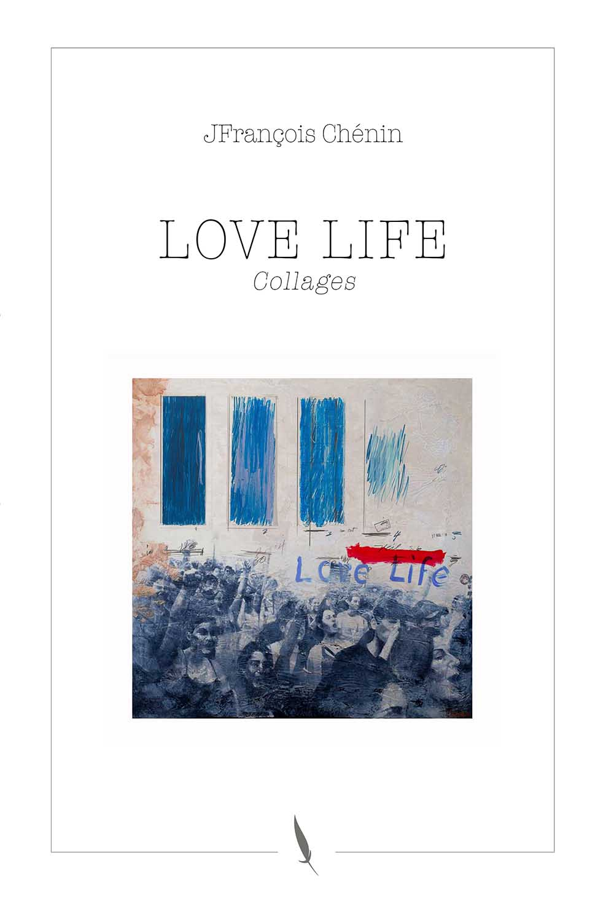
Nous n'étions certains de rien. Notre avance était 
incommensurable, elle tenait dans l'infini de nos rêves. Nous pouvions bousculer l'univers d'un coup d'épaule. 
La matière s'amasse dans les ombres. Elle en devient vivante, immensément vivante, et elle tient si peu de place que notre corps lui suffit. 
	Des questions en suspens
		Absence de réponse
			La détermination n'existe pas
Il y a l'espérance et les faussaires sont passés maîtres dans l'exercice d'en 
remettre toujours plus, couche sur couche de l'errance. 
On finit pas se cacher 
optempérer  
 blasphémer du vide  
s'enchâsser à l'ombre  
faire semblant  
Nous devenons matière passant de l'inerte au frisson, au tremblement, au mouvement, nous devenons matière souffle détouré du vide qui s'élève sans rien pour le rabattre à terre nous devenons matière partition infiniment répétée de l'univers qui s'arrime en nous nous sommes enfin matière interminable répétition des lieux et des temps dont nous sommes faits. 
                                 
Toutes ces nuits perdues, désassemblées, réduites à des murmures, devenues inventaires de souffles indécidables. PAR MAGIE EXUBÉRANTES  
Toutes ces nuits enfuies, une générosité gargouillante de vide. MAUVAIS USAGE DE LA MAGIE... MAUVAIS USAGE DE LA MAGIE... Des nuits même pas jacassières qui nous 
séparent, nous éloignent, nous dépossèdent.
Nous avons renoncé à nos revendications. Les huées montent en grappes racoleuses. ECHO ECHO ECHO. La dévotion est une erreur. La dévotion est une élimination brutale du cœur en nous.

Mais avions-nous encore un cœur
un désir d'abandon  
   un point de départ, une évidence  
Dessus, dessous, monter, descendre 
  le bourdonnement est incessant  
  aliénant, bruit  
Les nitescences de la lumière sont les postiches d'un arsenal qui nous détruira. 
Nous ne serons même pas dans la confidence 
 l'étymologie de confidence est confiance.  

Il nous restera à déguerpir de ces nuits frelatées 
		DE PROFUNDIS 
Nous aurons soigné notre chute et notre envol dans l'éclatante genèse de notre abnégation : le dépouillement majestueux de notre parole
		DE PROFUNDIS BIS
Battement et crépitement / Bréviaire de la désertion / La connaissance est une coruscation / Un feu luxueux fracassé / Le baptême d'une mort attendue / Un éclair dans son halo déserté
J'ai entendu la circulation de la mer autour de ses rivages. Elle tenait la chronique des ses retraits et de ses abandons. Elle me maudissait de la suivre dans ces allers et ces retours dispendieux comme une biographie riche des vides sonores qui la traversaient. Son mystère est un miroir à mille facettes. Je ne lui  posais pas de question. Je dénombrais ses parures jusqu'au fin fond de mes visions. 
                                 
C'est souvent une terrible insouciance, une traverse 
imparfaite vers le ciel. 
Il nous manque. Tout nous manque de sa vision. Tout est recouvert d'opercules glacés. Il nous dépasse. 
La machine ne répond plus. Elle sera mise au rebus. 
Elle sera démontée pièce par pièce. Décomposition des structures qu'elle abrite. 

Sais-tu où nous sommes cachés ? Tu nous cherches, 
il nous cherche. La machine est  en réalité une incidence au mouvement de la terre. Il n'y a rien à chercher. Il n'y a rien à dire. 
Une insouciance répétée, qui prend la forme d'une escapade.  Oui, j'ai pensé à une fugue et aux couleurs d'un ciel fermé. A la fin du visible, il y a encore des traces noires qui effilent le ciel, qui s'ébruitent dans l'infini. Qui dessinent les filigranes des feuillages du vide. Le temps est silence, le temps est muet, ainsi il nous immobilise ou nous traîne vers des îles désertées, mouvantes contre les vagues qui les portent encore. Le temps n'est jamais une parole, jamais des mots, juste le silence. 
 
Les apparences sont contre nous, dit-on. Les apparences sont des jeux de pouvoir dans les réalités qui viennent jusqu'à nous. Où des jeux de miroir qui, tendus de toutes les directions que nous tentons de prendre, explosent. Exploser en plein vol, dit-on. Magie des destinations que nous ignorons encore. Magie des répétitions qui nous submergent de sa houle bleu-noir, sirop sombre du ciel qui s'y engloutit. Je n'ai pas vraiment peur. Il faut aimer les invectives même vides (laisser une ligne vide), invectives gratuites des masses humaines, invectives du fond du monde sombre. 
Toujours les apparences sont contre nous. 
Ne raconte pas ce que tu sais. Ne dis rien. Joue sur les mots, donne plusieurs versions pour brouiller les pistes, mélange les heures, les lieux, les sensations et les sentiments. Ne te laisse pas aller aux confidences ou alors des confidences déportées, intraduisibles. Sois bruyant excessivement, reste silencieux profondément. Martèle que le vide est ce qui reste du souffle du monde, défends une vision de nos relations arrachée des limbes les plus lointaines. Fuis, fuis les instants qui ne viennent plus naturellement. 
Affecte de penser que ta parole n'est pas sûre. Affiche ton doute. Des bras pour soulever la terre, du souffle pour remonter le silence.  Après la nuit est une façade, un bout de muraille que personne ne sait franchir, ou une vitrine sur des poinçons fichés dans le fond noir du magasin. Les enfants aiment les étoiles des bords de leurs rêves. Ils savent où placer leurs mains pour les ramasser, devenir en somme, devenir ce dont ils n'ont jamais douté        des rivières        du ciel. 
DU CIEL, BIEN ÉVIDEMMENT    Ils ont martel en tête, comme moi, comme toi, ils miroitent et bouleversent l'ordre autorisé, le seul ordre possible. Ils ne savent pas, alors ils dérangent et changent l'ordre souvent indécent de la réalité. 
RÉPÉTER : IL FAUT S'ATTACHER À NOS DÉRIVES ET 
DÉBUSQUER LES FAUX RÊVES ET LES DERNIERS DÉSIRS. ÊTRE DANS LE FEU, ÊTRE LE FEU. 
Magie des intentions  
et des paroles inattendues         déplacées  
La terre est sonore         retentissante  
Entends-tu mes intentions         et ma parole décousue  
dégradée  
La terre est un tollé         elle tinte  
Ce qui serait         ce qui serait         un silence ouvert  
sur une ombre         un silence plus grand         qu'un  ciel

OUVRIR TOUTES LES PORTES DU NORD AU SUD, D'EST EN OUEST, SUR TOUS LES CONTINENTS 
ET S'IL N'Y A PAS DE PORTE, ABATTRE LES MURS. 

La boîte est un objet fermé, encore fermé. On ignore ce qu'il y a dans la boîte. Un secret ? On ne sait pas, on ne peut pas savoir. 
On suppose qu'il y a quelque chose dans la boîte 
mais réellement on n'en sait rien. 
Il n'a pas été possible de vérifier l'éventuel contenu de la boîte.  Alors on parle d'un secret ? 
C'est déjà aller trop loin car, peut-être il n'y a rien dans la boîte. Ce serait alors une surprise ! 
Mais un secret est toujours une surprise pour celui ou celle qui ne sait pas. 
Alors si la boîte est vide, ce serait une surprise et un sacré secret. 
Souvent les secrets sont sacrés, pas les suprises. 
Qui pourrait nous dire ce que contient la boîte ? 
Il faut chercher. 
Quelqu'un habitué aux secrets des boîtes, même des boîtes vides. 
Une personne agréée ? 
Et il y a toujours des ombres qui résistent, cachées dans le fond d'une boîte. 
Ombres miraculeuses des instants perdus et enfermés. 
Tu ne sais rien, finalement. 
Tu ne sais rien. Tu inventes. Même tes inventions sont sans surprise. 
Rien n'est jamais acquis à l'homme : ni sa force, ni sa faiblesse, ni son cœur...  dit le poète. 
Cette boîte si bien fermée que personne n'ose l'ouvrir. 
Une boîte sans couvercle ni serrure. 
Elle est à elle-même son secret. 
Les transitions sont les secrets de cette histoire.  
Les passages, les couloirs, passerelles et escaliers.  
Au bout d'un crescendo inévitable, fou, barbare l'impression fugace d'une explosion, un fort tremblement dans la poitrine, un sentiment fugace - tout aussi - d'évasion.
C'est un rappel des MOTS SILENCIEUX avec encombrement du langage dans les creux du cerveau.
	Te souviens-tu ? 
Les mots sont indélébiles à la matière. 
Un rappel de nos origines.
A la manière d'une plongeuse dans les grands fonds noirs où scintillent les feux anciens des lumières des orées allégoriques de nos vies millénaires. 
                           
Puis un retour : 
Les feux sont épuisés, désordonnés. 
Ils plongent dans le vide des grands arbres. 
Ils se défont, devenus dérisoires, pauvres souffles. 
Les larmes ne disent rien, n'y changent rien. 
Les grands feux des Everglades, le soir, se perdent 
dans les ombres couchées de la terre. 
Difficile de toucher avec la main. 
Le ciel tremble dans un étrange monde fermé 

TU N'AVANCES PAS TU FAIS DU SUR PLACE 
UNE FIGURATION CONNUE DU SILENCE 
UNE PÉNIBLE INTERPRÉTATION D'UNE INADAPTATION ET POURTANT TU SAIS BIEN COMMENT SORTIR DE CET ÉTAT TU ES PATHÉTIQUE COMME LE DÉSORDRE SUR LA TABLE DU PETIT DÉJEUNER PATHÉTIQUE COMME UNE CLAMEUR  RUDIMENTAIRE TRÈS ÉLOIGNÉE DE LA VÉRITÉ D'UNE DOULEUR UN BRAME NAUSÉEUX. 

C'est une interprétation des manques à gagner de nos habitudes. Nous sommes des êtres habités.  En haut de la terre, en haut des mondes marins, plus haut, en haut des étoiles.  Nous sommes des instants d'influx nerveux. 
Raconte, raconte-moi              Donne les coïncidences 

Tu tombes, mais tu te relèves immédiatement, tu ne retiens pas ton souffle, tu as les gestes précis, ton visage ne laisse rien voir, tu tombes encore et encore tu te 
redresses, tu as passé une limite, celles des aveux qui plongent aux racines de ton être, tu vis bouleversé, tu entres dans un nouveau monde où les obstacles sont imaginaires mais tu trébuches, tu tombes cette fois plus lourdement et tu reviens meurtri, ton bras gauche 
a encaissé une forte secousse et cette douleur qui 
vient à ton esprit te laisse haletant, désemparé aussi, 
presque honteux, tu reprends position, tu n’as pas 
le choix, tu es le projectile et la cible, l’aile et l’air qui 
la porte, il faut y mettre la forme et dans l’entre-deux 
où tu avances, tu énonces les décalages qui anticipent 
tes pas, place tes rêves où ils doivent être, relève-toi, 
relève-les, mais tu tombes et tu n'as plus le choix, garde en mémoire les instants où se tenir debout ne demandait pas d'effort, place haut ce que tu veux atteindre, et d'autres qui décident de l'avenir, des horizons très proches comme des lointains voyages, tu tombes.
30 novembre 2022

---

10 décembre 2022
je fais la liste de tous mes écrit, par date
**inCOMPOSITIONS, NOTES ET POEMES, 1974-1978 (Edition 2018)**
Vivaldi - Composition pour un été (1974)
Uzès Devenue - Composition pour un Midi Sonnant (1974)
Cathédrale (1974)
Envoûtement de l’atelier - Notes pour un visage de Nicolas de Staël (1975)
La fenêtre majeure (1975)
L’âge illicite (1975)
L’été, la mer - Composition pour un enfantement suivi de Notes et poèmes pour l’été, la mer (1976) 
La porte battante ou une mémoire éventuelle (1975-1978)
La nuit et la répétition (1978)

**In FIGURES DE LA DISPARITION, 1975-2006 (Edition 2012)**
Voisins des arpents (1975-1977)
Quentin (1978)
Nous voilà rencontrés, la terre et nous (1978)
Une maison aiguisée (1980)
Le droit-fil (1983-1996)
Je ne mourrai pas (1994)
In Fine (1996)
Ce que tu fais (1995)
Les sculptures chantent (1997)
Saisons (1998)
La table des étoiles (1998-1999)
Roman (2000-2001)
Exeat (2002)
Dans l’atelier (2003)
Les royaumes à-demi (2005-2006)
Frontières (2004-2005)
Alep (2006)

**In FIGURES DES SENTIMENTS, 1998-2012 (Edition 2014)**
Être humain (1998-2005)
Grandeur nature des sentiments (2008)
Les adolescences meurent sur les talus (2009-2010)
Les qualités discrètes (1998-2010)
En dehors des retours (2012)

**In FIGURE OUT, SUITES AMÉRICAINES, 2008-2013 (Edition 2015)**
Le mouvement du monde (2008)
Quelques jours après Albuquerque (2008)
À la pointe d’Uzès (2010)
Nous sommes des silencieux (2010)
Flyovers (2011)
Requiem (2011)
Au(x) Demeurant(s) (2012)
À Renoir (2013), 
La partition (2013)

**LES DISSONANCES, 2017-2019** 
Livre 1 - Entre-deux (2017)
Livre 2 - Écrire & Écriture (2018)
Livre 3 - Un parfum hologramme et autres suites (2018)
Livre 4 - Dimension(s) (2019)

**DIGRESSIONS DU RÉEL, 2015-2020 (Edition 2022)**
Livre 1 - Le jardin capital (2015) suivi de la réalité apparente du feu (2019)
Livre 2 - Il n’y a rien c’est-à-dire il y a quelque chose de caché (2018)
Livre 3 - A minima, récit d’une digression (2019)
Livre 4 - Le tiers regard suivi de L’empreinte des ombres (2020)

**REPRENDRE LA FIGURATION (2020)**
I - Dans les marges
II - Le jeu des particularités
III - Reprendre la figuration
IV - La dernière fois ou l’apprentissage des rêves
V - La célébration des anges
VI - Possible vérité
VII - Les ascendants telluriques
VIII - Les dépendances
IX - Le dernier réel
X - Dénombrement d’un profil discret

**CURCUMA** (Photos, 2009)
**CHANT PREMIER** (2009)
**LE DERNIER ROMAN** (2012)
**DONNER UN CORPS** (avec Ainee Khalid, artiste peintre, 2014)
**KHI ou DÉPOSITION D’UNE VILLE** (2016)
**KHI or THE DESCENT OF THE CITY** (version anglaise, 2017)
**DE QUELQUES ÉCRITURES MISES BOUT À BOUT** (2021)
**ASSEMBLAGES** (2019)
**TOUCHER LA TERRE** (2021)
**AVANT DE TOMBER**, Poèmes 2013-2021 (2022)
**LA MORTE AUX CHARMES - ÉPILOGUE** (2022)

***COLLAGES ET DESSINS***
MONUMENT VALLEY - Saison 1 (Collages digitaux, 2014)
MONUMENT VALLEY - Saisons 2, 3 & 4 / Les triptyques 2013-2017 (Collages, H.C. 2022)
MONUMENT VALLEY - Extraits des saisons 5, 6, 7 & 8 (Collages, 2019)
MONUMENT VALLEY - Saison 9, Objets mouvants (Collages, 2020)
MONUMENT VALLEY - Saison 10, Mouvements de bascule (Collages digitaux, 2022)
MONUMENT VALLEY - Saison 11, La charge de la preuve (collages, 2022)
MONUMENT VALLEY - Saison 12, Ce que j'en sais 2018-2021 (Collages digitaux, H.C. 2022)
LUX TESTIMONY avec Baptiste Chénin (2001)
THOMAS MOSELLY, une incidence ou l’invention des livres (2019)
LES TROPIQUES BLEUS (2020)
CROQUIS INSTINCTUELS (2020)
LE SILENCE    ABOUT YOU (2020)
QUELQUES APPARENCES VERTICALES 1 (2021)
QUELQUES APPARENCES VERTICALES 2 (2021)
LOVE LIFE (collages, H.C. 2022)

