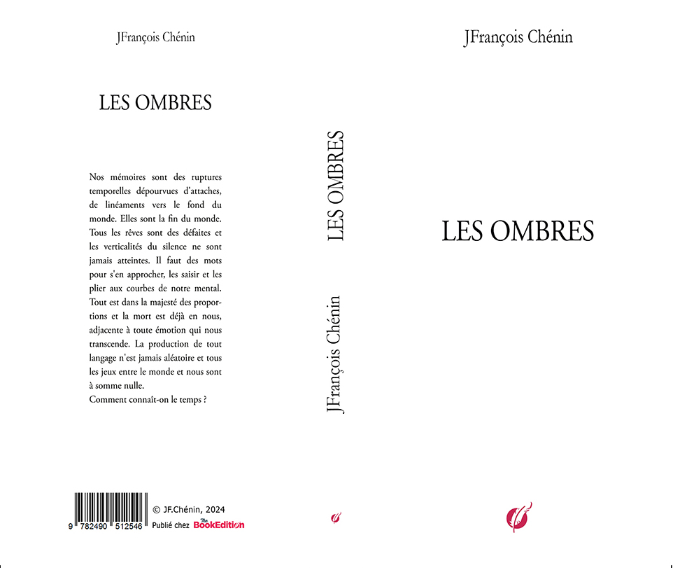

# **BESS**
ou l’écriture de la danse

*Bess ou l'écriture de la danse* figure dans le volume *les ombres* (2024) qui comprend
*Avant de tomber,* (2013-2021)
*Reprendre la figuration,* (2020)	
*Bess suivi de L’idée du monde,* (2023)

chez [TheBookEdition](https://www.thebookedition.com/fr/les-ombres-p-411032.html)

⁂

J'ai connu Bess lors de mon troisième séjour à Kathmandu, en 2014. C’était un an avant le tremblement de terre qui détruisit une partie des trésors historiques de la ville. 

Bess est danseuse. Nous avons parlé de son travail, nous avons parlé de son art. Elle était à Kathmandu pour un festival.

Ce que je retranscris ici est la mémoire d’une nuit passée sous le ciel étoilé du Népal. La mémoire d’une indicible présence au monde.

Il y avait la nuit et le souffle apaisant des montagnes tout autour de la ville, un souffle d’une autre monde. Il y avait la nuit et le scintillement et l’effacement progressif des glaciers à la pointe d’une terre qui touche le ciel, apaisée et silencieuse. Il y avait la nuit et la lente coulée fraîche des étoiles que la terre retenait de disparaitre.

Et Bess me raconte sa danse, cette recherche d’une élévation naturelle, toute 
diaphane et opaline, affranchie de la pesanteur. Elle me raconte son parti pris de penser la danse "malgré tout" et de danser sans l'a priori de la technique. Elle me raconte sa danse toute jetée d'ombre et parfois de douleur, toute limpide du ciel qu'elle vivait et qu'elle donnait à voir. Elle me raconte le rêve apprivoisé de l'apesanteur jusqu'à la chute libérée de toutes les nécessités.

Mettre de l’ordre dans ces notes que je pensais égarées a pris du temps. Elles n’avaient pas quitté le cartable dans lequel je les avais rangées au moment de partir du Népal pour Karachi. 
*Novembre 2022*

⁂

La lune sombre, une, déplacée et désarticulée. En bord de mer, au bord d’un gouffre éruptif. La place majestueuse d’un souffle s’élargit. Une ombre, une ombre qui tombe en travers. C’est l’effleurement d’une ressemblance, le rêve identifié d’une séparation ou d’un renoncement. Ne parlons pas de sacrifice. Comme les feux d’artifice qui délogent les oiseaux et les amants, démonstration habile d’une parole libre, qui tient en suspension, qui ne soumet plus rien, résolue au désordre et aux frôlements inopportuns. 

Ah ! La rythmique contemporaine de la condamnation. On se sépare, on se fuit, on fait volte-face avec talent. Se déprendre des mots. Comment fait le réel pour tenir debout ? Et pour s’élever, atteindre son apogée ? Il y a des histoires et des questions. On cherche à éteindre le feu des fictions délétères et de la violence virtuelle. Où aller dans ces silences ? Où se réveiller ? Quels sont ces silences, ces arabesques vides, sans lumière, plongeantes ? On entend des cris, des crises mais en l’absence d’orage il n’y a plus de larme. 

Bess est une architecture, une élévation, un pas couru. Elle échappe aux contingences. Elle n’est plus réelle, elle est le souffle inapprivoisé d’un rêve. Bess est l’empreinte d’une réserve ou d’un retrait dans l’ombre de la scène, devenue une ombre sur l’ombre. Que lui importe ce qu’on en dit. Bess rayonne. Où se cache cette ombre, quel est son silence au moment de son apparition puis son effacement, sa mesure immobile ? Il n’y a que la danse. 

Quels sont les soubresauts du réel, les injonctions à s’élever, à investir les espaces fermés du ciel ? Il y a un horizon infranchissable dans son regard, un épervier originel qui ne tourne plus, qui est un songe en pointillés sur les fils élancés du monde. Il n’y a plus vraiment de réel mais des morceaux de vision qui se heurtent. Dans ces mouvements, Bess a trouvé ses marques, toute entière, toute impertinente, à jeter bas tout instant inhabité. 

Seul le feu reste réel. Rien ne résiste à la lune sombre qui s’élève. Elle est la première à exister dans sa mémoire, le premier entrechat d’une lumière qui prend sa place dans un espace convoité. Elle est la circonstance attendue, le mouvement qui dispose du temps et des règles. Saut, bascule permanente vers les souffles en rafales de la terre. Elle ne se souvient pas, inutile, elle est la mémoire. 

Bess invente et dispose, compose les pas du temps dans les ouvertures de la nuit. La blessure est droite, transparente, invisible. La nuit s’y glisse avec sa suite de tous les souffles, de tous les gestes retenus de la vie, Bess s’avance. Tout est parcellaire et tout s’assemble. Tout devient une ligne d’horizon, un effroi d’ailes au-dessus des eaux. On atteint la mer sans la voir, on y est d’un coup, d’un seul pas à s’élancer dans le ciel. On se courbe, on se redresse. 

Bess est aux commandes d’un ciel qui lui obéit, qui l’entoure à sa demande, immense arc qui la précipite loin du bruit, ce bruit des âmes qui tombent, Bess les passe sans les voir, se soulève de toute une force irrésistible, avec le regard rieur, éperdu. Des cris inutiles qui remontent. Il faut écouter le froissement des feux et leur réverbération. Les rêves ne sont jamais suffisants pour conquérir le monde. Bess le sait. 
Les dimensions du désir sont intraduisibles. Elles s’estompent à mesure de 
l’imprévisibilité, rendues bleues. Elles nidifient sur les parois inaccessibles d’un silence, au milieu des mots et des notes, où s’effondre un plus grand silence. Bess aime la compagnie des anges. Le corps a froid. Bess se recroqueville. En berceuse ou en tombeau, c’est le même sursaut pour retrouver une ligne de fuite 
possible. Une vérité. Bess a besoin de vérité, d’un réel qui ne disparaitrait pas sous ses pas, qui serait encore là dans les battements tendus des jours qui passent. 

Bess boit à la source, se balance sans quitter la ligne, aimantée par le flux et le reflux de la houle en elle. Le réel ne passe pas, ne l’atteint pas. Elle est la respiration utile, elle déferle inlassablement. Sans blancheur, sans couleur, diaphane et la douleur est une pointe bleue, jamais dispersée. Il n’y a pas de blessure plus certaine que l’évidence d’une défaite. Bess traverse à reculons et s’élève jusqu’à cette perfection d’un silence. Dans l’obscurité des révérences, la parole est revenue. 

L’invention du geste
L'invention de l’objet

Ce que les mots ne disent plus, Bess s’en échappe. Ce qui est la vérité du théâtre, envolée des redondances. Aucun renoncement. Gestes et pas suspendus, des gestes et des pas à elle seule. Toute une vision qu’elle porte d’une onde à l’autre en elle, l’invention de la mer, l’invention du mouvement de la mer et son eau immobile.

L’invention du voyage
L'invention du retour

Avec des mots sans précaution, Bess est attachée à cette rencontre intime de la nature du réel, une vérité sans attache, un geste sans ruse, un rire sans arrière-pensée, le silence d’une phrase. Tout est lumière dans les ombres où elle danse, où elle se heurte, où elle a encore l’avantage de voler.

⁂

Une petite imperfection dans le silence défait les lignes, rompt le pas ou le dénoue, remet en jeu la partition, introduit un doute ou un danger, scinde l’histoire et fragmente la vie. Bess s’arrime aux enchainements de son histoire, aux pas croisés quand les rives sont atteintes. Et voilà l'ajour du seuil, l’alerte que tout commence enfin. A l’encontre de l’habitude ou des regrets. Elle n’est jamais de circonstance. Il n’y a que des questions, des enfilades apparemment en désordre de gestes, de sauts, de corps arc-boutés les uns aux autres, des corps qui répètent l’élévation originelle, qui s’estompent vers le ciel. Des questions sans redondance et sans réponse. Des sensations disparates, des fluidités agencées pour se soustraire des rêves défaits, s’extraire du feu mouvant, effacer provisoirement les corps, leur rictus ou leur défaite. Des sensations qui remontent d’un monde ancien avec leurs lambeaux de naissance qui réveillent toute l’évidence de la lumière. Pas d’errance, pas de chute. Des perceptions arrangées de façon à tourner autour des rêves, ceux qui reviennent, jusqu’à l’imperceptible, jusqu’à cette naissance qui revendique, jusqu’au désir qui dérive. Place blanche et bleue d’un éveil ou d’une certitude, celle-là qui nous emporte au loin. 

Bess est un souffle particulier, une incidence. Pas d’obstacle, pas de révélation plus outrageuse qui effacerait les premiers pas, pas d’instant plus opportun qui serait l’ombre indépassable des prochains silences. Rien de plus miraculeux que cette distance qui élève jusqu’au ciel, saut élancé jusqu’au réveil. Bess est sur un fil, au seuil d’une preuve infranchissable. Ce qui était son désir. Où la lumière devient une arme ou une arche. Bess penchée sur le gouffre enveloppée d’un murmure revenu de la terre, terre elle-même qui bouscule l’ordre des firmaments, qui s’amoncelle en larmes, dans les derniers vertiges qui l’emportent à l’à-pic des tombeaux ouverts. Bess s’échappe. Demain l'enfance, le réveil, l’enfance de l’art, pense-t-elle, une dédicace pour un souvenir, une indispensable révérence pour remercier et se démettre. Une grille, loin devant, l’ouverture du parc est imminente. Des nouveautés, des ombres par-dessus les toits, par-dessus les mains magiciennes du silence. Un pas de danse, toujours devant. Un pas de danse qui n’attend pas. Ce que la douleur ne sait pas faire, en un instant tellement ramassé sur lui même qu’il n’est plus rien, ni un geste, ni un regard, ni un souffle. Tout est perdu. Cette rencontre impossible entre le ciel et le reste des rêves, abandon des idées. 

Bess est entre nos mains, libérée, sans défiance. La chambre nuptiale est ouverte et vide. Tout bouscule les mouvements, l’ordonnancement des répétitions et l’agencement des partitions. Tout est particulier, sans vigilance, dans un désir qui tente de naître. Toutes les saisons assemblées dans un seul saut, si haut, si majestueux, à l’apogée des silences qui en décident, qui leur donnent des lumières, des ombres et des sentiments, tout un peuple rassasié qui vient à elles, les envahit, devient leur raison d’être, des saisons que rien ne hâte sinon de revenir à l’ordre des choses, un saut, si haut, si singulier, dans le retournement irrémédiable du corps vers lui-même, qu'il est le corps répercuté à l’infini d’une seule vibration. Bess est une nature aérienne, intouchable. 
Un corps de toutes les histoires qui la traversent mais d’une seule allitération, d’un seul soulèvement perpétuel, abritant toutes les variations possibles d’un regard, d’un geste, d’un courbe virevoltée jusqu’à la pointe de l’ombre du ciel. Bess n’arpente plus, elle déplace les mondes dans chaque pas.

⁂

Un jour il faut revenir, rentrer chez soi, ouvrir la porte de la maison, finir par s’asseoir. Passer outre les désordres du retour, de la perte de la mémoire. Nous ne devrions pas être là à attendre, à répondre aux rêves immémoriaux. Alors on tremble. On s’habitue si peu à cet endroit pourtant familier. On est de retour. Le désordre dans les partitions viennent des rêves qui s’égarent en elles. Les rêves sont des revenants perpétuels. Nous circulons dans les ruptures de l’espace sur le temps. Et dans les brèches ainsi ouvertes nous tombons à grands coups de désir et nous revenons. Les dimensions de l’espace ne remplacent pas les visions dans lesquelles nous évoluons, libre-ment. C’est l’histoire de l’espace et des oiseaux de Nicolas de Staël. C’est l’histoire d’un bonheur qu’on n’a pas vu, ou ressenti, ou vécu, un bonheur en échange de toutes nos absences au bon moment. Les oiseaux s’envolent et balaient de leurs ailes de craie le fond noir du ciel. Nous avons fait tant de voyages, toujours à l’abri des revirements ou des incertitudes. Nous étions sur le qui-vive, déjouant les fausses rivières, les pièges des tableaux frelatés, les embuscades tendues entre nous pour nous séparer. L’esprit se scinde en deux quand il est seul. L’esprit n’est pas une force dans ces moments mais une dérive, un balancement pour trouver un équilibre, en s’égayant, en se désagrégeant pour respirer et nous sommes l’instant attendu d’une réverbération de plus, qui nous relèvera, qui nous sauvera, qui explosera. 

Bess n’attend pas le silence, elle l’escorte ou le porte et franchit le seuil. Pour Bess ce n’est jamais une histoire, ni un ressentiment, ni un regret, tout est dans cette avance vers le vide qui la retient, où elle dérive ou semble dériver. On n’est jamais sûr de ce qu’elle arpente et du dessein final. On sait qu’on est devant la porte, quelle va être ouverte, qu’il y a un souffle qui nous rassure, que nous n’attendions pas et Bess redonne la mesure naturelle de l’enfantement, une naissance délicate, douce, juste prévisible pour l’espérer possible, Bess s’abat comme une pluie irrésistible, survivante et enflammée dans un frisson tournoyant. Les partitions ne sont jamais sereines et on échoue parfois à comprendre les omissions qu’elles proposent comme des défauts ou des failles qu’il faudrait échafauder. On déchiffre de travers quand on pense exhausser le cosmos qui s’assemble devant nous. 
Bess s’écoule dans le contre-jour, impalpable respiration de l’aube. Ensemble, tempo contre tempo, elle apprend les pas du monde. Sans lâcher prise, en voyageant. Voilà le balancé du temps et Bess est le battement libéré de 
la terre. 

⁂

Le réel est en désordre, dérivant, en fin de course, égaré et trébuchant. Un réel qui ne donne plus d’images, qui en est envahi et les enfouit loin de visions possibles, un réel aveuglé d’un trop-plein de lui-même. Et in terra pax depuis la profondeur du réel. Ce qui monte à la surface est un silence, un presque silence d’un début de monde, une naissance dans le souffle des voix, les voix parcourues des aurores et des crépuscules. Il y a des nuits qu’on ne bouscule pas, qu’on devine, qui chantent le ciel en elles, tout autour d’elles, voiles, voilures et nuages qui s’évanouissent en elles, froissées des traces de l’ombre et du sillage des étoiles, jusqu’au linceul qui les recouvre, pour attendre la venue de nouveaux mots plus justes pour les nommer. Ce que je sais des nuits n’est pas en elles, mais de ce qui les porte et les élève, ce petit morceau d’univers dans les yeux. 
Chaque nuit est une nuit bienvenue, chaque nuit un morceau de l’histoire, chaque nuit sort d’une coïncidence, d’un enlèvement et d’une rencontre, chaque nuit qui vient, jamais à rebours et Bess a trouvé chaque pas de cette danse qui change à chaque nuit bienvenue. Bess déjà happée par les lumières nécessaires aux ombres réverbérées du vide, à chaque soulèvement d’une respiration de la terre, Bess se tient au début de la danse du monde dans la nuit qui monte. Oui, la nuit monte et s’élève partout où Bess trouve les pas pour le dire. Ce qui vient est trouble-fête dans le ciel suspendu, à l’orée des souffles qui vont bientôt le parcourir et nous happer, et nous déposséder de nos secrets, et nous dessaisir d’une vie. Bess roule au-dessus des heurts prévisibles, évite les leurres du silence et des chants d’oiseaux mêlés, s’accroche aux irrégularités des murmures du fond du ciel, âprement, exposée sans dissimulation aux déchirures d’une nuit peuplée de traverses 
invisibles. Bess danse. 

⁂

Un aperçu des défauts du désir, un vide qui s’estompe, un vide retombé, déplacé. C’est une question de perception, des avantages qu’apportent les sensations répercutantes. 
Elle dit : Les grands bonheurs sont des gouffres, des gouffres d’apparence. La réalité n’a plus d’importance quand à chaque pas, les sauts, les entrechats sont les leurres d’un grand changement. Il n’y pas d’obstacle infranchissable sauf, parfois, la peur. Apprivoiser le changement même, voilà le secret de la danse.

La couleur bleue des jours est suspendue aux étoiles invisibles du temps comme un espace vertical de pas à pas. La vitesse de la lumière n’est pas une constante dans les arabesques éclatées des jours contre la nuit. Bess ne lui doit rien. Elle est ce don à la lumière d’un mouvement vivant singulier. L’unicité du réel est en elle, un seul point à l’assaut des ombres. 

La machine des jours a démarré sans heurt, sans retard. L’orgueil est une faute. 
Importance des réserves de mots, de gestes et de danses pour abattre les armes et reporter les larmes. Dérive de la perfection et les valeurs du ciel se dispersent, coulent dans la chaleur surgie de la profondeur des chants de la terre. Une voie irréprochable qui tourne. 

C’est une question qui touche à la douleur. L’immense douleur du renoncement ou de la dispersion. Les flammes ne montent jamais assez haut pour donner une forme au monde ou un désir d’étendue, un fracassement intime de la peau nue. On n’apprivoise pas Bess, elle a le privilège des chimères de créer et de détruire les illusions.

La douleur s'insinue dans le phrasé qui départage l’eau vive des voyages, la rivière des embrasements lointains, la mer et son berceau. Les partitions sont ainsi, des paraphrases d’un réel qu’on voudrait sans plainte, sans fuite vers le fini de l’infini. Retournement des prétentions et des images. Il n’y aura aucune ressemblance possible ou vraisemblance entre Bess et les terres battues de silence. Elle est toute entière le silence épaillé de ses doutes.

Autant de danses pour une errance impossible. Autant de danses pour surseoir et suspendre le temps. Tout s’arrime aux cimaises du ciel, les mains, les corps, les mouvements désordonnés de la mer et des vents mêlés, les hautes et lointaines espérances avec cet agacement des lèvres, tout s’arrime et voudrait danser, voudrait s’aimer, tout s’arrime sauf 
les ailes des anges.

La naissance de l’horizon est son chant, sa venue. La légèreté l’emporte, le dénuement, des rais qui se tendent et s’effacent. Une succession d’arrangements avec des voix et des silences, des ombres qui suivent les perspectives et les rapprochent. La douleur est une réminiscence de la mer qui tombe d’un vide à l’autre. Un pas de plus pour se divertir, un pas plus loin dans le mouvement des vagues sans cesse retournées du souvenir qu’elle a d’elles.

Un chant de loin, qui se rapproche selon des lignes qu’elle seule devine, des lignes réfléchissantes, étrangement simplifiées, ourlant les vents de fils gris et noirs, elle est cette graminée tremblante, cette vie innombrable, immense qui monte en elle, qu’elle laisse surgir, ressentir, s’égarer, qui la dévore, un chant d’une force insoupçonnable qui enroule sans la courber,  elle est le chant mystérieux au milieu du mouvement sans fin des apparences. La nuit, les obstacles sont dispersés, rien d’original dans ces tentatives d’enracinement, puis de soulèvement, cette illusion, parfois sincère, d’être une épaule, un bras, une poitrine, tout un portefaix d’une mer sans matière, un effritement de l’existence. Elle aura égueulé les ombres qui la séparent du ciel,  pour passer une main, tout le bras jusqu’à devenir ce corps tout entier libéré dans la réverbération revenues des couleurs.
Bess fredonne les chants qui la rassurent, le contrepoint des ondes amoncelées dans l’étroite lueur qui rehausse la voix, donne le souffle, grandit le geste parcouru encore de tremblements. Elle se défait des rives et des vagues jetées de front à son visage. Elle s’évade, son corps est un voile qui s’effile entre les étoiles, elle est son assomption.

Bess dit : Il n'y a pas de douleur plus forte que l’absence de pas, plus intense que la 
disparition de l’émotion, plus tragique que l’immobilité sous-jacente à tout mouvement. La danse est parfois une caricature de ce qu’elle veut signifier, mais tout est dans le retrait en soi, dans cette capacité à leurrer les faux mouvements et à effacer les leurres de l’émotion. Je danse par amour, pas par nécessité.

Ma dévotion est complète à la recherche de figures simples et majestueuses. Peu importe la technique, peu importe la méthode, je donne des gages aux circonstances qui naissent en moi, qui sont mes motifs de rencontres et d’assouvissement. Technique et méthode viennent et s’effacent de surcroit.
Le voyage ne donne pas la destination. Danser est dans la même logique : créer une absence pour la combler.

Bess ne sait pas être solitaire ou alors cette solitude est la danse même, le motif de se perdre, d’égarer les repères, de perdre la vue des balises et des rives, ou alors cette solitude est la fin nécessaire de la danse, dans un saut parfait ou une courbe indécidable, respectueuse de tous les attendus à devenir heureux. Les rêves de Bess sont parfois des silences.

Préméditation, intention, mobile, présage et calcul, désir, désir, sans l'arrière-pensée du doute ou de la versatilité, vouloir, telle est la décision, l'utopie tangible d'un pas, puis l'autre, puis le rythme qui les sépare et les attache, puis les enchainements et les phrases donnent un sens, tout s'accorde, toute une partition naît, qui était là, semblable à cet à-propos du plaisir, toujours plus lent à déchiffrer et à convaincre.

Assonance, récidive, réplique, tout avantage d'une répartie, répétition et concordance, tout instant qui ne serait plus une coïncidence mais une distance ou une divergence, Bess prend le contre-pied de l'identique, à quelques millimètres près. Elle sait les vagues qu'il faut arrêter et les lames qui seront le moyen de son envol, qu'elle feint de repousser, auxquelles elle s'accroche et qui sont ses raisons d'être au monde.
Bess répète, reprend les marques anciennes, les adapte, les change d'un signe ou d'un soulignement, donne plus de force, moins d'éreintement, reste dans le panache musical qui semble la porter. Nul besoin, elle se dresse au juste moment, évite le piège de la voltige, offre l'illusion d'un espace en ouverture perpétuelle, ne tombe pas dans le bluff du saut de l'ange, elle est l'ange arrimé au ciel qu'elle accueille puis qu'elle repousse, qui est sa réponse dans le franc-bord de cet espace en construction.

Les mots ne disent pas ce qu'elle ressent. On peut seulement entendre un souffle qui disparait dans les failles qui s'ouvrent devant elle. Un souffle d'apaisement, d'une solitude qui reflue, un souffle pour passer ce moment indicible d'un effondrement possible, un revers dans la patience à mettre bout à bout des existences enlevées. 
Les anges ne sont jamais loin qui baissent la tête.

Bess n'est que musique, abandon, intention, oiseau, flux et reflux, flammes et filés, légère et effilée comme des ailes qui se déplient, qui aspirent et repoussent l'air, qui imaginent l'espace et ses entours, Bess qui étreint et libère toute la lumière au fond des ombres bleues d'une partition qu'elle écrit à mesure de son désir, autant de mouvements pour apprivoiser l'inconnu.

Bess trace la ligne de faîte des montagnes qui nous cernent et disparait dans les hauteurs d'un ciel noir, toujours plus transparent, plus intelligible. Bess n'est que désir, à tout propos, à tout moment et où la vie est intenable, elle plonge dans les voiles rapprochés d'un plaisir qu'elle assemble et donne. Où la vie est innervée de ses pas.
A quoi ressemble ma danse ? dit-elle. Y a-t'il des inventions encore plus attachantes ? Je franchis des espaces déjà en moi aussi matériels que possible. Aussi vivants que possible. Dans les ombres bousculées de mes pas, il y a tous les équilibres qui me retiennent de tomber et m'accordent de franchir l'indicible. Je suis les ailes qui m'emportent, je suis le souffle qui me soulève, l'île qui me sauve et me donne la parole.

⁂

A quoi ressemble mon histoire ? dit-elle. Je viens d'un monde estropié, balancé d'erreurs et de douleurs, un monde où je devais être aveugle. Me reste les frôlements de l'envol des oiseaux, le froissement de l'eau à la cascade, toute chute entendue et toute élévation répercutée qui me donnaient le poids du monde. Alors j'ai fait mes premiers pas dans le silence de pièces sombres, mes premiers entrelacs à la fenêtre des étoiles, accompagnée du seul appel des vagues.

Je suis vivante jusqu'au paroxysme, dit-elle. De toute l'exubérance de la vie, dit-elle. Jusqu'au détachement de la vie même, dit-elle. Je suis la matière imprescriptible du vivant en moi. Je suis un parfum volé, des lèvres et des ailes pour dire mon amour, vivante comme un jour d'été toujours prête à m'envoler, vivante jusqu'à la pointe du ciel. Vivante jusqu'à en mourir dans le souffle de la terre.

⁂
