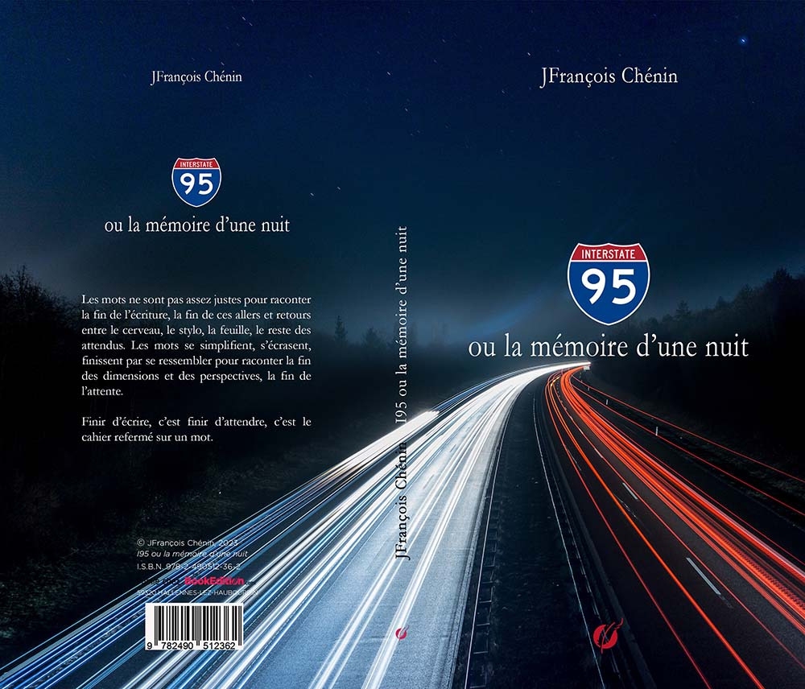
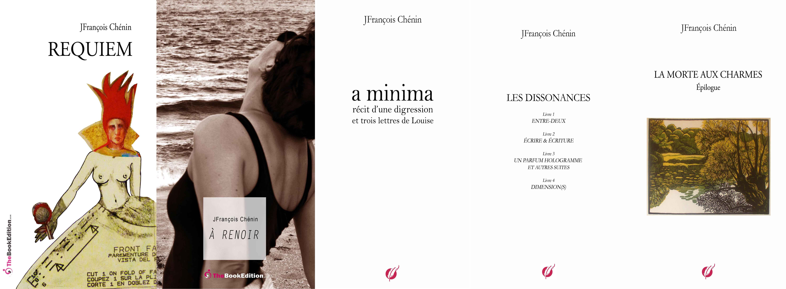

# I95 OU LA MÉMOIRE D'UNE NUIT

 

chez [The BookEdition](https://www.thebookedition.com/fr/i95-ou-la-memoire-d-une-nuit-p-397448.html?search_query=chenin&results=48)

*I95 ou la mémoire d’une nuit* reprend :
- *Requiem* écrit en 2011. J’étais aux Etats-Unis 
- A Renoir de 2013, écrit à Karachi.
- *Dimension(s)* écrit entre 2017 et 2019 quand je quitte Karachi. Il constitue le livre 4 de *Dissonances*. 
- *a minima, récit d’une digression*, esquissé en 2012 à Miami, terminé en  2019. Il est le livre 4 de *Digressions du réel.* Ce récit reprend le début du chapitre II.2 - *Fabriquer du désir* (p. 27 et 28) de Entre-deux, livre 1 de *Dissonances*.
- *La morte aux charmes*, envisagé dès 1978 quand j’écris *Quentin*, est resté longtemps à l’état d’ébauche. Je le termine en 2021 à Hauteville-sur-Mer.

 

Pour écrire un seul vers, il faut avoir vu beaucoup de villes, d’hommes et de choses, il faut connaître les animaux, il faut sentir comment volent les oiseaux et savoir quel mouvement font les petites fleurs en s’ouvrant le matin. Il faut pouvoir repenser à des chemins dans des régions inconnues, à des rencontres inattendues, à des départs que l’on voyait longtemps approcher, à des jours d’enfance dont le mystère ne s’est pas encore éclairci, à ses parents qu’il fallait qu’on froissât lorsqu’ils vous apportaient une joie et qu’on ne la comprenait pas (c’était une joie faite pour un autre), à des maladies d’enfance qui commençaient si singulièrement, par tant de profondes et graves transformations, à des jours passés dans des chambres calmes et contenues, à des matins au bord de la mer, à la mer elle-même, à des mers, à des nuits de voyage qui frémissaient très haut et volaient avec toutes les étoiles – et il ne suffit même pas de savoir penser à tout cela. Il faut avoir des souvenirs de beaucoup de nuits d’amour, dont aucune ne ressemblait à l’autre, de cris de femmes hurlant en mal d’enfant, et de légères, de blanches, de dormantes accouchées qui se refermaient. Il faut encore avoir été auprès de mourants, être resté assis auprès de morts, dans la chambre, avec la fenêtre ouverte et les bruits qui venaient par à-coups. Et il ne suffit même pas d’avoir des souvenirs. Il faut savoir les oublier quand ils sont nombreux, et il faut avoir la grande patience d’attendre qu’ils reviennent. Car les souvenirs ne sont pas encore cela. Ce n’est que lorsqu’ils deviennent en nous sang, regard, geste, lorsqu’ils n’ont plus de nom et ne se distinguent plus de nous, ce n’est qu’alors qu’il peut arriver qu’en une heure très rare, du milieu d’eux, se lève le 
premier mot d’un vers.
 
Rainer Maria Rilke, *Les cahiers de Malte Laurids Brigge*, 1910

# 
I - La majesté des souffles

Il y aura des évidences. Les espaces 
seront libérés et les jointoiements, bleu sur bleu, d'un ciel désassemblé reprendront leurs mouvements dans ta vision exacerbée. Tu seras au bord des mondes qui tombent, qui n'en finissent pas de s'égarer, d'être précipités les uns contre les autres. Tu seras si présente. Tu basculeras en pleine mémoire, loin des voyages qui étaient des feux suivis ou, justement, de tous les voyages qui étaient les circonstances bienvenues du présent. Tu ne décideras pas de ton retour. D'autres décideront pour toi et tu ne les écouteras pas. Tu ne seras plus là pour partager.
Le souvenir n'enchante plus. Tout est douleur dans les mots qui se chevauchent, cette douleur de l'oubli est l'annonce d'autres voyages. Tu n'as plus vingt ans. Tu regardes les rivières, la fuite des rivières d'omission en omission. A chaque halte, tu te souviens. C'est une présence sans surplus, sans risque, sans vertige. Une mémoire de cette douleur dans les aspérités martelées de l'esprit. Tu te dé-fends de feindre d'oublier. Il n'y a pas d'oubli mais une mémoire dévorante du pré-sent, une mémoire assermentée pour débusquer les traces de sentiments perdus, toutes les fraudes au désir.
Tu es sur des traces à vif, à la recherche de stigmates cachés. Les grands bonheurs ne disent rien. Ils sont extirpés au forceps des apparences du réel. Ils nous font douter de nos vérités comme de nos mensonges. Tu sais où finit le désir, toujours dans des apparences qui nous hantent. Quelles seraient les condi-tions du renoncement ? Quels attendus pour résister ? Nous vivons dans un entre-deux 
immatériel où nos élans se brisent. Est-ce mourir déjà ? Nous savons bien où nous 
allons. Tu es le filigrane de traces incidentes de sentiments détourés, devenus aphones, devenus indifférents.
C'est où l'enfance ? C'est quand ton enfance ? Est-ce une question légitime ? 
Question pour attendre la mort, la grande mort fabriquée de toute pièce. Nous y arriverons par les chemins habituels. Nos débats seront indéchiffrables. Sans lieu pour les identifier. Trop de mots martelés de ton passé dans les leurres brouillés des destinations. Les balises seront éteintes. Il faut s'attendre à des tournoiements et des dissimulations. La parole est tissée de linéaments qui nous épuisent. Ne croise pas les bras, respire. Tu penses être dans ta cachette et je te vois.
Le droit de dire, le droit de questionner, voilà l'alibi, voilà le motif à détourer les 
ombres. Se rappeler qui nous étions. Mais nous étions si éloignés dans des pays inconnus. Nous en gardions quelques images. Ce n'était jamais à contrecœur, ni à contretemps. Les images étaient nos mots. Aucun risque d'être délogés de nos attentes et de nos silences. L'histoire ne se répète pas et nos retours ont des imperfections légitimes, des accrocs reçus le long de la route, des empêchements à 
voir ou à nous décider au milieu des paysages traversés. C'est encore une exhortation silencieuse à rester.
Que sont devenus les talus adolescents où s'achevaient nos guerres ? Que sont devenues les lignes franchies le matin venu ? Que sont devenus les serments à rejoindre les îles oubliées ? C'était la condition pour parler et exister. Toute parole doit être étayée d'un silence. Il faudra nous pardonner, nous raconter les feux que tu croisais et les balises déposées pour repérer les différences entre terre et ciel. A cette réception d'étoiles aux terrasses du ciel, tu n'auras ni souvenir, ni histoire à raconter, juste ce présent singulier d'un silence à rebours. Tu es déjà partie.
Tu écris sur la disparition. Le plus difficile, c'est d'apparaître, dis-tu. Le plus facile, c'est de fuir, dis-tu encore. D'une compagnie à une autre, il y a des dissentiments partagés et il n'y a pas d'impasse dans les regards qui se croisent. Seulement des interrogations, des perspectives qui s'effacent, des bouts d'horizons perdus. Tu écris en désagrégeant l'espace. Tu en dilapides les morceaux çà et là. Tu sais combien il est difficile de parler, d'organiser les ascendances. Tu es sur la pente adolescente et tu dévales le monde en toute hâte de tes sentiments.
Tout est détour et à rebours. Tout est fissure. Tu brises la continuité des pages. Au loin les paysages restent minuscules, hors de portée, insensibles. Qualité vs quantité. Il faut augmenter le volume des couleurs pour les rendre vivantes. Tu connais ce dilemme. Imperfection, dis-tu. Nous nous inquiétons de toi. Tu reviens souvent à l'inutile comme si la distance du texte au sujet - au sujet vivant - n'avait pas ou plus d'importance. Tu es, en somme, récalcitrante. Tu veux rester insoupçonnable. Tu es dans le déni du vivant - du sujet vivant - et tu ne consens plus à ton image.
Tu traverses les incendies sans dommage. Il semble qu'il n'y ait plus de combat réel ou inventé. Le bruit des ombres est une évidence. Voilà la rédemption, ce qu'elle dit et ce qu'elle provoque. Et il n'est jamais temps pour rattraper le temps. On peut changer l'espace, les places, les trajets, les destinations, tous les voyages, pas le temps. Et tu n'as pas voyagé en vain. A chaque fois il fallait se convaincre que les nouvelles habitudes étaient les bonnes. Pour voyager, il faut savoir oublier, reconnaître aussi l'inconnu, bâtir d'autres vies qui ne tiendront pas.
Tu ne sais rien de ta naissance, tu ignores tout de ta mort. Ni les débuts, ni les fins ne restent à la conscience. Ni début ni fin au long voyage. As-tu reconnu que ces silences étaient les tiens ? Les déserts ne rendent jamais leurs promesses. Ils laissent échapper les secrets que nous leur avions confiés. C'est ce qu'on dit des confessions, elles brûlent leurs destinataires. Tu es revenue si souvent. Et si souvent repartie. Nous ne pouvons t'en vouloir, tu nous as averti et nous n'étions pas dupes des silences, des entre-deux déserts et des livres déchirés.
Revenue et repartie. Nous n'avons rien dit. Tu nous laissais en spectateur dans la vacuité des jours sans toi. Alors ce vertige du vide devant nous, vertige du silence. La vie est devenue un rêve prémonitoire, une décision verticale à l'à-pic de nos désirs qui ne tiennent plus le monde. Tout est dans les désordres qui nous attendent, devenus l'intimité bouleversée de nos dépendances, renversement de nos lointains. Tu reviens de Key Largo. Une vérité apparente de ton passage. Ne te retourne pas. Tu ne laisses rien d'essentiel, rien de vivant, ni secret, ni souffle étourdi. 
Vertige du vide devant nous. Nous nous rapprochons pour éviter de perdre la lumière et les silences du désert. Nous sommes des apatrides, des apatrides vertueux. Aucune frontière ne t'arrête, ni moi, ni même les frontières invisibles des horizons. Je profite de tes passages et plus nous approchons, plus ils s'éloignent. C'est la majesté des souffles qui les révèlent et les élèvent tout le long de rives oubliées. Nous organisons ainsi nos visions, dans le déplacement et le hasard. Nous sommes dans l'adjudication de nos inventaires, double mot à mot de nos revendications.
Tu te déplaces ici et ailleurs dans le désordre des univers visités. C'est dans la nature des apatrides de reconnaître les tempéraments contraires, les sentiments distincts ou sans méthode et d'en accepter leurs vindictes. Ils sont les bâtisseurs des routes que nous suivons et des balises que nous cherchons. Tu connais le souffle de l'horizon qui grandit le ciel dans toutes les directions et nous bouscule. Bascule, basculement, débordement sur les territoires traversés, ocre et sépia mélangés aux orées noires qui nous éloignent. A chaque étape, la rupture est une crispation brutale du cerveau. 
C'est ainsi, chaque pas est une déflagration des parallèles qui tenaient notre vision. Tu es à la recherche d'un inattendu ou d'une inattention qui donnerait le change, serait un acquiescement ou une île à l'abordage. On ne te fera pas taire. La matérialité des détours est gravée dans nos visions. Jouer ou applaudir ? Toutes ces questions qui reviennent, qui n'étaient plus posées. Quelles sont les paroles ? Des paroles sans expectative et sans recul. 
Tu partages les ombres et tu doutes. On ne se déteste plus, on s'approche et, dans l'eau du ciel de la Morte, poissons et oiseaux s'égarent et s'évadent.
Il y a toujours une réhabilitation à attendre d'un renoncement. Reprendre la 
partition, retirer, ajouter, dénombrer les accidents, démembrer le risque à surseoir. Nous allons au-devant des réverbérations détenues par le vent, plongeantes dans les ombres 
soulevées d'horizons inatteignables. Ce que les magiciennes ne savent pas effacer ce sont nos larmes sur un sourire. Nous serons dans le silence bleu et blanc du ciel. La majesté des leurres est un silence dans lequel nous naviguons à l'estime. On fuit encore. Tu fuis encore. Et le silence grandit à mesure de nos défections. 
Tu ne réponds pas à nos questions. Les distances sont longues à franchir. Tout s'embrase à la mesure d'un empressement à se détourner et à taire. Taire, taire, voilà l'ébauche d'un rêve qui s'effondre à l'intérieur de lui-même. On parle de l'implosion du désir. Ce n'est jamais équitable la mort. Tu es dans l'esquive des 
ombres qui se profilent et rendent intelligibles tes doutes ou tes regrets. J'entends encore le souffle que tu voulais partager. Un souffle si grand qu'il réveilla tes craintes de te mentir. Reprends, reprends ce souffle et prononce
le encore. 
Tu nous sauverais.

## 
II - A tire-d'aile

La grande enjambée des paysages renaît à chaque résurrection de la mémoire. Tu reviens de tes voyages, passés ou futurs, et les destinations s'effacent, le temps se rétracte, n'existe plus. Seul le déplacement subsiste et s'étoile dans le ciel. Les visions sont des élancements amassés jusqu'à l'arrivée. Souviens-toi de Mizner Court, trois marches et des coursives les unes sur les autres, escaliers, terrasses, murs blancs, feuillages arrimés, tout un bateau à l'accostage du monde. Tu t'évadais des heures durant dans les failles secrètes du présent. C'est une fuite évidemment.
Tu habites les mouvements du monde. Il n'y a ni désordre ni déshérence. Rien n'est à l'abri sauf la lumière. Il y a une totalité décalée, une unité scindée qui se reconstruit. Et les orages tombent droits sur les terres blanches et noires de nos silences. Mais que sont nos silences ? Des inventions ? La mémoire est faillible, ta mémoire impartageable, ta mémoire défaite quand elle te saisit, cette mémoire des autres mondes. Jusqu'où es-tu allée dans les apparences ? Comment as-tu pensé cette dépendance ? Les horizons deviennent blancs quand ils s'élèvent.
Où te rends-tu pour disperser les solitudes qui se cachent dans la raison ? Y a-t-il un cimetière pour les sentiments et les regrets mêlés ? Des tombeaux ouverts où s'effondrent les pensées, la tristesse et l'amertume ? Lever les bras ne suffit pas pour s'évader de soi. Sur le franc-bord du ciel, il reste quelques étoiles. On les soupçonne de nous égarer. Comment dansais-tu quand tu ne rêvais plus ? Quels étaient les silences supportables ? Ou éreintés ? Comment fais-tu avec ta double vie ? À qui donnes-tu le change pour disparaître ? La pluie est un désordre martelant.
Le plaisir comme la douleur sont consubstantiels à notre vie. Nous nous séparons de nos sentiments mais rien ne change. Il y aura bien sûr des abandons plus douloureux, des abysses ouverts dans notre cerveau. On se défait des rêves perdus, forcément sans retour. Où est le silence qui nous protégeait ? Et les silences lointains ? Et dans l'ombre, quelle serait ta danse à l'abrupt des heures disparues dans la fade lumière de quartiers moribonds ? Tu es parfois si pâle. Devant Sunset Avenue, les nuits étaient irradiantes. Nous revenions de loin.
Nous revenions d'un bout de monde en nous, un bout de terre et un bout de mer où chaque pont était une élévation vers les souffles du ciel. Nous sommes revenus, rassasiés mais prêts à repartir, prêts à nous défaire des ombres autour de nous. Tu reprends ta danse. On ne meurt pas du silence. On meurt de son absence et des évidences qu'il rend visibles, nos désirs mal ajustés, en déroute. La délivrance sera interminable tout comme la fin des certitudes. Partout les promesses claquent et détruisent, partout les hallucinations brutalisent le cerveau.
Tu as suivi des orées entre le sable et l'eau. La lumière est devenue humaine et 
chavirée. Tu voles si haut. Nous plaisantons de nos disparitions et nous nous cachons encore. Tout est dans le flamboiement des frontières, dans l'idée que l'éternité s'ouvre pas à pas. Partout l'amour se dissimule et partout l'amour subsiste, hante le réel et tenaille le jour qui vient, dévore son propre mouvement. Nous avons oublié pourquoi nos sommes revenus. Nous avions un secret et nous avons vu déferler les misères de notre monde, prêts à renoncer au désordre qui faisait notre plaisir.
Il y a des échardes entre les mots, des hiatus infranchissables où fouillent les mots trop répétés, sans cesse détourés d'un bruit qui n'en finit pas, qui nous déroute et nous sépare. Nous sommes des amants balbutiants. Partout l'amour déjoue le sort et nous foudroie. Tu danses encore au bord du monde dans un ciel à naître, sans larme, délibéré, sans astreinte à s'expliquer. Tu penses être seule, tu es la contraction d'une mémoire dissidente et irrévocable. Nous avons été imprudents de voyager ainsi, de nous être éloignés de nos 
familiarités et de nos confidences.	
Les apparences sont des déserts exigus, elles ne nous contiennent pas tout entier. Nous préférons le bouillonnement de la maisonnée des étoiles. Nous devenons implacables avec nos certitudes et nos espoirs. Le camouflage de l'orgueil est un feu vite éteint. Nous devenons les voyageurs exacerbés des répétitions et des destinations rompues. Pourtant les frontières décident des séparations ou de rapprochements inattendus. Elles sont réversibles. On meurt dans les voiles tissés des anges et nous resterons de vrais voyageurs et de faux amants sous l'aile du ciel.

## 
III - Le premier paysage

Tu es si présente que les mots ne viennent plus pour l'écrire. J'éprouve le début d'une disparition de l'entour dans la réminiscence de faux rêves. Entre le réel et les apparences, le fil est rompu et la logique de l'apparition des sentiments, des revers et des regrets est perdue. Tout s'enchaîne à une allure folle. Tout s'effile le long d'une lumière blessée. Je sais créer des équilibres et des trajets parfaitement courbes sur les lignes droites de nos voyages. Parfois je perds la vue ou les visions sont trop larges pour être décrites. Elles sont justes et majestueusement offertes.
Je n'apprivoise pas les distances. Je les courbe pour allonger les trajets et je sais créer des espaces. Ils sont souvent bleus, de tous les tons d'un bleu vivant. Il faut savoir entrer dans le désordre, en oublier les distorsions et les images torves, se détacher des aspérités du détourage du reste des ombres. Ainsi la lumière reste incidente à toute perspective. Et la peur ne nous écartera pas de nos visions déchirées, de la lumière qui disparait dans la lumière, qui est nue. Il faut émonder les sommets pour les atteindre, abandonner le surplus de mots qui deviennent une insupportable négligence.
Tu es la fluidité du vent, le souffle épuré de la vague, le feu déversé du monde. Je te regarde. Tu es dans l'exaltation d'un silence, le silence arrondi d'un ciel immensément bleu les jours de grands voyages. Un bleu dérivant et transfiguré qui s'effile d'horizon en horizon et tombe droit sur les vides de l'océan qui nous entoure et où il se rassemble. Nous remontons au seuil de nos désirs. Nous finirons par dériver de pont en pont au-dessus des linéaments humains qui façonnent les vagues, la couleur retentissante des embruns et l'aube intraduisible du ciel sur la mer.
Les mêmes paysages et les mêmes mots, les mêmes voyages, les mêmes apparences sans abdication, les mêmes déchirures au moment de se dévêtir, et les astreintes différentes, les émerveillements soustraits aux visions sans générosité et les rencontres exacerbées par l'inconnu dévoilé, toute une vie d'une seule respiration, tout le parcours dans une seule confidence, celle de la célébration des couleurs et du noir, celles des abîmes qui s'élèvent en vrac dans la mort qui s'éloigne, tout est ailleurs, tout est là dans les traces majestueuses d'un geste lumineux.
L'urgence dérange et masque les plis de nos souffles. Tout se couvre d'un bleu ciel. Tu es dans mon silence. I miss you était-il écrit sur le mur d'en face. Je passais devant et j'ai détourné la tête. Comment fait-on pour saluer la mort et s'en guérir ? Trop de voyages ont détruit le désir de partir, annihilé la recherche des énigmes, interdit tout départ. Je suis en retrait de tes regards. Nous étions dans le répertoire des rêves et les éboulis ont pris la forme d'une conformation souterraine 
infranchissable. Les orages ont des voûtes incommensurables et nous les arpentons en pure perte.
Tu es l'inattendue, naissante, ombre portée d'une mémoire qui revient, l'occasion du jardin, le premier jardin capital, tu reviens en cascade sur les pentes d'une colline, tu dévales une colline à avaler dans le sens de nos avances, tu es l'appui et le reflet des éclats de l'illusion, le retour d'une illusion et d'une convulsion, tu es dans l'équilibre de mon regard où les absences s'achèvent. Tu partais au bon moment, je revenais au bon moment. Nous étions avant la naissance, dans un silence ineffable, détachés de notre légende et de nos fantaisies indulgentes, trop féériques.
Le réel revient. C'est l'embrasement d'un ciel versatile. Les feux, voilà la sincérité, la logique de la méthode pour te rejoindre. 
Il faut naître sans avoir à retrouver la mémoire, naître de toute la mémoire des ombres en nous. Où passons-nous ? Quels sont nos prétextes pour prétendre courir ainsi le monde et perdre nos attaches ? Ce qui plane autour de nous n'est plus en nous. Toute naissance est un gouffre courbe dans lequel nous nous précipitons, où nous perdons la violence à s'élever, entourés des miettes sépulcrales du monde.

Nous finirons humains, telluriques et disloqués.

## 
IV - A fleur de peau

A fleur de peau de nos intentions, 
nos rêves sont désarmés
A fleur de peau de nos dérives, 
nous quittons les ombres familières
A fleur de peau les paroles déjouées 
sont libérées sur parole
A fleur de peau l'émotion est aussi une dérive, 
une dérive à l'emporte-pièce
A fleur de peau de nos regrets 
nous emportons nos secrets par défaut
A fleur de peau de la beauté démembrée 
à la fin d'un silence
A fleur de peau de ce qui te fait tenir belle
A fleur de peau de nos séparations 
dans les carnets du froid et du feu
A fleur de peau de tous les silences
A fleur de peau maintenant 
je vois ce que tu vois
A fleur de peau dehors
A fleur de peau de toutes les poussières 
soulevées par la lumière, tu t'endors
A fleur de peau la providence 
est une histoire ancienne
A fleur de peau d'une réverbération 
du silence dans le silence
A fleur de peau de la douleur du matin, 
nous nous séparons en silence
A fleur de peau l'œil vide de l'univers 
où se bousculent des anges mutiques
A fleur de peau la fin de la nuit qui monte 
en vastes voiles noirs
La douleur est à fleur de peau du silence 
qui revient
A fleur de peau rien n'est dit 
ou on se trompe, on navigue à vue
A fleur de peau de nos voyages
A fleur de peau de l'étrange passé 
qui ressort de nos rêves
A fleur de peau de cet esprit prisonnier
A fleur de peau de nos outrances 
et nos dérives
A fleur de peau des accidents
A fleur de peau de la mer sidérale, 
nos illusions s'effacent
A fleur de peau de nos confusions mentales, 
nous gravissons à reculons nos rêves
A fleur de peau des interdits cachés, 
défigurant l'aventure
A fleur de peau de nos intentions irrésolues
A fleur de peau des ruptures et des silences 
qui les rendent possibles
A fleur de peau de la lumière 
dans les lumières
A fleur de peau des îles qui nous recueillent 
A fleur de peau quatre fois la nuit souffre
A fleur de peau quatre fois la nuit se déchire
Où est le souffle qui te libère ?
A fleur de peau sans plus attendre
A fleur de peau d'une manière qui efface 
et s'efface
A fleur de peau de nos oublis volontaires
A fleur de peau de notre nature en désordre
A fleur de peau des dérives 
et de nos illusions
Quatre fois la nuit soulève nos oublis
Quatre fois la nuit revient à ses débuts
A fleur de peau d'un silence 
contre tous les silence survenus
A fleur de peau, exacerbée, 
pour l'oubli de nos intentions.

## 
V - Le jeu des grands hasards

Cette nuit, la dernière nuit possible est une étape sans destination. Quelles seront tes empreintes, les vérités, les oublis ? Les marges délaissées sous les pas, là-bas au pied des ronces. La vie déboule à contre-courant d'un temps bousculé ? La vie dévale si grandement dans les rêves oubliés pour les fendre et les ouvrir. Raconte-moi, parle-moi. Reste-t-il des lignes droites pour franchir les terres, traverser les orages, redresser les visions de nos voyages ? Reste-t-il des feux encore visibles ? Les miracles viennent de la poussière qui ordonne toute lumière selon des souffles invisibles. Parle-moi encore. A la porte entrouverte, il y a toujours ton parfum en demi-lune dans toutes les ombres. Les perspectives s’enlisent dès qu’on les approche et leurs empreintes se détachent dans le murmure des feuilles. Rien ne te menace que l’absence. Rien ne dérive autrement que par hasard dans les rêves. Un hasard vulnérable, plein de solitude. Le voyage est le terme. Les teintes sont les heurts capricieux du ciel, des teintes en instance d’apparaître puis disparaître, des teintes décrochées des rivières suspendues du silence de l’univers. Seul le ciel décide de sa couleur momentanée. Tu tombes avec. Tu te relèves avec. Le bonheur est une exception, l’embuscade d’un détour. 
Tu manques d’assurance pour te séparer de cette musique lancinante d’une absence. Trop de da capo. Quelles sont les nuits qui comptent, qui te portent doublement épargnée par les vents et les songes vains, qui ne viendront pas, qui seront ta mémoire dispersée ? Certaines histoires ne sont pas tenables, qui ne seront tout simplement pas racontées. Quelles sont tes retenues ? Quels sont tes silences ? Que devient ce sentiment apprivoisé des voyages, un sentiment passé sous silence pour en sortir ? Seules les haltes du voyage répondent à tes attentes. En haut des trois marches du monde, il y a le monde tout entier, ouvert, en alerte jour et nuit, au sommet du ciel et des jardins, tous les instantanés d’une naissance ou d’un retour. Tout est inscrit sur le bord des voyages. Quels sont tes oublis ? Où es-tu restée quand nous avons changé de route ? Ce n’était qu’un détour trop long, trop loin. Tu es hors d’atteinte. Le bonheur est une malversation, un forfait empli d’orages qui viennent et déversent leurs erreurs et leurs victimes. Il n’y a pas de silence pour partager des secrets, ni silence, ni respiration. A mesure que les songes s’égarent, le bonheur reflue, plie, grapille 
désespérément sa part de lumière. Alors nous disparaîtrons avec le désir. Comment on oublie ? Où va la réalité quand elle s’efface, qui irradie les traces que nous suivions et qui, interrompues, ont été oubliées ? Comment surgit la peur de ce qu’on ne voit plus ? Oui, nous disparaîtrons, ignorants et soulagés. Tout est vitesse dans nos appréhensions, tout est éclat dans nos hésitations. A qui renonçons-nous alors ? A quoi ressemblons-nous alors ? Quel démiurge nous saisira la main pour éviter la peur, annihiler les craintes ? Devant, tout devant ce sont les grands espaces, un ciel immense tout au-dessus, avec juste ce qu’il faut de frange irisée, terre ou océan, quelques pas et ce sera fini. Où va le réel qui s’éteint ? Où va le réel qui aveugle ? Où nous pousse le réel qu’on ne voit plus ? Que nous restitue-t-il ? Cette quiétude qui n’en est pas une, une défaite partagée. Ou alors la perfection n’a jamais été vivable. Les ruses de la tentation sont à rebours de nos désirs. A rebours des vérités et des mensonges qui nous servent de désir. Quand as-tu perdu ta place dans les feux résurgents ? Quand as-tu délaissé ton entourage ? Ni les vérités, ni les mensonges ne sont des soulagements. Des erreurs. Et la nuit, dans le silence des ombres, qui vois-tu entouré de larmes ? Combien de silences sont tombés depuis ? Et combien d’ombres sont passées, dissoutes ? Tu es démesurée et je ne t’oublie pas. Je vais à l’aventure. M’accompagneras-tu ? Tout est souffle dans la nuit qui vient, tout est bascule et mouvement. Le bonheur n’est pas négociable. Ainsi il nous échappe. La vie devient un obstacle. Nous sommes là et nous dérivons dans nos ombres mortes.  Quand tu voyageais, où étais-je ? Quelles étaient les distances, les obstacles et les détours, les rives des vrais voyages ? Le réveil des circonstances est une chance, un raccourci du désir pour s’affranchir des fausses pistes et de tout ce qui nous domine. Tout est bienvenu si souvent silencieux à la naissance du jour, dans les à-côtés déserts des voyages. Je me suis perdu dans des blancs, des mauves et des noirs qui nous séparaient où seuls les souffles nous tenaient. Et, malgré tout, je me suis réveillé à rebours des convenances. J’étais perdu et tu étais partie. Quels sont les choix, les bons, les mauvais ? Quelles sont les décisions qui viendraient défaire nos plans ou d’autres décisions plus incisives ? Qui seraient un choix de circonstances, celles qui nous emporteraient ? C’est toujours la même chose, pensas-tu, le même refrain des rencontres. Partie, je suis forcément fautif et les voyages portent leur part en renonçant au hasard et au désir bleu de l’inattendu. Tu m’arraches du vide où je tombe pour un croche-pied en terre ferme. Voilà la marge de mes écrits, au bord d’un ciel qui s’effondre, et nous voilà où le ciel devient un tombeau. Tu es le silence miroité de ton absence, je te devine à peine, je t’entends à peine, je te perds et je pense à reculons. Nous nous sommes égarés dans nos voyages, confondant les destinations, mélangeant les trajets, oubliés les rivages, disparues les rivières, évanouie la terre entière possédée par sa nature, effacés les paysages et ce qui reste de vide est assoiffé d’espérance. Toute l’histoire est à son début et à sa fin. On ne peut pas s'arrêter aux illusions, au vide bleu du tissu lacéré des étoiles. Il n'y a pas de réparation possible à notre vie. Il n'y a qu'un ciel dégradé qui n'arrête pas de déborder sur tous les horizons, qui nous submergera, qui sera le tombeau ouvert de nos rencontres. Il n'y a ni rédemption ni oubli, ni attente. Nous serons emportés avec le reste de l'espace et dans les allées de Wynwood la poussière s'élève, toupille et reste suspendue au vide qui la porte. Nous sommes cette âme encore ouverte, toujours possible. Et les nuits seront vivantes jusqu'à notre retour. La mémoire se reconstruira dans la mort, une mémoire vive d'avant et après. Ce qui reste d'une parole acceptable vite inaudible. L'avenir est décidément une défaite. Nous ne serons pas les perdants, juste des oubliés. Apprendrons-nous à devenir ? En toute fin, les déserts sont des paysages neutres et blancs, presque légers. Tout échappe au mystère et les secrets tombent les uns après les autres jusqu'à la naissance de nouvelles visions. L'univers bascule de toutes parts, minuscule jusqu'à sa disparition dans notre regard, nos mains et nos silences. Quels sont nos héritages ? A la blessure ouverte du ciel, il reste une nuit majestueuse. Tel est le premier legs reçu en partage, la première douleur, la première larme. Nous sommes devenus des voyageurs et dans les ruines d'Avdat, nous avons appris à bousculer les arrangements et les heurts subreptices de la terre et du ciel. Ce fut le second legs, la droiture et l'orage à la même enseigne de nos sentiments, de notre vision des sentiments. Il n'y a rien de particulier dans nos dérives, rien d'inattendu, aucune émotion singulière, des émotions simplement nues, et des éclats et des fracas oui, des nitescences oui, arrachées du vide et lancées en nous-mêmes pour agir encore, se décupler, se déchirer dans les mouvements du monde. Les couleurs sont essentielles, toujours 
bienvenues, qui lèvent les obstacles et nous réveillent. Les voyages sont à quatre mains, balancées la nuit, jusqu'à son apogée. Que sont devenus les matins extirpés de la nuit ? Reste-t-il des aveux possibles, une attention réciproque ? Un début de rédemption qui ne serait pas l'appel de notre mort, qui nous 
dévoilerait encore de la vie ? Es-tu ainsi possible, vivante, magicienne ? Quelle sera la suite des événements ? La nuit trahit nos désirs et nos dérives. Elle nous arrache à nos démons, en retour, tout en décision reportée. Partout il y a des bruits qui nous supplient, des cris qui nous agenouillent. Nous sommes pourtant 
debout, mais sans regard, sans voix, sans 
apparence, sans protestation. Nos décisions sont si fragiles, si peu rayonnantes que nous doutons de les comprendre. Les fenêtres que nous avons ouvertes sont les excavations de nos regards dépossédés de leur fonction. 
Errance, abjuration de nos sentiments, nous sommes amputés de nos voyages, de notre désir de poursuivre. Quelles sont les énigmes que nous n'avons pas su résoudre, toutes lointaines ? Nous mourrons encore d'être trahis.

## 
VI - Le chant des oiseaux morts

La grande réverbération n'est pas une imperfection ni un désir trompeur, ni rien 
qui serait un silence impossible.
Où le feu n'est pas dommageable.
Il y a souvent des dimensions qui nous échappent, qui sont des révélations déguisées de l'attente et des vides en nous.
Où la nuit n'est pas dommageable.
En amour, parfois les rêves sont perdants, détrônés, il n'y a plus de cadeau ni rien 
qui serait une vraisemblance ou l'offrande d'une vision.
Où le regard n'est pas dommageable.
Quand le paysage s'effile à mesure des silences et de l'effritement de l'émotion contre les pluies et le vent, la terre est toute soulevée de sa respiration.
Où les passions ne sont pas dommageables.
Dans un ciel qui réapparait à chaque détour, changeant, constamment rehaussé 
des fleuves qui le traversent, dans ce ciel, des siècles se bousculent.
Où l'ombre qui vient n'est pas dommageable.
Dans une demeure trop grande, dispersée, quand les apparences ne signifient plus 
rien, toutes dépourvues des silences qui les dressaient contre nous.
Où les rêves qui hantent ne sont pas dommageables.
Il n'y a pas de fin à nos voyages. Chaque jour nous embarquons, chaque jour les équilibres sont rompus pour reprendre souffle et revenir à terre.
Où les visions enchantées ne sont pas dommageables.
Majesté de tous les désirs d'échapper aux imperfections qui viennent à l'improviste. 
Il n'y a pas d'explication aux détours qui nous ont congédiés si loin.
Où les faiblesses ne sont pas dommageables.
Nous avons rompu avec le passé et, dans un même mouvement, avec notre avenir. 
Nous dilapidons notre vie à l'emporte-pièce avec toute l'éternité devant nous.
Où la musique qui invente n'est pas dommageable.
Il y a des pièges inévitables, d'autres retournés par-dessus bord au gré du lointain qui nous engloutit, d'autres des nébuleuses familières qui nous culbutent.
Où la parole n'est pas dommageable.
A l'abri de la nuit, à l'abri de la vie, où la nuit et la vie sont des alibis, une place sur une balançoire, où la nuit et la vie sont une monnaie d'échange, un obstacle sans les bruits.
Où les désirs sont devenus des fantômes.
Il n'y a pas d'interprétation des feux qui tremblent accrochés aux balises. Les bruits 
et les explosions ne décident rien, les bruits bousculent et les explosions s'effondrent.
Où les légendes ne sont pas dommageables.
A la fin les rivages sont des silences et les voyages des réverbérations qui éclatent et retombent. Les rivières sont écarlates dans les yeux des absents.
Où le silence n'est pas dommageable.

## 
VII - Retours

 -1-

Nous sommes arrivés à l’hôtel vers 10h du soir, la chambre fort heureusement était toujours disponible. Une grande chambre blanche, quelques fleurs bleues sur une table basse, une salle de bains immense, un balcon donnant sur de vastes feuillages sombres. Un silence presque impressionnant. Nous étions enfin réconciliés sans arrière-pensée. Toute cette journée nous avons été bousculés par les apparences et nous avons cherché des horizons que nous n’avons pas trouvés. Les distances étaient trop grandes, les nuages trop bas et, parfois, nous nous sommes trompés de direction. Sans carte, sans repère, sans argument pour arrêter de nous contredire, sans mauvaise raison (ou bonne ?) d’interrompre cette errance. Jusqu’au moment où, à Ancey, nous avons bifurqué vers Baulme-la-Roche. Nous avions notre compte de route et nous avons pris un sentier dans le bois alentour. Nous avons marché sans précaution, abandonnant nos convenances et notre souci de conformité. Qu’étions-nous devenus sans inspiration et sans intuition ? Nous nous sommes traités d’imposteurs et nous étions pourtant dupés. Puis nous n’avons pu retenir un rire. Nous avons levé les pièges que la vraisemblance avait dressés. Jour mirage !

-2-

Nous sommes repartis dans l’après-midi en direction de Saint-Léonard-de-Noblat par les petites routes. En venant de Saint-Pardoux-la-Rivière, nous n’avions pas grand choix. Et c’était le meilleur. Une départementale par Miallet, Chalus, Nexon et Boisseuil. Plusieurs fois, nous nous sommes arrêtés en bord de route pour profiter des prés alentour, de l’ombre des sous-bois, des premières fraîcheurs de la saison. Rien de spectaculaire mais rien d’anodin. Tout un ensemble en équilibre, dans ses élancements comme dans ses retombées, des perspectives courtes et précises parfois rehaussées de demi-jour, des profondeurs finissant en demi-teintes comme des échappées de couleurs presque mélancoliques, automnales, tout un éclairage venant du dessous des feuillages dans un avant-goût de mise en scène. On s’attendait à voir s’alarmer des bancs d’oiseaux multicolores mais ce n’était que trompe-l'œil de feuilles et étincelles de soleil projetées les unes contre les autres. Nous guettions cette éventualité d’un envol enjoué qui aurait fait éclater la profondeur des futaies et des taillis, mais rien n’est venu et la seule apparition fut une biche égarée qui nous toisa de ses grands yeux perlés.

-3 -

Nous sommes arrimés à l’indicible et notre secret nous tient dans les promesses faites à nous-mêmes. Nous allons dans les illusions du voyage et les routes où s’effilent les paysages et les nuages sont des fééries qui révèlent nos fantômes tant la nostalgie nous est familière. Nous entrons dans le voile de la première obscurité et les orages, si dramatiques qu’ils soient, ne sont que simulacres et demi-jour en défaut de perspective. Nous avons des visions communes, élancées et nitescentes qui nous emportent légèrement vers les espaces dont nous rêvions. On ne s’interdit rien et la tranquillité du monde nous accueille même si, tout tendus de la subtile folie du ciel, nous tremblons de nous élever si haut, déjouant les seuils et passant outre les lisières des premiers horizons. Nous ne négligeons rien, ni les vents désassemblés qui nous ralentissent, ni les pluies versatiles emplies de pièges indécelables dans lesquels nous pourrions être pris, où nous serions distraits de l’essentiel, séparés de cette intimité indispensable avec les lents mouvements du monde, d’être cette pulsion du ciel qui, prodigieusement, nous pousse en avant dans les visions inépuisables de nos voyages.

-4-

Nous étions en avance à V., en avance sur le soleil et les alentours volets fermés dans un gris pâle d'incertitude. Nous avions rendez-vous avec M. pour visiter sa maison au fond d'une impasse rocheuse. Il était absent. Retour à C. à la recherche d'un café ou d'une boulangerie. Par chance le Bar des Amis en face des Halles était ouvert. Peu de monde en ce matin frais, peu de monde accueillant ou vivant. Seule la patronne nous a gratifié d'un large sourire et d'un bonjour sonore. Nous étions en terrain familier, habitués des bouts du monde ou ce qui y ressemble. On savait alors s'échapper, se retrouver et s'abandonner aux rives éloignées des villes, toutes ces villes qu'on évitait. Nous aimions cette mise en quarantaine et rejoindre, au hasard des croisements routiers, ces cafés désuets où la vie s'égare tout au fond de la pénombre. Un grand matin pour nous, à l'abri des rêves qui s'éternisent. Un grand matin frêle à reprendre vie. Nous mettons notre confiance dans ses à-côtés du monde où nous pourrions accepter de disparaître et nous arracher de nos déceptions.

-5-

Nous avons pris des habitudes. Avons-nous le choix ? Se déplacer, changer, changer d'hôtels, manger à l'emporte-pièce, veiller la nuit la pointe du jour, attendre la levée des brouillards, attendre l'ouverture d'un café, attendre la marée haute, attendre la pleine lune ou la nuit noire, autant de temps défaits. Être nomade c'est perdre la vue et le toucher, perdre le sens. On a besoin d'un coin à soi, des collines à escalader, d'une pente à dévaler. Les racines poussent dans les habitudes. Nous avions encore besoin de racines. La morte aux charmes est l'histoire d'une femme qui va disparaître et d'un homme qui va perdre une femme. Autour d'elle on voit des paysages de toutes les dimensions, des reflets ajoutés qui vrillent le ciel et l'eau gris-bleu qui s'efface. Nous sommes rivés l'un à l'autre dans un élan qui se brisera, forcément, à l'attache éclatée de nos sentiments. Alors le silence a des bords et des feux détourés qui regorgent de parfums. Des parfums qui nous remontent à la surface. Et nous serons séparés, pour un temps, un temps seulement, à attendre les engorgements des souffles et une nouvelle vie. Si les perspectives ne ferment pas les visions.

-6-

Les décisions d'aller sont souvent un enjeu ou une parade pour ne pas décevoir. A cette condition nos voyages nous ont ouvert des territoires inconnus même si tous les éléments, effluves, frissons et événements, pris isolément, étaient d'une grande simplicité, portés par un bouillonnement de visions précaires, partielles ou en voie d'achèvement. Peu importe. Les effets rétroactifs éprouvés d'un passage à l'autre des frontières ou des assises empierrées des chemins de traverse suffisaient à la construction de nos visions - parfois après coup - et donnaient à nos fuites un sentiment extravagant de liberté même si nos hésitations à poursuivre étaient fragiles, si près d'un égarement ou d'une exaltation que nous ne souhaitions pas vraiment. Nous étions déjà ivres des parfums et des couleurs de 
l'indicible. Nous embarquons à chaque minute. Au moment du départ, les envoûtements de l'effervescence des pontons et des passerelles, l'ensorcellement des tremblements du bastingage sont la magie de tous les préalables qui nous assemblent en un corps vivant unique capable de résister à toutes les tempêtes et au déchirement d'éventuelles séparations. Aller, aller encore, rend accessible, en nous, le monde entier, d'un commun accord.

## 
VIII - Les trois marches

Surprise du réveil, l'oiseau est demeure, l'appréhension d'un autre réel. Tu 
as parcouru ces ombres dépourvues de sens. Pourtant toutes les ombres ont un sens. Un formidable voyage qui répercute ses voies dans les perspectives dressées devant soi. Et si le bonheur était une histoire inattendue, en plein réveil, comme une imperfection continue. Les routes ne se croisent pas au moment opportun. Elles finissent par se heurter en raison de leur disparition. Le vide remplace la colère, anéantit ce qui reste des voyages et du vol des oiseaux accompagnateurs, tout désir virevoltant.
Les rêves ne tombent pas, ne s'élèvent plus, ne sont plus partagés. Rien ne viendra nous réveiller de nos fuites. Tendre une main, saisir un regard, c'est le privilège d'une ombre qui se retire et quitte le jeu. Une main en voie d'absence. Il n'y a pas de fin au vertige ni d'orée qui viendrait l'apaiser, ni d'ombre qui serait enfin son souffle. C'est un sombre pays où tu es allée, sombre, bas et triste. Sous un ciel insoutenable, délabré, qui coule enoires. N'entrons pas dans les rêves qui nous ont repoussés. Ne soyons plus dupes. Les vérités finissent par circuler à rebours de notre raison.
Et au bout de ces mensonges, qu'avons-nous retenu ? Toutes les maisons, toutes les chambres où nous entrons sont vides comme toutes les naissances. Au-dessus, tout est nu. Un souffle froid a basculé nos paroles, soulevé nos sentiments, désarrimé notre intimité. Tout est friable, si près d'une infidélité ou d'une 
résignation. Enfermées dans notre négligence, les promesses s'effondrent. Le désir n'est jamais une récompense. On traverse la rivière au seul moment possible, tard dans la nuit. Toutes ces choses qui fuient l'esprit qui les pense n'auront plus de sens en dehors de nous.
On traverse la rivière une fois réalisé que le silence est anéanti, absorbé par les hautes ombres de nos voyages, parfois sans retour. On traversera la rivière à bout de course des mélodies qui venaient en nous, à l'improviste des grandes visions et des vides qui nous relevaient de la mort. Nous sommes seuls. 
On ne retrouve pas le bonheur. On s'en écarte incidemment. Bagatelle que les frontières qui nous limitent, broutille ces murs, ces mirages et ces haines. Nous descendons toutes les marches du grand monde et notre excuse est de prendre l'air. Quel beau mot que celui de rivière.
Le désordre est inhérent au silence quand montent les orages et se renversent les vents jusqu'à la chute des vagues. Ce que nous aimions. Des falaises et des réminiscences de destruction des ressacs de la parole. Tous les souffles sur la mer sont gris. Alors tu me manques, alors tu es le silence, le gris-vert d'un regard qui se détourne. Te souviens-tu de The American Four Seasons ? A l'origine du monde, il y a des silences démembrés et rompus, comme ton silence, lancés sur les ponctuations noires du ciel. Tout est discret, simple, prêt à devenir l'arrière-pensée du monde qui naît.
Les vérités calligraphiées de l'univers sont les stéréotypes parfois falsifiés du réel. Elles sont écrites dans notre cerveau. Tu n'es pas venue par hasard, tu n'es pas ici sans volonté. Tu es le désir insaisissable de l'autre. Tu es là de toute ton intimité. Nous mourrons bien sûr, nous serons suspendus aux étoiles d'où nous sommes nés, nous mourrons des colères illicites et silencieuses en nous qui ont effacé nos élancements, notre politesse et notre égarement. Nous mourrons de ne plus savoir, de devenir ignorants sans nous dédommager de nos envoûtements.
Ce qui flâne dans le ciel jusqu'en nous est une fantaisie portée par notre acharnement à tenter de nous envoler, d'être ce vol effeuillé de toute pensée. Quelle extravagance du monde nous a rendu si lucide et si vain. Notre voyage balance entre chimère, coup de main et coup de tête et aveuglement. Nous payons en nature l'obscurité dans laquelle nous sommes nés. La chute des corps est irréversible dans l'ombre inhabitée de notre vie. Nous nous réveillons chaque fois plus distraits et nous avançons sur un malentendu. Que sommes-nous d'autre qu'une hésitation à fuir et une tentative de nous désassembler ?