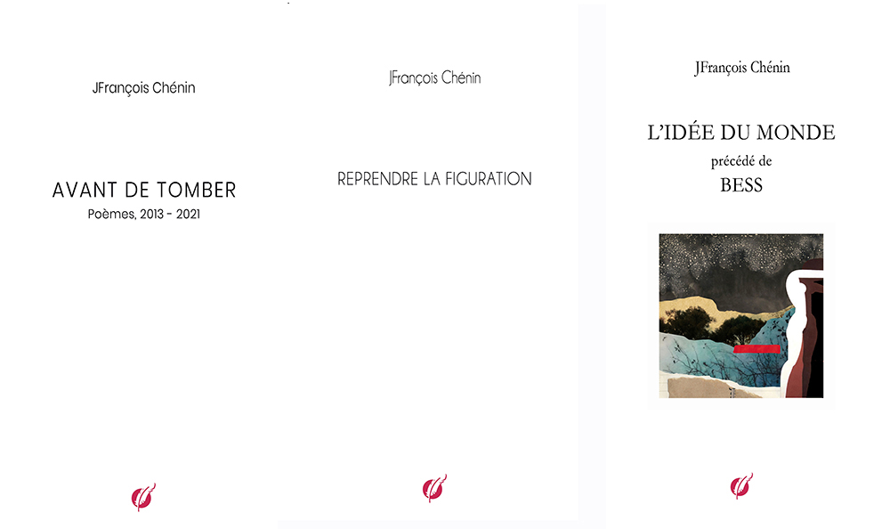

**LES OMBRES**

Les ombres qui nous emploient, qui forment nos désirs, qui pensent nos actes, sont l’argument irréfutable de la continuité des instants silencieux.

 

chez [TheBookEdition](https://www.thebookedition.com/fr/les-ombres-p-411032.html)

*Les ombres* contient
*Avant de tomber*, 2013-2021
*Reprendre la figuration*, 2020
*Bess suivi de L’idée du monde*, 2023

 

# REPRENDRE LA FIGURATION

## 
1 - Les conventions

Cette lumière déplacée, ronde, soulevée du fond de la même lumière inaltérée - en miroir.
Le souffle en bordure, juste relevé, un incident sur le parcours des vagues et des exaltations - De la tête au pied.
Une protestation en connaissance de cause sur la trace des sentiments. Tout ce qui manque de preuve est écrit dans les cartes rebattues.
Le vacillement dans les volées d'oiseaux perdus, convulsives dans les fonds basculés du ciel vers le vide - Les attirances sont parfois salutaires 
même si.
Une conversation dans les brûlures des revirements. Les incendies se propagent par tranches et divergence, d'embardée en embardée - Dans la confusion, résister au désordre.

## 
2 - Les arrangements

Un arbre sans tête accouplé au silence des plis du ciel sur les plis de la terre - Connexion de jugements pressés et d'alternatives inquiètes - Fuir ce qui n'est pas l'ivresse.
Brûlure et branle-bas de coups portés à la face de ce qui reste de branches, de feuillages, d'élancements et d'inflexions de vagues et de convulsions dissidentes de l'ivresse.
Ce que nous savons du dissentiment et de la déchirure blanche des orages entre deux nous bouleverse à chaque fois.
Les intervalles entre les violences sont répertoriés dans de longues partitions qui transcendent les pages qui les portent, les essoufflent et rendent chaque secousse nécessaire.
Nous sommes dans la prévision et la manie du répertoire et des solutions de continuité entre agitation et longues phrases détourées de leur chair.
Quels sont les ensembles qui restent à ouvrir ou à démembrer pour avoir raison du hiatus qui nous scinde ?

## 
3 - Les blessures

C'est un travail de toutes les nuits et du matin. Le noir et les lumières sont les alliés naturels des répertoires, des listes, des partitions et des blessures engrangées à force de parcourir sans retenue le champ miné des mots de l'écriture.
Ce sont des blessures de patience, bien ordinaires. Et les nuits ne sont ni suffisantes ni démesurées. Elles s'évanouissent aussi, puis meurent. Alors le temps n'existe pas.
Il n'y a de langage que dans le silence qui le percute. La durée du silence est la seule variable qui donne le mouvement. Mais pas le temps. Ce qui compose le silence, ce sont les mots tus ou retirés ou effacés qui rythment les flux et les reflux du langage. Ce n'est pas le temps.

## 
4 - Les constructions

Interjeter l'imperfection des mots retrouvés seuls ou assemblés.
Interpréter le vocabulaire restreint qui reproduit les absences ou les apparences.
Introduire dans la réalité des étançons pour soutenir les terrasses du ciel qui pourraient s'effondrer et relever les empreintes qui restent.
Intervertir toutes les visions et rapprocher les incidences. Boisage des chapiteaux et reconsidérer les arcs-boutants des preuves du silence qui désassemblent les mots.
Interdire les colorations hésitantes, pointer sans juger les reflets et revenir à leurs élévations pour éviter la cohue dans le langage. Tumulte, fouillis, mélanges et émeutes des mots en étincelles.
Interrompre les offrandes trop faciles, les rapprochements gratuits. Avancer à travers les blessures d'un ciel aux tempêtes bleues et noires. Le vacarme est dans l'absence des mots.
Interlettrer les embrasements souterrains qui rendent l'espace irrespirable, illisible ou brisé. 
Dresser les feux pour les rapprocher et agiter tout le réel de nos visions.
En contrepoint, ne pas spéculer sur les perspectives ainsi relevées. Aiguiser son oeil et les suivre.

## 
5 - Les déformations

L'emplacement des reflets et des empreintes est vide.
Ce qui reste est vide. Et ce qui était confus est en prélude de nos doutes.
Et dans la confusion, des étincelles et des brûlures reviennent et soulèvent le ciel.
Et les feux donnent des coups si crus que les rêves surgissent, décrochent et tombent.

## 
6 - Des avantages

Tous les étais croisent à l'à-pic des arcs-boutants qui soutiennent les passerelles et les échafaudages jusqu'au bout des horizons possibles.Un coup d'épaule n'y suffit pas.
Tous les horizons d'une mémoire martelée, en majesté d'orées superposées jusqu'au bout de la vision, d'une grande vision ou d'une histoire.
Et un regard, et l'épaule surprenante qui n'empêche rien.
Un regard qui ne défait rien mais qui n'arrange rien. Une parole qui ne tombe pas mais inaudible ou timide. Un personnage d'entre-deux et d'absence. Enfin toucher l'épaule, ne pas tomber.

## 
7 - Des familiarités

Contre les apparences qui déforment les mots, les rendent muets, installer les silences et les ruptures invisibles, toutes suivies d'effets. Le langage est construit du silence qui organise son rythme, ses élancements et ses élévations jusqu'au prochain silence qu'il a lui-même posé.
Langage et silence donnent le ton. Ce qui plonge en nous est une musique. Le langage commet parfois des erreurs mais ne sait pas se passer des tonalités qui le traversent. Des mots et des mots, des silences et de l'espace. Où se heurtent les 
silences, les mots s'affranchissent de leur nature.
Les réponses ne sont jamais simples. Les lettres sont défaites par-devers nous. Nous les avions tracées sous le coup de l'émotion et, dans le désordre, elles ont été éparpillées. En remettant de l'ordre, nous avons perdu le sens du désir qui les portait.
Pure forme du désir jusqu'au silence qui l'enferme. C'était en prévision d'une rencontre ou d'un hasard, en raison d'un voyage.

## 
8 - Les rivières

A mesure que les mots tombent et dessinent les ombres du langage où nous les abandonnons, plusieurs fois [...] A mesure que les silences ouvrent la voie à d'autres silences, plus froids, où nous oublions nos visions, plusieurs fois [...] 
A mesure que les corps s'attachent et bouleversent les sentiments devenus obsession et martel en tête, plusieurs fois [...] A mesure que le noir de ses yeux roule et perce ce qui reste de désir où nous nous réveillons, plusieurs fois [...] A mesure que la nuit s'élève et se déplie dans de nouvelles visions ouvertes sur notre disparition, plusieurs fois [...] Nous sommes désolidarisés et nous basculons pour des réveils inconnus.

## 
9 - Les intentions

Voir à travers, traverser, passer toutes ces frontières, faire magicien, détourner ce qui serait peut-être une vérité, détourer ce qui en reste, garder le fond noir du ciel et les pentes des talus qui dévissent de la mémoire, revenir sur un instant de ce passé très particulier des mots oubliés. Quelles étaient les intentions ? Qui parlait ?
Voir à travers, renverser le miroir, déplacer les balises, faire silence, approcher au plus près le visage ascendant, évoquer ce qui en reste, penser qu'il n'y a pas de vertu salvatrice ni de regret de ce silence soudain, placer haut le rêve, la mémoire du rêve et tous les attendus de ce retour en arrière. Quelles étaient les intentions ? Qui suivait ?
Voir à travers, soulever et retenir une respiration, faire apnée, gagner sur la dérisoire certitude d'une raison qui flanche, passer alors en force et marteler des mots que l'on croyait vides, les placer au fronton de tous les temples. Quelles étaient les intentions ? Qui jouait ?
Voir à travers, tomber, se relever. Interroger sans cesse - faire bombance. Se gorger des incertitudes du réel. Traverser, traverser incessamment tous les plis communs d'un cerveau et d'une terre. Traverser sans compter. Les intentions étaient-elles honorables ? Qui espérait ?

## 
10 - Les frontières

Les mots sont les témoins des frontières. Témoins à charge et témoins des prières répétées en pure perte. Rien n'est innocent ni gratuit. Les mots sont des passants et de dix à cent tous les contes sont donnés perdants.
Les mots sont décrochés des cimaises et les mots sont parfois des absences ou des pleurs, si tôt abandonnés, ou des îles oubliées, plus loin des larmes à l'aune des feux renversés qu'ils contiennent et ces alarmes entendues tant de fois, des rampes de lancement, des intentions et les vides des blancs bleutés revenus du ciel qui s'accrochent à ce qui revient de leurs incidences.
Nous ne sommes jamais seuls ou nous sommes toujours seuls. Les mots sont des accidents 
indescriptibles, des accents répétés de place en place pour ne pas oublier, les oublier, des instants ascendants qui ouvrent sur des silences pliés.
Les mots sont des ambivalences rétractées et déplacées dans des partitions ni théâtrales ni musicales mais blanches qu'ils divertissent. Les ouvertures défigurent les façades, les rendent impraticables et les mots retournent à leur normalité. 
Les mots sont des larmes du réel. Ils ne nous protègent pas et nous enfoncent dans une matière faite de fluides et d'imprévisions, d'organisations vite défaites et remplacées par d'autres assemblages. Seules les frontières sont encore perceptibles tout au fond, tout au fond des ombres comme des lames de fond qui content.

## 
11 - Les visites

Les mots pourraient être aussi des fantômes ou des apparitions exhumées d'un langage oublié ou qui a fauté d'avoir séparé les entrelacs fictionnels de la réalité ou qui n'ont pas su ramener au réel leurs avatars. Le langage s'est perdu dans les psaumes.
Les apparitions sont les étapes neuronales de la réalité. Elles sont silencieuses et amassent le bleu des âmes qui s'y perdent. Elles n'incarnent rien que le vide qui passe entre les mots et donnent son rythme au langage. A ce prix le réel se débarrasse de ses aléas.
L'incarnation du désir est dans les mots balancés avec force à la face d'un monde qui les absorbe et ne les comprend pas, ne les rend pas. Ils sont pourtant les seuls à pouvoir assumer cette tâche d'éreinter le fond des horizons où figurent les 
incidences encore possibles d'une vision et d'un désir qui s'y logent.
La matière vivante a besoin d'un langage pour achever son oeuvre d'irisation et elle sait qu'il n'y a pas de territoire sans les mots qui l'irriguent, le soulèvent et en extirpent ce qui reste de particules mortes de ses voyages. Elle les conçoit et les assemble sans jamais les prononcer.
Les mots ne sont jamais dans la demi-mesure. Des berges d'élancement vers les appuis plus élevés du ciel, ce ciel à répétition de nos rêves, nos dérives et nos chutes. Ils sont les petites mains du royaume où nous sommes si égarés et nous ramènent une fois la scène vidée de nos peurs.

---

## Dénombrement d'un profil discret

*Dénombrement d'un profil discret* est dédié à NK dite Renoir

1 

Qui, ma compagne ? Qui ?
Le corps apparent, le corps mélangé, la double **contrainte**
La fiction est un leurre du réel 
Il n'y a rien, c'est-à-dire il y a quelque chose de caché
La part de l'autre est une part voisine et provisoire
J’habite un vouloir obscur, dit Aimé Césaire, 
j’habite un long silence 
Rupture mentale dans le Concerto No. 2 in 
A major, S. 125 de Liszt
Rupture mentale confirmée
Et entamer une provision de rêves dématérialisés 
Je me souviens :elle s'appelle Anne de Bretagne 
et j'ai 20 ans
Rond, chaud et luminescent
A l'abandon d'une matinée 
Tout ce qui a été perdu est destiné à être trouvé
Et la réalité n'a rien à dire que des faits différés
Partir sans faire de bruit, faire semblant
On veut l'amour mais quand il se montre, on freine, on a peur d'y aller
Il manque à ma vie une femme 
Cette femme, c'est vous
La vérité est merdeuse...
Meurtres à la volée et dépendance de l'oubli
Les étourneaux tuent les chiens, dépassionnés
Le maître du jeu ne possède rien que les mots, des mots libérés des arguments, des mots si puissants
Qu'est ce que nous sommes...? 
Qui m'accompagne ? Qui ?
C'est du silence qui ne vient pas
Les règles du silence, l'application d'une procédure et la recherche des opportunités
Au bord des trous du ciel où tournent les milans
A l'abandon des jours gris rehaussés de bleu
Avec l'ostentation
Tout un étalage ludique
Vous me traversez comme du vent, écrivait-elle et ce n'était plus elle
Ces textes ont été oubliés dans un cartable
Les aéroports sont les nouvelles cathédrales avec leurs coursives, toutes ces arches, ces déambulatoires. Les cathédrales des voyages et du temps 
suspendu
Du temps suspendu à t'attendre
Mon histoire commence dans les lignes ensoleillées d'une perspective et d'une apparition rousse
Dans la chaleur du matin, une chaleur de début de monde, encore inconnue, impartagée. Je ne suis pas revenue, dit-elle
Les passions sont indicibles qui ne seraient pas déraisonnables
Retour
Les places détachées de leur temps, indépendantes et déroutantes
Alerte contre lui-même 
Vous devez me trouver bien pathétique et pitoyable. Je me ressens ainsi. Les hommes sont comme ça : grotesques quand ils s'accrochent, pathétiques quand ils insistent, pitoyables quand ils persistent
Je devrais me taire et vous laisser tranquille. Tout devient compliqué dans ces contractions des sentiments
Le prix à payer, c'est l'oubli ou le voyage ou la dérision
C'est la peur d'être seul, sans la vision ralentie de l'attachement. Double absence. Grand à côté vide. Ni une marge, ni une échappée sur le ciel
Ah cette vie ! Elle est le tombeau ouvert du ciel qui y déverse son trop plein de feu roulant et de misère
Comment tiennent les ailes au dos des anges ?
Et si je reviens vers toi, que de patience !
Mais si tu reviens ? Trop d'espace !
C'est une musique au-delà. Doucement martelée de la tête au pied, coupable, oui !

2

Qui est mon silence ? Qui ?
Ne pas liquider les histoires de voyage, les pointer
Elle se déshabillait en intimité et me parlait
Il faut s'occuper de la sécurité des corridors
L'obsécration est ou n'est pas une réponse
Rendre visite fait souffrir, s'en aller fait souffrir
Il n'y a pas de relâchement ni de pitié dans les guerres improvisées
Viol et volée de bois vert sans réclamation
C'est inaudible
Tout serait derrière nous
Infranchissable. Tout est définition d'une existence ou d'une relation
Elle a passé le seuil dématérialisé de la lumière
C'est à ce moment qu'on a compris nos contradictions et notre mal d'écrire
On revient en arrière, certains de l'inconséquence du geste
Changer les personnages, brûler les décors, jouer sur le vide
Les répétitions seront longues à la mesure de la 
dimension des partitions, de leur nombre et de leur continuité
Elle me parlait de vies inconnues dans des pays 
inconnus, des vies toutes empreintes de silence 
et d'attente
Qui est ma fuite ? Qui ?
Je n'ai pas attendu les voyages pour m'égarer
Avec elle, c'était plus facile et plus vrai, dans l'immédiat
Lever les bras quand il est encore temps
Quand la nature prend le dessus
C'est une suite d'escaliers et de coursives, des embrasements en colimaçon
Et la magie est toute contenue dans un silence, une porte ouverte, des lumières plus loin
Ai-je bien entendu ? Ce n'était qu'un souffle
Ai-je bien compris ? C'était encore un souffle
Il n'y a pas de répétition possible des certitudes 
ni des silences qui leur succèdent, pas de rebond
C'est une nuit de musiques apparentées dans 
les hauteurs d'Uzès
C'est une nuit par-dessus la tête, indéfinissable
Je t'ai donné un autre prénom mais l'identité n'était pas une réponse
Il n'y a pas de vérité entre nous. Nous sommes des assemblages de sentiments, parfois à la dérive
Rien n'est irréprochable. Il suffisait de reprendre le dernier voyage et d'être dans la prochaine étape quand le ciel devient délicat et s'efface.
Qui est mon évidence ? Qui ?
Qui est ma singularité ? Qui ?
Elle donnait si peu de mots, si peu d'attaches
Et les cimaises restaient vides
Les seuils sont des places tristes. Il faut les franchir
Nous étions le détail substantiel de notre mémoire
Et dans la série des vagues qui se recouvrent, l'une après l'autre, l'une sur l'autre inévitablement
Tu es la nuit viscérale, l'ombre indéchirable
La légitimité féérique de l'ordinaire
Ni plainte, ni regret, rien d'anormal, tout est 
évanescent
Qui est mon évidence? Qui ?