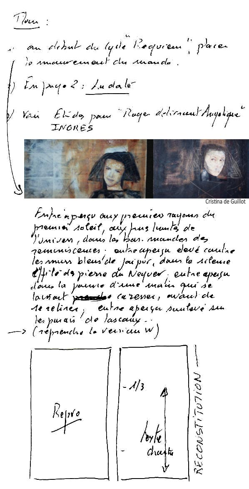
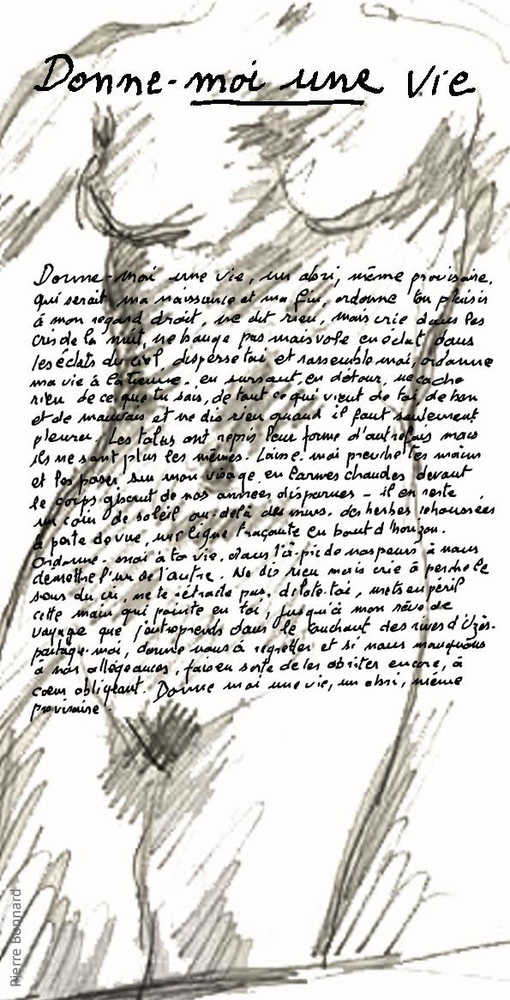

 

chez [the **BookEdition**](https://www.thebookedition.com/fr/recherche?controller=search&orderby=reference&orderway=desc&search_query=chenin)

# REQUIEM

## PLAN : 

1/ Au début du cycle Requiem, placer Le mouvement du monde. 
2/ En page 2 : la date. 
3/ Voir aussi études pour Roger délivrant Angélique (Ingres). 
4/ Remplacer les guillemets par des italiques 
 
Deux parties croisées dans Requiem : 
° Méthode, rien que la méthode des traces, des signes, des balises posées, déposées, déplacées, oubliées, retrouvées, rien que la méthode en marche. 
° Les suites. J’hésite à dire le résultat, ce qui en restera, ce temps consacré à remuer la matière des mots. L’histoire en somme qui en restera.

 

## LE MOUVEMENT DU MONDE

Entr’aperçu dans un horizon soulevé, irrésistiblement aspiré par le haut, intermédiaire dans un ciel qui se souvient de sa profondeur et de son poids, dans l’entrelacs des charpentes qui le portent, mais légèrement, du bout des doigts, dans ce qui serait un dédale effervescent fait d’ouvertures parfois plus claires ou d’impasses plus sombres, à mi-chemin du désert qu’il quitte et des rives qu’il abordera immanquablement, voilà le trait soudain qui décide de sa course, qui décide de l’allure de la pente, la raison invoquée de sa sortie de l’ombre, pour voir, pour vivre ; 
entr’aperçu, alors que le silence pèse, entrecoupé de souffles et de cris apaisés, à l’apogée de la nef qui le répercute sur des murs droits et blancs, sur les côtés du monde, dans les branches du bruissement doux de l’ombre, à l’heure dite du couchant qui plonge toute chose dans sa chaleur et qui pro-
jette, entrelacés, sur les parois du ciel, les rêves qu’il fait naître; 
entr’aperçu à force de renaître dans le flux et le reflux de soi ; 
entr’aperçu par magie dans l’illumination fragile d’une étoile qui se noie, derrière les rêves, dans les rêves renouvelés de sa naissance, réapparu du magma qui l’enserre jusque dans ses respirations et, scintillant à nouveau, perd à nouveau ses 
racines jusqu’au prochain sursaut ; 
entr’aperçu dans le sourire de cette infante au pied cassé ; 
entr'aperçu dans le souffle vertigineux de cette amante sortie de son miroir, le regard franc ; 
entr’aperçu quand, martel en tête, l’horizon borné de ses frontières plonge dans le tumulte bleu de ses propres limites, résultat d’une démission plus forte, quasiment définitive, celle du ciel contre sa lumière, celle du ciel contre son crépuscule ; 
entr’aperçu dans l’aile de l’oiseau subreptice, effleurant le fond du ciel ; 
entr’aperçu sur la crête de la vague à l’assaut de l’air, qui renoue avec toutes les vagues, passé le cap, passé l’orage, passé la grande barre de corail qui coupait le monde en deux, avant et après elle dans l’effondrement du ressac de la mer sur elle-même, sur la crête de la vague, la plus forte, qui l’emporte dans un soulèvement interminable à l’assaut du vide et du silence, dans un silence blanc, lumineux jusqu’à l’extase - voilà la mer à nouveau calme ; entr’aperçu dans ces yeux si clairs et ce sourire si doux ; entr’aperçu où le vent s’est levé sur le gisant des nuages à la longue respiration, où la ruse est diaphane au faîte du toit du ciel ; 
entr’aperçu plus que jamais disponible dans les ailes des oiseaux frôleurs, luminescence magique du blanc sur le blanc quand l’horizon n’est pas plus loin que le bout de la main, quand, affranchi du poids vivant d’eux-mêmes, la réverbération de leurs plumes éclate en morsures sur le ciel arrondi ; 
entr’aperçu dans ce rondo de Mozart, retourné dans les plis d’une patience qui ne finit pas, carte après carte déposées sur le fil tendu de cette patience attendue ; 
entr’aperçu au début du jour sous la pluie brusquement survenue, la pluie d’un long matin, d’une longue attente de la lumière ; 
entr’aperçu dans l’improvisation d’une danse pas à pas quand le corps se déhanche au rythme d’une salsa, quand le corps rejeté se défait, interjeté, grandi, appelant l’indiscrète perspective à la verticale du cerveau qui la réfléchit dans ses miroirs en face à face, ordonnance du dedans sur le dehors, du froid sur le chaud, lente agrégation, en apparence le vent n’a pas changé de trajectoire, il plie aux mêmes endroits, à peine décalé, déchiré de bas en haut de sa force ; entr’aperçu toujours possible au sommet des nuages dans l’implosion grise et blanche du souffle qui les tient, le regard renversé pour toute prière ; 
entr’aperçu comme une révélation, révélant l’ordre accidentel des pas sur le sable, cette intime familiarité avec l’artifice, la légèreté faite profondeur des yeux et chaleur du corps, l’ingénuité faite vérité de la chair et cœur du désir, il n’y a rien d’illégitime dans ce risque pris à parfaire la démesure de soi, rien d’anormal à le croire magistral, miraculeux, féerique en somme parce que ses excès sont le théâtre de nos sens ; 
entr’aperçu à la rescousse de la jouissance, dans la main de l’autre, dans le regard de l’autre, arrimé à jouir d’elle, écrasée de caresses, ombre de la main enfouie dans la chair, jusqu'au retournement, jusqu’à l’émerveillement, main délivrée de l’obstacle jusqu’au cœur, entre la vie et la mort dans l’obscur assujettissement du dormeur réveillé, la plaine ouvre ses plis, délivre de la soif, jusqu’au recueillement recroquevillé, sans plainte, attentif au souffle qui survient, voilà le grand voyage, à 13h29 tout recommence ; 
entr’aperçu aux premiers rayons du soleil, aux fines limites de l’univers, dans les bas-mondes, les grands basmondes des réminiscences ; 
entr’aperçu élevé contre les murs bleus de Jaipur, dans le silence effilé des pierres du Néguev ; 
entr’aperçu dans la paume d’une main qui se laisse 
caresser, avant de se retirer ; entr’aperçu soulevé sur les parois de Lascaux ;  
entr’aperçu, rencontré au débouché de l’orifice bleu du vide, avant de naître, avant le cri, martelé dans l’entre-deux du silence d’avant le terme, en deçà des gestes et du premier sourire, en deçà de la vie et des premières larmes ; 
entr’aperçu aux premières mesures du Requiem de Gabriel Fauré, dans le requiem de la vie virevoltée, en partance de toute part ; entr’aperçu dans l’explosion bleue du premier matin ; 
entr’aperçu dans la chaleur qui ride l’air et retient le feuillage dans sa naissance ébruitée ; 
entr'aperçu haut gisant du ciel au-dessus des ponts qui le soulèvent encore dans un souffle effilé ; 
entr’aperçu à l’horizon qui tourne, bruissant soudain d’un vent long sur son fil de soie, jeté par terre, se relevant, enlevé dans les branches qui jouissent, heurté revenu glissant le long des haies, arraché des murs qui le retiennent, sans limite, sans trêve pour respirer, qui tombe brutalement en aplat lumineux sur la cime des arbres, sans limite, bleu, voilà le mouvement du monde.

 

## L'INVENTION - extrait

L’invention de Requiem est encore à venir, dans l’entrelacement des rencontres et des prévisions. Comment vient le futur dans l’esprit qui tente de le penser ? c’est une question de secret et de solitude. Le secret pousse à la solitude. Requiem pour un secret. Mais le secret c’est au moins être deux, d’un regard à l’autre, d’une main qui prend une autre main. Requiem du partage non-dit, dit une fois, tu. Je me souviens de Quentin : Taire les mots ( ). A quoi servent les références ? Parler à la place d’un autre, faire parler un autre, reconnaître notre allégeance. Mettre en exergue le secret qui finalement tue l’avenir. Avenir tu, en suspend. Un secret ne peut pas être offert. Il n’est partageable qu’entre ses détenteurs et il les sépare. Requiem pour une séparation. Les secrets séparent. Pourtant il serait plus simple de crier. Mais qui entendrait ? Rétablir la peine ou remise de peine ? 
 

C’est un pli sur le soleil relevé. Deux corps arrêtés sur leur jouissance. La vie est une terrasse, un déambulatoire. RESURGENCE. Il faut posséder lentement, sans précipitation, sans outrance, dans le silence des gestes prudents. Donne ce que tu as de plus souverain, donne ton plaisir. Le monde s’ouvre sur des feux souterrains. Quoi de plus naturel qu’un corps ébranlé devant les yeux ! 
 

Requiem des silences tus. 
 

Où est le centre ? La magie du centre du monde, du bas vers le haut. 
 

Ce qui est mort en nous est en creux, l’empreinte d’un signe absenté. Un pli sur un pli oublié. 

L’organisation 	verticale 	des 	rêves, l’organisation horizontale des sentiments. 

A la pointe d’Uzès ( ) finit sur Albuquerque. Le chemin s’accomplit. Uzès est le jour de la séparation annoncée, mise en œuvre. Albuquerque le moment du retour pour une autre rencontre, une nouvelle chance. Dans le silence d’Albuquerque - qu’il fallait fuir - pour y revenir et, une fois revenus, nous pouvions alors compter sur les souvenirs des voyages. Requiem des voyages perdus. 
 
Un feu blessé, se relevant, un feu d’avant, de très loin, presque tu, juste des braises bientôt scintilleuses, tout au plus, un feu arraché de ses flammes, de son ambition à proliférer, ce feu 

Le secret est à lui-même sa propre fin. 
 

Je ne suis pas à ta main ! Je suis au bout de ta main ! 
 

La vie est naturellement parcellaire. Pour finir, requiem est une reconstitution de la vie, une reprise, une remontée. Le cœur en cessation. 
 
 
En place, dans la place, résolution en lieu et place de l’abandon. Gagnons cette résolution franche sur l’avenir, maugréons une bonne fois pour toutes. Ce qui en restera : un nouveau sentiment de liberté. Et alors ? Et alors ! Abdication du dépouillement. Requiem vient à point pour défaire les frontières et les nœuds qui s’étaient lentement agglomérés entre eux et qui 

Le cœur de Requiem est dans ce passage de Pascal Quignard : Ceux qui écrivent ne savent  pas ce qu’ils font. Comment le sauraient-ils puisque par définition ce à quoi ils œuvrent n’est pas encore ? C’est à peine s’ils savent s’ils donneront au jour ce à quoi ils tâchent en secret. Comment auraient-ils l’idée des conséquences éventuelles de ce qui a encore ni forme ni existence ? Les os, la chair, poils et peau, membres et corps, tout pullule autour d’eux. Ce sont les mots, les phrases, les figures, les émotions, les scènes, les souvenirs des livres, ce qu’on est et ceux qu’on a connus. Tout conspire à une œuvre qui n’aura de visage qu’une fois achevée et d’efficience que lue. ( ) 
 

 Sur le pont - Cette place est devenue la mienne, elle s’élève en pente douce dans un mouvement monumental qui devrait toucher  le ciel, qui ne le touche pas, qui l’effleure  de sa respiration qui m’élance et m’emporte. 

Fin. Revenir. Mouvement en instance de désamour. Albuquerque est un terrain miné, une possession provisoire, une occupation frauduleuse. Elle devient inapprochée - oui en instance - offerte mais fermée, ouverte mais en retrait, là mais distraite, Albuquerque à grands traits de coups de crayon sans aplat, sans horizon, juste des lignes, des croix, des réserves de fusain pour souligner l’attente, le vide – sans profusion mais il n’y manque rien. Elle est au bout de la main dans sa gangue bleutée, austère, une gravité, une mémoire : ELLE N’EST PAS VIDE, ELLE SOUFFLE. Mais fuir. Au commencement d’Albuquerque il y a la fin d’un voyage, une sortie du monde, une entrée en enfer, un territoire interdit. Et Albuquerque respire du fond de son désert blanc. Désamour et déraison. Ce qu’il en pensait n’avait pas d’importance. Au prochain motel, sur la route d’El Paso, il respirerait, elle sera détruite, pensa-t-il, mais les lignes sont solides et les traits tenaces qui la tiennent dans sa pensée - sa vie peut-être ? Fuir, refuir, s’obliger à cet allerretour récurrent, l’organiser, le rendre habitable.  
 
Tel est le terme : trouver, retrouver une terre habitable où Albuquerque serait le centre mais aussi ses alentours, ce confondant avec ce qui la distinguerait : des espaces vides qui seraient les ombres de son élévation. Albuquerque n’a pas d’histoire, elle est l’histoire de cette fuite en soi à laquelle on n’échappe pas, une fuite qui serait la rédemption de tous les morts morts en soi, les visages disparus en nous, les mains lâchées, ce sourire, cette tendresse, ce début inachevé du désir. Fuir ou disparaître. Céder sûrement à la fin des horizons. Seule la route nous sauvera d’Albuquerque. 
 
Requiem est une ode à la vie, à la vie bouleversée par un ciel désuni, mais à la vie qui reprend le dessus, gagne son pari d’être la rive élevée, le sourire éblouissant, la vie hors du soupçon. 

Dans les plis que les étoiles tressent l’un sur l’autre d’un bout de ciel vers le ciel inespéré, les tresses étincelantes du désir en elles de se rompre dans l’enchantement survenu de la lumière quand, du fond de l’horizon noir, elles grappillent la vie et l’amour et les grands désordres du bout du monde. 