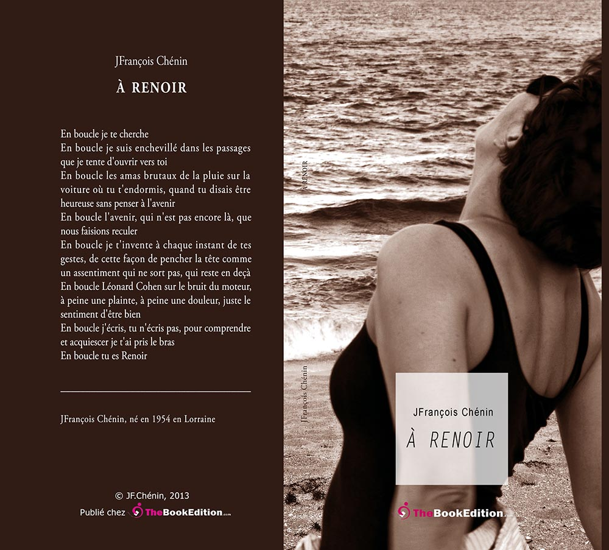

 
chez [the BookEdition](https://www.thebookedition.com/fr/a-renoir-p-99500.html?search_query=chenin&results=48)

# A Renoir

En boucle la pluie  
En boucle je t'invente à mesure de ton apparition  
En boucle me reviennent les rives marinières et chantantes de Key West  
En boucle me reviennent les fins hésitantes de la nuit, le jour harcelant jusqu'au tréfonds de la pensée, trois marches à passer pour changer de monde, en boucle les trois marches où s'agenouille la fin du soleil  
En boucle des images en masse, anodines, qui prennent un sens différent, dont l'ordre n'est pas acquis, vaste jeu de cartes qui ne doit rien au hasard, l'ordre vient avec les mots  
En boucle trouver les mots qui manquent aux images, qui ne sont pas des images  
En boucle écrire. Ecrire, c'est te donner un visage. Ecrire, c'est te déceler, faire irruption au bord du monde de ta réserve. Ecrire comme on devine, écrire à profusion de tes silences. Nous sommes à bout portant du désir. Mais ne rien écrire qui ne viendrait à bout des sentiments. Il faut s'endiabler une bonne fois pour toutes, s'exiler au fond des yeux, toucher par petits bouts ce regard en soi, se solidariser. Les vérités sont demeurantes qui nous donnent à vivre ce que nous sommes  
En boucle je t'invente à mesure de ta respiration

  ---
  
## Moi, j’aime

"_Moi, j'aime. J'aime tant tout ce que j'aime ! Si tu savais comme j'embellis tout ce que j'aime, et quel plaisir je me donne en aimant ! Si tu pouvais comprendre de quelle force et de quelle défaillance m'emplit ce que j'aime !… C'est cela que je nomme le frôlement du bonheur. Le frôlement du bonheur… caresse impalpable qui creuse le long de mon dos un sillon velouté, comme le bout d'une aile creuse l'onde… Frisson mystérieux prêt à se fondre en larmes, angoisse légère que je cherche et qui m'atteint devant un cher paysage argenté de brouillard, devant un ciel où fleurit l'aube, sous le bois où l'automne souffle une haleine mûre et musquée… Tristesse voluptueuse des fins de jour, bondissement sans cause d'un cœur plus mobile que celui du chevreuil, tu es le frôlement même du bonheur, toi qui gis au sein des heures les plus pleines… et jusqu'au fond du regard de ma sûre amie…_ "
Colette (_Les vrilles de la vigne - Toby-Chien parle_)

---

## Librement

Nous naviguons à vue dans des moitiés de rêves, des parts de mondes fantasmés et surestimés. Quand nous en aurons fini avec cette errance, nous ne serons pas plus libres, seulement débarrassés de l'amertume d'avoir perdu les visages familiers qui étaient encore là et disaient la joyeuse surprise de nous retrouver.

---

## Ce que je sais de toi
A Renoir

    Ce que je sais de toi, je l'invente à chaque instant de tes gestes, de ton allure et de ton pas, de cette façon de pencher la tête quand tu te tiens droite, comme un assentiment qui a du mal à dire, qui ne sort pas, qui reste en deçà ; cette manière douce d'avancer le corps, le bras, la main, de poser sur les choses une approbation calme et instantanée. Je l'invente dans la réalité de tes mouvements et de ta présence, ce silence tout à coup qui entame tes gestes.

    Ce que je sais de toi, je l'apprivoise dans tes yeux, où parfois je cherche ce regard que la tête baissée cache, je cherche un signe de toi qui retient sa respiration, toute intérieure, une respiration dépaysée, presque apnée, très lentement maitrisée et remontante à mesure que je retrouve ton regard. Je t'invente à mesure de ta réapparition.

    Ce que je sais de toi, je l'approche chaque jour que tu ouvres les bras, que ton sourire respire, si fort ramassé, si peu revenant. Je t'approche et je t'invente de cette façon égarée d'aller au plus pressé, mais patiemment. Cette invention est la mienne, cette image est la tienne. Elle coincide dans ma connaissance de toi.

    Je t'invente à mesure que tu t'approches et je sais que je ne sais peu de toi, que ces petits hochements de doute, ton sourire patient, légèrement moqueur ou distant, ce filigrane de tendresse, cette compréhension indulgente face à mes maladresses. Je t'invente dans mon désarroi de ne pas te saisir entièrement, de ne pas approcher toute ta réalité.

    Ce que je sais de toi revient dans une chanson de Leonard Cohen.  
    Ce que je sais de toi est de s'arrêter chez l'Indien au toit bleu.  
    Ce que je sais de toi est de t'avoir attendue.  
    Ce que je sais de toi n'est pas écrit.

    Et cette façon de te blottir dans mon dos les bras autour de ma taille.  
    Comment veux-tu que je te vois ?

    Comment veux-tu que je te vois quand tu t'enroules ainsi contre mon dos tout autour de ce corps dans lequel je ne me reconnais pas - le mien ? Comment t'imaginer ? Alors je t'invente à mesure de ta respiration qui glisse le long de mon épaule et je comprends tes yeux fermés, doucement, doucement, avec ce désir de se laisser aller, ce désir souverain de ne plus bouger, d'être un recoin de toi-même où tu te réfugies. Te protéger de quoi ? Pour oublier qu'il faudra ouvrir les bras, en sens inverse cette fois, pour se libérer de nous-mêmes, nous détacher, nous voir. Ce que je sais de toi est tout entier dans ce mouvement arrêté de ton corps contre moi, du poids de tes bras autour de moi, de la tendresse de ta joue contre mon épaule où je peux m'accepter à mesure que je te découvre, de tes yeux qui s'ouvrent, qui reviennent, que je vois. Ce que je sais de toi est dans tes yeux gris-vert.

    Ce que je sais de toi est un matin léger aux marches du soleil.  
    Ce que je sais de toi est un jour de prison sans fin.  
    Ce que je sais de toi est une fuite en avant la nuit venant.  
    Ce que je sais de toi s'invente dans les silences que tu décides.

    Ce que je sais de toi tient dans la paume de ta main posée sur mon épaule où je devine qu'elle me retient de te regarder. Ce que je sais de toi est dans le silence de ta main.

    Ce que je sais de toi est dans ce petit hochement de tête, léger sursaut, légère arcade qui approuve ou qui dénie sans le dire, en le disant pourtant, en affirmant bien haut et tout bas, oui, non, selon les circonstances. Ce que je sais de toi me traverse encore comme une question répondante.

    Ce que je sais de toi, je l'invente de tes bras autour de moi.  
    Ce que je sais de toi ne me rend pas plus serein.  
    Ce que je sais de toi est un bouquet de roses pâles posé sur la table carrée.  
    Ce que je sais de toi est un voyage, pas une destination.

    Ce que je sais de toi tient à un fil et tu m'échappes. Ce que je sais de toi tient dans le doute de te révéler. Apprivoiser ? Un fil qui n'atteint pas le bout du labyrinthe, lui-même inextricable dans les dédales et les aller-retour qu'il nous impose, enchevillé dans les passages que je tente d'ouvrir vers toi, au seuil de toi.

    Je suis au seuil de toi, à t'entrevoir.

---

À la mesure des illusions qui nous enchâssent dans le ciel : un partage d'influences et d'horizons.

Mais il arrive parfois que le ciel tombe dans le gris-vert de ses yeux.

Les passions sont imprescriptibles. Les sentiments se défont, se reforment, jouent à cache-cache. Le désir est dans l'entre-deux ; en aparté, dans un désir resurgi ; en double-part, sur les rives cotoyées des retours.

J'ai beaucoup appris des images volées et abandonnées, des rires et des mains qui feulent, des sources rêveuses au fond des mains qui tremblent, des voix qui viennent en rut, des voix qui harponnent et soulagent, des fuites qui n'ont pas de prix, du souffle au creux d'une hanche, des rives caressées de la bouche, du feu errant et des étoiles filantes, des étoiles désarrimées de leur trajectoire, des images à tout va, désormais sur la place publique, incantation maladroite de l'ombre en bout de course, maladive ; j'ai beaucoup appris dans les rires diamantins du vide incandescent, jusqu'à la fin en soi du rire ; j'ai beaucoup appris à pleurer des images et du silence de la main.

## TOUT EST PERSPECTIVE

Faire un pas de côté modifie la perspective et crée un écart mental qui change le point de vue. Modifier la ligne de fuite, déplacer le point focal. Devenir mobile dans le champ de lignes, se déplacer, accepter d'être nomade, s'extirper du champ.

L'espace immédiat est encombré de choses immédiates. Sortir du court terme, abolir demain, se déplacer plus loin. Eviter cependant de se déplacer selon une même ligne dans la fuite. Chercher la rupture des fuites, du sens actuel de la perspective. Tracer jusqu'à rompre.

Changer le sens, modifier les fuites. L'espace devant soi est une multitude de lignes de fuite. Déplacer la vision arrêtée, défaire la pensée qui s'arc-boute sur un seul point. Changer de focale. Ce ne sera pas la première fois. Ce sera une nouvelle fois et toutes les fois à venir.

Tout cela a à voir avec les sentiments. C'est encombrant les sentiments, ça longe les lignes de fuite, ça les ronge, ça monte par bouffées comme de lentes résurgences d'un désir qui ne veut pas mourir. Faire mourir le désir, voilà l'écart à faire, voilà le deuil des lignes d'aujourd'hui.

Désappendre, désarrimer. Se désarrimer des lignes de fuites qui encombrent la vision et le champ. Changer de champ ? Ce sera le même, il n'y a qu'une vie, il faut se déplacer dans le même champ et gagner d'autres lignes de fuite, fuir différemment, organiser la vision d'un autre point de vue, selon d'autres sentiments.

Gagner sur ce qui meurt, gagner sur ce qui nait. Sortir de l'impasse des sentiments. Elargir le champ, repousser la vision plus loin. Il n'y a pas de limite au champ, seulement des horizons. Les horizons se franchissent, à la découverte d'autres plans du champ, d'autres arc-boutants qui tiennent l'espace du champ.

Gagner de l'espace, respirer mieux, à profusion. Devenir cette profusion des horizons atteints et franchis. les perspectives sont toujours vertigineuses. Accepter le vertige. Peut-être s'agit-il de errer, de renouer avec l'errance, d'accepter d'être nomade ?

L'errance casse les points de vue, le nomadisme va en travers des lignes de fuite. C'est une fuite traversière, avec des horizons renversés pour voir mieux et respirer mieux, plus large. Peut-être s'agit-il d'effacer le "jadis". peut-être est-il question de grandir, d'élargir le pas ? Grandir avec la conscience de la douleur des sentiments ?

Au bout des sentiments il n'y a pas de visage familier. Seulement la rupture d'un regard qui bute, d'un désir qui rompt, de sentiments qui n'ont pas leur place dans un mouvement qui cherche à naitre. Les sentiments forcent à l'immobilité. C'est le danger et la douleur.

Il manque au point focal du désir les lignes adjacentes de la fuite, celles qui ne se laissent pas de traces, celles qui s'effilent le long du regard dans une recherche éperdue du désir. La fuite n'est pas le remède, elle n'oblige pas, elle vacille à mesure de son avance.

Ainsi sont les sentiments, des fuites vacillantes, prêts à renaitre. Nous sommes le champ labouré de sentiments, d'exaspérantes réminiscences de nos visions à courte vue, à peine formées qui laissent le coeur et le souffle - notre respiration - inassouvis.

Dans le champ de notre esprit, les juges éructent à profusion. Ils se démènent contre nos désirs, les rendent amères jusqu'à penser qu'ils sont notre perte. Ils manipulent seulement nos sentiments, rendent indistincts ce qui nous fait et ce qui nous ronge.

Apprendre à désapprendre, revenir à l'errance, aux signes du feu aperçu dans les lointains, aux horizons qui ne se laissent pas atteindre, qui reculent, qui se donnent brutalement dans notre fuite inexorable à les franchir, où nous entrons libérés des sentiments.

Plutôt que l'errance, s'arrimer. _Je vis où je m'attache_, écrit Yves Navarre. S'accrocher aux linéaments des perspectives, se porter en avant mais s'obstiner dans la même ligne de fuite. Ainsi vont aussi les sentiments, ils s'enchainent et s'agglutinent, ils s'opiniâtrent par devers nous.  
  
Les rives et les bleus de l'âme s'attachent à nos rêves et les détruisent. L'entêtement, martel en tête de ce qui nous échappe, est une trahison faite à soi-même. Nous aimons en pure perte mais nous avons aimé. On poursuit, on se donne, on se cramponne, on s'épouse, on se livre, on s'aheurte, enchaînés que nous sommes à nos démons, qui vitupèrent derrière nous, préoccupés qu'ils sont à nous retenir encore.  
  
Plutôt que l'errance, l'écart en soi, faire ce pas de côté et se dévier, devenir irrégulier. Ainsi grandit le désir en nous qui remet à sa place ce qui s'effaçait. Déchirer ce qui reste à déchirer.

Ne pas rester immobile. Retrouver une vision, des visions dans les à-côtés des sentiments qui meurent. S'agit-il de renoncer, d'étouffer, d'arrêter la respiration, d'éviter les résurgences, de douter des moments complices, de ce temps devenu du passé ? De quoi s'agit-il ? Etre errant !

Le feu est errant, les sentiments demeurants ! Le feu passe les horizons, les sentiments clouent au sol ! Il y a toujours un deuil en instance en nous, une part en nous qui n'était pas la nôtre, qui meurt. Qui n'était pas la nôtre, mais qui était cette part irréductible en nous de l'autre, parfois de nous-même en l'autre.

Les sentiments nous mettent en danger. Reprendre la marche, fuir le danger, sauter sur l'horizon, sauter pour respirer profusément. Gagner le feu errant ! Ne plus arpenter en droite ligne des lignes de fuite. A rebours dans la marge.

L'entêtement des sentiments à surgir, mais attendus, décidément en embusquade. Nous ne le savons que trop, dans les volte-faces de l'ivresse et des larmes, cette inquiétude qui reste, en boule. Il faudrait se précipiter, remonter à la surface, se décider pour l'une ou les autres, l'ivresse inouïe ou les larmes rassurantes.

Nous ne connaissons jamais le dessous des cartes. On ne lit qu'à demi et il manque une certitude à nos sensations. La perspective est là, à bordure des vérités qui nous échappent ou des sincérités qui nous fuient. Nous vivons à l'esquive. Nous sommes les voix entremêlées et tues de désirs qui pourraient se retourner contre nous.

Qui se retourneront contre nous.

Une respiration, une lumière élancée, un ciel soulevé... Une route, foin de la destination !  
Des parfums à profusion, des parfums du fond du corps, ce ne sera pas ordinaire.  
Et ces mots qu'on reçoit et ces mots qui reviennent.  
Ces mots d'entre-temps. Ce caprice de mots, ces mots qui tombent dans le noir.  
Avoir moins de larmes. Redoubler les feux, les placer de loin en loin, aller en éclaireur, traverser et ôter les épines, repérer les passages, allumer les feux.  
Et dire comme on avance, sans détour de mots, sans mensonge.  
Et les parfums, devenus vivants, alertés. Respiration, moins d'ordinaire.

Ecrire, c'est lui donner un visage. Ecrire, c'est la déceler, faire irruption au bord du monde de sa réserve. Ecrire comme on devine, écrire à profusion de ses silences. Nous sommes à bout portant du désir. Mais ne plus écrire qui ne viendrait pas à bout des sentiments. Il faut s'endiabler une bonne fois pour toutes, s'exiler au fond des yeux, toucher par petits bouts ce regard en soi, se solidariser. Les vérités sont demeurantes qui nous donnent à vivre ce que nous sommes, vraiment.

Le signe sur le silence. Le silence dans le signe. Une main fragile, élevée, débarrassée de son tremblement, de ses interrogations. Une part du ciel dans la paume fermée, une paume lovée au fond du ciel. Instant de gratitude, envie de gratitude, de reconnaitre ce silence comme une faveur. Le ciel est vide mais celui qui s'élargit en moi, celui qui respire en moi, qui ouvre son infini est le ciel silencieux de mon émerveillement à être.