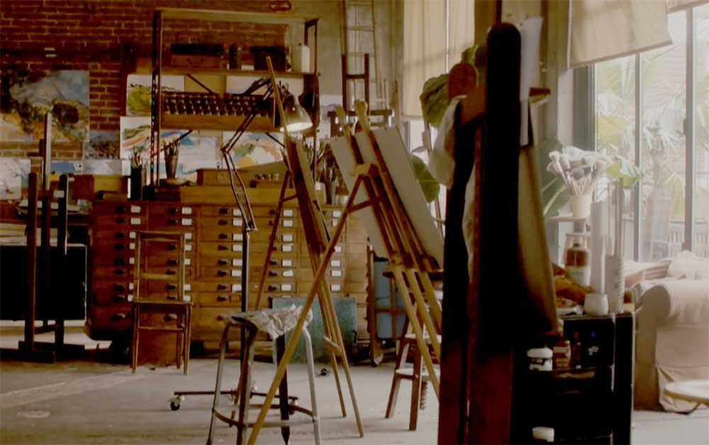

*J'ai compris que je ne vivrais pas éternellement. Il faut longtemps pour apprendre ça, mais, une fois qu'on le découvre, le changement intérieur est complet, on ne peut plus jamais redevenir tel qu'on était.* 
Paul Auster, Moon Palace

---

# dans l’atelier du peintre
**à Mia**

---

 

*dans l’atelier du peintre* (qui figure sous le titre *Nous sommes des silencieux* en seconde partie de *Flyovers*) a été écrit à Miami et publié en 2015 dans *Figure Out, Suites américaines* [voir](https://darkness.chenin.fr/darkness/figures-out/)

⁂

Le modèle habite le peintre au fond des yeux, du haut de leurs sentiments, mais un modèle silencieux et un peintre malhabile pour des ébauches de fond en comble ramenées à coups de pinceau, à coups de mots à la surface de leur assentiment à être deux, partagés, éloignés, en aparté. C’est le piège de l’atelier d’être un entre-deux.

⁂

La terrible imprécision du silence : retourné, dénaturé, bouleversé sur ses propres aplats. La ville est parcourue de vide et de ciel fluorescent. Là, tout près, souvent la nuit retombe dans ses gorges inassouvies. La place est intermédiaire où les hommes ont fourvoyé leurs rêves, où les femmes les ont suivis, reines et rois, l'archet, les cavaliers morts à la charge, les fous, les soldats complices, tout un peuple d'à-côté. Le vrai du faux qui balance et fait douter. En partance pour le début du monde. Gravité contraire. La folie est solidement arrimée aux cimaises vides de murs vides. Noirceur de cet échange entre faux et vrai. Le nouveau monde en trois dimensions : ciel, verre, humains en perdition.

⁂

Grandeur des petites déroutes, rémission de l'apesanteur, sommeil parfait. C'est le plein d'une grande illusion qui cherche à sortir d'elle-même, qui demande à s'émouvoir. Sortir de soi, entrer en soi, même mouvement, même destination : au point de rencontre des petites choses qui nous entourent et qui décident de la vie qui va suivre. Grandeur de l'errance, rêve du nomadisme, irrévérence magique. Voir encore le ciel gagner une part sur lui-même. Se décider à battre les mots à la forge des vérités que l'on est prêt à dire. Pas toute la vérité. Interjeter appel de la vie.

⁂

Nous sommes des silencieux, des feux perdus, des soldats désarmés à la recherche d'un abri, mais un réceptacle qui grandirait avec nos émotions et nos pleurs, une anfractuosité respirante à la mesure de nos retournements. Nous sommes transhumants et nous brûlons. L'espace autour de nous n'y suffit pas. Ce qui change ne revient pas. Nous sommes des silencieux. Nous reculons parfois et les feux sont loin et parce que les lumières - scintilleuses - ne sont pas des feux, nous perdons nos repères et nous restons blessés. Notre parole meurt. Mais c'est un autre silence, un faux-semblant en arrière-goût quand tout se tait en nous. Qu'il est insupportable parfois d'avancer ! Le pas est sans poids et les quelques souvenirs qui nous tiennent - fin du tréfonds - nous répugnent tant nous 
savons qu'ils sont vains. Nous sommes des silencieux, des natures généreuses au bord du gouffre où nous allons tomber. Nous nous précipitons sur nos faux-pas. Nous sommes des feux perdus, dispersés, éloignés les uns des autres. Nous surgissons au hasard, mais notre volonté n'y est pour rien, seulement l'instinct, le très-bas instinct de ne pas s'éteindre. Il nous sauvera, nous donnera à revivre ce que nous redoutions mais que nous avons accepté - de bon gré - exactement où nous avons surgi la première fois, dans un saut de l'air sur l'air qui fait notre clarté et notre dissidence, mais notre évidence et notre fragilité. Combien sommes-nous ainsi ? 
Combien sommes-nous à gagner sur le feu qui nous ronge et nous consume, à devenir le trou noir qui nous absorbera ? Nous avons touché des mains sans pouvoir les saisir et - malgré nous - nous revenons aux racines en partie détruites de nos éclats. C'est cela : nos éclats et nos rêves d'incendie tout au long des horizons et des faîtes que nous souhaitions franchir. Nous sommes des feux perdus.

⁂

De bas en haut des certitudes et des doutes, c'est la raison d'écrire au retour des raisons de rire comme de trembler, des sentiments qui vitupèrent ou qui se lassent. C'est la raison de fouiller les mots à travers les accidents qu'ils provoquent - à la prochaine bifurcation, je poserai un point, un sourire, une larme, un blanc jusqu'à la prochaine respiration.

⁂

Entre nous, par devers nous, la vie se déroule par tous les bouts. Je n'ai de cesse de m'affranchir de cette mémoire en lambeaux que je traîne - majestueuse - de texte en texte. Elle sera vaincue et elle m'étouffera pourtant parce que je n'aurai jamais assez d'elle. Je m'installe à l'aplomb du vide qui me bouleverse, en déséquilibre parfait - c'est-à-dire droit à l'à-pic des murs qu'il dresse opportunément pour m'empêcher de tomber. Mais je tombe effrontément. Je prends sur moi - belle expression du détour et du silence - je prends sur moi pour respirer mieux, voir mieux, saisir les alentours, en deviner les grâces particulières - je veux dire ce que j'en retiendrai quand je les aurai quittés et oubliés. Je m'installe au firmament. Ma mémoire a une faculté d'oubli considérable. Elle reçoit, elle empile, agglomère, entasse des pans entiers de vie, amasse à plein, sédimente du centre jusqu'à ses bords, ne connaît pas sa propre limite à enfouir à loisir ce qu'elle était sensée révéler. Elle prolifère sur les décombres. J'ai placé des bombes sous ma mémoire. Ce sera un règlement de compte au sommet, un soudain détachement de ce qui ne revient pas musique dans le fond. Alors je gagnerai ma plus mauvaise place dans l'entre-deux des escapades disparues.

⁂

Loin de Miami, elle a pris le parti de ses incertitudes,  à bras le corps. Seul le rêve a valeur d'exactitude, mais un rêve arraché à l'avenir au bout des papiers collés qu'elle envoie au sol.
Loin de Miami, elle a pris le parti de son détachement, avec force de l’âme. Elle revient de loin, d’une histoire brusquement éclatée et maintenant elle danse à perdre cette âme dans les recoins des papiers collés qu’elle assemble.
Loin de Miami, elle a pris son parti du passé brisé net, à l’arraché du désir qui manquait. Et la vie qui vient, à rebours des rêves perdus, pour des rêves neufs, apparaît enfin en filigrane, demi-ton sur demi-ton, dans les papiers collés de sa vie.

⁂

Elle trouve son bonheur dans les linéaments des arrangements successifs de sa mémoire - en ordre de marche - et les ombres ordonnées qu'elle dérange - volontairement - dessinent les traits physiques de ce saut du passé au présent. Elle donne raison à ses sentiments - à la verticale de sa peur nouvelle - contre elle-même. Elle prend le parti du risque, du foisonnement, des rives abruptes qui la mettraient en danger s'il n'y avait - parce qu'elle le veut -, dans cette ligne de fuite, un point à l'horizon qui fixe son regard. Et ordonnant ce qui revient à elle, elle s'en sépare enfin.

⁂

Que faire si les miroirs ne reflètent pas la lumière, que faire si le vent ne touche plus les arbres, la plus haute branche, de haut en bas du ciel, que faire si ces yeux ne voient plus ce qui est évident, l'évidence d'une main et de mots qui parleraient d'un cœur, la valse d'un cœur qui s'enfuit dans ses propres profondeurs ? Que faire si les lumières sont éteintes après la fête, que faire si rien ne devient comme avant, que faire quand on arrive à la fin du jour sans avoir rêvé, sans avoir pleuré, sans avoir ri ? Et si le bout du monde était cet amour ? Mais dans l'ombre qui se défait d'une absence plus grande, qui peut y croire encore ?

⁂

Je suis au milieu de ma nuit, me réveillant. La vie va de proche en proche. Et sur la nuit qui vient, le rêve joue de bas en haut. Cette femme ne néglige rien, ni le silence, ni cette petite musique du fond du cœur qui remonte à la surface. Souvent je me souviens de ce qu'elle me donne.

⁂

Où l'ombre rompt en grands lambeaux plus clairs, plus droits, où l'ombre glisse de faîte en toit, de toit en mur, verticalement, où l'ombre descend de la lumière le jour finissant dans les néons multicolores des devantures. Open disait l'enseigne sur fond noir, bordée de rouge en lettres vertes. Où l'ombre défait les rêves qu'elle protégeait dans sa gangue bleutée, où l'ombre est devenue le silence qui la traverse, où l'ombre n'est plus une épreuve redoutable entre les deux portes fermées d'un corridor désert - attention à la marche au milieu, pensa-t-il. Où l'ombre a envahi les arbres, serrant de près les dernières lisières du ciel dans les feuillages immobiles, où l'ombre est longue à devenir, hésitante mais irréprochable, où l'ombre n'est pas encore la nuit, où la nuit n'est jamais l'ombre, où l'ombre a décidé de sa suite, des désirs qu'elle abritera, des sentiments qu'elle éteindra, comme un souffle qui finit dans l'ombre, sans parole, où l'ombre est son alliée sereine, où l'ombre laisse deviner ce qui, forcément, naitra d'elle dans un élan porté du haut vers le bas pour grandir à rebours de sa propre respiration, où l'ombre nait d'elle-même, où l'ombre revient sur les sentiments qu'elle a libérés, à bon escient, se dit-il. 
Où l'ombre avale à contre-courant les contre-feux du soir, où l'ombre est une invention du jour pour se soustraire à lui-même, harmonieusement, irrémédiablement, où l'ombre est une feinte, où l'ombre donne ses teintes aux histoires de la fin du jour, en prenant le temps de disparaitre, peut-être de mourir, où l'ombre passe le cap de sa résurgence aux bons endroits, au bon moment, avec la ferveur d'une fièvre qui monte, luminescente, où l'ombre donne, dans l'ombre, ce qu'elle a de plus intime, de plus insoumis, ouvert sur d'autres ombres, où l'ombre est une réverbération de l'envers sur l'endroit, de la parole sur le silence, où elle glisse entre les tains miroités qu'elle assemble, où elle laisse encore de l'ombre pénétrer en elle, où l'ombre est devenue ce rêve qu'elle porte en elle de devenir éclat, scintillement noir d'une nuit d'été, à la belle étoile, au bord d'horizons endormis - je n'écris pas assez, pense-t-il - je n'écris pas suffisamment pour devenir cette ombre renversée qui me porte et m'engloutit.

⁂

La partie n'est jamais jouée. *Quelquefois le chagrin n'est guéri par aucun moyen, le temps qui passe l'amplifie* dit Pascal Quignard. Alors il faut ne faire qu'un, éviter de se scinder en deux, s'arc-bouter au dessus du vide qui s'ouvre en nous. Ce que nous sommes tient aux courbes et contre-courbes qui s'entrelacent en nous.

⁂

Nous sommes les restes bleus d'un ciel qui se défait. De toutes parts qu’on regarde.

⁂

A défaut. Commencer par à défaut. La pensée est vide quand elle s'emballe. Seuls les coups pleuvent à mauvais escient. Nous nous sommes battus pour rien et rien n'est à sa place. Grandeur du sentiment quand il cède la place, légèreté du sentiment quand il croit renoncer. Nous serons traversés de nos doutes et de nos absences. Éreintés de nous-mêmes. Nous restons à la surface, incapables de passer l'onde de choc qui nous sert de barrière. La limite est en nous, les frontières nous partagent. Nous agonisons de pouvoir nous rejoindre. Il faudra se rendre heureux. La vie est en quinconce, abrupte, à l'à-pic d'une autre vie plus silencieuse mais plus réelle - disons 
nécessaire - au droit-fil d'une autre vie, plus instinctive, majestueuse. Nous avons perdu les mots, nous donnons des coups quand la parole n'y suffit plus. La violence est dans nos silences, volontaires ou imposés, le souffle coupé. La vie est en vrac, nous nous quittons.

⁂

Au détour de cette route - une fois achevée une cigarette -, au détour des enclaves et des rixes fugitives, au détour de ce qui ressemble à des pleurs, mais des pleurs sans larme, juste un gémissement, au détour des jardins clos - illusoires abris - que chacun envie, où il n'entrera jamais, au détour des quais, des entrepôts et des impasses blanches, au détour des entre-deux et des arrière-cours, là-bas une porte est ouverte laissant filer une lumière, ici une autre, fermée à double tour depuis longtemps, pour preuve cette chaîne rouillée, au détour des sentiments qui n'en peuvent plus, las, au détour de la prochaine cigarette, empoché le reste de cette certitude qui rend seul au monde, qui tombe mal, au détour d'une nuit à la dérive - la nuit manque d'horizon - dans les bas-fonds du ciel, au détour d'une controverse, rarement il faut se battre, mais se débattre, au détour d'un silence qui revient, opportunément, au détour des rêves et de la transe des rêves - ce qui n'est jamais qu'un rêve -, je n'ai pas la vie qu'on me prête, mais bien d'autres à trouver.

⁂

Elle reviendra, elle sera mon espace et mon effacement, je sentirai son souffle, j'écouterai ses mots, elle me dira sa fragilité et, revenant sur ses pas, à l'envers sur sa vie, elle restera silencieuse et me prendra la main pour m'entraîner dans ses regards souverains. Elle sera une vision. Elle revient, inassouvie du monde.

⁂

Les rêves ne sont jamais plus grands que la respiration qui les porte.

⁂

Tu tombes, tu te relèves immédiatement, tu ne retiens pas ton souffle, tu as les gestes précis, ton visage ne laisse rien voir, tu tombes encore et encore tu te redresses, tu as passé une limite, celles des aveux qui plongent aux racines de ton être, tu vis bouleversé, tu entres dans un nouveau monde où les obstacles sont imaginaires mais tu trébuches, tu tombes cette fois plus lourdement et tu reviens meurtri, ton bras gauche a encaissé une forte secousse et cette douleur qui vient à ton esprit te laisse haletant, désemparé aussi, presque honteux, tu reprends position, tu n’as pas le choix, tu es le projectile et la cible, l’aile et l’air qui la porte, il faut y mettre la forme et dans l’entre-deux où tu avances, tu énonces les décalages qui anticipent tes pas, place ainsi tes rêves où ils doivent être, relève-toi, relève-les, mais tu tombes et tu n'as plus le choix, garde en mémoire les instants où se tenir debout ne demandait pas d'effort, place haut ce que tu veux atteindre, et d'autres pas encore qui décident de l'avenir, des horizons très proches comme des lointains voyages, tu tombes.

⁂

Le ventre est la tête, la tête est le ventre, la main est le sexe, l'instinct prévaut, l'instinct exige de n'être qu'une respiration. On s'apprête à mourir, on naît. Une seule saisie, entière, on s'écroule sous le poids. Le ciel est soulevé une seule fois, entièrement charpenté de cette respiration à bout de souffle. On n'a rien dit jusque là.

⁂

Elle a préparé la mer, par petits morceaux ajustés, elle a préparé le ciel, de grands aplats l'un sur l'autre, et sur ce ciel, et sur cette mer, elle a placé les visages et les mots de ces visages, déroulés des ébauches, liant les épreuves les unes aux autres, avec patience, faisant un usage parcimonieux du blanc et du noir, délaissant le bleu, soulignant, raturant parfois d'ombre brune ou mauve ce qui deviendra la ligne de fuite des étoiles, installées à demeure dans ce ciel qu'elle cache, qu'elle finit de cacher, innervant les yeux d'irisations silencieuses. Elle a douté un instant, le ciel n'est jamais assez grand, qui ne serait qu'une esquisse d'un autre ciel plus grand.

⁂

Pascal Quignard écrit : Celui qui écrit est celui qui cherche à dégager le gage. A désengager le langage. A rompre le dialogue. A désubordonner la domestication. A s'extraire de la fratrie et de la patrie. A délier toute religion. Devenir nomade, en somme, détaché des horizons particuliers.

⁂

Elle vient du soleil. Elle dresse les visages, elle dresse les murs qui les abritent et qui répercutent leur écho dans des collages improbables. Elle recommence une vie et met bout à bout ce qu'elle avait oublié ou qui était silencieux en elle. Elle a certainement un peu peur. A Miami, elle n'a pas quitté le soleil.

⁂

Revenir à la méthode : balancer sur le mot à mot, avancer sous les phrases, dévaster les recoins, remonter à temps. RESPIRER. Reprendre le mot à mot. Éreinter la main qui écrit.

⁂

Elle arrive du fond du monde, réapparue sur le pont. Elle plie sur son ventre rond. Reflétée dans un miroir adjacent, elle grandit avec le ciel, un ciel par dessus-tête. Les yeux ne se reposent jamais.

⁂

Je ne suis pas silencieux. Je suis grandeur nature.

Et parce que la douceur de l'amour est dans la caresse des yeux mi-ouverts et la pression tendre de la main et l'arôme de la chair embaumée parmi l'ivresse de la mort, je mêlai tout mon corps au sien depuis le pourpre de sa bouche jusqu'aux ténèbres chaudes d'entre ses jambes ouvertes et croisées sur mes reins. Marcel Schwob, Maua

⁂

Elle dort en pelote dans des nuages d'oreillers mauves et blancs. Je la vois de la fenêtre. Elle soulève l'horizon 
majestueusement et, à mesure que le ciel avance, elle glisse résolument dans ses désirs. Ses yeux sourient quand elle rêve au firmament d'elle-même.

⁂

Revenir à la source, dérouler la toile, blanchir, lisser, franchir la frontière du seul visible, se glisser sous les aplats qui naissent des liserés, devenir une couleur franche, dense, étalée de bas en haut des précipices qui la séparent des autres couleurs, inventer des sentiments inconnus, vivre cet élancement, planter le regard jusque dans les plis les plus inaccessibles, les plus profonds des superpositions de matière et de signes, laisser aller la main sur le vide qui surgit, espérer d'autres couleurs, plus chaudes, lancées dans un ciel qui devient noir, partager en tous sens jusqu'à perdre le sens, partager en devinant que rien ne sera comme avant dans cet entrelacement de feuilles et de fronces, partager pour devenir plus vivant, instantané, résurgent. 

Nous sommes les mains d'un peintre.

⁂

Je rêve d'une humanité pacifiée qui ne perdrait pas au change. Ce serait sa revanche sur les maîtres et les désespérés, Dieu et les siens. 
Les avions décollent, les femmes ont perdu leur raison d'aimer. 
Je rêve d'une humanité sans frontière, aux portes et tables
 ouvertes. Je rêve d'une humanité irradiante où l'ordre céderait enfin au silence, réverbéré et incalculé. 
Les avions décollent, les enfants pleurent, oubliés et inquiets.
Je rêve d'une humanité créole, éparse, instantanée où les 
plaisirs seraient les creux et les pleins d'un ciel effervescent. Je rêve d'une humanité interlope, masquée, dansante, soudain élevée dans un grand soir d'été pour une fête qui n'exigerait rien d'autre que d'aimer, incroyablement. 
Les avions décollent, les hommes pleurent, inassouvis.

⁂

I - Un grand coup de vent a chassé les nuages, rétabli l'aplat bleu instantané du ciel, un ciel brusque, lavé, et à force de le regarder, devenu une planche, une table. Un grand coup de vent a balayé les feuilles, les cartes, ouverts les livres, a fait table rase.  Décidément repartir à zéro, compter les jours à l'envers. Cet envers d'un ciel nu, retourné sur lui-même, ayant ramassé ses plis en bordure d'horizon. Déjà quelques lumières, une différence dans les tons, légère différence qui le sépare du reste du monde, grand aplat fusant de toute sa couleur, qui passe, qui passe forcément, va se rétracter dans un orgasme noir. le ciel est un orgasme et, par magie, éclairé de l'intérieur, de l'intérieur de sa chair devenue violacé, il faut s'y prendre à deux fois pour l'embrasser, se répéter, se 
dédoubler, jeter loin ce pauvre regard qui nous accroche à lui. Apaiser enfin ce regard en lui.

II - Martel en tête n'a pas de mot pour se souvenir, rétablir les ponts, les arches et les coursives des déambulatoires mentaux où, bouleversé, il gagne sur l'oubli. Martel en tête comme un reflet insistant qui traverse le tain des miroirs morts, martel en tête à profusion. Que sait-on de ce qu'on a perdu ? Que sait-on des routes qui ne mènent pas à destination ? Errance ! Errance ! Le grand marteau n'a pas perdu de sa force, le poing qui le tient ne lâchera pas, ne s'ouvrira pas. Mais il tape à côté, il frappe à mal escient sur le vide qui s'ouvre. C'est en nous que nous perdons nos rêves. Moratoire du destin, suspension des horizons jusqu'au prochain point de rencontre. Les ralliements sont vains dans cette mémoire encombrée, devenue blanche, inerte, ingravée. Ecoute le chant s'est tu du plaisir de s'arrêter et de retrouver et la main est froide qui caresse l'herbe des talus. Martel en tête au fond de soi.

III - Les décors s'effondrent d'eux-mêmes dans un repli à bord de vide. Assourdissant désir de disparaître, inépuisable rêve dévasté. il faudrait s'y tenir au bastingage, il faudrait s'y tenir encore, mais rien ne vient, ni la lumière, ni la couleur, ni les parfums anciens, ni la douceur du vent. Tout, je le répète, est balayé, table rase, désert vivant en soi. A l'arrêt, sur le bord de la route, prendre sa respiration. La nuit est un  trait vide. Martel en tête revient. La cigarette n'y change rien. Sur le bord de la route, encore une fois, pour tous les arrêts qui ont donné le vent, le silence et la nuit, en franchissant l'orage et les chaleurs souterraines, pour tous les arrêts du cœur et des sentiments, sur les bras morts des nuits oubliées, refaire l'exercice, cent fois, mille fois, se détourner, allumer une cigarette, respirer, marteler la nuit, passer le cap.

IV - Partir de la position du peintre, prendre ce léger recul, placer au bon moment un pas de côté. Vivre en décalé ? Mais à la verticale de toutes les visions possibles, à l'à-pic du feu qui monte. Le feu, mais encore les gammes révulsées et revenantes de Philip Glass, les vagues éreintées qui finissent en grands plis ajustés au ciel qui les tend, d'un bout à l'autre des horizons répondants. Les lignes ne sont jamais parallèles dans le cerveau qui voit, qui écrit, qui donne, qui retient, arpente, longe, joue, dégringole. c'est toujours à deux le face à face. J'écris sur du feu. la volonté n'y peut rien, elle suit sur ses vitupérantes embardées, elle suit et elle comprend. Ecrire n'est pas au bout, écrire n'est pas de cet ordre, de cette volonté-là. Il faut aller chercher au plus profond, mais au plus près, cette raison d'entretenir le monde dans une illusion d'ordre et de vérité. 

⁂

Foin de la vérité ! Foin de ses résultats ! 

⁂

C'est bien martel en tête, ces ponts, ces routes, ces voies souterraines, ces arches et ces étais qui tiennent jusqu'à soi.

⁂

Le noir manque à la nuit, elle délibère à perte de temps, qui vitupère insatisfaite, ne connait que des esquisses d'ombre, ne donne que des soubresauts d'ombre. Elle tremble d'ombres à la pointe-sèche, à peine relevées, à peine assombries et préoccupées. Elle craint et tressaille agitée de scintillements du fond de la ville. Elle n'est pas noire, ni silencieuse, ni repue. Elle se délite au bout de ses spasmes. Il lui faudrait un désert blanc et chaud pour s'abattre d'un coup et dégorger les rêves qui la tiennent encore debout, à contre temps d'elle-même. Une vraie nuit en somme.

⁂

