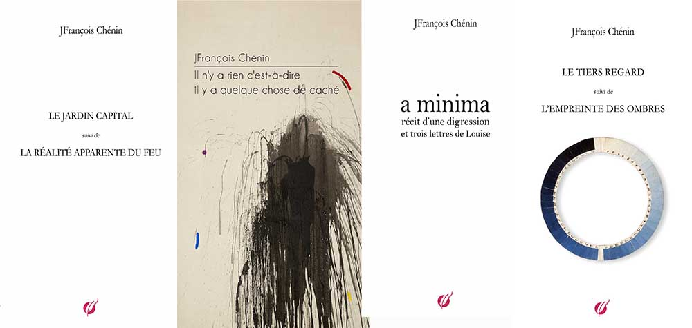

# DIGRESSIONS DU RÉEL

 

Chez [TheBookEdition](https://www.thebookedition.com/fr/recherche?controller=search&orderby=reference&orderway=desc&search_query=chenin)

*Digressions du réel* est composé de 4 livres publiés séparément chez TheBookEdition en 2015, 2018, 2019 et 2020.  La présente version a été réaménagée par rapport aux  éditions originales et constitue la version définitive de  Digressions du réel.

 

## retour

Retour sur un entre-deux toujours là, où je  m’arrêtais. Je plonge dans un vieux fauteuil  club où, enfant, je inissais par m’endormir  en chien de fusil, arrimé parfois à l’un des  énormes accoudoirs. 
 
Un entre-deux hors du temps réel, hors de la  lumière réelle et hors de tout imaginaire  qui aurait pris le pas sur la seule réalité qui  m’atteignait : une ombre bleutée emplie de  longs soules de silence. 
 
Je prenais ma respiration. Je reprenais ma respiration d’un seul tenant à l’approche de toutes les îles qui gisaient en moi que je cherchais à rejoindre à grands coups de mots heurtés les uns aux autres. 
 
Ce qui retenait mon regard, ce vers quoi j’allais, c’était un coin de ciel bleu au bord de la fenêtre, loin, tout au fond du bureau de mon grand-père où était disposée une table (je me rappelle d’un plateau de verre). 
 
Il y avait des objets, cendriers massifs (cristal ?), des boîtes, tortue pique-leur en porcelaine, un crocodile en bois d’ébène, un pot à crayon,  cofrets en verre, corne de vache grise et sépia,  une balance Roberval en cuivre tout en inesse,  au centre de la table. Elle se détachait sur le fond de la fenêtre, derrière. 
 
Quand je m’approchais, le plancher craquait. Les plateaux de la balance oscillaient insensiblement à raz du plateau de verre, en mouvement rond, de bas en haut et de haut en bas d’un il invisible qui les tenait toujours à égale distance. Etait-ce moi qui tentais de trembler le monde ? 
 
Dans la grande maison familiale, ma place favorite était ce fauteuil, à l’abri des ombres qui se déplaçaient lentement selon les clartés mouvantes  du ciel. Je les suivais du coin de l’œil tout en  tenant à distance les bruits de la maison. 
 
C’était un refuge ouvert, un renversement dans mon esprit du sens des situations et de leur  révélation, des conidences qui se dévoileraient.  Je ne dominais rien, je plongeais résolu dans le monde incertain de mes rêves et de mes absences. 
 
Je partais trop loin pour être rejoint et je  m’égarais immanquablement à chercher des  
escaliers, des passages et des coursives que j’avais bâtis et dont il restait les lignes éparses dans  des perspectives qui se délitaient les unes après  les autres. 
 
Je m’endormais. 
Je ne dormais jamais vraiment. 
 
Cet entre-deux fut l’apprentissage des mots  hologrammes qui superposaient des images, des sons, des rythmes, des accolements jusqu’à donner des visions emplies de ruses exacerbées pour les prolonger jusqu’au fond des horizons visibles. 

J’expérimentais des collages mystérieux, parfois impénétrables, sans papier, ni ciseaux, ni colle. Je manipulais ces assemblages jusqu’à l’épuisement des sens que j’y trouvais ou que je leur donnais. C’était plus qu’un jeu et j’excellais dans l’art de leur combinaison. 
 
Parfois je quittais le fauteuil, prenais un livre  dans la petite bibliothèque vitrée, à droite en  face de l’escalier, j’ouvrais au hasard, lisais et chaque fois je plongeais : ... *pourtant les beaux jours  approchent, car dans les couchers de soleil, des coulées de lumière plus chaudes se déversent de l’horizon, et dans les nuits plus claires, passent des soufles tièdes*  (Emile Moselly). J’entrais alors dans l’irrésistible singularité du réel et du langage. 
 
La vie reprenait son cours. J’étais au seuil de  nouvelles terrasses à l’à-pic de coursives et de  passerelles jetées sur des vides bleus, sans parois, sans fonds, d’où revenaient des respirations  tout aussi bleues et diaphanes, élevées, qui m’étourdissaient et me rendaient léger, aérien. 
 
J’étais dans les mots du réel. J’avais devant moi  des échafaudages de superpositions. C’était des  agrégats fantasmagoriques. Je n’avais rien d’autre à faire que d’expérimenter des associations de  circonstances et des répétitions de coïncidences. De ces rencontres et du hasard s’organisaient  de longues chaînes de sens, qui donnaient les  directions à suivre pour explorer le monde. 

Et j’entrais dans la réalité accidentée du monde,  à rebours des silences de la parole, à rebours des mots qui viendraient à manquer, à la recherche  des incidences incertaines ou indicibles des mots entre eux, seule façon de penser, sans le savoir alors, les partitions à venir de mon écriture. 
 

---

## IL N'Y A RIEN C'EST-À-DIRE IL Y A QUELQUE CHOSE DE CACHÉ

Où commence le matin ? 
Dans le secret détouré du mouvement du monde.
 

Il n’y a rien 
C’est-à-dire il y a quelque chose de caché 
Apparemment 
Il n’y a rien qu’une petite place vide 
Inappropriée 
Mais déroutante pour le romancier 
Mais possible pour le philosophe 
Habitable par le poète 
Il n’y a rien qu’une trace de vide 
Un écheveau, un jardin, un labyrinthe 
Il n’y a rien qu’une rivière 
Au fond de la vallée 
Il y a ce petit quelque chose de caché 
Que tu n’as pas vu, peut-être  
Ou tu es passé à côté sans le voir 
Sans le savoir 
 
Il n’y a rien 
Qui ne puisse être décroché 
De la toile du ciel 
Qui finira par se résorber 
Qui est dans le vent, la fuite, le regret 
Que tu ne retiens pas 
Il n’y a rien 
Qui ne puisse être effacé 
Qui redevient cette poussière 
Fumée, brouillard, sable 
Dans les à-côtés de la route 
Celle que tu suivais 
Dans les Everglades 
De bas en haut des échelles 
Et des orages 
Soudain en masses sombres 
Qui explosaient en plein ciel 
 
Il n’y a rien 
C’est-à-dire il y a un feu ouvert 
Sur un ciel noir qui engloutit tout 
Qui réverbère la lumière 
Qui est du silence 
Il n’y a rien 
C’est-à-dire il faut penser à quelque chose 
Une route, un creux, des monts 
Mais pas de cri, pas de larme 
Seulement des histoires, des environs 
Comme des horizons 
Comme des frontières éloignées 
Il n’y a rien qu’un désir 
Des désirs, jamais assez de désir 
Il n’y a rien que des silences 
Qui pourraient être des bruits 
Des paroles, des chansons, des airs anciens 
Qui seraient l’amorce de souvenirs 
S’il y avait de la mémoire 
Mais il n’y a rien 
Rien qu’une main efleurante 
Demeurante 
Qui réveille l’air du vide 
Donne un frisson 
Un long frisson bleu sur un ciel bleu 
Il n’y a rien que des essais d’être 
D’apparaître, de subvenir 
D’autoriser le plaisir 
Qui pourrait être imparfait  
Ou interdit ou impossible 
 
Il y a cette vie secrète 
Où tombent les parfums 
Et les indélicatesses du corps 
Une vie comme on aborde une rive 
Dans la tentation, le désir, un regard 
Une vie comme on doute 
Où on s’accroche 
Parvenu au bord de notre vision 
Pour des réminiscences et 
Des paroles trompeuses 
Brandies par les voleurs de peau 
 
Il n’y a rien 
C’est-à-dire il y a les traces commodes Et les traces incommodes Toutes ensemble 
C’est-à-dire il y a les mots 
Qui devinent, dessinent, dessillent 
Le vide apparent d’une place vide 
Traversée d’embrasements souterrains 
C’est-à-dire les mots 
Ne sont pas sufisants 
Pour dire la force, la peur et les éclats 
De ces embrasements 
Il n’y a rien 
C’est-à-dire il y a quelque chose de vivant 
Qui est 
Qui ne donne pas le change 
Qui commence et recommence 
Et devient la boucle qui l’entraîne 
Qui pourrait être vu comme dérisoire 
Qui n’est pas dérisoire 
Mais vivant 
Il y a cette matière qui se froisse 
Ou se raidit 
Ou s’élargit 
Et se rétracte 
Cette matière infiniment 
Réellement partagée dans les aplats et les arrondis 
d’une lumière ouverte sur du ciel 
 
Il y a des passages 
Passerelles, déambulatoires,  
Des cloîtres et toute une humanité 
Détachée de l’instant, 
Moment, étincelle, un petit soubresaut 
Qui avance en silence 
Dans les silences de la vie 
Ce qui était absent ou oublié ou dénudé 
Revient à la mémoire 
Quand les migrations s’achèvent 
Ou s’éparpillent 
Il n’y a rien 
Il n’y a rien et ce n’est jamais 
Tout à fait vrai 
Ni certain 
Il n’y a rien que des réserves Des caches, des caves 
Toute une vie dans les orées 
Les feux déposés du soir 
Les lisières dorées des firmaments 
Il n’y a rien 
C’est-à-dire il y a ce qui ressemble 
À quelque chose de vide 
Mais qui n’est pas vide 
Ni incertain ou inapprochable 
Que tu pensais caché 
Qui n’était caché que par les apparences 
Que tu contemplais 
Au fond de ta pensée 
Ou ton esprit 
Et peut-être ta chair 
Dans l’intervalle des étoiles 
Il y a de si petites particules 
Et autant de signes très secrets 
Que rien ne les distingue 
Les unes des autres 
Et où il n’y avait rien 
Il y a tous ces indices 
D’une présence, matière, vie 
En instance 
Qui reste indicible 
Et nécessaire 
Qui frappe méthodiquement 
Aux portes des cieux Et des mirages 
Et des inventions 
 
Il n’y a rien mais ce n’est jamais 
Tout à fait rien car s’y trouve 
Le silence, la nuit, les ininis étoilés 
Les rivières, tous les débarcadères Où le monde des foules anonymes 
Peut encore passer 
S’écouler 
Se divertir de la marche 
Et du silence des arpenteurs 
Des hommes, des femmes, tout un peuple 
Sorti de l’air et du feu de l’air 
Dans le double tranchant du temps Tout en bas est une source 
Il n’y a rien 
C’est-à-dire il y a quelque chose d’enfantin 
Qui dit le mouvement du monde 
Les soules du ciel et de la terre assemblés 
Qui ne s’impatiente pas 
Qui t’attend 
Il n’y a rien qu’un ventre 
Qui serait cette place attendue Cette place apparemment vide  du commencement, d’une naissance  ou d’un retour 
En tous les cas un jaillissement 
Ce que les feux ne retiennent pas 
Les lèvres savent en consentir la saveur 
(Ce que tu pensais) 
Il n’y a rien que des souvenirs 
À ce stade du voyage 
Dans les marges des entrelacements 
Ce que protègent les marches 
Les yeux savent en prolonger  
Les perspectives et les nuances 
Il n’y a rien que des souvenirs 
De ton souvenir de ce vide Et s’il y avait quelque chose Serait-ce une folie ? 
 
Il y a des paroles 
Qui ne disent rien 
Qui fabriquent du silence 
De l’absence, des ressentiments 
Et se taire 
Détricoter les peurs 
Que les mots poussent à bout 
S’agenouiller, se quitter Oublier les chansons et les danses Qui te parlera ? 
 
Il n’y a rien 
Juste quelque chose qui se devine 
S’eface, revient, redresse les lignes 
Positionne les horizons et les fuites 
Dessine l’inini 
Ébauche l’humanité 
Ce que tu sais est dans ce quelque chose 
Qui est ce vide 
Où il semble qu’il n’y ait rien 
Il n’y a rien que des devinettes 
De la vie 
Qui laissent penser qu’il y a quelque chose 
Des bribes, des incidences 
Des coïncidences 
Des routes qui croisent dans les regards 
Où quelque chose se passe 
Ou s’est passé ? On n’en sait rien 
On ne joue pas aux devinettes 
On les invente pour laisser passer les êtres 
Les vivants, tout un peuple de matière 
Il n’y a rien qui ne soit déjà là 
Dans la vallée magique 
Fermée, cachée, renversée 
À l’intérieur du corps où elle se prolonge 
S’évase, s’inscrit 
Il n’y a rien qui ne puisse être vu Et s’il y avait quelque chose 
Serait-ce folie de ne pas le voir ? 
L’entendre ? 
Le toucher ? 
Le sentir ? 
L’organiser et le désorganiser 
Pour le comprendre 
Il n’y a rien qui ne puisse être goûté 
Ce qui serait la in et les débuts 
Dans un soule embrasé 
 
Ce que la vie prépare 
Retourne, assemble 
Une vraisemblance, des apparences 
Des gestes hologrammes  
Sur des corps endormis 
Ce que la vie sépare 
Retourne, déchire 
Une apparence, des vraisemblances 
Des rêves eilochés  
Dans des mains évasives 
 
Il n’y a rien 
C’est-à-dire il y a quelque chose de réel 
De permis, d’envoûtant, de déroutant 
Dans l’ombre 
Dans l’ombre de l’ombre de la nuit 
Dans toutes les ombres 
Où on s’enfonce 
Jamais en pure perte 
Il n’y a rien, penses-tu, jamais 
En pure perte dans l’ombre des ombres 
Soulevées de la nuit 
Où il y a le réel, le réel inventé 
Il n’y a rien 
C’est-à-dire il y a quelque chose de ictif 
De permis, de rêvé, d’explosif 
Dans la lumière 
Mais pas toute la lumière 
Où on se rétracte pour se cacher 
Où on vitupère parfois 
De voir ce qui doit rester caché 
Qui est l’explosion de l’imaginaire 
L’explosion des rêves fondamentaux 
Parler, jouir et pleurer 
 
Ce que tu appelles 
La diversion, la désillusion, le désastre Ce désir meurtri 
Cette ablation du rêve 
Une gangrène intenable 
Une chair errante 
Où il n’y a rien ne veut rien dire 
Qui cherche à exulter 
Se reproduire 
Et s’aventurer dans le corps de l’autre 
Ce que tu appelles 
Cette pensée ajoutée 
N’est jamais qu’un emboîtement 
De cris, artiices, sexualité 
Aux plus ofrants des barbares  Et des amants 
Celui qui aime n’a pas le choix 
 
Il n’y a rien, penses-tu, toujours à profusion 
De ce que l’esprit libère 
Des gangues de feu du cerveau 
Où il y a la vie, la vie réelle 
Et si quelque chose était là Que tu n’avais pas vu ? 
Quelle dérision 
Quelle mélancolie Et quelle histoire 
Et cette peur, ce cœur rétracté 
Cette main qui ne s’ouvre pas 
 
Cet aveu qui te laisse en arrière 
Dans l’hallucination enfantine 
De la course, le train, l’avion 
La vitesse 
Tu n’es jamais libéré des lieux 
Que tu oublies derrière toi 
Aussi vite que tu les quittes 
Aussi vite que tes yeux se ferment 
Sur ce qui t’échappe 
 
Il n’y a rien 
C’est-à-dire il y a ces monts 
Cette douceur de l’élévation Cette absence de cri, de peur, de pleurs 
car tout est dans le soule Les ibrillations,  
Le cillement froissé de la peau 
Ce que tu sais, ce que tu devines 
Et ce que tu dis restent silencieux 
Là où commence une caresse 
Est le point de difraction des dieux 
Devenus saltimbanques et silencieux 
Une caresse est un point de gravité 
Fondamental, incontournable 
Une singularité peut-être 
Il n’y a rien 
C’est-à-dire il y a une caresse 
Qui commence et frôle et devient 
Et revenue, recommence 
Tu ne vivais pas d’expédients 
Tu racontais des histoires 
Mais si peu de vrais destins 
Et si peu de tout ce qui fait un roman 
Il n’y a rien 
C’est-à-dire il y a du langage 
Des mots, des formes verbales 
Des enluminures, des ins de ligne et 
Des retours à la ligne 
Des paragraphes entiers 
Qui se rétractent  
Petit à petit pour devenir du sens 
Du sens des mots 
Assujettis à tes désirs, des paradoxes 
Il y a du désir (disait Lacan) et 
Il n’y a rien qui ne puisse être désirant 
Détouré et projeté dans le noir du cerveau 
Quand il passe du désir au plaisir et 
C’est le faux qui dit le vrai,  
Du foisonnement 
À l’épanouissement, et c’est le faux 
Qui dit le vrai 
 
Il n’y a rien 
C’est-à-dire il y quelque chose d’atteint 
 
Il n’y a rien 
C’est-à-dire il y a quelque chose  
Où tu es devenu 
Il n’y a rien qu’une place vide mais réelle Quand tu reprends ta place 
Dans la vision toute chamboulée 
De la vallée que tu contemplais 
Quelle subversion 
Quelle dématérialisation 
Quel miracle 
Il n’y a rien qu’une lente remontée 
À la surface 
À la surface où il y a le silence 
Et le silence des mots 
Comme une mort 
Tu n’es pas dupe des absences  qui t’afaiblissent, t’agenouillent Tu ne les domines plus 
Tu es indiférent, tu voyages 
 
Il n’y a rien 
C’est-à-dire il y a une absence 
Une ligne de feux, manquante et dispersée Qui longe la route dans l’indécision 
La réverbération magique de la disparition Où tu avances sans repère 
Où la vérité n’est plus bonne à dire 
Où le mensonge ne sert à rien 
Et la parole se déglingue 
Où le rêve est détouré de ses couleurs 
Il n’y a rien qui ne puisse être caché 
C’est la manie du romancier 
L’art du philosophe 
Un des secrets du poète 
Caché dans l’éternité du désir 
Et la soudaineté du plaisir 
 
Au(x) Demeurant(s) me revient à l’esprit 
Où je disais 
Je suis en moi dans la magie du détour 
Et la route reprend où nous étions attendus 
 
Il n’y a rien qui ne puisse être détaché 
De sa gangue, de son silence 
Ou de sa vérité 
Détaché des rêves qui portent 
Détaché des angoisses qui délivrent 
Et des aboiements des chiens 
Dans la nuit lointaine de l’horizon  
Détaché de la vie qui enlève  et de la mort qui soulève  
Jusqu’au débarcadère des feux tremblants d’un possible bonheur 
 
Que sais-tu de cette chose secrète 
Ce début de l’ombre 
Cette cavité 
Cette ouverture soudaine suivie 
D’un enfermement aussi soudain que bref ? 
Que sais-tu de ce qui apparaît dans 
La chose cachée 
Au plus bas du monde visible 
Dans les entrelacements des ombres Qui s’évertuent à cacher, dissimuler Retirer ? 
Que sais-tu de cette connivence Qui ne dit pas ce qu’elle est ? 
Tu acquiesces en t’approchant  
Sans mot, sans langage, dans la nudité 
Du soule et des odeurs 
Que sais-tu de cet endroit caché 
Où tu songes 
Revers, intimité, identité ? 
 
Il n’y a rien 
C’est-à-dire il y aussi du silence 
Où nous mesurons nos antécédents 
Il n’y a rien 
C’est-à-dire il y a quelque chose de perdu 
Et d’harassant à retrouver, à remodeler À naître simplement Quelque chose de perdu  ou abandonné ou oublié 
Des petits objets dispersés 
Perdus et retrouvés 
À l’étalage du temps qui passe 
Il n’y a rien 
Rien qu’un aujourd’hui qui semble 
Fuir le présent, qui ne peut pas 
Qui n’en peut plus d’assembler le temps 
Le temps en lui d’une possible disparition  
D’un temps répercutant et demeurant 
Le temps des fenaisons, des moissons,  des vendanges 
Ce qui reste de matière et de vivant 
Sous le vent 
Les vents de tous les horizons survenus 
Ce qui t’échappe à l’épaisseur d’un il 
La densité d’un soule 
Un éphémère à sa naissance 
Un signe juste esquissé 
Un cillement de paupière 
Non, refus, ligne dédoublée de l’instant 
Autant de perspectives qui renouent 
Ce que tu attendais 
 
Il n’y a rien 
Rien de possible sans les lignes doubles 
Des perspectives qui te traversent 
Qui font de toi un champ inexpugnable 
De traces, d’ébauches et de irmaments 
Entraperçus dans les marches des cieux 
Plus haut, plus loin, à bord du visible 
Il n’y a rien 
C’est-à-dire il y a quelque chose de tendu 
Entre le monde et toi 
Dans les visions éphémères que tu en as Que tu tentes de saisir avec des mots 
Des petits mots détachés de cette vision 
Majestueuse du monde 
Qui tente de reproduire  
Cet orgueil du sentir 
De l’écoute, de toutes ces visions traversées 
Du désir d’en retenir le soule et le goût 
Il n’y a rien 
Rien que de l’or au fond du monde 
Bouleversé 
Rien que des parfums qui transpirent 
Des orées magiques du monde 
Dans le fond réel de la pensée 
Qui en saisit le sens, la vérité, le rêve 
 
Ce secret du monde 
Entrelace d’autres secrets 
D’intimité, rêverie, pudeur 
D’autres silences 
Qui seront toutes tes paroles 
Enveloppées d’errance 
Obstacles, ponts, passerelles 
Balancées sur les vides 
Entre les ombres, soudain 
Soudain toute la révélation 
De ce qui te tient 
Te retient, t’emporte, libère 
Ta main 
Tu parles d’un jardin capital 
Sans le bruit 
Sans la douleur 
Sans l’excès de la crainte 
 
Il n’y a rien 
Rien qui ne puisse être défendu Et désarmé 
Rien d’exceptionnel pourtant et 
Rien d’achevé, tout est mouvement 
Tout est feu dans le demeurant de l’univers 
À la croisée des incertitudes 
Qui tient les ouvertures et les passages 
Ponts, tunnels, passerelles 
Vers l’histoire 
Ce qui nous libère est si ténu 
Ou si ardent 
Que nous ne le voyons pas 
Il n’y a rien 
C’est-à-dire il y quelque chose de frêle 
De furtif 
D’abandonné sous les gouttes,  Dans l’eau, les rivières les vagues en arpentage 
Sous les brises du Sud 
Abandonné mais jamais perdu 
À bout de vision 
Sous les feuilles qui touchent  
Les aplats bleus du ciel 
De tous les cieux assemblés 
Dans le regard 
Il n’y a rien 
Il n’y a rien 
C’est-à-dire il y a les apogées mentales 
Qui ébauchent la vérité du monde 
Les variétés de tout ce qui tremble 
S’agite, s’élève, vole 
Ou rampe ou plonge ou saute 
Tout ce qui vient à l’esprit de vivant et 
D’irréductible à une sensation 
Mais marqué du devenir 
Mais traversé du rêve d’ubiquité 
Être là où il n’y a rien 
Rien qu’un possible qui trouble 
Tremble et libère 
La matière du ciel tout autour 
Dans tous les alentours où il semblait 
Qu’il n’y avait rien que du vide 
Des cris de vide  
Et des entrelacements froids 
Ce que tu devines 
Est un autre avenir 
Dans l’avenir 
Un autre temps 
Dans le temps 
Et la tentation de donner forme 
De gréer les ils, ilms et cordes 
D’être la transhumance à demain 
Ce qui augure tes sentiments 
Il n’y a jamais rien 
C’est-à-dire l’avenir érige l’avenir 
Demain est toujours demain 
 
Il n’y a rien 
C’est-à-dire il y a quelque chose qui bouge 
Sous les doigts étésiens qui t’assemblent 
Et frôlent le ventre doux du jardin 
Ce que tu rassembles est le pli vivant 
Qui ile sous la main 
Il n’y a rien 
C’est-à-dire quelque chose respire Te reconnais-tu ? 
Il n’y a rien 
Seulement la place vide de tous les débuts 
La déambulation d’Orphée 
Pris dans les nuages des voyages 
Et des montagnes 
Qui craint de plus grands malheurs 
Et se retourne pourtant 
Où il n’y a rien 
Rien qu’un sentiment d’abandon 
D’irrésolution, de froid, d’absence 
Rien qui pourrait être évité 
Sans renoncement 
Sans regret 
Il n’y a rien 
C’est-à-dire le silence n’est pas revenu pour autant 
Quand, dans les feux du soir, s’étire 
Tout le long de la rive 
Le vol des migrateurs  
Qui entament leur long voyage 
Leur détournement, séduction 
Inidélité 
Il y a cette fuite de tous les matins 
Où la pensée se devine 
De justesse 
Entre les lanternes éteintes  
des bateaux 
Des derniers bateaux encore à quai 
Il n’y a rien 
Rien qui ne puisse être vrai 
Dans les rêves de iction et d’arrangements 
Que la lumière décide  
De projeter devant elle 
Éliminant les ombres à mesure  
De son élévation 
Les dieux l’ont compris 
Les démons sont abattus à midi 
Il n’y a rien 
C’est-à-dire quelque chose bouge  Et s’arrondit 
Et devient le centre du monde 
Le centre d’une lumière sans arrière-fond Et sans arrière-pensée 
Et il y a ce bruit de fond  
Qui soulève les horizons 
Les replace sur des lignes plus lointaines 
Et, les éloignant, dessine le fond du monde Qui est ta mémoire Savais-tu cela ? 
 
Il n’y a rien 
C’est-à-dire tu es au bout de ta colère 
Et le ressentiment s’eface 
À mesure des mots 
À mesure du silence revenu 
Il n’y a rien 
Rien qui ne puisse être oublié 
Pourtant qui disparaîtra de toi 
Que le vent dispersera 
Sais-tu qu’il y a des rêves 
Qui ne viennent jamais à la surface 
Qu’on entrevoit parfois 
En noir et blanc 
Dans le silence d’une longue respiration 
Qui nous élève 
Jusqu’au dessus du ciel 
Vide, sacrément vide 
 
Il n’y a rien 
Et ce que tu en dis ou penses ou racontes 
Est dans le droit il de ce que tu deviens 
Qui était en toi 
Qui n’attendait que de surgir 
D’être la pointe sèche 
Qui trace 
Ininiment de points 
Dans ton cerveau 
Qui les lie 
Dit qu’il y a quelque chose 
Qui tremble, bruisse, bouge, s’élance 
Qui sera ton avancée 
Au-dessus des vides mystérieux  
De cette existence 
Qui dessine dans la vague 
Toutes les vagues qui viendront 
Te voilà entendu, philosophe 
Réhabilité, poète 
(Ne parlons pas du romancier 
Qui ne cherche rien qu’à plaire  
Ou à deviner 
La nature dérivante, intouchable 
Malléable 
De héros qui en sont privés) 
Il n’y a rien 
Que des blés qui prolongent les avenues 
Éclatées du ciel 
Entre la pervenche et la turquoise 
Dans l’outremer des vents  
Qui l’enroulent à la terre 
Qu’une immense preuve d’amour 
Qui revient en boomerang  
De ce que tu as lancé, dit ou raconté 
Qu’un champ de mines enin désarmé 
Il n’y a rien 
Qu’un inini présent  
Au milieu de l’histoire 
Il n’y a rien 
C’est-à-dire il y a quelque chose  
D’ininiment petit  
Qui grefe toutes choses entre elles Qui irradie 
Quelque chose d’ininiment grand 
Qui roule sur lui-même à perdre haleine 
Qui mélange tous les ininis 
Petits et grands qui gravitent  
Dans les yeux des enfants 
Qui sont les yeux des moments devenus 
De tout ce qui se rêve et ne s’abat pas 
Qui prolonge les sensations, idées, pensées 
Chants danses et rythmes  
Tout le mouvement du monde 
Qui n’était rien, qui tient tout 
 
Il n’y a rien qui ne puisse être détouré 
Détaché de la gangue qui étoufe 
Arraché de la chair meurtrie qui putréie 
Rien qui ne soit vacant, délaissé, oublié 
Il n’y a rien 
C’est-à-dire il y a une fracture 
Qui emporte tout 
Dans sa béance rouge 
Qui a révulsé les paupières 
Asséché l’iris 
Déchiré le cristallin 
Qui t’a rendu aveugle 
 
Il n’y a rien 
Que des vertiges et des soifs  
D’ininis et de résurgence 
Jusqu’au bout de la passion 
Qu’il faut pour les tenir ensemble 
Il n’y a rien qu’une longue descente 
Au fond de la vallée 
Qui est tout le paysage 
L’architecture, les lignes,  
Les étais et les arches 
Qui le fondent 
Une vallée subreptice 
Juste eleurée, touchée, peut-être franchie 
Qui reste l’énigme supposée du monde 
Une vallée 
Et sa respiration apaisée 
Il n’y a rien qu’une vaste entreprise 
De points de vue divergents 
Pour en savoir plus et plus  
Et toujours davantage 
Pour réchaufer les mains 
Les pieds qui arpentent 
Tout un corps afaibli de conquérir 
Des vents et des visions voisinantes  
Et contraires 
Dans les arpents du monde 
De marches en marches qui gardent 
Les arrière-cours de l’univers 
Qui les protègent 
Des feux mourants, des soules afadis 
Dans les terrains vierges de l’éternité 
 
Il n’y a rien 
C’est-à-dire quelque chose est encore caché 
Qui n’est pas sorti de l’ombre 
Que l’ombre n’a pas dévoilé 
Qui est dans le retrait d’un bonheur 
Qui serait la traverse de toute chose 
Le saut de la falaise 
Et le sautillement du ciel  
Avec ses parachutes bleus 
Te doutais-tu de ces illusions Qui dénaturent le regard Et le rendent sec ? 
Te doutais-tu  
Que l’ombre in-dévoilée de l’ombre Couvre tout encore qui reste caché ? 
Et il n’y a rien 
Rien qui ne puisse être dévoilé 
Inéluctablement un jour 
Il n’y a rien 
Qu’une course folle 
À l’illimitation des cieux étoilés 
À l’illumination des enfers (s’ils existent) 
Une course échevelée entre les comètes 
Grandes et petites 
À rejoindre tous les coins  
Des univers inhabités 
D’être les premières lumières 
La première matière 
La fécondation de tous ces assemblages  
Majestueux 
Qui tournent, foncent  
Et dansent dans le rien 
Dans le mélange primitif 
Il n’y a rien 
Que ta main qui caresse 
La vallée suspendue 
Qui s’irise, se défroisse et s’ouvre 
Une vallée de feu, d’or, de bleu cobalt 
De pourtours tumescents 
Corolles bouquet de sang 
Creux de tous les mondes vivants 
Où rien n’est comme ailleurs 
Il n’y a rien 
Qui ne puisse être et vrai et faux à la fois Et pourrait l’être 
Qui le devient à force de rêves et de mots 
Pour les dire, les raconter, les chanter 
Il n’y a rien qu’un chant qui monte 
Du fond du corps 
Du tréfonds matériel et vivant du corps 
Un chant de tous les instants ramassés De la vie en soi 
Tu ne seras jamais au bout de tes peines 
D’en comprendre toutes les mécaniques 
Mais elles ne sont pas horlogères 
Ce qui est à ton avantage 
Justes célestes  
Dans leurs dimensions scripturales Là est ton élément naturel 
Ces sauts le long des perspectives  
De l’écriture où chaque ligne est une fuite 
D’avant en arrière de ce qui gravite 
Dans ton esprit matériel 
Il n’y a rien 
Que des oiseaux qui migrent 
Tout autour des mots que tu alignes 
Qui donnent le sens  
De l’arpentage incessant 
D’un ciel vide et intensément bleu 
Il n’y a rien 
Mais rien n’est vide forcément 
Et les bleus incessants de la mer 
Sont les bleus migrants du ciel 
Les bleus des mines d’or et d’ébène 
Les bleus des mines de sel  
Et les bleus d’eau de mer des marais salants 
Les bleus rehaussés de l’atelier du peintre 
Bleu-noir de toutes les élévations 
De la nuit vers elle-même 
 
Il n’y a rien qui ne soit bleu 
Il n’y a rien à dire 
Ni à penser 
Ni à gueuler 
De toutes les nuits perdues 
À les chercher dans le noir 
Elles étaient là 
Toutes devenues 
Et que tu ne voyais pas 
Encore toutes ces choses qui attendaient 
Et que tes détours ont évitées 
Et il n’y a rien, disais-tu 
Qu’un grand regret de les avoir perdues 
Et qu’il faudrait encore toute une vie 
Ou plusieurs, ou toutes les vies possibles 
Incommensurables, pour commencer à voir 
Penser, dire, raconter, s’endiabler 
Du reste des jours à vivre 
Qui pourrait être l’éternité 
Qui n’est qu’un point passant 
En bordure du temps 
Il n’y a rien que du temps devant toi 
À prendre à bras le corps 
Il n’y a rien qu’un espace autour de toi 
A habiter de toute la force 
De tes sensations 
 
Il n’y a rien de plus 
Rien d’évanescent 
Mystérieux, mystique 
Rien de divin 
Et rien à croire en tous les cas 
Il n’y a rien 
C’est-à-dire il y a quelque chose de soi 
Qui nous emporte loin de cette vie 
Y retomber parfois 
Y revenir aussi 
Et redouter de l’ignorer, l’oublier 
La craindre aussi 
Et déjouer les pièges où nous tomberions 
Imprévoyants 
Il y a quelque chose de soi 
Et pas autre chose qui serait plus important 
Grand, précieux, magniicent 
Toi, tu sais ce quelque chose de soi 
Qui n’est pas autre chose que soi 
Ni stupeur, ni pleur, ni crainte 
Un peu d’oubli parfois 
L’oubli de soi 
Il n’y a rien 
Rien qui ne puisse exister 
En absence de raison, destin, finalité 
Il n’y a rien que cette liberté 
Qui dit le désir, le vrai désir 
De conquérir sur soi tout ce qui pourrait 
Être dérisoire, qui ne l’est pas 
Qui est l’ébauche d’autres désirs 
Qui s’enchaînent, s’efilent, s’accrochent 
Sans trébucher, s’évasent, s’arriment 
Et s’il n’y a rien, à tout hasard Il y a encore les coïncidences les rencontres 
Et des perspectives croisées  de tant de regards 
Que toutes les visions étayent  le monde visible 
Et le monde moins visible 
Qui pourrait être vide 
Qui ne l’est pas 
Soulevé à la Fontaine de Vaucluse 
Par tous les temps 
 
Il n’y a rien qui ne puisse être soulevé 
Dans la main nue qui aime, adoucit, caresse Prend la vie dans les vallées tremblantes de la matière 
Il y a la matière et s’il n’y a rien 
Il y a encore ce froissement caché 
Du vivant 
Il n’y a rien 
C’est-à-dire il y a du vivant 
Outrageusement à travers toi 
Toi qui n’y pensais peut-être pas 
Toi qui passes et iles le temps 
Adossé aux talus des routes 
Aux bancs traversiers 
Aux écluses qui laissent l’eau sur place 
Dans son lux incessant 
 
Il n’y a rien 
C’est-à-dire quelque chose commence 
Re-commence et dit et re-dit 
Tous les soubresauts du début du monde 
Commence et re-commence la vie Commence la mort 
Et tout ce qui la précède 
Et tout ce qui s’en suivra 
À commencer par le désir de la vie 
Il n’y a rien 
C’est-à-dire il y a une page blanche 
Qui n’en sera jamais à sa in 
Où aucun mot ne sera le dernier Où tous les plaisirs seront  comme le tout premier 
Celui de penser qu’il n’y a rien 
C’est-à-dire il y a quelque chose de caché 
Qui reste encore et encore à découvrir 
À aimer, soulever, admirer, protéger 
Tu n’es pas assez averti de tous ces secrets 
Il n’y a rien 
En réalité il n’y a pas de secret 
Seulement des feux de loin en loin 
Qui guident le regard, les pas, le plaisir  
Et les rêves libérés des limites  
Aussi loin que l’on puisse voir 
Jusqu’au fond des yeux 
 
Il n’y a rien 
C’est-à-dire il y a une immense solitude 
Qui a trouvé sa délivrance 
Sa rédemption 
Dans les bleus du soir 
Et les encens des arrière-cours 
Et les épices soulevées du désert 
Et les couleurs des rêves diaphanes 
Et rien n’est écrit de ce que tu deviens 
 
Il n’y a rien 
Rien qu’une page blanche 
Et le restera aussi vite 
Que tu penses écrire l’histoire 
De toutes tes forces 
Il n’y a rien 
C’est-à-dire il y a quelque chose de soi 
Quelque chose qui n’oublie pas 
Ne s’oublie pas 
Ne transige pas et respecte 
Donne, accompagne, brise et délivre 
Quelque chose de soi  
Qui a traversé les siècles 
Pour être là 
En devancier 
En artificier des instants à venir. 

---

