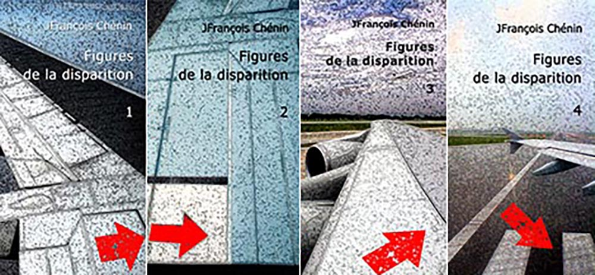

---

# FIGURES DE LA DISPARITION

 

chez The [BookEdition](https://www.thebookedition.com/fr/recherche?controller=search&orderby=reference&orderway=desc&search_query=chenin)

Figures de la disparition a été publié en 2008 chez The [BookEdition](https://www.thebookedition.com/fr/recherche?controller=search&orderby=reference&orderway=desc&search_query=chenin) en 4 volumes, réunis en 2012 en un seul volume

*FIGURES DE LA DISPARITION*, 1975-2006 (Edition 2012) contient :
*Quentin* (1978)
*Roman* (2000-2001)
*Exeat* (2002)
Saisons (1998)
*Voisins des arpents* (1975-1977)
Nous voilà rencontrés, la terre et nous (1978)
*Une maison aiguisée* (1980)
*Le droit-fil* (1983-1996)
*In Fine* (1996)
*Je ne mourrai pas* (1994)
*Ce que tu fais* (1995)
*Les sculptures chantent* (1997)
*Dans l’atelier* (2003)
*La table des étoiles* (1998-1999)
*Les royaumes à-demi* (2005-2006)
*Frontières* (2004-2005
*Alep* (2006)

 

***Figures de la disparition*** regroupent une partie des textes écrits entre 1975 et 2006. Ils sont (avec, en particulier, *Quentin, Roman, Saisons, Exeat, Frontières* et *dans l'atelier)* les débuts et l'inachèvement. Ils portent mes appuis, mes références, les talus escaladés et les descentes brutales dans les fonds ravinés de mes certitudes. La tentation serait de clore le désir qui les a portés. Or le désir existe encore, acéré et effilant. D'où ce besoin d'en faire état, de les porter devant.
Toujours j'écris, mais j'écris à l'emporte-pièce, enlevant le silence des espaces blancs des mots, subtilisant les traces d'hésitation en fin de phrase, sans point, laissant tomber ou, parfois, se relever le silence intime de la main. J'écris, mais j'écris en aparté. Car il s'agit bien de silence, du silence re-venu une fois écrit ce qui surgit de longue date.
Tu as été créé pour des moments peu communs / Modifie-toi disparais sans regret / Au gré de la rigueur suave / Quartier suivant quartier la liquidation du monde se poursuit / Sans interruption / Sans égarement … dit René Char dans Le marteau sans maître. Je vais sur cette eau inexorable, à nu, à flanc des mots qui passent ma main, depuis le temps.

## EXEAT

*Entre deux voyages, dans l’entre-deux du silence, quand un silence plus fort vient le combler, quand une ombre passe, quand il faut se résoudre à quitter cet espace en soi qui devient proliférant, quand la mesure est donnée d’inverser la course des étoiles, quand la mesure revient d’ordonner le ciel au-dessus de soi, quand tout est à sa place, enfin !*

### Résorption 
Il entend la musique de Bach, il entend les voitures qui démarrent quand le feu passe au vert, il entend une voiture qui freine, il entend le piano qui s'égrène, il entend une sirène, il entend des cris, des cris qui montent, il entend son cœur, ton cœur quand il s'approche, le sang dans tes veines quand il se penche, le froissement d'une branche, il entend ta main qui le caresse, il entend un concerto de Bach, une lumière au fond de la rue, il entend des histoires, des histoires racontées par des hommes, ils font la guerre, ils reviennent de la guerre, ils perdent leur vie à la guerre, il entend leur rancune, leur amertume, leurs rêves déchirés, il entend un enfant qui pleure, des camions qui peinent dans une montée trop longue, des loups dans la forêt, des coups de feu, une explosion, des sirènes, c'est toujours la nuit que les enfants pleurent, le cauchemar est entier dans leurs yeux, il entend des gens qui ont peur, qui vivent avec la peur, qui passent des heures à essayer de la dominer, qui perdent leurs jours et leurs nuits à oublier, qui oublient de vivre, il entend ton appel, c'est ta voix et ta main comme un signe fait de loin, tu es loin, cette lumière qui éclaire à peine, la rue dans le brouillard, il entend la pluie, le toit qui résonne d'un déluge de monde, il entend le vent dans les branches, les branches qui cassent, qui s'écroulent dans un grand fracas d'eau, il entend le crépitement d'un feu, des chants, il entend toujours la musique de Bach, des suites. Qui joue ? Qui chante ? Il entend des discours, de la haine puis des mots d'amour, il faudra se méfier, s'extirper de la réalité, douter de la vérité, remonter la rue, aller vers cette lumière, te deviner encore, entendre ta voix, il entend ta voix, très proche et très loin, il entend des voitures qui s'arrêtent quand le feu passe au rouge, et qui repartent quelques secondes après, il entend les nouvelles à la radio, le monde qui pleure, le monde qui rie, la guerre, le feu, les cendres, la terre sur le corps des hommes morts, une moto passe, il entend le souffle du vent, c'est le soir, c'est un souffle léger, il entend le début d'un prélude, il entend tes paroles, tu lui parles, tu hésites, tu es peut-être loin, tu es peut-être là, dans cette lumière décolorée, il entend des chats, des chiens, des hurlements inconnus, des hurlements secrets, il entend la terre, il entend le cœur de la terre, la source, le flux et le reflux du temps, il entend plus que de raison, il entend par-dessus le monde la lente montée des étoiles, l'apparition du jour et, plus tard, l'apparition de la nuit, le frémissement des feuilles, des feuillages entiers qui s'élèvent dans l'ombre, il entend quand tu lui parles, quand tu baisses la voix pour lui dire ton amour et ta crainte et tes doutes, l'envie de chanter, de danser, d'aller tournoyante, d'aimer, d'aimer, d'arrimer tes désirs au vent, il entend des voitures qui dérapent, des moteurs qui explosent et s'enflamment, des vertèbres fra-cassées, des tôles qui se froissent contre les grands arbres de la route, des sirènes d'ambulance, des cris, des pleurs, un enfant pleure près de lui, il entend comme une fin du monde, il entend la fin du concert quand il est arrivé en retard, tu l'attendais, tu désespérais, l'escalier était vide, tu étais assise sur la dernière marche, alors quelqu'un l'appelle, ce n'est pas ta voix, il entend la chaleur dans la pierre de ruines millénaires, au milieu des ruines, il y a le désert, et des oasis comme des guirlandes où les hommes s'endorment à l'ombre de leurs rêves endurcis, il entend des mensonges, les flatteurs sont craintifs, nous ne sommes pas dupes de leurs enchantements, ils enchâssent les plus faibles dans leurs artifices, il entend qu'ils seront arrêtés, qu'ils seront pendus, qu'on leur coupera les mains, qu'ils seront mutilés, qu'il ne faut plus espérer, il entend des ordres et des contrordres, des récriminations, des humiliations, ta voix de plus en plus indistincte, ta souffrance, il entend le téléphone qui sonne, la sonnerie de la porte, le carillon de sa mort, le tambour d'une armée morte, des pas cadencés, il entend un avion, haut dans le ciel, sans trace de son passage, sans trace pour se souvenir, il entend quand tu lui racontes ta vie, les lendemains de fête, les lendemains tristes de tristes jours de fête, quand les manèges sont comme des machines à décerveler, des machines à broyer ce qui reste d'espoir, il entend l'horloge exacte, il entend fuir le temps, le temps passé à t'attendre quand tu ne viens plus, quand tu ne viendras plus, le temps qui manque pour se parler et s'écouter, il entend une porte qui claque, les pas dans l'escalier rapidement dévalé, brusquement bousculé, il entend surgir l'effroi, il entend plus loin que lui, dans une mémoire froide et blanche, il entend un enfant qui lui parle, qui a peur de la guerre, qui cherche ses parents, il entend plusieurs cris, encore des coups de poings, des explosions toujours, comme un insupportable bour-donnement dans la tête, un bourdonnement vide et plein d'espaces bruyants, il entend une sonate de Bach. Laquelle ? Pour se rassurer, c'est comme les falaises d'Etretat, c'est comme la fontaine de la place Saint-Sulpice, c'est comme une promenade de la place des Victoires à la place de Clichy, dans les rues vides d'une nuit d'été, c'est comme le silence qui revient au-dessus des toits, il entend quand tu lui lis un texte de René Char : "la faveur des étoiles est de nous inviter à parler, de nous montrer que nous ne sommes pas seuls, que l'aurore a un toit et mon feu tes deux mains" (*),  il entend une porte qui s'ouvre, un tissu qu'on déchire, des bruits d'une maison familière, un chat qui miaule, des enfants jouent au ballon, des enfants lancent un cerf-volant, des enfants creusent dans le sable pour endiguer la mer, la mer qui monte, qui ne leur laissera aucun répit, ils craignent pour leur vie, ils ne rient plus, il entend qu'ils sont prêts à renoncer, ils jettent leur pelle, rompus, déçus, battus, il entend des oiseaux au-dessus de leur tête, des oiseaux blancs, des oiseaux migrateurs, ils dessinent une dentelle, des dentelles de ciel sur le ciel quand tu renverses la tête, quand c'est le plaisir qui te porte, il entend la musique de Bach dans la mer, tout au fond de l'eau, il entend quand tu reviens, quand il fait semblant de dormir, tu t'approches si doucement qu'il hésite à te deviner, tes mains qui le touchent, tes lèvres qui l'effleurent, il entend ton souffle et tout le froid de la rue que tu apportes, et tes mains que tu poses sur son cou, pour te réchauffer, pour lui dire que tu es là, que tu es rentrée, qu'il fait bon chez nous, que tu ne repartiras plus, il entend quand tu t'allonges contre lui, il entend d'autres préludes et d'autres sonates, celles qu'il a en mémoire, il entend, mais il entend mal parce qu'il y a surtout des bruits de plus en plus diffus, des masses indistinctes qui ne le touchent plus, quand il passe d'un rêve à un autre, quand la foule se tait, quand la rue se vide de ses encombrements, il entend les gens qui s'éloignent, c'est de plus en plus tard, c'est toujours plus loin, c'est la lumière que l'on éteint, c'est la radio que l'on arrête, c'est une fête qui prend fin et qui recommencera ailleurs, c'est une feuille morte que le vent tarde à poser, il entend ta respiration contre son visage, quand tu es enfin de retour, à ce moment il y a toi et la nuit, le silence. 

### Fraude à la vie 
Un chemin martelé, la vie, un chemin difficile à passer, la vie, quand le soleil écartelé tombe, roule, sombre, aux devantures de la vie, la vie, installée comme un enfant quand il pleure, silencieux, prostré, délivré, sur ce chemin qui descend, qui monte, entre des rêves, où la vie n'est plus la vie, entre les larmes, et cette porte encore ouverte, un instant de vie, la vie, mais la vie quand les amants sont trahis, qu'en reste-t-il ? Quand les amants décident de s'ignorer, illusion, illusion de vie, ils ont frappé à cette porte et attendu, ils s'éloignent l'un de l'autre, un instant suffit, un instant de vie trahie, et d'autres viennent et subissent le même sort, le même hasard de vie, la même fraction d'indifférence, ils rêvent, ils oublient, leur histoire n'est pas possible, il n'y a pas d'histoire dans cette vie, la vie d'où ils s'absentent, ils frissonnent, ils ont peur, seuls séparés sur des chemins séparés, ils ne gardent même pas la mémoire de leurs voyages, tous les voyages qui les mènent nulle part, dans le vide de leur amour, dans le vide de leur vie, la vie, quand les villes s'endorment, les villes fermées sur leur silence, elles ne les accueillent plus, ces villes et ces amants désunis par la vie, leur vie meurtrie, jetée dans un ciel qu'ils croyaient clair, devenu noir, la vie noire où ils cachent leur désir, leur désir de vie, la vie qui se nourrit de leurs mensonges, jetée dans un délire d'ombre, tous les non-dits qui les affament, c'est une course contre eux-mêmes, ils y perdent leur souffle, ils perdent la raison, cette conspiration contre la vie, dans le corps, cette douleur lente, froide, étrange, comme un corps lacéré, ils mendient la vie, cet amour qui les paralyse, où se forgent les passe-droits de leur mémoire, cet amour franc-tireur, jusqu'à l'égoïsme, jusqu'à la négligence de la vie, la vie interdite, coupable, constellation perdue, quand il n'y a que des ressacs froids pour abri, une seule vie, le rêve énucléé, naïf, naïf jusqu'aux larmes, cet amour obsédant comme une blessure frigide, cet amour contre la vie, la vie des amants séparés, quels jeu prétendaient-ils jouer ? Quels gibiers traquent-ils ? Qui les pousse ? Qui finira par les traquer ? Quel gibier deviendront-ils ? Qui les déshéritera ? Qui pérore contre eux ? Mais la vie ne questionne pas, et cet amour révulsé où ils trébuchent l'un et l'autre, tous, toutes, tour à tour, cet amour est une forfaiture, amants, votre témoin s'est parjuré, il n'a fermé aucune porte et vous avez attendu quelque part, vous imaginiez une morale à cette histoire, il n'y pas d'histoire, il n'y a pas de morale, c'est la vie, la vie friable de vos envies, cette paresse mise à vous défendre, ces caresses sans amour, cet amour comme un cadeau mort, la violence mise à vous aimer, cette ferveur à dire votre amour, à crier les raisons de vos passions, la violence pour ce seul amour, cette violence de la vie vous trompe et vous étouffe, cette violence mise à vous trahir et à vous séparer, cette semence de la vie dans votre amour éventré, cette folie où vous hurlez, longtemps, très longtemps, machinalement, et la vie, la vie morcelée comme un refus, refus d'aller, refus d'entendre, d'accompagner la vie, la vie hallucinée de vos désirs mort-nés, les amants contre les amants, habitués à frauder la vie, les amants égorgent les amants, ils tombent, mésalliance que leur pari d'amour, mésalliance, cette fugue dans les francs-bords de leurs désirs, les amants implorent la vie, la vie ligaturée, quelle humiliation ! Ils implorent encore, maladroits, cet amour frelaté d'un amour qui aurait pu être, qui n'est pas, juste une gerçure, un lapsus de la vie, une fraude à la vie, les miroirs idolâtres seront détruits, et la vie restera une gueuse, cette banalité, intime banalité.
 
### Pour débuter 
Toutes les fois où je me suis tiré une balle dans la tête, chaque mois de février quand il pleut, au début de l'histoire, le jour de mon quinzième anniversaire, quand elle m'a quitté, la première fois, et la deuxième, et chaque fois que je suis rentré seul, toutes les fois, mais cette fois seulement, après son accident, pour effacer les images de sa mort, pour imaginer ce qui peut bien se passer quand on passe de l'autre côté, pour cet instant en instance pour lequel je me suis préparé et qui me surprendra pourtant, quand la Droite est revenue au pouvoir, c'était en 1986, la prochaine fois, au début de la fin du monde, si j'ai peur, à chaque rage de dents, quand je n'ai plus assez de mots, une fois parce qu'elle revenait et chaque fois qu'elle en avait l'intention, dans le désert, au plus calme du monde, quand il y a trop de bruit ou pas du tout, en tous cas chaque fois que la musique me manque, quand j'ai trop gagné, quand j'ai trop perdu, et si perdre n'avait pas d'importance, pas plus d'importance que cette balle qui filera comme une étoile dans le ciel de mon cerveau, une fois si j'ai trop bu, debout, devant la mer pour le spectacle, à la fin 
d'un instant inoubliable, avec lenteur, mais immédiatement, toujours seul, plus souvent la nuit que le jour, toujours à la fin de la nuit, si j'ai froid, si je pleure, si j'ai trop ri, quand j'ai vraiment envie d'aller contre moi-même, cette balle arrachée de ma main qui me trouera la tête verticalement, quand j'ai du temps parce qu'il faut, chaque fois, avoir une heure devant soi, pour rire d'une balle perdue, après une journée trop ordonnée, quand la Droite est revenue au pouvoir, c'était en 1993, pour en finir avec mes silences, pour rêver d'une autre vie avec d'autres silences qui seraient plus supportables, pour m'entendre dire que c'est des conneries tout ça, dans un instant d'agacement ou d'infini patience envers soi-même, mais faut-il se donner des raisons, chaque fois que j'ai confondu le la et le si et le ré et le fa, si je dois manger des tripes, pour me donner des allures d'assassin, à l'instant où je veux être définitivement moi-même, pour te rejoindre une fois pour toutes, parce que Dieu, peut-être, m'a oublié, à la fin d'un aria de Mozart, quand j'ai cru perdre mon âme, parce que j'ai trop de souvenirs et que ma mémoire n'y suffit plus, pour m'empêcher de me tromper, en cette fin d'après-midi, dans un désert de feu, contre toi quand les insomnies me vident, cette balle qui tournera dans ma tête comme un premier bal, étincelante et éphémère, collée contre ma tempe, je n'aurai même pas le temps d'entrer dans la danse, une fois à Venise quand l'eau noire frappait contre les portes, désespérément, si lentement, silencieusement, dans une chambre, à Paris, une nuit de juillet, j'avais chaud et le ciel clair au dessus des toits, comme un hamac où je pourrai enfin dormir, mais ils ont détruits les berceaux, chaque fois qu'il y a un bonheur plus grand, jamais dans le malheur, toujours avec légèreté mais la main qui me tient au bout de son trou noir ne tremble pas, si je n'ai pas de place dans le compartiment fumeur, quand j'ai commencé la philosophie, quand mon grand-père est mort à sept heures du matin, lorsque j'ai compris qu'il n'était pas utile de devenir milliardaire pour ne pas le regretter, à la Roche-sur-Yon en novembre 1975, dans les sous-sols du Carlton à Nice, à ma première impuissance et toutes les autres, une fois en écoutant Monk, pour faire rire, pour me faire rire, pour éprouver mon immortalité, toutes les nuits dans un rêve, toujours le même, pour me croire le plus fort, contre cette balle qui tracera dans mon cerveau le dernier éclair de génie, pour une fraction de seconde de création, chaque fois que je l'ai quittée et que sa main a glissé de la mienne, le jour où ma maison a été violée, quand je parle au soleil et que la balle traçante finit en explosion dans le huis clos de mon cerveau, elle passe et traverse le ciel, le jour où elle est morte, les jours où je mourrai, toutes les fois, mais c'est une fois seulement, mais c'était la dernière fois pourtant.
