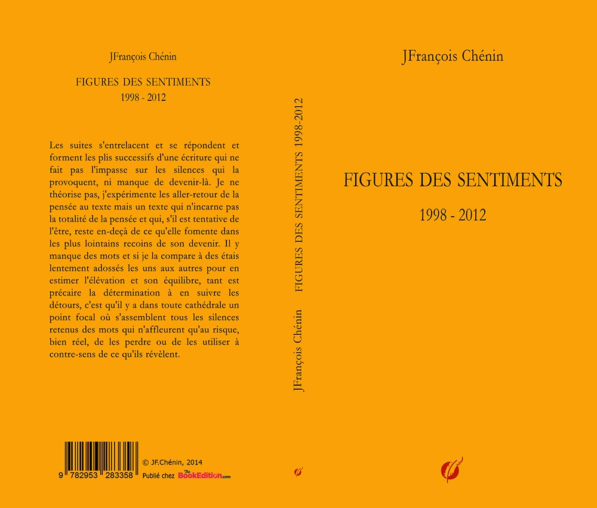
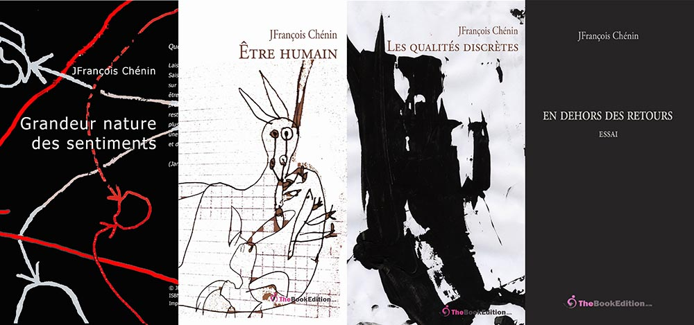

# FIGURES DES SENTIMENTS

 

chez[TheBookEdition](https://www.thebookedition.com/fr/recherche?controller=search&orderby=reference&orderway=desc&search_query=chenin&p=2)

*Figures des sentiments* publié en 2014, regroupe des textes écrits entre 1998 et 2012. Ils ont été publiés séparément chez TheBookEdition

*Grandeur nature des sentiments* (2008)
*Les adolescences meurent sur les talus* (2009-2010)
*Être humain* (1998-2005)
*Les qualités discrètes* (1998-2010) 
*En dehors des retours* (2012) 

 

## AVANT-PROPOS

J'ouvre un nouveau cahier, arrimé à cette errance qui me va bien, de suites en suites. Pour autant, je ne veux rien sacrifier de ce qui me pousse à expliciter mieux ce que j'écris. J'ai besoin de lieux doublés d'instants tranquilles pour ré-agencer ce qui vient alors en rafale, en trombe d'états surgissants, quitte plus tard à élaguer en larges coups de ratures et de ciseaux. Je casse ce qui ne décide à rien et ne retiens rien qui ne serait pas urgent. Mais il s'agit d'une urgence qui compte avec le temps.

Je me veux errant à n'aller qu'à l'essentiel des détours qui absorbent ma pensée et cette écriture, si lente à venir, à prendre forme, est aussi errante dans sa forme et dans ses suites, qui me retourne si bien mon désir de ne pas en devenir totalement prisonnier. Je m'attache à la reconstruire. Je m'arcboute à des étais plus larges et plus hauts où je porte à incandescence les visions qui finiraient par me ronger sur place et ne laisseraient, à regret, aucune trace visible.

Alors débute le lent décloisonnement des mots. Ecrire est toujours en devenir, en instance de dire, et le texte n'avance qu'à coups de sauts, parfois à reculons, dans les rapprochements et les coïncidences qu'il impose. 

Les rêves ne m'enchantent plus où je suis prisonnier, mais un détenu délétère qui m'astreint à ne plus relever ce qui me tient à cœur, même à corps défendant, contre moi-même. Je me force à déjouer les pièges d'une écriture qui ne m'écarterait pas d'images et de sentiments ressassés, sans craindre pour autant les répétitions et les retours comme une revanche à prendre. Ce que j'attends d'écrire est entièrement en devenir d'écrire, même si il faut bien, parfois, placer, quelque part dans les blancs d'entre les mots, un point final. Ou plutôt des points provisoires de suspension.

Les suites s'entrelacent et se répondent et forment les plis successifs d'une écriture qui ne fait pas l'impasse sur les silences qui la provoquent, ni manque de devenir-là. Je ne théorise pas, j'expérimente les aller-retour de la pensée au texte mais un texte qui n'incarne pas la totalité de la pensée et qui, s'il est tentative de l'être, reste en-deçà de ce qu'elle fomente dans les plus lointains recoins de son devenir. Il y manque des mots et si je la compare à des étais lentement adossés les uns aux autres pour en estimer l'élévation et son équilibre, tant est précaire la détermination à en suivre les détours, c'est qu'il y a dans toute cathédrale un point focal où s'assemblent tous les silences retenus des mots qui n'affleurent qu'au risque, bien réel, de les perdre ou de les utiliser à contre-sens de ce qu'ils révèlent.
J'arpente en double-part, tantôt accroché à la certitude que le texte répond point par point aux trajectoires que je m'impose mentalement de suivre, ou du moins rend compte des détours que consciemment je prends pour arriver à mes fins, tantôt enclin à considérer ma pensée isolément du texte qui est sensé porter la traduction réelle de ce qu'elle dessine dans les innombrables sinuosités des mots qu'elle assemble pour être et devenir car la pensée devient à partir du point où on la laisse errer même si cette errance suit ou reprend des perspectives toutes tracées, toutes volontaires, qui sont ses habitudes de réverbération.

La pensée réverbère dans le texte qui la porte, mais imparfaitement, toujours à reprendre, toujours à préciser ou à détourer de ce qui l'entrave, toujours à parfaire. Ecrire, c'est assembler une pensée qui se détache des contingences matérielles de son apparition et de son expression et si, de suites en suites, comme des fragments dont on chercherait les jointoiements, elle parvient à prendre forme, à figurer une réalité ou une compréhension de ce qu'elle exprime, alors le texte approche au mieux ce tourment de la pensée à dire exactement ce qu'elle ressent, imagine et crée et projette d'inscrire à son apogée.

Il faut toujours revenir à la table d'écriture. Il en va de l'équilibre mental qui fait de la pensée une machine à explosion maîtrisée et assujettie à son rêve insensé de se matérialiser, même dans ses plus extrêmes exigences comme dans ses expressions les plus récalcitrantes ou les plus stupéfiantes. En somme elle résiste par devers nous. Ecrire est lui donner les formes et les étais, les voûtes, toute élévation, les escaliers et les coursives, les passages et les déambulatoires, les ponts comme les passerelles mais aussi les frontières à franchir et les limites à dépasser qui lui manquent mais qu'elle sait cependant imaginer et construire – pour devenir.

Ce que j'appelais dans un texte précédent La table des étoiles (1998, in Figures de la disparition, 1975-2006, TheBookEdition, 2012) est cette table d'écriture qui est la planche figurée et figurative des relations exacerbées et silencieuses des mots et de la pensée jusqu'à la figuration matérielle de leur entrelacement, où j'écrivais : Tu les verras disparaître à peine rencontrés, s'extraire de ta pensée, s'évader, jaillir nus, car tu les imagines mal s'affranchir de toi, abandonner ton ventre, tricheuse d'amour. A ce prix, tu enfantes toute la lumière du monde. 

Car la vie ajoute à la vie et juxtapose ce qui s'achève et ce qui nait. Nombreuses sont les ébauches que la pensée griffonne par devers soi, qui sont là, qui se dévoilent et cristallisent de nouvelles visions qui surgissent en travers de la route habituelle et détournent le regard vers autre chose. Car le texte ajoute à la vie et déjà entrelace ce qu'il est et ce qu'il deviendra.

Un livre qu'on finit est un tombeau qu'on referme. On y a jeté la dernière poignée de mots et déjà ils transfigurent le projet et ses intentions. Il faut lever les yeux, relever le regard, s'aventurer mentalement vers ce que l'on ne voit pas encore. Faire ce pas de côté et quitter la place.

## GRANDEUR NATURE DES SENTIMENTS

*Le temps est mon matériau, le temps présent, les hommes présents, la vie présente.*
 Carlos Drummond de Andrade (Sentiment du monde, 1940)

1 - Entre les branches qui fouettent le sol, au-dessus des franges bleues d'un ciel devenu transparent et, plus haut, un blanc vide en liseré de l'horizon qui lui donne sa mesure et son firmament ; au faîte d'ailes d'oiseaux devenus indéchiffrables, le cœur s'arc-boute sur sa position. Ainsi commence grandeur nature des sentiments.

2 - Placer le regard à contre-jour, organiser cette vision pour terminer d'être aveugle, en superposition, dans le détachement de soi sur l'ombre, enfin voir sans voir les traces de ce que l'on trahit en fermant les yeux.

3 - C'est une grande amertume ces sentiments détournés de leur but, un accord frauduleux entre personnes non consentantes, une volée d'ombre et d'arsenic dans nos vies, une escroquerie faite à nos désirs, une effraction de notre intimité jusqu'au chaos qui en restera.

 4 - Écrire par profusion, instantanément, tous les sentiments. La peur sera arrachée de la page ; déranger les mouvements naturels de la bonne conscience, engranger ce qui reste, c'est-à-dire le ciel au-dessus de soi comme une échappée nécessaire, ce ciel qui s'ouvre en haut de la route, immédiatement transparent et inimaginable. 

5 - Ne rien écrire qui ferait défaut.

6 - Arrangement du désir avec ses fantômes, dérangement des plaisirs subreptices, sur la terre comme au ciel. Il n'y a pas de différence entre juger et pervertir. Privilège des affinités clandestines.

7 - Le feu entretient le feu. Nous parcourons de trop grandes avenues pour notre respiration. Notre regard est insuffisant. Ce que nous pensons à portée de main est au-deçà de notre compréhension. Nous sommes intolérants déjà avant de naître. Ombre, confusion, petitesse, toute chose qui nous rend aveugle.

8 - Ce qui reste de ciel en nous est de l'épaisseur d'une lisière. Il est difficile de s'y tenir debout, tout au plus pourrions-nous la franchir. Mais elle se déplace avec l'ombre, devient ombre elle-même où nous finirons par disparaître. Il est incertain de s'aventurer au-delà.

9 - Les sentiments sont en creux, un coup de vent ne les efface pas, il les comble ; un coup de vent ne les assoiffe pas, il les assemble.

10 - D'abord un instinct, une intuition, un avant-goût de l'autre en soi. Puis l'esquive et la fuite, un vrai raccourci. C'est toujours en soi ce pressentiment du non-recevoir. Un eespoir ou un avertissement ? Un signal, une voix, une alarme ? Ne rien dire ? Ne rien taire ? Agir et son contraire ? Un pli en plus peut-être ou une imprudence de la mémoire à satisfaire ses absences. L'inconvenance de tout commencement qui ignore la suite ? 
Tout est possible.

11 - D'entre toutes les frontières, celle qui passe entre nous est la plus rusée : inaudible, imperceptible, étourneau transparent sur la crête des feuillages, étourdissement débarrassé de sa pesanteur, elle dit les écarts d'une pensée insouciante où le clair-obscur du ciel dans sa 
lumière d'ombre se referme sur lui-même. Intouchable. Toujours elle laisse des traces, des effluves et des spasmes, elle grandit entre nous, nous donnant le goût et le souffle quand, si elle vient à nous manquer, nous tombons lestés de ce qu'elle avait mis en garde et 
protégé.

12 - L'extraction des sentiments est sans fin. A l'aube il faudra s'y remettre et, plus tard, relever les traits, dégager les pans, arracher sans retenue les lambeaux qui les masquent, exhumer ce qui reste de vrai ou de faux, selon les circonstances et extirper de cette gangue jusqu'à la plus infime parcelle de nous-mêmes, inexorablement nus.

13 - Tout commencement est déjà une fin, dans les sentiments plus qu'ailleurs.

14 - Mais ailleurs que reste-t-il ? Irruption drolatique (ou diabolique) d'une aperception de la différence. Tout est affaire de flair (ou d'état d'âme, de position). Renversement immédiat : rien ou presque rien, une préhistoire incompréhensible (intraduisible) autrement que par des gestes apraxiques. Dont acte.

15 - Ne rien écrire qui ne pourrait être partagé.

16 - Question de méthode : laisser dériver la lumière et faire un pas de côté. Saisir alors ce geste inouï du glissement de l'ombre sur l'ombre qui lui donne son reflet, sa vivacité ; être adjacent à tout ; tenir cette position ; préférer les irrégularités aux coïncidences ; rester dans cette marge décalée ; encore un pas, plus au bord ; goûter cet écart pour ce qu'il est : une saveur incidente de l'effroi et de l'enchantement mêlés.

17 - Au bout des sentiments, il n'y a pas de visage familier.

18 - Les mauvais sentiments sont à fleur de larmes. 

19 - Le crayonné leur va bien. Sans être brouillon, il laisse deviner ce qu'il en retiendra : l'amertume de l'effacement.

20 - Bateleurs, ivrognes, escroqueurs, voilà les sentiments. Ils gesticulent sur une corde qui cassera. Ils nous entraîneront dans leur chute et du vertige de cet envol restera une pointe d'étourdissement, un petit secret entre eux et nous, tellement anodin, qu'il sera inutile d'en parler. Encore une fois, nous en sortirons dupés et nous y aurons mis du nôtre.

21- C'est d'abord le creux de la main, une paume fraîche sur un front chaud, puis toute une main appuyée sur l'épaule, effleurant la nuque, la racine des cheveux, toute une main légère, enjouée et maraudeuse, une main entre toutes la plus fine et la plus douce qui va et vient, feint de serrer, libère à chaque fois, une main qui ne connaît pas l'absence ou la rend supportable à force de laisser ses empreintes juste là où il faut, une main lumineuse en remplacement de tout.

22 - Seul un ciel bleu est explicite. Il foudroie à bord d'horizon. Nous y plongeons quand arrive le haut de la côte. Il est tout entier le début et la fin, le côté et la marge, le seuil et les terrasses à l'à-pic de sa fulgurance, le bas et le haut de toute vision qui s'enchevêtre en lui. Un ciel bleu, l'été, vers cinq heures de l'après-midi.

23 - A tout nouveau sentiment, tenir des propos extravagants. Puis baisser le ton et se laisser enlacer. En somme, s'offrir une conduite morale.

24 - A l'autre bout de la pièce, la fenêtre donne sur un coin de lumière. Elle passe du blanc à l'orange selon l'heure, toujours irisée de bleu. Elle est l'âme du moment, une trouée parfaite sur le vide au-delà. Mais les histoires sont terribles qui viennent de cette brèche éviscérée. Elle devient sépulcrale, équivoque, vilaine. Et tout s'éteint.

25 - Justement, presque rien, cette infime parcelle de sentiment qui traîne, s'attarde, fait obstacle, persiste, pourrait grandir faute d'attention, pourrait encore survenir,  pourrait donner du fil à retordre, s'exhausser de ce souvenir insignifiant ; justement il est ce souvenir, cet arrière-goût d'illusion, un reste d'histoire, un rappel, même pas un retour, un détour qui se perd dans l'esprit qui tente de le suivre, une discontinuité, un intervalle de plus dans la vie qui passe, un hiatus sur le bout de la langue ; mais il tient, s'accroche, ricoche sur les intentions, donne de la voix et son rire finit en rictus ; justement, tout ou presque, cette infime parcelle de sentiment qui traîne.

26 -  Insister sur la lumière qui irradie le ciel. Il n'y a qu'elle en lui, c'est physique.

27 - Transhumance des sentiments - Ils migrent par paquets, petits bouts par petits bouts. Ils progressent par petits pas, légèrement tressauteurs, juste assez pour ne pas perdre la gaîté nécessaire à la marche. Presque sereins, pas tout à fait hautains, mais sur la réserve. Ils arrivent de très haut. Ils se jettent bas sur les esprits, devenus troupeau de dupes, exhaussés de leurs vœux, 
à l'encan.

28 - Trouver un substitut, une équivalence ? Ou se contenter d'un à peu près ?

29 - A l'arraché, comme à son habitude - Cette obéissance à ses fautes, celles dont il se souvient encore, qui trahissent ses hésitations, cette docilité imprudente pleine de faux-pas dont il abuse, ces écarts qu'il feint d'ignorer, toute cette panoplie d'excuses et de promesses qu'il ne tient pas, ces petits riens et ces petites choses toujours à côté, hors d'atteinte pense-t-il, voilà la grande œuvre défaite de son renoncement.

30 - La raison biffe le cœur, le cœur cesse de battre ; cette parole nette qui cesse de dire ; voilà le souffle éventré du cœur qui finit par se taire. Le temps passe ponctué de foudres mortes, d'occasions manquées de dévoiler sans disloquer, de crayonner sans rature et si les ébauches sont parfois précipitées, kidnappées à l'ombre qui les tenait, elles portent, en marge, les marques du silence dans lequel elles sont nées. Il s'agit toujours de parfaire les confidences, d'éprouver l'obscur et le furtif, d'extirper les réticences de nos sentiments, d'aller à l'invisible, d'énoncer  les équivoques de nos arrière-pensées pour découvrir dans le dédale de ces indiscrétions - nos dessous des cartes - que le cœur fuyant a des raisons de fuir et, se laissant dépecer, qu'il ne cèdera jamais sur l'essentiel : le silence, le prochain silence où nous serons jetés.

31 - La nature du réel est faite de l'oubli de la réalité. Plus qu'une fantaisie, une nécessité. Sinon que vaudrait le moindre sentiment ?

32 - Revenir à la méthode : dans un ciel bleu-nuit, repérer la Grande Ourse, fermer les yeux, respirer.

33 - Le premier morceau qui vient à l'esprit est le premier mouvement de la suite pour violoncelle seul (n°1. BWV 1007. Sol majeur) de Bach. Elle est la généalogie des premiers sentiments, les plus lointains, les plus inaccessibles, devenus inévitables car rien ne pourrait naître qui ne détiendrait une part d'eux.

34 - Nul n'approche qui n'a donné un signe (tête, main, regard), levé une étoile, départagé un ciel. Nul ne parle qui n'a déjà livré un rêve, délivré son souffle, enivré ses compagnons. Nul ne passe qui n'a abandonné les accusations et les preuves, nommé le réel et l'apparence du réel, révélé cette part ordinaire de ciel reprise des abîmes. Nul ne disparaît inespéré.

35 - Les sentiments sont des figures de style. Ils finiront sillons de l'épiderme.

36 - Petite méthode : écrire d'un trait puis écrire mot à mot, épeler jusqu'au silence.

37 - Cette peine dans les grands sentiments, ce froid qui monte, cet instant qui devient le froid lui-même. Evitez de réduire les dissonances. Interprétez mieux -  avec des sons, des signes, parfois des éclats - ce qui pourrait ressembler à une inconséquence. Martelez sans cesse qu'une peine reste une peine et que le froid qui s'insinue sont leurs veines. Ignorez ceux qui ont la faiblesse de croire qu'ils pourraient en réchapper. Soyez simplement de connivence avec vous-même.

38 - Gnossienne n°3 : vérité et mensonge en quarantaine au même endroit, qui s'épuisent à se ressembler et font avec les mêmes mots tout le contraire. Il en restera une légère impression de ressentiment.

39 - La partie est perdue, le cœur est dévoré, la matière charnelle implose, la réalité devient hyper réalité, il reste du chaos l'insatisfaction de nous avoir épargnés maintenant que nous sommes seuls. Quelle déconvenue ! 

40 - Ce soir (peu importe la date), au faîte du soleil qui disparaît au-delà de la dernière ligne (la plus lointaine mais toujours haute), dans cet élan du regard qui voudrait tout retenir (l'étendue, les couleurs, les transparences, les contrastes, les effets l'un sur l'autre des lumières), quand la terre devient écho de l'ombre (elle fera lit avec elle), à l'instant où  nous perdrons les pleins et les déliés d'un ciel trop grand pour nous (à l'instant où il nous envahit), ce soir arrive trop tôt et passe trop vite, ce soir était un début d'enchantement.

41 - Figures de la dévoration : absorber, anéantir, annihiler, avaler, bouffer, bourreler, brûler, consumer, convoiter, croquer, dessécher, détruire, dévisager, dilapider, dissiper, embraser, empiffrer, enflammer, engloutir, engouffrer, épuiser, gaspiller, grignoter, hanter, miner, obséder, piller, ravager, ronger, ruiner, ruminer, s'empiffrer, saccager, submerger, supporter, taire, tourmenter, user. Ou figures des sentiments ?

42 - Autrement dit : il y a la nuit renversée des rives vives, des talus adolescents et des lunes en fond de cour. Toute la nuit ouverte sur elle-même, en majesté.

43 - L'aventure se terminera avant le premier souffle sur le cou, ce petit souffle blond qui donne du cœur à l'âme, dans un élan bien trop maîtrisé pour durer, durer l'instant du souffle. Les siècles de notre vie durent à peine des secondes. A peine les secondes durent-elles quelques amours. (Robert Desnos)

44 - Ces apartés qui envahissent le silence autour de nous, qui font bruit, devenus des chagrins maugréeurs, des incises mal pensées, de vitupérants embarras qui nous stupéfient, finissent par nous emporter. Et nous sommes faibles et velléitaires dans nos tentatives de les éviter, nous nous débattons bien peu avec des gestes et des mots à tort et à travers, sans but, avec le mesquin souci d'être épargné. Comme si nous en redemandions ! Reprenons : Oui ! En nous c'est le vacarme, un vrai 
tremblement avant la chute, une reddition sans rappel applaudie à toute volée.

45 - Nouvelle question de méthode : assujettir dans un espace restreint les visions majestueuses de la terre qui fume sous la pluie, de la lumière qui se soulève dans sa lumière, du ciel noir au-dessus, de l'horizon qui se déchire d'un coup, dans un affolement argenté ; puis partir.

46 - Aperçue brièvement, la lumière saute du ciel dans les yeux et tombe en droit-fil à l'à-pic de son vertige.

47 - La balle est dans le camp des sentiments. Nous gagnons à nous distraire d'eux. Pour une fois, parlons d'amour, à voix basse. Déjouons le risque de les alerter.

48 - Elle fredonne comme Rachmaninov (Concerto n°3, Mv n°1), sur un doute, déboutée dans sa quête par un tribunal malicieux. Rien ne sera réparé. Elle cherchera ailleurs, elle prendra d'autres routes, elle sacrifiera au  démiurge, elle inventera. Sa solitude sera magnifique, elle ne demandera rien d'autre. Elle fredonnera encore, séparée et morcelée. Elle aura le sentiment diffus de ne pas être à sa place. Elle aura raison contre elle-même à mi-voix et, fermant les yeux, elle dira qu'elle est pourtant heureuse.
