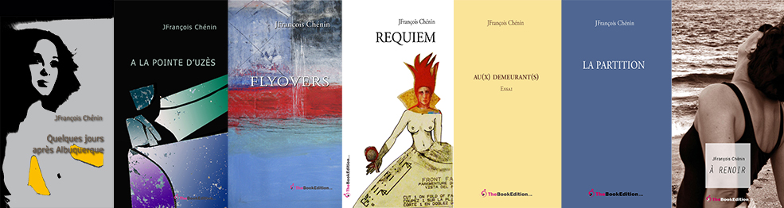

# FIGURE OUT Suites américaines

 

Chez [theBookEdition](https://www.thebookedition.com/fr/figure-out-suites-americaines-p-120825.html?search_query=chenin&results=48)

*Figure out, Suites américaines* regroupe des textes écrits entre 2008 et 2013, publiés séparément chez TheBookEdition. 

*Le mouvement du monde* (in *Requiem*)
*Quelques jours après Albuquerque*
*A la pointe d’Uzès* 
*Flyovers* 
 [*Requiem*](https://darkness.chenin.fr/darkness/requiem/)
Nous sommes des silencieux (in *Flyovers*)
*Au(x) Demeurant(s)*
*La répétition*
[*à Renoir*](https://darkness.chenin.fr/darkness/a-renoir/)

 

## AVANT-PROPOS

*Figure out* (2008-2013) achève le cycle des Figures qui, avec [*Figures de la disparition* ](https://darkness.chenin.fr/darkness/figure-disparition/)(1975-2006) et [Figures des sentiments](https://darkness.chenin.fr/darkness/figures-sentiments/) (1998-2012), a constitué une grande part de mon travail d'écrivain jusqu'à aujourd'hui. 

Nécessairement ces trois cycles se joignent, se chevauchent et s'interpénètrent tant l'écriture dévoile, au long de ces années, les rapprochements et les redites, les perspectives communes et leurs points d'appui, mais aussi les écarts et les pas de côté qui permettent d'en expliquer les partis pris.

Ces trois cycles sur près de quarante ans n'ont pas contredit ce que j'éprouvais alors de l'écriture : Nous vivons de paroles suspendues, forcément inachevées, à contrecoeur et de mots débordants, pourvoyeurs hâtifs d'instants mal ordonnés. Voisins des arpents, 1975. 

Je comprends maintenant que je n'avais pas d'autre choix 
que de m'aventurer dans une expression scripturale qui reniait la narration et le roman ou mettrait à l'écart la poésie tant la pensée procède de saut en saut, arrimée à ce qui l'exaspère et la déroute.

Comment éprouver l'impatience de la pensée à devenir un texte ? (In Roman, 2000) Je réponds : en suivant ses linéaments opalins où réalité et fiction ne s'opposent pas et dessinent des suites qui, abruptement, en agrègent les lignes de fuite.
J'ai trouvé mon rythme (mon salut en quelque sorte et, ce faisant, assouvi une fièvre d'écrire) dans le jointoiement des mots. J'ai basculé du côté des architectes, des charpentiers et des maçons qui assemblent des espaces qui pourraient 
demeurer vides ou silencieux parce qu'ils n'ont pas trouvé 
la mitoyenneté nécessaire à leur déploiement ou à leur 
dépaysement.

Et les balises que j'ai placées comme autant de pièges d'un feu revenant ont donné le rythme des mes déplacements dans 
la matière du texte, d'une destination à l'autre, qui n'étaient que les objets d'une convoitise qui m'échappait quand 
j'écrivais, qui me fuit encore, mais que je sais être cette 
pensée qui me guide.

Karachi, 21 décembre 2014

*Un écrivain est peut-être toujours un passager clandestin. Caché, et très en marge.*
Jim Harrison, Off to the Side, A Memoir, 2002

## FLYOVERS

Merci à Pascal Quignard et à Philip Glass qui m’ont accompagné tout au long de *Flyovers* ; merci à Olivier Haligon pour sa générosité au billard ; merci à Bergeronnette et sa belle idée de Musée Modeste et Pompon ; merci au restaurant Lemon Twist (North Beach) qui a été mon refuge bien souvent. A la mémoire de Carlos M. Luis qui m’a rappelé les racines de mon écriture.

A Miami, j’ai pris le parti du quotidien, au fil de l’eau et des flyovers, en roue libre, attentif, amusé, réservé, en embuscade, avec méthode : balancer sur le mot à mot, avancer sur des phrases retournées, détournées, retenues, remonter à temps, respirer. 

Délier la main qui écrit.
En réalité, je n'ai pas le choix. Ou plutôt j'ai fait ce choix d'arpenter - au sens de mesurer - à mesure de mes rencontres, de mes impressions et de mes sensations, les infimes changements mentaux qui modifient au jour le jour et mes visions et la manière que j'ai d'y revenir avec des mots. Mes visions ne sont pas qu'un langage - ce qui serait mon style : elles sont l'incessant aller-retour de mots balancés dans la réalité et de réel détouré et détourné. 
Ecrire, c'est conduire cette rencontre à bonnes fins. 

Je dispose de ce temps libre de l’esprit entre mille choses à faire. J’ai du papier, un crayon et je m’arrête en bord de route ou en bord de table, j’occupe les lieux de mes visions et, à l’arraché, entre deux regards, je plonge à traits tendus dans le ciel qui s’effile immensément autour de moi. J’ai des impressions fugitives d’histoires qui ne sont pas les miennes et qui, pourtant, me concernent. Je m’arc-boute à l’à-pic de mon instinct pour penser qu’ici, à Miami, des mondes se défont les uns contre les autres, les uns dans les autres et que, foin du résultat, il en restera ce que l’on en a aimé y compris dans la détestation que ces mondes suscitent. Mes amis me le rendent bien qui ne m’invitent plus. Mais chaque jour je passe un pont et, dans cette élévation douce vers le vide du ciel, je comprends les raisons de mon choix : respirer chaque fois que je tombe du ciel, respirer et me relever.

Des mondes et des rêves se défont dans la compagnie des étoiles et des orages. 

A Miami, les rencontres sont intermédiaires, entrelacées de surprise et d'oubli et Ocean Drive finit sur une impasse. Mais il faut entendre le vent chaud dans les palmiers qui, d'un jour à l'autre, surgissent par miracle et les sautes du vide sur le plein, pour comprendre qu'il n'y a pas d'issue pour les rêves d’un nouveau monde. Toutes les communautés recherchent la reconnaissance sociale comme un signe lancé de plus loin que l’espace externe, de plus loin que l’air atmosphérique, en amont de la naissance : signe d’appartenance. Ours, alouettes, femmes, homosexuels, malades, mendiants, errants, musiciens, peintres, écrivains, saints, ne vous signalez pas aux pouvoirs politiques, écrit Pascal Quignard Les Ombres errantes, 2002  

A Miami, ici plus qu’ailleurs, revenir aux origines, déceler ce qui-n’est-pas-d’ici, interpréter les infimes différences de ce qui-est-à-l’origine, décheveler les reconnaissances des signes trompeurs ou de ce qui-n’est-pas-reconnu. La vie est à brûle-pourpoint et la vie brûle en raison des rêves qu’elle ne porte plus. 

Ne vous signalez pas mais déferlez tête haute, bras ouverts vers vos démons dans les avenues qui ne sont pas les vôtres, avancez sur ce bout de chemin en prévision des profusions nouvelles qui vous submergeront. 

Et je m’arrête au flanc des murs dressés d’ombre dans un angle silencieux, j’arpente mentalement les signes, les redondances, toutes ces traces adjacentes qui dessinent les oppositions et je devine les filigranes antagonistes qui se forment sous le tain des miroirs diaphanes des devantures fluorescentes de Lincoln Road, les transparences des rêves sur la vie, les transparences indicibles des corps projetés les uns contre les autres qui se croiseront sans se voir.

Des vies vont se défaire et d’autres passer de l’une à l’autre, des vies et des mondes qui s’éloignent en contrepartie de leur défaite, d’autres qui se joignent dans les abris précaires des preuves qu’ils s’échangent. Je reprends la route après avoir fumé une cigarette en regardant Downtown s’illuminer de crépuscules flamboyants sur fond d’orages noirs et je sais qu’au prochain virage je passerai un pont - une élévation - 
qui me confirmera encore que le ciel qui surgit devant moi, un ciel intact qui s’élève du fond de l’horizon bleu sur blanc, blanc sur noir, est la respiration tranquille de mes pensées à demeure.
Détourer les sentiments est la raison. A bout portant est la manière. En coin de table de la route aux heures franches de la nuit est la position.A Miami, les élévations sont brutales et lumineuses, sur fond gris et noir d'un autre monde. Il faut longer les entrepôts fermés de Winwood sur Miami Avenue pour comprendre ces agencements contre-nature de la terre et du ciel. Pourtant tout s'équilibre dans la vision soudaine du plein qui jaillit du vide et du vide qui est encore là pour la respiration et qui resserre à point nommé ce qui n'était qu'illusion de pans et de reflets à l'assaut du ciel.

A Miami, hors-bords et hélicoptères volent en grappes dans des cieux séparés.

A Miami, pour être à bonne fin, il faut marcher à découvert, ignorer les traverses incertaines, garder tête haute, saluer, garder la main, aimer parfois, accepter les versants du jour dans leur continuité distraite, s’arc-bouter au tréfonds de 
l’incertitude, remonter à temps, gagner sur soi ce non-dit, allonger le pas, rendre impossible les à-côtés, s’émerveiller enfin.

Plus au nord, à Palm Beach, les trésors sont à feu et à sang des rides qui les fissurent. L'ennui dévore, qui est cette part inaltérable du bonheur de croire tout posséder.

A Miami, leurs silhouettes restent. Ils ont disparu, portés absents, nonchalamment appuyés au bord de leur défaite, résolus. Sourient-ils encore ? Ils nous regardaient. En arrière fond, la vie qui était devant eux. Et ce qui reste des rêves démembrés, au fond du corps qui plie, qui n'en peut plus, mis à l'écart, est un reste d'illusion. Ils n'avaient d'autre choix que de suivre leur déhanchement, dérisoire et  mécanique. CubaOcho Center, février 2011

A Miami, qui peut se permettre d'avoir deux orgasmes par jour, voire trois ?

De Miami à Palm Beach, il y a des années-lumière de mondes dissociés, adjacents, des mondes en creux, décidément cachés, dont on suppose l'existence sans les voir, qui font flash parfois dans les sourires de vieilles soupirantes, insatiables et fatiguées, à l'écart des rencontres qu'elles n'ont pas faites ou qu'elles n'ont pas voulues faire, tellement en arrière, tellement en arrêt. Elles dodelinent, fascinantes mystérieuses à l'abri dans les allées vides de leur jardin désert. Et si elles sortent, c'est pour se rejoindre en bande sous les mousselines qu'elles porteront encore le jour de leur disparition. Qui n'alertera 
personne.

La mer est là, on ne la voit pas. La mer est là, elle respire à fleur de sable, on ne la voit pas. La mer est là, à vue perdue, on ne la voit pas. A Naples Floride, la mer est en supplément.

A Miami, l'idéal est de vivre à moitié prix 50% off. Autant dire des moitiés de vie.

A Miami, des ombres dorment au seuil des parkings déserts le long des grillages où elles ont suspendu leur déroute. Des ombres de femmes et d’hommes en arrière-ban de la vie. Qui s’arrête pour les relever ? Qui pourrait s’outrager ?  Qui connaît sa dette ? Décidément il ne fait pas bon d’être des basses castes à Miami, mais comme ailleurs.

A Miami, une bretelle qui glisse de l'épaule est un signe d'inquiétude.

A Miami, au bout du bar, elle le prend de haut pour se satisfaire. Est-elle dupe ? Elle ourle son corps d'un carcan droit jusque dans les yeux. Cela lui suffit, pour l'instant. Elle a gagné son ascendant, pour l'instant.

A Miami, les bateaux toutes sortes de bateaux tracent leur écume dans les reflets argentés de l'eau. ils sont les souffles blancs de météores à raz de la mer, cédilles, à peine panaches. Parfois, ils ne laissent rien, ni empreinte, ni signe d'une ambition, mais passer, discrétion des rêveurs.

A Miami, je travaille en bord de table de la route effilante qui se disperse et s'éfaufile sous les arbres blancs - la lumière est à cru - des Everglades. Vers Key West, elle devient bleue, margelle à peine du ciel qui tombe dans l'océan. En bas du monde, quand je m'arrête, j'ai douté d'être là sous le soleil emmagasiné à chaque pointe des feuilles et des vagues, à chaque vision répétée de ces éclats suzerains qui disent 
l'assemblage inextricable de la terre et de l'eau. Et la route reprend, arrachée du silence qui s'était fait en moi, le silence blanc et épuré de l'instant demeurant.

A Miami, à l'approche de l'hiver, les arbres pétillent de malice et sous les flyovers les allées sont vides.

A Miami, se méfier des premières impressions. Se garder de conclure à la va-vite. Qui n'a pas appris à se taire a besoin de se refaire une éducation ou une virginité.

A Miami, les rencontres sont des mariages arrangés, votre hôte pourvoira au bonheur d'une intimité éphémère, le temps d'une soirée. Les affinités ne laissent rien au hasard et votre hôte sera l'enfant de chœur du sanctuaire de vos désirs. Les acolytes sont légions qui tremblent comme des corbeaux agités à l'idée de perdre la faveur que vous leur faite d'avoir cédé à leurs suggestions. Question de réputation.

A Miami, les impasses ont pignon sur rue. Il en va des moulins comme des bordels : à tout va et à tout vent.

A Miami, les femmes vont par quatre, les hommes par deux. Parfois elles sont trois.

A Miami, talons aiguilles, pointes en l'air, cheveux d'ange, idées fixes, martel en tête, millésimes déclassés, chaque quart d'heure est une provision d'erreurs... pour la suite au prochain quart d'heure.

Far far away... Les avocats ne sont pas les meilleurs conseils. A Miami comme ailleurs. Ils lancent des contrats et vous passent la main dans le dos. Ils ont en commun avec les chirurgiens d'opérer à cœur défendant.

Mais dans l'ombre qui se défait d'une absence plus grande, qui peut y croire encore ?

Tout est dit avec force. Dans les halls des hôtels - glace au fond, murs noirs, soubresauts imperceptibles des paupières - le désir peine à percer même si le sourire est là. Un vrai désir 
surgissant et ahurissant. A Miami, on les imagine à fleur de peau, tout simplement récalcitrantes entre elles avec le même frisson froid, prêtes à mordre. Elles ne mordront pas et se 
mettront à désirer une fois seules. Ou pleurer selon le cas.

A Miami, sur le pas de la porte, le dernier verre, entre chien et loup, parfois le vent remue à contre-courant, décide de la suite. Tout est dit, les fleuves de lumière roulent, les dessous de flyovers se taisent et les restes du jour grappillent sur la nuit. L'heure est aux chants alternés où réception et prédation vont de pair. Atermoiements et faux départs, les places ne sont libérées que sur parole et les lumières renaissent et dans les pupilles dilatées des ombres passent, innervées de désir. 
Tout est dit, il faut partir. La route s'élève comme une femme soulevée, il faut atteindre le sommet pour rétablir la vision, trouver un nouveau point de fuite. Au-dessus, le ciel n'est qu'un seul pan d'un mur intact, inhabité et le vide est indescriptible qui casse aux terrasses d'angle des buildings. Les distances sont des points d'horizon, lentement rapprochés les uns des autres jusqu'à être là. Jusqu'à devenir là. Des distances pourtant qui ne sont pas partagées. En bas, dans l'ombre, un lent ressac à peine entendu, à peine venu au monde, hante l'air de son frôlement lancinant.
Je me suis trompé, à Miami les femmes vont par deux. 
Et les terrasses sont inondées de regard en coin.

A Miami, les jours sont continus et il reste toujours, au fond de la nuit, une fenêtre éclairée au sommet d'un building, une lumière pâle et lointaine, une lumière qui s'éteindra avec le jour revenu, continu. C'est se mettre martel en tête que de rêver à contretemps.

A Miami, les artistes dégringolent des cimaises qu'ils essaient d'accrocher au ciel. Pauvres artistes !

A Miami, la lune s'accroche aux derniers nuages, la tête à l'envers. La nature n'est pas comme elle est. Il faut aller chercher plus loin, en arrière-fond, ce qu'elle n'est pas prête à donner. Comme ce mystère de l'Infante, errante dans sa demeure, arrachée des miroirs qui la tenaient.

A Miami, les rêves disparaissent dans les bars poisseux de Winwood, au bord d'une voie ferrée sans destination. Me revient une phrase de Pascal Quignard : Quelque chose me manque où je sens que je vais aimer m'égarer. Villa Amalia

A Miami, j'ai relu Antonin Artaud : Nul n'a jamais écrit ou peint, sculpté, modelé, construit, inventé, que pour sortir en fait de l'enfer. Van Gogh, le Suicidé de la Société 
Il est venu à Miami. Certains l'ont vu sous les flyovers de l'I95. Il tendait sa main graphorrhée à une cartomancienne cubaine.

A Miami, les rassemblements artistiques ont ceci de désespérant qu'ils donnent à voir la même chose de la même chose. Aucun désir, aucune générosité, aucun souffle, aucune élévation, tout au plus de la décoration. Tristes artistes-déco accrochés aux murs des studios-condos.

Les petites bassesses passent pour grandeur d'âme et les corps se réveillent soufflés, essoufflés et épineux sous la peau. Rien ne glisse mieux que l'eau. Il faut s'y résoudre, la lumière n'est pas bonne conseillère.

Condo après condo, de park en ressort, de party en party... Il en va des condos comme des partys, ils se succèdent. Miami est dans la loi des séries.

A Miami, les petites silicones vallées sillonnent les grands 
hôtels.

A Miami, le devant de la scène est à l'à-pic des résultats. Gravir et chuter vont de pair. Mais à l'entendre, rires et larmes ne font pas la différence. il y faudrait un autre talent, majestueux et souverain, presque impénétrable... Qui le voudrait ?
A Miami, la célébration est un compte courant. Accoudé au comptoir d'un bar cubain, me revient cette phrase de William S. Burroughs : Desperation is the raw material of drastic change. Only those who can leave behind everything they have ever believed in can hope to escape. Où serons-nous 
retenus ?

A Miami, le poisson pêche le pêcheur. Dans les rafales de vent d'Est, il y a des parfums qui ne trompent pas. Ils se mélangent aux relents des amertumes des pêcheurs esseulés qui n'ont d'autre fortune que d'attendre que le bouchon plonge. 

A Miami, je lis ce texte de Pascal Quignard : Homogénéité culturelle, historique, tel est le destin de l'homme. Hétérogénéité naturelle, originaire, tel est le destin de l'art. La fragmentation est l'âme de l'art.

A Miami, la lumière est entrée sous terre. Et le long des bras de mer ou entre les flyovers les ombres lourdes s'ouvrent sur du vide. Une voiture passe, les feux clignotent. 

A Miami, le choix est le problème. Ce n'est pas un mauvais problème. Certains font des choix, d'autres les évitent, certains abdiquent aux dogmes. Je me rappelle ce mot de Andy 
Warhol : Tous les tableaux devraient être de la même taille et de la même couleur de sorte qu'ils seraient interchangeables et que personne n'aurait le sentiment d'en avoir un bon ou un mauvais.

A Miami, au bord de l'hiver, à la lisière incertaine d'une lumière prise à la surface de l'eau, l'éclat d'un feu sur le ciel dans un éclat plus grand qui l'entoure fuse jusqu'à son cœur, naissance en somme ; sur cette terre à mi-chemin de nos aventures - feu majestueux - au seuil d'un monde qui s'ouvre, bleuit, rugit, dans un mouvement du bas vers le haut, le vent soulève la lumière, cette seule lumière, irradiée en son centre, devient souveraine, ligne de toutes les lignes, naissance en somme.

A Miami, l'ordinaire sort de l'ordinaire.

A Miami, les masques tombent quand sont décrochés les sentiments de leurs attaches naturelles.

A Miami, le berger répond à la bergère, sous l'amour la querelle et les flyovers délimitent les flux et les reflux, sans contrariété visible. *Amant alterna camenae*.

A Miami, la vie est devenue le rêve, embaumée. Et sous le vent qui se renforce de jour en jour, tout se bouscule. Tout bascule. Le rêve vient opportunément : mansuétude du renoncement. A la fenêtre, à toutes les fenêtres - devenus les judas des soupirs, devenues les trouées noires du fond du jour, à la fenêtre, à toutes les fenêtres où s'enfoncent les vagues, les cris, les rebondissements, à toutes les fenêtres les hommes et les femmes s'agitent, des chiens aboient, des enfants pourraient tomber. Magie du renoncement. A feu et à sang les grandes enjambées dans le vide, à feu, à sang, pour pleurer la richesse perdue et au fond, tout au fond, l'eau est froide. La vie a pris le pas sur la vie, à force de se partager, d'être mille éclats propulsés. Vendetta que ce rêve.

A Miami, les branches bleues des arbres retournés sur eux-mêmes, souvent les façades les absorbent, retenant leur lent mouvement dans leurs reflets moirés. Après, un regard suffit à les dédoubler, rejetant les ombres sur leur ombre défaite.

A Miami, l'hygiène crée la fonction, en toute chose, en tout lieu, jusqu'à l'extinction des feux. Alors il ne faut jurer de rien.

A Miami, se faufiler entre les femmes sans les toucher, mais faire comme si, est le jeu le plus abouti des hommes. Faire barrage, celui des femmes.

A Miami, j'argumente en dilettante. Position du positiviste que je suis doublé d'un nihilisme serein. Bravo les certitudes, bravo les incompréhensions ! Il est surtout dangereux de s'arrêter ou faire mine d'hésiter. Grandeur ! Grandeur ! Grandeur du missionnaire, il perd en résolution ce qu'il gagne en vague à l'âme. Il en a besoin. Ces gens ne peuvent être convertis. Ils sont dans l'absolution permanente, leur raison d'être est magique, de cette pensée sûre d'elle-même, quasi divine, qu'ils ont d'avoir raison contre tous et parfois contre eux-mêmes. Passez ! Absolution ! Passez ! Absolution ! Passez ! A Miami, on s'habille en noir et on traverse la nuit sans regard. Les rives sont incertaines où accostent les enfants - déjà oubliés - récalcitrants et entêtés.

A Miami, les hésitations sont des promesses ; et les corps dénudés des lagunes, entrelacés de spasmes, des rêves inaccomplis. Plus forte est la cambrure, plus le silence est de rigueur. Jusqu'aux derniers entrelacs.

A Miami, du fond du jardin, la vue est imprenable c'est-à-dire réservée sur la condescendance qu'ils s'infligent, réciproquement. Mais ils ne sont pas dupes, du moins ils le pensent. Un verre à la main, la moue à la bouche, le désir en berne. Qu'à cela ne tienne, ils reprennent un verre et se servent une nouvelle ration de vanité. Du fond du jardin, la vue est imprenable. 
A Miami, les rues et les avenues croisent aux droit-feux clignotants. C’est deux heures du matin et la buée épaissit en grands lambeaux opalins éclairés par en-dessous. Parfois une trouée dénoue la lumière d’un néon oublié. La porte est encore ouverte et il est encore temps de boire un whisky.

A Miami, j'arpente en grand désordre avec l'intime conviction que tout s'ordonnera un jour. Tout : formes, vides, ombres, ombre des ombres portées, pans vertigineux du ciel sur les façades, grilles et feux, orages effacés de la mer, orages brusquement déplacés, ce qui a bougé, ce qui s'immobilise, gens espacés, hors d'un signe de la main. Décidément ne pas croire à ces regards qui diraient la peur de la perte d'équilibre, la peur finalement d'avancer, la peur de perdre les traces, les points symboliques et cardinaux de la pensée, où la pensée s'est effacée laissant encore un vide.

A Miami, grandeur nature des rêves et bas instincts des sentiments vont de pair dans les nuits blanches de Collins Avenue. Tout un peuple qui s'arrime les uns aux autres au fond de verres vides. Il suffit de s'accouder un bref instant de la nuit au bar du premier bar venu pour comprendre que les pas et les rondes, les allées et les venues, les regards et les ventres tournent à vide. Se résoudre à cette disparition chronique du plaisir. Se déplacer de quelques rues vers l'Ouest.
A Miami, certains bateaux sont des vanités boursouflées, vus de loin. Petit sabot ramassé, la proue qui cherche à s'élever, bout-de-cul à raz de l'eau, à la traine. Qui cherche à faire vitesse, forcément. Qui cherche à tromper son monde, naturellement.

A Miami Beach, les piliers de bar ne sont pas ceux que l'on croit.

A Miami Beach, elles vont la nuit venue en grappes serrées et étriquées, moulées dans leur stéréotype noir, à pas étroits dans leur fourreau trop court, à la recherche du bonheur. Le bonheur ? On aimerait les prendre par le bras, les faire rire d'un autre rire et quitter avec elles cette nuit à bord du gouffre de l'enfer du rêve. Mais elles passent et on a senti sur leurs lèvres pincées ce soupçon inquiet que notre sourire n'a pas su écarter.

A Miami, je vais à l'unisson de mes pensées fugaces, prisonnier des traverses et des jonctions qui surgissent devant moi, lesquelles donnent sur le soleil, lesquelles m'entraineraient vers des étendues désertiques qui m'apaiseraient, me donneraient à croire que je pourrais m'en satisfaire et y vivre. Mais je reviens sur mes pas, je retrouve les ponts, les terrasses et les douves, des corridors froids et les murs dressés haut qui cassent la lumière et l'éblouissent.
A Miami, il y a des blancs dans les échanges, des vides, des mots manquants, des notes perdues. Des blancs le soir qui ratatinent le cœur, des blancs sur les yeux, des absences 
brusquement fulgurantes, des coups de marteau inappropriés. Lever la tête, se refaire un cerveau, placer plus loin cette main qu'on attendait.

A Miami, la certitude d'appartenir, cette certitude dévastatrice des cœurs qui plongent à sang et à feu les uns contre les autres, les uns dans les autres, sans arrière-pensée, 
simplement à la volée naïve, s'engrange à coups de coupes de champagne dans les laminoirs glacés des halls d'hôtel. Il sera toujours temps de révoquer les indésirables, pensa-t-il, dans un mouvement de répulsion amusée face à tant d'inconséquence. Ce n'est que du peuple à l'abordage de ce qu'il n'obtiendra pas.

Sur Lincoln Road, un gobelet à la main, la nuit déambule. Foin de la destination !

A Miami, éructer ne sert à rien. Aller masquer jusqu'au prochain point de rencontre. S'installer inopportunément, enlever le masque en dernier recours mais personne ne vous le demandera. Changer de masque à la prochaine étape. Ainsi de suite, devenir collectionneur.

A Miami, l'essentiel est de marquer la distance qui fait la différence. Peu importe entre quoi et quoi.

A Miami, les perspectives sont ailleurs, dans les ombres bordées de rouge des façades excentrées, au bout des corridors qui les traversent de part en part. Il faut comprendre que rien n'est fini dans notre vision du monde, ni les travées qui débouchent sur le vide, ni les voûtes renversées des trouées que laisse l'éclat des vitres dans la lumière du soir. La lumière tombe sur les ombres, les ombres aboutissent sur le vide qui les absorbe. Il faut admettre la violence des silences et, de bas en haut, dans les reflets blancs et bleus des rêves qui s'effacent, il y a un horizon qui rompt de bout en bout jusqu'au silence qui trouve sa place en nous. Les perspectives sont toujours intermédiaires.

A Miami, chacun cherche le bon plan. Peine perdue ! Il faut s'inviter, d'autorité, pour éviter les déboires.

A Miami, l'important est de sortir du bois. Les mains trainent, les lèvres tremblent. Au coin de la rue, un coup de vent relève les cheveux, les masques tombent.

A Miami, chacun cherche l'échappatoire. La caste, même la plus élevée, est un étouffoir. Peu importe la destination, même la plus improbable, il s'agit de s'écarter de son destin. Les castes sont ainsi : elles recèlent de rejetons qui aspirent au détournement, au prix de s'exclure... A cœur remontrant.

A Miami les hommes n'ont aucune grâce. Ils se négligent et leur assurance est une désinvolture de trop.

A Miami, je serai méthodique, légèrement décalé, juste assez dans mes pas de côté, en escapade, pour ne pas me prendre trop au sérieux, ni dévot de mes considérations. Seul compte le choix des mots : être exigeant excessivement. Alors écrire n'est pas sans risque, celui, très serein et bien volontaire, de ne pas finir une phrase ou un mouvement et de rester en suspend. Mais j'aurai aimé et garderai, en moi, l'image, la musique et la vie.

A Miami, il y a des quartiers où le soleil ne brille pas. Enfin il brille aussi mais loin.

A Miami, nous pardonnons à nos égaux ou nos amis de se croire rois.

A Miami, on est propre jusqu'au bout de la voix.

A Miami, les périphéries sont noires. Les parapets sont les lieux de recueillement du commun des mortels.
A Miami, les lumières sont à rebours des silences qu'elles laissent filer le long de la US1. L'heure n'y change rien et dans les arrière-cours des motels sunrisés - où une fin de jour se dédouble jusque dans les alcôves des lits défaits - les étreintes sont éreintantes, vagues et désaffolées. Doutez d'avoir été troublé. Miami se referme sur ses blessures et ses douleurs.

A Miami, les palmiers ont la fibre tranquille des rêves à demeure.

A Miami, le modèle connaît quelques variantes : plus court, plus étroit, rarement blanc. On le reconnaît au penchant subtil d'être toujours surligné.

A Miami, l'art se décline en avant et après : avant et sans après. Chacun y va de son centre, de sa patte et de ses arrangements. Mais le rêve est bâclé et il faut imaginer, toujours imaginer, pour drainer le chaland. Exercice épuisant et le chaland passe.

La fuite en avant n'empêche pas les retournements.

A Miami, le long de la rivière, les entrepôts sont vides. Les lumières miroitent à l'aplomb d'un souffle de vent chaud, en lents tourbillons argentés. Les entrepôts sont vides mais des ombres subsistent le long des berges autour des pilotis rouillés. Au fond, Downtown prend ses quartiers mauves et gris étincelés d'œillades pourpres. Les entrepôts sont vides, les grilles sont fermées. L'eau, en bas, est noire et épaisse et porte sur ses crêtes un reste de lumière du jour. Les entrepôts sont vides et la nuit est venue.

A Miami, les rendez-vous manqués finissent sous les flyovers. Les palabres sont interminables, les promesses des faux-semblants. D'autres rendez-vous seront pris, malgré soi, à cœur défendant et les prochaines fois n'auront pas plus de réalité que les fois précédentes, sous les flyovers.

A Miami, les histoires sont courtes, le rêve à mi-hauteur et le vin chilien.

A Miami, les Forges de Vulcain ont des douceurs de vivre intermédiaires.

A Miami, j'ai rencontré une call girl déguisée en realtor.

A Miami, les étages empilent indifféremment grands magasins, bureaux, voitures, lobbies, rampes et escaliers de secours, spa et fitness center, coursives, halls, couloirs, dessertes et vide-poubelles. Souvent des vides blancs. Il y manque parfois des ombres.
A Miami, il faut rouler jusqu'à temps.

A Miami, les castes ne disent pas leur nom. Elles ont leurs jours, leurs places, leurs traces. Elles ne disent pas leur nom. Elles se poussent du coude dans les contre-allées qui mènent aux condos et à la mer. Les blocks se succèdent et ne se ressemblent pas. Elles ne disent pas leur nom. Mais partout  les chiens n'errent plus et les joggers du matin rejoignent,  le soir, leur happy hour en ordre dispersé. Les ponts et les 
avenues sont leurs frontières. Elles ont leurs cortèges, certaines emportent leur chanson à tue-tête, d'autres laissent des trainées d'écume en désordre dans la baie de Miami, s'arrêtent à mi-chemin pour se jauger, s'apprivoiser peut-être. Elles ont leur musique et au fond des bars cubains elles pactisent pour un soir autour d'un mojito, elles filent, se défilent, les castes ne disent pas leur nom.

A Miami, j'ai rencontré des comtes et des marquis. Ils portent beau la belle époque, haut le beau parlé, le blazer et le ressentiment.

A l'évidence, ils ont bâti des arpents de pierre et d'obsession, d'espace et de désespoir, de résolutions droites et d'obliques perversions. Ils sont entrés dans leurs rêves, construit des murs, des voûtes, élevé des escaliers tournants, des verrières et des souffles de vide. A Miami, me voilà sur leur vide, échevelé de vertiges et de spasmes, dérivant malgré moi dans leur domaine clos de toute part de vent et de lumière, ceux des jours finissants. Ils ont atteint la fin du monde. Quelle apparence donnerait un tel artéfact d'entrelacs évidés qui ne résonnent plus que par les ombres qu'ils projettent ?

A Miami, les tenues blanches des white party ont le goût cartonné de la naphtaline et le froissement léger des  dessous de cartes. S'y reprendre à deux fois pour comprendre que, même dans la nuit noire, le dress-code est le cache-misère de ceux ou celles qui n'inventent plus rien.

A Miami, le vent souffle dans les palmes échevelées des rêves disparus.

A Miami, les pommes sont vertes et les p(l)ages blanches.

Dans les bas-fonds élevés de Washington Avenue, les espérances cassent au bar d'un vin médiocre. Ils et elles persistent à finir la nuit, à trouver le creux - forcément léger - d'une nuit qui serait le commencement d'un autre départ. Mais les départs sont comme la nuit, impénétrables si le voyage a été trop attendu. Les vrais voyages sont toujours incertains.

A Miami, dans les rues désertes de Winwood, la poussière tressaute par instant sous un vent tiède. Les murs peints  débordent leurs limites et renvoient des stries stressées ou des volutes pourpres vers un ciel mat. Les grilles des portes des galeries sont les judas obstrués du silence des artistes. Ils sont bien silencieux ! Ils sont bien seuls ! Leurs rendez-vous sont codifiés : une fois par mois dans la foule azurée qui se déverse sur eux avec à peine un regard qui les rassurerait et qui se perd à chercher un verre de vin blanc. Maudits artistes !

A Miami, l'âge d'or est en devanture des bars cubains et, au premier étage des condos désertés, des filles glissent superbement sur du marbre noir, nues en trompe-l'œil, demi-teintes des regards inassouvis, travestis du désespoir, en filigrane les rêves s'effilent le long des cortèges de voitures noires aux feux brûlants qui les précèdent, tout est pli, ressac et détour, même en ligne droite, d'un carrefour à l'autre.

A Miami, les lendemains ne sont jamais sûrs. Et il faut se lever avant le soleil pour goûter cette quiétude que tout recommence malgré tout.

A Miami, les femmes ont pris de l'avance sur les hommes. Elles ont toujours une paire de ciseaux dans leur sac.
A Miami Beach, les hommes sont à bras le corps dans leurs visions et leurs pupilles éclatées par les flashs luminescents les rivent à terre, décrochés du présent, saccagés par un DJ besogneux, inertes et béats, instantanément kodak, bras raides et la tête haute, un verre vide à la main.

A celle qui prendra le pas sur l'autre. A ma table d'aquarelles, je sais qu'elles savent que je les observe. Elles sont d'une prudente inadvertance et rien ne trahira - si ce n'est un léger regard sur les lèvres de l'autre - cette attirance dont elles ne savent rien encore. Ou bien est-ce un jeu, des préludes nécessaires - quelques atermoiements ludiques - à ce qui vient. Elles sont sans vanité et j'agite mes pinceaux dans l'eau si claire de leur désir.

A Miami, tout respire le plein et le vide.

A Miami, les nuages noirs sont en coin des buildings, attablés au ciel en instance d’effondrement. Ils branlent, s’amassent, se ramassent, gagnent du terrain et défont les rêves d’horizon. Ils ont plié le jour à leur convenance et s’effondreront.

A Miami, la qualité des rêves est inversement proportionnelle à la richesse sonnante et trébuchante.
A Miami, j'ai retrouvé des amis. Ils étaient au Café Roma. Ils m'ont embrassé comme on le fait au retour d'un long voyage. Nous avons bu un cappuccino saupoudré de cannelle.

A Miami, les secrets ne sont pas sûrs. Ils dorment sous des mains tremblantes.

Are you OK ? Ja ! Are you sure ? Yes !! 

A Miami, ils/elles fuient les sentiments comme ils/elles fuient le soleil. En prenant un bain dans une piscine bleue. Le principal est d'être bien en vue, au bord de la piscine.

A Naples Floride, le paysage est bien rangé.

A Miami, on joue les grandes dames, sur hauts talons aiguilles, au risque de trébucher. Les grandes dames ou les petites vertus. On finit par trébucher, à bon escient, au bord des pool party.

A Miami, il suffit d’un bord de piscine, d’un bout de palmier et d’une pause languissante pour se croire reine ou roi selon les circonstances. Question de rondeur et de cambrure avec à peine une moue triomphante.

A Miami, le vent perle sur la pluie, détouré sur le vide. Downtown scintille en filigrane et répercute ses oublis sur l’eau noire de la baie. Elle s’effile et grappille sur le ciel qui ne vient plus à elle. Elle entre dans ses quartiers de nuit, rehaussée des rêves qu’elle abrite encore malgré elle.

A Miami, il faut interpréter les regards comme des restes de gestes primitifs. Crus, perçants, déshabillants. Détachés des sentiments qui les font naitre. Mais sans précaution, les heurter de front les éteint.

A Miami, tout est signe, mettre le masque, retirer le masque, revenir au premier visage, se refaire une virginité, s'arc-bouter sur un secret, changer le masque du monde et les intentions restent discrètes quand au fond de soi il n'y a que le silence, mais un silence partagé d'un bout à l'autre du rêve qui n'en finit pas d'être martelé. Puis escamoté.

A Miami, le ciel se précipite à tours de bras à flanc des immeubles incendiés. La vie moderne est dérisoire à côté de ses pans de ciel qui cèdent sous la foudre. Et la pluie arrive à califourchon sur la mer, droites lignes qui tombent droit du ciel. Où naissent les recommencements ?

A Miami, la pluie tombe en grands pans verticaux gris. A raz de terre les flaques d'eau irradiées de frissons blancs reflètent les restes d'un ciel qui a disparu. De vastes masses sombres découpent l'horizon planté d'étais irisés de noir qui contrarient la lente poussée des nuages. Tout s'accorde aux plis rejetés et répétés de Philip Glass. Jusqu'à cette trouée soudaine qui laisse filer un bout de ciel intact raidi d'un bleu tranchant. Décidément il faut écouter jusqu'à satiété cette profusion en soi de la nature qui joue des pleins et des vides qu'elle empile en strates droites pour comprendre la majesté de ce moment unique où tout déborde en nous, le monde et son mouvement, le monde et sa respiration.

A Miami, dans mon souvenir, la nuit est imprécise, à peine descendante, sans brutalité où les lumières prennent le dessus, point par point, comme une alternative. Je choisis 
mes visions. J'arc-boute des lignes qui sont voisines, presque familières, en forme de clignotant sur les avenues désertes de North Miami. Je pérégrine à contre-courant des néons qui s'installent au devant du couchant, en façade. J'allonge ma respiration au fond du ciel qui m'élance à bout portant de ses miroirs diaphanes. La nuit venue est encore en instance.

A Miami, l'introspection gagne du terrain... sur une vague ou un coup de vent. Les bateaux laissent des traces dans l’inconscient collectif, des bouts d’écume au bout des seins.
Sur les ponts de Brickell, à Miami, les bourrasques chaudes venues du sud ramassent l'air en boule de feu. Elles sont les incartades incandescentes qui bouleversent la nuit qui vient. On se réconforte au passage des entrées des hôtels. On fuit. La mer, devenue noire, ne porte rien qui brille ou serait simplement miroitant. La pensée est désormais fugace, quasi intemporelle. Il faut finir de parler, marcher à grands pas lents, aller inaperçu. Le temps va changer, pensa-t-il, et le ciel se chargera de nous cogner la tête.

A Miami, les DJ ont martel en tête.

A Miami, blanc et or se portent à plusieurs. La vente respecte le code. Mais voilà : L'action résultant des vices rédhibitoires doit être intentée par l'acquéreur, dans 
un bref délai, suivant la nature des vices rédhibitoires, et l'usage du lieu où la vente a été faite Code civil, art. 1648, 1804, p. 302

A Miami, j'ai lu La nuit sexuelle de Pascal Quignard. Que celui qui me lit comprenne bien le point de vue où je me place : Tout ce que je dis est mensonge. Tout mythe n'est qu'une tromperie. Toute image un leurre face à l'inconnu qui est au cœur de l'originaire. Je ne surveille avec tant d'application tout l'espace qui m'environne que parce que je cherche avec une fièvre inlassable quelque chose qui manque.
A Miami, les rendez-vous sont mensuels et les lendemains déchantent. Rencontre qui pourra.

A Miami, la grandeur est maigre.

A Miami, ils ont, ils sont, ils prennent, ils vont, respirant à peine, ils dépassent, ils passent, ils privilègent, ils aspirent reprenant leur respiration à deux fois, à deux doigts du contentement, à deux encablures des bateaux et des demeures qu’ils lorgnent. A Miami, ils vivent en caste.

A côté de Miami, il y a Miami Beach, tout bétonné d'agréments lisses et de loisirs parvenus. Il suffit de passer les ponts.

A Miami, il a une tête de Liberté dans son atelier. Il est généreux. Il tourne les mots cent fois dans sa tête. Le billard est trop facile pour lui, il préfère la compagnie des femmes.

A Miami, les rêves tombent comme des mouches.

A Miami, les distances sont des points d'horizon, lentement rapprochés les uns des autres jusqu'à être là. Jusqu'à devenir là. Des distances pourtant qui ne sont pas partagées. En bas, dans l'ombre, un lent ressac à peine entendu, à peine venu au monde, hante l'air de son frôlement lancinant.
A Miami, je suis au milieu de ma nuit, me réveillant. La vie va de proche en proche. Et sur la nuit qui vient, le rêve joue de bas en haut. Cette femme ne néglige rien, ni le silence, ni cette petite musique du fond du cœur qui remonte à la surface. 
Souvent je me souviens de ce qu'elle me donne.

A Miami, le jour file du bleu au gris, du gris au noir, soudainement redevenu bleu franc, dans une alternance de mat et de brillant, de fondus enchaînés sur les liserés des vagues, de traits tirés de haut en bas du ciel, lentement estompés avec des saillies brûlantes d’organdi mauve. Puis le ciel s’affaisse d’un coup.

A Miami, les rêves n'en finissent pas de rompre, à tout va. L'exercice consiste à penser en avant du rêve, ainsi éviter d'être en retard sur soi-même, surgir au bon moment en somme. 
A cette condition, la réalité devient acceptable.

A Miami, chacun s'imagine passer la nuit avec l'une ou avec l'autre. Et chacun s'égare irrémédiablement. Déjà il n'y a plus personne et le jour va se lever. Sur les ponts, les premières voitures passent ou les dernières, attardées.

A Miami, les corps à corps roulent derrière les jalousies entrebâillées, les corps se détachent du fond noir des alcôves et des paravents. La lumière n'entre jamais. Les rêves sont traçants dans les yeux des femmes, arc-boutées entre elles au glacis des bars à l'abri des décolletés froids.

A Miami, seules les serveuses ont de l'aplomb. Le reste va à vau-l'eau.

A Miami, le rêve finit à plat sur une table d'opération et la 
performance gonfle les lèvres des femmes en petit muscle plein de dérisoire.

A Miami, le design se dessine dans le corsage échancré des femmes.

A Miami, l'âme est bleue et les oranges tombent des arbres, enfin elles tombent en saccades dans les rêves tourmentées des adolescentes.

A Miami, le danger est dans le rêve, l'obsession du rêve. Ils se détruisent, trop harcelés par des mondes qu'ils ne partagent pas, dans l'irrévérence des illusions qui les condamnent.

A Miami, j'ai lu *Connaissance par les gouffres* de Henri Michaux. Il écrit : Le soir, la pluie se mit à tomber. Vienne le déluge ! aspirais-je. Vienne le déluge qui inonde tout ! J'ai une âme, maintenant, pour ce déluge, merveilleusement accordée et plus que Noé, une âme tout autrement accordée au déluge. Ah ! ce qu'on est dupe, dupe à perte de vue. J'ai 
regardé la pluie tomber.

A Miami, les prédateurs sont sur la piste de danse. En pleine folie du feu qui les ronge. Les codes sont noirs, imperceptiblement luminescents, élevés sur des pointes qui pourraient être douces mais indifférentes, intériorisées dans la nuit pleine. A 2h, les seuils sont assiégés. Les révérences sont inutiles. Seul un serment d'œil et un rêve court, à raz, sont le sésame.

A Miami, elle est toute seule à se balancer au bastingage d'un désir qui ne vient pas. Elle sait pourtant qu'elle décide de tout mais elle ne partage pas. Dans Winwood désert, les fresques murales délimitent ses horizons. Elle s'y perd parfois et les terrasses sont vides qu'elle traverse en pure perte.

A Miami Beach, superficiel, fugace, amoindri, aplati, avorté, bégueule, bête, borné, bouché, bref, bréviaire, buté, catéchismique, chimérique, collant, confiné, court, creux, dérisoire, diminué, distrait, échantillon, écourté, effilé, épidermique, esquisse, étréci, étriqué, exigu, extrait, faible, fantaisiste, fat, faux, fier, formel, frivole, futile, hypothétique, illusoire, incapable, incomplet, inculte, inefficace, infatué, infécond, 
infertile, infructueux, inintelligent, inopérant, insaisissable, insensible, insignifiant, intolérant, inutile, irréel, laconique, lapidaire, léger, limité, maigre, mesquin, microcosmique, mince, modeste, négatif, oiseux, orgueilleux, petit, plaqué, postichique, présomptueux, prétentieux, puéril, puritain, raccourci, rapetissé, ratatiné, réductionniste, réduit, resserré, restreint, rétréci, rigide, routinier, rudimentaire, satisfait, sectaire, serré, simplifié, simpliste, sommaire, sot, spécieux, stérile, strict, succinct, suffisant, superflu, trompeur, tronqué, vain, vaniteux, vide, à la lettre. Source :http://www.cnrtl.fr

Escapade A Santa Fe, le soleil est à cru d'un ciel déployé. Silence des hauteurs, silence et apesanteur de la lumière réverbérée. La vie s'installe à pic des grands pans bleus d'un ciel intouchable où les linéaments des sentiments s'effacent à mesure des arrondis naissants du jour. Presque rien ne demeure qu'un silence ruisselant.

A Miami, les couleurs s'assemblent au dénudé des décolletés. Et s'affolent d'un pli défait à la courbe de la hanche, à peine ouverte. Sur fond de tango, elles se 
regardent, arrimées à la porte étroite. Extasiées des impromptus qui les basculent aux rives de leurs lèvres. Entreprendre est le fin mot.

A Miami, on se sourit pour désarmer l'agression. Hi ! Sourire. Une routine, presque un tic.

A Miami Beach, la recension des nuits est en pure perte. Les démiurges vêtus de noir n’ont pas assez de talent pour faire la différence. Les taxis déversent les mêmes grappes échevelées d’un trottoir à l’autre et elles vont de porte en porte à pas effilés, conquérantes du bout des lèvres, souveraines en manque d’imprévu. La nuit passe en bloc.

A Miami, sur la Calle Ocho, il y a des bouts d'histoires désuètes et improbables, des histoires de grandeur et de défaites, des passeurs mafiosi reconvertis, de vrais cigares et des lanceurs de dominos à la parole inépuisable, des rêves mort-nés dans le regard des plus vieux, mais quelques pas de danse qui repoussent tous les renoncements de cette espérance et de cette joie sacrifiées. 

A Miami, elle est à l'aplomb du pont de Key Biscayne, ronde, plantée droite, inamovible à l'instant où je la vois. Elle est d'un autre monde fichée dans le ciel noir et son reflet traîne tout en long sur les bourdonnements de la baie. Elle ne faillit pas à son devoir d'être à bon escient au début de la nuit. J'écris, comme elle, à ma table de verre.
A Miami, à menteur, menteur et demi.  Banalité, petite chose, pensa-t-il, triste découverte et petite déconvenue. Il faut faire avec, prendre le parti le moins pire, ne pas y revenir, s’échauder.

A Miami, How are you est pour lui le signe d'une arrestation éminente. Il ne parlera donc qu'en présence d'un improbable avocat.

Un ami m'écrit :  He, who writes poetry is not a poet. He whose poetry has become his life, and who has made his life his poetry, it is he who is a poet. Subramaniam Bharathi. 

A Miami, elle revient d'ailleurs prenant son parti du ouï-dire. Elle tombe en feu. Je la reconnais quand je croise au large, elle a passé des ponts, franchi toutes les passerelles et maintenant la voilà arrêtée à l'orée d'un souffle de vent. Elle referme sur elle la porte d'un motel, choisi depuis longtemps, au fond d'Aventura. Elle est au cœur du monde, bousculée et repue des rêves qui viennent à elle. Elle revient d'ailleurs...

A Miami, il faut s'échapper, se virevolter, aller plus au nord ou plus au sud, défaire les pleins et les creux de la lumière où les immeubles rapprochés de la mer miroitent 
inlassablement, prendre les voies des commencements à l'écart des avenues encombrées, se dérouter des files d'attentes qui s'égrènent sous les flyovers, jaillir soudain, jaillir en désordre pour s'ébrouer des faux rêves, jaillir sur des 
rivières insoupçonnées, les rivières des premiers arrivants, se faire un abri d'un coup de vent, dépasser Key Largo pour retrouver le Nouveau Monde, dériver accroché au ciel, être à sa mesure : d'une seule respiration.

Miami, Octobre 2009 - Mai 2011

