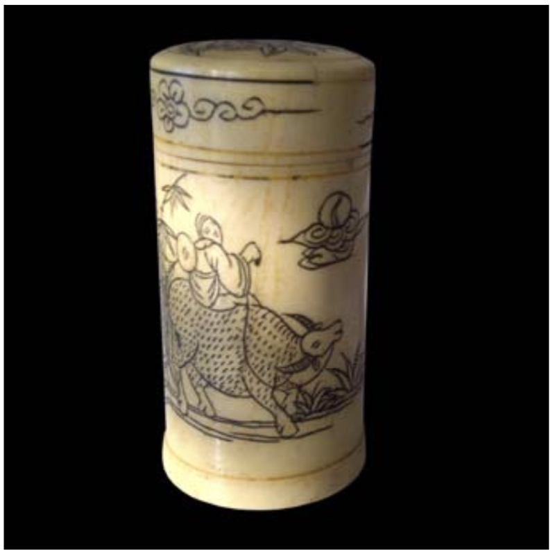

# KEY WEST

Passer, passer, passer la vague ; dépasser, dépasser, dépasser la meute ; finir sur un bruit, une ombre ou rien ; bricoler. Passage et partage, comment se construit un évènement, une décision ou un voyage ? Comment et quand décider de partir, de prendre la voiture ? D’engranger les allers et les retours et attendre les élévations de la route qui entre dans le ciel ?

Passer, passer, passer les banlieues étirées de l’US1 ; dépasser les boucles de la mémoire ; revenir dans la nuit, presque heureux. Les frontières disparaissent comme par magie, intensément volatiles devenues virtuelles, oubliée la paroi d’immeubles qui barre le front du ciel. Rouler. Nous sommes accoudés au vide des ponts qui sautent les aplats bleus de l’océan. Nous dévalons les nuages du fond du monde et, parfois, la route disparait. Ce que nous abordons est la vision ajustée au mieux de nos sentiments d’une course-poursuite avec la mer. Toutes les nuances y sont. Toute la grâce d’une décision irrévocable, d’une décision qui ne vient pas d’un choix raisonné, d’une argumentation sans faille, mais une petite décision de la vie : respirer.

Les îles ne sont pas loin qui pointillent l’eau opaline qui file sous nos yeux. Nous ne sommes que visions et scintillements de souffle filant qui exhale tout l'entour. Les sensations ne sont plus les mêmes, elles évoquent, elles suggèrent, elles effleurent, elles n’affirment rien qui ne serait déjà dans la lumière, qui serait la preuve du vaste champ aérien qui nous porte, où nous volons peut-être.

Key West est à une encablure.

***

Nous sommes dans les vents levés du Sud, qui balayent les nuages vers le haut du ciel. Il n’y a qu’un aplat bleu opalescent, vertical et désirable, enfantin. Nous entrons dans le pays dont nous rêvions et sommes balancés entre le froid et chaud.

Nous avons le choix des circonstances et le vent qui balaie la côte renforce notre détermination à les considérer comme les seules possibles. Nous arrivons à la pointe la plus éloignée des mondes que nous connaissons. On en reviendra, certes avec quelques images qui finiront pas s’effacer, mais ne s’effacera pas la vision inscrite dans notre mémoire de perspectives hallucinantes de lumière claire.

Le monde est en trois parties : avant, après, maintenant. Des siècles les séparent et seule la dernière est visible de tous les angles de vue possibles. La seule audible. Où que nous soyons dans les airs balbutiants du matin, où que nous dérivions, où que nous regardions le lot des rivages au teintes vertes ou bleues, où que nous nous tenions sur l’île la plus lointaine, c’est maintenant.

Nous avons oublié d’où nous venions et qui nous étions. Nous n’avons pas imaginé ce que serait demain et où nous serions. Seul importait le moment du départ, seule la route importait. Quand arriverions-nous ? Quand seraient épuisées les visions exacerbées de toute la lumière dans les profondeurs des vagues et des nuages à leur rencontre d’un pont à l’autre en surélévation sur la mer et la terre assemblées.

Key West est à une encablure.

***

En boucle cet acquiescement qui viendra après, au bord de la route, tellement retenu et si doux et si bas murmuré que j’en doute encore. Pris dans les bras l’un de l’autre, pris dans nos rêves d’autre chose ou d’ailleurs ou de plus tard, pourtant décidés à reprendre le voyage. Ce qui nous rapproche sur les pilotis de bois du port, ce qui nous tient dans les parfums du monde, ce qui nous attache dans les dernières couleurs du soir, ce qui revient en nous pour rester silencieux, qui arbitre nos regards, ce qui vient est attendu. En boucle trois mots

En boucle le début du monde recommence à chaque pas. A chaque pas qui nous rapproche de la fin du voyage et un à un les ponts rebouclent sur la mer, respiration après respiration dans les élévations vers le ciel, un seul ciel d’aplats bouleversés de bleu aux immenses nuages blancs, sur une chanson de Leonard Cohen _A Thousand Kisses Deep._ Nous sommes forcément à l’abri et silencieux, arrimés aux ailes d’oiseaux superstitieux qui ploient en masse et effilent les retournements, qui nous emportent.

En boucle je polaroïde et je saisis ce que je ne vois pas sur le moment, à peine un sourire ou de grands éclats de rire que je n’ai pas entendus, un regard droit, trop sérieux, trop attentif, que je comprends à présent. En boucle les photos racontent une histoire que je ne vivais pas. En boucle toute fin est proche et depuis le premier jour je t’appelle Renoir. En boucle à quels moments les routes se décroisent ?

Et traversant Key Largo vers le sud, la mer s’élève en vrille dans le bleu du ciel qui s’approche et nous happe.

Key West est à une encablure.

---

### LES DÉPENDANCES

1

Nos terrasses sont ouvertes et nos maisons sous le vent, au bord de précipices mentaux, incalculables. Alors s'en tenir aux réserves d'usage quand la parole ne suffit plus ou quand les mots roulent par devant les feux qui montent. Les feux qui dérangent les sensations. Nos pensées s'enroulent en souterrains devenus infranchissables. Les passions ne sont plus les complices de nos intentions et les songes se creusent et s'espacent sous le vent dans les hauteurs des instants perdus.

2

Nos mémoires sont des ruptures temporelles dépourvues d'attaches, de linéaments vers le fond du monde. Elles sont la fin du monde. Tous les rêves sont des défaites et les verticalités du silence ne sont jamais atteintes. Il faut des mots pour s'en approcher, les saisir et les plier aux courbes de notre mental. Tout est dans la majesté des proportions et la mort est déjà en nous, adjacente à toute émotion qui nous transcende. La production de tout langage n'est jamais aléatoire et tous les jeux entre le monde et nous sont à somme nulle. Comment connaît-on le temps ?

3

Nos paroles ne surprennent plus. Ne l'ont-elles jamais fait ? Les contretemps nous bousculent tête- bêche avec le réel qui encombre puis se délite. Les mots ne tiennent rien. Les rues, les digues, les miroirs et les lumières sont les restes de paysages qui, venant à nous, élargissaient les visions que nous en avions et donnaient du monde des allures magiciennes. Les paroles allaient avec. Nous sommes retenus dans les étages des expressions toutes faites. Terre, ciel, mer, vent sont les clichés d'un monde devenu douteux jusqu'à l'écœurement. Désarmés, oui, désarmés, renvoyés en arrière des vastes saisons, écartés du plaisir de les explorer, nous sommes des déplacés poétiques.

4

Nos solitudes ne sont pas la solitude. Ce sont de grands nuages blancs occupant une partie du ciel à la recherche d'un essoufflement ou d'un effacement. Ils sont dans l'ascendance immobile des silences qui les composent. Ainsi dérivent nos solitudes d'un bout à l'autre du visible. Et tous ces allers et tous ces retours sont les pleins et les déliés des paroles manquantes ou cachées de nos mémoires. Nous ne donnons plus le change. Mais ne l'avons-nous jamais fait ? Nous nous retirons des combats de nos vies et nous nous enfermons encore un peu plus dans ces silences immobiles qui montent lentement des terres vidées de nous-mêmes. Qu'avons-nous tant à attendre ?

5

Nos paysages sont devenus des âmes enveloppées de gris et d'or. Les jours n'y traînent plus leurs longues incidences bleues parfois tiraillées de mauve. Nous y venons - moins souvent - avec le sentiment d'avoir perdu leurs attaches et de ne plus rendre grâce aux cimaises qui les portaient haut, à bout de nos visions. Les basses terres nous sont devenues familières et nous nous accoutumons aux ombres qui cillent dans nos yeux encore ouverts. Pour de bon, pour de vrai, nous avons perdu les images indispensables à réveiller nos intuitions. Des basses terres en nous où nos colères n'ont plus de répondant, nos colères légitimes de surseoir aux accidents dits infranchissables de la vie. En étions seulement capables ? Nos tombeaux sont ouverts depuis les commencements.

6

Nos sentiments sont à la traîne, en file indienne, dépourvus des agréments dont on les avait revêtus. Ils finiront par se bousculer, rattrapés par le temps qui joue contre eux et repousse toute velléité d'arrogance au fond des mémoires grises - et mortes. Ils sont sans retour. Dans la spirale vertigineuse, vers le bas, de la mort. Nos sentiments nous dépassent, devenus inaudibles, dépourvus des attaches qu'on avait l'habitude de saisir. Non ils ne volent pas, ils ne volent plus, ils se débattent dans les vides qui s'ouvrent en nous, contre notre résistance. Nos sentiments tombent, tombent, tombent à la verticale des mots qui les portaient. Il n'y a plus de mot et la spirale se resserre.

7

Patience, patience. Nous serons délivrés de nos attentes quand seront éteintes les balises le long des rivages ou en bordure des frontières. Sans inquiétude pour cette fin des parcours sans destination. Le désir est une plainte de l'espace et non du temps. C'est un moyen de résistance. Main martelée du sculpteur, main élevée du peintre, main suspendue de l'écrivain, où sont nos Demeurants, ceux qui attendaient toujours à mille pas de nous, faisant signe pour avancer encore. Que sont-ils devenus - où résident-ils aujourd'hui - qui n'étaient pas seulement des ombres mais les jours élancés de nos rêves ? La vie tremblée les a éloignés et nous ne sommes plus capables de les voir, ni de les approcher toujours à mille pas.

---

### RENDEZ-VOUS

Ne te hâte pas. Dis leur d'attendre la nuit, cette nuit sans lune sous les étais du ciel. Habitue-les au silence, conspire avec eux, sois indiscutable, apprends-leur le maniement des quolibets et de la dérision et ne te hâte pas. Ils grappilleront dans les vergers discontinus du temps, ils seront colosses, culbuteurs libertins, criminels pour tenter de te plaire, ils seront des amants d'exil, myrmidons parmi les étoiles, fonctionnaires de la nuit, cette nuit sans ombre sous les étais du ciel.  
Ne te hâte pas. Invente-leur des ivresses insoupçonnées, des rêveries inhumaines, désarticule tous les miracles, rends les patients de ta propre patience, sois le forain de leur irritation, désapprouve les parfois d'aimer le sperme frelaté, menace de les quitter, n'accepte jamais qu'ils mendient. Ils t'excluront, abandonnés eux-mêmes, ils affirmeront qu'ils te protègent, sois leur harpie, comble leur malice d'une plus grande légèreté jusqu'à les rendre jaloux de la foudre et des chimères, du temps qui passe, des offenses dont tu leur rends grâce, célèbre leur naissance, casse leurs berceaux, rends les vigilants, ils seront tentés par tes ébauches et les masques que tu laisseras. Ils en rêveront, malgré eux. Devine leurs pensées sans les faire parler. Ils se trahissent quand ils pensent te connaître. Sans grâce et torves sont les mots qu'ils prononcent. Evite les quelques temps. Ils te seront reconnaissant de les fuir. Donne-leur à espérer plus qu'ils ne pourraient le faire. Le monde est à toi. Donne-leur du temps. Menace de les délivrer. Raconte-leur la délivrance, le calme, le sommeil mérité, le creux et le plein de la lumière dans le vide, là sur le lit de la mort.  
Evite-es encore car leur piété est insupportable. Sois leur avocat, donne-leur une place dans l'éternité même s'ils t'oublient. Les verres à vin sont les cœurs irrésolus du ciel, où les étais tiennent la lumière, rien que la lumière. Et si tu marches avec eux, ne te hâte pas.

---

### DANS CETTE ATTENTE

Dans cette attente du dernier départ, il y aura la route et le sentiment de la route. Sur cette terre, il y encore la terre, cette première terre entrevue, inassouvie. Depuis, il souffre sur la terre, il demande des témoignages et accumule les preuves de son errance.

Dans cette attente de la dernière rencontre, soudain il a conscience de surprendre un geste, d’être ce témoin inespéré. Il n’y a que l’ombre. La vie coule, portée droite sur les parois vides. Ils ne sont déjà plus là, ou il ne les voit plus, ou ils ont été absorbés par le ciel et la lumière du ciel.

Dans cette attente du dernier jour, sous les étais verticaux et les superpositions d’aplombs noirs et gris, il a noté en bas de page, l’effacement de leur parole. Trop loin pour les entendre. Revenant sur ses pas, l’ombre du mur était vide.

Dans cette attente du dernier rêve, mais le rêve n’était pas sa dernière chance, il revint sur ses pas, retrouvant sa place dans le flot qui l’entourait, tentant de saisir ces ombres furtives, mais arrêtées, comme pour finir une histoire, en trouver enfin les raisons et les places. Il s’installa dans le tourbillon du vide, à la rencontre de cette réserve qu’il décela dans leur posture immobile. Qui était immobile ? Qui passait ?

Dans cette attente d’un dernier voyage, il attendit de les revoir. Que disaient-ils ? La coursive était maintenant déserte. Il ferma les yeux, les crut plus proches. Se séparaient-ils ? Il surprit cet instant où le silence est un adieu.

Dans cette attente d’un dernier signe, au seuil de la disparition, au début de la dernière histoire, parce que la suite est décidément cachée, même s’il arpente à pas lents, pour se faire une idée, ce qui ressemble à des terrasses dressées contre des pans de lumière, il savait qu’il les perdrait. C’était elle, c’était lui.

Dans cette attente de la dernière révélation, il souhaita les croiser, peut-être pour les reconnaître. Il se déplaça encore et l’ombre portée de leur ombre s’est évanouie. Voilà la désillusion ou le regret : ce qu’il espérait d’eux n’est qu’une trace sur le rebord abrupte d’un passage entre deux mondes. Il se résigna à rebrousser chemin.

Dans cette attente de la dernière fois, sur cette terre, il y a encore la terre. Depuis il les perd à chaque fois qu’il tente, en s’écartant latéralement des chemins habituels, de les voir derrière leur ombre, mais c ‘est seulement une ombre toujours projetée sur l’ombre dans l’explosion verticale des vides sur le plein, où ils étaient, à cette distance de deux êtres qui ont tout dit, qui ne se retourneront pas, qu’il ne verra plus.

  
  ---

### QUAND LE DÉSIR EST INDÉCIS

C’est un pli sur le sable comme un livre ouvert, un pli de la mémoire bouleversée, parce que la vie n’attend pas et l’étendue à nos pieds est un débarcadère de plus sur l’avancée du ciel. Ce livre ouvert nous retient.

  
Mais nous tombons et la vie s'écrit à l'ombre des pages dans l'ombre de la vie et toutes ces pages d'une vie morcelée, les unes sur les autres, ont l'épaisseur d'une nuit froissée - une seule nuit - vide et sans plaisir.

Quand nous tombons à pages ouvertes, à pas comptés, à rives vives, quand l'histoire s'interprète dans le clair-obscur d'un livre toujours déplié, cet espace est le nôtre comme des arrangements ininterrompus d'une mémoire inventée.

Inventée, acérée, réelle, et effacée par un seul coup de la main, toujours immobile, comme enivrée par la lumière qui la porte. C'est une mécanique saillante, cette mémoire encombrée, surgit au milieu des histoires de notre vie, de la première à la dernière page, comme un début à tout.  
C'est un fait, une raison, les mots manquent, le temps a joué de ses effets, la réalité est que nous tombons encore. Nous agissons en prisonnier, éreintés par le vide qui nous attire, sans un cri. Rien ne débute, rien ne fuit, il n'y a que la chute.

Une chute en nous comme une chair passe sur une chair, une chute en nous, mais une envie ingrate de fermer le livre, de déranger encore une fois le ciel, d'oublier l'histoire. Peu importe si les pages sont blanches, les mots sont toujours là, ombres d'ombre.  
Une chute en nous comme un poing se délivre du coup qu'il porte, un effacement ajouté aux disparitions successives tout autour de nous, le livre ouvert tient ses secrets comme un livre fermé. Nous nous débarrassons trop vite du désir qui vient.

Les pages égrainent le silence, cette rumeur égorgée dans un silence plus grand qui l'absorbe, au bout de notre histoire quand le désir est indécis, quand il tombe comme une main meurtrie, cette feuille déchirée, noircie, juste avant de disparaître, à peine heurtée, dessinant l'horizon effilé d'autres désirs, encore inavoués.

L'effroi est immobile.

---

_Là se bornent à présent mes désirs. Me tenir debout en plein air et voir le ciel immense et bleu au-dessus de moi, contempler une dernière fois l’infini hurlant._

Paul Auster – _Dans le scriptorium_, 2006

Tu tombes, mais tu te relèves immédiatement, tu ne retiens pas ton souffle, tu as les gestes précis, ton visage ne laisse rien voir, tu tombes encore et encore tu te redresses, tu as passé une limite, celles des aveux qui plongent aux racines de ton être, tu vis bouleversé, tu entres dans un nouveau monde où les obstacles sont imaginaires mais tu trébuches, tu tombes cette fois plus lourdement et tu reviens meurtri, ton bras gauche a encaissé une forte secousse et cette douleur qui vient à ton esprit te laisse haletant, désemparé aussi, presque honteux, tu reprends position, tu n’as pas le choix, tu es le projectile et la cible, l’aile et l’air qui la porte, il faut y mettre la forme et dans l’entre-deux où tu avances, tu énonces les décalages qui anticipent tes pas, place tes rêves où ils doivent être, relève-toi, relève-les, mais tu tombes et tu n'as plus le choix, garde en mémoire les instants où se tenir debout ne demandait pas d'effort, place haut ce que tu veux atteindre, et d'autres pas encore qui décident de l'avenir, des horizons très proches comme des lointains voyages, tu tombes.

---

### LA SUPRISE

Toute surprise recèle une aventure comme toute aventure est une surprise. Elle lui avait dit : _Envoyez-moi une surprise... une petite surprise pour demain matin. D'accord ?_ Il pensa d'abord au bonheur de la surprise. Mais une surprise sans secret surgissant n'est plus une surprise. Faire une surprise sans dévoiler le secret de la surprise, tel était maintenant son dilemme. Prolonger le bonheur de la découverte, tel pourrait être la surprise. Il y avait bien une surprise, il la garderait cachée jusqu'à son retour, voilà ce qu'il pensait. Mais répondre à sa demande ! Comment ? En dévoilant une partie de la surprise. Un paquet cadeau est déjà une surprise, une surprise faite à la surface du papier ou de la boite qui cache la surprise. Dans la surprise, il y a deux réalités : la réalité vue et la réalité cachée. Ce que l'on reçoit, auquel on ne s'attendait pas, est déjà une part de la surprise et ce que l'on ne sait pas parce que la surprise reste intacte, indévoilée, une autre surprise comme un secret. La surprise, c'est le secret, mais un secret qui se dévoile en surface, juste en surface. La boite tient le secret en réserve pour une autre surprise. Il se demanda : _qu'attend-elle ? A-t-elle une idée de la surprise ? Pense-t-elle au secret qui charpente toute surprise ? Ou bien a-t-elle l'idée de l'aventure qu'elle aimerait vivre par surprise, dans la surprise d'un secret dévoilé ?_ Il se rappela ce mot d'André Breton : _La surprise doit être recherchée pour elle-même, inconditionnellement. Elle n'existe que dans l'intrication en un seul objet du naturel et du surnaturel_ (André Breton, L'Amour fou, 1937). Comme un dehors et un dedans. Un dehors qui cache le dedans. La surprise se révèle dans cette surface du dehors qui masque la réalité de la surprise, qui est dedans.  
Mais la surprise, c'est surgir et prendre. La surprise est tout entière contenue dans le secret soudainement dévoilé qui mène à l'étonnement, voire à l'ahurissement, comme un coup de théâtre. Et il pensa : _chaque minute qui vient est une surprise, chaque heure devant soi la promesse de sensations insoupçonnées, chaque jour à venir l'inconnu qui surgit, un éblouissement dans l'horizon._ La surprise nait du temps devant soi et le secret qui la tient est indicible qui deviendra sa raison d'être.  
Il y a bien une surprise. Il y avait pensé avant qu'elle ne le lui demande. Et qu'elle le lui demande fut une grande joie pour lui, comme la révélation d'un secret qu'ils partageaient sans le savoir. Il y a bien une surprise et elle est tout entière dans cette boite qu'il tient maintenant dans la main mais dont il ne peut ouvrir le couvercle sans en trahir le secret. Cette boite lui est destinée, elle l'ouvrira quand il la lui donnera et ce sera sa surprise. Le secret est toujours à double détente et coule dans l'entre-deux du temps qu'il faut pour le découvrir et le saisir. Telle est la surprise !

---

### TROIS LITHOGRAPHIES

1

  
Cette voix, la nuit qui vient, inachevée, voix qui saigne et qui tombe, arc-boutée sur le flanc des bruits alentours, irritée, plainte parmi les plaintes quand les grands instants de la fin du jour s’espacent et disparaissent, voix éreintée dont le rythme secoué feint de dire la souffrance, fausse voix dans le tourbillon noir du soleil qui s’efface, cette voix ramassée dans son souffle, pesante, chapardeuse de temps par l’attention qu’elle réclame, voix frappée de l’angoisse d’aller et de se fondre dans d’autres voix, voix plus libres, marcheuses du soir, promeneuses des détours et des venues d’ailleurs, voix morganatiques des désirs de la nuit, cette voix, entre toutes, plus épaisse et plus raide, astreinte à geindre infiniment, cette voix de faux-fuyant, cette illusion de se propager, cette illusion d’être écoutée, cette voix morte qui plonge dans l’ombre emporte dans sa nasse les restes d’un plaisir qui n’était pas le sien.

2

  
Tomber, soulever encore la chape du ciel, gagner et s’évader par la porte battante, blanche sur un monde révulsé, illimitée sur l’horizon qui tremble, passer à genoux, irrespectueusement à genoux, se débattre désassemblé du monde, prisonnier du réceptacle de notre disparition du ciel, tomber en droite ligne dans les coulisses de l’ombre, tomber, finir, fuser comme une poussière défaite, absorbée par le vide, le ciel est là, il joue, il attend, hérésie laiteuse qui coule dans les yeux, se relever arc-bouté aux fissures du vent, seul appui dans ce désert mouvant, impalpable ligne sur la trajectoire de la chute, c’est devant, c’est derrière, tout autour comme un dédale de gestes incontrôlés, la vie agite encore ses membres dépecés par les gifles incessantes de ces instants fugaces, à peine vécus qui éclatent en lambeaux éructés, hurlement de la chute, hurlement du néant, hurlement de la mort soudaine. La délivrance attendue s’efface, tout devant, toujours devant, la ligne est toujours droite, de prison en prison, d’un ciel à l’autre, au confluent de l’horizon et du silence nécessaire, tomber.

3

  
Dans ce voyage, un seul horizon, des tabourets noirs en enfilade, de l’espace autour de soi, des lignes de ciel pur et froid en soi, tout un inventaire de bruits, du scintillement des fauvettes aux coups saccadés et sourds d’une ville assoiffante, du fond d’elle-même comme un tambour qui monte, et derrière le mur, au-delà de la porte, des arbres à profusion, des marteaux tombés du ciel qui frappent l’air et l’enflamment, parfois une absence, de celles qui nous basculent vers le silence, jamais vraiment atteint, des rampes d’orages installés qui se répondent, instantanément, des regards, tous adjacents, des haltes fréquentes pour apaiser la soif, gagner sur l’obstacle, achever l’histoire, des murs dans les prolongements d’autres murs, une idée fixe répandue sur le sol d’où monte la poussière – jamais la lumière n’est franche dans ce halo noir – où les murs sont encore droits, plus hauts, des réceptacles pour s’endormir, dormir plus qu’il ne faut pour attendre la grande intervention du soir, dans ces abris meurtris de l’homme, mais il n’y a plus d’abri, de l’espace autour de soi, délavé jusqu’au blanc du ciel, des aigreurs en soi parce que l’horloge tourne à vide dans les vides entrelacés des heures attendues, des agencement hétéroclites de bâches et d’étais, de poutres et d’étals, des corridors d’ombre, des rêves jamais entiers, jamais finis et si peu d’étoiles et si peu de vent, des hommes constamment en marche et à la tâche, des regards déjà vides, des mains automatiques, un fil, un seul, jusqu’à la mort, si court tenu, et la rue est interminable où la lumière tombe en droit-fil du ciel.

---

### VOYAGE

Les bateaux sont les seuls voyageurs, ils caressent et ils aiment. Ils meurent. Les nœuds défaits du plaisir nous trompent. A la ligne du soleil, où les oiseaux ne se posent plus, scintilleurs infatigables, il ne reste rien, ni ombre, ni lumière. La mer n’a cure de la mémoire, elle a donné ce cœur et ce désir et nous avons admis leur légèreté, nous n’attendions aucun secours.

  
Instant défait, la nuit seulement, dans les mots, la nuit à la dérive. Instant parfait, nulle part où penser, nulle part où rêver. C’est déjà le silence. C’est enfin le silence et l’escalier noir tourne et craque, disparaît dans l’ombre, vers le bas, vers le haut, l’escalier dévalé vers la terre terrible, branle sur le vide, ailleurs à la croisée des arches, il est sans limite connue. Nous sommes accoudés au parapet du ciel. Nous avons tout arpenté. Nos terres étrangères deviennent communes, nos signes habituels, notre vie familière. Encore la nuit, encore le silence.

---

### SILENCE

Il n'y a pas de silence mais des espaces bleus presque intacts. Au-dessus de soi, parfois en soi. S'échappent des bruits, des feux, des oiseaux noirs et des saveurs revenues qui retiennent un instant l'attention. Il y aurait une vie. Il y a une vie mais on ne sait pas la comprendre. A l'angle du 8ème et 9ème block, des enfants chassent les oiseaux à coups de pierre. Le territoire est sacré.