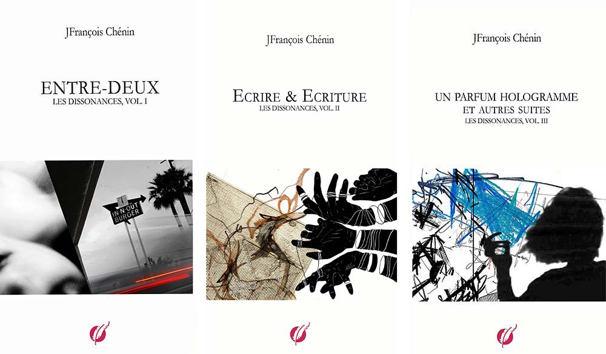

 

chez [TheBookEdition](https://www.thebookedition.com/fr/les-dissonances-p-367136.html)

*Les dissonances est composé de quatre livres dont les trois premiers ont* 
*été publiés séparément chez TheBookEdition en 2017 et 2018. La présente édition* 
*a été augmentée et réaménagée par rapport aux éditions originales. Le livre 4 -* 
*Dimension(s) clôt le cycle des Dissonances.* 

 

---

# LES DISSONANCES

## DÉDICACE

Aux artificiers du début du monde
Aux magiciens du silence
Aux nuits à deux heures du matin
Aux grands aplats bleus du ciel
Au ciel
A la résilience
Aux samedis matin jour de marché
A la pluie diluvienne et très ancienne
A la sagesse des nations
Au vide après l’amour
Au vide autour de soi les soirs de fête
Au vide d’entre les mots
Au vide des précipices
Aux grandes bibliothèques
A mes anges gardiens
Aux terrasses d’Uzès la nuit
A Louise revenue
Au détour du chemin et au pas de côté
Aux serments d’un peu trop près
Aux rimes abstraites et désabusées 
ou défaites ou oubliées
Aux rivières à gros remous qui déversent le vide 
illuminé autour d’elles
A celles et ceux qui finiront par se mélanger
Aux confesseurs de l’absolu
A la résolution au bout d’un coeur qui tombe
A la parole qui nous révèle et aux mots que nous oublions
Aux attendus de St Eustache
A cette lettre arrivée trop tard
Aux dominos de Little Havana
Au 14ème étage
A l’invention du monde
Aux parfois, aux peut-être, à toujours
Aux mains qui nous retiennent de tomber
A ceux qui nous poussent à tort et à travers et qui rient, 
qui rient, qui rient
Aux siècles derrière nous, aux siècles devant nous
A la singularité des trous noirs et des jeunes femmes

Aux souvenirs des jeunes gens et aux projets 
au long cours des vieux
A toutes celles et tous ceux qui ferment les yeux et 
rougissent et se taisent,
A Renoir que je n’oublie pas
Au Pop Art
A Pascal Quignard et Philip Glass
Au réveil matin
A la bergeronnette et l’alouette
Aux arc-boutants des cathédrales qui tiennent 
la voûte céleste
Aux hirondelles, toutes les hirondelles passées, 
présentes et d’avenir
A l’I95 du nord au sud
Aux rêves inassouvis et recommencés
Aux mots qui m’accompagnent et m’attachent Au silence retrouvé une fois dits les sentiments

## ÉCRIRE

Écrire est nécessaire, mystérieux, singulier. La page blanche n’y peut rien, seulement elle dénoue. C’est un mouvement de défragmentation, d’arrangements successifs partiels, d’un seul mouvement qui aboutit en in de page. La page est la jauge de haut en bas de la verticale des mots, dans le prolongement de leur ascension (ou de leur chute), de l’élaboration d’une attente, d’une sensation, d’un sentiment. Une tournure de mots, c’est donner forme, c’est détacher les déchets. Ecrire c’est aussi ramasser les rejets des excavations de la pensée, les assembler, en reconnaitre la nécessité. Extraire ce qui s’agrippe, solidifier ce qui (se) sépare. J’écris en marchant. Les assemblages vont au rythme des pas, à la vitesse d’un homme qui marche. Alors je recopie la mémoire de ma promenade, où je peux me poser, en bord de route, sur un muret ou un banc, à une table, au café d’en face.

J’écris avec un stylo à plume, je peux manquer d’encre, je peux aussi perdre les mots. Je dis que je m’évade. Il s’agit alors de repartir, de ragréer les événements et les mots, parfois des sentiments, plonger dans le mystère du silence de la marche. Matisse disait : _les détails diminuent la portée des lignes, ils nuisent à l'intensité émotive, nous les rejetons._ J’ai adopté cette perspective. Cependant les lignes ne sont pas grossières, elles s’effilent et sont des porteuses de heurts et de rapprochements, de flux tendus qui parfois se brisent pour donner et rebondir, où les faits indécidables prennent naissance et s’arc-boutent aux lignes qui les portent. Écrire, c’est s’acharner à créer du silence et la page défait les nœuds, les dérobe à la pugnacité de la pensée à renouer les mots avec des images, à se répéter.

Dans les abords effondrés des routes, celles des Everglades, il y a des assemblages que je n’ai trouvés nulle part ailleurs, des assemblages vivants de lumière et de vent, des réticulations d’or bleu qui sont venues jusqu’à ma mémoire, et j’ai écrit. J’ai cherché à rendre la route tangible, écrivant sur les perspectives effilées du ciel dans les peupliers et les tamariniers, par bourrasques blanches et ocres reflétées dans les miroirs kaléidoscopiques de l’eau, j’ai écrit ce sentiment dévasté d’être si peu.

Plus tard j’ai parfois renoncé à écrire. Je n’avais pas le bon stylo ou le bon carnet ou un format de papier convenable. Le renoncement était matériel et physique. J’ai accumulé les mots et leur silence dans ma tête. Je dormais mal, exerçant ma mémoire à (re)trouver les rythmes des associations contre-nature et des antagonismes. Il n’y avait alors que déambulations répétitives, agacées de couloirs interminables et d’escaliers aboutissant à des coursives aveugles, à l’à-pic de lentes vagues sombres, jusqu’à la lumière désolée et grise où je finissais, bien sûr, par dormir.

On pourrait se perdre dans la technique ou la méthode ou les deux, établir des ponts qui, en réalité, n’existent pas entre les errements de la pensée et l’écriture, entre, aussi, le rêve et l’écriture. Ecrire est l’errance. Il n’y a pas de mot dans les rêves, pas d’assemblage, pas de phrase, à peine des esquisses d’images, oui, mais rien qui pourrait être retracé dans l’écrit et avec des mots. Ce qui importe est l’espace vide entre les mots, ce silence lourd qui est la vraie dimension de l’écriture.

## TROIS OBJETS

Mes mythologies en trois lieux et ce qui en décida.

Les couleurs, à l'origine d'Albuquerque

Le pas, à l'origine d'Uzès

L'instrument, à l'origine de Saint-Eustache La fidélité est dans le jeu de pistes.

J'ouvre un nouveau cahier, arrimé à cette errance qui me va bien, de suite en suite. Pour autant, je ne veux rien sacrifier de ce qui me pousse à expliciter mieux ce que j'écris. J'ai besoin de lieux doublés d'instants tranquilles pour ré-agencer ce qui vient alors en rafale, en trombe d'états surgissants, quitte plus tard à élaguer en larges coups de ratures et de ciseaux. Je défais ce qui ne décide à rien et ne retiens rien qui ne serait pas urgent. Mais qu’elle est cette urgence ? Comment raconter le temps des distorsions ?

Je me veux errant à n'aller qu'à l'essentiel des détours qui absorbent ma pensée et cette écriture, si lente à venir, à prendre forme, est aussi errante dans sa forme et dans ses suites, qui me retourne si bien mon désir de ne pas en devenir totalement prisonnier. Je m'attache à la reconstruire. Je m'arcboute à des étais plus larges et plus hauts où je porte à incandescence les visions qui finiraient par me ronger sur place et ne laisseraient, à regret, aucune trace visible.

Alors débute le lent décloisonnement des mots. Écrire est toujours en devenir, en instance de dire, et le texte n'avance qu'à coups de sauts, parfois à reculons, dans les rapprochements et les coïncidences qu'il impose.

Les rêves ne m'enchantent plus où je suis prisonnier, mais ce détenu délétère qui m'astreint à ne plus relever ce qui me tient à cœur, même à corps défendant, contre moi-même. Je me force à déjouer les pièges d'une écriture qui ne m'écarterait pas d'images et de sentiments ressassés, sans craindre pour autant les répétitions et les retours comme une revanche à prendre. Ce que j'attends d'écrire est entièrement en devenir d'écrire, même s’il faut bien, parfois, placer, quelque part dans les blancs d'entre les mots, un point final. Ou plutôt des points provisoires de suspension.

Les suites s'entrelacent, se répondent et forment les plis successifs d'une écriture qui ne fait pas l'impasse sur les silences qui la provoquent, ni manque de devenir-là. Je ne théorise pas, j'expérimente les allers-retours de la pensée au texte mais un texte qui n'incarne pas la totalité de la pensée et qui, s'il est tentative de l'être, reste en- deçà de ce qu'elle fomente dans les plus lointains recoins de son devenir. Il y manque des mots et si je la compare à des étais lentement adossés les uns aux autres pour en estimer l'élévation et son équilibre, tant est précaire la détermination à en suivre les détours, c'est qu'il y a dans toute cathédrale un point focal où s'assemblent tous les silences retenus des mots qui n'affleurent qu'au risque, bien réel, de les perdre ou de les utiliser à contre-sens de ce qu'ils révèlent.

J'arpente en double part, tantôt accroché à la certitude que le texte répond point par point aux trajectoires que je m'impose mentalement de suivre, ou du moins rend compte des détours que consciemment je prends pour arriver à mes ins, tantôt enclin à considérer ma pensée isolément du texte qui est sensé porter la traduction réelle de ce qu'elle dessine dans les innombrables sinuosités des mots qu'elle assemble pour être et devenir car la pensée devient à partir du point où on la laisse errer même si cette errance suit ou reprend des perspectives toutes tracées, toutes volontaires, qui sont ses habitudes de réverbération.

La pensée réverbère dans le texte qui la porte, mais imparfaitement, toujours à reprendre, toujours à préciser ou à détourer de ce qui l'entrave, toujours à parfaire. Écrire, c'est assembler une pensée qui se détache des contingences matérielles de son apparition et de son expression et si, de suite en suite, comme des fragments dont on chercherait les jointoiements, elle parvient à prendre forme, à figurer une réalité ou une compréhension de ce qu'elle exprime, alors le texte approche au mieux ce tourment de la pensée à dire exactement ce qu'elle ressent, imagine et crée et projette d'inscrire à son apogée.

Il faut toujours revenir à la table d'écriture. Il en va de l'équilibre mental qui fait de la pensée une machine à explosion maîtrisée et assujettie à son rêve insensé de se matérialiser, même dans ses plus extrêmes exigences comme dans ses expressions les plus récalcitrantes ou les plus stupéfiantes. En somme elle résiste par devers nous. Écrire est lui donner les formes et les étais, les voûtes, toute élévation, les escaliers et les coursives, les passages et les déambulatoires, les ponts comme les passerelles mais aussi les frontières à franchir et les limites à dépasser qui lui manquent mais qu'elle sait cependant imaginer et construire – pour devenir.

_La table des étoiles_ (_Figures de la disparition_) est cette table d'écriture qui est la planche figurée et figurative des relations exacerbées et silencieuses des mots et de la pensée jusqu'à la figuration matérielle de leur entrelacement, où j'écrivais : Tu les verras disparaître à peine rencontrés, s'extraire de ta pensée, s'évader, jaillir nus, car tu les imagines mal s'affranchir de toi, abandonner ton ventre, tricheur d'amour. A ce prix, tu enfantes toute la lumière du monde.

Car la vie ajoute à la vie et juxtapose ce qui s'achève et ce qui nait. Nombreuses sont les ébauches que la pensée griffonne par devers soi, qui sont là, qui se dévoilent et cristallisent de nouvelles visions qui surgissent en travers de la route habituelle

## GRANDE ILLUSION

On s’attache à des visions fugaces, des lignes de haies d’arbres défilantes où le regard n’accroche pas. Ainsi va la vie, ainsi vont les nuages ramassés, noirs et soudainement désenchantés. Ainsi va le regard sur la vie, qui multiplie les lignes, les croisements et les entrelacs, qui vitupère et qui pourtant voit tout. Parfois une ligne de collines domine, un arbre parmi les autres, une branche qui crie tordue vers le ciel. Les arbres aussi s’élancent et prient. Le regard sait tout cela. Ce qu’il ne voit pas est un refus. Peu lui importe, la vie déroule ses tourments, le ciel l’accompagne avec ses liserés gris et blancs. Ce n’est plus un ciel mais un rassemblement de visions mortes qui s’accrochent entre elles, qui s’effacent Enfin les unes sous les autres. La vie est soulevée d’aspérités soyeuses.

On s’attache à des ombres, des formes furtives qui s’agglomèrent, deviennent denses et ouvrent des aspérités dans le ciel, qui resteront des feux morts que les cendres dispersées ne rallumeront pas. Ainsi va l’espérance d’une vie, une vie qui multiplie les angles de vue, d’une fenêtre ou d’un hublot, qui scrute les éléments gris-bleu du paysage, qui s’installe dans des images sans équilibre ni structure, qui tente d’en saisir le sens, au moins une direction compréhensible, qui serait un point d’appui possible de la vie. Mais le ciel est immense qui n’est qu’une vague silencieuse élancée où le regard va se perdre, en quête de souvenirs.

On s’attache au fil ténu d’une mémoire qui n’a gardé que des images à moitié effacées, une parole inaudible, une parole suspendue, un rire de surprise, une larme restée au bord de l’œil, qui n’est plus une mémoire mais un tombeau. Rien de terrible mais rien de vraiment heureux. Les visions se délitent, s’effilent le long des lignes de fuite du monde autour de soi, le monde entier était à portée de main, qui s’effondre dans les ombres sépia d’une photo tombée d’un album oublié. Toute la vie est là qui enchaine un effort de reconnaissance, un renoncement à reconnaitre et qui se satisfait d’un à-peu-près et qui ne défait plus les plis froissés de la vie.

On s’attache au bonheur en dépit des circonstances. On arrive dans l’horizon bleu pâle du silence et du froid. Le liseré est franc entre la vie et l’espérance de la vie mais nos mouvements sont indécidables, nous naviguons à vue. Il n’y a ni errance ni retournement et les visions qui s’arc-boutent à l’horizon sont indéfectibles. Nous nous rapprochons par petites touches dans la palette du peintre qui nous sert de mémoire. Nous sommes à fleur de peau d’une vie qui tente de survenir ou de rétablir ce qui était beau et agréable mais la beauté n’est pas l’essentielle ni son côté apaisant. Ce qui importe alors c’est de poser son regard, de l’arrêter, d’être le regard même sans mouvement, dans la ixité retrouvée des apparences et des couleurs de la vie. En nous les feux ré-apparaitraient.

On s’attache aux circonstances en ignorant le bonheur qui en résulterait. Nous sommes la contradiction même, une contraction exacerbée des vérités qui nous traversent, qui sont nos lignes fictionnelles et les fils irrémédiablement entrelacés de nos atermoiements. "Que ne dis-tu la vérité". Nos tergiversations auront raison du bonheur qu’on a sans doute manqué, qu’on n’a pas vu, qui était pourtant là. Qui était à notre porte. Mais la vérité n’est pas bonne à dire, elle ressasse, toute convulsée de la lumière qu’elle retient, toute charpentée des mensonges que l’on fait à soi-même. "Que ne penses-tu la vérité" dit-il.

On s’attache à des particularités. Toutes les vies qui se sont succédé et qui se succèderont ne sont pas suffisantes pour comprendre. Elles n’accumulent rien que des savoir parcellaires, rien que des manques entre les mots, rien que des incompréhensions. Il manque le il qui les tient. Il manque le sertissage habile d’une pensée qui ne reculerait pas devant le mystère, qui n’abdiquerait pas devant les vides qu’elle ne comprend pas, elle s’y plongerait. Nous n’en sommes pas là, trébuchant sur nos hésitations. Les visions restent fragmentées, dénuées de sens, d’émotion, d’amour. Nous tombons dans les vides que nous créons.

On s’attache à la grande illusion, elle est vitupérante et tient toute notre attention, elle est grande gueule et nous provoque. La mort en instance jaunit le Polaroïd, prêt à jeter ou à oublier dans le fond d’un tiroir. "Où as-tu caché tes images" et le souvenir de cette question ne ravive que des places désormais effacées, des espaces comme des conjectures improbables et balayées. On dit "être mis à l’encan". On s’est installé dans la demeure vidée des humeurs et des odeurs lassantes. Les balancelles nous bercent d’illusions. Ce qui nous enchante n’est pas revenu. Il reste les mots qui permettraient de comprendre, des mots sous-jacents qui remonteraient à la surface. Que nous pourrions attraper. Mais ils sont comme des feux follets.

On s’attache à cet abri des rêves perdus qui seraient seulement dormants ou déplacés ou trop légers. C’est le désir qui est déroutant dans les traces excessives qu’il jette à la figure, les démembrements qui le traversent, le sentiment qu’il faut aller plus loin, plus fort, plus dense. C’est la question de la chair qui s’enfonce dans l’épreuve de la densité. On s’attache à des tremblements qui remontent du fond de la vie.

On a l’illusion facile et on s’attache à des linéaments qui s’effilent dans nos visions parcellaires et contrariées. On tombe finalement, on tombe abasourdis, pas tout à fait heureux, ni tristes. Mais rien n’est vraiment réel.

_Tout va beaucoup mieux quand on est perdu dans son travail et qu’on écrit au petit bonheur la chance. On ignore où l’on est, le seul point de vue possible, c’est d’aller au-delà de soi._

Jim Harrison, _Le vieux saltimbanque_

_A ce moment là, rien de nous égale, rien ne nous dépasse._

Jacques Doillon, _Mes séances de lutte

---

## **UN PARFUM HOLLOGRAMME**

Il en restera, peut-être, une histoire d’amour, simple, presque transparente, qui a la vraisemblance de

la vérité. Les histoires d’amour même les plus authentiques ne sont pas la vérité, même pas des demi-vérités. Une histoire d’amour avec un début et une fin, un départ, un voyage, une destination pas tout à fait connue, une chute, des répétitions, une mise en scène, ce n’est ni gai ni triste, pas forcément inéluctable. Mais je vais trop vite car je ne raconterai rien de tout ça.

Elle s’appelle Natalia et la première fois qu’il l’a vue, c’est dans la perspective dédoublée de la grande bibliothèque, une porte s’ouvrait devant elle et, sans hésitation, il la devina avant qu’elle ne l’aperçut et vint vers elle. Il est possible qu’elle ait eu une petite hésitation ou une surprise ou un doute. Il ne lui a pas laissé le temps de s’égarer. Bonjour Natalia. Il l’avait vue avant qu’elle ne le voit.

Les histoires d’amour commencent rarement comme on le souhaite, elles sont subreptices et tangentielles, elles débutent à notre insu, à notre cœur défendant. Elles encombrent de leurs sursauts les perspectives qu’elles tracent pourtant entre deux êtres ou deux ombres. Je dis ombre parce qu’au bout de la perspective du vaste hall de la bibliothèque, derrière la porte vitrée, il y avait un grand soleil de fin d’après-midi et elle était, dans le contre-jour, une ombre flamboyante. Il a d’abord réagi à une ombre rousse et sans réfléchir il a pensé c’est elle. Depuis l’éternité, pensa-t-il, cette longue vie. Il l’attendait

et il était dans l’exact état d’esprit de la recevoir. Et elle est venue répondant sans arrière-pensée à son attente. Une histoire d’amour débute souvent par une attente qui s’achève et commence alors un nouvel état d’esprit. Le cerveau ne sait pas faire les choses à moitié. Natalia était là. Rien d’autre n’avait d’importance. Il se détacha du mur contre lequel il s’appuyait.

J’insiste sur les perspectives, celles qui se déplacent avec le regard et le refondent. Il n’y a pas de perspective sans regard, sans motif de déplacement, ne serait-ce qu’un pas de côté, où tourne notre vision, et les perspectives s’entre-croisent qui lui donnent sa force.

Natalia est dans la droite perspective de son désir et, à ce moment-là, même s’il ne l’a jamais vue,

il sait à quoi s’attendre. Il prit les devants, et c’est ELLE qui poussa la porte au bout de ce long et large couloir de la bibliothèque, plutôt un vaste hall transparent dans lequel s’engouffre tout le soleil finissant de cette fin de journée, elle, plus exacerbée que la lumière, qu’il a toujours imaginée, il est un instant au bord du gouffre de son désir qui pourrait le rompre si ce n’était pas elle. Ce que les histoires d’amour racontent est souvent faux.

Il avance ainsi dans des visions et des lignes de fuite qui permettent d’imaginer et de construire. Son seul choix est de s’évader le long des perspectives qui s’imposent à lui et donnent consistance à son regard. Et il n’a pas hésité, se dirigeant vers elle lui disant Bonjour Natalia comme s’ils s’étaient séparés la veille.

Natalia n’était pas disposée à le laisser entrer dans sa vie. A cet instant, à dire vrai, il n’en sait rien. Il ne se pose pas la question. Il sait seulement qu’ils se sont donnés rendez-vous, qu’ils avaient rapidement échangé au téléphone quelques semaines plutôt, sur le lieu et l’heure. Il était arrivé en avance se donnant l’occasion de dessiner les visions entrelacées dont il avait besoin pour la placer sur la ligne imaginaire qu’elle finirait par suivre réellement.

Bâtir une perspective, choisir le point focal et trouver sa place tout en imaginant la figure et l’instant de l’apparition attendue, voilà ce qui s’appelle un acte poétique. La poésie, c’est placer des lignes de fuite dans nos visions qui, sans elles, resteraient sans signification et, surtout, sans émotion.

Natalia pousse la porte vitrée qui sépare la vaste allée intérieure de la bibliothèque de l’esplanade ombragée qui entoure le bâtiment. Et, parce que le soleil s’abaisse en cette fin d’après-midi dans un étalement lumineux et chaud qui transperce toutes les parois vitrées de la grande bibliothèque, s’agite un spectacle d’ombres qui l’emporte mais parmi lesquelles il l’a immédiatement reconnue. Il finit pas avancer, tout l’éclabousse, la lumière, les ombres et les reflets, il comble toute sa vision de cet instant qui, forcément, passe.

Et il se sent heureux. Heureux d’être arrivé à ce point de son existence qu’il n’imaginait pas quand il parlait au téléphone, il y a quelques jours, à Natalia. Il n’imaginait rien qu’une rencontre professionnelle comme tant d’autres survenues ces dernières années. Mais être là dans ce feu du soleil jouant des ombres des allées et venues des passants et des ombres doucement vibrantes des arbres change sa vision. Il avait construit une ligne de fuite idéale et inespérée sur laquelle Natalia apparut.

Les histoires d’amour sont des tombeaux où disparaissent nos illusions et nos sentiments. Dans les marges où elles nous laissent exister nous perdons petit à petit notre souffle. Il nous faudrait une île, une nouvelle île, pour respirer à nouveau librement. Pour respirer tout court pensa-t-il en allant au devant de Natalia. La porte vitrée se refermait déjà derrière elle et le soleil plongeait un peu plus dans les feuillages. Il était - cette idée s’imposa - au terme de son voyage. Natalia le regarda et répondit à son bonjour _Bonjour Thomas_. Il ne décela ni mise à distance de circonstance, ni froideur professionnelle, juste une petite distraction d’une ancienne amitié éloignée mais suffisamment complice pour ne pas en rajouter. L’idée de l’île lui donna un frisson qu’un sourire effaça. Natalia entrait dans sa vie. Qu’en était-il pour elle ? Il ne put répondre à la question.

Cela prit du temps d’une relation durable entre eux, durable je veux dire qui ne s’espace pas, qui n’est pas une fois de temps en temps, dépecée et désarticulée. Natalia s’attachait aux choses pratiques pour ne pas avoir à entrer dans les sentiments.

La vision de la bibliothèque reviendra souvent quand il évoquera les premiers instants avec Natalia. Une ombre en contre-jour, flamboyante dans les perspectives soyeuses et plongeantes réverbérées sur les grandes vitres de l’esplanade intérieure de la bibliothèque. Tout se résume dans l’attente de cette silhouette poussant la porte vitrée alors qu’il se détache du mur sur lequel il a pris appui pour attendre et qu’il s’apprête à aller vers elle. Avec la certitude qu’il s’agit bien de Natalia alors qu’il ne la connait pas. Ils avaient juste échangé au téléphone.

Une histoire d’amour commence quand elle a trouvé les raisons et les moyens de sa fin. Quand elle va commencer à sombrer. Dans les yeux des amants, des regards qui s’effacent une fraction de seconde et disent l’histoire qui s’achève et l’histoire durera ce que dure un cillement de paupières.

Il avança vers Natalia sans arrière-pensée, plutôt l’idée qu’elle était l’aboutissement de son voyage, une halte désormais au long court. Très clairement - il reviendra souvent sur cette émotion primaire, comme adolescente - _il avait envie d’elle_. Envie de la voir, de la côtoyer, de marcher avec elle, toutes les envies du début d’une histoire d’amour qui ne dit pas encore son nom, tous les désirs d’une vie à deux, tous les tourments d’une fin possible.

La porte qui se ferme derrière elle le projette dans un avenir qu’il a du mal à visualiser et à formaliser. Il en est encore aux perspectives vitrées, vibrantes et chaudes de lumière qui retiennent Natalia loin de lui, comme une ombre qui tremble et pourrait s’effacer. Mais ils se rapprochent, ils savent qui est qui, c’est elle, c’est lui, _Bonjour Natalia_ et il sait qu’il restera, pas ce soir, pas demain, une autre fois, plus tard.

Elle est Natalia et la première fois qu’il l’a vue, c’est à l’entrée de la grande bibliothèque toute vitrée de ciel et de soleil au milieu des ombres scintillantes des arbres bordant les allées du bâtiment. Natalia ne l’a pas vu tout de suite et se détachant du mur sur lequel il s’était appuyé pour l’attendre, il dressa la carte mentale de ses visions tout en perspective selon des lignes de fuite qui lui étaient désormais familières. Il savait fabriquer des visions idéales de la réalité pour en apprécier les aspects fictionnels (loin du commun des mortels). Il attendait Natalia.

Il l’attendait depuis longtemps sans savoir que ce serait elle. Mais il savait qu’il l’avait croisée dans un passé très ancien qui, sans qu’il en ait vraiment conscience, était un passé de l’enfouissement de vies antérieures dont il ne savait rien. Il attendait Natalia, elle était Natalia et dans le hall intérieur tout ensoleillé de la bibliothèque en cette fin d’après-midi, il l’a reçue comme une évidence, projetée d’un passé antérieur dont il ne douta pas qu’elle était la principale, sinon la seule personne qu’il connaissait de toujours. Il s’approcha d’elle, elle ne parut pas surprise, _Bonjour Natalia_.

Il se souviendra plus tard que la réalité se construit à reculons, en remontant dans la mémoire, en accumulant des faits, voire des preuves que quelque chose a existé, qu’une rencontre était possible, s’est produite et qu’elle n’était pas fortuite. Il se souviendra de tous ces instants comme autant de Polaroïds qui se sont succédés pour devenir l’histoire d’une rencontre, une première rencontre, semble-t-il. _Bonjour Natalia_ et le reste de l’histoire est une évidence jusqu’à la fin.

Les histoires d’amour commencent où elles finissent. Elles sont d’un seul tenant sur une seule perspective de lignes. Elles n’occupent que quelques points du paysage qu’elles sont censées dessiner. Des histoires comme des lignes de points où chaque point finira par s’effacer. Usure du regard ou usure des mots, disgrâce de la vision ou effondrement de la parole. Elle entre dans la lumière enflammée de rayons de la grande bibliothèque. il la devine MAIS il la voit se détacher de la lumière qui irise autour d’elle, elle est ce feu mouvant qui restera son repère définitif.

Je sais le côté indécidable de tout cela. C’est la raison de l’écriture, sa fonction première : entrer dans l’in-démontré et l’irréfutable. Et à la jonction de la réalité et de la fiction s’écrit l’histoire. Natalia est dans cet intervalle qui se referme quand elle entre dans la grande bibliothèque. Elle ne l’a pas encore vu et lui l’a déjà reconnue.

## **TROIS MOMENTS**

Entre nous les apparences persistent, frauduleuses, intempérantes et, sous les signes que nous échangeons, de bas signes, se cachent des voix qui tentent l'impossible : se reprendre. Mais ces voix sont les nôtres, tout abasourdies de ce qu'elles taisent. Présomption d'innocence, courte présomption qui précipitera notre chute. Viendront d'autres signes - des mots, des gestes, des emballements, des atermoiements - et d'autres voix qui nous rendront justice de nos erreurs car nous nous sommes trop souvent défiés, en pure machination qui tourne à vide.

Sortons vite prendre un coup de frais, écouter le piano versatile de Monk, sortons vite !

---

A la première heure, à la première incartade qui nous séparera, dans les premiers rayons du jour que nous partagerons malgré tout, où serons-nous ? Quel sera le prix à payer pour ce voyage décidé il y a si longtemps ? Au début de l’histoire. Nous ne reviendrons pas dans les mêmes lieux et nous aurons déjà oublié ce qui nous rapprochait. Nous marchions très silencieusement. Où serons-nous pour penser nous affranchir l’un de l’autre, sans conséquence ? Et si nous revenions ? Comment en parler ? A la première heure de la fin. Aux incartades que nous taisons, forcément. Cette photo rassemblée, nous n’y étions pas, nous pensions que cela n’avait pas d’importance. Telle était la chanson. Choix de l’instrument, couleurs prélevées sur le ciel, agencement des derniers rêves, répétition de gestes prudents, voilà ce qui en resterait. Forcément nous ne reviendrons pas de tous. Où serons-nous ? 

Désobligés et la lumière venue qui tombe à flan de ciel. Nous ne voyons rien, enfouis dans nos visions fermées et noires. Où serons-nous pour désirer poursuivre ce voyage ? Il y a des creux qu’on n’évite pas. Des sentiments acerbes qui défigurent. Nous n’étions pas ensemble sur la photo et pourtant nous marchions côte à côte au risque d’atermoiements déchirants. Les voyages vrillent notre esprit, nos regards en tornades sèches. Nous sommes démembrés. La vie se résume à des morceaux de visions dérisoires. Où serons-nous pour nous plaindre ainsi, incapable d’achever ce voyage, de lui trouver de bonnes raisons ? A la première heure de toutes les vies qui suivront reviendra cette mémoire du voyage inachevé. Présomption d’innocence pourtant.

---

Je me souviens. J'ai aimé ce temps chapardé ensemble et c'était comme une première fois à chaque rencontre. Pouvions-nous imaginer un meilleur endroit pour nous accorder du temps l'un à l'autre, pour prendre le temps ? Pouvions-nous imaginer un centre du monde aussi parfait ? Et cette lourde porte que l'on fermait devant nous, aurions-nous pu l'imaginer être le seuil de notre rencontre ? Cette porte fermée chaque soir pour que le monde reste monde. On ne peut entrer où les dieux ont élu domicile, où ils viennent mourir. Et si la porte reste ouverte, alors il faut craindre pour la nuit et le repos des hommes. Et ceux qui accourent pour assister à la fermeture de cette porte contribuent à l'enfermement de leur peur, craignant qu'une porte encore entr'ouverte laisse filer l'objet même de leur croyance, ces dieux qu'ils portent au bout de leurs regards et qu'ils asservissent dans leurs mains jointes à leur pauvre dessein de survivre sans encombre, libérés des doutes et des mystères de leur propre vie. Je dis "ces dieux" car j'imagine mal qu'ils puissent être un seul. C'est à quoi je pensais - j'avais mal au dos et je manquais de souffle - quand nous étions assis à regarder, nous aussi, la porte qui était rabattue sur l'ombre pleine d'ombres et qui n'est jamais tout à fait la nuit. Et cette échelle ! A peine un escabeau pour atteindre le ciel ! Un marche-pied suffit pour enfermer à double tour la passion humaine. J'imagine que les dieux doivent rire. Nous rions avec eux. Et les dieux rient de tout. Ils ne se prennent pas au sérieux. Forcément, ils ont le temps pour eux, leur patience à nous supporter a l'éternité devant elle. Où nous donner rendez-vous qui nous rappellerait cette enclave du centre du monde où nous avons commencé à aimer ? Sous la Tour Eiffel, Place de l'Opéra, Place des Ternes, Place des Victoires ? Devant le Panthéon, près du soldat inconnu ? Sur les quais, mais lequel ? Au Trocadéro, au Jardin du Luxembourg, au Palais-Royal ? Au Train Bleu Gare de Lyon ? A la Bastille, à Denfert près du lion ? Au métro Les Halles, mais quelle sortie, on s'y perdrait ? A Rennes, A Mabillon (fermée la nuit), à Odéon ? Ou à la Cité Centre du Monde ? Quel est ta place préférée, le point de vue qui te conviendrait ? Les bords du Canal St Martin, l'esplanade de la Défense ? Les hauteurs de Montmartre (mais alors très tôt le matin), la rue des Petits Carreaux ? Les jardins du Musée Rodin, la rue de Bourgogne, les colonnes de Buren ? Où t'imaginer ? Rue Serpente, rue d'Ankara, rue de la Moselle ? Rue Le Peletier devant le restaurant Le Chenin ? Et si c'était devant Saint-Eustache ? Nous aurions alors le temps de partager une autre soirée et, te prenant par le bras, nous pourrions, tranquillement, en nous promenant, attendre que la porte du Saint Sépulcre, là-bas, soit fermée mettant les dieux à l'abri dans leur tombeau, pour profiter de cette nouvelle nuit.

---

