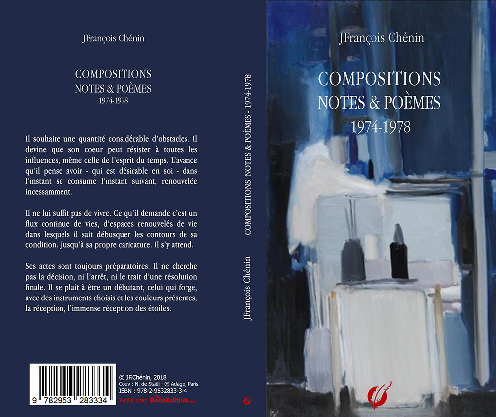
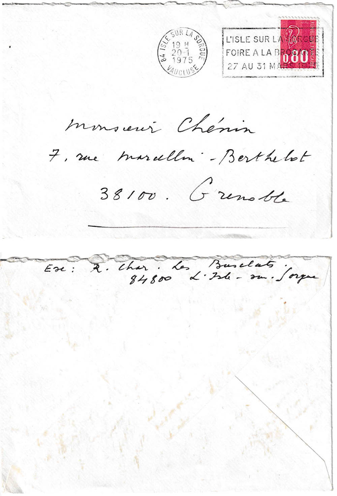
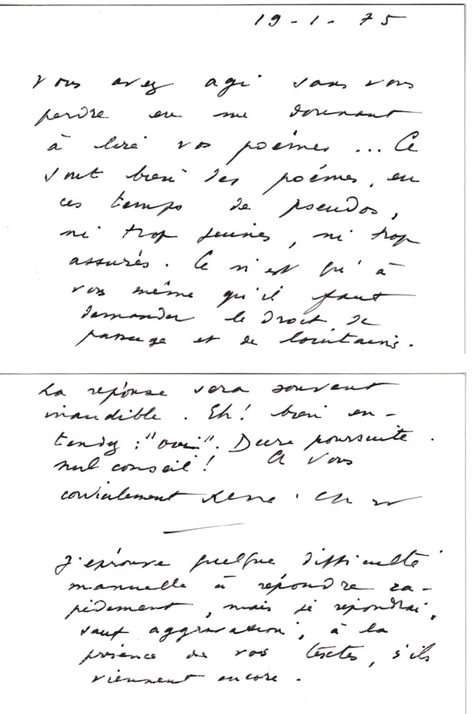

# COMPOSITIONS, NOTES & POÈMES
 

Chez [TheBookEdition](https://www.thebookedition.com/fr/recherche?controller=search&orderby=reference&orderway=desc&search_query=chenin&p=2)

*compositions, notes et poèmes*, publiés en 2018, regroupe des textes écrits entre 1974-1978
*Vivaldi - Composition pour un été* (1974),
*Envoûtement de l’atelier - Notes pour un visage de Nicolas de Staël* (1975)
*Uzès Devenue - Composition pour un Midi Sonnant* (1974),
*Cathédrale* (1974)
*La fenêtre majeure* (1975),
*L’âge illicite* (1975),
*L’été, la mer - Composition pour un enfantement* suivi de *Notes et poèmes pour l’été, la mer* (1976)
*La porte battante ou une mémoire éventuelle* (1975-1978)
*La nuit et la répétition* (1978)

---

À B.G.J.C
qui saura, après toutes ces années, ce que je lui dois.
 
*

MA TOUTE TERRE, COMME UN OISEAU CHANGÉ EN FRUIT DANS UN ARBRE ÉTERNEL, JE SUIS À TOI.(René Char)
 
*

ÉCRIRE N’EST PAS DÉCRIRE. PEINDRE N’EST PAS DÉPEINDRE. LA VRAISEMBLANCE N’EST QUE TROMPE-L’ŒIL. (Georges Braque)
 
*

L'ESPACE PICTURAL EST UN MUR MAIS TOUS LES OISEAUX DU MONDE Y VOLENT LIBREMENT. À TOUTES PROFONDEURS.(Nicolas de Staël)

## POSTFACE TARDIVE

Est-on encore chez soi dans les poèmes d’avant, cette écriture qui posait les jalons de la route à venir ?

J’emprunte à René Char une exergue de ce volume de textes écrits entre 1974 et 1978. J’aurai mis quarante ans à les considérer comme une part substantielle de mon travail d’écrivain, les ayant, une fois écrits, remisés au fond d’une valise qui, je le note maintenant, a été de tous les voyages qui m’ont mené d’Israël en Inde, des Etats-Unis au Pakistan. Ils portent, à mon sens, les imperfections des débuts.
Je leur reconnais, cependant, une "maturité" (au regard de mon écriture actuelle) que j’explique mal, qui m’échappe encore, sans jamais avoir eu la tentation d’y revenir pour les "ré-écrire".
Je renverse les phrases, j’alterne lignes froides et lignes chaudes, dures et tendres, claires et sombres, usant d’inversions soudaines et d’arrêts brutaux où j’articule sur des ruptures des enjambements vers d’autres ruptures. J’accroche, souvent au détriment de la fluidité, des retournements, en miroir, à des agencements souvent improbables, quelques  fois impossibles. je m’enfonce parfois dans un hermétisme (que l’on me reprochera) dont je sortirai en 1978 après L’exigence maintenue (inédit pour l’instant) et, plus sûrement, avec Quentin et Nous voilà rencontrés, la terre et nous (in Figures de la disparition).
Je ne serai pas quitte pour autant avec l’hermétisme et ses avatars et beaucoup d’éditeurs patentés de la place parisienne et quelques-uns de province me feront comprendre que, ne pouvant me coller dans un genre, ils ne pouvaient me publier. Je les en remercie. Ils m’ont permis, tout au long de ces années, d’articuler mon écriture autour de “suites” - Bach et P. Glass y sont pour quelque chose - qui rendent compte des allers-retours internes aux textes et entre eux qui sont élaborés ainsi.
Et si je m’adosse à René Char, c’est que, aussi, je lui dois une partie de mes choix tant il domine, à l’époque, mes réflexions sur l’écriture et la poésie ainsi que sur la direction que prennent mes écrits. Je lui adresse alors quelques textes. il me répondra sous la forme d’un encouragement qui me guide encore : "Ce n’est qu’à vous-même qu’il faut demander le droit de passage et de lointains. La réponse sera souvent inaudible. Eh ! bien entendez : "oui". Dure poursuite, nul conseil !" 
 

 

Je ne tourne pas en rond pour autant. Entre 1974 et 1978, je n’en suis pas là de ma réflexion sur la poésie. J’écris beaucoup, j’expérimente tout azimut et sans aller plus loin dans la théorisation de l’écriture poétique (que j’entreprends à l’époque et que je poursuis encore aujourd’hui), je pense alors possible “le poème” comme "valeur d’échange". J’en écris (l’âge illicite, la fenêtre majeure) et je tente, à travers “les compositions” de lier poésie et essai d’expression picturale en décomposant la syntaxe très classique des versets poétiques, comme des coups de pinceau ajoutent de l’épaisseur à d’autres coups de pinceau. *Vivaldi, Uzès devenue, Cathédrale et L’été, la mer* sont de cette veine. Expérimentant l’immédiateté sensitive ou émotionnelle (apparente) de la peinture (Nicolas de Staël en particulier), je pense, grâce à des chevauchements "désyntaxisés", retrouver les grands aplats de couleur de tableaux qui m’attirent particulièrement. La répétition de ces chevauchements et des ruptures qu’ils provoquent (dans la forme et le sens) m’apparaissent alors comme "l’essence" d’une poésie de "la sensation".
Je laisserai ces premiers écrits qui, comme je l’ai dit plus haut, resteront enfermés dans une valise durant quarante années. Reprenant langue avec eux, d’abord je ne m’y reconnais pas, puis les lisant comme on lit un auteur que l’on découvre - avec méfiance cependant -, je tente d’en analyser les faiblesses et les travers. Trop près ou trop loin de mon sujet, je m’attache plutôt, dans “les compositions”, à dévaler des pentes dont j’estime mal les degrés et je trébuche ou je plonge parfois de bien haut sans conclure. C’est un défaut assez général qui me fait reprendre et reprendre les mêmes arguments, mais je n’avance pas. Il me semble que je dégringole et pourtant rien n’a vraiment bougé, si ce n’est que je m’égare et ai bien du mal à retrouver ma route. Pour les poèmes, ils sont classiques, comme des petits états d’âme posés là sans grande armature pour les soutenir. Je publie ces textes aujourd’hui.
Je les publie parce qu’il sont "mes débuts". Pas vraiment cependant si je veux être tout à fait honnête car précédemment à ces textes j’ai commis beaucoup d’autres poèmes (plutôt aphoristiques) et quelques pièces de théâtre, animé que j’étais par une veine qui s’apparentait au “drame de l’absurde” incarné, paradoxalement, par des personnages totalement désincarnés, voir absents de la tragédie qu’ils/elles vivent. Mais n’est-ce pas une des dimensions de la pensée de l’absurde que de valoriser des caractères désincarnés sous prétexte d’universalité du propos ? Autant dire que ces pièces sont d’un ennui terrible, il ne s’y passe rien sinon un dialogue "oui/non/peut-être" entre des personnages qui doutent de tout sauf des “vérités" condescendantes qu’ils assènent dans un langage si limité et si dénudé que l’on comprend dès la première scène que rien d’important ou de vital n’arrivera d’ici la fin. Ça finit comme ça commence. Aucune émotion là-dedans.
Les textes qui composent le présent volume, je peux donc les considérer comme "mes débuts" d’écrivain et, loin de les renier, je revendique une paternité compréhensive. Ils ont été les prolégomènes à l’exercice de l’écriture telle que je le pratique maintenant. Entre les “compositions”, les poèmes et  les premières “suites” en prose (la porte battante, la nuit et la répétition), j’expérimente alors plusieurs formes poétiques qui, pour certaines, m’éloigneront durablement de la poésie, à juste raison dois-je dire, tant la poésie contemporaine m’apparait desséchée et desséchante, comme sans peau ni étoffe, hormis quelques exceptions. Et je ne souhaitais pas en faire partie. Et qui, pour d’autres, préfigureront mes choix scripturaux. Pour sûr, certains de ces textes, comme Uzès devenue ou les poèmes-suites de la fenêtre majeure, reviendront dans les écrits futurs tant ils devancent des formes et des thèmes qui sont devenus récurrents dans les “suites” d’aujourd’hui.
*Granville, 1er mai 2018*

---

## ENVOÛTEMENT DE L’ATELIER
Notes pour un visage de Nicolas de Staël

Ménerbes d’éclats. Pays d’empreintes où tout fait effort. Atteindre le reflet quand apprendre c’est palpiter. Puis la maison, nouveau piège. Rire, rire bruyant, envoûtement de l’atelier. Ultime fenêtre quand la masse d’air fuse au secret. Vent et vers la vague où un visage se tournera et tournera encore.

*

A Ménerbes existent ceux avec lesquels nous vivrons. Sans descendance.

*

Cette terre est un oiseau ordonné et extrême. Pulsation du nuage, haute maison.

*

Ordre ignoré qui n’est que pressenti, dans l’indispensable marche au paysage d’Honfleur. La forme nous submerge. Place d’une maison dessinée où le suicide serait ma mémoire.
ENVOÛTEMENT DE L’ATELIER
Ménerbes intransigeante
Etoffe rouge au balcon de minuit, délivrée de l’oiseau large - sans la souffrance baladée dans la lumière et le lent balancement de l’âge - Des doutes ?

*

L’âge nous encombre dans son décor comme un cheminement. Trace blanche de la route d’Uzès.

*

Cyprès de Fiesole où l’ordre nait plein consumé et définit mesure et démesure dans le pressentiment du masque. La muraille ne se laisse pas enfreindre alors même que Fiesole s’attarde au creux précipité de la réalité. Elle s’irise.

*

La gerbe et le creux de l’épaule des chimères, comme une position de l’altérité.

*

Ménerbes intransigeante
Atelier bleu de vide et d’effort. L’imprévisible du tableau, cet effort de la plénitude. Tension. Tension magistrale des gestes arrondis.

*

Atelier bleu de lumière en palette d’encre quand la vasque naturelle est l’accident. Puis j’ai visité Cathédrale. Ligne majeure de celui qui nous précéda. Qui nous grandira dans l’atelier.

*

Composition sur fond blanc
Magique et muet ou chimère pour un souvenir d’aujourd’hui. C’est dans l’intérieur qu’un miroir le rapproche, le mutisme quand son visage revient du soleil. Etage de l’enfance dans les combles des gravas.

*

Minutieuse voltige
Cette épaisseur de la déchirure, noire contre noire, atteinte précisément et voltige unique quand Nicolas de Staël eut l’idée de la route d’Uzès. Pourtant un seuil de pluie obstruait la rencontre.

*

Angoisse pour cet amour violé. Dans le trait imperceptible l’autre se contracte. S’effacerait ?

*

Définitivement le cœur  n’a pas d’obstacle. Il s’aventure en avant de l’existence. Il y a cette insécurité où Fiesole s’oppose.

*

Jeu de l’empreinte face au Havre. Quand il s’efface la voltige le fait ployer. En le cernant.
Evidence obligeante, toute inventée.
 
*

Minutieuse voltige
Agrigente hostile au trait constant. Valeur nue et attouchement de l’essaim quand il s’agit de dire. Agrigente s’abaisse dans la magie et jaillit première par angoisse. Agrigente est exil.

*

S’efforcer à la terrasse du paysage. Dans l’oubli et l’opposition.

*

Nu gris chargé de signes. Cerne du désir dans notre mémoire qui saura demeurer sans nous retenir. Variations qu’un palais n’abrita jamais. Signes et secousses.

*

Comme un étranger d’habitude dans l’isthme de la lumière.
Signifier le modèle
Le repas est fini. Nous partageons le trait fulgurant de son nom. Le mur se propage.

*

Altérité du mythe, tout à l’encontre.

*

Clarté peut-être saigne. Croyance du cyprès : 
se défendre, déplacer le théâtre, juger après.

*

Un sens (ou un être) extravagant qu’il fallait étouffer dans le port d’Antibes. Rayon de terre, ventre au sens exalté. Retour à Cathédrale.

*

Il n’oublie pas l’avenir. Un point final n’est qu’en avant, déterritorialisation et décontextualisation.

*

Se détourner de l’acte invalide. Dans l’instant intolérable effleurement d’un silence essentiel, emboutir le présent, s’adjuger le rire, rire.

*

L’arche de midi est un équilibre, inerte à l’excès dans la chaire ou vif vraiment. Sur un mur.

*

Figure nue du paysage : Honfleur. Libérer le mythe du cercle des gerçures. La cave préside la montée du froid, du fond du monde. Instances partagées et délibérantes.

*

Evolution magique de la pierre, de siècle en siècle. J’ai senti sa mort dans ma main fugueuse.
Syracuse fait signe dans l’atelier.
 
*

L’avance du visage
Ivresse au cœur  de nacre. Alors découvrir, à l’éveil du vivre, un visage de plein-ciel.

*

Un paysage cassé aux branches des instincts irréels. Composition sur fond gris. Composition des devantures magiques.

*

Miroir dallé d’Agrigente et s’accoupler dans le vide lumineux. Etre ce compagnon de voyage. La lucidité éveille la transparence - et la mort, hautaine. 

*

Le désordre sur la table comme un bruit immobile. Se déchirer du sommeil. Obtenir plus, saisir la palette du peintre.

*

Ciel à Honfleur
Etre de plain-pied dans ce chant et traverser ce ciel. Entre l’hésitation et l’autorité, tout l’effort d’Agrigente. Entière dans l’humain, entière elle taille le hasard et le conforte point par point.

*

Cette Bouche de craie à laquelle nous ne croyons plus. En arrachant ce que nous croyons vivre, nous nous emplissons de lumière vivante, contre l’évanouissement. La saison se rassemble. Le chenal de Gravelines retient son souffle.

*

Où pénètre renversée cette ligne étrangère ?
Partage engorgé - Les aplats de Fiesole.
Rayons de l’inconnu en soi.
C’était l’amorce d’une résurrection.

*

Je pensais qu’il y avait dans toute signification une fièvre indicible, un arpentage invisible, une chose encore cachée. Le cristal n’exige plus le secret mais le silence du soleil quand le pays géant projette dans ses voilures l’ultime accusation - en souvenance des ouvrages disparus.

*

La barque
Plage fermée à l’inégal au dégradé. Est-ce l’intention ? Elle est posée et maladroite mais réelle, suffisamment charpentée pour résister au soleil défenestrant. 

*

Immensément contre l’étendue le lent vol du papillon jamais admis au glissement précieux.
Altération masquée du reflet.

*

Ou : Immense, attendu, glissant contre l’étendue, le lent vol du papillon jamais admis à la rupture précieuse des vents contraires. Altération masquée du reflet.

*

Et votre écorce
Et l’aubier au milieu de la chair
En rupture
Qui recherche sa place, son accroche
Tout le resserrement que cela oblique A peine la lumière
Et c’est la transparence.

*

Toi-même
Prismatique du dernier chant 
Sans vouloir vraiment naitre 
Tout en naissant.

*

Brèche du ciel. Impertinence. Le récit est daté d’une lumière nécessaire, venue de loin et son premier portrait laisse entrevoir l’ascendance du partage.

*

Cathédrale n’oublie jamais qu’elle est nommée. qu’elle est une pulsation de tous les âges, de toutes les renommées. Les natures mortes ne suffisent plus.

*

La fragilité est vivante
Plus qu’une découverte
Une fragilité d’étoffe
Un regain opalin
Grisé d’ombre et de fusain
Sans ornementation
Dans le désir qui la pénètre

*

Investir l’informe, le déformer. A l’origine, il y a une torpeur indicible. Seule la lumière sauve et fait grandir.

*

Nicolas de Staël nous accuse en fulgurance.

*

Nous existons à peine. Lui souffle et tire de ses poumons l’extrême illusion et les particularités insistantes de la réalité. Juste quand il s’agit de débucher la mort.

*

L’offrande de l’âge dans cette place imprévue de l’âge. Offrir sans compter, juste offrir. Nulle mesure du souffle contrarié mais libre, encore libre et à son avantage.
 
*

Paysage avec maison
Jeux décuplés et tournants d’Agrigente et de Syracuse comme un prisme possessif et fragile de l’humanité. Un jeu d’été et de remémoration. Un jeu à vie.

*

Je te devine visage emporté quand le ciel nidifie ton sourire et sa clarté, quand la saison n’est qu’un vaste principe. Je te devine contre le vide soutenu par la lumière qui frappe droit tout son ordre. Je t’approche sincérité excessive. 