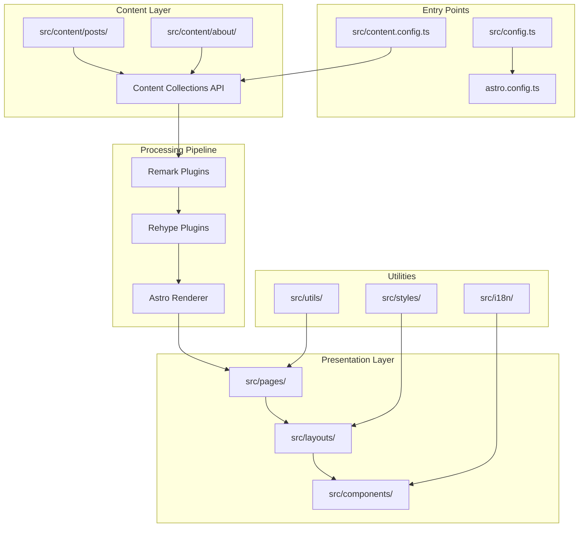
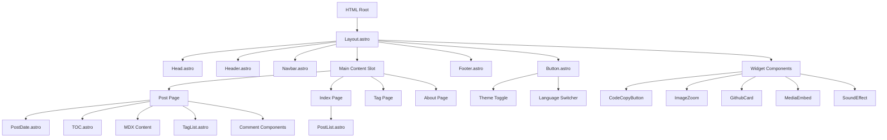
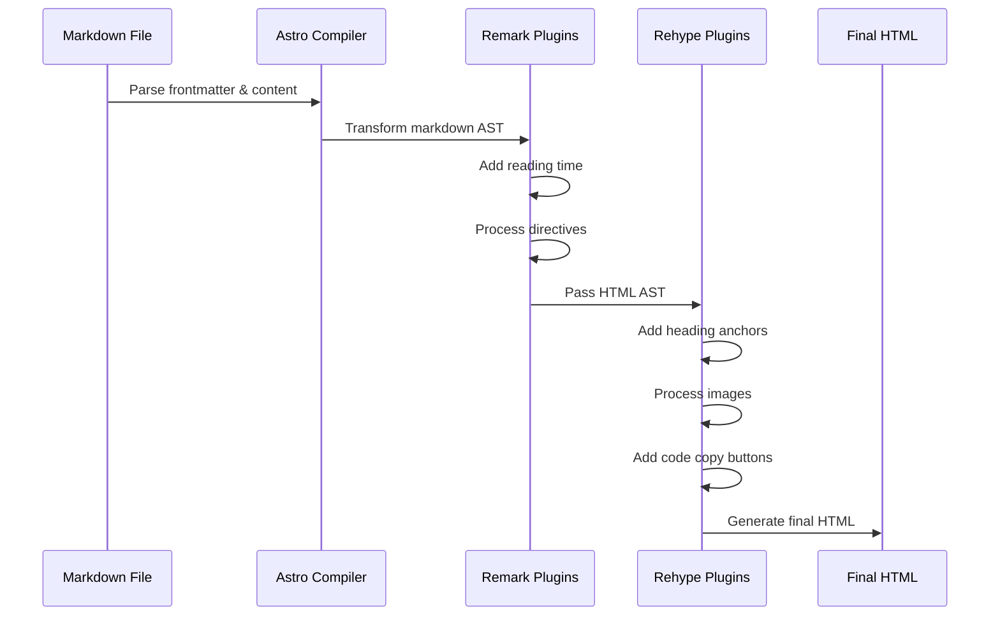
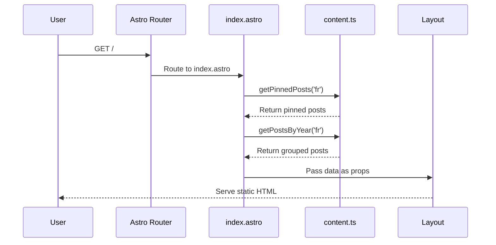

# Retypeset Blog - Code Base Explanation

**Version:** 1.0.0
**Framework:** Astro 5.16.4
**Current Configuration:** French-only blog (simplified from multi-language)

---

## Table of Contents

1. [Overview](#overview)
2. [Project Architecture](#project-architecture)
3. [Directory Structure](#directory-structure)
4. [Key Components & Modules](#key-components--modules)
5. [Content Management System](#content-management-system)
6. [Routing & i18n System](#routing--i18n-system)
7. [Data Flow & Processing](#data-flow--processing)
8. [Architecture Diagrams](#architecture-diagrams)
9. [Key Workflows](#key-workflows)
10. [Tutorial: Renaming "Posts" to "DRKNSS" and Adding "EM" Category](#tutorial-renaming-posts-to-drknss-and-adding-em-category)

---

## Overview

Retypeset is a static blog theme built on the [Astro](https://astro.build/) framework, designed to deliver a typography-focused reading experience reminiscent of printed books. The codebase emphasizes:

- **Static Site Generation (SSG)**: All pages are pre-rendered at build time
- **Content Collections**: Type-safe content management using Astro's Content Collections API
- **Markdown/MDX Support**: Rich content authoring with extended markdown features
- **Theme Customization**: Comprehensive configuration through `src/config.ts`
- **Performance**: Optimized fonts, images, and code splitting
- **Extensibility**: Plugin-based markdown processing pipeline

### Technology Stack

- **Core Framework**: Astro 5.16.4
- **Styling**: UnoCSS (atomic CSS engine)
- **Content**: Markdown/MDX with Remark/Rehype plugins
- **Math Rendering**: KaTeX
- **Diagrams**: Mermaid
- **Typography**: Custom web fonts (Inter, Bricolage Grotesque)
- **Analytics**: Umami, Google Analytics support
- **Comments**: Giscus, Twikoo, Waline support

---

## Project Architecture

### High-Level Architecture



### Component Hierarchy



---

## Directory Structure

```
src/
├── assets/              # Static assets (images, icons, SVGs)
├── components/          # Reusable UI components
│   ├── Comment/         # Comment system integrations (Giscus, Twikoo, Waline)
│   ├── Widgets/         # Interactive widgets (TOC, CodeCopy, ImageZoom, etc.)
│   ├── Button.astro     # Theme toggle & language switcher
│   ├── Footer.astro     # Site footer with links
│   ├── Header.astro     # Site header with title/subtitle
│   ├── Navbar.astro     # Navigation menu
│   ├── PostDate.astro   # Post metadata display
│   ├── PostList.astro   # List of posts with grouping
│   └── TagList.astro    # Tag cloud/list display
├── content/             # Content collections (type-safe markdown)
│   ├── posts/           # Blog posts organized in folders
│   │   ├── _images/     # Post images
│   │   ├── examples/    # Example posts
│   │   └── guides/      # Guide posts
│   └── about/           # About page content
├── i18n/                # Internationalization
│   ├── config.ts        # Language map & comment system locales
│   ├── lang.ts          # Language detection & routing utilities
│   ├── path.ts          # Localized path generation
│   └── ui.ts            # Translated UI strings
├── layouts/             # Page layouts
│   ├── Head.astro       # HTML head with meta tags, fonts, analytics
│   └── Layout.astro     # Main page layout wrapper
├── pages/               # Astro pages (file-based routing)
│   ├── [...lang]/       # Language-specific routes
│   │   ├── posts/       # Post detail pages
│   │   ├── tags/        # Tag pages
│   │   ├── about.astro  # About page
│   │   ├── index.astro  # Homepage
│   │   ├── atom.xml.ts  # Atom feed
│   │   └── rss.xml.ts   # RSS feed
│   ├── og/              # Open Graph image generation
│   ├── 404.astro        # 404 error page
│   └── robots.txt.ts    # Robots.txt generation
├── plugins/             # Custom Remark/Rehype plugins
│   ├── remark-*.mjs     # Markdown processing (directives, reading time)
│   └── rehype-*.mjs     # HTML processing (links, images, code, headings)
├── styles/              # Global CSS files
│   ├── global.css       # Base styles & CSS variables
│   ├── markdown.css     # Markdown content styling
│   ├── font.css         # Font definitions
│   ├── transition.css   # View transitions
│   ├── extension.css    # Extended markdown features
│   ├── comment.css      # Comment system styles
│   └── lqip.css         # Low-quality image placeholders
├── types/               # TypeScript type definitions
│   └── index.d.ts       # Post, ThemeConfig types
├── utils/               # Utility functions
│   ├── cache.ts         # Memoization utilities
│   ├── content.ts       # Content fetching & filtering
│   ├── description.ts   # Post description extraction
│   ├── feed.ts          # RSS/Atom feed generation
│   └── page.ts          # Page type detection & routing helpers
├── config.ts            # Main theme configuration
├── content.config.ts    # Content collections schema
└── env.d.ts             # TypeScript environment types
```

---

## Key Components & Modules

### 1. Configuration System (`src/config.ts`)

**Purpose**: Central configuration for the entire blog theme.

**Key Sections**:
- `site`: Site metadata (title, URL, author, favicon)
- `color`: Theme colors for light/dark modes
- `global`: Global settings (locale, fonts, date format, features)
- `comment`: Comment system configuration
- `seo`: SEO & analytics settings
- `footer`: Footer links and copyright
- `preload`: Performance optimization settings

**Current State**: Configured for French-only (`locale: 'fr'`, `moreLocales: []`)

### 2. Content Collections (`src/content.config.ts`)

**Purpose**: Define type-safe content schemas using Zod validation.

**Collections**:

#### `posts` Collection
- **Schema Fields**:
  - `title` (required): Post title
  - `published` (required): Publication date
  - `description` (optional): Post excerpt
  - `updated` (optional): Last update date
  - `tags` (optional): Array of tag strings
  - `draft` (optional): Draft status (hidden in production)
  - `pin` (optional): Pin priority (0-99, higher = top position)
  - `toc` (optional): Enable/disable table of contents
  - `lang` (optional): Language code for this post
  - `abbrlink` (optional): Custom URL slug (lowercase, numbers, hyphens only)

#### `about` Collection
- **Schema Fields**:
  - `lang` (optional): Language code for about page

**Usage**: Content is automatically validated against these schemas at build time.

### 3. Content Utilities (`src/utils/content.ts`)

**Purpose**: Centralized content fetching, filtering, and processing.

**Key Functions**:

| Function | Purpose | Returns |
|----------|---------|---------|
| `getPosts(lang?)` | Get all posts for a language | `Post[]` (sorted by date) |
| `getRegularPosts(lang?)` | Get non-pinned posts | `Post[]` |
| `getPinnedPosts(lang?)` | Get pinned posts | `Post[]` (sorted by pin value) |
| `getPostsByYear(lang?)` | Group posts by year | `Map<number, Post[]>` |
| `getPostsGroupByTags(lang?)` | Group posts by tags | `Map<string, Post[]>` |
| `getAllTags(lang?)` | Get all tags sorted by count | `string[]` |
| `getPostsByTag(tag, lang?)` | Get posts with specific tag | `Post[]` |
| `getTagSupportedLangs(tag)` | Get languages supporting a tag | `Language[]` |
| `checkPostSlugDuplication(posts)` | Validate unique slugs | `string[]` (errors) |

**Key Features**:
- **Memoization**: All functions are memoized to prevent redundant processing
- **Language Filtering**: Posts can be language-specific or universal (`lang: ''`)
- **Draft Handling**: Drafts shown in dev mode only
- **Metadata Enhancement**: Adds reading time via remark plugin

### 4. Page Utilities (`src/utils/page.ts`)

**Purpose**: Detect page types and provide routing helpers.

**Key Functions**:
- `isHomePage(path)`: Check if current path is homepage
- `isPostPage(path)`: Check if current path is a post
- `isTagPage(path)`: Check if current path is a tag page
- `isAboutPage(path)`: Check if current path is about page
- `getPageInfo(path)`: Get comprehensive page context

### 5. i18n System (`src/i18n/`)

**Purpose**: Handle internationalization (currently French-only).

**Key Files**:

#### `config.ts`
- `langMap`: Maps language codes to locale codes (`'fr': ['fr-FR']`)
- `giscusLocaleMap`: Comment system language mapping
- `twikooLocaleMap`: Twikoo comment language mapping
- `walineLocaleMap`: Waline comment language mapping

#### `lang.ts`
- `getLangRouteParam(lang)`: Get route parameter for language
- `getLangFromLocale(locale)`: Convert locale to language code
- `getLangFromPath(path)`: Extract language from URL path
- `getNextGlobalLang(currentLang)`: Cycle through languages (currently returns 'fr')

#### `path.ts`
- `getTagPath(tagName, lang)`: Generate tag page URL
- `getPostPath(slug, lang)`: Generate post page URL
- `getLocalizedPath(path, lang)`: Add language prefix to any path

#### `ui.ts`
- Stores translated UI strings for each language
- Currently only contains French translations
- Used for site title, subtitle, navigation labels, etc.

---

## Content Management System

### Post Structure

Posts are markdown files in `src/content/posts/` with frontmatter:

```markdown
---
title: "My Blog Post"
published: 2025-01-15
description: "A brief description"
tags: ["astro", "web-dev"]
lang: "fr"  # Optional: 'fr' or '' (universal)
draft: false  # Optional: hide in production
pin: 0  # Optional: 0-99, higher pins to top
toc: true  # Optional: show table of contents
abbrlink: "custom-slug"  # Optional: custom URL
updated: 2025-01-20  # Optional: last update date
---

Post content here...
```

### Universal vs. Language-Specific Posts

1. **Universal Posts** (`lang: ''` or omitted):
   - Shown in ALL languages
   - Useful for language-agnostic content

2. **Language-Specific Posts** (`lang: 'fr'`):
   - Only shown when viewing that language
   - Allows same slug in different languages

---

## Routing & i18n System

### Current Routing Structure

**Pattern**: `[...lang]/` (catch-all language parameter)

```
/                       → French homepage (default)
/about/                 → French about page
/posts/my-post/         → French post page
/tags/astro/            → French tag page
```

### How Language Routing Works

1. **URL Pattern**: `src/pages/[...lang]/index.astro`
   - `[...lang]` is optional: matches `/` or `/fr/` or `/en/` etc.
   - When undefined → default language (`fr`)
   - When defined → specific language

2. **Static Path Generation**:
   ```typescript
   export async function getStaticPaths() {
     return allLocales.flatMap(lang => ({
       params: { lang: getLangRouteParam(lang) },
       props: { ... }
     }))
   }
   ```

---

## Architecture Diagrams

### Post Rendering Pipeline



---

## Key Workflows

### Workflow: Building the Homepage



---

## Tutorial: Renaming "Posts" to "DRKNSS" and Adding "EM" Category

### Goal
Create two separate content sections:
- **DRKNSS**: Darkness-themed content (renamed from "posts")
- **EM**: Electromagnetic/energy-themed content (new section)

### Step 1: Update Content Collections

**File**: `src/content.config.ts`

```typescript
import { glob } from 'astro/loaders'
import { defineCollection, z } from 'astro:content'
import { allLocales, themeConfig } from '@/config'

// Shared schema for both collections
const contentSchema = z.object({
  title: z.string(),
  published: z.date(),
  description: z.string().optional().default(''),
  updated: z.preprocess(val => val === '' ? undefined : val, z.date().optional()),
  tags: z.array(z.string()).optional().default([]),
  draft: z.boolean().optional().default(false),
  pin: z.number().int().min(0).max(99).optional().default(0),
  toc: z.boolean().optional().default(themeConfig.global.toc),
  lang: z.enum(['', ...allLocales]).optional().default(''),
  abbrlink: z.string().optional().default('').refine(
    abbrlink => !abbrlink || /^[a-z0-9\-]*$/.test(abbrlink),
    { message: 'Abbrlink can only contain lowercase letters, numbers and hyphens' },
  ),
})

const drknss = defineCollection({
  loader: glob({ pattern: '**/*.{md,mdx}', base: './src/content/drknss' }),
  schema: contentSchema,
})

const em = defineCollection({
  loader: glob({ pattern: '**/*.{md,mdx}', base: './src/content/em' }),
  schema: contentSchema,
})

const about = defineCollection({
  loader: glob({ pattern: '**/*.{md,mdx}', base: './src/content/about' }),
  schema: z.object({ lang: z.enum(['', ...allLocales]).optional().default('') }),
})

export const collections = { drknss, em, about }
```

### Step 2: Rename Directories

```bash
# Rename posts to drknss
mv src/content/posts src/content/drknss

# Create EM directory
mkdir -p src/content/em/_images
```

### Step 3: Update Type Definitions

**File**: `src/types/index.d.ts`

```typescript
import type { CollectionEntry } from 'astro:content'

export type DRKNSSPost = CollectionEntry<'drknss'> & {
  remarkPluginFrontmatter: { minutes: number }
}

export type EMPost = CollectionEntry<'em'> & {
  remarkPluginFrontmatter: { minutes: number }
}

// ... rest of types
```

### Step 4: Create Utility Functions for DRKNSS

**File**: `src/utils/drknss.ts`

Copy `src/utils/content.ts` and modify:
- Replace `'posts'` with `'drknss'`
- Replace `Post` type with `DRKNSSPost`
- Update function names (e.g., `getDRKNSSPosts()`)

### Step 5: Create Utility Functions for EM

**File**: `src/utils/em.ts`

Similar to `drknss.ts` but for EM collection.

### Step 6: Update Routing Structure

Create new page routes:

```
src/pages/[...lang]/
├── drknss/
│   ├── [slug].astro          # DRKNSS post page
│   └── index.astro           # DRKNSS archive
├── em/
│   ├── [slug].astro          # EM post page
│   └── index.astro           # EM archive
├── drknss-tags/
│   ├── [tag].astro           # DRKNSS tag page
│   └── index.astro           # DRKNSS tags list
├── em-tags/
│   ├── [tag].astro           # EM tag page
│   └── index.astro           # EM tags list
```

### Step 7: Update Navigation

**File**: `src/components/Navbar.astro`

```astro
---
const { getLocalizedPath } = getPageInfo(Astro.url.pathname)
---

<nav>
  <a href={getLocalizedPath('/')}>Home</a>
  <a href={getLocalizedPath('/drknss/')}>DRKNSS</a>
  <a href={getLocalizedPath('/em/')}>EM</a>
  <a href={getLocalizedPath('/about/')}>About</a>
</nav>
```

### Step 8: Update i18n Strings

**File**: `src/i18n/ui.ts`

```typescript
export const ui: Record<Language, Translation> = {
  fr: {
    title: 'Retypographie',
    subtitle: 'Raviver la beauté de la typographie',
    description: '...',
    drknss: 'DRKNSS', // New
    em: 'EM', // New
    drknssTags: 'DRKNSS Tags', // New
    emTags: 'EM Tags', // New
    tags: 'Étiquettes',
    about: 'À propos',
    toc: 'Table des matières',
  },
}
```

### Step 9: Create Homepage with Both Sections

**File**: `src/pages/[...lang]/index.astro`

```astro
---
import { getDRKNSSPosts } from '@/utils/drknss'
import { getEMPosts } from '@/utils/em'

const drknssRecent = (await getDRKNSSPosts()).slice(0, 5)
const emRecent = (await getEMPosts()).slice(0, 5)
---

<Layout>
  <section>
    <h2>Recent DRKNSS</h2>
    <PostList posts={drknssRecent} />
    <a href="/drknss/">View all DRKNSS →</a>
  </section>

  <section>
    <h2>Recent EM</h2>
    <PostList posts={emRecent} />
    <a href="/em/">View all EM →</a>
  </section>
</Layout>
```

### Step 10: Update Page Detection Utilities

**File**: `src/utils/page.ts`

Add detection functions for the new sections:

```typescript
// Add these new functions
export function isDRKNSSPage(path: string) {
  return matchPageType(path, 'drknss')
}

export function isEMPage(path: string) {
  return matchPageType(path, 'em')
}

export function isDRKNSSTagPage(path: string) {
  return matchPageType(path, 'drknss-tags')
}

export function isEMTagPage(path: string) {
  return matchPageType(path, 'em-tags')
}

// Update getPageInfo to include new page types
export function getPageInfo(path: string) {
  const currentLang = getLangFromPath(path)
  const isHome = isHomePage(path)
  const isPost = isPostPage(path) // Keep for backward compatibility
  const isDRKNSS = isDRKNSSPage(path)
  const isEM = isEMPage(path)
  const isTag = isTagPage(path) // Keep for backward compatibility
  const isDRKNSSTag = isDRKNSSTagPage(path)
  const isEMTag = isEMTagPage(path)
  const isAbout = isAboutPage(path)

  return {
    currentLang,
    isHome,
    isPost, // Deprecated: use isDRKNSS or isEM
    isDRKNSS,
    isEM,
    isTag, // Deprecated: use isDRKNSSTag or isEMTag
    isDRKNSSTag,
    isEMTag,
    isAbout,
    getLocalizedPath: (targetPath: string) =>
      getLocalizedPath(targetPath, currentLang),
  }
}
```

### Step 11: Update Description Utilities

**File**: `src/utils/description.ts`

Update to handle both DRKNSS and EM collections:

```typescript
import type { CollectionEntry } from 'astro:content'

// Update function signature to accept both collection types
export function getPostDescription(
  post: CollectionEntry<'drknss'> | CollectionEntry<'em'>,
  scene: ExcerptScene,
): string {
  // Rest of the function remains the same
  const lang = (post.data.lang || defaultLocale) as Language
  // ... existing code
}
```

### Step 12: Update Feed Generation Utilities

**File**: `src/utils/feed.ts`

Create separate feed generators for each collection:

```typescript
// Update image glob to include both collections
const imagesGlob = import.meta.glob<{ default: ImageMetadata }>(
  '/src/content/{drknss,em}/_images/**/*.{jpeg,jpg,png,gif,webp}',
)

// Update getAbsoluteImageUrl to handle both collection paths
async function _getAbsoluteImageUrl(srcPath: string, baseUrl: string, collection: 'drknss' | 'em') {
  const prefixRemoved = srcPath.replace(/^(?:\.\.\/)+|^\.\//, '')
  const absolutePath = `/src/content/${collection}/${prefixRemoved}`
  const imageImporter = imagesGlob[absolutePath]
  // ... rest of function
}

// Create separate feed generators
export async function generateDRKNSSFeed({ lang }: { lang?: Language } = {}) {
  const currentUI = ui[lang as keyof typeof ui] ?? ui[defaultLocale as keyof typeof ui] ?? {}
  const siteURL = lang ? `${url}${base}/${lang}/` : `${url}${base}/`

  const feed = new Feed({
    title: `${i18nTitle ? currentUI.title : title} - DRKNSS`,
    description: i18nTitle ? currentUI.description : description,
    id: `${siteURL}drknss/`,
    link: `${siteURL}drknss/`,
    // ... rest of feed config
  })

  // Get DRKNSS posts
  const posts = await getCollection(
    'drknss',
    ({ data }: { data: CollectionEntry<'drknss'>['data'] }) => {
      const isNotDraft = !data.draft
      const isCorrectLang = data.lang === lang
        || data.lang === ''
        || (lang === undefined && data.lang === defaultLocale)
      return isNotDraft && isCorrectLang
    },
  )

  // ... process posts and add to feed
  return feed
}

export async function generateEMFeed({ lang }: { lang?: Language } = {}) {
  // Similar to generateDRKNSSFeed but for EM collection
  const currentUI = ui[lang as keyof typeof ui] ?? ui[defaultLocale as keyof typeof ui] ?? {}
  const siteURL = lang ? `${url}${base}/${lang}/` : `${url}${base}/`

  const feed = new Feed({
    title: `${i18nTitle ? currentUI.title : title} - EM`,
    description: i18nTitle ? currentUI.description : description,
    id: `${siteURL}em/`,
    link: `${siteURL}em/`,
    // ... rest of feed config
  })

  // Get EM posts
  const posts = await getCollection(
    'em',
    ({ data }: { data: CollectionEntry<'em'>['data'] }) => {
      const isNotDraft = !data.draft
      const isCorrectLang = data.lang === lang
        || data.lang === ''
        || (lang === undefined && data.lang === defaultLocale)
      return isNotDraft && isCorrectLang
    },
  )

  // ... process posts and add to feed
  return feed
}

// Create RSS generators for each collection
export async function generateDRKNSSRSS(context: APIContext) {
  const feed = await generateDRKNSSFeed({
    lang: context.params?.lang as Language | undefined,
  })
  // ... generate RSS XML
}

export async function generateEMRSS(context: APIContext) {
  const feed = await generateEMFeed({
    lang: context.params?.lang as Language | undefined,
  })
  // ... generate RSS XML
}

// Similar for Atom feeds
export async function generateDRKNSSAtom(context: APIContext) { /* ... */ }
export async function generateEMAtom(context: APIContext) { /* ... */ }
```

### Step 13: Update Cache Utilities (if needed)

**File**: `src/utils/cache.ts`

The memoization function doesn't need changes - it's generic and will work with the new utility functions automatically. However, you may want to add collection-specific cache clearing if needed:

```typescript
// Optional: Add cache management functions
const cacheStores = {
  drknss: new Map<string, any>(),
  em: new Map<string, any>(),
}

export function clearCollectionCache(collection: 'drknss' | 'em') {
  cacheStores[collection].clear()
}

export function clearAllCaches() {
  Object.values(cacheStores).forEach(cache => cache.clear())
}
```

### Step 14: Create RSS/Atom Feed Pages

**File**: `src/pages/[...lang]/drknss-rss.xml.ts`

```typescript
import type { APIContext } from 'astro'
import { generateDRKNSSRSS } from '@/utils/feed'

export async function GET(context: APIContext) {
  return generateDRKNSSRSS(context)
}

export function getStaticPaths() {
  return allLocales.map(lang => ({
    params: { lang: getLangRouteParam(lang) }
  }))
}
```

**File**: `src/pages/[...lang]/drknss-atom.xml.ts`

```typescript
import type { APIContext } from 'astro'
import { generateDRKNSSAtom } from '@/utils/feed'

export async function GET(context: APIContext) {
  return generateDRKNSSAtom(context)
}

export function getStaticPaths() {
  return allLocales.map(lang => ({
    params: { lang: getLangRouteParam(lang) }
  }))
}
```

Create similar files for EM collection:
- `src/pages/[...lang]/em-rss.xml.ts`
- `src/pages/[...lang]/em-atom.xml.ts`

### Summary of Changes

1. ✅ Created two separate content collections (`drknss`, `em`)
2. ✅ Renamed content directories
3. ✅ Created dedicated utility functions for each collection
4. ✅ Updated routing structure with separate paths
5. ✅ Added navigation items for both sections
6. ✅ Created separate tag systems
7. ✅ Added i18n strings for new sections
8. ✅ Updated homepage to feature both sections
9. ✅ **Updated `page.ts` with new page detection functions**
10. ✅ **Updated `description.ts` to handle both collections**
11. ✅ **Updated `feed.ts` with collection-specific feed generators**
12. ✅ **Added optional cache management in `cache.ts`**
13. ✅ Created separate RSS/Atom feeds for each collection

### Testing Checklist

- [ ] Build succeeds: `pnpm build`
- [ ] DRKNSS posts display correctly at `/drknss/`
- [ ] EM posts display correctly at `/em/`
- [ ] Tags work independently for each section
- [ ] Navigation shows both sections
- [ ] RSS feeds generate for both sections
- [ ] Search/filtering works per section

---

## Additional Resources

- **Astro Docs**: https://docs.astro.build/
- **Content Collections**: https://docs.astro.build/en/guides/content-collections/
- **UnoCSS**: https://unocss.dev/
- **Remark Plugins**: https://github.com/remarkjs/remark/blob/main/doc/plugins.md
- **Rehype Plugins**: https://github.com/rehypejs/rehype/blob/main/doc/plugins.md

---

## Conclusion

This codebase is well-structured for extensibility. The key to making major changes like adding new content sections is:

1. **Define schema first** in `content.config.ts`
2. **Create utility functions** for fetching/filtering
3. **Update routing** in `src/pages/`
4. **Add UI components** as needed
5. **Update navigation** and i18n strings
6. **Test thoroughly** before deployment

The memoization system ensures performance remains excellent even with multiple content collections. The type-safe approach with Zod schemas prevents runtime errors and provides excellent developer experience.
