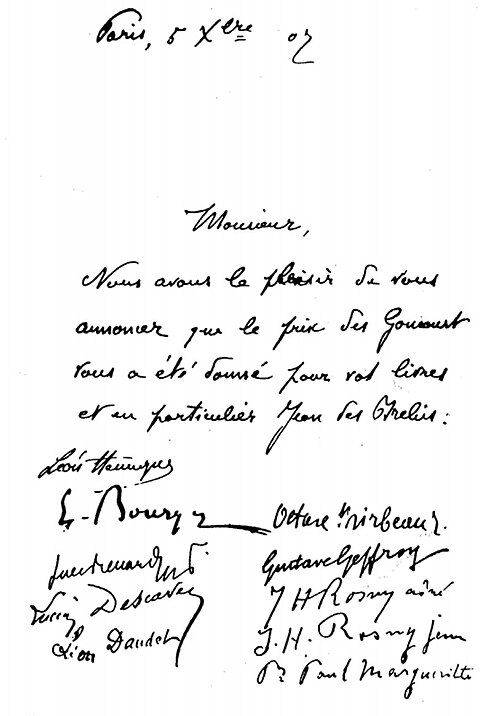

Bibliographie établie par JFrançois Chénin

---

### 1902 / Orléans­Paris
23 octobre ­ L'aube fraternelle, Cahiers de la Quinzaine.

### 1904 / Paris ­ Orléans
26 avril ­ Jean des Brebis, Cahiers de la Quinzaine (Jean des Brebis comporte six nouvelles : Jean des Brebis, A la belle étoile,Le revenant, La mort du bouif, Le trompion, Cri-Cri.)

### 1905 / Orléans
25 février ­ Nouvelle Le miracle de la Saint Vincent, Texte paru dans le Pays lorrain, 1906, pages 189-197. Il s'agit d'une ébauche dutexte Nuits lorraines dans le Rouet d'ivoire. Il s'agit aussi de la préface de La vie
lorraine - Contes de la route et de l'eau édité en octobre 1907. Nouvelle reprise dans Les Cahiers d'Emile Moselly, TheBookEdition, 2022
5 avril et 25 mai ­ Nouvelle Le retour, le Pays Lorrain
25 septembre ­ Nouvelle La vie lorraine, le Pays Lorrain

### 1906 / Orléans
20 mai ­ Nouvelle Son fï, le Pays Lorrain
20 juillet ­ Nouvelle Nuits lorraines, le Pays Lorrain.
26 juillet ­ Les Retours, Cahiers de la Quinzaine.
Septembre ou octobre ­ Nouvelle Au rencard, les Pays de France

### 1907 / Orléans
1907 ­ Critique Goëry Coquart de R. Perrout, le Pays Lorrain (René Perrout, né à Épinal (Vosges) le 26 janvier 1868, et mort dans la même ville le 11 septembre 1920, à 52 ans, est un avocat et un écrivain régionaliste français. Ami de Maurice Barrès et de Charles Sadoul, il est considéré comme l'historien et le chantre d’Épinal. De son œuvre, constituée principalement d'études, de récits et de romans en rapport avec l'histoire de la Lorraine et même presque exclusivement de la région d’Épinal, émergent notamment le recueil de récits Autour de mon clocher (1905), le roman historique Goëry Coquart bourgeois d'Épinal (1906), le roman Marius Pilgrin, idées de province (1909) et l'étude Les Images d'Épinal (1912)).
Mars ­ Terres Lorraines, Plon.
20 mai ­ Nouvelle Le père vipère, le Pays Lorrain
1er octobre ­ La Vie Lorraine ­ Contes de la route et de l'eau (La vie lorraine - contes de la route et de l’eau comporte une préface la vie lorraine, deux nouvelles déjà publiées en 1906 dans LesRetours (Les haleurs, Le soldat) et trois autres nouvelles : Au rencart, Le père Vipère et Son Fî.) la Nouvelle Librairie Nationale.
17 novembre ­ Le Rouet d'Ivoire, Cahiers de la Quinzaine. (Le Rouet d’ivoire comporte vingt-six nouvelles : Le rouet d'ivoire, La cheminée
lorraine, Premières désillusions, Fantasmagorie, Un, grand voyage, Récit de guerre, Lesac de sorbes, une histoire de revenants, Nuit de Noël, L'eau de Pagney, Quelquesvisiteurs, L'hôte muet, La joie, L'église, Premier maître, Nuits lorraines, Parrain, Le conte du beau temps, Deux vieux, Bonne dame, La Babette, La vie de l'eau, Colin Michelot,Passage d'automne, La maison d'école, Petit Brinquin.)
Novembre ­ Jean des Brebis, Plon.
5 décembre ­ Prix Goncourt.

Carte signée des membres du jury du Gongourt attribuant le prix 1907 à Emile
Moselly pour _Jean des Brebis_ (publié en 1904 aux Cahiers de la Quinzaine) et aussi
pour _Terres Lorraines_ (publié chez Plon en mars 1907).
Les signataires : Léon Hennique, Élémir Bourges, Jules Renard, Lucien Descaves,
Léon Daudet, Octave Mirbeau, Gustave Geffroy, J.-H. Rosny aîné (Joseph Henri
Honoré Boex), J.-H. Rosny jeune (Séraphin Justin François Boex), Paul Margueritte.
14 décembre ­ Nouvelle Tourniquet, le Censeur politique et littéraire.

### 1908 / Orléans
Janvier ­ Le Rouet d'Ivoire ,Plon.
9 ­ 11 janvier ­ Nouvelle Tourniquet, l'Humanité
10 février ­ Nouvelle Le fossoyeur, La Grande revue
Avril ­ Nouvelle La Griote, la Revue bleue
25 avril ­ Nouvelle Le nourrisson de Madame Virginie, La Revue hebdomadaire
10 septembre ­ Chronique Le sabot de faïence, Le Matin
10 octobre ­ Nouvelle Le songe de la Pentecôte, La Grande revue
12 octobre ­ Chronique Le député, Le Matin
17 octobre ­ Nouvelle Les deux Maucor, La Revue hebdomadaire
12 novembre ­Chronique Les canards, Le Matin

### 1909 / Orléans, puis Eaubonne
1909 ­ Hommage Sur le tombeau d'Emmanuel Delbousquet, l'Âme latine
1909 ­ Critique René Perrout, le Pays Lorrain
1909 ­ Lucien Descaves, Editions Sansot (Lucien Descaves, né le 18 mars 1861 à Paris 14e et mort le 6 septembre 1949 à
Paris 16e, est un écrivain naturaliste et libertaire. Journaliste, romancier et auteur
dramatique français, il a fait partie des premiers membres de l'Académie Goncourt
et en fut le président. En 1889, il est l’auteur de Sous-offs, ouvrage antimilitariste
qui lui vaut des poursuites judiciaires.)
10 janvier ­ Nouvelle Le chien, la revue Illustrée nationale.
4 septembre ­ Nouvelle Tourniquet, La Grande Revue, Pages Libres

### 1910 / Eaubonne, puis Rouen
24 janvier ­ Nouvelle Le budgétivore, L'Humanité
21 février ­ Nouvelle La rencontre, L'Humanité
7 mars ­ Nouvelle La layette, L'Humanité
10 mars ­ Nouvelle L'agace, La Grande revue
21 mars ­ Nouvelle Le miracle de la Saint Vincent, l'Humanité
2 mai ­ Nouvelle Hein, L'Humanité
Décembre ­ Joson Meunier, Ollendorff.
3 décembre ­ Nouvelle La pêche miraculeuse, La Revue hebdomadaire
15 décembre ­ Fils de gueux, la Revue de Paris (décembre 1910 à
février 1911).

### 1911 / Rouen­ Paris
1er semestre ­ Le Français de nos enfants, Librairie Didier.
1911 ­ Nouvelle La femme du garde dans, Revue bleue
5 et 6 avril ­ Nouvelle Petit Jacques, L'Humanité
10 mai ­ Nouvelle La vie et la mort de Bonnard, L'Humanité
Novembre ­ George Sand, Editions d'Art et de Littérature.
24 décembre ­ Nouvelle La pêche miraculeuse, La Revue pour tous
25 décembre ­ Les Etudiants, la Grande Revue (du 25 décembre 1911
au 10 mars 1912).

### 1912 / Paris
1912 ­ La charrue d'érable (sur des illustrations gravées de Pissaro), (La charrue d’érable comportent 10 nouvelles : La noce normande, La baratte,
Messidor, Les semailles, Lavandière nocturne, Herbes coupées, Labour, Bétail à vendre,La moisson, Sous les pommiers.)
Editions Le livre contemporain
1912 ­ Nouvelle La baratte, le Pays Lorrain
20 juin ­ Contes et récits du XIXe siècle, Librairie Larousse.
Juin ­ Fils de gueux, Ollendorff.
Juillet ­ Nouvelle La vision du Père Huot, La Bibliothèque universelle et
Revue suisse

### 1913 / Paris
1913 ­ Nouvelle Le loup du père Pastourelle, le Pays Lorrain
27 juin ­ La Houle, l'Humanité (14 épisodes).

### 1914 / Paris puis Asnières
1914 ­ Critique Guy de Maupassant, la Revue bleue
1915 / Asnières
1915 ­ Chronique Canons de Lorraine, la Revue bleue
30 novembre ­ Simple aveu, première chronique dans le Temps.
Décembre ­ Le Journal de Gottfried Mauser, le Temps (16, 19, 25
décembre 1915, 1er janvier 1916).

### 1916 / Asnières
19 janvier ­ Chronique Pauvres gens, le Temps

### 1917 / Asnières
18 juin ­ Chronique Le crime de l'Allemagne, la Revue bleue

### 1918 / Asnières
27 mars ­ Porte la nouvelle Nausicaa, la Revue des Deux Mondes
(à René Doumic 32). Publiée en 2019 (René Doumic, né le 6 mars 1860 à Paris 2e et mort le 2 décembre 1937 à Paris
7e, est un homme de lettres, journaliste et critique littéraire français, secrétaire
perpétuel de l'Académie française. Il collabore à la Revue des deux Mondes, qu'il
dirige de 1915 à 1937, ainsi qu'à de nombreux journaux, dont Le Moniteur, le
Journal des débats et la Revue bleue.
20 avril ­ Les Contes de guerre pour Jean­Pierre , Berger­Levrault (Les contes de guerre pour Jean-Pierre comportent huit nouvelles : A Jean-Pierre
(Préface), L'ogre et le petit poucet, Un Prussien d’autrefois, La peite fille de Noyon,
Berceuse inquiète, Le boche de Jean-Pierre, Jean-Pierre et le soldat, Pèlerinage.)
25 mai ­ Chronique Prière pour nos morts, Revue France
Octobre ­ Nouvelle Bautru, soldat, la France nouvelle (revue de l'Union
française)

### Post mortem
Janvier 1919 ­ Les Etudiants, Ollendorff.
Janvier 1919 ­ Nouvelle Nausicaa, la Revue des deux mondes
Septembre 1920 ­ Les grenouilles dans la mare, Albin­Michel.
Octobre 1921­ Nouvelle Impressions lorraines (écrite en 1913), le Pays
Lorrain
1923 ­ Nouvelle Mon voisin, le Pays Lorrain (inédit de mai 1916)
1924 ­ Nouvelle Existences imaginaires (inédit de mai 1916), le Pays
Lorrain
1927 ­ Chronique Prière pour nos morts, revue Choix de lecture
1928 ­ Nouvelles composant Vendanges lorraines : Vendanges lorraines
(prélude), L'assomption du passeur, L'auberge de la mère Marie,
L'usurier, La corbeille d'écus, La femme de Maître Corniolle, La nuit
lorraine, Les maraudeurs, Les sangliers, le Pays Lorrain
Novembre 1931 ­ La Houle, Editions Bourrelier­Chimènes
1931 ­ Chronique Dernier séjour en Lorraine, le Pays Lorrain (inédit de
1914)
5 mars 1931 ­ Nouvelle Un vigneron du bon vieux temps, le journal
Le Lorrain. Cette nouvelle avait été publiée dans le Pays Lorrain en
1923 sous le titre Mon voisin.
Décembre 2022 ­ Les Cahiers, 1890­1914, TheBookEdition
Février 2023 ­ Nouvelles portraits & croquis, vol. 1, TheBookEdition
Mars 2023 ­ Nouvelles portraits & croquis, vol. 2, TheBookEdition
Avril 2024 ­ Suzanne, roman (resté inédit), TheBookEdition