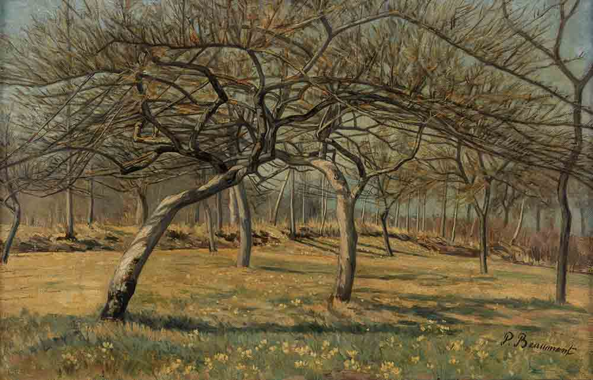
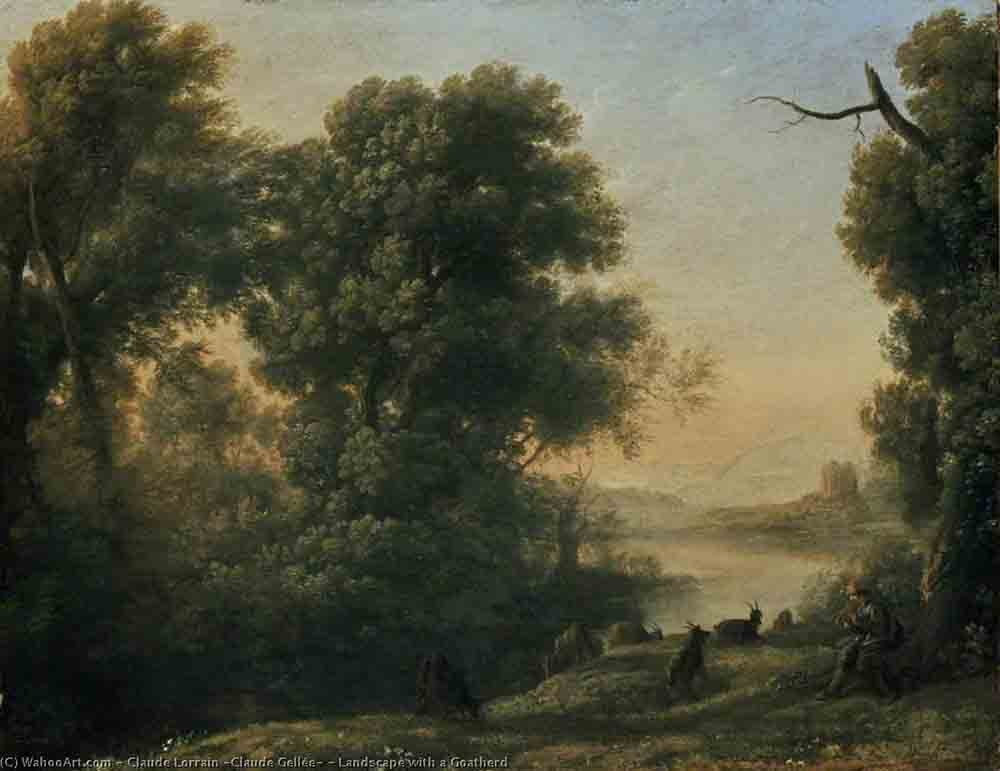

**EMILE MOSELLY ET LA CRITIQUE**

  Le 21 décembre 1902, Gaston Deschamps (1) rend compte, dans le Temps, de la parution de _l'Aube fraternelle_ dans les Cahiers de la Quinzaine en citant de nombreux passages du livre et détaille les réactions de cet "_universitaire soldat_" au contact de ses camarades de garnison, ouvriers ou paysans. Il évoque, dans son article, le grand poète Agrippa d'Aubigné, l'illustre La Tour d'Auvergne, le général de Ségur (qui occupa un fauteuil de l'Académie), le général Pelleport cher à Sainte Beuve, le commandant Rivière, tous versés aussi dans les armes... et d'autres (qu'il ne cite pas). Au tiers de son article, il n'a pas encore mentionné le nom de l'auteur (Emile Moselly) mais il remercie Charles Péguy, gérant des Cahiers de la Quinzaine "_de nous donner cette autobiographie d'un artilleur helléniste qui lisait Aristophane entre deux corvées de quartier, et qui, surpris, charmé de trouver dans la verve comique du peuple une illustration naïve de son texte, s'étonnait de découvrir et de goûter, aux copieuses facéties du corroyeur ou du charcutier d'Athènes, une saveur nouvelle et très moderne._" La suite de l'article sur trois colonnes est du même ton, précis dans les citations, humoristique dans les commentaires, sarcastique sur le personnage de l'Aube fraternelle - qui pourrait être, mais on n'en est pas sûr - l'auteur du livre, Emile Moselly. Manifestement, il ne sait pas grand chose de cet auteur et l'assimile au personnage principal de l'Aube fraternelle. Evoquant une "leçon d'ethnographie nationale", il conclut "_Encore une fois cela est candide. Cela est charmant. Cela est vraiment jeune. Si cet artilleur idéaliste eût été un chasseur à pied sous les ordres du commandant Lavisse ou du lieutenant Marcel Demongeot, je ne doute pas que ses facultés n'eussent été employées au meilleur moment pour le bien de tous._" Critique acerbe d'un auteur qu'il ne connait pas encore et qu'il tient pour un "jeune idéaliste" il le compare à Paul et Victor Margueritte, tous deux pacifistes convaincus, qui souhaitaient "_que tous nos officiers fussent des éducateurs_". En fin d’article, le nom de l'auteur n'a toujours pas été cité ! 

A la même époque, Edmond Pilon (2), dans la revue la Plume (1er décembre 1902), écrira : "_J'ai vu ce petit cahier tel que le donne Moselly ... Je crois n'avoir jamais rien lu de si exact et de plus fin sur la vie du soldat dans la vie ordinaire. Il n'est pas jusqu'aux moindres détails qui ne soient vrais, ne soient observé avec une acuité subtile, ingénieuse, sentie. Avec cela pas de révolte, pas de cris, pas de grands mots, une âme qui se raconte. C'est doux et triste et pénétrant, d'une bonté affectueuse et profonde. L'amour ardent de la vie y sourit à travers les obus..._" 

Avec _l'Aube fraternelle_, la carrière de Moselly inaugure ces réactions de rejet ou de reconnaissance qui l’accompagneront durant sa courte vie littéraire. Et sans l'amitié qui le lie à Charles Péguy, qu'il rencontre vraisemblablement à Orléans en 1899 et avec lequel, en 1900, il participe au congrès international socialiste salle Wagram à Paris, il n'aurait sans doute pas publié _l'Aube fraternelle_ dans les Cahiers de la Quinzaine, Cahiers fondés par Péguy en 1900. Entrer dans le tourbillon littéraire (et bien souvent politique) de l'époque n'est pas chose aisée, semble-il, et Moselly sera bien souvent l'otage involontaire des cloisonnements, des disputes et des rancunes de ce monde où les amitiés comme les inimitiés façonnent les notoriétés ou les mises à l'écart. Dans tous les cas, c'est avec un récit qui touche à la guerre que Moselly entre dans la carrière littéraire. Plus encore, c'est un texte qui est une illustration du besoin de fraternité et l'article (non signé) dans l'Opinion Nationale du 30 décembre 1902 (Voir ci-contre) témoigne de la profonde humanité de Moselly pour ces _"paysans, bûcherons, gens de la plaine, bergers des Vosges, ouvriers des villes, pâles voyous à qui le talus des fortifications de Paris servit de berceaux, tous dépouillés pour quelques années de la personnalité que les conditions si diverses de la vie leur avaient faite, apparaissent tels que des primitifs aux sensations neuves, aux idées simples que détermine seulement le pli que l'hérédité et l'existence normale imprimèrent à leur nature_". 

En 1904, au moment de la parution de _Jean des Brebis_ (aux Cahiers de la Quinzaine), Léon Blum dans ses analyses de la vie littéraire du 17 mai 1904 dans l'Humanité reprend, en quelques lignes, le même leitmotiv d'un auteur qui consacre ses écrits aux "_déclassés de la terre, les vagabonds, les chemineaux, les bohémiens_" et, le comparant à Gorky, souligne que Moselly aborde "_tous ces grands sujets tristes, que nous osons à peine toucher, peut être par une gêne hypocrite. M. Moselly possède un don certain de vérité pathétique et d'émotion pitoyable, et cet ouvrage de début nous en promet de meilleurs._" Moselly apparait à ses débuts comme un auteur "_social_" dont le régionalisme renforce le trait. 

---

Et c'est bien la "_vague régionaliste_", très en vogue dans ces années, qui l'emportera au moment du prix Goncourt en 1907. C'est aussi à cette occasion que des articles plus conséquents sur Moselly cherchent à mieux analyser le fond et la forme, le fond pour les portraits de caractères ou de mœurs pour lesquels Moselly se révèle un narrateur averti et sans concession, la forme pour les tournures très impressionnistes de ses croquis de paysages et de campagnes lorraines. Tenant la chronique d'un monde rural pauvre qui s'effrite et se perd au profit d'un monde ouvrier et urbain qui ne tient pas les promesses d'une vie plus heureuse, Moselly les replace dans des fresques paysagères dont il sait, par touches successives, faire vibrer les lumières, les sonorités et les saveurs. Louis Madelin 3, dans la République Française du 10 septembre 1907 écrit, au sujet de _Terres Lorraines_ (paru en mars chez Plon) : _"Observateur des mœurs de son canton, ce n'est point un froid analyste. Sa sensibilité s'est émue devant cette autre terre qui meurt ; on sent qu'il l'aime ainsi qu'un bon fils et qu'à travers les concours où il lui fallait disserter de Virgile et de Pindare, il a dû s'attarder plus longuement qu'à aucun autre à cet Ausone qui chanta la Moselle, fertile en blés, fertile en hommes._" _[...] Dans ce décor sans cesse renouvelé le grand personnage c'est le village dans sa vie journalière et ses fêtes ; l'héroïne, c'est la Moselle. Elle coule scintillante entre les joncs et les bouleaux, lien qui unit les cantons de Lorraine, des Vosges à Metz, nourricière de la province, vieille mère qui dans l'antique plateau garde un éternel éclat._" 

A dater du Goncourt, Moselly n'échappera plus au "_pour_" et au "c_ontre_". "_Pour_", ceux qui lui reconnaissent un réel talent de novelliste et de portraitiste. "_Contre_", ceux qui ne lui reconnaissent ni originalité, ni talent de conteur, tout au plus un savoir-faire d'enseignant qui a beaucoup lu. Ainsi Marcel Ballot (4), dans le Figaro du 16 décembre 1907, commentant l'attribution du Goncourt (5) à Moselly pour Terres Lorraines, écrit : "j'entends bien que ce sujet (un jeune homme aime une jeune fille...) fut, avant tout, prétexte à paysages, à peintures de mœurs et de coutumes locales, à savoureuses expressions du terroir. Malheureusement l'indéniable pittoresque de Terres Lorraines n'est ni très senti, ni très original. On y rencontre plus de virtuosité que d'émotion, plus de réminiscence que de tempérament. Les pages les mieux venues gardent un caractère de notes coordonnées et de morceaux documentaires. Ce que l'écrivain nous montre est moins tel ou tel veilloir, tel ou tel bal, telle ou telle noce, tel ou tel enterrement que le veilloir, le bal, la noce ou l'enterrement en pays lorrain. Nous feuilletons l'album d'un dessinateur fidèle, non l'œuvre d'un artiste attendri ; et cette terre que nous évoque M. Moselly ne doit pas, j'imagine, être celle où il est né. [...] Il y a aussi, de notre temps, beaucoup de gens qui se croient lorrains et qui pourtant ne le sont pas. M. Moselly m'excusera donc de supposer jusqu'à plus ample informé que la Lorraine eut en lui, non pas même un fils d'adoption, mais un aimable visiteur, un hôte attentif et dont elle occupa heureusement les loisirs." 

Dans la même veine, Charles Foley (6) dans l'Echo de Paris du 26 décembre 1907, retient, quant lui, que seul le propos "_social_" de _Jean des Brebis_ (aussi primé par les Goncourt) reste le grand mérite de ce livre.  
A travers ces deux critiques, on sent poindre le reproche fondamental fait à Moselly par le milieu littéraire classique : c'est un _fils de paysan_ devenu _enseignant_ qui se pense _écrivain_.... On y reviendra plus loin. 

---

C'est donc à partir du Goncourt que les analyses plus argumentées du travail de Moselly sortiront dans la presse, revues littéraires (et parfois politiques) et journaux (toutes tendances confondues ou presque). 

Le premier à faire un sort à l'opposition Province-Paris pour tenter de résoudre le procès de régionalisme fait à Moselly par le milieu littéraire parisien est Jules Bois (7) dans les Annales du 15 décembre 1907 : citant Moselly, il souligne que "_garder de fortes attaches avec le terroir constitue le secret de l'originalité_." 

Et il reprend à son compte le propos de Moselly sur l'esprit parisien : "_Ce qu'on appelle l'esprit parisien, écrit Moselly, ce que les couplets de revues et les critiques des quotidiens magnifient en phrases toutes faites, prétendant nous montrer, à tous les coins des boulevards, la traîne d'Alcibiade, toute cette littérature facile nous apparaît comme un composé assez méprisable de la badauderie d'infatuation recouvrant un jugement artificiel._" Il poursuit : "_Et le paysagiste lorrain critique, non sans justesse, la promptitude des opinions, les banalités intangibles, ce dilettantisme qui plane sur tout, sert à tout et ne suffit à rien, met à la mode une certaine littérature légère, courante, qui se garde de toutes les inspirations fortes qu'elle juge encombrantes et qui n'est pas loin d'être un poncif_." Dès lors le jeune écrivain pourrait se perdre dans cette ivresse de sortir de lui- même au lieu de s'y recueillir et deviendrait le jouet du snobisme et de la mode. Jules Bois convoque Flaubert "_qui était de cet avis, lui qui, resté farouchement provincial, se plaisait à constater : Le souffle de la civilisation qui sort de Paris sent terriblement les dents gâtées._" Et reprenant le conseil de Barbey d'Aurevilly cité par Moselly dans La vie lorraine : "_Mettez vous sur votre porte et faites ce que vous voyez_", il le félicite de s'être conformé à "_ce profond enseignement : il est resté Lorrain et il a bien fait._" Voilà pour le fond. Sur la forme, Jules Bois note cependant que Moselly a de la peine à se constituer une personnalité caractéristique et définitive, soulignant qu'il doit faire un choix entre le roman et les portraits : "_son style sage et pondéré prend quelquefois l'allure du devoir de français, correct, mais atone, sans personnalité nette, malgré son charme de mélancolie._" Beaucoup de critiques souligneront que Moselly réussit mieux dans la nouvelle que dans le roman, dans les croquis et les portraits plutôt que dans les histoires romanesques qui s'avèrent être un fil ténu autour duquel il déroule l'album de ses sensations. Henri Gibout, dans la revue Foi et Vie 8 de février 1908 dira de Moselly qu'il est un excellent paysagiste lorrain. "_Il s'arrête sans cesse pour regarder le ciel, la route, les bois, les champs. Tous les jeux de la lumière et de l'ombre sur la terre lorraine lui semblent dignes d'être remarqués ; et il les fixe, pour son plaisir et pour le nôtre, d'une main très habile et très sûre, qui ne nous fait grâce d'aucune nuance, d'aucun détail. [...] Peut-être, M. Moselly, qui décrit beaucoup et qui décrit bien, décrit-il un peu trop et un peu trop bien. [...] Comme les Corot, tous ses tableaux ont un air de famille qui dénonce l'artifice, le pro- cédé ; et il faut bien qu'on s'aperçoive à la longue que, si Moselly est un bon Lorrain, il est surtout et avant tout un bon professeur, qui manie la phrase avec une magistrale dextérité._" Et il ajoute : C'est quelquefois un défaut de trop bien écrire, ou de savoir qu'on écrit bien. Ce défaut est très apparent dans Jean des-Brebis. Un paysan lorrain qui sentirait tout ce que sent - dont M. Moselly sait utiliser toutes les ressources - va leur donner une grâce exceptionnelle.

---

Le péché originel en littérature d'Emile Moselly est son origine paysanne issée au rang de professeur ! Nous y revenons donc à ce procès fait à Moselly d'être "_appliqué à tirer de son écriture tous les effets qui sont catalogués dans la fâcheuse Rhétorique_" (Henri Gibout). 

Approche similaire, sans parti pris cependant, chez Jean Bonnerot (9) dans la Revue Idéaliste du 1er septembre 1907, qui souligne que "_les nouvelles_ (de _Jean des Brebis_), _assez courtes, préparaient mal M. Moselly à la longueur d'un roman_" (_Terres Lorraines_). Dans celles-ci "_les descriptions, les décors s'appariaient au sujet, l'encadraient, le mettaient en valeur sans le ralentir ni le surcharger_." Tandis qu'un roman fait d'une trame plus longue "_ne doit pas être une nouvelle de cinquante pages détaillée, délayée en trois cents pages_." _[...]_ "_M. Moselly a bien senti la difficulté, il a rusé adroitement et est arrivé à encadrer une intrigue romanesque dans la poésie de ses décors lorrains._" Banalité de l'histoire (un jeune homme aime une jeune fille ! ) et richesse des nuances des paysages. Là est la force de Moselly d'évoquer un paysage et de le rendre vivant. "_Il excelle surtout à rendre les impressions de solitude et de silence ; par des mots il arrive à nous faire sentir sur les bords de la Moselle ce religieux silence du soir, cette demi-vie fuyante qui somnole et meurt, faite de rampements de reptiles, de glissements d'oiseaux, de sauts brusques de poissons et de l'appel discordant du crapaud caché._" 

On doit à Maurice Pellisson (10), dans la Revue Pédagogique (tome 52, janvier-juin 1908) la première critique argumentée qui reconnait à Moselly un talent "_indépendant de la mode, des écoles, des cénacles ; il est personnel dans le bon sens du mot, j'entends : désintéressé et sincère._" A cette date, Moselly a déjà publié _l'Aube fraternelle_ (1902), _Jean des Brebis_ (1904), _Les Retours_ (1906), _Terres Lorraines_ (1907), _le Rouet d'ivoire_ (1907, 1908) et un peu plus d'une quinzaine de nouvelles dans les journaux et revues de l'époque. Il relève que Moselly connaît bien ses classiques et ses contemporains et que, dans ses livres, on a "_relevé d'évidents ressouvenirs de Flaubert. Mais cela ne prouve rien,_ poursuit Maurice Pellisson, *sinon qu'il connaît les belles œuvres, les aime, s'en souvient. Il n'en resterait pas moins que, volontiers élève des grands artistes, il ne veut être le disciple de personne. Dans les cinq volumes qu'il a publiés, on aurait beau noter ici ou là des réminiscences, pas un, dans l'ensemble, ne rappelle une marque connue_". Reprenant les critiques qui lui sont adressées de rester dans son pré-carré lorrain, Maurice Pellisson souligne que "_ce Lorrain parle de sa Lorraine sans chauvinisme ; chez lui, nulle trace du nationalisme bruyant auquel la foule se laisse prendre volontiers ; rien non plus qui ressemble à l'idéologie nationaliste de M. Barrès._" Ni pathos nationaliste, ni déclamation antimilitariste, Moselly "_ne s'est pas laissé embrigader parmi les bourgeois socialistes ou les socialistes bourgeois qui s'éprennent du peuple par snobisme et qui font des livres où il y a plus d'apitoiements que de réelle pitié._"  Et il poursuit : enfant du peuple, éloigné de lui un moment par l'éducation, Il cherche franchement, cordialement, à s'en rapprocher et à le bien connaitre. Les images que les romanciers en ont tracées ne lui font donc pas illusion : elles lui paraissent "fausses, embellies, ou trivialisées, déformées par la vision de l'artiste" ou par le besoin d'attirer les chalands. Aussi refuse -til de s'en inspirer et sa tendresse pour le peuple lui donne de l'éloignement pour tout ce qui n'est pas vrai, simple et droit.

---

Dans la Gazette de Lausanne du 21 janvier 1908, Gaspard Valette (11) revient sur cette Lorraine chère à Moselly : "_Aussi bien, c'est la Lorraine seule, c'est la Lorraine toute entière que M. Moselly a peinte dans son œuvre littéraire : les choses et les hommes, les mœurs et la nature, les lignes du paysage et les traits de l'âme qui leur correspondent. Les paysages surtout ! Je connais peu de paysages littéraires plus consciencieux, plus étudiés, plus émouvants que ceux-là. Pour retrouver une impression analogue, il faut songer [...] aux admirables et frustres paysages lorrains d'une Pauline de Beaumont_ _(12)_." Pour autant, Moselly n'est pas seulement le peintre des paysages de sa Lorraine et "_le paysage n'est pas pour notre écrivain un décor impassible et muet. Les choses ont une voix qui lui parle et qu'il entend, une vie avec laquelle il communie, une plainte que son cœur accueille. Et plus ces choses sont humbles, plus ces recoins sont déshérités, mieux il croit percevoir cette voix et discerner l'âme du pays qui s'y révèle._" Et G. Vallette ajoute : "_le travail des humbles pèse sur cette terre, et leur cendre coule au flanc des coteaux, mêlée à l'humus rare qu'ils ont fécondé. Les subtiles harmonies qui unissent l'homme au sol vous deviennent soudain perceptibles dans ce terroir ingrat_"_

---

Loin des commentaires acerbes sur un régionalisme "_poudre aux yeux_", G. Vallette conclut en soulignant que Moselly est "_descriptif avant tout, réaliste en son tréfonds, pénétré d'une pitié humaine intense, qui n'a rien de pleurnicheur ou de déclamatoire, le talent du romancier lorrain, avec sa forte saveur de terroir et son régionalisme avoué, me parait non pas un des plus prestigieux, ni des plus éclatants, mais un des plus probes et des plus solides qui soient à l'heure actuelle."  
Mêmes échos laudateurs dans un long article de Paul Seippel_ _1(3)_ _dans le Journal de Genève du 2 février 1908 à propos du Rouet d'ivoire : "Le livre nouveau qu'il vient de nous donner nous montre mieux encore que les précédents quelle est la source vive de son inspiration et combien son provincialisme lorrain est chez lui, non pas l'application studieuse d'une théorie littéraire, mais bien l'expression franche, directe, inévitable de sa personnalité la plus intime._" Dans une tout autre tonalité, Henri Bremond (14) (Le Correspondant du 10 avril 1908) tenant une chronique sur les "_Jeunes romanciers_" consacrée à E. Moselly (_Jean des Brebis, le rouet d'ivoire_), Louis Lefebvre (15) (_La maison vide, le recueillement, l'île héroïque_) et Paul Renaudin (16) (_Silhouettes d'humbles, les mémoires d'un petit homme, Les Champiers_), débute en écrivant : "_Quand ils seront vieux ou, - sans aller si loin, - quand ils seront célèbres, nous n'aurons plus ni droit, ni peut- être le courage de les critiquer._" Il s'en donne donc à cœur joie au sujet de Moselly dont l'imagination lui parait "_singulièrement paresseuse_". Il poursuit imaginant Moselly au travail : "_Le voici donc devant sa table de travail. A portée de la main, quelques livres ouverts pêle-mêle et plusieurs boites de fiches soigneusement étiquetées_." On sent poindre un reproche déjà fait à Moselly d'être un professeur qui se prétend écrivain. Plus loin : _"Rêveuses impressions d'enfance et exercices d'agrégation, c'est, en deux mots, toute l'histoire intérieure de ce talent._" Et encore : "_Ecrire, conquérir par une application tenace le faire des maîtres dont la perfection enchanta ses années d'initiation littéraire, voilà ce que veut l'ancien étudiant de Nancy_." Et pour finir, Henri Bremond ramène Moselly à *l'auteur d'un seul et même livre, celui d'une enfance lorraine dont il ne peut se départir.*

---

A l'opposé, Carl Stranger (17) dans un article "_Gueux et vilains dans le Roman contemporain_" (Le Volume, 13 juin 1908) qui, face aux commentaires subtils des analystes qui crient "au vide" dans les écrits de Moselly, souligne, avec force exemples, la belle "_manière de conter, et la manière de M. Chénin est pleine d'un charme d'autant plus prenant qu'il est plus simple._" 

Ainsi les commentaires alternent entre la reconnaissance d'un écrivain talentueux et la critique d’un écrivain besogneux, entre une écriture sensible et savoureuse et une écriture commandée et scolaire, entre un regard neuf et une vision surannée. Henri Potez 18 dans le Grand Echo du Nord et du Pas-de-Calais du 17 juin 1908 estimant que l'originalité de Moselly est d'être un "_luministe_" : "_Nous sommes loin des pointes sèches de M. Barrès et des fines gravures sur aciers de M. Anatole France. Nous pensons plutôt aux coulées de lumière qui oscillent sur les eaux, dans les vastes toiles d'un artiste qui, lui aussi, naquit sur nos frontières de l'Est, Claude Lorrain._ _19_ _- Voilà bien des peintres, direz-vous ! Sans doute, cela tient à ce que Moselly est avant tout un peintre ; vraiment le luxe de sa palette fait souvent pardonner ce que son art a d'un peu immobile et ses caractères d'un peu imprécis._" 

Louis Madelin (déjà cité) qui, dans une chronique "_Dans ma province_" (La République Française du 25 novembre 1908) décrit Moselly comme "_un poète qui revit son enfance : la description des vendanges lorraines qui est sans faste apparait l'œuvre d'un Virgile lorrain avec un peu plus de réalisme_". 

Paul d'Armon (20), enfin, (Le Signal du 13 mars 1908) retient que si Moselly "_se penche douloureusement sur les humbles, les ignorants et les vaincus_", "_il ne songe pas à les consoler ; comment le pourrait-il, n'ayant aucune croyance spiritualiste ? Son réalisme amer sous-entend la soumission à la Destinée._" Il conclut cependant en soulignant que "_ces envolées lyriques affranchissent de ses partis pris de désolation l'esprit du romancier, chanter l'harmonie de l'univers c'est une façon de prier._" 

A la parution de _Joson Meunier_ (décembre 1910, Ollendorf) et _Fils de gueux_ (en feuilleton, décembre 1910 à février 1911 dans la Revue de Paris), la critique change de nature et devient plus substantielle même si les qualités de Moselly comme "_poète des paysages, poète minutieusement descriptif_" sont toujours mises en avant. Et Jean Ernest- Charles (déjà cité) note dans La Grande Revue du 25 décembre 1910 que l'inspiration lorraine de Moselly se fond de plus en plus avec l'inspiration humaine. Et l'émotion qui en ressort est communicative, "_d'autant plus qu'Emile Moselly s'acharne moins à décrire la vieille coutume, le vieux costume et la vieille maison._" 

Paul Despiques (21) (l'Evénement du 22 décembre 1911) relève que Moselly, "_ce poète sonore, qui célèbre en fanfare les réveils printaniers de la nature, les exubérances des ardeurs estivales, cet amant de la vie en un mot, a aussi le visage tourné vers le côté mystérieux de notre existence. La joie de la nature ne peut calmer l'inquiétude de son esprit trop vibrant des douleurs humaines : à l'heure de son premier succès, alors que la célébration vient à lui, que la gloire lui fait son premier signe, il voit «une ombre tombant des cimes inconnues, voiler lentement à ses yeux la joie du chemin et la haie chantante, et le tumulte de la vie...._»" 

Emile Krantz (22) qui fut son mentor quand Moselly était étudiant à Nancy et à qui il dédia _le Rouet d'ivoire_, note dans les Annales de l'Est (1912) l'inquiétude de Moselly à la parution de _Fils de gueux_ en feuilletons dans la Revue de Paris de savoir si cette histoire pourrait se hausser à la dignité de roman tant "_il se sentait une prédilection de derrière la tête pour le cadre et la dimension de la Nouvelle dont il me faisait l'aveu dans des lignes intimes que je me plais à citer : «c'est si français la Nouvelle de trente pages, serrée, précise ! Il y a un mot de Mérimée qui m'a fait une impression : Un homme d'esprit prend souvent tant de peine pour mettre dans un volume cent cinquante pages qui sont de trop !_». Et E. Krantz de poursuivre : "_Fils de gueux est sorti victorieux de l'épreuve. c'est bien un roman et non une nouvelle amplifiée et soufflée de littérature : sur ses trois cents pages, nul lecteur n'en trouvera cent cinquante de trop_". Et d'ajouter : 

---

A propos de _Fils de gueux_, Louis Chaffurin (23) dans Le Salut Public, journal de Lyon du 30 juin 1912, note que si Moselly est un fervent admirateur de Flaubert, "_il est assez piquant de voir combien la philosophie de son œuvre diffère de celle du maître. Nulle amertume, dans Fils de gueux, nul mépris pour le peuple. Parfois un peu d'humour discret et bienveillant : jamais d'ironie cruelle. Une chaude et généreuse sympathie anime l'œuvre entière. Cet art n'a rien d'objectif ni de détaché : il est plus sentimental qu'intellectuel et plus attendri que psychologique ; [...] ce réalisme exprime la sérénité d'un grand esprit et d'un large cœur_". 

Paul Souday (24) dans la rubrique Les livres du journal Le Temps du 21 août 1912 consacrée à _Fils de gueux_ reprend les deux attendus déjà signalés plus haut. Sur le fond, Moselly est une lecture réconfortante sur les mœurs rurales, sur la forme Moselly s'épuise en descriptions inutiles. _"M. Moselly ne célèbre pas la nature en poète lyrique, en disciple de Virgile ou de Jean-Jacques et de Michelet. [...] Le paysage n'est que le cadre de ses récits, dont les paysans sont les héros, et il s'efforce de les représenter tels qu'ils sont, sans les idéaliser, mais sans les noircir non plus. [...] Il trouve le moyen d'accorder le réalisme et l'optimisme, qui jusqu'à présent et particulièrement en ces matières semblaient irréconciliables. Il ne dissimule ni les défauts du paysan ni les difficultés de sa tâche ; mais il le croit capable de tout surmonter. [...] Le malheur des romans où la vertu est récompensée, c'est qu'ils manquent souvent de vraisemblance. M. Moselly a su donner au sien l'accent de la vérité. Voici une lecture réconfortante". Et plus loin : "Il devrait aussi comprendre que la description n'est la bienvenue que lorsqu'elle est sérieusement motivée, soit que l'auteur exprime d'une façon neuve et personnelle ses propres impressions, soit que le milieu physique exerce une influence notable sur les événements ou la psychologie des personnages. Mais Basile Crasmagne et son amoureuse se moquent bien de ces effets de lumière diurne ou nocturne [...] et de ces rames sarmenteuses où vrillaient les haricots. [...] Les paysans sont peu sensibles au pittoresque : o fortunatos nimium !... L'éternel refrain descriptif qui interrompt périodiquement l'action et les scènes les plus palpitantes dans ce roman de M. Moselly parait donc neuf fois sur dix superflu et encombrant. On conçoit par instants l'affreux soupçon que le romancier pourrait bien tout uniment tirer à la ligne. M. Moselly a l'esprit assez fertile pour se passer de cet artifice_". 

De Henry-D. Davray (25) dans le XXème Siècle du 11 août 1912 sur _Fils de gueux_ : "_L'écriture de M. Moselly est sobre, élégante, directe : il a répandu sur tout ce récit une pitié émue qui captive et le classe dans l'école de Daudet. On ne saurait reprocher à cet écrivain que trop de tenue littéraire, pas assez de souplesse et de naturel, parfois_". Moselly, trop bon professeur, encore bien à l'étroit dans sa rhétorique classique, en somme ! 

Nous terminerons cette revue de presse avec J. Ernest- Charles (déjà cité). A partir de 1912, les critiques se font plus rares, Moselly publiant peu dans les années 1913- 1917 hormis _Le journal de Gottfried Mauser_ (dans Le Temps en décembre 1915, chez Ollendorff en janvier 1916) et plusieurs nouvelles dont la majorité ont pour thème l'Allemagne et la guerre. En 1918 (avril), quelques mois avant sa mort, paraitront _Les Contes de guerre pour Jean-Pierre._ Dans un article de l'Excelsior du 16 août 1912 _Le livre dont on parle "Fils de gueux"_, J. Ernest-Charles résume, en fait, une grande partie des attendus, louanges ou critiques, qui sont faits à Moselly l'écrivain. **Le régionaliste rural** : "_Emile Moselly se complait à étudier les paysans du pays natal. Les paysans ne sont pas moins intéressants que les gens mieux habillés qu'eux qui fréquentent les salons ; mais ils ne sont pas beaucoup plus intéressants. Ils sont ce qu'ils sont. Ils bénéficient - et cela, Dieu merci, ne trouble pas leur sérénité - ils bénéficient du mouvement régionaliste cher à Charles-Brun_ (_26)_. Chaque romancier, pourvu d'une maison de campagne dans le village paternel, et y passant quelques mois de l'année, fait vivre dans ses romans les paysans de l'endroit et même des hameaux circonvoisins._ On ne saurait mieux dire ! [...] _Les romanciers régionalistes sont savants comme des livres et leurs romans sont instructifs comme des maîtres d'école."_ **Un conteur sincère et touchant** _: "Tous les romanciers régionalistes et ruraux sont des réalistes forcenés. [...] Ils voient la vérité de près. Ils en voient et ils en disent la brutale laideur. [...] Le naturalisme, persistant dans les romans ruraux, cesse d'être impersonnel. [...] Les romanciers régionalistes et ruraux sont emplis de pitié pour la souffrance, pour la misère humaine. [...] Les larmes coulent dans Fils de Gueux d'Emile Moselly. Elles coulent même à torrents. Et par moments, j'ai envie de dire à M. Moselly : «Ah ! Ne pleurez donc pas comme ça !» Certes, rien ne vaut la sensibilité ; mais je supplie nos bons auteurs de nous épargner le larmoiement !_ **L'écrivain moraliste et idyllique** : "_Emile Moselly raconte une histoire touchante. L'histoire est belle et bien ordonnée, mais elle comporte une morale ! Ah ! C'est bien ce que je craignais. [...] On lit, on lit et on devine les intentions du narrateur : il tient absolument à ce que les hommes soient bons ! [...] Ensuite M. Moselly améliore les hommes [...] et son héros est plus beau que nature. [...] Il est un modèle inoubliable de piété filiale [...] apostolique jusqu'au bout. Il y a dans ce livre je ne sais quel évangélisme inconscient. [...] Et ce romancier bien moderne qui sait puiser son œuvre à même la réalité, invente cependant des paysans idylliques. [...] Mais de plus en plus l'idylle dans les romans de M. Moselly gagne sur la réalité. Est-ce que la saveur du mélange ne risque pas de s'affadir un peu ?_ **Le peintre de la nature** : "_Et parce qu'il est Lorrain, sans doute, il tend à faire du roman une sorte d'image d'Epinal... Une image d'Epinal son dernier roman ? Oui sans doute - mais aussi un «chromo». Je n'aime guère les «chromos». Mais celui-ci a beaucoup de couleur et de mouvement, et puis Emile Moselly a beau pleurer, il est un artiste littéraire puissant et net, adroit mais loyal et sûr, et souvent délicieux. Et ce peintre de la vie des champs sait être un poète de la nature._" 

On laissera le mot de conclusion à Charles Daudier (27) qui, dans un article _Emile Moselly_ paru dans la revue le Pays Lorrain d’août-septembre 1919, retrace la carrière littéraire de l’auteur. _"Moselly était un artiste, dans toute la force du terme. A de rares facultés d’observation, il joignait une sensibilité des plus riches et des plus vives qui le faisait jouir intensément, mais aussi souffrir de même. Comme le poète, «son âme de cristal» vibrait au moindre choc, au plus léger effleurement. On pourrait lui appliquer en tous points ce jugement qu’il formulait au cours d’une étude sur Maupassant" (_Revue Bleue du 21 mars 1914) _: «Tandis que l’homme vulgaire vit sa vie quotidienne en recevant par l’œil toutes les impressions du dehors, l’artiste, par l’éducation, sait se recréer, se façonner un sens nouveau, qui perçoit des lignes émouvantes, des contours parlants, des jeux de lumière subtils, des colorations inconnues et pourtant vraies, là où les hommes inattentifs ne perçoivent que les manifestations accoutumées du monde extérieur. Poussant encore plus loin son apprentissage, il distingue, dans le tumulte des sensations colorées, des nuances que nous ne voyons pas, qui existent pour son œil, qui ne se sont révélées à lui qu’après une longue initiation ; il discerne, au fond des ombres les plus épaisses, les sourds accords de ton, et les vibrations mourantes de la lumière, qui baignent dans l’or fluide les clairs obscurs de Rembrandt, ou bien il découvre dans l’ombre des feuillages, projetée sur les murs d’une ferme et sur le sol, les nuances outrées de la peinture impressionniste, nuances qui surprennent, mais qu’on reconnait justes, à la réflexion, car elles ne sont que de la sincérité»._

---

**NOTES**

(1) Charles Pierre Gaston Napoléon Deschamps, né le 5 janvier 1861 à Melle et mort le 15 mai 1931 à Paris, est un archéologue, écrivain et journaliste français. Entré à l’École normale en 1882, Il succéda, en 1893, à Anatole France comme critique littéraire du Temps. Professeur suppléant d'Émile Deschanel au Collège de France, il a collaboré à de nombreuses revues, notamment au Bulletin de correspondance hellénique, à la Revue Bleue, à la Revue des Deux Mondes, à la Revue de Paris, au Figaro. L’Académie française lui décerne le prix Montyon en 1893 pour La Grèce d’aujourd’hui et le prix Vitet en 1912 pour l'ensemble de son œuvre. Il fut député des Deux-Sèvres pour le Bloc national de 1919 à 1924. Membre de la commission des Beaux-Arts, il en devint président. 

(2) Edmond Pilon, né le 19 novembre 1874 et mort le 20 janvier 1945 à Paris, est un écrivain français. Ses débuts sont marqués par l'école symboliste. Dès 1893, il collabore à diverses revues comme L'Épreuve, Journal-Album d'art fondée par Maurice Dumont, L'Ermitage (grâce à laquelle il se lia d’amitié avec René Boylesve), La Vogue, La Revue Bleue, La Revue Blanche, La Plume où il décrocha une chronique régulière de 1900 à 1902, et enfin La Nouvelle Revue Française. Il est l'auteur du premier ouvrage critique sur Octave Mirbeau. Il s'illustra par la suite non sans talent dans le portrait littéraire, mêlant anecdotes biographiques et reconstruction imaginaire. Essayiste prolifique, aujourd'hui quasiment oublié, il travailla dans les années 1920 pour le compte de l'éditeur Henri Piazza.

(3) Louis Émile Marie Madelin, né le 8 mai 1871 à Neufchâteau (Vosges) et mort à Paris le 18 août 1956, est un historien et un homme politique français, membre de l'Académie française. Il est spécialiste de la Révolution et du Premier Empire, auteur d'une monumentale Histoire du Consulat et de l’Empire. 

(4) Marcel Ballot né en août 1860, mort en janvier 1930, est un auteur dramatique, poète, critique littéraire et homme de lettres français. Il a été directeur de la Société des auteurs et compositeurs dramatiques.

(5) Pour l'anecdote, ce Goncourt fera couler beaucoup d'encre. Attribué pour _Terres Lorraines_, paru dans l'année 1907, les Goncourt mettront en avant _Jean des Brebis_ (paru en 1904) comme mentionné, en lieu et place de _Terres Lorraines_ sur la carte qu'ils adresseront à Moselly le 5 décembre1907. L'entrefilet de la revue Ruy Blas du 14 décembre 1907 résume la situation, sans illusion sur l'éventuel succès futur de Moselly. 

(6) Charles Foley, né à Paris le 9 janvier 1861, mort à Paris le 27 février 1956, est un auteur prolifique de dizaines de romans, pièces de théâtre, recueils de poésie. Il fit ses débuts dans la Revue Bleue. Conteur fertile, il a été pour la Vendée, les soulèvements chouans et les complots royalistes, un autre Dumas, aussi ardent, aussi mouvementé, aussi pittoresque, plus soucieux toutefois de la vérité historique. Il fut également le collaborateur d’André de Lorde et de son théâtre du Grand Guignol. 

(7) Jules Antoine Henri Bois, né à Marseille le 28 septembre 1868 et mort à New York le 2 juillet 1943, est un poète, romancier, dramaturge, essayiste et journaliste français, critique d'art, auteur d'ouvrages sur l'ésotérisme. Il fréquentera beaucoup de personnes différentes : occultistes, personnalités des nouveaux mouvements religieux (spiritisme, théosophie, rose-croix, aube dorée....), des personnalités du symbolisme, des féministes. A partir de 1915, il devient diplomate. D'abord en Espagne puis aux États-Unis où il restera jusqu'à sa mort. 

(8) La revue la Foi et la Vie, aussi orthographié Foi & Vie, revue de quinzaine, religieuse, morale, littéraire et sociale est une revue de culture protestante fondée en 1898 par la pasteur Paul Doumergue. Henri Gibout y assure les critiques des colonnes littéraires. 

(9) Louis Jean Bonnerot est un homme de lettres né le 25 juillet 1882 à Poitiers et décédé en 1964 à Alligny-en-Morvan. Il a publié à partir de 1935 une monumentale Correspondance générale de Sainte-Beuve soigneusement annotée en 19 volumes. En 1903, à 21 ans, Jean Bonnerot entre à la bibliothèque de la Sorbonne comme attaché. Il y passera toute sa carrière de bibliothécaire, à l'exception de quelques années exercées à la bibliothèque Sainte-Geneviève (1936-1938). Après un premier recueil de poèmes publié en 1906, Au Seuil du Temple, premier livre des odes, il fait la connaissance de Péguy auprès duquel il est introduit par son ami Edmond- Maurice Lévy. Son deuxième recueil de poèmes, Le Livre des Livres, est ainsi publié en 1906 par Charles Péguy dans les Cahiers de la Quinzaine. Ses articles littéraires et de nombreux comptes-rendus paraissent dans les périodiques les plus divers. Son nom figure parmi les fondateurs des Cahiers du Nivernais, revue mensuelle fondée par le bibliothécaire et historien, Paul Cornu. 

(10) Maurice Pellisson, né en 1850 à Chateauneuf (Charente), mort en 1915 à Paris. Agrégé des Lettres de l'E.N.S., il enseigne à Agen, Périgueux, Pau, Poitiers puis au Collège Stanislas à Paris et Janson de Sailly. Atteint de surdité, il prend un poste d'inspecteur d'académie. En 1895, il obtient le titre de docteur ès lettres. Obtenant de nouveaux congés pour sa surdité, il se consacre à l'écriture d'ouvrages littéraires et au développement de la Librairie Générale de Vulgarisation lui permettant de faire connaitre la littérature classique et l'histoire ancienne.

(11) Gaspard Vallette, écrivain et journaliste suisse, né en 1865 à Jussy, mort en 1911 à Préfacier. Après des études de lettres (1883-1885) et de droit (1885-1888) à l'uni- versité de Genève, il sera professeur de littérature française au Collège puis rédacteur en chef du journal La Suisse (1898-1903). Il a collaboré à la Neue Zurcher Zeitung, la Semaine littéraire et la Gazette de Lausanne. Il sera président de la Société de la presse suisse. 

(12) Pauline Bouthillier de Beaumont, née le 20 août 1846 à Genève et morte le 28 juillet 1904 à Collonges-sous-Salève, est une artiste peintre suisse. Elle se forme d'abord dans le cadre familial, puis à Paris à l'Académie Julian. Elle peint des paysages, inspirés de Camille Corot et de l'école de Barbizon. Le paysage de sa région, comme celui de la Lorraine, l'attire particulièrement.
 

(13) Paul Seippel, né 1858 à Gingins, mort 1926 à Chêne-Bourg est un professeur et journaliste suisse. Après des études de littérature et de droit à Genève, Leipzig, Berlin et Paris, il sera journaliste et rédacteur au Journal de Genève. De 1898 à sa mort, il occupe la chaire de langue et littérature françaises à l'EPF de Zurich, tout en poursuivant son activité journalistique. Il fut un médiateur entre les cultures allemande et française, et entre la Suisse alémanique et la Suisse romande, parti- culièrement pendant la Première Guerre Mondiale. Ami de Romain Rolland, il est l'auteur de nombreux ouvrages, dont _Les Deux Frances et leurs origines historiques_ (1905). Il fut président de la Société suisse des écrivains (1915-1919).

(14) Henri Bremond, né le 31 juillet 1865 à Aix-en-Provence et mort le 17 août 1933 à Arthez-d'Asson, est un prêtre catholique, historien et critique littéraire français, membre de l'Académie française. Il se rend à Sidmouth, dans le Devonshire (An- gleterre), pour y faire son noviciat, les jésuites ayant été expulsés de France en 1880. Il fut jésuite de 1882 à 1904. Henri Bremond étudie la poésie, le romantisme et le symbolisme. Les premiers ouvrages qu'il publie traitent des questions touchant à la religion et à la spiritualité. Vers 1909, il décide de se vouer à un grand projet auquel il devait consacrer l'essentiel de ses forces : la rédaction de son _Histoire littéraire du sentiment religieux en France depuis les guerres de religion jusqu'à nos jours._ 

(15) Louis Lefebvre (1871-1947), écrivain et poète. 

(16) Paul Renaudin (1873-1964), journaliste et écrivain catholique.

(17) Carl Stranger, journaliste et chroniqueur de 1899 à 1908 dans Le Volume, Journal des instituteurs, des institutrices et de leur famille, sous le patronage du Ministère de l’instruction publique. 

(18) Henri Potez, né le 20 janvier 1863 à Montreuil (Pas-de-Calais) oú il est mort le 14 juin 1946, est un écrivain, poète et professeur français. Boursier de licence à la faculté des lettres de Douai en 1883-1886, il sera docteur ès lettres à la Faculté des lettres de Paris, le 9 février 1898. Professeur de lettres puis maître de conférences de langue et littérature françaises à la faculté des lettres de Lille. Il a publié, traduit ou préfacé plus d'une vingtaine d'œuvres littéraires.

(19) Claude Gellée (1600-1682) est né dans le village vosgien de Chamagne. Sa région d’origine lui valut le surnom de Le Lorrain. Il est aujourd’hui plus connu sous le nom de Claude Lorrain. Il est considéré comme le représentant le plus éminent du paysage classique. Généralement, ses paysages servent de cadre à une scène biblique, mythologique ou historique, mais les personnages ne tiennent pas une place importante ; ils représentent l’anecdote du tableau. Stylistiquement, il s’agit bien de paysages avec au premier plan quelques petits personnages justifiant la thématique imposée. Mais l’important, ce sont les ciels, les arbres, la mer, les édifices. Il aime passionnément la nature et c’est sa beauté idéalisée qu’il cherche à nous communiquer. Pour y parvenir, il utilise le dessin : il est un dessinateur prodige. Il ne considère pas le dessin comme une simple approche initiale du tableau comme la plupart des peintres de son époque. Ses dessins ne sont pas des croquis préparatoires mais des œuvres d’art indépendantes. Aussi possède-t-on, en plus des deux cents tableaux de Lorrain, environ mille deux cents dessins d’une facture unique. Pour passer du dessin au paysage peint, il faut surtout ajouter la lumière : tous les tableaux de Claude Lorrain accordent une place primordiale à la lumière. 

 

(20) Paul d'Armon, chroniqueur littéraire dans le journal Le Signal, quotidien politique et littéraire.

(21) Paul Despiques, né à Nanteuil-la-Fosse en 1867, mort en 1919, professeur agrégé d’histoire-géographie, auteur de nombreux ouvrages d'histoire, en particulier sur l'Algérie coloniale. 

(22) Émile Krantz (1849-1925), écrivain français, professeur de littérature, doyen de la Faculté de Nancy, auteur en particulier d'un essai sur _l'esthétique de Descartes, rapports de la doctrine cartésienne avec la littérature classique française au XVIIe siècle._

(23) Louis Chaffurin, né en 1881, mort en 1943 est une personnalité originale de l'enseignement secondaire et auteur de célèbres manuels d'anglais, agrégé en 1906, précepteur à New York du directeur du New York World (1906-1907), il enseigna en France aux lycées de Lorient, Bastia, Toulon, Lyon, Paris (à Buffon et à Condorcet, 1919-1920) et à l'École des Hautes Études Commerciales (HEC, 1921). 

(24) Paul Souday, né au Havre le 20 août 1869 et mort à Neuilly-sur-Seine le 7 juillet 1929, est un critique littéraire et essayiste français. Il collabore à de nombreuses revues, dont la Grande Revue et la Revue de Paris. Entré au journal Le Temps en 1892, il y est chargé de la critique littéraire de 1912 à 1929. Il est l'auteur d'une bio- graphie de Marcel Proust, dont il a reconnu très tôt le talent et d'une série de portraits de philosophes et d'écrivains.

(25) Henry Durand-Davray, également connu sous le nom de plume de Henry-D. Davray, né le 14 août 1873 à Gennevilliers et mort le 21 janvier 1944 à Londres, est un traducteur et critique littéraire français. Spécialiste de la littérature anglaise au prestigieux journal parisien le Mercure de France, il traduit en français les œuvres de H. G. Wells, Rudyard Kipling, Oscar Wilde et Yeats. Durant la première Guerre mondiale, il est correspondant de guerre et délégué officiel du gouvernement français.

(26) Charles-Pierre-Jean Brun, nom de plume Jean Charles-Brun, né à Montpellier en 1870, mort à Paris en 1946, est agrégé de Lettres. Il enseigne successivement à Saint-Omer, Marseille, Chartres avant d’obtenir sa nomination à Paris, après la Première Guerre mondiale. Charles-Brun accomplira toute sa carrière d’enseignant au lycée. Toutefois, à partir de 1901, il donne un cours sur _l’Action sociale de la littérature_ au Collège libre de Sciences sociales (fondé en 1895), et deviendra titulaire de la chaire du même nom dans l’entre-deux-guerres. Après la Première Guerre, il intervient également à l’Institut des hautes études de droit international (Faculté de droit de Paris), avec un cours sur le fédéralisme. Il publie quelques recueils de poésie : _Chants d’Ephèbe_ (1891), _Onyx et pastels_ (1896), _Les Voyages_ (1903). Son dernier recueil de vers, _Le Chant des vignes_, paraît en 1907, « mettant fin ainsi à une œuvre poétique assez médiocre et surtout sans originalité». Félibre (personne qui contribue à maintenir et développer la langue provençale) à 18 ans, Charles-Brun restera, en dépit de divergences idéologiques avec le Félibrige, un fidèle admirateur de Frédéric Mistral, avec lequel il entretint une correspondance dans sa jeunesse. En 1892, Jean Charles-Brun est secrétaire général de l’Ecole parisienne du Félibrige (1892-1896), créée par Charles Maurras et Frédéric Amouretti. Fin 1896, suite à des désaccords essentiellement liés à l’affaire Dreyfus, l’Ecole se scinde en deux composantes : la Ligue de la Patrie française conduite par Maurras, et la Ligue occitane créée par Charles-Brun avec l’idée est de constituer un parti régionaliste qui fasse pendant au parti nationaliste projeté par Barrès et Maurras. A la Ligue occitane succède en mars 1900 le Groupe régionaliste qui deviendra, la même année, la Fédération régionaliste française. En 1911 paraît Le Régionalisme, ouvrage dans lequel Charles-Brun expose ses propositions de réformes dans les domaines administratif, économique et social. 

Pour en savoir plus : [http://www.garae.fr/spip.php?article333]

(27) Charles Daudier né à Hannonville-sous-les-Côtes en 1884, mort à Paris en 1953 fut professeur à Etain, Quimper, au lycée du Parc à Lyon, au lycée Montaigne puis à l'Ecole Alsacienne à Paris. Actif compagnon de Jean Charles-Brun (voir note 26), il fut élu à la Fédération régionaliste française. Son amitié avec E. Moselly, François de Curel et Louis Bertrand lui a permis de faire sur leurs oeuvres, en Lorraine et à Paris, des séries de conférences et de publier de nombreux articles dans le Matin, le Pays Lorrain, l'Est Républicain…

---

**PRESSE CONSULTÉE** 

1902-12-21 Le Temps - L'Aube fraternelle par G. Deschamps  
1902-12-30 L'Opinion Nationale - L'Aube fraternelle par XXX  
1904-07-21 L'Ami du Peuple Socialiste - L'Aube fraternelle par G. Serpollet  
1907 le Pays Lorrain - Rapport sur le prix de Guaita décerné à E.Moselly  
1907 La pays Lorrain - Terres lorraines par R. Perrout  
1907 le Pays Lorrain - Sur le Goncourt à E.M. par R. Perrout  
1907 Les Annales Politiques et Littéraires - Moselly par J. Bois  
1907-01-01 La Revue Idéaliste - Les Paysages lorrains par J. Bonnerot  
1907-05-27 Mémoires de l'Académie de Stanislas - Moselly et le Prix Guaita  
1907-09-10 La République Française - Terres lorraines par L. Madelin  
1907-12-07 L'Intransigeant - Le Goncourt par E. Gaubert  
1907-12-12 Gil Blas - Jean des Brebis par J. Case  
1907-12-14 La Revue Politique et Littéraire - La vie littéraire et les prix  
1907-12-15 Les Annales Politiques et Littéraires - E.Moselly et le Goncourt  
1907-12-16 Le Figaro - Terres lorraines et Jean des Brebis par M. Ballot  
1907-12-26 L'Écho de Paris - Moselly par Ch. Foley  
1908 le Pays Lorrain - E.Moselly par P. Helle  
1908 Revue Foi et Vie - Moselly et le Goncourt par H.Gibout  
1908 Revue Pédagogique - Moselly par M. Pelisson  
1908-01-21 la gazette de Lausanne - Le Goncourt par G. Valette  
1908-02-02 Journal de Genève - Enfances lorraines par C. Seippel  
1908-02-12 Le Mistral - La terre natale par F. de Rocher  
1908-02-29 La Revue Bleue - Moselly - le roman rustique  
1908-03-13 Le Signal - Moselly et le Goncourt par P. d'Armon  
1908-04-10 Le Correspondant - Jeunes romanciers par H. Bremond  
1908-06-13 Le Volume - Gueux et vilains par C. Stranger  
1908-06-17 Le Grand Écho du Nord - Les écrits de Moselly par H. Potez  
1908-11-25 La République Française - Dans ma province par L. Madelin  
1910 le Pays Lorrain - Joson Meunier par R. Perrout  
1910-12-25 La Grande Revue - Joson Meunier par J. Ernest-Charles  
1911-12-22 L'Évènement - Emile Moselly par C. Despiques  
1912 - le Pays Lorrain - Fils de gueux par A. Collignon  
1912 Annales de l'Est - Fils de gueux par E. Krantz  
1912-06-30 Le Salut Public Lyon - Fils de gueux par L. Chaffurin  
1912-08-12 Excelsior - Fils de Gueux par J. Ernest-Charles  
1912-08-14 Le XXe siècle - Fils de gueux par H. D. Davray  
1912-08-21 Le Temps - Fils de gueux par P. Souday  
1912-10-18 Le Journal de Cette - Moselly et George Sand par V. le Ricolais  
1916-07-08 Excelsior - Gottfried Mauser par J. Ernest-Charles  
1918 le Pays Lorrain - Emile Moselly par Ch. Daudier  
1919-01-26 Le Populaire de Paris - Les étudiants par A. Dunois  
1919-11-15 La Revue Mondiale - Bio-biblio sur EM par Ch. Daudier  
1920 le Pays Lorrain - Moselly Chantre de la Lorraine par Ch. Daudier 1  
1920 le Pays Lorrain - Moselly Chantre de la Lorraine par Ch. Daudier 2  
1920-01 le Pays Lorrain - les grenouilles dans la mare par Ch. Daudier  
1920-04-15 La Pensée Bretonne - Moselly et la Bretagne par Ch. Daudier  
1920-12-03 L'Ère Nouvelle - E. Moselly par Ch. Daudier  
1921 le Pays Lorrain - Moselly Chantre de la Lorraine par Ch. Daudier 3  
1924-01-13 La Croix - Joson Meunier par Ch. Baussan  
1924-09-13 Bulletin Meusien - Conférence de Ch. Daudier sur Moselly  
1927 le Pays Lorrain - Moselly chez ses paysans par L. Bouchot  
1928 le Pays Lorrain - Pose de la plaque en façade de la maison  
1928-06-23 L'Est Républicain - Hommage à Moselly par S. Urbain  
1928-07-11 L'Est Républicain - Inauguration Plaque à Chaudeney  
1928-07-11 Le Télégramme des Vosges - Hommage par R. d'Avril  
1931-01-24 La Lumière - Le roman paysan par E. Bouvier  
1932 La Grande Revue - E.Moselly par C. Barjac  
1932-03-04 L'Est Républicain - A la mémoire de Moselly par F. Rousselot  
1938-08-29 L'Est Républicain - Moselly par C. Daudier  
1938-09-15 L'Est Républicain - E. Moselly par F. Rousselot  
1966-03-15 - L'Amitié Charles Péguy - Moselly par A. Saffrey  
1968-02-15 L'Amitié Charles Péguy - T Quoniam sur Moselly et A.Saffrey  
1990-07 le Pays Lorrain - le Rouet d'ivoire par P. Sadoul 

Les bases de données **Gallica** (bibliothèque numérique de la BnF), **Retronews** (site numérique de la presse de la BnF), et **Limédia Galeries** (bibliothèque numérique des bibliothèques de Nancy) ont permis la consultation de tous les articles cités.

