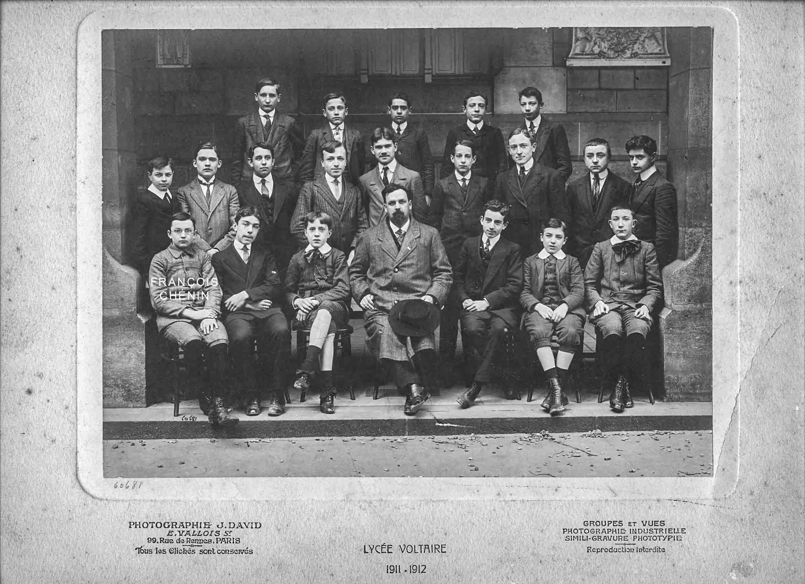

# ÉMILE MOSELLY PAR SON FILS FRANÇOIS CHÉNIN 
(Source : Carnets de François Chénin, 1928)

François Chénin, né le 11 novembre 1898 à Paris, mort à Nancy le 14 juillet 1967, est le fils ainé d’Émile Moselly. Ingénieur des Mines, il a fait toute sa carrière aux Houillères du Bassin de Lorraine.

3.6.28

## UN PÈRE

Je ne crois pas qu’un père se soit jamais, plus que lui, préoccupé de façonner ses enfants à son image, et ait su, avec plus de simplicité, leur enseigner l’amour de la pure beauté, beauté des champs, beauté de l’art, la pitié pour qui peine et souffre, la haine et le dédain pour qui profite, l’orgueil aussi de leur valeur et de leur race. Il n’a pas seulement créé nos chairs ; il a aussi créé nos esprits et nos cœurs. Je suis son disciple fervent : à ce titre je puis parler. D’autres diront, quand la vie leur sera moins trépidante, ce que furent sa jeunesse et son âge dans le monde ; d’autres préciseront ce que sa sensibilité n’a pas fixé. Peut-être peu de chose, car l’extérieur l’atteignait avec une telle violence que son œuvre est son existence même ; beaucoup pourtant, si l’on considère ce qu’il y avait pour lui dans une minute de l’éternelle durée. Pour moi, je veux simplement le peindre tel que je l’ai connu, jusqu’à ma vingtième année.

⁂

## ROUEN

Il n’y resta qu’une courte année, d’octobre 1910 à juillet 1911 ; il était déjà assombri par des deuils encore récents, la mort de ma jeune sœur succédant de près à la mort de son père ; il y fut de longs mois malade d’une grave congestion pulmonaire ; c’est cependant un des coins de France qu’il évoquait avec le plus d’émotion.
Il aimait la petite maison de la rue du Champ-des-Oiseaux où il y avait tant de repos. La rue montait, pavée de grés irréguliers ; à gauche on laissait une modeste église de paroisse, toute simple, qui s’était cachée dans ce coin reculé, loin de la splendeur des cathédrales. La maison était au bout d’une longue allée, masquée de la rue par d’autres bâtisses. Le jardin, minuscule, s’agrandissait d’une unique pelouse qu’encerclait une allée. Des massifs de fusains et de seringats, serrés contre les murs, l’étendaient de leurs touffes épaisses et hautes. Deux grands arbres, dans le fond, créaient un parc. Il en aimait le calme, et la vie sauvage qui s’y abritait ; pour qui a grandi dans le silence des champs, il n’y a de tranquille repos et de joie que si un brin d’herbe s’agite au vent, si le pied peut toucher un peu de vraie terre, si des feuilles mortes s’amoncellent sous les arbustes, où se tissent des toiles d’araignée. Il aimait ce jardin ; il aimait et il admirait avec presque un peu de pitié pour sa Lorraine qu’il chérissait, mais savait plus pauvre et moins magnifique, et la ville, et le port, et les campagnes.

La ville - Saint-Maclou, la Grosse Horloge, le Palais de Justice - Nous nous en allions par les rues ; j’allongeais le pas pour rester à ses côtés ; un jeune chien sans race, mais dont les yeux étaient pleins d’adoration et de lumière, gambadait autour de nous. Soudain, à quelque distance d’un de ces poèmes de pierre dont Rouen abonde, tout le groupe s’immobilisait. Mon père restait de longs moments immobile, à contempler les architectures de ceux qui furent, jadis, des maîtres. Il se mêlait à son admiration une joie, que des hommes, qu’il sentait, comme lui et les siens, tout près du peuple, des artisans, des ouvriers, simples et intelligents, comme ceux dont il recherchait volontiers la conversation au hasard d’une promenade, d’un voisinage de train ou de tramway, aient su ainsi prouver la jeunesse et l’enthousiasme de leur cœur. La gravité de son visage, que nous guettions avec ferveur, le jeune chien et moi, et le léger étranglement de sa voix lorsqu’il me disait enfin : « Viens », étaient la plus précieuse leçon d’esthétique. Était-ce une moins bonne leçon que le sourire ironique, jeune et presque gamin qu’il avait pour répéter la boutade qu’il attribuait, je crois, à Anatole France, sur la nécessité d’un attentat anarchiste ou d’une petite Commune pour débarrasser Paris du Grand-Palais et du Pont Alexandre III ?

## LE PORT
C’étaient des heures de lente flânerie, par le grand soleil qui faisait sortir des quais une chaleur de four, au milieu des voies de triage, des wagons, des entassements de cellulose, de bois, des sacs de blé, des tonnes de charbon. Chaque cargo était pour lui la nostalgie d’un pays lointain, qu’il ne verrait pas et qu’il me décrivait en termes simples. Il cherchait aussi quelquefois à bavarder avec les hommes d’équipage, les portefaix, les pointeurs, dont il m’expliquait émerveillé le rôle délicat et les hauts salaires. La complexité mécanique du monde moderne était pour lui une perpétuelle féérie, et, rien ne l’intéressait plus que la science qu’il connaissait si mal. Tout jeune écolier que j’étais, j’avais alors des professeurs de géologie et de géographie qui savaient faire vivre pour moi la vaste terre, et j’apprenais bien studieusement mes leçons. Quelle surprise et quelle fierté pour moi de voir mon père s’intéresser si vivement aux pauvres phrases que j’ânonnais. L’admiration qu’il eut toujours pour l’œuvre puissante de Rosny l’Ainé, et qu’il m’a fait connaître avec tant de joie, était mêlée d’une sorte d’émerveillement, à voir ce thaumaturge jongler avec les hypothèses cellulaires et cosmogoniques. Je me souviens qu’il me raconta un jour avec émotion une conversation avec le Maître, d’où il était sorti ébloui, et il n’était pas bien sûr d’avoir payé, même très modestement, son écot, en expliquant de sa voix claire à l’auteur des Rafales les beautés de la langue grecque que mon père adorait et que Rosny ignore. Plus tard, j’étais heureux lorsque je rentrais du lycée avec des notions - combien vagues - sur quelque belle découverte, la synthèse des nitrates ou les ondes hertziennes. Il était content d’écouter le piètre récit de ces fééries. Maintenant encore, lorsque quelque invention moderne m’émerveille – mon métier m’a obligé à me soucier plus des sciences que lui - , lorsque les récentes théories atomiques me font songer à Épicure, lorsqu’un physicien trouve une astuce pour l’utilisation de la houille bleue, je prépare machinalement les phrases claires qu’il écouterait avec tant de joie, et son absence m’est, plus que jamais, lourde.

⁂
 

## LA CAMPAGNE
Bon Secours, Canteleu, Roumare, la forêt de Rouvray, Jumièges et Croisset - Quatre forêts, dont chacune a son individualité ; une campagne grasse et riche, qui vient plonger jusqu’au-dessus de la ville, des hameaux silencieux, de grandes ruines et de grands souvenirs ; au milieu de tout cela, la Seine, aux boucles lentes et larges, où les îles s’en vont lentement à la dérive, tandis que passent les lourds bateaux. Chaque journée de liberté nous voyait arpentant d’un pas ferme les grandes routes blanches ; ces grandes promenades à pied avaient ses préférences, et nous restions parfois de longues heures, silencieux, tout à l’ivresse de la marche. Il respirait largement, rejeté en arrière, et regardait les horizons changer devant lui. D’un mot, il m’indiquait les nappes d’or lointaines sur le fleuve ou la senteur des fougères dans les hêtraies. Il buvait avidement tout cela. Et puis il était dans le pays de Flaubert et de Maupassant, ses maîtres, et je crois que rien ne le frappait davantage. J’étais trop jeune, et de cela il ne me parlait guère. Quand le bateau la dépassait, il me montrait la maison blanche de Flaubert, à Croisset. Un jour que nous descendions la côte de Canteleu, il me dit : « Maupassant en parle dans un de ses romans. » Maintenant je comprends mieux tout cela, et je crois qu’il était constamment enivré de cette campagne, où la carriole qui passe peut transporter un petit fût, où chaque tourant de route montre, entouré de son fossé, un château qui peut être celui d’Une Vie, où l’on aperçoit parfois au fond d’une valleuse quelque hobereau à cheval, sans doute trottant vers le rendez-vous d’une Emma Bovary.
Je m’en souviens bien : c’est sur la côte de Bonsecours, après m’avoir montré de loin le petit cimetière à flanc de colline : « Tu vois, la tombe de Heredia est là ; il a de la chance » et son regard embrassait l’étendue, la ville d’où pointaient les tours, l’horizon des collines derrière elles, la grande plaine de fumées et d’usines vers le Sud, les masses lointaines de la forêt de Rouvray, pour revenir à nos pieds vers le ruban étincelant du fleuve. C’est donc, alors que nous nous reposions dans un grand pré qu’il y avait à cette époque sur le flanc ouest de la colline, presque au sommet, qu’il me raconta l’anecdote bien connue qui avait été, je crois, pour lui un article de foi : « Maupassant venait voir Flaubert. Flaubert lui disait : "Tu vas t’en aller dans la campagne, pendant une heure n’importe où. Quand tu reviendras, tu prendras une feuille de papier, pas plus. Mais souviens-toi qu’il n’y pas deux arbres pareils et qu’on doit le comprendre en te lisant." » Puis mon père ajoutait : « Maupassant a bien suivi les leçons, et il était doué. Mais il a gagné trop d’argent, et il en avait besoin. Alors il a écrit Notre cœur. » Paroles que j’ai retenues sans bien les comprendre alors, mais que sont venues illustrer, plus tard, d’une caricature si violente, les pages de Mirbeau dans La 628 E8* (* La 628-E8 est un récit d’Octave Mirbeau paru chez Fasquelle en novembre 1907. Objet littéraire non identifié, ce récit de 416 pages est dédié au constructeur de l’automobile de Mirbeau, l’Angevin Fernand Charron. Sa voiture une Charron C.G.V. de 1902 est justement immatriculée « 628-E8 »)
Au soir, avant de rejoindre la ville par quelque train ou quelque tramway, nous nous arrêtions dans une salle fraîche et sombre d’auberge pour lamper une bolée de « boisson » aigrelette. Quelques couples de paysans bavardaient, les coudes sur la table. Mon père s’étonnait de les trouver loquaces et rusés, si différents de nos paysans lorrains, fiers et taciturnes.
Après sa congestion pulmonaire, il ne put reprendre que peu à peu ses longues promenades. C’est une des premières promenades, un soir du début de mai, que je me rappelle le mieux. Nous avions simplement suivi vers, je crois, Bihorel, le chemin des champs qui continuait la rue du Champ-des-Oiseaux. Les talus étaient parés d’une herbe jeune et tendre, où se piquent les étoiles d’or des ficaires. Dans le soir qui tombait, à peine dans la campagne, nous nous sommes retournés pour regarder la ville, qui s’apaisait dans le soir tombant. La voûte du ciel s’emplissait d’étoiles qui paraissaient toutes neuves, après les semaines de nuages et de pluies. Il me parla longuement. Il fut question un moment de la fameuse théorie de Blanqui sur la pluralité des mondes, et cette théorie, qui semble assez enfantine, lui était un merveilleux symbole d’infini et d’humilité. Il me montra le peu que nous sommes, puis me parla de la dignité humaine, me fit comprendre quelles choses valaient la peine d’être vécues, et quelles non, et me montra les leurres des cités impures. Tout entier en lui, nous revînmes dans le soir.
De ce passé, comme il reste peu de choses, malgré les notes de son journal, nos souvenirs, et les petites photographies qu’il aimait à prendre, par les jours de soleil.

⁂

## LORRAINE

4.6.28

Que peuvent ici ajouter mes souvenirs à tant de pages écrites avec amour ? Celles qu’il a publiées ne sont pas les plus nombreuses. Et ses impressions de chaque jour emplissent de gros cahiers. Là il ne découvrait rien, mais il retrouvait à chaque pas tant d’émotion et tant de passé.

10.6.28

Où qu’il fut, il attendait avec impatience les mois de vacances, qui le ramèneraient à Chaudeney. Il se retrouvait enfin sous les poutres de la vieille cuisine, entre ses parents. Les dernières années furent les plus tristes : son père mourut à la fin de l’automne 1908. Il ne restait plus que ma vieille grand-mère. Cependant c’était le foyer. Les jours dès lors passaient pleins et rapides. Nous étions dans un grand repos. Lorsque les semaines étaient belles, nous passions presque toutes nos journées au bord de la Moselle, dans le calme de la pêche. Chaque pas le long de la rive réveillait des souvenirs. Il me dépeignait les années anciennes, où la voie ferrée ne barrait pas, de son dur remblai, la vallée, où le canal ne renfermait pas la Moselle entre deux rives, les étangs, les bras morts, le fouillis des arbres et des roseaux.

Les matins étaient clairs et les soirs étaient calmes. Il se reposait pleinement, parlait peu, construisait et méditait, à certains jours. D’autres fois, il se liait et se mêlait au peuple des pêcheurs, les vieux du village, qui s’installent, solitaires, dans leur coin, ou les bandes d’amateurs venues de Nancy ou de Toul. Il riait haut aux bonnes histoires. Il pêchait surtout le chevesne, à la ligne flottante et au moulinet, avec une noquette de chènevis, un petit croûton, comme on dit. Il guettait de longues heures la touche rapide du poisson et était heureux lorsque la lutte était longue pour ramener le bouccet bien ferré jusqu’à l’épuisette. Les dernières années, nous avions une barque, une lourde barque de pêche en chêne, commandée à Valcourt. Je me rappelle la joie du soir où nous l’avons ramenée. Elle étendait les possibilités, et nous avons passé des heures silencieuses et belles, accrochés en quelque point de la rive, séparés du bord par la haie des roseaux, ou au cœur de la Morte de l’Ile aux Charmes, un étang plein de nénuphars, de grenouilles, de plantes et de gibier d’eau, qu’un ponceau sépare de la Moselle, et qui longe la route de Toul à Pierre-la-Treiche. Nous avions des matins de rosée, où la rivière fumait, des couchants radieux d’été ou tourmentés d’automne. Je ne veux pas les décrire après lui, mais il se retrempait dans cette beauté comme Antée reprenait ses forces au contact de la Terre Mère.
Lorsque les vents contraires ridaient l’eau de lames parallèles incessamment renouvelées, lorsque la pluie trop forte emplissait la vallée de son brouillard, lorsque, plus simplement, le poisson rebelle restait de longs jours récalcitrant, il fallait chercher d’autres occupations.

⁂

## LES PROMENADES
Les bois - Le village - 
La maison.

13.6.28

Alors nous montions vers les bois, pour de grandes promenades. Du haut du plateau, on découvrait les monts proches, Toul, les Côtes-de-Meuse. Il me nommait les villages, Dontgermain, Charmes ; puis, plus au Sud, jusque vers la trouée de Neufchâteau. Au Nord, le long éperon de Lucey. Il me dépeignait les forts cachés sous la ligne bleue, et souvent sa pensée revenait vers les jours de son volontariat, passés dans le camp retranché. Il se plaisait à en décrire le mécanisme compliqué, les tourelles, le Decauville, les points d’eau. Il y avait toujours en lui, à ce moment, beaucoup d’amertume. Puis il revenait longuement aux champs proches, aux quelques vignes, tachant encore les côteaux, au clocher, dépassant de peu les vallonnements lents, au ruban clair de la Moselle qui s’arrondissait, par-delà les grands prés, au pied des côtes. Nous marchions d’un bon pas, sur les routes blanches. Il m’apprenait des chansons de route, de vieux refrains entrainants, et les airs scandaient la promenade. Je courais ici et là pour lui ramener quelque fleur, de ces fleurs qui bordent les chemins et dont on ne connait guère que l’aspect d’ensemble, mais dont le détail révèle tant de symétrie et d’air, une linaire de Pélissier à la gorge blanche striée de violet, un lychnis à doubles fleurs. Et j’étais content de lui apprendre que c’était là le « compagnon blanc » et lui montrer les enchevêtrements de la Bryone, le « Navet-du-Diable », fleur de sorcellerie.
Ainsi les heures passaient, toutes de calme et de joie. Quelquefois nos promenades étaient plus lointaines, quittaient le cadre cher et connu, pour des expéditions qui nous semblaient lointaines, le Val-Dormant, Sexey-aux-Forges, la route de Marron à Liverdun. Mais il fallait beaucoup de courage pour s’en aller aussi loin, et nous n’étions pas moins contents lorsqu’un prétexte valable autorisait de courtes courses.
L’ancien instituteur du village, M. Pierron, qui y avait pris sa retraite - c’est le rêve de beaucoup qui y ont séjourné que de venir habiter Chaudeney le jour où ils seront délivrés des soucis et quelques-uns le réalisent - avait appris à mon père à connaître d’autres champignons que les mousserons, les colombelles et les jaunottes, que connait chaque paysan de chez nous. Et, lorsqu’une grande pluie avait fécondé la forêt surchauffée, nous n’avions pas de plus grand plaisir que de courir les coupes, à la recherche des pieds-rouges, des cèpes, des trompettes des morts. Le filet s’alourdissait peu à peu, et nous riions de nos découvertes. Parfois un gros orage nous surprenait. Nous nous émerveillions quelque temps du couvert efficace des branches, tandis que les rafales noyaient les fonds proches et entrevus à travers les arbres. Mais le plus souvent, il fallait regagner le logis sous une pluie battante, nous changer et nous 
réchauffer autour de la grande cuisinière.
Il aimait pourtant ne pas rester trop tard et se trouver au village à l’heure où le jour tombe et où, après la journée passée aux champs, les voisins s’attardent sur le pas des portes, sur les bancs devant les fenêtres, discutant du temps, des récoltes ou se répétant avec malice quelque potin du village. Il allait s’asseoir auprès de l’un d’eux, pour de longs bavardages où il retrouvait toute sa vie de jadis, dont il ne restait plus que de courts aperçus. Ma sœur et moi courions dans la rue avec les autres enfants, et, de temps en temps, venions le retrouver. Il s’attardait. Et il devait éprouver un étrange sentiment de mélancolie et d’orgueil, lorsque ma grand-mère - ou ma mère, prise aussi par la simplicité de cette existence - l’appelaient dans la rue devenue noire, pour le dîner : « Émile ».
Bien des choses étaient effacées, qui n’étaient pas celles auxquelles il tenait le plus. Il fallait de longs jours de mauvais temps, des semaines tout entières maussades, pour qu’il se décidât, dans le grand bureau clair qu’il s’était fait construire, à s’installer à la grande table de dessin, que nous a laissée mon grand-père, et à écrire tout ce qui était en lui. Il considérait ces mois comme des mois de repos et de travail tout à la fois. Il y composait ses œuvres plus qu’il ne les écrivait. Il était de la lignée qui ne se décide à fixer une phrase que lorsque sa forme est déjà définitivement arrêtée. Et les jours de travail acharné de l’hiver suivant étaient simplement la transcription des pages composées dans le loisir, le calme et le repos. C’est ce qui explique le peu de ratures qu’on trouve dans ses manuscrits ; il corrigeait beaucoup, mais sur épreuves. C’étaient des jours où nous ne le voyions guère, errants dans la maison assombrie à la recherche de quelque occupation, guettant les éclaircies à la vitre, bâtissant quelque barrage dans le ruisseau, ou engagés dans quelque dispute fraternelle qui dérangeait toute la maison.

⁂

## LA GUERRE

14.6.28

Ce fut, je crois, le mardi de la dernière semaine de Juillet, que nous nous décidâmes enfin à partir pour Chaudeney. Déjà les foules s’attroupaient sur les boulevards et nous étions restés toute une après-midi à suivre les nouvelles, sur les transparents du « Matin ». Les journées furent chaudes et splendides. Le village dormait encore dans le calme, mais les conversations inquiètes grandissaient tandis que je pêchais des ablettes, sous un grand soleil lourd, mon père bavardait avec les pêcheurs voisins, et les soucis s’appesantissaient. Il m’avait acheté cette année-là, quelques jours après le bachot, une magnifique canne « à lancer », et déjà je m’exerçais à jeter le plomb loin dans les prés.
Le jeudi, nous apprenions que les régiments de Toul partaient pour la frontière. Le vendredi, après des paquets faits à la hâte, grand-mère décidée à grand peine à quitter la vieille maison, après un dernier regard sur tout cela que nous n’espérions plus revoir, un des derniers trains réguliers de voyageurs, lent au milieu des convois de troupes, de matériel, et de ravitaillement, nous ramenait à Paris. Eut-il alors l’idée qu’il ne reverrait plus sa Lorraine ? Je crois surtout qu’il s’attendait à la retrouver broyée, déchiquetée dès les premiers jours de la guerre, et déjà tout ce paysage n’était plus à nos yeux que des ruines.
Domicilié à Chaudeney, il rejoignait le premier jour et nous l’accompagnâmes à la gare, le dimanche matin. Il était encore sous le coup de la mort de Jaurès, qui l’avait terrassé autant qu’un deuil personnel. Il s’en allait, pour quels temps et vers quel destin. Nos âmes étaient frappées de stupeur, comme celles de la foule, et de tout le peuple, et ces heures encore me paraissent tenir du rêve.
Deux jours plus tard, il nous revenait, avec une joie amère. Son cœur affolé, dans les terribles émotions de ces jours, le rendaient incapable de toute action, de tout service. Avec quel sourire navré il nous regardait pour dire : « Le major m’a ausculté », puis : « Nous n’avons pas besoin de gens comme vous, en ce moment, qu’il faudrait soigner. » Il était content au-delà de toute expression de retrouver sa femme, ses enfants, qu’il avait cru, pour combien, ne plus revoir. Sans doute il savait bien qu’à son âge, 44 ans, dans son arme d’artilleur de forteresse, il ne pourrait rendre que de bien piètres services. N’importe, il souffrait, indiciblement, de se sentir, absolument, dans le grand concours, un inutile.
D’autres fois, sans nulle suite, comme venaient les associations d’idées, il parlait longuement. Me racontait les belles légendes et les belles œuvres : la joie burlesque d’Héraclès hôte d’Alceste, sa stupeur lorsqu’il apprend le deuil de la maison, et la gaillarde bravoure avec laquelle il réconforte le pauvre roi, et descend aux Enfers - Une grosse plaisanterie d’Aristophane - La fameuse histoire du Jérimadeth de Hugo - La vie terrible de Berlioz ou le triomphe tardif de Bizet - Nous discutions ferme quelque auteur qu’il venait de me faire découvrir récemment, Paul Adam ou Alain-Fournier. Ainsi peu à peu il emplissait mon univers de belles choses.
Il aurait compris, je pense, la boutade tragique de Pierre Dominique (je cite de mémoire) : « *Ils reprirent leur route vers les morts comme les aiment les hommes de ce temps, qui craignent avec vivacité d’être trop nombreux sur la terre.* » Mais il en aurait été violemment attristé. Il aurait sans doute gardé sa gaieté robuste et sa joie d’être, de sentir, sa fierté d’aimer, d’admirer, de créer, mais sans doute se serait-il assombri davantage dans ce monde où tout ce qui fut lui, la pitié pour ce qui souffre, le respect de l’amour de la vie, de la beauté et de l’art tiennent si peu de place.

⁂

16.6.28

Dès lors il ne fut plus ce qu’il était.
Il est difficile aux jeunes générations de comprendre ce que fut, pour nos aînés, la guerre, et quels écroulements de rêves, quel renversement de toute une vie, quelle destruction d’espérances, provoquèrent les premiers coups de canon. A tel point que beaucoup ne renoncèrent pas. Je nommerai Chauvelin, mon professeur de première, homme remarquable, orateur puissant, professeur prenant qui nous entrainait à sa suite vers les rêves les plus utopiques et les plus généreux : celui-là ne voulut pas croire à l’importance de la guerre, et rêva, dès lors, au-delà des tueries, à une continuation d’humanité plus sage et plus heureuse. Il m’écrivait, dès 1916 : « Guerre énorme, mais pas grande. » Ne nous semble-t-il pas maintenant qu’il n’avait peut-être pas tout à fait tort ? Et il eut le droit de parler ainsi : deux de ses fils, garçons d’avenir formés à son image, moururent au front ou des suites de leurs blessures. A d’autres on peut dénier le droit de parler comme ils firent, et d’avoir mêlé un intérêt personnel à des phrases de concorde et de paix, mais pas à lui.
Mon père ne fut pas de ceux-là ; il accepta, total, l’effondrement de toutes ses illusions. Mais avec quelle amertume et quels déchirements. Et il ne se préoccupa plus que d’une chose ; comme il le pouvait, servir.
Pauvre illusion que nos promenades de gardes civiques, le soir, en banlieue, avec un bâton à la main ; ce léger simulacre était une joie pour lui.
Plus tard il put faire mieux. Des articles, un livre, tout ce qu’il put écrire pour, l’expression est consacrée, maintenir le moral, il le fit. Il essaya de le faire le mieux qu’il put, et de n’être pas trop un bourreur de crânes. D’aucuns, de ses amis même, lui ont reproché une œuvre - écrite avec colère et haine - contre l’Allemand cf le journal de Gottfried Mauser. Ne devait-il pas y voir le réveil plein de rage et de douleur, l’irritation infinie contre ceux qui avaient brisé ses rêves ? S’il avait pu penser que cela put épargner le sang d’un seul soldat français - lui qui ne put jamais chasser - je crois bien qu’il aurait écrit pire encore, et que des mensonges même ne lui eussent rien coûté. Du moins jamais ne consentit-il à prendre les côtés chevaleresques et nobles de la guerre ; il ne vit jamais dans le chevaleresque et l’épopée que soudards, égorgements et boucherie. Il ne crut jamais, et ne dit jamais que la guerre était noble.
Il sut même rester gai, entraînant, et goûter les mois de repos qu’il passait, en des coins divers de France, en pleine nature. Il sut faire à ses élèves une classe gaie, optimiste, pleine de foi en une victoire, dont il douta bien des fois. Il fut la proie, en son esprit plein d’imagination, prêt à amplifier, à voir et à créer les réalités, de tous les bruits de victoire et de défaite, de toutes les rumeurs, de tous les on-dit. Et sa souffrance s’augmentait de tous les mois d’horreur accumulés, de tous ces gaspillages d’une vie qu’il vénérait plus que toutes choses.
Je m’engageai vers la fin de 1917, lorsque mes 18 ans approchèrent ; il eut le chagrin de me voir partir, peut-être un peu consolé par mon 
affectation à l’artillerie lourde : je n’osai pas lui désobéir davantage.
C’est à la fin de Juillet 1918, pendant toute une permission que je passais auprès de lui au bord de la mer, dans un beau coin de Bretagne, que je le vis pour la dernière fois. J’étais fier de mes galons de sous-lieutenant tout neufs, et j’oscillais entre la crainte de l’effrayer et l’ennui de ne pas paraître, malgré tout, un peu, un héros. Triste vanité d’enfant qui m’a peut-être porté à des précisions inutiles, et dont chaque mot devait être, pour lui, une douleur. Pourtant il entrevoyait déjà la fin heureuse du cauchemar ; mais il n’osait pas tout à fait y croire. Au bout de mes 10 jours, il vint me reconduire à la petite gare de Pont-l’Abbé. Le petit train s’en allait doucement. Je restai à la portière aussi longtemps que je l’aperçus, immobile et souriant, sur le quai désert. Comme à chacun de mes départs, il y avait un peu en nous l’angoisse de l’inconnu ; mais je ne pensais pas alors que ce fut lui qui put disparaître.
Je ne l’ai plus revu. Un mois avant l’armistice, j’étais sur sa tombe, dans le petit cimetière de Kerentrech, à Lorient, au milieu des prés et des arbres, là où je revins le chercher, une année plus tard, pour le ramener dans sa Lorraine, chez lui, dans le cimetière de village dominant la vallée, auprès des prés et des champs qui furent toute sa vie.
Dans la joie de la paix, de la délivrance que fut le 11 Novembre, quelle amertume il y eut pour les miens et pour moi à ne pas l’avoir à nos côtés. C’est encore un déchirement atroce que de penser qu’il ne connut pas la victoire, le jour où chacun enfin put respirer, le jour où le monde entier entonna les « Hosannah. »
Faut-il dire, hélas, que, si à chaque évènement je l’associe à mes pensées pour y penser avec lui, je me dis quelquefois qu’il y aurait encore eu pour lui, en même temps que de grandes joies, et celle surtout de voir dans la paix les campagnes renaître, et le soleil luire sur des champs silencieux et de nouveau fertiles, de grandes amertumes et de grands soucis ?
Aurait-il aimé sans étonnement ces temps si durs et si vides d’idéal, où tant de contradictions nous brûlent ? Il aurait compris…

⁂

9.7.28 - Travailler, pour lui. Ne pas croire que l’imiter est le meilleur moyen de le servir.

 

