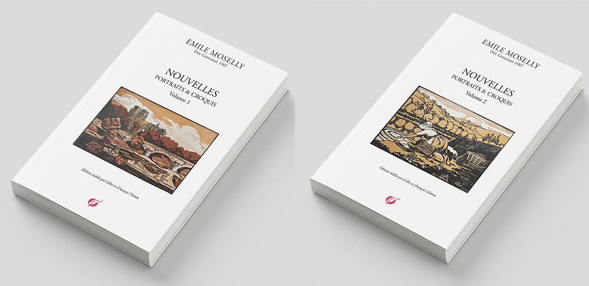

Les nouvelles marquées V.1 ou V.2 ont été regroupées dans deux volumes parus chez TheBookEdition - V.1 : Nouvelles V.1 2023 – V.2 :  Nouvelles V.2 2023

---

_A la belle étoile_ | Jean des Brebis - Cahiers de la Quinzaine 1904 / Plon-Nourrit 1907
_Au rancart_ V.1a vie lorraine, Contes de la route et de l'eau - Les Pays de France 1907 V.1
_Bautru, soldat_ V.1 La France Nouvelle, Revue de l'Union française  1918 V.2
_Berceuse inquiète_ | Contes de guerre pour Jean-Pierre - Revue France, Berget-Levrault 1918 V.2
_Bétail à vendre_ V.1 La charrue d'érable - Le livre contemporain 1912
_Bonne dame_ V.1 Le Rouet d'ivoire - Cahiers de la Quinzaine 1907 / le Pays Lorrain 1908 / Plon-Nourrit 1908
_Buveur de sang_ | Archives familiales 1916 ou 1917 V.2
_Canons de Lorraine_ V.1a Revue bleue Avril 1915 V.2
_Colin Michelot_ V.1 Le Rouet d'ivoire - Cahiers de la Quinzaine 1907 / le Pays Lorrain 1908 / Plon-Nourrit 1908
_Cri-Cri_ | Jean des Brebis - Cahiers de la Quinzaine 1904 / Plon-Nourrit 1907
_Dans le matin clair_ | Archives familiales 1916 ou 1917 V.2
_Dernier séjour en Lorraine_ V.1 Le Pays Lorrain Juillet 1931 (Ecrit en 1914, resté inédit) V.2
_Deux vieux_ V.1 Le Rouet d'ivoire - Cahiers de la Quinzaine 1907 / le Pays Lorrain 1908 / Plon-Nourrit 1908
_Existences imaginaires_ V.1 Le Pays Lorrain juillet 1924 (Inédit de mai 1916) V.2
_Fantasmagorie_ V.1 Le Rouet d'ivoire - Cahiers de la Quinzaine 1907 / le Pays Lorrain 1908 / Plon-Nourrit 1908
_Goëry Coquart de René Perrout_ V.1 Le Pays Lorrain 1907
_Guy de Maupassant_ V.1 La Revue bleue 1914
_Hein_ V.1 L'Humanité du 02-05-1910 V.1
_Herbes coupées_ V.1 La Charrue d'érable - Le livre contemporain 1912
_Impressions lorraines_ - Mon village V.1 Le Pays Lorrain 1921 / Les Cahiers d'Emile Moselly 2022
_Jean des Brebis_ | Jean des Brebis - Cahiers de la Quinzaine 1904 / Plon-Nourrit 1907
_Jean-Pierre et le soldat_ | Contes de guerre pour Jean-Pierre - Revue France, Berget-Levrault 1918
_L'agace_ V.1 La Grande Revue 10-03-1910 V.1
_L'apaisement_ V.1 Le Pays Lorrain 1914 / Dernier chapitre de Les étudiants - Ollendorf 1914
_L'assomption du passeur_ V.1 Le Pays Lorrain 1928 / La revue bleue 12 février 1910 / Projet Vendanges lorraines 1913 V.2
_L'auberge de la mère Marie_ V.1 Le Pays Lorrain 1928 / Projet Vendanges lorraines 1913 V.2
_L'eau de Pagney_ V.1 Le Rouet d'ivoire - Cahiers de la Quinzaine 1907 / le Pays Lorrain 1908 / Plon-Nourrit 1908  / En Lorraine par sentiers et venelles 1937
_L'église_ V.1 Le Rouet d'ivoire - Cahiers de la Quinzaine 1907 / le Pays Lorrain 1908 / Plon-Nourrit 1908
_L'hôte muet_ V.1 Le Rouet d'ivoire - Cahiers de la Quinzaine 1907 / le Pays Lorrain 1908 / Plon-Nourrit 1908
_L'ogre et le petit poucet_ | Contes de guerre pour Jean-Pierre - Revue France, Berget-Levrault 1918
_L'usurier_ V.1 Le Pays Lorrain 1928 / Projet Vendanges lorraines 1913 V.2
_La Babette_ V.1 Le Rouet d'ivoire - Cahiers de la Quinzaine 1907 / le Pays Lorrain 1908 / Plon-Nourrit 1908
_La baratte_ V.1 La Charrue d'érable - Le livre contemporain 1912 / le Pays Lorrain 1912 V.2
_La cheminée lorraine_ V.1 Le Rouet d'ivoire - Cahiers de la Quinzaine 1907 / le Pays Lorrain 1908 / Plon-Nourrit 1908
_La corbeille d'écus_ V.1 Le Pays Lorrain 1928 / Projet Vendanges lorraines 1913 V.2
_La femme de Maître Corniolle_ V.1 Le Pays Lorrain 1928 / Projet Vendanges lorraines 1913 V.2
_La femme du garde_ V.1 La Revue bleue 21 janvier 1911 V.2
_La futaille_ | Archives familiales 1913 ou 1914 V.2
_La Griote_ V.1 La Revue bleue Avril 1908 V.1
_La joie_ V.1 Le Rouet d'ivoire - Cahiers de la Quinzaine 1907 / le Pays Lorrain 1908 / Plon-Nourrit 1908
La layette V.1'Humanité du 07-03-1910 V.2
_La maison d'école_ V.1 Le Rouet d'ivoire - Cahiers de la Quinzaine 1907 / le Pays Lorrain 1908 / Plon-Nourrit 1908
_La matelote du Père Bigeard_ | Chronique sur l'art du bien manger de Richardin, L'Est Républicain 1 juillet 1911
_La moisson_ V.1 La Charrue d’érable - Le livre contemporain 1912 / Bibliothèque universelle juin 1913 V.2
_La mort du bouif_ | Jean des Brebis - Cahiers de la Quinzaine 1904 / Plon-Nourrit 1907
_La noce normande_ V.1 La Charrue d’érable - Le livre contemporain 1912 V.2
_La nuit lorraine_ V.1 Le Pays Lorrain 1928 / Projet Vendanges lorraines 1913 V.2
_La pêche miraculeuse_ V.1a Revue hebdomadaire 03-12-1910 V.2
_La petite fille de Noyon_ | Contes de guerre pour Jean-Pierre - Revue France, Berget-Levrault 1918
_La rencontre_ V.1 L'Humanité du 21-02-1910 V.2
_La vie de l'eau_ V.1 Le Rouet d'ivoire - Cahiers de la Quinzaine 1907 / le Pays Lorrain 1908 / Plon-Nourrit 1908
_La vie et la mort de Bonnard_ V.1 L'Humanité 10/05/1911 V.2
_La vision du Père Huot_ V.1 La Revue universelle et Revue suisse juillet septembre 1912 V.2
_Labour_ V.1 La Charrue d’érable - Le livre contemporain 1912
_Lavandière nocturne_ V.1 La Charrue d’érable - Le livre contemporain 1912
_Le boche de Jean-Pierre_ | Contes de guerre pour Jean-Pierre - Revue France, Berget-Levrault 1918
_Le budgetivore_ V.1 L'Humanité du 24-01-1910 V.2
_Le chien_ | Revue l'Illustré National du 10-01-1909 V.2
_Le conte du beau temps_ V.1 Le Rouet d'ivoire - Cahiers de la Quinzaine 1907 / le Pays Lorrain 1908 / Plon-Nourrit 1908
_Le crime de l'Allemagne_ V.1 La Revue bleue 18-06-1917 V.2
_Le député_ V.1 Le Matin du 12-10-1908 V.2
_Le fossoyeur_ V.1 La Grande Revue 10-02-1908 V.1
_Le loup du père Pastourelle_ V.1 le Pays Lorrain 1913 V.2
_Le Millénaire normand_ (article) | Excelsior - Journal illustré quotidien - 11 janvier 1911
_Le miracle de Saint Vincent_ V.1 Le Pays Lorrain 25-02-1905 / l'Humanité du 21-03-1910 V.1
_Le nourrisson de Madame Virginie_ V.1 La Revue hebdomadaire 25-04-1908 V.1
_Le père vipère_ V.1 Le Pays Lorrain 1907 / La vie lorraine, Contes de la route et de l'eau - Les Pays de France 1907 V.1
_Le retour ou le soldat_ V.1 Le Pays Lorrain 25-04-1905 / Les retours - Cahiers de la Quinzaine 1906 / Contes de la route et de l'eau 1907 V.1
_Le revenant_ | Jean des Brebis - Cahiers de la Quinzaine 1904 / Plon-Nourrit 1907
_Le rouet d'ivoire_ V.1 Le Rouet d'ivoire - Cahiers de la Quinzaine 1907 / le Pays Lorrain 1908 / Plon-Nourrit 1908
_Le sabot de faïence_ V.1 Le Matin du 17-09-1908 V.1
_Le sac de sorbes_ V.1 Le Rouet d'ivoire - Cahiers de la Quinzaine 1907 / le Pays Lorrain 1908 / Plon-Nourrit 1908
_Le songe de la Pentecôte_ V.1 La Grande Revue 10-10-1908 V.1
_Le trompion_ | Jean des Brebis - Cahiers de la Quinzaine 1904 / Plon-Nourrit 1907
_Les canards_ V.1 Le Matin du 12-11-1908 V.1
_Les deux Maucor_ V.1 La Revue hebdomadaire 17-10-1908 V.1
_Les haleurs_ V.1 Le Pays Lorrain 21-01-1906 / Les retours - Cahiers de la Quinzaine 1906 / Contes de la route et de l'eau 1907
_Les maraudeurs_ V.1 Le Pays Lorrain 1928 / Projet Vendanges lorraines 1913 V.2
_Les sangliers_ V.1 Le Pays Lorrain 1928 / Projet Vendanges lorraines 1913 V.2
_Les semailles_ V.1 La Charrue d’érable - Le livre contemporain 1912
_Messidor_ V.1 La Charrue d’érable - Le livre contemporain 1912
_Mon voisin_ V.1 Le Pays Lorrain 1928 / Les Cahiers d'Emile Moselly 2022
_Nausicaa_ V.1 La Revue des deux mondes - 15 janvier 1919 (remis à la Revue en septembre 1918) V.2
_Nuit de Noël_ V.1 Le Rouet d'ivoire - Cahiers de la Quinzaine 1907 / le Pays Lorrain 1908 / Plon-Nourrit 1908
_Nuits lorraines_ V.1 Le Rouet d'ivoire - Cahiers de la Quinzaine 1907 / le Pays Lorrain 1908 / Plon-Nourrit 1908  / Les Cahiers d'Emile Moselly 2022
_Parrain_ V.1 Le Rouet d'ivoire - Cahiers de la Quinzaine 1907 / le Pays Lorrain 1908 / Plon-Nourrit 1908
_Passage d'automne_ V.1 Le Rouet d'ivoire - Cahiers de la Quinzaine 1907 / le Pays Lorrain 1908 / Plon-Nourrit 1908
_Pauvres gens_ V.1 Le Temps du 19-01-1916 V.2
_Pèlerinage_ | Contes de guerre pour Jean-Pierre - Revue France, Berget-Levrault 1918
_Petit Brinquin_ V.1 Le Rouet d'ivoire - Cahiers de la Quinzaine 1907 / le Pays Lorrain 1908 / Plon-Nourrit 1908
_Petit Jacques_ V.1 L'Humanité du 05, 06 et 07 du 04-1911 V.2
Préface de A Jean-Pierre  | Contes de guerre pour Jean-Pierre - Revue France, Berget-Levrault 1918
_Préface de La vie lorraine_ V.1 Le Pays Lorrain 25-09-1905 / La vie lorraine, Contes de la route et de l'eau - Les Pays de France 1907
_Prélude Vendanges_ lorraines V.1 Le Pays Lorrain 1928 / Projet Vendanges lorraines 1913 V.2
_Premier maître_ V.1 Le Rouet d'ivoire - Cahiers de la Quinzaine 1907 / le Pays Lorrain 1908 / Plon-Nourrit 1908
_Premières désillusions_ V.1 Le Rouet d'ivoire - Cahiers de la Quinzaine 1907 / le Pays Lorrain 1908 / Plon-Nourrit 1908
_Prière pour nos morts_ | Revue France - 25 mai 1918 / Choix de lectures 1927 V.2
_Quelques visiteurs_ V.1 Le Rouet d'ivoire - Cahiers de la Quinzaine 1907 / le Pays Lorrain 1908 / Plon-Nourrit 1908
_Récit de guerre_ V.1 Le Rouet d'ivoire - Cahiers de la Quinzaine 1907 / le Pays Lorrain 1908 / Plon-Nourrit 1908
_René Perrout_ V.1 Le Pays Lorrain 1909
_Simple aveu_ V.1 Le Volume du 25-12-1915 / Le Temps du 30-12-1915 V.2
_Soir sur l'eau_ | Archives familiales 1913 ou 1914 V.2
_Son fï_ V.1 Le Pays Lorrain 1906 / La vie lorraine, Contes de la route et de l'eau - Les Pays de France 1907  V.1
_Sous les pommiers_ V.1 La Charrue d’érable - Le livre contemporain 1912
_Sur le tombeau d'Emmanuel Delbousquet_ | Revue l'Ame latine / hommage à l'écrivain
_Tourniquet_ | Pages libres n° 453 du 4-09-1909 / Le censeur 14-12-1907 / L'Humanité du 09, 10, 11 janvier 1908 V.2
_Un grand voyage_ V.1 Le Rouet d'ivoire - Cahiers de la Quinzaine 1907 / le Pays Lorrain 1908 / Plon-Nourrit 1908
_Un prussien d'autrefois_ | Contes de guerre pour Jean-Pierre - Revue France, Berget-Levrault 1918 / Revue la femme et l'enfant juillet 2019
_Une histoire de revenants_ V.1L Le Rouet d'ivoire - Cahiers de la Quinzaine 1907 / le Pays Lorrain 1908 / Plon-Nourrit 1908