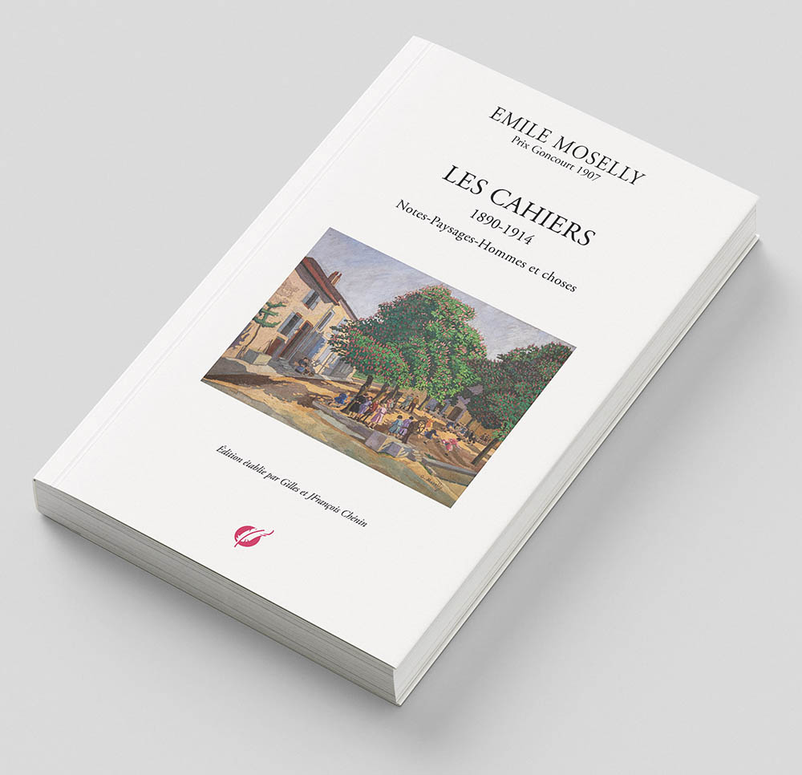

# ÉMILE MOSELLY ET LE CHANT DU PEUPLE ET DE LA TERRE
*(À propos des Cahiers, 1890-1914 - par JF Chénin)*

---

Notre grand-père, François Chénin, nous mit sur la voie de cet aïeul que nous aurions pu oublier. Il aura fallu quelques années pour renouer avec la maison familiale qu'Emile Moselly (E.M.) a si souvent décrite, où, enfant, j'avais trouvé ma place, un grand fauteuil club dans l'entre-deux en haut de l'escalier venant de la cuisine. Je m’y endormais au retour de l'école, plié en deux pour me blottir, je lisais parfois. Les livres n'étaient pas loin, serrés dans une petite armoire vitrée. J'ouvrais un livre au hasard, je lisais et chaque fois je plongeais : "_…Pourtant les beaux jours  approchent, car dans les couchers de soleil, des coulées de lumière plus chaudes se déversent de l'horizon, et dans les nuits plus claires, passent des souffles tièdes…_" (E.M.). Et chaque fois j'étais pris par le rythme de la phrase et je sentais venir en moi les sensations des images sur lesquelles l'auteur avait mis des mots. L'image, le rythme, les mots, c'est le fin mot de l'histoire de ce plaisir de lire. Et grâce à notre grand-père qui a soigneusement classé et conservé les écrits de son père (E.M.), nous avons pu pénétrer, avec _les Cahiers_, dans la fabrique littéraire d'Emile Moselly.

Il s'agit bien d'une fabrique, pleine de doutes, de silences et d'objections, une fabrique laborieuse, emplie d'un savoir littéraire longuement acquis où s'amassent les mots, les idées, les sentences  et les visions qui en naissent. Mais aussi toutes les références silencieuses qui nous font côtoyer l'indicible travail de l'écrivain. Et tous ces mots, les oublier, les dépasser et créer par soi-même en puisant dans "_son être à soi_" pour concevoir et étreindre "_la réalité si féconde en inspiration de toutes natures_". Ces Cahiers sont l'instrument de son intimité "_intellectuelle et morale_". Il ne s'épand pas, il n'est pas sentimental, il s'épanche peu  sur lui-même et les Cahiers ne sont pas un journal intime. Il s'y exerce à trouver sa voie propre, son chant/champ intellectuel, sa voix littéraire. Tout au long des souvenirs et des évocations lorraines, bretonnes, normandes ou parisiennes, explorant ses sensations et s'exerçant aux descriptions et aux portraits qu'il dessine d'une humanité souvent misérable, E.M. cherche à devenir lui-même.

Il écrit : "_Jour d'angoisse, avec l'obsédant problème de l'originalité. j'ai trop lu, je retiens trop. Oh ! ne rien savoir, se couper de tout uniment en face des choses, - avoir l'ingénuité de sensation d'un simple et les propriétés d'un artiste. Mais est-ce possible ?_" Et nous avons fait ce chemin de la création littéraire avec notre  arrière-grand-père revenant ainsi sur les lieux et dans les paysages que nous avons connus enfant, certes à une autre époque, mais encore empreints d'une beauté et d'une sérénité qu'il avait si bien décrites. Difficile de trouver le point focal de ce pays qu'il arpente de long en large, que j'ai aussi parcouru enfant quand j'habitais dans la grande maison de mon grand-père, la maison de son père. Le village ? La Moselle ? La maison ? Les voisins et voisines ? Sa famille ? La forêt ? Souvent La Rochotte et le Grand-Saulcix viennent ponctuer la géographie de ces boucles de la Moselle qu'il connait par coeur. Et même éloigné de son village, à Lyon, Montauban, Orléans, Rouen ou Paris, il sait se remémorer et évoquer les figures de son enfance, ses voisins, son instituteur, sa mère qu’il aime profondément et son père à qui il doit tant, les vignerons et très souvent les humbles de la terre auprès desquels il s’enrichit d'une humanité  empreinte d’attention et de respect.

Il est anachronique Emile Moselly ! Il est un déraciné de son temps, non pas qu'il s'acharne  à rester attaché à un passé dit "meilleur", -  il n'idéalise pas le passé, mais revendique son refus de passer d'un malheur paysan à une misère ouvrière. Il croit - comme beaucoup de son époque - au progrès mais il en redoute les leurres et les asservissements. Il sait que la pauvreté et la misère, qu'il côtoie depuis l'enfance, relèvent d’une injustice sociale que l'indifférence, l'inaction et le temps aggravent. Rien n’est plus urgent que de sortir de la terrible alternative entre la misère et la mort. Il dénonce avec véhémence les outrages de la richesse qui gaspille, rend nécessaire le  superflu et ignore ce qu'elle a tiré de l'exploitation de la misère. Il écrit : "_Mais de nos jours le patron d’usine qui ne connait pas ses ouvriers, le propriétaire de forges, qui chasse dans la Sologne ou passe l’hiver à Menton, dans un ciel que ne salit jamais la fumée de ses cheminées. Bien mieux, cet actionnaire d’industries, de mines, qui ne sait même pas où elles se trouvent, où grouillent autour des corons, autour des puits, dans les cités noires de suie, les fourmilières humaines qui se sortent le pain de la bouche pour nourrir les gras loisirs_."

E.M. ne ménage pas sa critique d'un ordre social fondamentalement injuste et que le devoir de chacun est de "sortir de sa tour d'ivoire" pour entendre ce que dit - et veut - "_l'immense pitié humaine_" dont chacun, encore, doit être comptable. Témoin d'une époque qui évolue, progresse et  se modernise, E.M. en fustige la vulgarité. Sa vision de la modernité est pessimiste et noire tant il pressent une grande partie des maux qui  se concrétisent de nos jours : destruction de la nature, pollution et gaspillage des ressources dans l'indifférence du Capital. Il trouve dans sa Lorraine, qui se transforme mais ne s'enrichit pas, les motifs et les moyens d'une écriture qui dépasse largement la vision régionaliste dans laquelle l'époque et la critique l'ont maintenu (et encore aujourd'hui). Certes la Lorraine est son coeur vivant et il sait décrire tous les visages de ceux qu'il considère comme "_un peuple_". Mais son ambition littéraire, sa raison d'écrire est de témoigner de cette humaine condition à la recherche du bonheur et de la quiétude, qui n'y parvient pas et qui retombe dans les ornières boueuses de la misère dont elle a tenté de s'extraire.

Cette humaine condition, c'est Alix Morquin, son voisin avec lequel il passe des nuits de maraude dans la campagne de Chaudeney, et qui perd toute sa vigne en raison du phylloxéra. C'est Chapiron, son camarade de collège, qui dénonce furieusement l'empoisonnement de la Moselle "_et de toute la terre_" par les usines et les produits chimiques, la disparition des poissons et de la faune alentour. C'est encore son voisin Morquin qui raconte "_sa plus belle partie de pêche_" et qui ramène dans sa trouble (filet) "_un enfant mort emmailloté de langes_". C'est "_son voisin d'en face_", "_un roublard_" comme il dit, chez qui il a trouvé, "_parce qu'il est fertile en bons mots, en dits plaisants et narquois qui lui viennent du passé, du fond de sa nature_ […], _la bonne humeur de notre peuple_". C'est  Philippe, domestique chez un riche fermier, qui perd ses deux jambes par une nuit de gel, alors forcé de mendier pour manger. C'est sa mère qui passe sa vie à remuer la terre et qui, malgré l'âpreté du temps, consent à ce que son fils soit "_envoyé aux écoles_". C'est sa fille Germaine, qui vient de naître, dont il dit : "_Et mon coeur sourd une immense pitié, parce que ce sera une femme, plus faite pour souffrir_ […] _une femme qui sera torturée dans son corps, dans son coeur, dans sa pensée_ […] _avec ce rôle qu'on lui a fait dans notre civilisation barbare._"

"_On a beau crier Egalité, Fraternité_ […]  _jamais les barrières qui séparent les hommes n'ont été plus hautes depuis qu'elles sont élevées par l'argent_" écrit E.M. Alors cette fabrique littéraire que sont _les Cahiers_ est aussi le lieu où il  raconte son apprentissage politique, où sa fibre républicaine, laïque et socialiste se confirme. "_Oui, c’est là, dans ce coin obscur de la terre de Lorraine, que c’est levée en moi, avec un grand trouble_ [...] _dans tous les organes de la pensée, cette préoccupation des questions sociales._" Et même si 

l'histoire de la littérature le classe parmi les auteurs régionalistes, comme si écrire à partir d'un lieu et de ses attachements était comme "un sous-genre" de la littérature - voire une forme de reproche, de dénonciation sous-jacente, celle du repli sur soi et du petit nationalisme identitaire des terroirs -, E.M. témoigne, bien au contraire, d'une pensée puis d'une parole à la portée émancipatrice qui se forge à partir des personnes qu'il a côtoyées et des lieux qu'il a parcourus.

Et c'est encore dans cette Lorraine qu'il trouvera les raisons d'une aventure littéraire qui, malgré sa courte durée (à peine 16 ans), le rendra maître dans l'art d'une narration impressionniste, loin du naturalisme qui s'épuise à imiter la nature ou du positivisme et des tentations scientistes de son temps, loin aussi du roman "moderne", pourtant débarrassé de sa gangue romantique, qu'il apprécie peu. Cette narration est tremblante et vivante, parfois exacerbée mais elle retrace cette profonde intimité avec sa maison, son village, la Moselle, les forêts… Alors E.M. reprend le chant de la terre qu'il connait le mieux, celui d'une nature qu'il sublime d'images, de sens et de rythmes, à travers laquelle sa vocation impressionniste se confirme. A la fois instinctif dans ses élans et cultivé dans ses réflexions, E.M. affirmera dans son œuvre cet alliage particulier de l'amour de la terre et de son peuple et la sensualité  vibrante d’une Lorraine savamment idéalisée. E.M. sait très bien qu'il n'est pas fait pour l'action et il restera indépendant à l'égard de tous les courants intellectuels et littéraires de l'époque préférant les sensations, recherchées, analysées et savourées pour ce qu'elles sont : une jouissance de l'instant, une émotion et un frisson de la vie universelle.