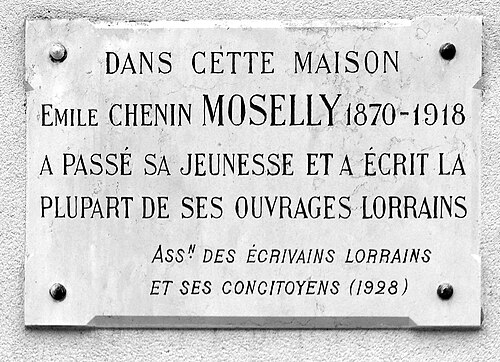

*Émile Chénin**, né à Paris le 12 août 1870 et mort à Lorient le 2 octobre 1918, est un nouvelliste et romancier français, plus connu sous le pseudonyme **Émile Moselly** qu'il prit lors de la publication de son premier livre, *L'Aube fraternelle*, en 1902.

Durant sa courte carrière littéraire, environ 15 ans, Emile Moselly a écrit huit romans (*l'Aube fraternelle, Terres lorraines, Joson Meunier, Fils de Gueux, le Journal de Gottfried Mauser, les Etudiants, les Grenouilles dans la mare, la Houle*), deux essais littéraires (*George Sand, Lucien Descaves*) et un peu plus d'une centaine de nouvelles dont certaines regroupées en livres (*le Rouet d’Ivoire, Jean des Brebis, la Charrue d’Erable*).

Même si l'histoire de la littérature le classe parmi les auteurs régionalistes, Emile Moselly témoigne avant tout d'une pensée puis d'une parole à la portée émancipatrice qui se forge à partir des personnes qu'il a côtoyées et des lieux qu'il a parcourus .

C'est dans sa Lorraine qu'il trouvera les raisons d'une aventure littéraire qui le rendra maître dans l'art d'une narration impressionniste, loin du naturalisme et du positivisme ou des tentations scientistes de son temps, loin aussi du roman "moderne" qu'il apprécie peu.

E. Moselly reprend le chant de la terre qu'il connait le mieux, celui d'une nature qu'il sublime d'images, de sens et de rythmes, à travers laquelle sa vocation impressionniste se confirme. A la fois instinctif dans ses élans et cultivé dans ses réflexions, E. Moselly affirmera dans son œuvre cet alliage particulier de l'amour de la terre et de son peuple et la sensualité vibrante d'une Lorraine savamment idéalisée.

Indépendant à l'égard des courants intellectuels et littéraires de l'époque, il préfère les sensations, recherchées, analysées et savourées pour ce qu'elles sont : une jouissance de l'instant, une émotion et un frisson de la vie universelle.

**Biographie : Une existence trop vite interrompue**
Fils de Marguerite Joséphine Gantois et d'Auguste François Achille Chénin, Émile François Achille Chénin est né à la Bibliothèque Nationale, site de la rue de Richelieu à Paris, où son père travaille en tant que gardien. Il rejoint très tôt la Lorraine et Chaudeney-sur-Moselle (canton de Toul) dont sa famille est originaire, village où il passera son enfance dès 1874.

Il étudie au lycée Henri-Poincaré à Nancy et à la faculté de Nancy jusqu'à l'obtention de sa licence en lettres en 1891, puis à la faculté des Lettres de Lyon où il est reçu agrégé de Lettres en 1895. Il a alors 25 ans.

Émile Chénin se marie le 25 février 1897 avec Marie Barthélémy à l'église Saint-Laurent de Paris. Le 11 novembre 1898 naît son premier fils, François, suivi de Germaine le 27 janvier 1902, puis de Jacqueline le 16 mars 1906 (morte en bas âge) et enfin de Jean-Pierre, né le 23 janvier 1913. Germaine Chénin-Moselly (1902-1950) devient peintre et graveur, et illustre plusieurs ouvrages de son père.

Il meurt brutalement d'une crise cardiaque le 2 octobre 1918 entre Quimper et Lorient, dans le train Quimper-Paris, de retour de vacances passées à Lesconil. Son corps repose temporairement à Lorient avant d'être transporté à Chaudeney-sur-Moselle où il est inhumé le 9 octobre 1919.

Émile Chénin est le cousin par alliance de Joseph Poussot (1861-1891), inventeur et fabricant du [monocorde à clavier](https://fr.wikipedia.org/wiki/Monocorde_à_clavier)à Pierre-la-Treiche.

**Parcours professionnel et littéraire**
Agrégé de lettres au concours de 1895, Émile Chénin sera enseignant à Montauban, Orléans (où il a Maurice Genevoix comme élève), puis Rouen, à Paris (lycée Voltaire) et enfin à Neuilly-sur-Seine (lycée Pasteur).

Il figure, avec Charles Péguy, parmi les premiers auteurs des *Cahiers de la Quinzaine* (fondés par Péguy en 1900). Il prend pour nom de plume Moselly, qui vient de la rivière Moselle, mais aussi de la résidence d'été des évêques de Toul, construite par Monseigneur Claude Drouas de Boussey afin de donner du travail aux pauvres lors de temps de disette et afin de fixer les évêques dans leur diocèse : cette propriété avait été nommée par le prélat lui-même Moselli.

Auteur régionaliste, profondément ancré dans une Lorraine rurale où il réside souvent dans la maison paternelle de Chaudeney-sur-Moselle, il obtient le prix Goncourt en 1907 pour *Le Rouet d'ivoire* (1907), *Jean des Brebis ou Le livre de la misère* (1904) et *Terres lorraines* (1907). Outre ses romans, il publiera une centaine de nouvelles dans les journaux et revues de l'époque.

Ses archives (manuscrits, épreuves corrigées) ont été données en 2007 par sa famille à la Ville de Nancy. Elles sont déposées à la bibliothèque municipale (Bibliothèque Stanislas) de cette ville.

Entre 2022 et 2024, les arrière-petits-enfants d'Emile Moselly ont réalisé : 1/l'édition de son œuvre complète et, en particulier, la publication des Nouvelles (en deux volumes) parues dans les journaux et revues de l'époque (*Le Pays Lorrain, L'Humanité, La Grande Revue, La Revue Bleue, Le Matin, Le Temps, La Revue des Deux Mondes...*) mais jamais éditées en ouvrage, 2/la publication de ses *Cahiers* (1890-1914), 3/ainsi qu'un roman inédit *Suzanne*.

**Distinctions**
Le 23 mai 1907, Emile Moselly reçoit le Prix Stanislas de Guaita. Prix Goncourt en décembre 1907. Il est nommé chevalier de l'Ordre national de la Légion d'honneur en juillet 1913.

**Plaque Emile Moselly**
La maison d'Émile Moselly, située au 18 rue du Commandant-Fiatte à Chaudeney-sur-Moselle, est signalée par une plaque.

Le Cercle d'études local du Toulois [CELT](https://celt-toul.blogspot.com/)décerne chaque année en hommage à Émile Moselly un prix [PRIX MOSELLY](https://www.etudes-touloises.fr/moselly/pmoselly.html)récompensant une nouvelle ayant pour cadre la Lorraine .

Le CELT a consacré des dizaines de pages sur  [EMILE MOSELLY](https://www.etudes-touloises.fr/moselly/emoselly.html)à travers sa revue [ETUDES TOULOISES](https://www.etudes-touloises.fr/) (en consultation gratuite sur le site du CELT).

Plusieurs rues portent le nom d'Emile Moselly en Lorraine : à Epinal (88000), à Chaudeney-sur-Moselle (54122), Essey-lès-Nancy (54184), Faulx (54760), Ludres (54710), Nancy (54000), Bois-de-Haye (54840), Pont-à-Mousson (54700 - Allée Moselly), Carling (57490 - Place Moselly).

La ville de Toul lui a dédié une école primaire et un jardin où s'élève un monument de Gé Pellini.

## oeuvres et principales éditions

**Romans et nouvelles**
- *L'aube fraternelle,* Cahiers de la quinzaine, 1902
- *Jean des Brebis ou le livre de la misère*, Cahiers de la quinzaine, 1904 / Plon-Nourrit, 1907 / Plon, 1920
- *Les retours* comprenant *Les haleurs et Le soldat,* Cahiers de la quinzaine, 1906
- *La vie lorraine, contes de la terre et de l'eau,* Nouvelle librairie nationale, 1907
- *Terres lorraines* Prix Goncourt, Plon-Nourrit, 1907 / le Parvis des arts, 1982
- *Le rouet d'ivoire, enfances lorraines* Cahiers de la quinzaine, Prix Goncourt, 1907 / Plon-Nourrit, 1908 / Gedalge, 1928 / PUNancy, Edition Serpenoise, 1990
- *Joson Meunier, histoire d'un paysan lorrain*, P. Ollendorff, 1910 / P. Ollendorff, 1923
- *Fils de gueux,* P. Ollendorff, 1912 / Albin Michel, 1929
- *La charrue d'érable,* illustrations gravées de Camille Pissarro, Le Livre Contemporain, 1912
- *Les étudiants,* P. Ollendorff, 1914
- *Le journal de Gottfried Mauser,* P. Ollendorff, 1916
- *Contes de guerre pour Jean-Pierre*, Berger-Levrault, 1918
- *Les grenouilles dans la mare,* Albin Michel, 1920
- *La houle,* illustrations de Germaine Moselly, Bourrelier-Chimènes, 1931
- *Les cahiers,* 1890-1914, TheBookEdition, 2022
- *Nouvelles, portraits et croquis,* V1 & V2, TheBookEdition, 2023
- *Suzanne,* TheBookEdition, 2024

**Biographie, hommages et correspondances**
- *Lucien Descaves, biographie critique*, Sansot, 1909
- *René Perrout,* Edition du Pays lorrain et du Pays Messin, 1909
- *George Sand,* Editions d'art et de littérature, 1911
- *Péguy et Emile Moselly, correspondance,* Les Cahiers de l'Amitié Charles Péguy, Librairie Minard, 1966
- *Charles Péguy* et les cahiers de la quinzaine, Revue l'Amitié Charles Péguy, 1966

**Ouvrages scolaires et pédagogiques**
- *Le français de nos enfants, méthode de composition française,* Emile Moselly et Armand Weil, Privat, 1908 (plusieurs rééditions)
- *Contes et récits du XIXème siècle,* Emile Moselly et Armand Weil, Librairie Larousse, 1910 (plusieurs rééditions)

On retrouve l'intégralité de cette notice sur [WIKIPEDIA](https://fr.wikipedia.org/wiki/Émile_Moselly)  

### Bibliographie

- Maurice Pellisson, « L’Aube fraternelle, Cahiers de la Quinzaine, 1902 ; Jean des Brebis ou le livre de la Misère, Cahiers de la Quinzaine, 1904, Plon, 1907 ; Les Retours, Cahiers de la Quinzaine, 1906 ; Terres Lorraines, Plon, 1907 ; Le Rouet d’Ivoire, Cahiers de la Quinzaine, 1907, Plon, 1908, par E. Moselly. », _La Revue pédagogique_, vol. 52,‎ 1908, p. 397-400 [lire en ligne](https://education.persee.fr/doc/revpe_2021-4111_1908_num_52_1_5662_t1_0397_0000_2) 
- Charles Daudier, _Moselly, chantre de la Lorraine 1_, Le Pays Lorrain, Avril 1920 (12ème année, n°4)
- Charles Daudier, _Moselly, chantre de la Lorraine 2_, Le Pays Lorrain, Septembre 1920 (12ème année, n°9)
- Charles Daudier, _Moselly, chantre de la Lorraine 3_, Le Pays Lorrain, Avril 1921 (13ème année, n°4)
- Charles Daudier, _Moselly et la Bretagne_, La Pensée Bretonne, avril 1920 (6ème année, n°40)
- Léopold Bouchot, _Moselly chez ses paysans_, Le Pays Lorrain, juillet 1927 (19ème année, n°7-246)
- Alfred Saffrey, _Emile Moselly_, l'Amitié Charles Péguy, feuillets 120 du 15 mars 1966
- Pierre Goudot, _La vision mosellienne de la nature lorraine jusqu'en 1902 (1° partie)_, Etudes Touloises, 1974, 1, 11-22 [lire en ligne](https://archive.wikiwix.com/cache/?url=https%3A%2F%2Fwww.etudes-touloises.fr%2Farchives%2F1%2Fart2.pdf).
- Pierre Goudot, _La vision mosellienne de la nature lorraine jusqu'en 1902 (2° partie)_, Etudes Touloises, 1975, 3, 37-52 [lire en ligne](https://archive.wikiwix.com/cache/?url=https%3A%2F%2Fwww.etudes-touloises.fr%2Farchives%2F3%2Fart6.pdf)
- Paul Sadoul, _La première édition du Rouet d'Ivoire d'Emile Moselly_, Le Pays Lorrain, juillet 1990
- Carine Rothiot, _Le « travail de terre », une philosophie de la vie dans Fils de gueux d’Émile Moselly,_ in Le travail en représentations, Actes du 127ème Congrès national des sociétés historiques et scientifiques, « Le travail et les hommes », Nancy, 2002. Paris : Editions du CTHS, 2005. pp. 321-334 5 [lire en ligne].
- André Markiewicz, dir., Achats et dons : Quinze années d'enrichissement des collections de la Bibliothèque municipale (1993-2008), Nancy, Ville de Nancy, 2009, 48 p., p. 42.
- Patricia Szafranski, _Un jeu d’épreuves de Fils de Gueux, roman d’Émile Moselly_, Presses universitaires de Paris Sorbonne (PUPS), 2013, Société internationale de génétique artistique littéraire et scientifique (SIGALES [lire en ligne](https://archive.wikiwix.com/cache/?url=https%3A%2F%2Fjournals.openedition.org%2Fgenesis%2F1239).
- Daniel Jacques, _Il y a cent ans, Emile Moselly rencontrait Charles Péguy_ - Etudes Touloises, 1999 [lire en ligne].
- Paul Montagne, _Émile Moselly, Peintre des paysages toulois, poète de leur flore_ - Etudes Touloises, 2018, 1665 3-15 [lire en ligne]
- Philippe Masson, _Une commémoration littéraire avortée : le monument à Emile Moselly_, Etudes Touloises, 2018, 166, 37-45 [lire en ligne](https://archive.wikiwix.com/cache/?url=https%3A%2F%2Fwww.etudes-touloises.fr%2Farchives%2F166%2F166art6.pdf).
- Gilles et JFrançois Chénin, _Emile Moselly, Prix Goncourt 1907, vie & œuvres_, TheBookEdition, 2024 [Lire en ligne](https://www.calameo.com/read/006026406b831bc0b77e1?authid=LZQwiRXAjmHX)
