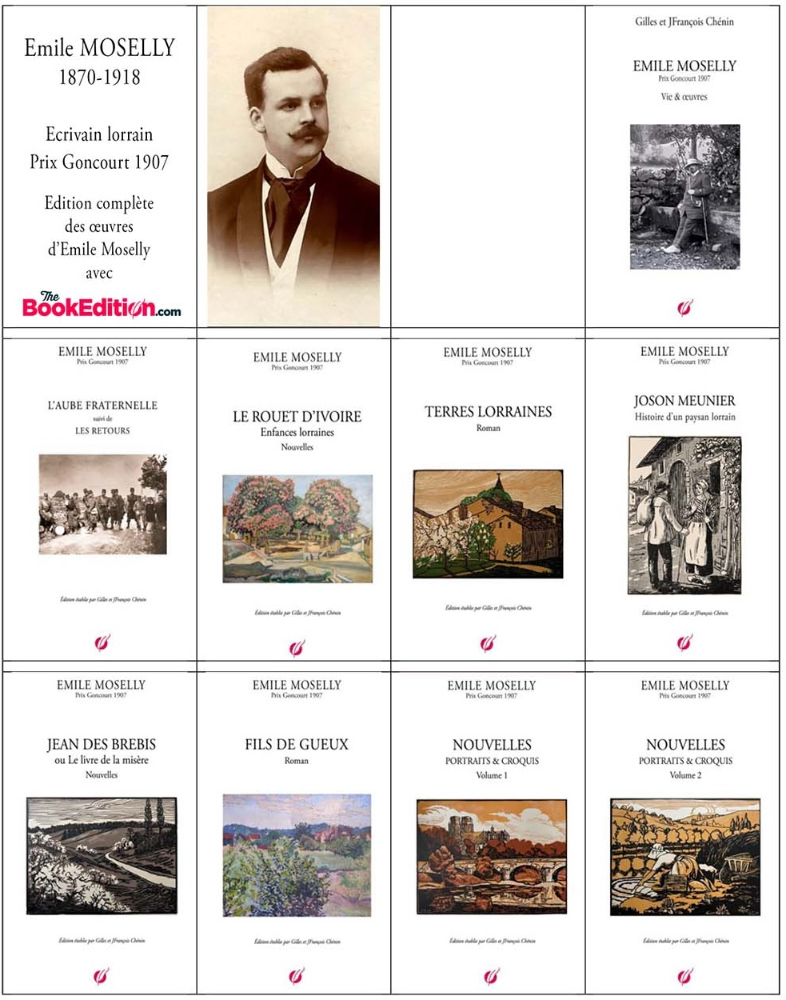
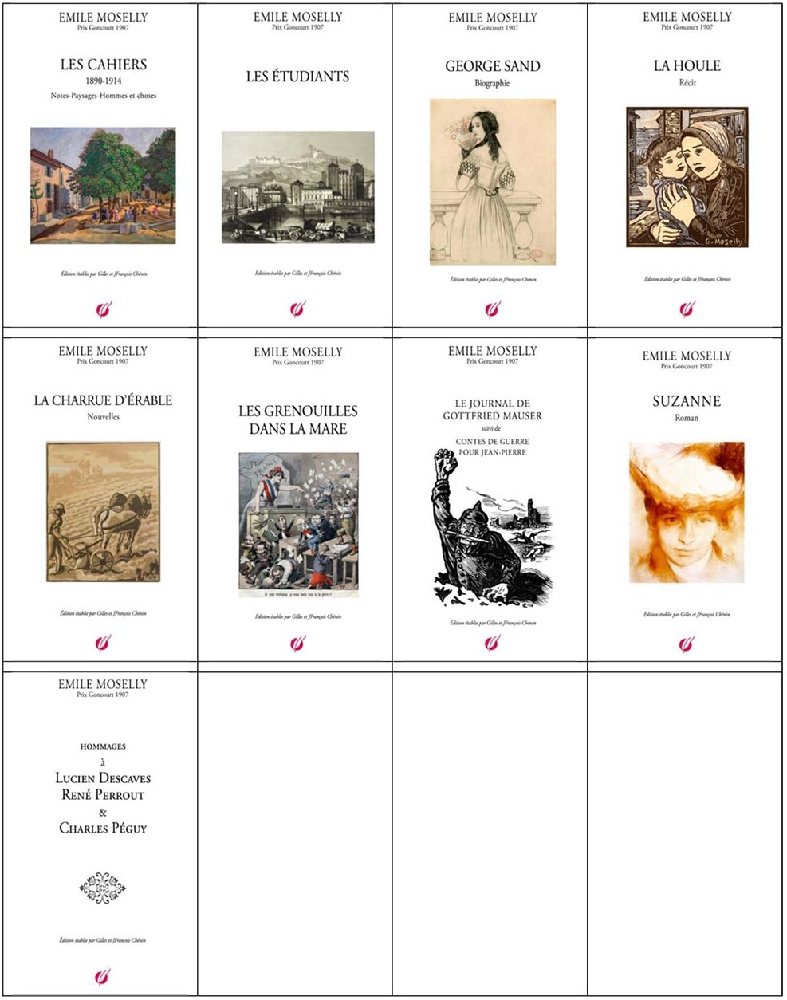
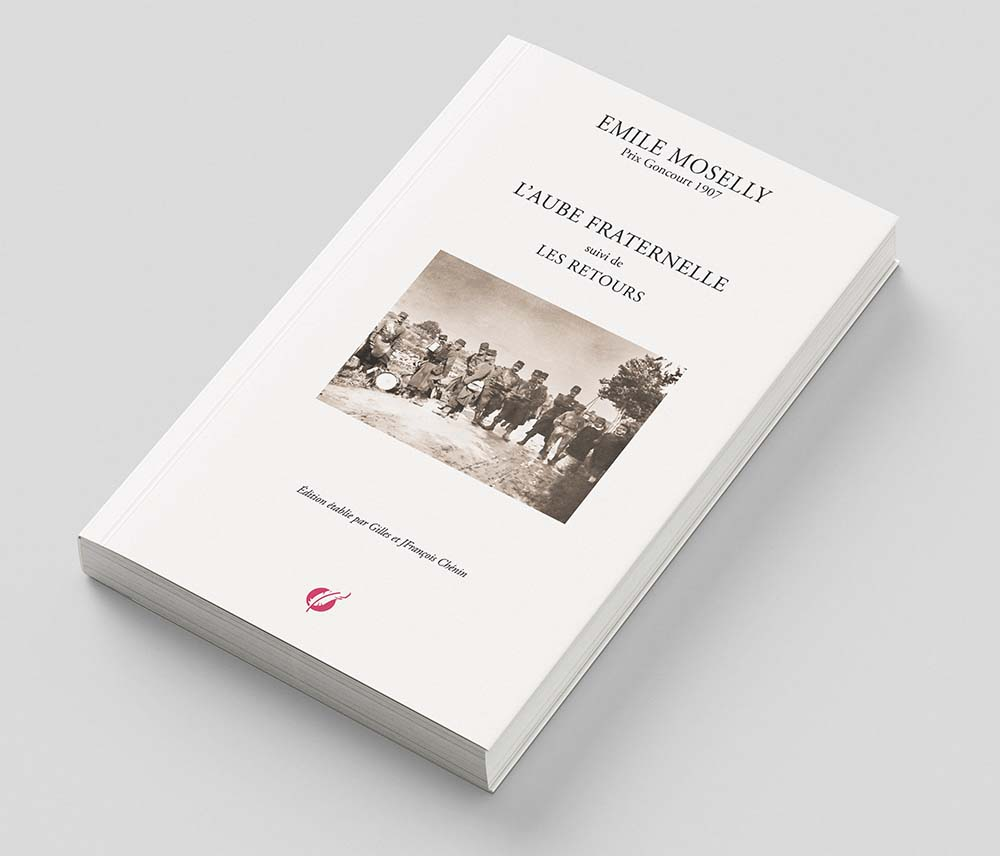
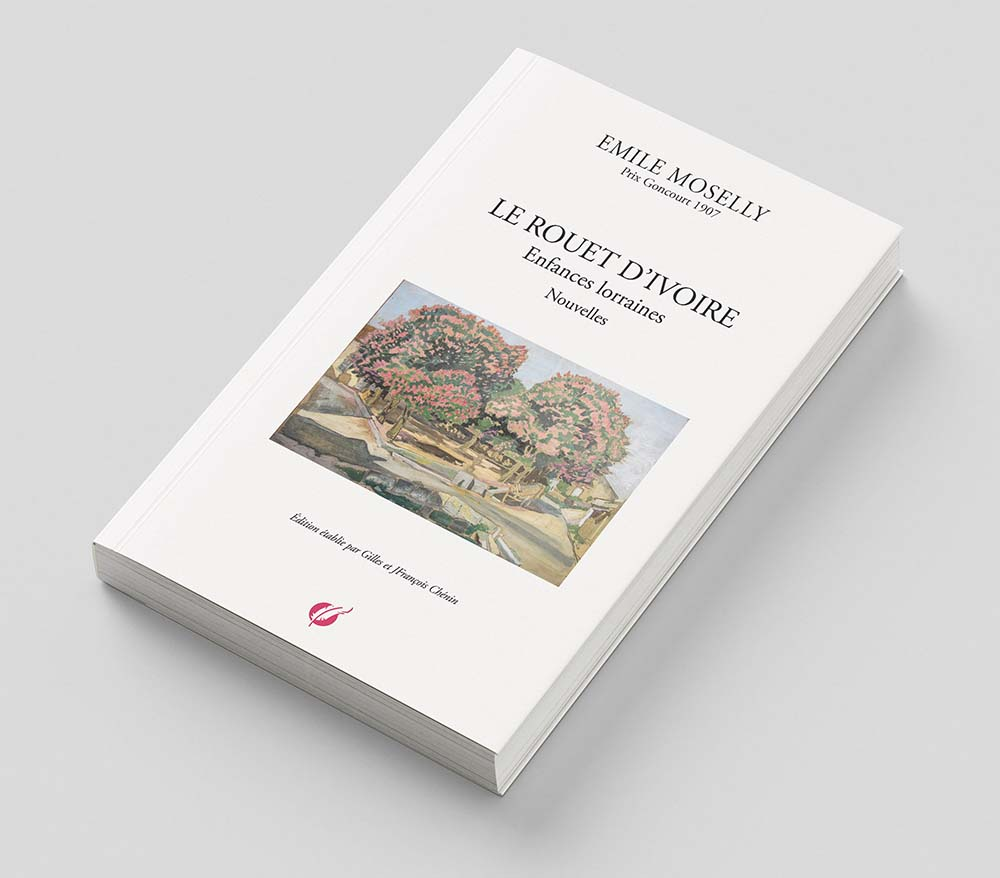
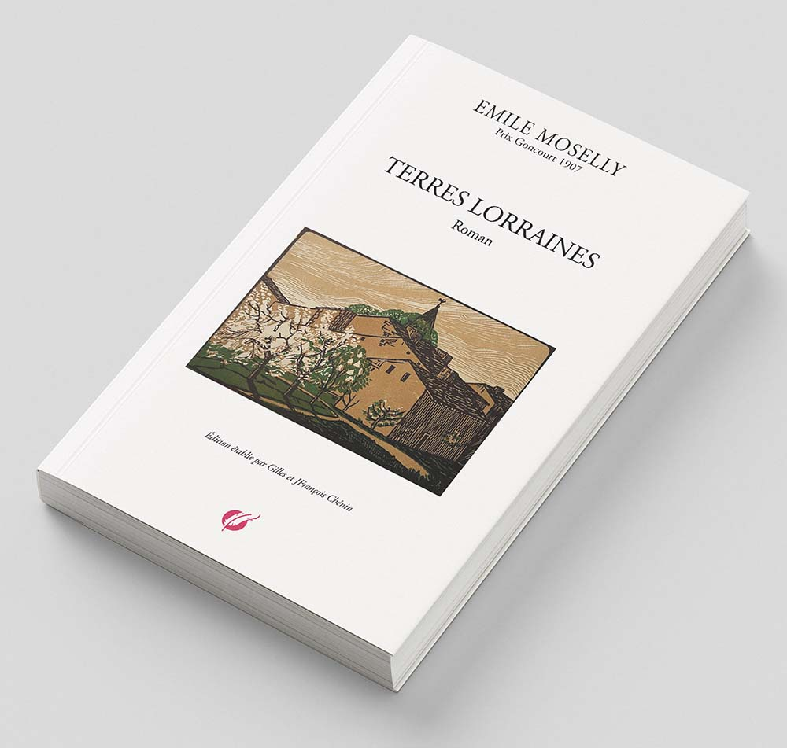
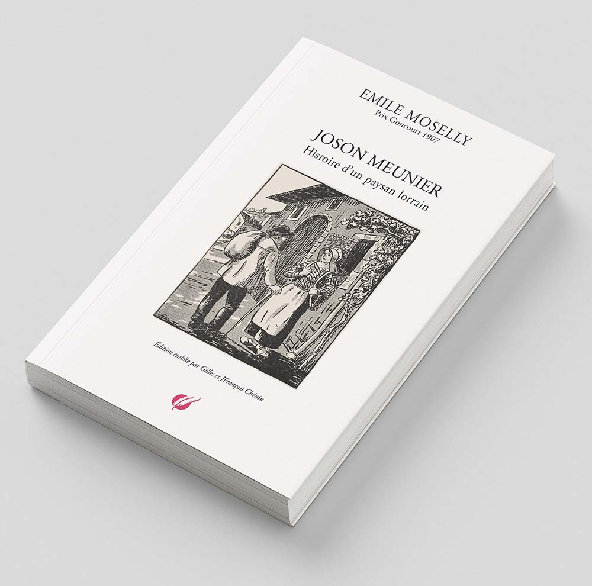
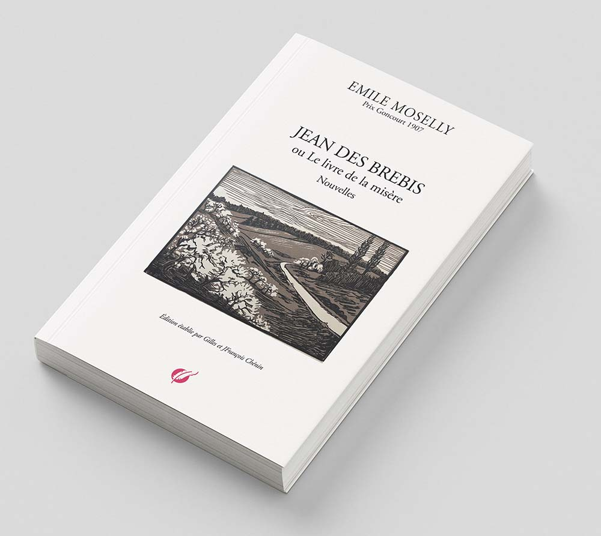
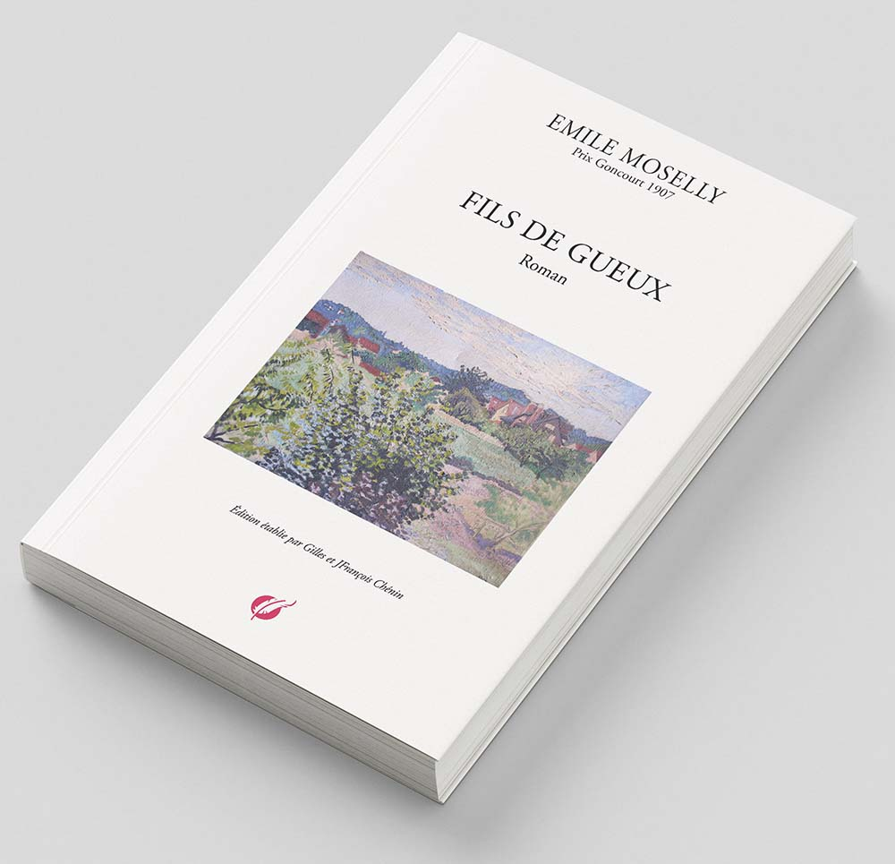

# éditions des œuvres complètes d'Emile Moselly
chez[ **TheBookEdition.com**](https://www.thebookedition.com/fr/recherche?controller=search&orderby=reference&orderway=desc&search_query=moselly)

## L'AUBE FRATERNELLE suivie de LES RETOURS

**_L'Aube Fraternelle_** est publié aux Cahiers de la Quinzaine (Cahier de la Toussaint de la quatrième série, 23 octobre 1902). Aucune autre édition de ce texte n'avait été faite jusqu'alors.
**_Les Retours_**, paru dans les Cahiers de la Quinzaine (Dix-neuvième cahier de la septième série, 24 juillet 1906), est composé de deux nouvelles :

- _Les Haleurs_, publié en janvier 1906 dans la revue Le Pays Lorrain et en 1908 dans _La Vie Lorraine, Contes de la Route et de l'Eau_, aux éditions Nouvelle Librairie Nationale, collection Les Pays de France.
- _Le Soldat_, paru sous le titre _Le Retour_ dans la revue Le Pays Lorrain en avril 1904 et en 1908, sous le titre _Le Soldat,_ dans La Vie Lorraine, Contes de la Route et de l'Eau_, aux éditions Nouvelles Librairie Nationale, collection Les Pays de France.
*A noter que La Vie Lorraine, Contes de la Route et de l'Eau a été* réédité en 1999 aux édition du Bastion (Sarreguemines).*

---

## LE ROUET D’IVOIRE, Enfances lorraines, Nouvelles

Introduction de Pierre Goudot

_Tous nos remerciements à la famille de Pierre Goudot (1929-2009) de nous avoir autorisé a reproduire la préface qu'il a rédigée pour une édition critique du Rouet d'Ivoire publiée en 1990 aux Presses universitaires de Nancy et Ed. Serpenoise._
_Pierre Goudot est l'auteur d'un mémoire de D.E.S sur La vocation régionaliste d'Emile Moselly (juin 1964) qui reste la référence pour qui souhaite connaître les ressorts profonds de la création littéraire chez E. Moselly._

Au terme de ses études de licence à la Faculté des Lettres de Nancy (1888-1891), Émile Chénin, dit Moselly, a préparé à Lyon, grâce à une bourse, le difficile concours de l'Agrégation, qu'il réussit en 1895. Originaire de Chaudeney-sur-Moselle, modeste village du toulois, issu d'une humble famille lorraine, il a réalisé une partie de ses ambitions : il ne portera pas la hotte (cf. La maison d'école) ; professeur agrégé des Lettres Classiques, il jouit d'une situation enviable qui le met à l'abri du besoin.

Il lui reste à devenir écrivain, rêve qu'on décèle dans son Journal dès l'arrivée à Nancy en 1888 ; il lui faudra gagner Paris, seule ville à l'époque où l'on pût se faire un nom dans la littérature. Une carrière professionnelle exemplaire l'en rapprochera progressivement ; il enseignera successivement à

Montauban (1895-1899), Orléans (1899-1910), Rouen (1910-1911), au Lycée Voltaire à Paris (1911-1914), au Lycée Pasteur à Neuilly enfin (1914-1918). (  _Moselly décède subitement le 2 octobre 1918 entre Quimper et Lorient, dans le train, au retour des vacances. Inhumée à Lorient, sa dépouille sera ramenée à Chaudeney le 9 octobre 1919_.

En réalité, la chance favorise ses ambitions littéraires bien avant sa nomination dans la capitale ; Orléans est la ville de Charles Péguy qui, en 1901, fonde à Paris Les Cahiers de la Quinzaine ; grâce à Mathiez, collègue connu à Montauban, Moselly le rencontre ; mêmes origines sociales, mêmes aspirations socialistes ; les affinités nouent entre les deux hommes, qui se tutoient dès mars 1903, une amitié profonde et efficiente qui ne se ternira pas au fil des ans. ( Leurs relations ont été étudiées par Alfred Saffrey in Péguy et Emile Moselly (_Cahiers de l’Amitié Charles Péguy, Librairie Minard, Paris 1966). outre la correspondance échangée, d’où sont tirés les extraits cités dans cette étude, Saffrey publie un vibrant hommage écrit par Emile Moselly en 1915 à la mémoire de son ami disparu)._

Moselly compte sur Péguy, qu’il soutiendra en revanche en toute occasion, lui et ses Cahiers, où parait en 1902 L'Aube Fraternelle, sous le pseudonyme révélateur de Moselly.

Assuré d'être édité, encouragé par l'accueil réservé par la critique à sa première œuvre, bénéficiant aussi d'une bourse d'études à Paris, Moselly prend un congé d'un an, qu'il prolonge d'un an (octobre 1902 - octobre 1904) _(Sa santé précaire et ses ambitions littéraires tout à la fois l’inciteront à prendre un autre congé d’un an, en 1910-1911, qui le dispensera d’enseigner à Rouen, où il venait d’être nommé. La situation aisée de sa belle-famille rendait possible de telles mises en disponibilité_). Il s’agit désormais de produire, d'autant plus que dans sa hâte d'être publié il courra revues et éditeurs, donnant parfois simultanément un même texte aux uns et aux autres. La revue Pages Libres publie trois nouvelles en janvier, juin et septembre 1904 ; en avril, Péguy sort Jean des Brebis, recueil de six nouvelles relativement engagées, réédité la même année chez Ollendorff, puis Les Retours en 1906. C'est en 1904 aussi que Moselly écrit son roman Terres Lorraines que la Librairie Plon éditera en 1907 seulement et qui décidera le Jury du Prix Goncourt en sa faveur.

La fondation du Pays Lorrain à Nancy, en 1904, arrive à point nommé ; Moselly s'y fait de nombreux amis ; le numéro 2 annonce la publication prochaine de ses textes ; son nom figure parmi les collaborateurs sur la couverture du numéro 3 ; il n'en disparaîtra qu'en 1931, lorsque la revue changera de format et de style. Quelques contes et nouvelles y paraissent en 1905 et 1906, dont six groupés sous le titre La Vie Lorraine.

La veine lorraine semble bonne et riche en ces temps de préoccupations régionalistes. Moselly l'exploitera en puisant abondamment dans la connaissance de la vie rurale donnée par une enfance et une jeunesse vécues dans le petit village de Chaudeney, situé à quatre kilomètres en amont de Toul, sur la rive droite de la Moselle. Il suffira, sans perdre de vue les débouchés parisiens, d'adapter cette veine à un nouveau public, de modérer le ton trop engagé des premières productions, adaptation que facilite l'évolution personnelle de l'écrivain.

C'est dans ce contexte d'intense production que se situent la genèse et la publication du Rouet d'Ivoire. Quand il s'agira, en 1906, de trouver la matière d'une œuvre nouvelle, Moselly songera à ses souvenirs d'enfance réveillés dès 1902 dans une sorte de crise psychologique dont son Journal offre les échos.

⁂

Lorsque encouragé par son instituteur, poussé aussi par le désir d'échapper à la vie difficile des campagnes, Moselly s'est lancé à la conquête du savoir, il aspirait à devenir un monsieur ; c'était l'époque où les études apparaissaient aux ruraux les plus doués comme le nouveau et seul moyen de promotion sociale. Moselly est de ces ambitieux fascinés par la ville, de tout cœur et non sans orgueil d'abord, considérant parfois avec quelque hauteur, dans sa correspondance d'étudiant, ceux qu'il a laissés au village.

La sécurité et l’aisance assurées par sa réussite universitaire, les satisfactions professionnelles, les plaisirs de la vie intellectuelle, le climat sain de Montauban où il débute sa carrière, les joies familiales enfin suffisent largement à son bonheur ; fiancé dès décembre 1896, il a épousé le 25 février 1897 Marie Barthélémy, de trois ans sa cadette, parisienne de famille aisée disposant de rentes égales au traitement de son mari_.( Témoignage oral de François Chénin. De ce mariage naîtront François (1898-1967), Germaine (1902-1950), Jacqueline (1906-1909), Jean-Pierre (1913-1987)._)

A Orléans, où il est nommé Professeur de Rhétorique en 1899, (_Au Lycée d’Orléans, Moselly comptera parmi ses élèves Maurice Genevoix qui évoque brièvement la personnalité de son professeur dans son essai autobiographique Trente mille jours.)_ le désenchantement apparaît peu à peu. Aux réflexions sur l'Art, aux analyses des influences littéraires subies succèdent dans le Journal des réflexions désabusées sur la société et le bonheur, sur la solitude parmi la foule citadine, sur l'absence cruelle d'un credo en cette fin de siècle où la jeunesse cherche désespérément des phares nouveaux ; il est lui-même quelque peu prisonnier d'un anticléricalisme irréductible et d'un socialisme humanitaire et sentimental hérités de son milieu et de son éducation ; les hivers orléanais, peu favorables à sa santé fragile, lui paraissent longs et pénibles ; les séjours à Paris, en Normandie ou en Bretagne pendant les congés scolaires courts ne peuvent vaincre une insatisfaction croissante qui se résout finalement en la prise de conscience de plus en plus nette d'une désagréable dualité : les ambitions littéraires tardant à se réaliser, l'esprit épris de culture et de poésie ne consent plus à sacrifier deux tendances profondes de la personnalité, le besoin d'affection, qu'il ne peut satisfaire dans le désert des villes, et le besoin de sensations éprouvées au sein de la nature, dont il est trop souvent éloigné. Vivre, changer de peau, être un autre (Journal).

Le processus de retour aux vraies sources est engagé. Apparaissent alors çà et là, brèves encore, des évocations à distance de la Lorraine, pays pauvre certes, mais pays de la lumière, pays de la verdure, pays de l'eau où lui semble de plus en plus évidemment resserré tout le bonheur possible ; ces descriptions détaillées et souvent reprises des mêmes sites, tous situés dans le cadre étroit des collines qui enserrent Chaudeney, trahissent la  nostalgie de plus en plus affirmée d'un bonheur perdu, essentiellement physique et sensoriel encore, désormais seulement permis pendant les congés scolaires d'été passés chaque année en Lorraine. Moselly occupe ses mois d'exil à se souvenir des étés lorrains de jadis et de naguère, dont il conserve dans la mémoire une image merveilleuse et immuable confirmée chaque année en août et en septembre.

L'été de 1901 le ramène à Chaudeney et satisfait une fois de plus sa boulimie de sensations de toutes sortes savourées dans la silencieuse et lumineuse fraîcheur de la vallée ; il conforte une image obsessionnelle où se mêlent soleil, lumière, verdure et fraîcheur, image conforme à ses goûts et adaptée à sa forte corpulence, nourrie certes d'éléments étrangers à la Lorraine mais dont la Lorraine offre seule, à ses yeux, l'exacte réalité. Ce séjour précipite l'évolution. Ces sensations agréables, nécessaires à son bonheur, Moselly les connaît pour la première fois, identiques dans le présent à ce qu'elles étaient autrefois, lorsqu'il était enfant ; elles revivent, associées à des lieux, à des personnages, à des mœurs, à des anecdotes, souvenirs divers mais toujours heureux, qui éveillent pourtant un sentiment nouveau : un tel contentement, trop parcimonieusement accordé, révèle par contraste le temps perdu : ... Il aurait voulu s'ennuyer, trouver le temps long, pour que les minutes durassent plus longtemps, et malgré tout il sentait que tout fuyait d'une fuite lente, confuse, rapide comme un sable qui tombe dans un sablier. Et les années passaient comme un souffle, et il était vieux. Il vient d'avoir trente-et-un ans ! Il envie un camarade de collège qui, avec quelque fortune, est resté à la campagne, chassant, pêchant, gentilhomme fermier désabusé du fonctionnarisme avant d’y avoir goûté et s’imagine que le véritable et tranquille bonheur est là : Rester là, y vivre, tenir à ce sol par ces petites racines de l'âme, le chevelu, qui font que les arbres meurent quand on les coupe. Le thème du déracinement, à la mode à l'époque et dont Barrès fut l'initiateur, n'est sans doute pas étranger à cette évolution.

Pourtant, au début d'octobre, incapable de renoncer aux avantages du fonctionnarisme et aux rêves de gloire littéraire, il quittera une fois de plus le pays de son enfance en partie retrouvée et pour des mois. _Le train s'éloignait ; par les grandes glaces des larges baies le pays apparaissait une dernière fois. Jamais il ne l'avait mieux compris que par cette matinée pluvieuse d'octobre où les nuages bas, rasant les collines, crevant à la cime des forêts, semblaient laisser fuir la pluie en ondes torrentielles comme d'une poche crevée. C’était bien le pays de l'eau, avec les canaux débordants, les nappes étalées sous les feuilles..., ses rivières contenues par des barrages... Ce pays de sources qui fuient à travers le cresson et les menthes sur un lit de cailloux Et toute cette eau, sortie des veines de la terre, nourrissait les herbes et leur donnait cette robustesse drue, ces teintes vertes résistantes, cet air de santé que les paysages ont comme les hommes. L'air était frais sous les feuillages, et quand le reste de la France, à la fin des étés, était brûlé et aride, quand les prairies galeuses laissaient voir le sol comme une toison de bête ravagée par les mites, on arrivait avec délices dans ce pays d'eaux charmantes et dormantes, plein de ruissellement de fraîcheurs, où la grande voix des barrages se mêlait aux sonnailles des chevaux sur les chemins de halage._

En l'espace d'une demi-page écrite à Orléans à son retour, Moselly transforme l'image d'une exécrable matinée pluvieuse d'octobre en vision estivale paradisiaque ; ce glissement inconscient est révélateur de son obsession, qui s'explique par le fait que, depuis une dizaine d'années, il n’a revu la Lorraine qu'à la belle saison . Il a désappris la Lorraine de l'hiver. Sa mémoire, certes fidèle, ne pêche que par omission. Il lui reste à retrouver la Lorraine de la mauvaise saison et de la misère : le séjour exceptionnel de Pâques 1902 en sera l'occasion. La révélation est immédiate et brutale, dès la sortie de la gare de Toul.

_Retour au pays natal. Arrivé par un soir pluvieux de mars. Ce n'est pas l'impression exquise des juillets pleins de fraîcheur au sortir de la canicule qui brûle le reste de la France... tout est brume, boue... tout de suite la ville noyée dans un flot de boue noire, liquide, de fange qui donne la nausée, triste, cette impression. Est-il possible que cela soit si petit, celle ville que dans mes souvenirs je vois si grande, si large, si pleine de coins, de clairières avec du soleil, de grands pans de lumière sur ses maisons ? ... Quelques détails oubliés qui rappellent toute une vie par-delà de lointaines, de mystérieuses associations..._

_Et je reprends comme il y a quinze ans le chemin le long de la rivière. La nuit vient. Je me retrouve tout entier... Puis me voilà dans la vieille maison où tout de jour en jour s’écroule. Pauvre vieux logis, si grand jadis pour mes pas d'enfant et si plein de terreurs... Ses bruits me reportent loin, bien loin, si loin qu'il me semble qu'il est impossible que tout ce qui s'est passé, qui est ma vie, soit une chose réelle, et que je vais me remettre en marche de ce point de départ vers une autre vie. Insomnie, tristesse, regrets, plans chimériques, projets ! Au matin, dans l'aube douteuse, pâle, traînant une lumière hésitante sur la rue boueuse, des petits enfants passent, car c'est vendredi saint, annonçant l'angélus avec des cliquettes de bois... Je me lève pour les voir. Ils sont cinq ou six sous l'averse, hâves, grelottants ; il me semble que de mon temps ils étaient plus nombreux, ils étaient plus joufflus, et que c'était par des matins lumineux de Pâques, où la grâce d'avril souriait dans le frisson des dernières gelées, qu'ils marchaient sur la terre durcie, de mon temps. Mais cet angélus mouillé, par ces petites voix grêles, couvertes par le crépitement des crécelles, oh ! que c'est triste !_

Pendant ces quinze jours de temps maussade, c'est tout un autre pan de sa vie passée qui se révèle à lui. Les moindres sensations, les scènes vues réveillent des souvenirs d’une tonalité nouvelle. Il a conscience de la révélation, il le répète souvent ; tout lui revient, jusqu'aux bruits familiers qui, un à un, gravés en lui, y réveillent l'âme ancienne. Il redécouvre enfin l'enfant qu'il avait été réellement, jadis, et dont il se met à rechercher les moindres faits et gestes, les émotions les plus ténues. Dorénavant, et pendant un certain temps, son Journal sera essentiellement l’écho de cette quête d'un passé plus triste, mais plus vrai.

Font irruption le climat rude, les frayeurs enfantines, les miséreux de rencontre, les épaves de la vie, les méchants, la mort, les évocations de la nuit, quasiment absentes auparavant tout comme celles de la maison des grands-parents et de la cheminée lorraine, centre d'un univers restreint et protégé dont l'adulte redécouvre les limites et les bienfaits parce que, inconsciemment, sa sensibilité en a encore besoin. Jetés pêle-mêle sur le papier, encore incomplets, ces souvenirs constitueront partiellement la matière du Rouet d'Ivoire, œuvre manichéenne dans une certaine mesure : la Lorraine de l'été et de la joie s'y oppose à la Lorraine de l'hiver et de la misère. Cette double tonalité de l'œuvre est le fruit et le reflet de l'histoire intime de l'auteur.

Si _Le Rouet d'Ivoire_ fut écrit en 1906, c'est à Pâques 1902 que Moselly en a découvert le principe et le sujet, sans percevoir toutefois les idées directrices qui orchestreront le foisonnement de ses souvenirs d'enfance.

⁂

Le Rouet d’Ivoire est écrit en 1906 pour le Pays Lorrain, mais Moselly ne perd pas de vue la capitale, et d'Orléans il écrit à Péguy le 9 octobre 1906 : _Je termine une petite machine, guère plus grande que l'Aube, des impressions d'enfance, très ténues, très fouillées comme style. Ça paraîtra dans la revue du Pays Lorrain. Mais je voudrais tenter de la caser dans une revue de jeunes à Paris. C'est trop « poème en prose » pour le public des Pages Libres. As-tu des tuyaux sur quelque revue (Ermitage ou autre) où je pourrais frapper ou me recommander de toi ? Je ne voudrais pas que cela soit publié seulement à Nancy._

Le Pays Lorrain annonce la parution du recueil dans sa livraison du 20 janvier 1907 : _Notre collaborateur Émile Moselly a écrit spécialement pour notre revue une série de souvenirs d'enfance, impressions très ténues où il s'est préoccupé de retracer la vie lorraine vue par les yeux d'un tout petit. Nous les publierons prochainement._

Il faudra attendre le 20 juin pour découvrir les trois premiers extraits, l'ensemble étant publié sur un an et demi, jusqu'en novembre 1908, de façon régulière d'abord, puis nettement moins suivie à partir de mars 1908 ; l'œuvre est complète, à l'exception du chapitre Nuits lorraines, publié isolément dès juillet 1906 et suivi d'une exhortation véhémente à promouvoir la littérature régionaliste ; d'autre part, le chapitre Bonne Dame est amputé par inattention de ses sept derniers paragraphes.

La mise en route trop lente de la publication et la durée prévisible de son échelonnement dans le temps incitent Moselly à solliciter à nouveau Péguy. Le 2 juillet 1907, avant de partir pour Chaudeney, alors que Le Pays Lorrain vient seulement de donner les trois premiers chapitres, il renouvelle son appel à peine déguisé du 9 octobre 1906c_: Je t'ai parlé peut-être d'une petite série d'impressions d'enfance, que publie en ce moment Le Pays Lorrain. J'aimerais bien que cela paraisse aux Cahiers plus tard. D'ailleurs, je crois que cela se vendrait bien en Lorraine, mon roman étant bien parti là-bas._ _( Il s’agit de Terres Lorraines, sorti des presses de la Librairie Plon en mars et mis en vente en avril.)_

Cette fois Péguy se laisse convaincre, et les choses vont aller vite, plus vite que Moselly l'espérait. Péguy publiera lui-même ces impressions d'enfance, demande le manuscrit pour le 22 septembre, mettant dans l'embarras l'écrivain qui, de Chaudeney, lui répond le 24 août : *Je ne crois pas avoir mon manuscrit prêt pour le 22 septembre. Une partie est à Nancy, l'autre à Orléans. Je n'ai rien ici. Il faudrait attendre les premiers jours d'octobre.*

Ce manuscrit ne nous est pas connu. En revanche nous en possédons un exemplaire composite, mis en vente chez un libraire parisien en février 1987 et acquis par la Bibliothèque Municipale de Nancy. En réalité, il s'agit plutôt d'un montage que d'un véritable manuscrit. C'est un volume relié gr. in-4 demi-reliure chagrin marine comportant 93 feuillets de papier verger. Les trois premiers feuillets présentent six lettres collées, avec leur enveloppe, toutes adressées aux Cahiers de la Quinzaine ou à Péguy lui-même ; trois sont de l'auteur, Émile Moselly, l'une est de Charles Sadoul et complétée par Moselly ; les deux dernières sont de Gustave Geoffroy et de Léon Daudet.Les 24 feuillets suivants portent, découpées au ciseau dans Le Pays Lorrain et collées au recto seulement, les pages de la première partie, L'hôte muet compris, rapidement corrigées par Moselly et annotées par Péguy en vue de l'impression. Les 68 derniers feuillets portent la deuxième partie, recopiée par Moselly sur des pages 13,5 x 21 à petits rectangles également collées au recto seulement et annotées par Péguy qui a mentionné de sa main au bas de la page 74 : il n'y a pas de page 75. Le cinquième feuillet enfin, page de titre dans le Pays Lorrain, porte la dédicace autographe suivante : A Monsieur Saffrey, ce manuscrit où j'ai enfermé route mon enfance. Émile Moselly. Bien que le nom du destinataire ait été gratté, il est lisible. (_Après l’impression, Moselly a sans doute récupéré la matière donnée à Péguyet fait relier l’ensemble, l’offrant ensuite à Saffrey, père d’Alfred Saffrey, cité plus haut. Il lui avait déjà dédié L’Aube Fraternelle. Il est à remarquer que la coupure dans le manuscrit correspond à la structure de l’œuvre qui comporte deux parties.)_

L'histoire de ce livre est difficile à établir avec certitude. Rentré à Orléans au début d'octobre, Moselly s'est mis au travail, un peu tardivement, condamné à faire front de deux côtés à la fois, pressant son ami Sadoul, directeur du Pays Lorrain, de lui renvoyer le manuscrit de la première partie, faisant patienter son ami Péguy pour qui il recopie à la hâte la deuxième partie, dont il ne s'était pas dessaisi et dont il lui faut désormais deux exemplaires. Cette copie très hâtive de la seconde partie, parsemée de quelques grossières négligences, est envoyée à Péguy le 14 octobre, comme en témoigne le télégramme qui l'annonce : Manuscrit expédié à Orsay. Chénin.

Le lendemain, Moselly écrit à Péguy : *Orléans, Dimanche. Mon cher ami, Accorde-moi un délai d'un jour. J'attends la première partie imprimée à Nancy. Voilà une semaine que je la réclame à Sadoul. Il est probablement furieux que l’ouvrage ne lui soit pas réservé inédit. Ainsi la destinée des pauvres auteurs n’est pas enviable. A part quelques pages, tout est prêt. Le bouquin n'est pas gros, et sera facile à imprimer. Je télégraphie à Sadoul. Tout arrivera peut-être_ aujourd'hui.Tu l'auras alors demain soir...*

Exigeant, mais dévoué, il obtient de ses deux amis qu'ils fassent dans leurs publications respectives une publicité réciproque.

Sadoul, quant à lui, peu pressé en effet, garde le manuscrit, renvoie en revanche les épreuves déjà tirées pour le Pays Lorrain ; les ayant relues et rapidement corrigées, Moselly les transmet immédiatement à Péguy qui lui en accuse réception sur le champ et le 17 octobre, enfin libéré de la situation délicate dans laquelle il s'était lui-même fourré, il peut faire à son ami éditeur ses dernières recommandations d'auteur :..._Il faudra mettre un beau titre en rouge.Je crois que le petit livre, typographiquement, quand tu y auras mis tes soins, pourra être un petit bijou. Ces petits contes, avec les titres divers, nombreux, feront bien. Arrange cela avec l'amour et la compétence que tu mets à ces choses. Il n'y a plus que toi à Paris qui ne cochonne pas. Ne te guide pas sur l'imprimé de Sadoul, qui n'entend rien à la typographie.Choisis surtout le caractère des titres : Le Rouet d'Ivoire, Le Revenant, etc. , je crois que cela a de l'importance. il faudra qu'ils se détachent bien dans la page, reposent l'œil, donnent le goût de lire l'histoire qui suit. Tout cela est empâté dans l'impression du Pays Lorrain. Ce n'est pas cela. Il faut faire un livre d'enfant, joyeux à l'œil. Je l'ai écrit avec l'idée de faire tout le temps ces petites vignettes qu'on voit en marge des belles eaux-fortes. Tu comprends. Non la rigueur du dessin. C'est un livre de croquis._

Ainsi s'explique la nature très particulière du manuscrit de Nancy, sur lequel a travaillé Péguy ; il y a porté en effet, à l'encre noire, des recommandations d'ordre typographique, réparti la tâche entre les typographes, signalé parfois sa surprise ou son hésitation devant un mot illisible, un mot lorrain inconnu, un accord surprenant, un choix maladroit des temps ; mais il a aussi corrigé d'autorité les innombrables fautes d'impression et d'orthographe relevées sur les feuillets du Pays Lorrain (quelques-unes aussi dans la deuxième partie !), modifié la ponctuation, suggéré des corrections dont certaines ne seront pas retenues par les typographes, qui à leur tour commettront quelques erreurs d'inattention. Ainsi s'expliquent aussi les divergences considérables entre le texte du Pays Lorrain, d'assez piètre facture, et celui des Cahiers, qui n'est pas sans erreurs, grossières parfois. Ce n'est pas tout : les épreuves de Péguy ont été revues non pas par Moselly, davantage préoccupé, semble-t-il, par l'apparence de son livre que par la perfection de son contenu, mais par l'un de ses collègues. J'ai corrigé les épreuves, écrit-il à Péguy le 26 octobre, ou plutôt Weil, philologue, les a bien vues, il a fait quelques changements qui me paraissent très heureux, très justifiés.

Les interventions de Weil ne sont pas négligeables, ni en nombre ni en qualité, tant sur le style que sur la ponctuation : élimination de quelques adverbes ou de mots répétés, inversion assez fréquente dans des groupes de deux compléments par souci d'euphonie, de clarté, de précision ou de justesse, suppression de quelques propositions jugées inutiles ou lourdes ; en revanche, ne tenant pas compte du manuscrit parce qu'il ne songeait qu'à améliorer la forme, Weil n'aperçoit pas que le mot jeux est devenu yeux (La joie), que l'adjectif petit a remplacé l'adjectif lorrain peut (Nuits lorraines), que les carillons de la nuit de Noël éparpillent dans l'air leurs robes bondissantes au lieu de leurs notes, toutes erreurs, parmi d'autres, que Moselly aurait décelées s'il avait lui-même vu les épreuves. Les plus évidentes seront supprimées dans l'édition Plon (février 1908) établie à partir du texte des Cahiers, que Moselly a sans doute relu, cette fois.Le 12 novembre 1907 parait Le Rouet d'Ivoire, quatrième Cahier de la neuvième série, tiré à 1 600 exemplaires, et le 18 l'auteur peut exprimer laconiquement à l'éditeur sa satisfaction : _J'ai reçu le cahier, c'est bien. Il paraît au bon moment,_ est favorablement accueilli par la critique, est jugé remarquable par Léon Daudet qui conseille à Péguy d'en adresser un exemplaire à chacun des dix membres du Jury du Prix Goncourt ; l'un d'eux, Lucien Descaves, acquis à Moselly, présentera conjointement Le Rouet d'Ivoire et Terres Lorraines, sorti des presses en mars : la petite machine a pu peser favorablement sur la décision des Goncourt qui, le 5 décembre, font de son auteur leur cinquième lauréat. Des cinq mille francs qu'il reçoit il donne mille francs à Péguy : geste de gratitude et de soutien.

⁂

L'intention de Moselly est clairement avouée au début du recueil, dont le titre symbolique est expliqué dans le chapitre liminaire ; elle est rappelée dans le dernier chapitre : c'est le petit brinquin qu'il fut et qu'il tente de retrouver et de faire revivre, l'enfant dont il a éveillé en 1902 le nostalgique souvenir.

Peu à peu redécouverts, notés au jour le jour et sans préoccupations stylistiques dans son Journal où ils ne figurent pourtant pas tous, les éléments ne manquent pas. Mais leur publication impose l'orchestration de cet ensemble riche où l'agréable et le désagréable sont intimement mêlés. Or, Moselly n'a pas naturellement la vision immédiate des grands ensembles structurés ; il est sensible aux impressions du moment, perçoit et savoure les détails d 'abord ; leur agencement ne peut être que le fruit d’une recherche volontaire, d'un effort conscient de mise en ordre, de l'art en somme.

Il a l'habitude de noter dans les cahiers de son Journal, sur les pages de garde en particulier,et d'un mot souvent abrégé, les sujets d'œuvres possibles. Le Rouet d’Ivoire n'y est évoqué qu'une fois, sans date :

_Ma vie d'enfant. L'humble vérité. L'art, mes enfants, c'est d’être absolument soi-même (P. Verlaine)_

_Manuscrit Rouet d'Ivoire. Travailler style l’Art. Faire court._
_Choses vues._
_Faire court. Pas d'adj. des verbes._
_Petits récits d'un art parfait, fin, amusant, terrible, drôle, myst._
_Choisir en tout le détail caractéristique, le trait caractéristique._
_Dire plutôt moins que trop. Choses émouvantes. Pas trop d'adjectifs._
_Choisir, combiner en vue de l'effet la chose_
_caractéristique_.

Parmi ces notes, qui révèlent des intentions stylistiques sans doute communiquées oralement à Weil, on ne relève rien qui concerne la composition ; le fragment Nuits lorraines est publié isolément dans Le Pays Lorrain dès juin 1906 ; nous possédons un premier état de La maison d'école ; ces faits laissent penser que Moselly n'a pas vu d'emblée dans quel ordre il classerait des fragments écrits séparément pour la plupart. Mais cet ordre existe finalement, et très élaboré.

L'évocation chronologique des souvenirs semble d'abord la solution choisie ; le fil brillant de la jeunesse, lentement dévidé par le rouet, est marqué de quelques indications d'âge : il est âgé de neuf mois à son arrivée à Chaudeney, de cinq ans lorsque sa grand-mère l'emmène à Pagney, de six ans au plus lorsqu'il croit aux sornettes de Fanfan, et il n'a pas encore l'âge de raison, estimé alors à sept ans par l'Église, quand sœur Stanislas l'accuse d'être en état de péché mortel. Peu nombreuses, et toutes relatives à la première enfance, ces précisions donnent d'abord l'illusion d’une chronologie suivie, mais sujette à caution dans certains cas et rapidement infirmée par l'ordre des textes : L'eau de Pagney précède Récit de guerre. D'autres fragments regroupent des impressions d'époques différentes et ne pouvaient s'insérer logiquement dans une chronologie fidèlement respectée.

En fait, c'est la découverte sans cesse élargie du monde qui sert de fil conducteur à l'ensemble, dans ses grandes lignes du moins. Dans la maison lorraine qui enferme dans ses racoins des profondeurs ténébreuses, je marche avec ravissement à la découverte du monde. J'avance à tâtons, si petit, dans l'immensité des terres inconnues (Le Rouet d'Ivoire).

C'est d’abord l'exploration du grenier, puis l'évocation de la cheminée lorraine, de l'âtre symbolique, de la veillée, la découverte de la cave, du jardin, puis des champs et des bois avec grand-père : L'horizon recule : comme le monde est grand ! (Le sac de sorbes). Avec grand-mère enfin il franchira les limites de l'horizon : pour la première fois je connais l'immensité du monde (L'eau de Pagney).

Il n'ira pas au-delà, s'arrêtant sur le bord du monde à conquérir, encore trop jeune pour répondre à l'invitation au voyage symbolisé par les chalands (La vie de l'eau).

La découverte d'un espace de plus en plus étendu, et très limité en fin de compte, ne suffit pourtant pas à l'orchestration de tous les souvenirs d'enfance. C'est en réalité la découverte progressive de la vie qui constitue la trame et donne au recueil l'unité qui aurait pu lui manquer.

Placé après l'hôte muet, le chapitre La joie crée une surprise brutale, au beau milieu de l'œuvre : onze chapitres le précèdent, onze chapitres le suivent, d'inégale longueur il est vrai, Petit brinquin étant une conclusion. Ce n'est sans doute pas l'effet du hasard. Moselly s'explique d'ailleurs sans ambiguïté dans ce fragment central, conclusion de

la première partie et introduction de la seconde, véritable clé de voûte d'une architecture calculée, point de rupture entre deux époques et deux univers : l'un heureux, celui de la petite enfance et de l'imagination, l'autre plus rude, celui de la jeunesse et de la froide raison.Le premier est décrit au présent le plus souvent, qui abolit le temps, comme si Moselly retrouvait d'instinct ou voulait donner l'illusion de retrouver cette période éphémère où l'enfant est pleinement heureux : sécurisé par un cadre étroit et connu, conforté par l'affection familiale et la vie bruyante et familière du village, il vit librement au niveau

de la terre et des choses : elle est bonne la terre ; tout est neuf, tout est occasion d'émerveillement, l'imagi­nation se déploie sans contraintes.Puis l'enfant se hausse, sa taille grandit : alors ses yeux ne perçoivent plus le bruissement de la vie, qui court au ras du sol, et la souffrance vient à mesure qu'il se détache de la terre.

Tout le secret du bonheur conservé dans l'enfance réside dans cette entente harmonieuse avec les choses.Désormais il faudra compter avec la vie et avec les hommes ; c'est d'eux seulement que viennent les déceptions. Cet autre univers est décrit au passé, avec un regard d'adulte qui, malgré lui, a compris et pris ses distances.

La différence de tonalité entre les deux parties est nette, encore qu'elle ne soit pas aussi schématique ; l'adulte intervient et juge dès les premières pages, et l'évocation des bons souvenirs restera pleine de fraîcheur jusqu'à la fin de l'œuvre ; et puis, il est des désillusions précoces comme il est des joies tout au long de l'existence : mais les premières sont vécues dans la confiance et la sérénité que procure un entourage sécurisant, les autres le sont au contact des réalités qui interpellent l'enfant, imposent leur loi et révèlent le vrai visage de la vie dont l'apprentissage n'est qu'une suite de désenchantements ; les influences subies se multiplient, s'ajoutent, se contredisent, obligeant l'enfant, de plus en plus seul, à choisir.

L'entrée de L'hôte muet dans sa destinée marque la rupture entre les deux mondes de l'enfance et de la jeunesse. Tout suggère dans ce chapitre que Moselly a perdu ses grands-parents maternels alors qu'il était enfant ; son Journal confirme qu'il a lui-même cette impression ; en réalité, il avait 16 et 17 ans. Infidélité de la mémoire causée par le retentissement affectif de la disparition de ceux qui ont veillé sur ses premiers pas ? Liberté d'écrivain qui tronque sciemment la vérité ? Peu importe l'explication. La révélation de la mort mystérieuse n'est pas essentielle ici ; ce qui compte pour Moselly, inconsciemment ou consciemment, c'est la valeur symbolique de la disparition, à un an d'intervalle, des deux êtres tutélaires, suivie de peu par la vente de leur maison, berceau de l'enfance ; l'hôte muet a brisé brutalement le cocon : il faudra maintenant, bon gré malgré, tourner ses regards vers les hommes. C'est donc moins son enfance que Moselly raconte que le passage désespérant de l'enfance à l'âge adulte. Enfances lorraines : le pluriel est significatif, comme les commentaires de l'écrivain adulte qui, çà et là, juge et généralise. Par-delà un contexte social et un environnement qui ont beaucoup changé, Moselly raconte l'odyssée fatale de tout enfant condamné à grandir.

⁂

            Peu d'œuvres autobiographiques sont autant que celle­-ci nourries de la substance de leur auteur, dont la sensibilité, les goûts et les intérêts et même la philosophie transparaissent à chaque ligne, quand ils ne sont pas ouvertement révélés par l'écrivain.

A l'exception de deux faits (l'âge auquel il a perdu ses grands-parents et l'identité du parrain), tout y est authentique : les noms et la description des lieux, les noms propres des personnages, les souvenirs relatés. Moselly livre son enfance et son être intime sans rien travestir.Or, dans ce recueil consacré à l'enfance, il n'y a pas d'enfants, ou très peu. Leurs jeux et leur psychologie sont évoqués collectivement dans les deux chapitres La joie et Bonne Dame ; Simone n'est guère que l'occasion de faire intervenir Annette la bigote et la terrifiante Sœur Stanislas (L'église) ; quant à Amarine, la fillette du batelier, plus longuement mise en scène, l'attrait qu'elle exerce rivalise mal avec l'attrait de l'eau (La vie de l'eau)fréquentations féminines surtout, révélatrices de la sensibilité de Moselly, mais rares dans l'œuvre, peuplée essentiellement d'adultes ; ce sont eux qui comptent, parce qu'ils sont les initiateurs de l'enfant, les mentors ou les mauvais génies qui le conduisent vers l'âge mûr.

Les premières années vécues dans la maison des grands-parents maternels (1871-1874), puis dans la maison des parents située en face, mais en leur constante présence jusqu'à leur mort, ont marqué de traces indélébiles la personnalité extrêmement sensible de l'enfant. La fascination qu'exerce l'enfance sur l'écrivain et, partant, la nostalgie qu'il en éprouve cruellement, sont davantage les effets de son besoin de vivre dans un univers restreint, clos et protégé que ceux de son besoin de sensations et de son amour de la nature estivale. Le Rouet d'Ivoire est d'abord un hommage aux êtres bons, ceux dont on n'a rien à craindre parce que, restés humbles, ils pratiquent spontanément la fraternité.

Les femmes sont foncièrement bonnes : la grand-mère, un peu naïve et traditionnelle ; la mère, qui connaît la misère et accueille avec compassion Philippe le mutilé et l'artiste bavarois ; la Babette aussi dont l'amour, reporté sur les chats et sur un vagabond, a survécu aux frasques du Tourment ; Bonne Dame même, épave de la vie qui héberge deux autres épaves. Quelques personnalités masculines ont témoigné à l'enfant, à leur manière, la même affection tutélaire, de l'intérêt tout au moins : le grand-père surtout, mais aussi, à un moindre degré, le père, et Fanfan le joyeux luron et parrain, et l'artiste bavarois, et Colin Michelot, dont les quolibets affectueux ont plu à l'enfant, et Monsieur Pierson l'instituteur. Ils ont tous contribué à faire des pénates enfumés et du petit enclos lorrain un havre de paix et de bonheur, qu'il a bien fallu quitter : la résonance toute affective de la dédicace à Emile Krantz, autre génie protecteur, prend alors toute sa signification. Il est surprenant que dans cette galerie d'êtres affectueux le père et la mère soient si peu présents ; ce sont les grands-parents surtout qui ont entouré le tout jeune enfant de leur amour. Et puis le père avait vu du pays et lu les philosophes du XVIIIe siècle et s'il formait avec son épouse un couple uni, son passé et son originalité faisaient de lui un être à part, bon, mais plus distant, dont l'influence sur l'enfant fut aussi sans doute déterminante. Ils n'auraient pas dû se marier, écrit Moselly dans son Journal, car ils étaient chacun d'un côté de l'eau différent ; la Moselle sépare les deux pays et les unions sont rares, les gens ne se ressemblent pas. Au pays de mon père on a le sang vif, on est mécréant, hâbleur, pays de culture, de travail, de dure, de labeur ; chez ma mère on est posé, bourgeois. On va à la messe, pays de vignerons. Ma mère, qui n'était pas riche, a toujours considéré mon père un peu comme un bohème. Il avait plus de bien et du meilleur, mais ce n'était que des prés et des champs, et on ne buvait pas de vin .

En revanche, parrain occupe une place de choix dans cet univers sécurisant ; or, il n'était pas le parrain de Moselly, mais un oncle paternel menuisier à Pierre-la-Treiche, le parrain en titre étant Victor Gantois, oncle maternel, de Chaudeney. Cette seconde et dernière liberté prise à l'égard de la vérité est révélatrice des intentions de Moselly : l'enfant trouvait chez parrain et sa femme, les braves gens, plus d'affection et plus de joie que chez le véritable parrain, qui aurait dû mieux assumer cette fonction, importante à l'époque en ce qui concerne la tutelle et l'éducation du filleul.

            Nécessaire à la sensibilité de l'enfant, ce climat d'amour et de bonté a aussi fortifié cette sensibilité, faisant de lui un adulte vulnérable, méfiant face aux étrangers, persuadé pour toujours que seuls sont heureux les couples unis et les individus qui n'ont pas quitté le pays natal, paradis des affections sûres ; tous les personnages du Rouet d'Ivoire illustrent, sans exception, cette idée : le malheur, plus intolérable que la misère, provient toujours de l'absence des êtres chers ou de la solitude morale ; ceux qui se déracinent font leur propre malheur, mais aussi celui des leurs. Vécu personnellement, le thème du déracinement trouvait dans la thèse de Barrès une confirmation évidente. De là provient également la sympathie que Moselly témoigne d'instinct à tous les réprouvés, aux abandonnés (les deux vieux, Babette), aux vagabonds, aux exilés (l'artiste bavarois), aux déracinés, aux victimes de la vie (le vieux soldat, Philippe, Bonne Dame, et même Monsieur Pierson). Cette commisération est une constante dans son œuvre littéraire.Il est évident que l'enseignement de Monsieur Pierson a fortifié considérablement cette sympathie toute sentimentale pour les humbles et les victimes et, du même coup, la haine de toutes les formes d'oppression, parachevant l'œuvre du père et surtout de Colin Michelot (La maison d'école). Représentant type de l'enseignement primaire de la troisième République, Monsieur Pierson dispensait une instruction solide qui devait permettre aux plus doués de ses élèves d'échapper à la vie dure et à la sujétion, mais il enseignait aussi que les rois avaient été des débauchés et les prêtres des imposteurs. Moselly connaît bien les racines de son socialisme et de son anticléricalisme, plus affectifs que réellement philosophiques. L'Eglise, qui prônait alors une religion austère et dramatisait les récits de l'Évangile, brandissant sans cesse la menace de l'enfer, a-t-elle aussi, sa responsabilité dans l'évolution de l'enfant (L'église). La crainte qu'inspirait son autorité indiscutable, les terreurs qu'elle éveillait et entretenait chez les fidèles ne pouvaient façonner que des âmes totalement soumises ou rapidement rebelles ; l'influence de l'effrayante sœur Stanislas est combattue par celles de Monsieur Pierson et de Colin Michelot, à qui Moselly empruntera finalement leur anticléricalisme farouche, répandu à la fin du XIXe siècle ; il reprochera toujours à l'Église de promettre un bonheur à venir au prix d'une vie exigée misérable.Le dernier de ces initiateurs est Karl, le sculpteur bavarois de passage lors des vendanges (Premier maître). L'éloge que fait de lui Moselly est sans réserve, enthousiaste, lyrique et vibrant de gratitude parce que, dans son existence d'adulte, c'est à l'Art surtout qu'il demande les consolations de son existence d'exilé. Si on l'en croit, Karl lui a révélé l'amour de la vie, qu'il tenait déjà de sa propre nature, le souci du détail vrai, vers lequel le portait naturellement son esprit peu à l'aise dans les larges conceptions, et le culte de la Beauté, que d'autres plus tard ont fortifié, les auteurs anciens et classiques en particulier.Ayant redécouvert son enfance en 1902, Moselly la révèle en 1906, mais en y ajoutant, lors de la rédaction et de la composition du Rouet d'Ivoire, une autre quête : il cherche dans son passé d'enfant l'explication de sa personnalité d'adulte, difficile à assumer. C'est aussi une manière de retrouver ses racines. S'il est quelque subjectivité dans ce recueil, elle est dans cette justification qu'il faut la situer.

⁂

Le Rouet d'Ivoire est bien une petite série d'impressions d'enfance très ténues, selon Moselly lui-même, et c'est comme tel que la critique élogieuse l'accueillit en novembre 1907 (_Moselly rassemblait les critiques parues dans la presse sur ses livres. Dix-sept sont relatives au Rouet d’Ivoire (Fonds Chénin))._

Artistes, certains louèrent le charme des brèves descriptions, la délicatesse des émotions de l'enfance retrouvée, l'art de fixer des émotions fugitives, la sûreté d'une langue harmonieuse et souple, souvent d'une exquise simplicité, le lyrisme et la poésie, l'association des impressions d'enfance et des réflexions de l'écrivain adulte.

D'aucuns, plus émotifs, apprécièrent la finesse de l'analyse psychologique d'une âme d'enfant, y retrouvèrent leur propre enfance et l'évocation de coutumes en train de disparaître, aimèrent le goût du terroir et l'hymne à l'amour du sol natal.

D'autres, davantage préoccupés d'histoire littéraire, signalèrent la fraîcheur de cette œuvre et la sincérité de son auteur qui ne craignait pas de livrer ses émotions à une époque habituée à la pornographie et au régionalisme factice. D'autres enfin, plus sensibles, remarquèrent surtout la sympathie que témoignait Moselly aux braves gens, aux faibles, aux malheureux, son don naturel de la pitié, très réconfortant parce que fort rare dans la littérature du temps ; il enseignait, lui, la bonté et vantait le charme de la saine vie des campagnes.

Aperçus justifiés, dont quelques-uns sont marqués du sceau du temps. Si le charme qui se dégage de l'œuvre reste intact, parce que l'art y est mis au service de la vérité, le contexte dans lequel s'est déroulée cette enfance a bien changé ; les coutumes ont disparu, l'environnement social et politique s'est modifié, les mentalités ont évolué, uniformisées par la vie moderne ; de ce point de vue, et même si la couleur locale n'est pas essentielle dans le recueil, Le Rouet d'Ivoire reste un témoignage authentique sur une époque révolue et peut contribuer à l'appréciation de la rapidité et de l'ampleur de l'évolution.

Dans cette œuvre consacrée à l'enfance on rencontre aussi un homme, dont le regard attendri et bienveillant se pose sur l'enfant qu'il fut, qui se complaît dans le souvenir de cette époque de sa vie tout en y cherchant les moments marquants qui peuvent expliquer et justifier ce qu'il est devenu. Sorte de paradis artificiel et plaidoyer pro domo tout à la fois, et pourtant l’écrivain est sincère et authentique.La critique du début du siècle pouvait difficilement saisir cet aspect très intime du Rouet d'Ivoire et encore moins l'intérêt majeur de l'œuvre, son unité, c'est-à-dire l'histoire même de cet enfant en marche vers l'âge d'homme, apprenant la vie malgré lui, au hasard des influences subies, condamné par la loi naturelle à grandir. Au-delà de l'expérience personnelle et des péripéties du voyage, c'est par cette aventure-là, considérée par Moselly comme une mésaventure, que Le Rouet d'Ivoire pourrait prétendre à quelque intemporalité et à quelque universalité.

(Pierre Goudot)

---

## TERRES LORRAINES, roman

_Terres lorraines_ est le premier roman d'Emile Moselly, commencé vraisemblablement en 1902 à Orléans où il est professeur, puis poursuivi en Lorraine, à Chaudeney sur Moselle, durant un congé qu'il obtient en octobre 1902 (congé qui durera deux ans). Avec _Jean­des ­Brebis (1904) et les nombreuses nouvelles parues principalement dans la revue Le Pays Lorrain en 1905 et 1906 (_Le miracle de la Saint Vincent, _Le retour  nouvelle intitulée _Le Soldat_ dans _Les Retours_ ­ , _La vie lorraine, son Fî, Nuits lorraines_...), la vocation régionaliste de Moselly s'affirme. Ou plutôt l'attrait pour une peinture littéraire de sa région natale, même s’il est né à Paris, devient prépondérant dans son œuvre. 

Pierre Goudot  (_Pierre GOUDOT (Colmar, 1929 - Montluçon, 2019) était un enseignant d’exception. Instituteur à Dombasle-sur-Meurthe, professeur certi__fi__é au lycée Ernest-Bichat puis à la cité scolaire de Lunéville, professeur agrégé, censeur et adjoint à l’inspecteur d’académie, Pierre GOUDOT incarne le modèle de cursus « à l’ancienne_ _» et le goût d'un travail exigeant qu’il a transmis à ses élèves. Chercheur passionné, son mémoire de D.E.S. est consacré à_ _la vocation régionaliste d'Émile Moselly_ _(Juin 1964) et reste la référence pour connaître les ressorts profonds de la création littéraire chez E. Moselly.)_ note que c'est en mars 1902, alors de retour à Chaudeney pour les vacances, que Moselly trouve "une vallée maussade, austère, boueuse, noyée sous la pluie. Immédiatement des images d'un passé dur  remontent à la mémoire et, pendant une quinzaine de jours, il fera une chasse systématique aux souvenirs : le vrai visage de la Lorraine, qui s'était quelque peu estompé, lui réapparait enfin : le cadre et le climat rude expliquent l'homme ; sa sympathie en est accrue, il retrouve lui­même ses racines profondes et les apprécie. Sa décision est prise : il sera le chantre de la Lorraine et de sa population noble, mais pitoyable."

⁂

Dans ses Cahiers, Moselly note à la date de mars 1902 : "_Les champs remués, la terre. Il me semble qu’elle est faite de la poussière des morts de ma race, le sol antique et nacré dont la motte friable de bonne terre brune apparait parfois dans les chemins caillouteux, rouge de minerais de fer, ce sol s’attache à mes pieds, je le foule avec une joie profonde comme si des parts de mon être participaient à une sensation ignorée et douce. En haut de la côte, à l’endroit où le chemin raviné se hausse d’un effort sur le plateau, sur les terres nues jusqu’à l’horizon rayé de pluie, sur les jeunes blés en herbe, nous rencontrons un paysan._

_Un cousin, il est très vieux, très cassé, je lui parle longuement ; il porte mon nom et je retrouve dans sa face tannée, dans ses yeux, des traits vagues, la ressemblance de la famille, c’est le nez droit, et surtout la voix, notre voix à tous, chantante, douce, dans ces voix dures de lorrains, c’est là surtout que réside mystérieuse... la parenté de la famille, celle qui est la plus émouvante._

_En le quittant, je rêve longuement à cette dispersion d’une famille, au mélange des sangs. Combien y en a­t­il autour de ces clochers pointus qui sont sortis de la même souche ? Que sont devenus ceux qu’on a oubliés, qui sont partis, qu’on rencontre peut­être dans la foule des grandes villes, qui ont eu les mêmes ancêtres que vous, et qu’on coudoie sans que rien vous avertisse. La race, la famille, une grande idée qui s’en va, qui se dissipe sous le souffle de la vie moderne._

_Ils ont de l’affection, mais elle est dure, brutale, elle s’exprime par des mots, des termes qui heurtent, qui froissent, qui révèlent maladroitement leurs tendresses._

_Lorrains, ils se dénigrent, par jalousie, un grand fond d’orgueil et d’âpreté satirique._"

Il médite ses livres ­ de nombreux extraits dans ses cahiers de 1902 à 1906 en témoignent. Il se prépare alors une période d'intense publication : avril 1904 _Jeandes­Brebis_, juillet 1906 _Les Retours_, mars 1907 _Terres Lorraines_. Et c'est pour ce dernier ouvrage ­ mais aussi pour _Jean des Brebis_ et _Le Rouet d'Ivoire_ ­ qu'il se verra décerner le prix Goncourt en 1907. Consécration d'un travail littéraire opiniâtre attaché à rendre compte de toute la nature lorraine ­ paysages, hommes, femmes et choses ­ dans laquelle il s'enracine chaque jour davantage.

L'accueil de la critique est partagé, comme à chaque fois [[1]](#_ftn1).  A partir de _Terres Lorraines_, Moselly sera loué par ceux qui lui reconnaissent un talent impressionniste pour raconter sa terre natale, la Lorraine, du moins la Lorraine de la Moselle et des Côtes de Toul et qui apprécient son savoir écrire de novelliste et de portraitiste.  

A l’opposé, il sera fortement critiqué par ceux qui ne lui reconnaissent ni originalité, ni talent de conteur, tout au plus un savoir­faire technique d'enseignant qui a beaucoup lu et qui s’inspire, peut­être à son insu, de maîtres qui l’ont précédé. 

⁂

Ainsi Marcel Ballot, dans le Figaro du 16 décembre 1907, commentant l'attribution du Goncourt à Moselly, écrit : « _Terres Lorraines est en effet une longue, très longue idylle où l’on nous conte comment Pierre Noel, le beau pêcheur de la Moselle, abandonna par deux fois sa promise. À la seconde et définitive infidélité cette tendre Marthe Thiriet, fille du garde forestier, ira se jeter dans la rivière, tandis que son volage ami, curieux d’aventure, engourdi de bien­être, ivre d’amour charnel, s’éloignera sans remords ni vergogne sur le confortable bateau, sur le chaland peint et fleuri d’une moins candide fiancée. Un mariage équivoque l’aura, comme tant d’autres, détaché de la terre natale et, si parfois il reparait poussant à travers la brume sa lourde maison flottante, nul ne croit voir un enfant du pays en ce marinier vagabond, anonyme et mystérieux._

_Assurément, c’est une donnée qui en vaut une autre, mais je ne sais pourquoi, elle me remet en mémoire la réponse de ce grand poète que consultait un débutant : « voici, disait l’auteur novice, quelle est l’idée de mon roman : un jeune homme aime une jeune fille… » et le poète d’interrompre : « bravo, mon enfant, vous avez mis la main sur le plus beau des sujets, seulement il y faut du génie ! » M. Émile Moselly me paraît avoir choisi un sujet de même nature et peut­être a­t­il eu le tort de n’y mettre que du talent._ 

_J'entends bien que ce sujet (un jeune homme aime une jeune fille...) fut, avant tout, prétexte a paysages, à peintures ̀ de mœurs et de coutumes locales, a savoureuses expressions ̀ du terroir. Malheureusement l'indéniable pittoresque de  Terres Lorraines n'est ni très senti, ni très original. On y rencontre plus de virtuosité que d'émotion, plus de réminiscence que de tempérament. Les pages les mieux venues gardent un caractère de notes coordonnées et de morceaux documentaires. Ce que l'écrivain nous montre est moins tel ou tel veilloir, tel ou tel bal, telle ou telle noce, tel ou tel enterrement que le veilloir, le bal, la noce ou l'enterrement en pays lorrain. Nous feuilletons l'album d'un dessinateur fidèle, non l'œuvre d'un artiste attendri ; et cette terre que nous évoque M. Moselly ne doit pas, j'imagine, être celle où il est né. A ces évocations manque le frémissement secret, la sympathie intime et profonde avec lesquelles certains romanciers surent ou savent nous parler de leur « petite patrie ». « Il y a des gens qui se disent espagnols, affirmait le refrain d’Offenbach, et qui pourtant ne sont point espagnols ! » Il y a aussi, de notre temps, beaucoup de gens qui se croient lorrains et qui pourtant ne le sont pas.  M. Moselly m'excusera donc de supposer jusqu'a plus ample ̀ informé que la Lorraine eut en lui, non pas même un fils d'adoption, mais un aimable visiteur, un hôte attentif  et dont elle occupa heureusement les loisirs._

_Voilà pour ce qui est de la documentation ; quant à l’exécution, elle est certainement celle d’un lettré ­ un lettré en commerce étroit avec tous les maîtres du roman contemporain. De là, diverses influences que M. Émile Moselly subit peut­être à son insu ; de là, des phrases qui, comme celle-ci, semble avoir passé par le « gueuloir » de Flaubert : « la lune jaillit des entrailles de la terre, énorme et toute blanche, versant une lueur sur les pousses des jeunes ceps, trempés de rosée »._ […] _Enfin, le livre n’est guère composé ; les épisodes descriptifs ­ fêtes, cérémonies, bombances ­ se diluent, se noient en prolixes détails, perdent sous ce flot verbeux partie de leur couleur et de leur intensité ;  les chapitres se suivent, se coupent, se chevauchent au petit bonheur ; l’action tantôt piétine sur place, tantôt répète les mêmes gestes, repasse par les mêmes errements_. […] _On a impression_ _d’un monotone recommencement. Et si quelqu’un, exhumant le vieil argument naturaliste à l’usage des livres mal faits, nous objecte que la vie elle-même ne procède pas autrement et ne « compose » pas  davantage, nous rappellerons une fois de plus que le roman ne doit pas nous donner l’image, mais l’interprétation de la vie car là est sa seule raison d’être. Or, point d’interprétation sans art, et point d’art sans composition_. […] _Mais que de redites, que d’amplifications, que de surcharges et de fignolement où suffiraient deux à trois touches. Je ne sais plus qui a dit que Terres Lorraines était un bon livre de professeur ; c’est aussi un livre de bon élève._ »

⁂

A l’opposé, Louis Madelin dans La République Française du 10 septembre 1907 reconnaît à l’auteur un talent loin « _du nouveau style_ » et souligne que « _Moselly est un poète_ ». « _Il est comme tous ceux qui se penchent vers le sol de nos provinces. Ce spectacle est plein de grâce quand il n’inspire point une mélancolie douce qui est une source bien abondante de forte poésie._ [...] _Émile Moselly se distingue dès aujourd’hui parmi ces romanciers du  nouveau style : Terres Lorraines n’est point son premier livre et tout fait croire et espérer que ce ne sera pas le dernier mais ce sera sans doute celui qu’il aimera le mieux. Il y a jeté tout son cœur avec tout son esprit. Observateur des mœurs lorrains ce n’est point un froid analyste. Sa sensibilité s’est émue devant cette autre terre qui meurt._ 

_On sent qu’il l’aime ainsi qu’un bon fils et qu’à travers les concours où il lui fallait disserter de Virgile et de Pindare, il a dû s’attarder plus longuement qu’à aucun autre à cet Ausone qui chanta la Moselle, « fertile en blés, fertile en hommes. »_ […] _Amours mélancoliques que ceux qui nous sont décrits, amours traversés, amours malheureux : c’est une modeste tragédie campagnarde que celle dont la petite Marthe et le grand Pierre sont les héros. Mais tragédie poignante dans sa modestie : sous l’humble fichu que la gracieuse fille du forestier croise sur sa poitrine, bat le cœur d’une amante, car elle aussi, la fille du brave garde, est poète. Elle file son petit roman sur une quenouille que dorent ses illusions, elle en palpite, elle en jouit, elle en souffre, elle en meurt. L’autre, le pêcheur de la Moselle, dont le séjour au régiment et trop de succès parmi les belles ont fait un Don Juan de village, l’autre héros ne nous séduit que par la triste réalité du personnage : beau garçon vulgaire et têtu, qui le même jour abandonne la vierge qui lui a donné son cœur et le métier de ses pères. En quoi, dans cette aventure, est­il le plus coupable ? Est­ce que lorsqu’il renie la tendre fille ou lorsqu’il repousse d’un pied brutal dans les eaux de la Moselle la vieille barque pour s’en aller suivre vers l’inconnu qui attire, sur le chaland du canal, la brune Thérèse aux yeux fascinants ? Le romancier ne nous le dit pas, mais au fond je crois bien qu’il pense que le crime est d’abandonner la vieille mère Lorraine, la Moselle nourricière, le plateau à l’âpre affection qui, des siècles, a donné des fruits aux ancêtres de l’ingrat pêcheur._ […] _C’est qu’en en effet le vrai héros du roman ce n’est point Pierre, le déraciné de demain, ce n’est point le vieux père, le pêcheur Dominique, ce n’est point le rude Forestier Thiriet, ni la petite Marthe, ni les commères du village : c’est la terre lorraine. Tous l’aiment sans cette exaltation qui est le propre des âmes du midi, fruits que le soleil a dorés ; mais comme l’auteur nous fait partager l’amour de Dominique pour les eaux argentées de la Moselle où il jette ses filets, de Thiriet pour sa forêt profonde, de Marthe pour son village, de tous pour leurs vieilles maisons et leurs vieilles coutumes._ 

_Voici les saisons lorraines : car le roman qui dure un an, permet de connaître le ciel embrumé de l'âpre hiver lorrain comme ce délicat ciel bleu gris, que l'été étend  au­dessus de nos têtes. Mais surtout l'automne m'enchante. « Un grand silence enveloppait les campagnes, le silence d’automne, avant­coureur du sommeil hivernal. Les bois lointains, les vignes, l’horizon des côtes reposaient dans un calme infini, une sérénité́ baignée de lumière. Et les fils de la Vierge, se détachant des buissons, se déroulaient dans leur chute molle et sinueuse. Les dernières feuilles tombaient des arbres, emportées par des souffles froids. Au fond d’un verger, quelques cerisiers, touchés par les gelées précoces, semblaient revêtus d’un rouge éclatant, pourpre somptueuse qui détonnait dans la nudité des campagnes. Une rumeur de vie courut de l’horizon, dans une flambée de soleil. Le vent léger charriait des sons de cloches, des claironnements de coqs, des appels de bateliers. Ce mystérieux appel réveillait la terre lorraine, suscitait la force fécondante endormie au creux des sillons, donnait l’illusion d’une splendeur fugitive de printemps. »_

_Dans ce décor sans cesse renouvelé, le grand personnage c’est le village dans sa vie journalière est ses fêtes ; l’héroïne, c’est la Moselle. Elle coule scintillante entre les joncs et les bouleaux, lien qui unit les cantons de Lorraine, des Vosges à Metz, nourricière de la province, vieille mère qui dans l’antique plateau garde un éternel éclat. Lorsque abandonnée, la petite Marthe s’en vient glisser doucement dans les flots pâles, ce drame paraît se terminer de bien vulgaire façon pour qui n’a pas lu le livre. Mais non, la petite Lorraine semble rentrer dans le sein d’une mère. Le fleuve ici n’est point le monstre avide qui à Paris dévore les désespérés à bout d’illusions. On l’aime tant, cette Moselle, qu’elle semble au contraire la consolatrice amie qui, après avoir sous la barque du pêcheur bercé les illusions de la vierge lorraine, ouvre ses bras tout grand à sa navrance. De pareils sentiments, de semblables senteurs nous bercent doucement. Nous sommes loin des garçonnières et des boudoirs. Et il nous semble respirer un air pur et doux au sortir d’une salle surchauffée._ »

Ainsi se partage la critique au moment où Moselly accède à une relative notoriété. 

Pour autant _Terres Lorraines_ témoigne de la grande sensibilité d’E. Moselly, du travail qu’il accomplit pour faire vivre les compositions quasiment picturales de la nature lorraine, qu’elle soit humaine ou issue d’une terre qu’il a arpentée longuement, dans laquelle il se reconnaît, et dont il tire les couleurs, les saveurs, les senteurs et toutes les sonorités qu’il sait mettre en harmonie pour nous conduire, avec émotion et tendresse, dans cette Lorraine toute idéalisée de ses écrits.

Moselly écrit au printemps 1902, fixant ainsi la ligne directrice de son œuvre future : « _Adoration de la vie, mais pour la ressentir pleinement se retirer dans l’ombre, à l’écart, la voir passer comme une eau qui coule, les rivières, les paysages, l’action, la politique, l’art, les salons, la musique, ­ le beau, la volupté́, la joie extraite du passé, la respirer et puis sentir plus profondément l’horreur qu’elle referme, la mort, la maladie, le mal, sous toutes ses formes._

---

## JOSON MEUNIER, histoire d'un paysan lorrain

Avec *Joson Meunier*, son second roman,Emile Moselly poursuit son exploration du monde paysan qu'il côtoie à Chaudeney où réside ses parents ou à Bicqueley, village où habite son parrain,en rapportant l'histoire d'un pauvre paysan lorrain, qui, tantôt employé chez un marchand de bois de Toul, tantôt bûcheron, se marie avec une servante d'auberge, a un fils, Maurice, sur lequel sa femme et lui concentrent toute leur affection. Devenu veuf prématurément, il fait travailler ce fils comme travaille un « fils de bourgeois. » Le jeune Maurice est le plus laborieux élève du lycée de Toul, puis du lycée de Nancy, (parcours scolaire que fera Moselly, poussé par son père et son instituteur) entre à l'Ecole Polytechnique, devient officier d'artillerie. Mais, à mesure que le père est plus fier de son enfant, plus ce dernier est gêné et comme plus honteux de son père, bûcheron en blouse, qui ne saurait frayer avec les mêmes gens que lui.

---

## JEAN DES BREBIS, ou le livre de la misère, nouvelles

En quatre ans, _Jean des Brebis_ sera édité trois fois. Dans les Cahiers de la Quinzaine en 1904 puis, la même année, aux édition Ollendorf et, en novembre 1907, aux éditions Plon. Plus tard, d'autres éditions suivront essentiellement chez Plon.

Après le récit _L'Aube fraternelle_ (dans les Cahiers de la Quinzaine en 1902) et après *Le rouet d'ivoire*, _Jean des Brebis_ sera le second ouvrage de nouvelles d'E. Moselly, regroupant _Jean des Brebis, A la Belle étoile, Le Revenant, La Mort du bouif, Le Trompion, Cri­Cri_.

Le Prix Goncourt lui sera remis en décembre 1907 pour ce livre mais aussi pour _Terres lorraines_ et  _Le Rouet d'ivoire_, ouvrages parus cette année­l à.  La carte signée des dix jurés dit très exactement : [...] _le Prix des Goncourt vous a été donné pour vos livres et en particulier Jean des Brebis_ [...]. (voir)[https://darkness.chenin.fr/emile-moselly/bibliographie/#1907--orléans]

L'attribution en 1907 du Goncourt à Moselly marque la préférence du jury pour un recueil de nouvelles paru quatre ans auparavant, contrairement aux règles du prix qui veut que le livre couronné soit un roman paru dans l’année de son attribution. Ce fait est bien évidemment relevé par la presse : "_Le prix Goncourt 1907 ­ C'est M. Moselly qui a  remporté la palme mais on ignore pour laquelle  de ses œuvres._

_L'Académie Goncourt est obligée d'attribuer son prix à l'œuvre éditée dans l'année et non point à un auteur, or, le Temps et le Matin nous ont dit que l'ouvrage couronné était Jean des Brebis, œuvre publiée il y a quatre ans et par conséquent ne rentrant pas dans les conditions du concours._

_Il est vrai que d'autres journaux nous ont appris que le prix avait été donné à Terres Lorraines, ou encore au Rouet d'ivoire, deux œuvres de M. Moselly publiées cette année._

_La réalité c'est que ces deux dernières œuvres plaisaient moins aux Dix que Jean des Brebis et qu'en résumé c'est ce livre auquel ils ont donné le prix, mais ils n'osent le dire franchement puisque, nous le répétons, ce livre ne pouvait réglementairement concourir._

_Tant d'imprécision a eu pour résultat de dérouter le public qui voudrait bien acheter un ouvrage mais non des ouvrages ; et M. Moselly est loin de trouver la clientèle des précédents lauréats._ MM." (Revue Ruy Blas du 14 décembre 1907).

Cela n'empêcha pas _Jean des Brebis_ de connaître une critique accueillante et largement positive. 

En voici quelques extraits:

Dans la revue Gil Blas du 12 décembre 1907, Jules Case écrit : «_Le roman provincial arrive donc à l’heure du rafraîchissement nécessaire. Un peu d’air,  demandait­on. Il y a de quoi nous en apporter, et nous acceptons avec gratitude tout ce que nous en donne M. Emile Moselly. C’est du plus naturel, d’ailleurs, qu’il nous fournit, venant de la pleine campagne, du village lorrain, connu pour la vivacité de son climat, pour ses coteaux plantés de vignes, son vin gris, ses verts pâturages et aussi pour ses fumiers amoncelés en tas devant chaque maison, et formant, d’un bout de la localité à l’autre, comme un double système de remparts._» Et déja Jules Case souligne la marque impressionniste de l’auteur : «_M. Emile Moselly est un paysagiste minutieux, exact amoureux du tableau qu’il nous transcrit. Dans le dessin de ce petit village transfiguré et endimanché, il exprime toutes les âmes joyeuses de ses habitants. Contenant et contenus se confondent. Les personnages n’on même pas besoin de beaucoup de paroles, ni d’actes, pour manifester leur satisfaction. Le décor général les englobe et les fait participer à l’allégresse dont ils témoigne. On sent le paysan, sa maison, la terre, faire un bloc invisible. Des racines et des liens les attachent solidement les uns aux autres._»

Gaspard Valette, dans la Gazette de Lausanne et journal suisse du 21 janvier 1908, revient sur «les peintures» de Moselly : «_Aussi bien, c’est la Lorraine seule, c’est la Lorraine toute entière, que Moselly a peinte dans son œuvre littéraire : les choses et les hommes, les mœurs et la nature, les lignes du paysage et le traits de l’âme qui leur correspondent. Le paysage surtout ! Je connais peu de paysages littéraires plus consciencieux, plus étudiés, plus émouvants que ceux-là. Pour retrouver une impression analogue, il faut songer aux ciels tragiques, aux vastes horizons, aux eaux dormantes qu’ensanglante le reflet des nuages dans les admirables et frustres paysages lorrains d’une Pauline de Beaumont_  (Pauline Bouthillier de Beaumont, née le 20 août 1846 à Genève et morte le 28 juillet 1904 à Collonges-sous-Salève, est une artiste peintre suisse. Elle se forme d'abord dans le cadre familial, puis à Paris à l'Académie Julian. Elle peint des paysages, inspirés de Camille Corot et de l'école de Barbizon. Les paysages de sa région, comme celui de la Lorraine, l'attirent particulièrement.)_Le paysage n’est pas pour notre écrivain un décor impassible et muet. Les choses ont une voix qui lui parle et qu’il entend, une vie avec laquelle il communie, une plainte que son cœur accueille. Et plus ces choses sont humbles, plus ces recoins sont déshérités, mieux il croit percevoir cette voix et discerner l’âme du pays qui s’y révèle_.» Ainsi, loin des commentaires parfois acerbes sur un régionalisme "_poudre aux yeux_", G. Vallette conclut en soulignant que Moselly est «_descriptif avant tout, réaliste en son tréfonds, pénétré d'une pitié humaine intense, qui n'a rien de pleurnicheur ou de déclamatoire, le talent du romancier lorrain, avec sa forte saveur de terroir et son régionalisme avoué, me parait non pas un des plus prestigieux, ni des plus éclatants, mais un des plus probes et des plus solides qui soient à l'heure actuelle._»

Dans Le Pays Lorrain de décembre 1907, René  Perrout, écrivain régionaliste vosgien, soulignera, : à l’occasion du Goncourt, cet amour des paysages lorrains que Moselly se plait à décrire et à rendre vivant dans son œuvre : «_Moselly a la piété de la terre natale. Il en sait tous les secrets, il en aime toutes les images et tous les chants. Il offre à l'émotion lorraine une âme frémissante. Il décrit avec splendeur ce qu'il voit dans son pays, les plaines onduleuses, les ravins où foisonnent les plantes odorantes, les routes que jalonnent les peupliers fuselés comme des files monotones de pèlerins, les coteaux empourprés des teintes automnales, la rivière où le soleil traîne des draperies d'or, les prés criblés de fleurs, les champs où une brise creuse des houles vivantes._

_Et la mélancolie qui plane sur la nature lorraine  descend aussi dans son cœur et obscurcit parfois son rêve. Il s'attriste des longues étendues aux vallonnements doux qui semblent une mer tourmentée,  soudainement figée, des lointains brumeux, des grands souffles qui gémissent dans les bois profonds, des lisières de trembles dont les feuilles grelottent dans la pluie, des molles vapeurs qui flottent comme des fantômes le soir au creux du val, de la fuite des nuées dans le ciel agité. Parmi ces visions, une langueur le prend. Et son chant lyrique s'élève un peu morne, craintif et adouci._»

Avec _Jean des Brebis_, Emile Moselly écrira parmi  ses meilleures nouvelles, toutes nourries de sa terre natale, toutes empreintes d’une Lorraine sublimée à la manière des impressionnistes.

---

## fils de gueux, roman

*Fils de Gueux* raconte comment Basile Crasmagne parvient à échapper à la misère par le moyen honnête et digne du travail, et notamment du travail de la terre. Moselly propose, dans ce troisième roman, un tableau de la dure réalité d’un travail qui avilit le corps et ne permet pas toujours de survivre. Ce roman dépasse toute simplification : le dur « travail de terre »y apparaît également beau et héroïque et devient lutte contre une misère de la vie qui concerne tous les hommes  [voir](https://www.persee.fr/doc/acths_0000-0001_2005_act_127_3_5141); force vitale contre le vertige de la mort et l’hostilité du pays ; communion avec la nature et avec les êtres aimés : bref, il est ce qui donne du sens et de l’humanité à la vie. 'D’abord la terre n’est rien, c’est l’homme qui ’est tout".