# éditions des œuvres complètes d'Emile Moselly
chez[ **TheBookEdition.com**](https://www.thebookedition.com/fr/recherche?controller=search&orderby=reference&orderway=desc&search_query=moselly)

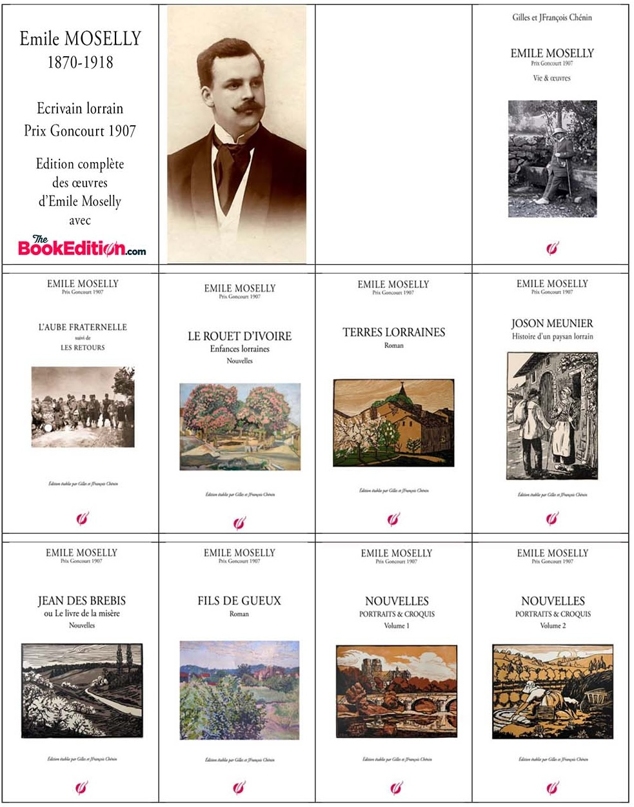
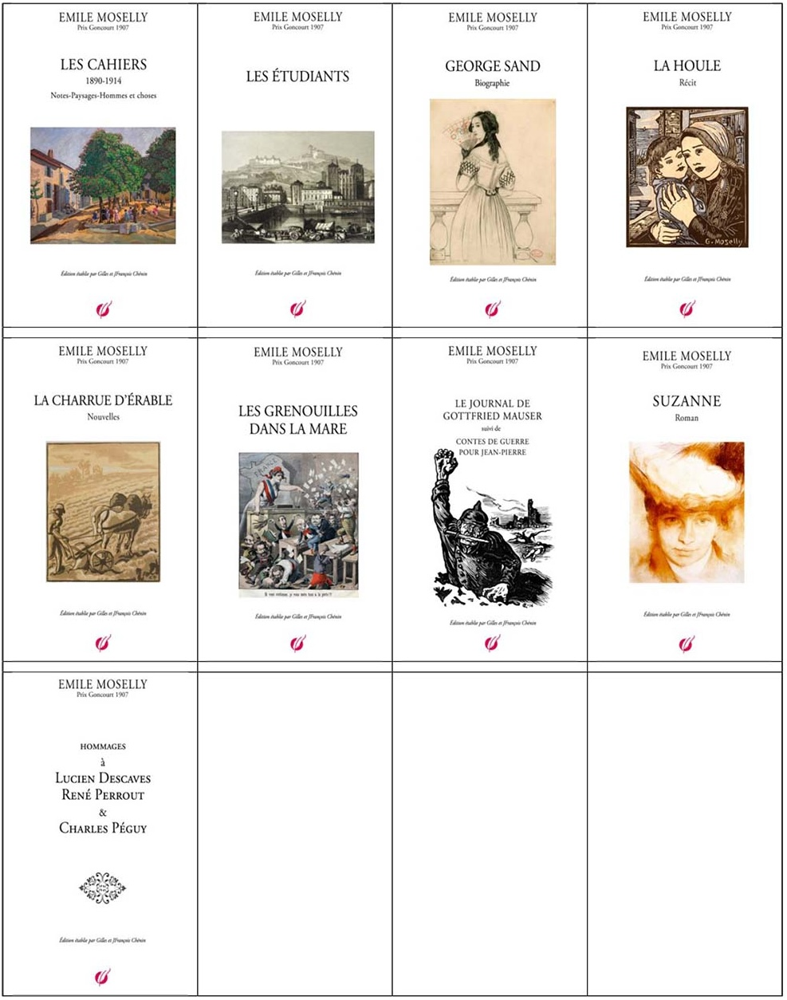

## L'AUBE FRATERNELLE suivie de LES RETOURS

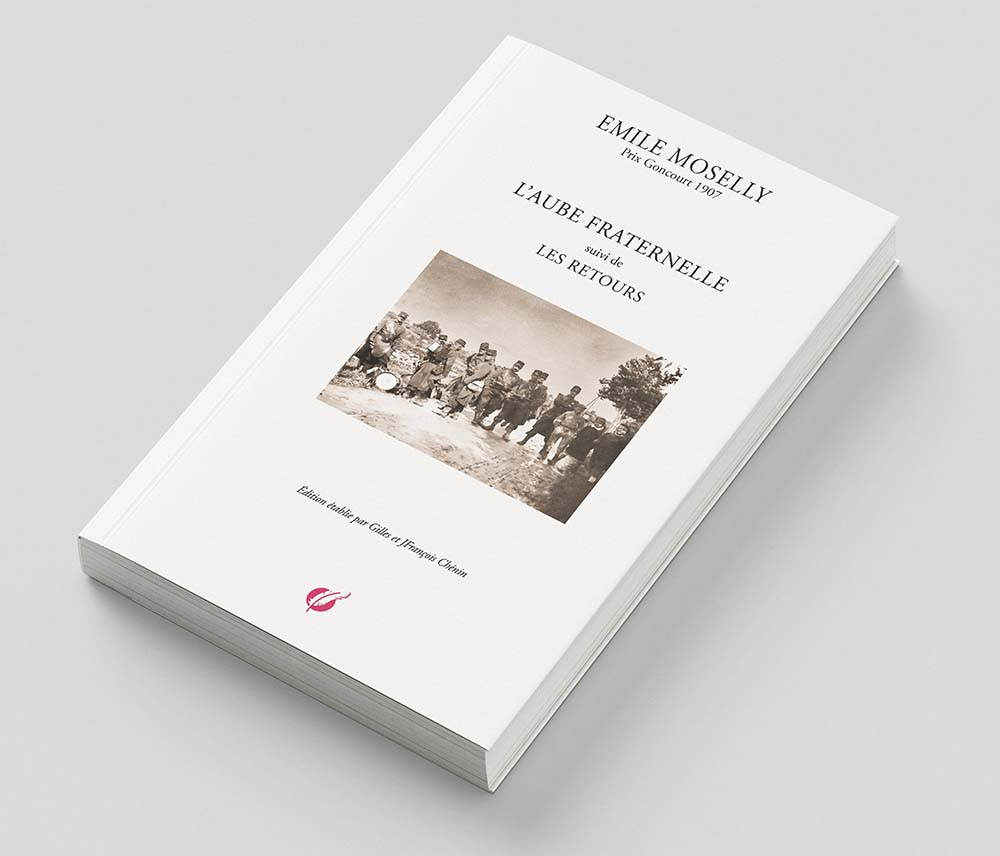

**_L'Aube Fraternelle_** est publié aux Cahiers de la Quinzaine (Cahier de la Toussaint de la quatrième série, 23 octobre 1902). Aucune autre édition de ce texte n'avait été faite jusqu'alors.
**_Les Retours_**, paru dans les Cahiers de la Quinzaine (Dix-neuvième cahier de la septième série, 24 juillet 1906), est composé de deux nouvelles :

- _Les Haleurs_, publié en janvier 1906 dans la revue Le Pays Lorrain et en 1908 dans _La Vie Lorraine, Contes de la Route et de l'Eau_, aux éditions Nouvelle Librairie Nationale, collection Les Pays de France.
- _Le Soldat_, paru sous le titre _Le Retour_ dans la revue Le Pays Lorrain en avril 1904 et en 1908, sous le titre _Le Soldat,_ dans La Vie Lorraine, Contes de la Route et de l'Eau_, aux éditions Nouvelles Librairie Nationale, collection Les Pays de France.
*A noter que La Vie Lorraine, Contes de la Route et de l'Eau a été* réédité en 1999 aux édition du Bastion (Sarreguemines).*

*L’Aube fraternelle* est un court roman publié en 1902 dans Les Cahiers de la Quinzaine. Il met en scène un groupe de jeunes hommes lorrains unis par une forte amitié et par un idéal de fraternité et raconte une jeunesse militaire en Lorraine

L’action se situe dans une Lorraine encore marquée par les conséquences de la guerre de 1870 et par la question de l’Alsace-Lorraine. Les jeunes personnages portent en eux un fort sentiment patriotique et moral. Ils rêvent d’un monde plus juste, plus solidaire, fondé sur l’honneur, l’amitié et le sacrifice.
Le récit met en scène de jeunes hommes engagés dans le service militaire. Cependant Le service militaire n’est pas seulement un décor, il structure l’idéal du roman. Et La fraternité raconté par Moselly prend ici une dimension : morale (amitié virile, loyauté), et civique (engagement envers la nation), elle est presque spirituelle (foi dans une régénération par la jeunesse). À travers un récit transcrit dans un carnet où le "jeune aspirant", note ses impressions et relate les relations avec ses compagnons
Le cadre militaire n’est pas un simple décor : il structure les relations, il crée une fraternité concrète (vie commune, discipline, épreuves partagées), et donne une dimension patriotique au récit.
La Lorraine devient un lieu symbolique : terre blessée, et pourtant porteuse d’espérance.
Mais le cœur symbolique du roman est le carnet : Il contient les pensées intimes de son auteur. et conserve, à Travers lui, l’idéal des jeunes soldats. Il fixe par l’écriture leurs élans fraternels, et représente la mémoire d’un moment d’enthousiasme. Il a aussi une forte fonction dramatique : en montrant  l’écart entre les idéaux écrits et la réalité vécue. Il symbolise la fragilité de l’« aube ».

---

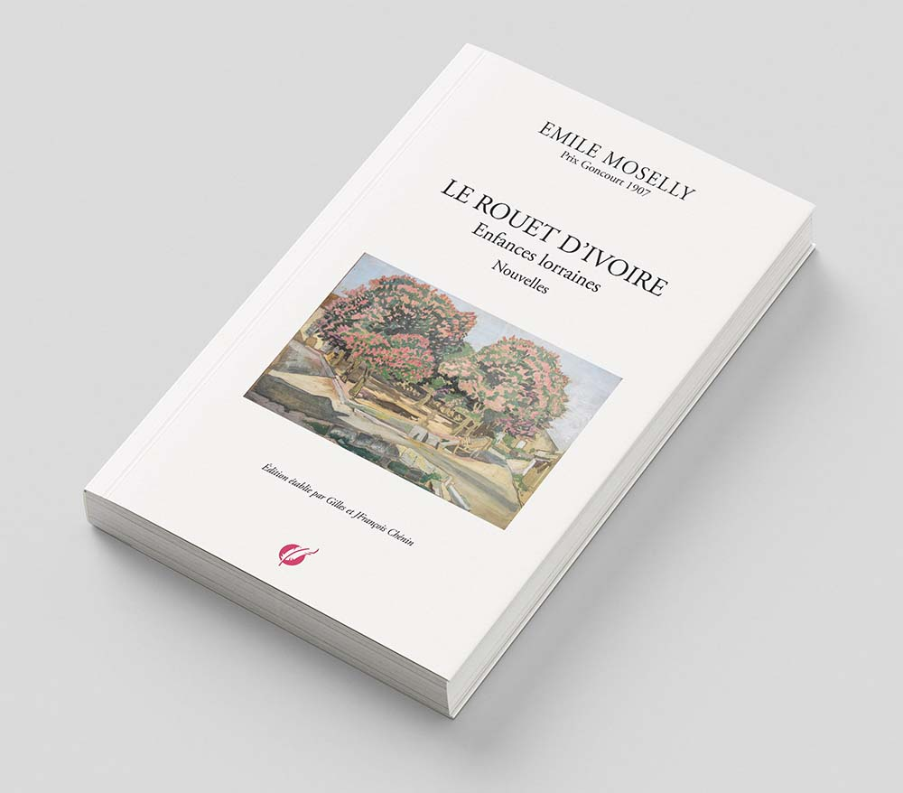

## LE ROUET D’IVOIRE, Enfances lorraines, Nouvelles

Introduction de Pierre Goudot

_Tous nos remerciements à la famille de Pierre Goudot (1929-2009) de nous avoir autorisé a reproduire la préface qu'il a rédigée pour une édition critique du Rouet d'Ivoire publiée en 1990 aux Presses universitaires de Nancy et Ed. Serpenoise._
_Pierre Goudot est l'auteur d'un mémoire de D.E.S sur La vocation régionaliste d'Emile Moselly (juin 1964) qui reste la référence pour qui souhaite connaître les ressorts profonds de la création littéraire chez E. Moselly._

Au terme de ses études de licence à la Faculté des Lettres de Nancy (1888-1891), Émile Chénin, dit Moselly, a préparé à Lyon, grâce à une bourse, le difficile concours de l'Agrégation, qu'il réussit en 1895. Originaire de Chaudeney-sur-Moselle, modeste village du toulois, issu d'une humble famille lorraine, il a réalisé une partie de ses ambitions : il ne portera pas la hotte (cf. La maison d'école) ; professeur agrégé des Lettres Classiques, il jouit d'une situation enviable qui le met à l'abri du besoin.

Il lui reste à devenir écrivain, rêve qu'on décèle dans son Journal dès l'arrivée à Nancy en 1888 ; il lui faudra gagner Paris, seule ville à l'époque où l'on pût se faire un nom dans la littérature. Une carrière professionnelle exemplaire l'en rapprochera progressivement ; il enseignera successivement à

Montauban (1895-1899), Orléans (1899-1910), Rouen (1910-1911), au Lycée Voltaire à Paris (1911-1914), au Lycée Pasteur à Neuilly enfin (1914-1918). (  _Moselly décède subitement le 2 octobre 1918 entre Quimper et Lorient, dans le train, au retour des vacances. Inhumée à Lorient, sa dépouille sera ramenée à Chaudeney le 9 octobre 1919_.

En réalité, la chance favorise ses ambitions littéraires bien avant sa nomination dans la capitale ; Orléans est la ville de Charles Péguy qui, en 1901, fonde à Paris Les Cahiers de la Quinzaine ; grâce à Mathiez, collègue connu à Montauban, Moselly le rencontre ; mêmes origines sociales, mêmes aspirations socialistes ; les affinités nouent entre les deux hommes, qui se tutoient dès mars 1903, une amitié profonde et efficiente qui ne se ternira pas au fil des ans. ( Leurs relations ont été étudiées par Alfred Saffrey in Péguy et Emile Moselly (_Cahiers de l’Amitié Charles Péguy, Librairie Minard, Paris 1966). outre la correspondance échangée, d’où sont tirés les extraits cités dans cette étude, Saffrey publie un vibrant hommage écrit par Emile Moselly en 1915 à la mémoire de son ami disparu)._

Moselly compte sur Péguy, qu’il soutiendra en revanche en toute occasion, lui et ses Cahiers, où parait en 1902 L'Aube Fraternelle, sous le pseudonyme révélateur de Moselly.

Assuré d'être édité, encouragé par l'accueil réservé par la critique à sa première œuvre, bénéficiant aussi d'une bourse d'études à Paris, Moselly prend un congé d'un an, qu'il prolonge d'un an (octobre 1902 - octobre 1904) _(Sa santé précaire et ses ambitions littéraires tout à la fois l’inciteront à prendre un autre congé d’un an, en 1910-1911, qui le dispensera d’enseigner à Rouen, où il venait d’être nommé. La situation aisée de sa belle-famille rendait possible de telles mises en disponibilité_). Il s’agit désormais de produire, d'autant plus que dans sa hâte d'être publié il courra revues et éditeurs, donnant parfois simultanément un même texte aux uns et aux autres. La revue Pages Libres publie trois nouvelles en janvier, juin et septembre 1904 ; en avril, Péguy sort Jean des Brebis, recueil de six nouvelles relativement engagées, réédité la même année chez Ollendorff, puis Les Retours en 1906. C'est en 1904 aussi que Moselly écrit son roman Terres Lorraines que la Librairie Plon éditera en 1907 seulement et qui décidera le Jury du Prix Goncourt en sa faveur.

La fondation du Pays Lorrain à Nancy, en 1904, arrive à point nommé ; Moselly s'y fait de nombreux amis ; le numéro 2 annonce la publication prochaine de ses textes ; son nom figure parmi les collaborateurs sur la couverture du numéro 3 ; il n'en disparaîtra qu'en 1931, lorsque la revue changera de format et de style. Quelques contes et nouvelles y paraissent en 1905 et 1906, dont six groupés sous le titre La Vie Lorraine.

La veine lorraine semble bonne et riche en ces temps de préoccupations régionalistes. Moselly l'exploitera en puisant abondamment dans la connaissance de la vie rurale donnée par une enfance et une jeunesse vécues dans le petit village de Chaudeney, situé à quatre kilomètres en amont de Toul, sur la rive droite de la Moselle. Il suffira, sans perdre de vue les débouchés parisiens, d'adapter cette veine à un nouveau public, de modérer le ton trop engagé des premières productions, adaptation que facilite l'évolution personnelle de l'écrivain.

C'est dans ce contexte d'intense production que se situent la genèse et la publication du Rouet d'Ivoire. Quand il s'agira, en 1906, de trouver la matière d'une œuvre nouvelle, Moselly songera à ses souvenirs d'enfance réveillés dès 1902 dans une sorte de crise psychologique dont son Journal offre les échos.

⁂

Lorsque encouragé par son instituteur, poussé aussi par le désir d'échapper à la vie difficile des campagnes, Moselly s'est lancé à la conquête du savoir, il aspirait à devenir un monsieur ; c'était l'époque où les études apparaissaient aux ruraux les plus doués comme le nouveau et seul moyen de promotion sociale. Moselly est de ces ambitieux fascinés par la ville, de tout cœur et non sans orgueil d'abord, considérant parfois avec quelque hauteur, dans sa correspondance d'étudiant, ceux qu'il a laissés au village.

La sécurité et l’aisance assurées par sa réussite universitaire, les satisfactions professionnelles, les plaisirs de la vie intellectuelle, le climat sain de Montauban où il débute sa carrière, les joies familiales enfin suffisent largement à son bonheur ; fiancé dès décembre 1896, il a épousé le 25 février 1897 Marie Barthélémy, de trois ans sa cadette, parisienne de famille aisée disposant de rentes égales au traitement de son mari_.( Témoignage oral de François Chénin. De ce mariage naîtront François (1898-1967), Germaine (1902-1950), Jacqueline (1906-1909), Jean-Pierre (1913-1987)._)

A Orléans, où il est nommé Professeur de Rhétorique en 1899, (_Au Lycée d’Orléans, Moselly comptera parmi ses élèves Maurice Genevoix qui évoque brièvement la personnalité de son professeur dans son essai autobiographique Trente mille jours.)_ le désenchantement apparaît peu à peu. Aux réflexions sur l'Art, aux analyses des influences littéraires subies succèdent dans le Journal des réflexions désabusées sur la société et le bonheur, sur la solitude parmi la foule citadine, sur l'absence cruelle d'un credo en cette fin de siècle où la jeunesse cherche désespérément des phares nouveaux ; il est lui-même quelque peu prisonnier d'un anticléricalisme irréductible et d'un socialisme humanitaire et sentimental hérités de son milieu et de son éducation ; les hivers orléanais, peu favorables à sa santé fragile, lui paraissent longs et pénibles ; les séjours à Paris, en Normandie ou en Bretagne pendant les congés scolaires courts ne peuvent vaincre une insatisfaction croissante qui se résout finalement en la prise de conscience de plus en plus nette d'une désagréable dualité : les ambitions littéraires tardant à se réaliser, l'esprit épris de culture et de poésie ne consent plus à sacrifier deux tendances profondes de la personnalité, le besoin d'affection, qu'il ne peut satisfaire dans le désert des villes, et le besoin de sensations éprouvées au sein de la nature, dont il est trop souvent éloigné. Vivre, changer de peau, être un autre (Journal).

Le processus de retour aux vraies sources est engagé. Apparaissent alors çà et là, brèves encore, des évocations à distance de la Lorraine, pays pauvre certes, mais pays de la lumière, pays de la verdure, pays de l'eau où lui semble de plus en plus évidemment resserré tout le bonheur possible ; ces descriptions détaillées et souvent reprises des mêmes sites, tous situés dans le cadre étroit des collines qui enserrent Chaudeney, trahissent la  nostalgie de plus en plus affirmée d'un bonheur perdu, essentiellement physique et sensoriel encore, désormais seulement permis pendant les congés scolaires d'été passés chaque année en Lorraine. Moselly occupe ses mois d'exil à se souvenir des étés lorrains de jadis et de naguère, dont il conserve dans la mémoire une image merveilleuse et immuable confirmée chaque année en août et en septembre.

L'été de 1901 le ramène à Chaudeney et satisfait une fois de plus sa boulimie de sensations de toutes sortes savourées dans la silencieuse et lumineuse fraîcheur de la vallée ; il conforte une image obsessionnelle où se mêlent soleil, lumière, verdure et fraîcheur, image conforme à ses goûts et adaptée à sa forte corpulence, nourrie certes d'éléments étrangers à la Lorraine mais dont la Lorraine offre seule, à ses yeux, l'exacte réalité. Ce séjour précipite l'évolution. Ces sensations agréables, nécessaires à son bonheur, Moselly les connaît pour la première fois, identiques dans le présent à ce qu'elles étaient autrefois, lorsqu'il était enfant ; elles revivent, associées à des lieux, à des personnages, à des mœurs, à des anecdotes, souvenirs divers mais toujours heureux, qui éveillent pourtant un sentiment nouveau : un tel contentement, trop parcimonieusement accordé, révèle par contraste le temps perdu : ... Il aurait voulu s'ennuyer, trouver le temps long, pour que les minutes durassent plus longtemps, et malgré tout il sentait que tout fuyait d'une fuite lente, confuse, rapide comme un sable qui tombe dans un sablier. Et les années passaient comme un souffle, et il était vieux. Il vient d'avoir trente-et-un ans ! Il envie un camarade de collège qui, avec quelque fortune, est resté à la campagne, chassant, pêchant, gentilhomme fermier désabusé du fonctionnarisme avant d’y avoir goûté et s’imagine que le véritable et tranquille bonheur est là : Rester là, y vivre, tenir à ce sol par ces petites racines de l'âme, le chevelu, qui font que les arbres meurent quand on les coupe. Le thème du déracinement, à la mode à l'époque et dont Barrès fut l'initiateur, n'est sans doute pas étranger à cette évolution.

Pourtant, au début d'octobre, incapable de renoncer aux avantages du fonctionnarisme et aux rêves de gloire littéraire, il quittera une fois de plus le pays de son enfance en partie retrouvée et pour des mois. _Le train s'éloignait ; par les grandes glaces des larges baies le pays apparaissait une dernière fois. Jamais il ne l'avait mieux compris que par cette matinée pluvieuse d'octobre où les nuages bas, rasant les collines, crevant à la cime des forêts, semblaient laisser fuir la pluie en ondes torrentielles comme d'une poche crevée. C’était bien le pays de l'eau, avec les canaux débordants, les nappes étalées sous les feuilles..., ses rivières contenues par des barrages... Ce pays de sources qui fuient à travers le cresson et les menthes sur un lit de cailloux Et toute cette eau, sortie des veines de la terre, nourrissait les herbes et leur donnait cette robustesse drue, ces teintes vertes résistantes, cet air de santé que les paysages ont comme les hommes. L'air était frais sous les feuillages, et quand le reste de la France, à la fin des étés, était brûlé et aride, quand les prairies galeuses laissaient voir le sol comme une toison de bête ravagée par les mites, on arrivait avec délices dans ce pays d'eaux charmantes et dormantes, plein de ruissellement de fraîcheurs, où la grande voix des barrages se mêlait aux sonnailles des chevaux sur les chemins de halage._

En l'espace d'une demi-page écrite à Orléans à son retour, Moselly transforme l'image d'une exécrable matinée pluvieuse d'octobre en vision estivale paradisiaque ; ce glissement inconscient est révélateur de son obsession, qui s'explique par le fait que, depuis une dizaine d'années, il n’a revu la Lorraine qu'à la belle saison . Il a désappris la Lorraine de l'hiver. Sa mémoire, certes fidèle, ne pêche que par omission. Il lui reste à retrouver la Lorraine de la mauvaise saison et de la misère : le séjour exceptionnel de Pâques 1902 en sera l'occasion. La révélation est immédiate et brutale, dès la sortie de la gare de Toul.

_Retour au pays natal. Arrivé par un soir pluvieux de mars. Ce n'est pas l'impression exquise des juillets pleins de fraîcheur au sortir de la canicule qui brûle le reste de la France... tout est brume, boue... tout de suite la ville noyée dans un flot de boue noire, liquide, de fange qui donne la nausée, triste, cette impression. Est-il possible que cela soit si petit, celle ville que dans mes souvenirs je vois si grande, si large, si pleine de coins, de clairières avec du soleil, de grands pans de lumière sur ses maisons ? ... Quelques détails oubliés qui rappellent toute une vie par-delà de lointaines, de mystérieuses associations..._

_Et je reprends comme il y a quinze ans le chemin le long de la rivière. La nuit vient. Je me retrouve tout entier... Puis me voilà dans la vieille maison où tout de jour en jour s’écroule. Pauvre vieux logis, si grand jadis pour mes pas d'enfant et si plein de terreurs... Ses bruits me reportent loin, bien loin, si loin qu'il me semble qu'il est impossible que tout ce qui s'est passé, qui est ma vie, soit une chose réelle, et que je vais me remettre en marche de ce point de départ vers une autre vie. Insomnie, tristesse, regrets, plans chimériques, projets ! Au matin, dans l'aube douteuse, pâle, traînant une lumière hésitante sur la rue boueuse, des petits enfants passent, car c'est vendredi saint, annonçant l'angélus avec des cliquettes de bois... Je me lève pour les voir. Ils sont cinq ou six sous l'averse, hâves, grelottants ; il me semble que de mon temps ils étaient plus nombreux, ils étaient plus joufflus, et que c'était par des matins lumineux de Pâques, où la grâce d'avril souriait dans le frisson des dernières gelées, qu'ils marchaient sur la terre durcie, de mon temps. Mais cet angélus mouillé, par ces petites voix grêles, couvertes par le crépitement des crécelles, oh ! que c'est triste !_

Pendant ces quinze jours de temps maussade, c'est tout un autre pan de sa vie passée qui se révèle à lui. Les moindres sensations, les scènes vues réveillent des souvenirs d’une tonalité nouvelle. Il a conscience de la révélation, il le répète souvent ; tout lui revient, jusqu'aux bruits familiers qui, un à un, gravés en lui, y réveillent l'âme ancienne. Il redécouvre enfin l'enfant qu'il avait été réellement, jadis, et dont il se met à rechercher les moindres faits et gestes, les émotions les plus ténues. Dorénavant, et pendant un certain temps, son Journal sera essentiellement l’écho de cette quête d'un passé plus triste, mais plus vrai.

Font irruption le climat rude, les frayeurs enfantines, les miséreux de rencontre, les épaves de la vie, les méchants, la mort, les évocations de la nuit, quasiment absentes auparavant tout comme celles de la maison des grands-parents et de la cheminée lorraine, centre d'un univers restreint et protégé dont l'adulte redécouvre les limites et les bienfaits parce que, inconsciemment, sa sensibilité en a encore besoin. Jetés pêle-mêle sur le papier, encore incomplets, ces souvenirs constitueront partiellement la matière du Rouet d'Ivoire, œuvre manichéenne dans une certaine mesure : la Lorraine de l'été et de la joie s'y oppose à la Lorraine de l'hiver et de la misère. Cette double tonalité de l'œuvre est le fruit et le reflet de l'histoire intime de l'auteur.

Si _Le Rouet d'Ivoire_ fut écrit en 1906, c'est à Pâques 1902 que Moselly en a découvert le principe et le sujet, sans percevoir toutefois les idées directrices qui orchestreront le foisonnement de ses souvenirs d'enfance.

⁂

Le Rouet d’Ivoire est écrit en 1906 pour le Pays Lorrain, mais Moselly ne perd pas de vue la capitale, et d'Orléans il écrit à Péguy le 9 octobre 1906 : _Je termine une petite machine, guère plus grande que l'Aube, des impressions d'enfance, très ténues, très fouillées comme style. Ça paraîtra dans la revue du Pays Lorrain. Mais je voudrais tenter de la caser dans une revue de jeunes à Paris. C'est trop « poème en prose » pour le public des Pages Libres. As-tu des tuyaux sur quelque revue (Ermitage ou autre) où je pourrais frapper ou me recommander de toi ? Je ne voudrais pas que cela soit publié seulement à Nancy._

Le Pays Lorrain annonce la parution du recueil dans sa livraison du 20 janvier 1907 : _Notre collaborateur Émile Moselly a écrit spécialement pour notre revue une série de souvenirs d'enfance, impressions très ténues où il s'est préoccupé de retracer la vie lorraine vue par les yeux d'un tout petit. Nous les publierons prochainement._

Il faudra attendre le 20 juin pour découvrir les trois premiers extraits, l'ensemble étant publié sur un an et demi, jusqu'en novembre 1908, de façon régulière d'abord, puis nettement moins suivie à partir de mars 1908 ; l'œuvre est complète, à l'exception du chapitre Nuits lorraines, publié isolément dès juillet 1906 et suivi d'une exhortation véhémente à promouvoir la littérature régionaliste ; d'autre part, le chapitre Bonne Dame est amputé par inattention de ses sept derniers paragraphes.

La mise en route trop lente de la publication et la durée prévisible de son échelonnement dans le temps incitent Moselly à solliciter à nouveau Péguy. Le 2 juillet 1907, avant de partir pour Chaudeney, alors que Le Pays Lorrain vient seulement de donner les trois premiers chapitres, il renouvelle son appel à peine déguisé du 9 octobre 1906c_: Je t'ai parlé peut-être d'une petite série d'impressions d'enfance, que publie en ce moment Le Pays Lorrain. J'aimerais bien que cela paraisse aux Cahiers plus tard. D'ailleurs, je crois que cela se vendrait bien en Lorraine, mon roman étant bien parti là-bas._ _( Il s’agit de Terres Lorraines, sorti des presses de la Librairie Plon en mars et mis en vente en avril.)_

Cette fois Péguy se laisse convaincre, et les choses vont aller vite, plus vite que Moselly l'espérait. Péguy publiera lui-même ces impressions d'enfance, demande le manuscrit pour le 22 septembre, mettant dans l'embarras l'écrivain qui, de Chaudeney, lui répond le 24 août : *Je ne crois pas avoir mon manuscrit prêt pour le 22 septembre. Une partie est à Nancy, l'autre à Orléans. Je n'ai rien ici. Il faudrait attendre les premiers jours d'octobre.*

Ce manuscrit ne nous est pas connu. En revanche nous en possédons un exemplaire composite, mis en vente chez un libraire parisien en février 1987 et acquis par la Bibliothèque Municipale de Nancy. En réalité, il s'agit plutôt d'un montage que d'un véritable manuscrit. C'est un volume relié gr. in-4 demi-reliure chagrin marine comportant 93 feuillets de papier verger. Les trois premiers feuillets présentent six lettres collées, avec leur enveloppe, toutes adressées aux Cahiers de la Quinzaine ou à Péguy lui-même ; trois sont de l'auteur, Émile Moselly, l'une est de Charles Sadoul et complétée par Moselly ; les deux dernières sont de Gustave Geoffroy et de Léon Daudet.Les 24 feuillets suivants portent, découpées au ciseau dans Le Pays Lorrain et collées au recto seulement, les pages de la première partie, L'hôte muet compris, rapidement corrigées par Moselly et annotées par Péguy en vue de l'impression. Les 68 derniers feuillets portent la deuxième partie, recopiée par Moselly sur des pages 13,5 x 21 à petits rectangles également collées au recto seulement et annotées par Péguy qui a mentionné de sa main au bas de la page 74 : il n'y a pas de page 75. Le cinquième feuillet enfin, page de titre dans le Pays Lorrain, porte la dédicace autographe suivante : A Monsieur Saffrey, ce manuscrit où j'ai enfermé route mon enfance. Émile Moselly. Bien que le nom du destinataire ait été gratté, il est lisible. (_Après l’impression, Moselly a sans doute récupéré la matière donnée à Péguyet fait relier l’ensemble, l’offrant ensuite à Saffrey, père d’Alfred Saffrey, cité plus haut. Il lui avait déjà dédié L’Aube Fraternelle. Il est à remarquer que la coupure dans le manuscrit correspond à la structure de l’œuvre qui comporte deux parties.)_

L'histoire de ce livre est difficile à établir avec certitude. Rentré à Orléans au début d'octobre, Moselly s'est mis au travail, un peu tardivement, condamné à faire front de deux côtés à la fois, pressant son ami Sadoul, directeur du Pays Lorrain, de lui renvoyer le manuscrit de la première partie, faisant patienter son ami Péguy pour qui il recopie à la hâte la deuxième partie, dont il ne s'était pas dessaisi et dont il lui faut désormais deux exemplaires. Cette copie très hâtive de la seconde partie, parsemée de quelques grossières négligences, est envoyée à Péguy le 14 octobre, comme en témoigne le télégramme qui l'annonce : Manuscrit expédié à Orsay. Chénin.

Le lendemain, Moselly écrit à Péguy : *Orléans, Dimanche. Mon cher ami, Accorde-moi un délai d'un jour. J'attends la première partie imprimée à Nancy. Voilà une semaine que je la réclame à Sadoul. Il est probablement furieux que l’ouvrage ne lui soit pas réservé inédit. Ainsi la destinée des pauvres auteurs n’est pas enviable. A part quelques pages, tout est prêt. Le bouquin n'est pas gros, et sera facile à imprimer. Je télégraphie à Sadoul. Tout arrivera peut-être_ aujourd'hui.Tu l'auras alors demain soir...*

Exigeant, mais dévoué, il obtient de ses deux amis qu'ils fassent dans leurs publications respectives une publicité réciproque.

Sadoul, quant à lui, peu pressé en effet, garde le manuscrit, renvoie en revanche les épreuves déjà tirées pour le Pays Lorrain ; les ayant relues et rapidement corrigées, Moselly les transmet immédiatement à Péguy qui lui en accuse réception sur le champ et le 17 octobre, enfin libéré de la situation délicate dans laquelle il s'était lui-même fourré, il peut faire à son ami éditeur ses dernières recommandations d'auteur :..._Il faudra mettre un beau titre en rouge.Je crois que le petit livre, typographiquement, quand tu y auras mis tes soins, pourra être un petit bijou. Ces petits contes, avec les titres divers, nombreux, feront bien. Arrange cela avec l'amour et la compétence que tu mets à ces choses. Il n'y a plus que toi à Paris qui ne cochonne pas. Ne te guide pas sur l'imprimé de Sadoul, qui n'entend rien à la typographie.Choisis surtout le caractère des titres : Le Rouet d'Ivoire, Le Revenant, etc. , je crois que cela a de l'importance. il faudra qu'ils se détachent bien dans la page, reposent l'œil, donnent le goût de lire l'histoire qui suit. Tout cela est empâté dans l'impression du Pays Lorrain. Ce n'est pas cela. Il faut faire un livre d'enfant, joyeux à l'œil. Je l'ai écrit avec l'idée de faire tout le temps ces petites vignettes qu'on voit en marge des belles eaux-fortes. Tu comprends. Non la rigueur du dessin. C'est un livre de croquis._

Ainsi s'explique la nature très particulière du manuscrit de Nancy, sur lequel a travaillé Péguy ; il y a porté en effet, à l'encre noire, des recommandations d'ordre typographique, réparti la tâche entre les typographes, signalé parfois sa surprise ou son hésitation devant un mot illisible, un mot lorrain inconnu, un accord surprenant, un choix maladroit des temps ; mais il a aussi corrigé d'autorité les innombrables fautes d'impression et d'orthographe relevées sur les feuillets du Pays Lorrain (quelques-unes aussi dans la deuxième partie !), modifié la ponctuation, suggéré des corrections dont certaines ne seront pas retenues par les typographes, qui à leur tour commettront quelques erreurs d'inattention. Ainsi s'expliquent aussi les divergences considérables entre le texte du Pays Lorrain, d'assez piètre facture, et celui des Cahiers, qui n'est pas sans erreurs, grossières parfois. Ce n'est pas tout : les épreuves de Péguy ont été revues non pas par Moselly, davantage préoccupé, semble-t-il, par l'apparence de son livre que par la perfection de son contenu, mais par l'un de ses collègues. J'ai corrigé les épreuves, écrit-il à Péguy le 26 octobre, ou plutôt Weil, philologue, les a bien vues, il a fait quelques changements qui me paraissent très heureux, très justifiés.

Les interventions de Weil ne sont pas négligeables, ni en nombre ni en qualité, tant sur le style que sur la ponctuation : élimination de quelques adverbes ou de mots répétés, inversion assez fréquente dans des groupes de deux compléments par souci d'euphonie, de clarté, de précision ou de justesse, suppression de quelques propositions jugées inutiles ou lourdes ; en revanche, ne tenant pas compte du manuscrit parce qu'il ne songeait qu'à améliorer la forme, Weil n'aperçoit pas que le mot jeux est devenu yeux (La joie), que l'adjectif petit a remplacé l'adjectif lorrain peut (Nuits lorraines), que les carillons de la nuit de Noël éparpillent dans l'air leurs robes bondissantes au lieu de leurs notes, toutes erreurs, parmi d'autres, que Moselly aurait décelées s'il avait lui-même vu les épreuves. Les plus évidentes seront supprimées dans l'édition Plon (février 1908) établie à partir du texte des Cahiers, que Moselly a sans doute relu, cette fois.Le 12 novembre 1907 parait Le Rouet d'Ivoire, quatrième Cahier de la neuvième série, tiré à 1 600 exemplaires, et le 18 l'auteur peut exprimer laconiquement à l'éditeur sa satisfaction : _J'ai reçu le cahier, c'est bien. Il paraît au bon moment,_ est favorablement accueilli par la critique, est jugé remarquable par Léon Daudet qui conseille à Péguy d'en adresser un exemplaire à chacun des dix membres du Jury du Prix Goncourt ; l'un d'eux, Lucien Descaves, acquis à Moselly, présentera conjointement Le Rouet d'Ivoire et Terres Lorraines, sorti des presses en mars : la petite machine a pu peser favorablement sur la décision des Goncourt qui, le 5 décembre, font de son auteur leur cinquième lauréat. Des cinq mille francs qu'il reçoit il donne mille francs à Péguy : geste de gratitude et de soutien.

⁂

L'intention de Moselly est clairement avouée au début du recueil, dont le titre symbolique est expliqué dans le chapitre liminaire ; elle est rappelée dans le dernier chapitre : c'est le petit brinquin qu'il fut et qu'il tente de retrouver et de faire revivre, l'enfant dont il a éveillé en 1902 le nostalgique souvenir.

Peu à peu redécouverts, notés au jour le jour et sans préoccupations stylistiques dans son Journal où ils ne figurent pourtant pas tous, les éléments ne manquent pas. Mais leur publication impose l'orchestration de cet ensemble riche où l'agréable et le désagréable sont intimement mêlés. Or, Moselly n'a pas naturellement la vision immédiate des grands ensembles structurés ; il est sensible aux impressions du moment, perçoit et savoure les détails d 'abord ; leur agencement ne peut être que le fruit d’une recherche volontaire, d'un effort conscient de mise en ordre, de l'art en somme.

Il a l'habitude de noter dans les cahiers de son Journal, sur les pages de garde en particulier,et d'un mot souvent abrégé, les sujets d'œuvres possibles. Le Rouet d’Ivoire n'y est évoqué qu'une fois, sans date :

_Ma vie d'enfant. L'humble vérité. L'art, mes enfants, c'est d’être absolument soi-même (P. Verlaine)_

_Manuscrit Rouet d'Ivoire. Travailler style l’Art. Faire court._
_Choses vues._
_Faire court. Pas d'adj. des verbes._
_Petits récits d'un art parfait, fin, amusant, terrible, drôle, myst._
_Choisir en tout le détail caractéristique, le trait caractéristique._
_Dire plutôt moins que trop. Choses émouvantes. Pas trop d'adjectifs._
_Choisir, combiner en vue de l'effet la chose_
_caractéristique_.

Parmi ces notes, qui révèlent des intentions stylistiques sans doute communiquées oralement à Weil, on ne relève rien qui concerne la composition ; le fragment Nuits lorraines est publié isolément dans Le Pays Lorrain dès juin 1906 ; nous possédons un premier état de La maison d'école ; ces faits laissent penser que Moselly n'a pas vu d'emblée dans quel ordre il classerait des fragments écrits séparément pour la plupart. Mais cet ordre existe finalement, et très élaboré.

L'évocation chronologique des souvenirs semble d'abord la solution choisie ; le fil brillant de la jeunesse, lentement dévidé par le rouet, est marqué de quelques indications d'âge : il est âgé de neuf mois à son arrivée à Chaudeney, de cinq ans lorsque sa grand-mère l'emmène à Pagney, de six ans au plus lorsqu'il croit aux sornettes de Fanfan, et il n'a pas encore l'âge de raison, estimé alors à sept ans par l'Église, quand sœur Stanislas l'accuse d'être en état de péché mortel. Peu nombreuses, et toutes relatives à la première enfance, ces précisions donnent d'abord l'illusion d’une chronologie suivie, mais sujette à caution dans certains cas et rapidement infirmée par l'ordre des textes : L'eau de Pagney précède Récit de guerre. D'autres fragments regroupent des impressions d'époques différentes et ne pouvaient s'insérer logiquement dans une chronologie fidèlement respectée.

En fait, c'est la découverte sans cesse élargie du monde qui sert de fil conducteur à l'ensemble, dans ses grandes lignes du moins. Dans la maison lorraine qui enferme dans ses racoins des profondeurs ténébreuses, je marche avec ravissement à la découverte du monde. J'avance à tâtons, si petit, dans l'immensité des terres inconnues (Le Rouet d'Ivoire).

C'est d’abord l'exploration du grenier, puis l'évocation de la cheminée lorraine, de l'âtre symbolique, de la veillée, la découverte de la cave, du jardin, puis des champs et des bois avec grand-père : L'horizon recule : comme le monde est grand ! (Le sac de sorbes). Avec grand-mère enfin il franchira les limites de l'horizon : pour la première fois je connais l'immensité du monde (L'eau de Pagney).

Il n'ira pas au-delà, s'arrêtant sur le bord du monde à conquérir, encore trop jeune pour répondre à l'invitation au voyage symbolisé par les chalands (La vie de l'eau).

La découverte d'un espace de plus en plus étendu, et très limité en fin de compte, ne suffit pourtant pas à l'orchestration de tous les souvenirs d'enfance. C'est en réalité la découverte progressive de la vie qui constitue la trame et donne au recueil l'unité qui aurait pu lui manquer.

Placé après l'hôte muet, le chapitre La joie crée une surprise brutale, au beau milieu de l'œuvre : onze chapitres le précèdent, onze chapitres le suivent, d'inégale longueur il est vrai, Petit brinquin étant une conclusion. Ce n'est sans doute pas l'effet du hasard. Moselly s'explique d'ailleurs sans ambiguïté dans ce fragment central, conclusion de

la première partie et introduction de la seconde, véritable clé de voûte d'une architecture calculée, point de rupture entre deux époques et deux univers : l'un heureux, celui de la petite enfance et de l'imagination, l'autre plus rude, celui de la jeunesse et de la froide raison.Le premier est décrit au présent le plus souvent, qui abolit le temps, comme si Moselly retrouvait d'instinct ou voulait donner l'illusion de retrouver cette période éphémère où l'enfant est pleinement heureux : sécurisé par un cadre étroit et connu, conforté par l'affection familiale et la vie bruyante et familière du village, il vit librement au niveau

de la terre et des choses : elle est bonne la terre ; tout est neuf, tout est occasion d'émerveillement, l'imagi­nation se déploie sans contraintes.Puis l'enfant se hausse, sa taille grandit : alors ses yeux ne perçoivent plus le bruissement de la vie, qui court au ras du sol, et la souffrance vient à mesure qu'il se détache de la terre.

Tout le secret du bonheur conservé dans l'enfance réside dans cette entente harmonieuse avec les choses.Désormais il faudra compter avec la vie et avec les hommes ; c'est d'eux seulement que viennent les déceptions. Cet autre univers est décrit au passé, avec un regard d'adulte qui, malgré lui, a compris et pris ses distances.

La différence de tonalité entre les deux parties est nette, encore qu'elle ne soit pas aussi schématique ; l'adulte intervient et juge dès les premières pages, et l'évocation des bons souvenirs restera pleine de fraîcheur jusqu'à la fin de l'œuvre ; et puis, il est des désillusions précoces comme il est des joies tout au long de l'existence : mais les premières sont vécues dans la confiance et la sérénité que procure un entourage sécurisant, les autres le sont au contact des réalités qui interpellent l'enfant, imposent leur loi et révèlent le vrai visage de la vie dont l'apprentissage n'est qu'une suite de désenchantements ; les influences subies se multiplient, s'ajoutent, se contredisent, obligeant l'enfant, de plus en plus seul, à choisir.

L'entrée de L'hôte muet dans sa destinée marque la rupture entre les deux mondes de l'enfance et de la jeunesse. Tout suggère dans ce chapitre que Moselly a perdu ses grands-parents maternels alors qu'il était enfant ; son Journal confirme qu'il a lui-même cette impression ; en réalité, il avait 16 et 17 ans. Infidélité de la mémoire causée par le retentissement affectif de la disparition de ceux qui ont veillé sur ses premiers pas ? Liberté d'écrivain qui tronque sciemment la vérité ? Peu importe l'explication. La révélation de la mort mystérieuse n'est pas essentielle ici ; ce qui compte pour Moselly, inconsciemment ou consciemment, c'est la valeur symbolique de la disparition, à un an d'intervalle, des deux êtres tutélaires, suivie de peu par la vente de leur maison, berceau de l'enfance ; l'hôte muet a brisé brutalement le cocon : il faudra maintenant, bon gré malgré, tourner ses regards vers les hommes. C'est donc moins son enfance que Moselly raconte que le passage désespérant de l'enfance à l'âge adulte. Enfances lorraines : le pluriel est significatif, comme les commentaires de l'écrivain adulte qui, çà et là, juge et généralise. Par-delà un contexte social et un environnement qui ont beaucoup changé, Moselly raconte l'odyssée fatale de tout enfant condamné à grandir.

⁂

            Peu d'œuvres autobiographiques sont autant que celle­-ci nourries de la substance de leur auteur, dont la sensibilité, les goûts et les intérêts et même la philosophie transparaissent à chaque ligne, quand ils ne sont pas ouvertement révélés par l'écrivain.

A l'exception de deux faits (l'âge auquel il a perdu ses grands-parents et l'identité du parrain), tout y est authentique : les noms et la description des lieux, les noms propres des personnages, les souvenirs relatés. Moselly livre son enfance et son être intime sans rien travestir.Or, dans ce recueil consacré à l'enfance, il n'y a pas d'enfants, ou très peu. Leurs jeux et leur psychologie sont évoqués collectivement dans les deux chapitres La joie et Bonne Dame ; Simone n'est guère que l'occasion de faire intervenir Annette la bigote et la terrifiante Sœur Stanislas (L'église) ; quant à Amarine, la fillette du batelier, plus longuement mise en scène, l'attrait qu'elle exerce rivalise mal avec l'attrait de l'eau (La vie de l'eau)fréquentations féminines surtout, révélatrices de la sensibilité de Moselly, mais rares dans l'œuvre, peuplée essentiellement d'adultes ; ce sont eux qui comptent, parce qu'ils sont les initiateurs de l'enfant, les mentors ou les mauvais génies qui le conduisent vers l'âge mûr.

Les premières années vécues dans la maison des grands-parents maternels (1871-1874), puis dans la maison des parents située en face, mais en leur constante présence jusqu'à leur mort, ont marqué de traces indélébiles la personnalité extrêmement sensible de l'enfant. La fascination qu'exerce l'enfance sur l'écrivain et, partant, la nostalgie qu'il en éprouve cruellement, sont davantage les effets de son besoin de vivre dans un univers restreint, clos et protégé que ceux de son besoin de sensations et de son amour de la nature estivale. Le Rouet d'Ivoire est d'abord un hommage aux êtres bons, ceux dont on n'a rien à craindre parce que, restés humbles, ils pratiquent spontanément la fraternité.

Les femmes sont foncièrement bonnes : la grand-mère, un peu naïve et traditionnelle ; la mère, qui connaît la misère et accueille avec compassion Philippe le mutilé et l'artiste bavarois ; la Babette aussi dont l'amour, reporté sur les chats et sur un vagabond, a survécu aux frasques du Tourment ; Bonne Dame même, épave de la vie qui héberge deux autres épaves. Quelques personnalités masculines ont témoigné à l'enfant, à leur manière, la même affection tutélaire, de l'intérêt tout au moins : le grand-père surtout, mais aussi, à un moindre degré, le père, et Fanfan le joyeux luron et parrain, et l'artiste bavarois, et Colin Michelot, dont les quolibets affectueux ont plu à l'enfant, et Monsieur Pierson l'instituteur. Ils ont tous contribué à faire des pénates enfumés et du petit enclos lorrain un havre de paix et de bonheur, qu'il a bien fallu quitter : la résonance toute affective de la dédicace à Emile Krantz, autre génie protecteur, prend alors toute sa signification. Il est surprenant que dans cette galerie d'êtres affectueux le père et la mère soient si peu présents ; ce sont les grands-parents surtout qui ont entouré le tout jeune enfant de leur amour. Et puis le père avait vu du pays et lu les philosophes du XVIIIe siècle et s'il formait avec son épouse un couple uni, son passé et son originalité faisaient de lui un être à part, bon, mais plus distant, dont l'influence sur l'enfant fut aussi sans doute déterminante. Ils n'auraient pas dû se marier, écrit Moselly dans son Journal, car ils étaient chacun d'un côté de l'eau différent ; la Moselle sépare les deux pays et les unions sont rares, les gens ne se ressemblent pas. Au pays de mon père on a le sang vif, on est mécréant, hâbleur, pays de culture, de travail, de dure, de labeur ; chez ma mère on est posé, bourgeois. On va à la messe, pays de vignerons. Ma mère, qui n'était pas riche, a toujours considéré mon père un peu comme un bohème. Il avait plus de bien et du meilleur, mais ce n'était que des prés et des champs, et on ne buvait pas de vin .

En revanche, parrain occupe une place de choix dans cet univers sécurisant ; or, il n'était pas le parrain de Moselly, mais un oncle paternel menuisier à Pierre-la-Treiche, le parrain en titre étant Victor Gantois, oncle maternel, de Chaudeney. Cette seconde et dernière liberté prise à l'égard de la vérité est révélatrice des intentions de Moselly : l'enfant trouvait chez parrain et sa femme, les braves gens, plus d'affection et plus de joie que chez le véritable parrain, qui aurait dû mieux assumer cette fonction, importante à l'époque en ce qui concerne la tutelle et l'éducation du filleul.

            Nécessaire à la sensibilité de l'enfant, ce climat d'amour et de bonté a aussi fortifié cette sensibilité, faisant de lui un adulte vulnérable, méfiant face aux étrangers, persuadé pour toujours que seuls sont heureux les couples unis et les individus qui n'ont pas quitté le pays natal, paradis des affections sûres ; tous les personnages du Rouet d'Ivoire illustrent, sans exception, cette idée : le malheur, plus intolérable que la misère, provient toujours de l'absence des êtres chers ou de la solitude morale ; ceux qui se déracinent font leur propre malheur, mais aussi celui des leurs. Vécu personnellement, le thème du déracinement trouvait dans la thèse de Barrès une confirmation évidente. De là provient également la sympathie que Moselly témoigne d'instinct à tous les réprouvés, aux abandonnés (les deux vieux, Babette), aux vagabonds, aux exilés (l'artiste bavarois), aux déracinés, aux victimes de la vie (le vieux soldat, Philippe, Bonne Dame, et même Monsieur Pierson). Cette commisération est une constante dans son œuvre littéraire.Il est évident que l'enseignement de Monsieur Pierson a fortifié considérablement cette sympathie toute sentimentale pour les humbles et les victimes et, du même coup, la haine de toutes les formes d'oppression, parachevant l'œuvre du père et surtout de Colin Michelot (La maison d'école). Représentant type de l'enseignement primaire de la troisième République, Monsieur Pierson dispensait une instruction solide qui devait permettre aux plus doués de ses élèves d'échapper à la vie dure et à la sujétion, mais il enseignait aussi que les rois avaient été des débauchés et les prêtres des imposteurs. Moselly connaît bien les racines de son socialisme et de son anticléricalisme, plus affectifs que réellement philosophiques. L'Eglise, qui prônait alors une religion austère et dramatisait les récits de l'Évangile, brandissant sans cesse la menace de l'enfer, a-t-elle aussi, sa responsabilité dans l'évolution de l'enfant (L'église). La crainte qu'inspirait son autorité indiscutable, les terreurs qu'elle éveillait et entretenait chez les fidèles ne pouvaient façonner que des âmes totalement soumises ou rapidement rebelles ; l'influence de l'effrayante sœur Stanislas est combattue par celles de Monsieur Pierson et de Colin Michelot, à qui Moselly empruntera finalement leur anticléricalisme farouche, répandu à la fin du XIXe siècle ; il reprochera toujours à l'Église de promettre un bonheur à venir au prix d'une vie exigée misérable.Le dernier de ces initiateurs est Karl, le sculpteur bavarois de passage lors des vendanges (Premier maître). L'éloge que fait de lui Moselly est sans réserve, enthousiaste, lyrique et vibrant de gratitude parce que, dans son existence d'adulte, c'est à l'Art surtout qu'il demande les consolations de son existence d'exilé. Si on l'en croit, Karl lui a révélé l'amour de la vie, qu'il tenait déjà de sa propre nature, le souci du détail vrai, vers lequel le portait naturellement son esprit peu à l'aise dans les larges conceptions, et le culte de la Beauté, que d'autres plus tard ont fortifié, les auteurs anciens et classiques en particulier.Ayant redécouvert son enfance en 1902, Moselly la révèle en 1906, mais en y ajoutant, lors de la rédaction et de la composition du Rouet d'Ivoire, une autre quête : il cherche dans son passé d'enfant l'explication de sa personnalité d'adulte, difficile à assumer. C'est aussi une manière de retrouver ses racines. S'il est quelque subjectivité dans ce recueil, elle est dans cette justification qu'il faut la situer.

⁂

Le Rouet d'Ivoire est bien une petite série d'impressions d'enfance très ténues, selon Moselly lui-même, et c'est comme tel que la critique élogieuse l'accueillit en novembre 1907 (_Moselly rassemblait les critiques parues dans la presse sur ses livres. Dix-sept sont relatives au Rouet d’Ivoire (Fonds Chénin))._

Artistes, certains louèrent le charme des brèves descriptions, la délicatesse des émotions de l'enfance retrouvée, l'art de fixer des émotions fugitives, la sûreté d'une langue harmonieuse et souple, souvent d'une exquise simplicité, le lyrisme et la poésie, l'association des impressions d'enfance et des réflexions de l'écrivain adulte.

D'aucuns, plus émotifs, apprécièrent la finesse de l'analyse psychologique d'une âme d'enfant, y retrouvèrent leur propre enfance et l'évocation de coutumes en train de disparaître, aimèrent le goût du terroir et l'hymne à l'amour du sol natal.

D'autres, davantage préoccupés d'histoire littéraire, signalèrent la fraîcheur de cette œuvre et la sincérité de son auteur qui ne craignait pas de livrer ses émotions à une époque habituée à la pornographie et au régionalisme factice. D'autres enfin, plus sensibles, remarquèrent surtout la sympathie que témoignait Moselly aux braves gens, aux faibles, aux malheureux, son don naturel de la pitié, très réconfortant parce que fort rare dans la littérature du temps ; il enseignait, lui, la bonté et vantait le charme de la saine vie des campagnes.

Aperçus justifiés, dont quelques-uns sont marqués du sceau du temps. Si le charme qui se dégage de l'œuvre reste intact, parce que l'art y est mis au service de la vérité, le contexte dans lequel s'est déroulée cette enfance a bien changé ; les coutumes ont disparu, l'environnement social et politique s'est modifié, les mentalités ont évolué, uniformisées par la vie moderne ; de ce point de vue, et même si la couleur locale n'est pas essentielle dans le recueil, Le Rouet d'Ivoire reste un témoignage authentique sur une époque révolue et peut contribuer à l'appréciation de la rapidité et de l'ampleur de l'évolution.

Dans cette œuvre consacrée à l'enfance on rencontre aussi un homme, dont le regard attendri et bienveillant se pose sur l'enfant qu'il fut, qui se complaît dans le souvenir de cette époque de sa vie tout en y cherchant les moments marquants qui peuvent expliquer et justifier ce qu'il est devenu. Sorte de paradis artificiel et plaidoyer pro domo tout à la fois, et pourtant l’écrivain est sincère et authentique.La critique du début du siècle pouvait difficilement saisir cet aspect très intime du Rouet d'Ivoire et encore moins l'intérêt majeur de l'œuvre, son unité, c'est-à-dire l'histoire même de cet enfant en marche vers l'âge d'homme, apprenant la vie malgré lui, au hasard des influences subies, condamné par la loi naturelle à grandir. Au-delà de l'expérience personnelle et des péripéties du voyage, c'est par cette aventure-là, considérée par Moselly comme une mésaventure, que Le Rouet d'Ivoire pourrait prétendre à quelque intemporalité et à quelque universalité.

(Pierre Goudot)

---

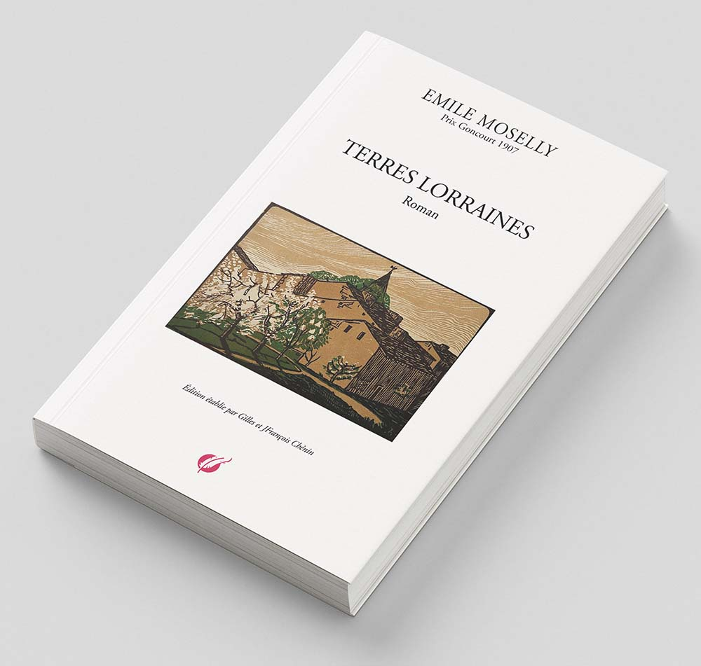

## TERRES LORRAINES, roman

_Terres lorraines_ est le premier roman d'Emile Moselly, commencé vraisemblablement en 1902 à Orléans où il est professeur, puis poursuivi en Lorraine, à Chaudeney sur Moselle, durant un congé qu'il obtient en octobre 1902 (congé qui durera deux ans). Avec *Jean dess ­Brebis* (1904) et les nombreuses nouvelles parues principalement dans la revue Le Pays Lorrain en 1905 et 1906 (Le miracle de la Saint Vincent, Le retour  nouvelle intitulée Le Soldat dans Les Retours­ , La vie lorraine, son Fî, Nuits lorraines..), la vocation régionaliste de Moselly s'affirme (DF Thèse de Pierre Goudot *La vocation régionaliste d'Emile Moselly*). Ou plutôt l'attrait pour une peinture littéraire de sa région natale, même s’il est né à Paris, devient prépondérant dans son œuvre. 

⁂

Dans ses Cahiers, Moselly note à la date de mars 1902 : "_Les champs remués, la terre. Il me semble qu’elle est faite de la poussière des morts de ma race, le sol antique et nacré dont la motte friable de bonne terre brune apparait parfois dans les chemins caillouteux, rouge de minerais de fer, ce sol s’attache à mes pieds, je le foule avec une joie profonde comme si des parts de mon être participaient à une sensation ignorée et douce. En haut de la côte, à l’endroit où le chemin raviné se hausse d’un effort sur le plateau, sur les terres nues jusqu’à l’horizon rayé de pluie, sur les jeunes blés en herbe, nous rencontrons un paysan._

_Un cousin, il est très vieux, très cassé, je lui parle longuement ; il porte mon nom et je retrouve dans sa face tannée, dans ses yeux, des traits vagues, la ressemblance de la famille, c’est le nez droit, et surtout la voix, notre voix à tous, chantante, douce, dans ces voix dures de lorrains, c’est là surtout que réside mystérieuse... la parenté de la famille, celle qui est la plus émouvante._

_En le quittant, je rêve longuement à cette dispersion d’une famille, au mélange des sangs. Combien y en a­t­il autour de ces clochers pointus qui sont sortis de la même souche ? Que sont devenus ceux qu’on a oubliés, qui sont partis, qu’on rencontre peut­être dans la foule des grandes villes, qui ont eu les mêmes ancêtres que vous, et qu’on coudoie sans que rien vous avertisse. La race, la famille, une grande idée qui s’en va, qui se dissipe sous le souffle de la vie moderne._

_Ils ont de l’affection, mais elle est dure, brutale, elle s’exprime par des mots, des termes qui heurtent, qui froissent, qui révèlent maladroitement leurs tendresses._

_Lorrains, ils se dénigrent, par jalousie, un grand fond d’orgueil et d’âpreté satirique._"

Il médite ses livres ­ de nombreux extraits dans ses cahiers de 1902 à 1906 en témoignent. Il se prépare alors une période d'intense publication : avril 1904 _Jeandes­Brebis_, juillet 1906 _Les Retours_, mars 1907 _Terres Lorraines_. Et c'est pour ce dernier ouvrage ­ mais aussi pour _Jean des Brebis_ et _Le Rouet d'Ivoire_ ­ qu'il se verra décerner le prix Goncourt en 1907. Consécration d'un travail littéraire opiniâtre attaché à rendre compte de toute la nature lorraine ­ paysages, hommes, femmes et choses ­ dans laquelle il s'enracine chaque jour davantage.

L'accueil de la critique est partagé, comme à chaque fois .  A partir de _Terres Lorraines_, Moselly sera loué par ceux qui lui reconnaissent un talent impressionniste pour raconter sa terre natale, la Lorraine, du moins la Lorraine de la Moselle et des Côtes de Toul et qui apprécient son savoir écrire de novelliste et de portraitiste.  

A l’opposé, il sera fortement critiqué par ceux qui ne lui reconnaissent ni originalité, ni talent de conteur, tout au plus un savoir­faire technique d'enseignant qui a beaucoup lu et qui s’inspire, peut­être à son insu, de maîtres qui l’ont précédé. 
[voir Moselly et la critique](https://darkness.chenin.fr/emile-moselly/emilemosellyetlacritique/)

⁂

Ainsi Marcel Ballot, dans le Figaro du 16 décembre 1907, commentant l'attribution du Goncourt à Moselly, écrit : « *Terres Lorraines est en effet une longue, très longue idylle où l’on nous conte comment Pierre Noel, le beau pêcheur de la Moselle, abandonna par deux fois sa promise. À la seconde et définitive infidélité cette tendre Marthe Thiriet, fille du garde forestier, ira se jeter dans la rivière, tandis que son volage ami, curieux d’aventure, engourdi de bien être, ivre d’amour charnel, s’éloignera sans remords ni vergogne sur le confortable bateau, sur le chaland peint et fleuri d’une moins candide fiancée. Un mariage équivoque l’aura, comme tant d’autres, détaché de la terre natale et, si parfois il reparait poussant à travers la brume sa lourde maison flottante, nul ne croit voir un enfant du pays en ce marinier vagabond, anonyme et mystérieux.*
*Assurément, c’est une donnée qui en vaut une autre, mais je ne sais pourquoi, elle me remet en mémoire la réponse de ce grand poète que consultait un débutant : « voici, disait l’auteur novice, quelle est l’idée de mon roman : un jeune homme aime une jeune fille… » et le poète d’interrompre : « bravo, mon enfant, vous avez mis la main sur le plus beau des sujets, seulement il y faut du génie ! » M. Émile Moselly me paraît avoir choisi un sujet de même nature et peut-être a­t'­'il eu le tort de n’y mettre que du talent.* 

_J'entends bien que ce sujet (un jeune homme aime une jeune fille...) fut, avant tout, prétexte a paysages, à peintures ̀ de mœurs et de coutumes locales, a savoureuses expressions ̀ du terroir. Malheureusement l'indéniable pittoresque de  Terres Lorraines n'est ni très senti, ni très original. On y rencontre plus de virtuosité que d'émotion, plus de réminiscence que de tempérament. Les pages les mieux venues gardent un caractère de notes coordonnées et de morceaux documentaires. Ce que l'écrivain nous montre est moins tel ou tel veilloir, tel ou tel bal, telle ou telle noce, tel ou tel enterrement que le veilloir, le bal, la noce ou l'enterrement en pays lorrain. Nous feuilletons l'album d'un dessinateur fidèle, non l'œuvre d'un artiste attendri ; et cette terre que nous évoque M. Moselly ne doit pas, j'imagine, être celle où il est né. A ces évocations manque le frémissement secret, la sympathie intime et profonde avec lesquelles certains romanciers surent ou savent nous parler de leur « petite patrie ». « Il y a des gens qui se disent espagnols, affirmait le refrain d’Offenbach, et qui pourtant ne sont point espagnols ! » Il y a aussi, de notre temps, beaucoup de gens qui se croient lorrains et qui pourtant ne le sont pas.  M. Moselly m'excusera donc de supposer jusqu'a plus ample ̀ informé que la Lorraine eut en lui, non pas même un fils d'adoption, mais un aimable visiteur, un hôte attentif  et dont elle occupa heureusement les loisirs._

_Voilà pour ce qui est de la documentation ; quant à l’exécution, elle est certainement celle d’un lettré ­ un lettré en commerce étroit avec tous les maîtres du roman contemporain. De là, diverses influences que M. Émile Moselly subit peut-­être à son insu ; de là, des phrases qui, comme celle-ci, semble avoir passé par le « gueuloir » de Flaubert : « la lune jaillit des entrailles de la terre, énorme et toute blanche, versant une lueur sur les pousses des jeunes ceps, trempés de rosée ». Enfin, le livre n’est guère composé ; les épisodes descriptifs ­ fêtes, cérémonies, bombances ­ se diluent, se noient en prolixes détails, perdent sous ce flot verbeux partie de leur couleur et de leur intensité ;  les chapitres se suivent, se coupent, se chevauchent au petit bonheur ; l’action tantôt piétine sur place, tantôt répète les mêmes gestes, repasse par les mêmes errements_. […] _On a impression_ _d’un monotone recommencement. Et si quelqu’un, exhumant le vieil argument naturaliste à l’usage des livres mal faits, nous objecte que la vie elle-même ne procède pas autrement et ne « compose » pas  davantage, nous rappellerons une fois de plus que le roman ne doit pas nous donner l’image, mais l’interprétation de la vie car là est sa seule raison d’être. Or, point d’interprétation sans art, et point d’art sans composition_. […] _Mais que de redites, que d’amplifications, que de surcharges et de fignolement où suffiraient deux à trois touches. Je ne sais plus qui a dit que Terres Lorraines était un bon livre de professeur ; c’est aussi un livre de bon élève._ »

⁂

A l’opposé, Louis Madelin dans La République Française du 10 septembre 1907 reconnaît à l’auteur un talent loin « _du nouveau style_ » et souligne que « _Moselly est un poète_ ». « _Il est comme tous ceux qui se penchent vers le sol de nos provinces. Ce spectacle est plein de grâce quand il n’inspire point une mélancolie douce qui est une source bien abondante de forte poésie._ [...] _Émile Moselly se distingue dès aujourd’hui parmi ces romanciers du  nouveau style : Terres Lorraines n’est point son premier livre et tout fait croire et espérer que ce ne sera pas le dernier mais ce sera sans doute celui qu’il aimera le mieux. Il y a jeté tout son cœur avec tout son esprit. Observateur des mœurs lorrains ce n’est point un froid analyste. Sa sensibilité s’est émue devant cette autre terre qui meurt._ 

_On sent qu’il l’aime ainsi qu’un bon fils et qu’à travers les concours où il lui fallait disserter de Virgile et de Pindare, il a dû s’attarder plus longuement qu’à aucun autre à cet Ausone qui chanta la Moselle, « fertile en blés, fertile en hommes. »_ […] _Amours mélancoliques que ceux qui nous sont décrits, amours traversés, amours malheureux : c’est une modeste tragédie campagnarde que celle dont la petite Marthe et le grand Pierre sont les héros. Mais tragédie poignante dans sa modestie : sous l’humble fichu que la gracieuse fille du forestier croise sur sa poitrine, bat le cœur d’une amante, car elle aussi, la fille du brave garde, est poète. Elle file son petit roman sur une quenouille que dorent ses illusions, elle en palpite, elle en jouit, elle en souffre, elle en meurt. L’autre, le pêcheur de la Moselle, dont le séjour au régiment et trop de succès parmi les belles ont fait un Don Juan de village, l’autre héros ne nous séduit que par la triste réalité du personnage : beau garçon vulgaire et têtu, qui le même jour abandonne la vierge qui lui a donné son cœur et le métier de ses pères. En quoi, dans cette aventure, est­il le plus coupable ? Est­ce que lorsqu’il renie la tendre fille ou lorsqu’il repousse d’un pied brutal dans les eaux de la Moselle la vieille barque pour s’en aller suivre vers l’inconnu qui attire, sur le chaland du canal, la brune Thérèse aux yeux fascinants ? Le romancier ne nous le dit pas, mais au fond je crois bien qu’il pense que le crime est d’abandonner la vieille mère Lorraine, la Moselle nourricière, le plateau à l’âpre affection qui, des siècles, a donné des fruits aux ancêtres de l’ingrat pêcheur._ […] _C’est qu’en en effet le vrai héros du roman ce n’est point Pierre, le déraciné de demain, ce n’est point le vieux père, le pêcheur Dominique, ce n’est point le rude Forestier Thiriet, ni la petite Marthe, ni les commères du village : c’est la terre lorraine. Tous l’aiment sans cette exaltation qui est le propre des âmes du midi, fruits que le soleil a dorés ; mais comme l’auteur nous fait partager l’amour de Dominique pour les eaux argentées de la Moselle où il jette ses filets, de Thiriet pour sa forêt profonde, de Marthe pour son village, de tous pour leurs vieilles maisons et leurs vieilles coutumes._ 

_Voici les saisons lorraines : car le roman qui dure un an, permet de connaître le ciel embrumé de l'âpre hiver lorrain comme ce délicat ciel bleu gris, que l'été étend  au­dessus de nos têtes. Mais surtout l'automne m'enchante. « Un grand silence enveloppait les campagnes, le silence d’automne, avant­coureur du sommeil hivernal. Les bois lointains, les vignes, l’horizon des côtes reposaient dans un calme infini, une sérénité́ baignée de lumière. Et les fils de la Vierge, se détachant des buissons, se déroulaient dans leur chute molle et sinueuse. Les dernières feuilles tombaient des arbres, emportées par des souffles froids. Au fond d’un verger, quelques cerisiers, touchés par les gelées précoces, semblaient revêtus d’un rouge éclatant, pourpre somptueuse qui détonnait dans la nudité des campagnes. Une rumeur de vie courut de l’horizon, dans une flambée de soleil. Le vent léger charriait des sons de cloches, des claironnements de coqs, des appels de bateliers. Ce mystérieux appel réveillait la terre lorraine, suscitait la force fécondante endormie au creux des sillons, donnait l’illusion d’une splendeur fugitive de printemps. »_

_Dans ce décor sans cesse renouvelé, le grand personnage c’est le village dans sa vie journalière est ses fêtes ; l’héroïne, c’est la Moselle. Elle coule scintillante entre les joncs et les bouleaux, lien qui unit les cantons de Lorraine, des Vosges à Metz, nourricière de la province, vieille mère qui dans l’antique plateau garde un éternel éclat. Lorsque abandonnée, la petite Marthe s’en vient glisser doucement dans les flots pâles, ce drame paraît se terminer de bien vulgaire façon pour qui n’a pas lu le livre. Mais non, la petite Lorraine semble rentrer dans le sein d’une mère. Le fleuve ici n’est point le monstre avide qui à Paris dévore les désespérés à bout d’illusions. On l’aime tant, cette Moselle, qu’elle semble au contraire la consolatrice amie qui, après avoir sous la barque du pêcheur bercé les illusions de la vierge lorraine, ouvre ses bras tout grand à sa navrance. De pareils sentiments, de semblables senteurs nous bercent doucement. Nous sommes loin des garçonnières et des boudoirs. Et il nous semble respirer un air pur et doux au sortir d’une salle surchauffée._ »

Ainsi se partage la critique au moment où Moselly accède à une relative notoriété. 

Pour autant _Terres Lorraines_ témoigne de la grande sensibilité d’E. Moselly, du travail qu’il accomplit pour faire vivre les compositions quasiment picturales de la nature lorraine, qu’elle soit humaine ou issue d’une terre qu’il a arpentée longuement, dans laquelle il se reconnaît, et dont il tire les couleurs, les saveurs, les senteurs et toutes les sonorités qu’il sait mettre en harmonie pour nous conduire, avec émotion et tendresse, dans cette Lorraine toute idéalisée de ses écrits.

Moselly écrit au printemps 1902, fixant ainsi la ligne directrice de son œuvre future : «*Adoration de la vie, mais pour la ressentir pleinement se retirer dans l’ombre, à l’écart, la voir passer comme une eau qui coule, les rivières, les paysages, l’action, la politique, l’art, les salons, la musique, ­ le beau, la volupté́, la joie extraite du passé, la respirer et puis sentir plus profondément l’horreur qu’elle referme, la mort, la maladie, le mal, sous toutes ses formes*.

---

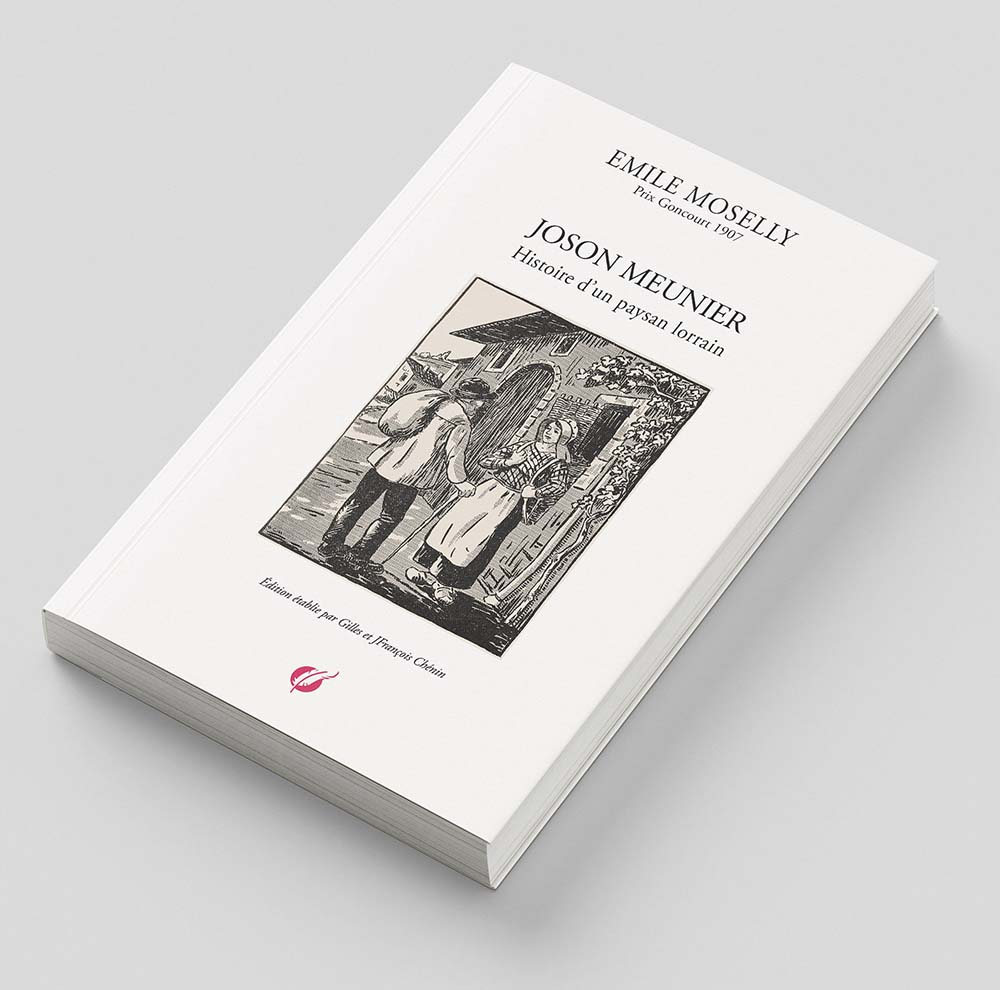

## JOSON MEUNIER, histoire d'un paysan lorrain

Avec *Joson Meunier*, son second roman,Emile Moselly poursuit son exploration du monde paysan qu'il côtoie à Chaudeney où réside ses parents ou à Bicqueley, village où habite son parrain, en rapportant l'histoire d'un pauvre paysan lorrain, qui, tantôt employé chez un marchand de bois de Toul, tantôt bûcheron, se marie avec une servante d'auberge, a un fils, Maurice, sur lequel sa femme et lui concentrent toute leur affection. Devenu veuf prématurément, il fait travailler ce fils comme travaille un « fils de bourgeois. » Le jeune Maurice est le plus laborieux élève du lycée de Toul, puis du lycée de Nancy, (parcours scolaire que fera Moselly, poussé par son père et son instituteur) entre à l'Ecole Polytechnique, devient officier d'artillerie. Mais, à mesure que le père est plus fier de son enfant, plus ce dernier est gêné et comme plus honteux de son père, bûcheron en blouse, qui ne saurait frayer avec les mêmes gens que lui.
Le roman raconte la vie de Joson Meunier, un paysan pauvre originaire de Lorraine. Joson travaille durement : tour à tour bûcheron ou employé chez un marchand de bois à Toul. Malgré la pauvreté, il se marie avec une servante d’auberge et ils ont un fils, Maurice, qui devient le centre de toutes leurs espérances. La mère meurt prématurément. Resté seul, Joson décide de consacrer toute son énergie à l’éducation de son fils. Il travaille encore plus dur afin que Maurice puisse faire des études et avoir une vie meilleure que la sienne. Le roman se termine sur la triste vieillesse de Joson, symbole du père sacrifié et oublié, Moselly approfondira dans ce roman le thème du déracinement social.

---

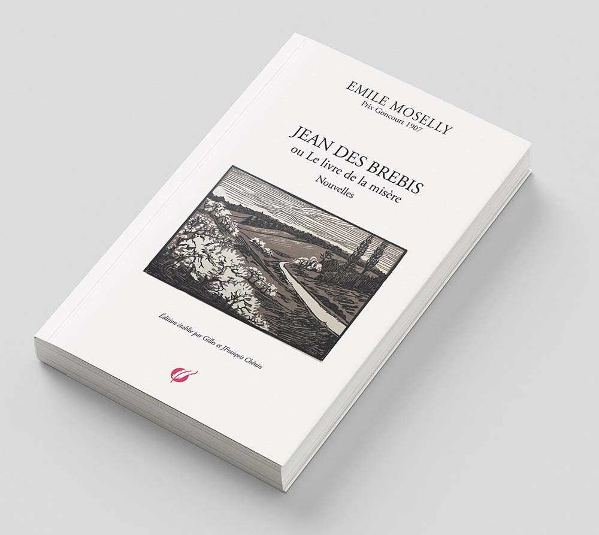

## JEAN DES BREBIS, ou le livre de la misère, nouvelles

En quatre ans, _Jean des Brebis_ sera édité trois fois. Dans les Cahiers de la Quinzaine en 1904 puis, la même année, aux édition Ollendorf et, en novembre 1907, aux éditions Plon. Plus tard, d'autres éditions suivront essentiellement chez Plon.

Après le récit _L'Aube fraternelle_ (dans les Cahiers de la Quinzaine en 1902) et après *Le rouet d'ivoire*, _Jean des Brebis_ sera le second ouvrage de nouvelles d'E. Moselly, regroupant _Jean des Brebis, A la Belle étoile, Le Revenant, La Mort du bouif, Le Trompion, Cri­Cri_.

Le Prix Goncourt lui sera remis en décembre 1907 pour ce livre mais aussi pour _Terres lorraines_ et  _Le Rouet d'ivoire_, ouvrages parus cette année­l à.  La carte signée des dix jurés dit très exactement : [...] _le Prix des Goncourt vous a été donné pour vos livres et en particulier Jean des Brebis_ [...]. (voir)[https://darkness.chenin.fr/emile-moselly/bibliographie/#1907--orléans]

L'attribution en 1907 du Goncourt à Moselly marque la préférence du jury pour un recueil de nouvelles paru quatre ans auparavant, contrairement aux règles du prix qui veut que le livre couronné soit un roman paru dans l’année de son attribution. Ce fait est bien évidemment relevé par la presse : "_Le prix Goncourt 1907 ­ C'est M. Moselly qui a  remporté la palme mais on ignore pour laquelle  de ses œuvres._

_L'Académie Goncourt est obligée d'attribuer son prix à l'œuvre éditée dans l'année et non point à un auteur, or, le Temps et le Matin nous ont dit que l'ouvrage couronné était Jean des Brebis, œuvre publiée il y a quatre ans et par conséquent ne rentrant pas dans les conditions du concours._

_Il est vrai que d'autres journaux nous ont appris que le prix avait été donné à Terres Lorraines, ou encore au Rouet d'ivoire, deux œuvres de M. Moselly publiées cette année._

_La réalité c'est que ces deux dernières œuvres plaisaient moins aux Dix que Jean des Brebis et qu'en résumé c'est ce livre auquel ils ont donné le prix, mais ils n'osent le dire franchement puisque, nous le répétons, ce livre ne pouvait réglementairement concourir._

_Tant d'imprécision a eu pour résultat de dérouter le public qui voudrait bien acheter un ouvrage mais non des ouvrages ; et M. Moselly est loin de trouver la clientèle des précédents lauréats._ MM." (Revue Ruy Blas du 14 décembre 1907).

Cela n'empêcha pas _Jean des Brebis_ de connaître une critique accueillante et largement positive. 

En voici quelques extraits:

Dans la revue Gil Blas du 12 décembre 1907, Jules Case écrit : «_Le roman provincial arrive donc à l’heure du rafraîchissement nécessaire. Un peu d’air,  demandait­on. Il y a de quoi nous en apporter, et nous acceptons avec gratitude tout ce que nous en donne M. Emile Moselly. C’est du plus naturel, d’ailleurs, qu’il nous fournit, venant de la pleine campagne, du village lorrain, connu pour la vivacité de son climat, pour ses coteaux plantés de vignes, son vin gris, ses verts pâturages et aussi pour ses fumiers amoncelés en tas devant chaque maison, et formant, d’un bout de la localité à l’autre, comme un double système de remparts._» Et déja Jules Case souligne la marque impressionniste de l’auteur : «_M. Emile Moselly est un paysagiste minutieux, exact amoureux du tableau qu’il nous transcrit. Dans le dessin de ce petit village transfiguré et endimanché, il exprime toutes les âmes joyeuses de ses habitants. Contenant et contenus se confondent. Les personnages n’on même pas besoin de beaucoup de paroles, ni d’actes, pour manifester leur satisfaction. Le décor général les englobe et les fait participer à l’allégresse dont ils témoigne. On sent le paysan, sa maison, la terre, faire un bloc invisible. Des racines et des liens les attachent solidement les uns aux autres._»

Gaspard Valette, dans la Gazette de Lausanne et journal suisse du 21 janvier 1908, revient sur «les peintures» de Moselly : «_Aussi bien, c’est la Lorraine seule, c’est la Lorraine toute entière, que Moselly a peinte dans son œuvre littéraire : les choses et les hommes, les mœurs et la nature, les lignes du paysage et le traits de l’âme qui leur correspondent. Le paysage surtout ! Je connais peu de paysages littéraires plus consciencieux, plus étudiés, plus émouvants que ceux-là. Pour retrouver une impression analogue, il faut songer aux ciels tragiques, aux vastes horizons, aux eaux dormantes qu’ensanglante le reflet des nuages dans les admirables et frustres paysages lorrains d’une Pauline de Beaumont_  (Pauline Bouthillier de Beaumont, née le 20 août 1846 à Genève et morte le 28 juillet 1904 à Collonges-sous-Salève, est une artiste peintre suisse. Elle se forme d'abord dans le cadre familial, puis à Paris à l'Académie Julian. Elle peint des paysages, inspirés de Camille Corot et de l'école de Barbizon. Les paysages de sa région, comme celui de la Lorraine, l'attirent particulièrement.)_Le paysage n’est pas pour notre écrivain un décor impassible et muet. Les choses ont une voix qui lui parle et qu’il entend, une vie avec laquelle il communie, une plainte que son cœur accueille. Et plus ces choses sont humbles, plus ces recoins sont déshérités, mieux il croit percevoir cette voix et discerner l’âme du pays qui s’y révèle_.» Ainsi, loin des commentaires parfois acerbes sur un régionalisme "_poudre aux yeux_", G. Vallette conclut en soulignant que Moselly est «_descriptif avant tout, réaliste en son tréfonds, pénétré d'une pitié humaine intense, qui n'a rien de pleurnicheur ou de déclamatoire, le talent du romancier lorrain, avec sa forte saveur de terroir et son régionalisme avoué, me parait non pas un des plus prestigieux, ni des plus éclatants, mais un des plus probes et des plus solides qui soient à l'heure actuelle._»

Dans Le Pays Lorrain de décembre 1907, René  Perrout, écrivain régionaliste vosgien, soulignera, : à l’occasion du Goncourt, cet amour des paysages lorrains que Moselly se plait à décrire et à rendre vivant dans son œuvre : «_Moselly a la piété de la terre natale. Il en sait tous les secrets, il en aime toutes les images et tous les chants. Il offre à l'émotion lorraine une âme frémissante. Il décrit avec splendeur ce qu'il voit dans son pays, les plaines onduleuses, les ravins où foisonnent les plantes odorantes, les routes que jalonnent les peupliers fuselés comme des files monotones de pèlerins, les coteaux empourprés des teintes automnales, la rivière où le soleil traîne des draperies d'or, les prés criblés de fleurs, les champs où une brise creuse des houles vivantes._

_Et la mélancolie qui plane sur la nature lorraine  descend aussi dans son cœur et obscurcit parfois son rêve. Il s'attriste des longues étendues aux vallonnements doux qui semblent une mer tourmentée,  soudainement figée, des lointains brumeux, des grands souffles qui gémissent dans les bois profonds, des lisières de trembles dont les feuilles grelottent dans la pluie, des molles vapeurs qui flottent comme des fantômes le soir au creux du val, de la fuite des nuées dans le ciel agité. Parmi ces visions, une langueur le prend. Et son chant lyrique s'élève un peu morne, craintif et adouci._»

Avec _Jean des Brebis_, Emile Moselly écrira parmi  ses meilleures nouvelles, toutes nourries de sa terre natale, toutes empreintes d’une Lorraine sublimée à la manière des impressionnistes.

---

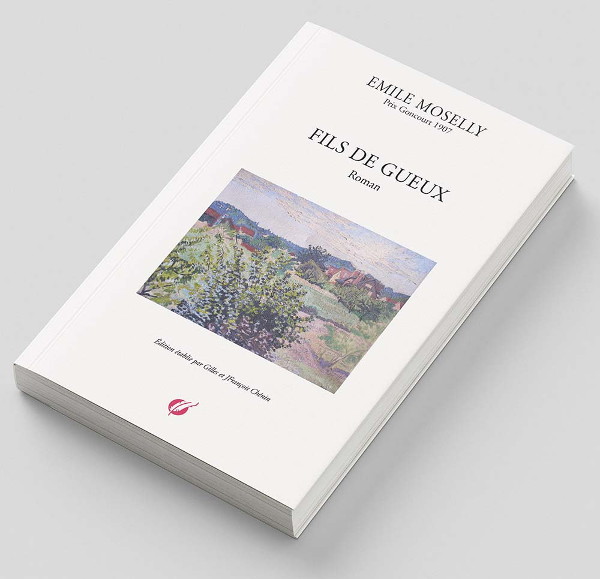

## FILS DE GUEUX, roman

*Fils de Gueux* raconte comment Basile Crasmagne parvient à échapper à la misère par le moyen honnête et digne du travail, et notamment du travail de la terre. Moselly propose, dans ce troisième roman, un tableau de la dure réalité d’un travail qui avilit le corps et ne permet pas toujours de survivre. 

L’enfance du narrateur se déroule dans un univers rude, dominé par le travail pénible, la misère matérielle et la violence morale. À l’école comme au village, il subit le mépris des autres enfants et des adultes, qui le jugent non pour ce qu’il est, mais pour ce qu’il représente socialement. Moselly montre ainsi comment la pauvreté se transmet comme une fatalité, renforcée par le regard d'une société cruelle.

Malgré ce contexte difficile, Basile se distingue par son intelligence et sa sensibilité. et l’instruction apparaît comme le moyen de son émancipation : apprendre, comprendre le monde, c’est espérer échapper à la condition de ses parents. Cependant, cette aspiration se heurte aux limites imposées par la société rurale, où la naissance détermine largement le destin. Le roman insiste donc sur le déterminisme social, thème central de l’œuvre.

À travers ce récit, Émile Moselly ne se contente pas de raconter une trajectoire individuelle : il propose une critique sociale forte. Il dénonce l’injustice des hiérarchies rurales, l’hypocrisie morale et la dureté d’un monde qui écrase les plus faibles. En même temps, il rend hommage à la dignité et à la résistance des humbles, capables d’endurer sans perdre leur humanité.

Sur le plan littéraire, le roman s’inscrit dans une veine réaliste proche du naturalisme. Moselly s’attache à décrire avec précision la vie paysanne, les paysages lorrains et les mécanismes sociaux qui enferment les individus. Le style sobre et sensible renforce la portée émotive et engagée du récit. Ce roman dépasse toute simplification : le dur «travail de terre»y apparaît également beau et héroïque et devient lutte contre une misère de la vie qui concerne tous les hommes  [lire études de Karine Rothio]( "le travail de terre](https://www.persee.fr/doc/acths_0000-0001_2005_act_127_3_5141); force vitale contre le vertige de la mort et l’hostilité du pays ; communion avec la nature et avec les êtres aimés : bref, il est ce qui donne du sens et de l’humanité à la vie. 'D’abord la terre n’est rien, c’est l’homme qui ’est tout".

---

## LES NOUVELLES

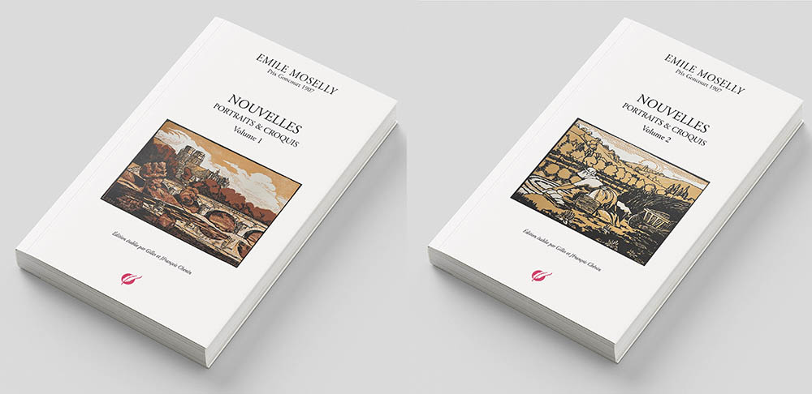

Durant sa courte carrière littéraire, environ 15 ans, Emile Moselly a écrit sept romans (_l'Aube fraternelle, Terres lorraines, Joson Meunier, Fils de gueux, le Journal de Gottfried Mauser, les Grenouilles dans la mare, la houle_), deux essais littéraires (_George Sand, Lucien Descaves_), un livre de souvenirs (_les Etudiants_) et un peu plus d'une centaine de nouvelles, certaines publiées dans des revues ou journaux, puis regroupées en livres de manière thématique (_Le Rouet d'ivoire, Jean des Brebis, les Retours, Contes de la route et de l'eau, Contes de guerre pour Jean-Pierre, la Charrue d'érable_).

Les autres nouvelles seront publiées uniquement dans les journaux ou revues de l'époque (_le Pays Lorrain, l'Humanité, la Revue Bleue, la Grande Revue, le Matin, le Temps, l'Est républicain, la France nouvelle, la Revue des deux mondes, l'Illustré national, la Revue hebdomadaire, la Revue universelle, le Volume, Pages libres, l'Âme latine, Choix de lecture..._) sans faire l’objet de regroupements thématiques.

Ces textes représentent un peu plus d'une cinquantaine de nouvelles écrites entre 1905 et 1917. _Le Pays Lorrain, l'Humanité, la Revue Bleue_ et _la Grande Revue_ figurent parmi les titres qui ont le plus fréquemment accueilli les nouvelles de E.M.

On y trouvera les situations, les personnages, les paysages et les thèmes de prédilection de E.M. (voir l’introduction des _Cahiers_, seconde édition, 2022, p.11).

"Emile Moselly est mort en octobre 1918, quelques semaines avant l'armistice, écrit Claude Barjac dans un article _Nos Débutants d'hier_ paru dans _la Grande Revue_ en octobre 1932. Charles Péguy l'avait découvert dans les premières années de ce siècle (XXème siècle...). En décembre 1907, le prix Goncourt lui avait été attribué. En ce temps là, quelque valeur que l'on accordât à ce prix, il ne suffisait pas, comme aujourd'hui, à combler un écrivain de gloire et d'argent, il ne lui ouvrait pas toutes grandes les portes des journaux et des revues. Quand _la Grande Revue_ publia, pour la première fois, le 10 février 1908, une nouvelle de Moselly : _Le Fossoyeur_ (p. 119), le charmant conteur n'avait pas encore l'audience du grand public [...].

Ses premiers romans sont des romans lorrains, où s'équilibrent de la façon la plus heureuse le réalisme des petites vies de tous les jours et l'éternel lyrisme qui se dégage des médiocrités quotidiennes. On ne peut relire, sans y être sensible encore, les notations de ses souvenirs lorrains, les brefs tableaux où il les fait revivre, ces premiers recueils qui s'appellent _Jean des Brebis, Les Retours, Le Rouet d'ivoire_.

D'ailleurs, à mesure que les années passaient, il semble que l'écrivain ait voulu se dépouiller, qu'il se soit efforcé vers un art plus ferme, plus robuste - ou plutôt - car la force ne lui manqua jamais - plus objectif. Comment en lisant _L'Agace_ (les nouvelles Volume 1 p. 269), ne pas songer à certains contes de Maupassant ? Mais à quelque objectivité qu'il se contraignît, l'amitié secrète qu'il portait en lui pour les choses et les gens transparaissait. N'est-ce pas de cette amitié que son talent prend un accent particulier ?

Il est mort, jeune encore, et n'ayant pas dit son dernier mot. [...] Et pour la mélancolie de son destin inachevé, autant que pour son talent dont il témoigna dans chacun de ses livres - talent fait à la fois de vie et de poésie - Emile Moselly a droit à ce que l'on se souvienne de lui."

---

**TENTATIVE DE CLASSEMENT DES NOUVELLES, PORTRAITS, CROQUIS ET ARTICLES****

Les nouvelles marquées V.1 ou V.2 ont été regroupées dans deux volumes parus chez TheBookEdition - [**V.1 : Nouvelles V.1 2023]**(https://www.thebookedition.com/fr/emile-moselly-nouvelles-v1-p-395932.html) – [**V.2 :  Nouvelles V.2 2023]**(https://www.thebookedition.com/fr/emile-moselly-nouvelles-v2-p-396804.html)

---

- _A la belle étoile_ | Jean des Brebis - Cahiers de la Quinzaine 1904 / Plon-Nourrit 1907
- _Au rancart_ V.1a vie lorraine, Contes de la route et de l'eau - Les Pays de France 1907 V.1
- _Bautru, soldat_ V.1 La France Nouvelle, Revue de l'Union française  1918 V.2
- _Berceuse inquiète_ | Contes de guerre pour Jean-Pierre - Revue France, Berget-Levrault 1918 V.2
- _Bétail à vendre_ V.1 La charrue d'érable - Le livre contemporain 1912
- _Bonne dame_ V.1 Le Rouet d'ivoire - Cahiers de la Quinzaine 1907 / le Pays Lorrain 1908 / Plon-Nourrit 1908
- _Buveur de sang_ | Archives familiales 1916 ou 1917 V.2
- _Canons de Lorraine_ V.1a Revue bleue Avril 1915 V.2
- _Colin Michelot_ V.1 Le Rouet d'ivoire - Cahiers de la Quinzaine 1907 / le Pays Lorrain 1908 / Plon-Nourrit 1908
- _Cri-Cri_ | Jean des Brebis - Cahiers de la Quinzaine 1904 / Plon-Nourrit 1907
- _Dans le matin clair_ | Archives familiales 1916 ou 1917 V.2
- _Dernier séjour en Lorraine_ V.1 Le Pays Lorrain Juillet 1931 (Ecrit en 1914, resté inédit) V.2
- _Deux vieux_ V.1 Le Rouet d'ivoire - Cahiers de la Quinzaine 1907 / le Pays Lorrain 1908 / Plon-Nourrit 1908
- _Existences imaginaires_ V.1 Le Pays Lorrain juillet 1924 (Inédit de mai 1916) V.2
- _Fantasmagorie_ V.1 Le Rouet d'ivoire - Cahiers de la Quinzaine 1907 / le Pays Lorrain 1908 / Plon-Nourrit 1908
- _Goëry Coquart de René Perrout_ V.1 Le Pays Lorrain 1907
- _Guy de Maupassant_ V.1 La Revue bleue 1914
- _Hein_ V.1 L'Humanité du 02-05-1910 V.1
- _Herbes coupées_ V.1 La Charrue d'érable - Le livre contemporain 1912
- _Impressions lorraines_ - Mon village V.1 Le Pays Lorrain 1921 / Les Cahiers d'Emile Moselly 2022
- _Jean des Brebis_ | Jean des Brebis - Cahiers de la Quinzaine 1904 / Plon-Nourrit 1907
- _Jean-Pierre et le soldat_ | Contes de guerre pour Jean-Pierre - Revue France, Berget-Levrault 1918
- _L'agace_ V.1 La Grande Revue 10-03-1910 V.1
- _L'apaisement_ V.1 Le Pays Lorrain 1914 / Dernier chapitre de Les étudiants - Ollendorf 1914
- _L'assomption du passeur_ V.1 Le Pays Lorrain 1928 / La revue bleue 12 février 1910 / Projet Vendanges lorraines 1913 V.2
- _L'auberge de la mère Marie_ V.1 Le Pays Lorrain 1928 / Projet Vendanges lorraines 1913 V.2
- _L'eau de Pagney_ V.1 Le Rouet d'ivoire - Cahiers de la Quinzaine 1907 / le Pays Lorrain 1908 / Plon-Nourrit 1908  / En Lorraine par sentiers et venelles 1937
- _L'église_ V.1 Le Rouet d'ivoire - Cahiers de la Quinzaine 1907 / le Pays Lorrain 1908 / Plon-Nourrit 1908
- _L'hôte muet_ V.1 Le Rouet d'ivoire - Cahiers de la Quinzaine 1907 / le Pays Lorrain 1908 / Plon-Nourrit 1908
- _L'ogre et le petit poucet_ | Contes de guerre pour Jean-Pierre - Revue France, Berget-Levrault 1918
- _L'usurier_ V.1 Le Pays Lorrain 1928 / Projet Vendanges lorraines 1913 V.2
- _La Babette_ V.1 Le Rouet d'ivoire - Cahiers de la Quinzaine 1907 / le Pays Lorrain 1908 / Plon-Nourrit 1908
- _La baratte_ V.1 La Charrue d'érable - Le livre contemporain 1912 / le Pays Lorrain 1912 V.2
- _La cheminée lorraine_ V.1 Le Rouet d'ivoire - Cahiers de la Quinzaine 1907 / le Pays Lorrain 1908 / Plon-Nourrit 1908
- _La corbeille d'écus_ V.1 Le Pays Lorrain 1928 / Projet Vendanges lorraines 1913 V.2
- _La femme de Maître Corniolle_ V.1 Le Pays Lorrain 1928 / Projet Vendanges lorraines 1913 V.2
- _La femme du garde_ V.1 La Revue bleue 21 janvier 1911 V.2
- _La futaille_ | Archives familiales 1913 ou 1914 V.2
- _La Griote_ V.1 La Revue bleue Avril 1908 V.1
- _La joie_ V.1 Le Rouet d'ivoire - Cahiers de la Quinzaine 1907 / le Pays Lorrain 1908 / Plon-Nourrit 1908
- La layette V.1'Humanité du 07-03-1910 V.2
- _La maison d'école_ V.1 Le Rouet d'ivoire - Cahiers de la Quinzaine 1907 / le Pays Lorrain 1908 / Plon-Nourrit 1908
- _La matelote du Père Bigeard_ | Chronique sur l'art du bien manger de Richardin, L'Est Républicain 1 juillet 1911
- _La moisson_ V.1 La Charrue d’érable - Le livre contemporain 1912 / Bibliothèque universelle juin 1913 V.2
- _La mort du bouif_ | Jean des Brebis - Cahiers de la Quinzaine 1904 / Plon-Nourrit 1907
- _La noce normande_ V.1 La Charrue d’érable - Le livre contemporain 1912 V.2
- _La nuit lorraine_ V.1 Le Pays Lorrain 1928 / Projet Vendanges lorraines 1913 V.2
- _La pêche miraculeuse_ V.1a Revue hebdomadaire 03-12-1910 V.2
- _La petite fille de Noyon_ | Contes de guerre pour Jean-Pierre - Revue France, Berget-Levrault 1918
- _La rencontre_ V.1 L'Humanité du 21-02-1910 V.2
- _La vie de l'eau_ V.1 Le Rouet d'ivoire - Cahiers de la Quinzaine 1907 / le Pays Lorrain 1908 / Plon-Nourrit 1908
- _La vie et la mort de Bonnard_ V.1 L'Humanité 10/05/1911 V.2
- _La vision du Père Huot_ V.1 La Revue universelle et Revue suisse juillet septembre 1912 V.2
- _Labour_ V.1 La Charrue d’érable - Le livre contemporain 1912
- _Lavandière nocturne_ V.1 La Charrue d’érable - Le livre contemporain 1912
- _Le boche de Jean-Pierre_ | Contes de guerre pour Jean-Pierre - Revue France, Berget-Levrault 1918
- _Le budgetivore_ V.1 L'Humanité du 24-01-1910 V.2
- _Le chien_ | Revue l'Illustré National du 10-01-1909 V.2
- _Le conte du beau temps_ V.1 Le Rouet d'ivoire - Cahiers de la Quinzaine 1907 / le Pays Lorrain 1908 / Plon-Nourrit 1908
- _Le crime de l'Allemagne_ V.1 La Revue bleue 18-06-1917 V.2
- _Le député_ V.1 Le Matin du 12-10-1908 V.2
- _Le fossoyeur_ V.1 La Grande Revue 10-02-1908 V.1
- _Le loup du père Pastourelle_ V.1 le Pays Lorrain 1913 V.2
- _Le Millénaire normand_ (article) | Excelsior - Journal illustré quotidien - 11 janvier 1911
- _Le miracle de Saint Vincent_ V.1 Le Pays Lorrain 25-02-1905 / l'Humanité du 21-03-1910 V.1
- _Le nourrisson de Madame Virginie_ V.1 La Revue hebdomadaire 25-04-1908 V.1
- _Le père vipère_ V.1 Le Pays Lorrain 1907 / La vie lorraine, Contes de la route et de l'eau - Les Pays de France 1907 V.1
- _Le retour ou le soldat_ V.1 Le Pays Lorrain 25-04-1905 / Les retours - Cahiers de la Quinzaine 1906 / Contes de la route et de l'eau 1907 V.1
- _Le revenant_ | Jean des Brebis - Cahiers de la Quinzaine 1904 / Plon-Nourrit 1907
- _Le rouet d'ivoire_ V.1 Le Rouet d'ivoire - Cahiers de la Quinzaine 1907 / le Pays Lorrain 1908 / Plon-Nourrit 1908
- _Le sabot de faïence_ V.1 Le Matin du 17-09-1908 V.1
- _Le sac de sorbes_ V.1 Le Rouet d'ivoire - Cahiers de la Quinzaine 1907 / le Pays Lorrain 1908 / Plon-Nourrit 1908
- _Le songe de la Pentecôte_ V.1 La Grande Revue 10-10-1908 V.1
- _Le trompion_ | Jean des Brebis - Cahiers de la Quinzaine 1904 / Plon-Nourrit 1907
- _Les canards_ V.1 Le Matin du 12-11-1908 V.1
- _Les deux Maucor_ V.1 La Revue hebdomadaire 17-10-1908 V.1
- _Les haleurs_ V.1 Le Pays Lorrain 21-01-1906 / Les retours - Cahiers de la Quinzaine 1906 / Contes de la route et de l'eau 1907
- _Les maraudeurs_ V.1 Le Pays Lorrain 1928 / Projet Vendanges lorraines 1913 V.2
- _Les sangliers_ V.1 Le Pays Lorrain 1928 / Projet Vendanges lorraines 1913 V.2
- _Les semailles_ V.1 La Charrue d’érable - Le livre contemporain 1912
- _Messidor_ V.1 La Charrue d’érable - Le livre contemporain 1912
- _Mon voisin_ V.1 Le Pays Lorrain 1928 / Les Cahiers d'Emile Moselly 2022
- _Nausicaa_ V.1 La Revue des deux mondes - 15 janvier 1919 (remis à la Revue en septembre 1918) V.2
- _Nuit de Noël_ V.1 Le Rouet d'ivoire - Cahiers de la Quinzaine 1907 / le Pays Lorrain 1908 / Plon-Nourrit 1908
- _Nuits lorraines_ V.1 Le Rouet d'ivoire - Cahiers de la Quinzaine 1907 / le Pays Lorrain 1908 / Plon-Nourrit 1908  / Les Cahiers d'Emile Moselly 2022
- _Parrain_ V.1 Le Rouet d'ivoire - Cahiers de la Quinzaine 1907 / le Pays Lorrain 1908 / Plon-Nourrit 1908
- _Passage d'automne_ V.1 Le Rouet d'ivoire - Cahiers de la Quinzaine 1907 / le Pays Lorrain 1908 / Plon-Nourrit 1908
- _Pauvres gens_ V.1 Le Temps du 19-01-1916 V.2
- _Pèlerinage_ | Contes de guerre pour Jean-Pierre - Revue France, Berget-Levrault 1918
- _Petit Brinquin_ V.1 Le Rouet d'ivoire - Cahiers de la Quinzaine 1907 / le Pays Lorrain 1908 / Plon-Nourrit 1908
- _Petit Jacques_ V.1 L'Humanité du 05, 06 et 07 du 04-1911 V.2
- Préface de A Jean-Pierre  | Contes de guerre pour Jean-Pierre - Revue France, Berget-Levrault 1918
- _Préface de La vie lorraine_ V.1 Le Pays Lorrain 25-09-1905 / La vie lorraine, Contes de la route et de l'eau - Les Pays de France 1907
- _Prélude Vendanges_ lorraines V.1 Le Pays Lorrain 1928 / Projet Vendanges lorraines 1913 V.2
- _Premier maître_ V.1 Le Rouet d'ivoire - Cahiers de la Quinzaine 1907 / le Pays Lorrain 1908 / Plon-Nourrit 1908
- _Premières désillusions_ V.1 Le Rouet d'ivoire - Cahiers de la Quinzaine 1907 / le Pays Lorrain 1908 / Plon-Nourrit 1908
- _Prière pour nos morts_ | Revue France - 25 mai 1918 / Choix de lectures 1927 V.2
- _Quelques visiteurs_ V.1 Le Rouet d'ivoire - Cahiers de la Quinzaine 1907 / le Pays Lorrain 1908 / Plon-Nourrit 1908
- _Récit de guerre_ V.1 Le Rouet d'ivoire - Cahiers de la Quinzaine 1907 / le Pays Lorrain 1908 / Plon-Nourrit 1908
- _René Perrout_ V.1 Le Pays Lorrain 1909
- _Simple aveu_ V.1 Le Volume du 25-12-1915 / Le Temps du 30-12-1915 V.2
- _Soir sur l'eau_ | Archives familiales 1913 ou 1914 V.2
- _Son fï_ V.1 Le Pays Lorrain 1906 / La vie lorraine, Contes de la route et de l'eau - Les Pays de France 1907  V.1
- _Sous les pommiers_ V.1 La Charrue d’érable - Le livre contemporain 1912
- _Sur le tombeau d'Emmanuel Delbousquet_ | Revue l'Ame latine / hommage à l'écrivain
- _Tourniquet_ | Pages libres n° 453 du 4-09-1909 / Le censeur 14-12-1907 / L'Humanité du 09, 10, 11 janvier 1908 V.2
- _Un grand voyage_ V.1 Le Rouet d'ivoire - Cahiers de la Quinzaine 1907 / le Pays Lorrain 1908 / Plon-Nourrit 1908
- _Un prussien d'autrefois_ | Contes de guerre pour Jean-Pierre - Revue France, Berget-Levrault 1918 / Revue la femme et l'enfant juillet 2019
- _Une histoire de revenants_ V.1L Le Rouet d'ivoire - Cahiers de la Quinzaine 1907 / le Pays Lorrain 1908 / Plon-Nourrit 1908

---

## LES ÉTUDIANTS

   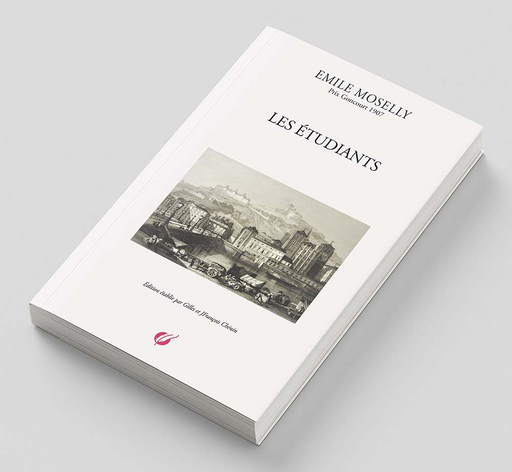

 Le 11 juillet 1891, E. Moselly obtient sa Licence es lettres à l'Université de Nancy.

Le 10 novembre, il part au Service Militaire, affecté au 6ème Bataillon d'Artillerie de forteresse, au fort de Lucey (Camp retranché de Toul).

En juin-juillet 1892, il fera un séjour au camp de Châlons (Mourmelon).

Libéré de ses obligations militaires le 18 septembre 1892, et après quelques semaines passées à Chaudeney-sur-Moselle, il arrive, boursier d'agrégation, à Lyon le 2 novembre, pour préparer l'agrégation de Lettres classiques.

Trois textes (deux lettres à ses parents et un passage des _Cahiers_) nous donnent le cadre de ce roman _Les Etudiants,_ écrit dans les années 1908-1910 et publié sous forme de feuilleton dans _La Grande Revue_ entre décembre 1911 et mars 1912 puis à la Librairie Ollendorff en 1919.

Le 3 novembre 1892, il écrit à ses parents.

_Lyon, 3 novembre 1892 4, Rue d'Enghien 4_

_Mes chers parents,_
_Mon coeur se serre en vous écrivant cette première lettre, datée de ce lieu où je suis arrivé avec un infini de tristesse dans l'âme. Je n'en conserverai pas un bon souvenir, et puis il me semble que je suis si loin de vous. Cette séparation, la première, n'est-ce pas, puisque Nancy, c'était chez nous, m'a causé une peine que je n'aurais jamais soupçonnée. Je me sens seul ici, trop seul, sans parents, sans rien, et cette ville est si grande, si bruyante que tout ce tohu-bohu me fait peur. On rencontre tant de visages qu'on n'a jamais vus, et dire que tous ces gens-là ont leur chez soi. Je voudrais être au moment où je serai habitué à cette vie, où je me serai fait par le travail, l'accoutumance, aussi par le temps, la résolution d'accepter cet état de choses. Pour le moment cela ne va pas sans tiraillement et surtout sans une grande tristesse._

_Enfin je voudrais être chez nous, au coin du feu, où je me trouve comme tout le monde, malheureusement si bien quand je n'y suis plus. J'aurais du faire l'agrégation de grammaire et rester à Nancy, que je connaissais. Enfin je serai ferme et j'aurai raison des choses et de moi._
_J'habite en ce moment tout près de Perrache, rue d'Enghien. J'ai pris cette chambre au hasard, j'étais dans la rue, il pleuvait, j'ai dit : celle là autant qu'une autre. Elle est très haut, au cinquième, très petite et n'est pas commode. Elle ne coûte pas cher, 22 francs. Je la garderais, si ce n'était que cela, mais on n'est pas chez soi, et la propriétaire est une brave femme qui n'a pas l'air d'aimer singulièrement les notes rondes. 3 francs en plus pour le service, c'est une façon de vous dire, c'est 25 francs... Je n'ai pas vu Marchal hier soir, il avait deux heures de retard, à ce que m'a dit sa propriétaire, car lui n'était pas là aujourd'hui. Il était parti à Aix et n'avait fait que déposer ses bagages à Lyon. C'est une très brave femme qui me cherchera chez les gens qu'elle connait, une petite chambre dans le prix de celle-ci et plus commode incontestablement. Enfin cela s'arrangera pour le mieux, je verrai Marchal demain matin, avec lui j'aurai des renseignements sûrs et précis, j'ai eu tort de ne pas aller chez lui hier soir, sa propriétaire, à qui il a beaucoup parlé de moi cette année, avait ordre de me recevoir. J'ai été passer la nuit à l'hôtel, et j'ai dîné dans des restaurants aujourd'hui. Je veux l'attendre pour ne pas prendre une pension au hasard, comme j'ai fait pour cette chambre. Enfin je partirai à me caser, et je serai sérieux, mais  mon pauvre argent s'en va, s'en va, dans ces incertitudes !_
_Pauvres chers parents, quand je serai agrégé, tout cela n'existera plus pour nous, nous en reparlerons en riant et je vais travailler pour que cela soit bientôt, je n'ai que cet espoir._

_Alors nous nous installerons comme il nous plaira, et nous serons délivrés de soucis matériels qui sont bien lourds à porter. Je vais me remettre à l'ouvrage dès demain, du matin jusque dans la nuit, et nous verrons qui finira par avoir raison, de moi ou des évènements._
_Notre voyage s'est bien passé. À Dijon nous avons juste eu le temps de sauter dans l'express qui nous a amené ici en quatre heures, moulu, harassé ; le train tangue, vire, siffle, crie, j'en avais les oreilles et les reins cassés. Je suis arrivé avec un mal de tête fou et une pointe de fièvre et ma nuit s'est mal passée et dans des songeries amères, je me voyais à Toul, il est probable que dans deux ans je me trouverai un parfait imbécile. Enfin ! Je m'explique, je me retrouverai niais d'avoir eu des moments d'ennui pareil, quand j'aurai tout ce qu'il me faudra. Je me comprends, toujours plus haut, excelsior, et après l'agrégation autre chose, et cela est bon d'être au cinquième étage, dirait Bossuet, on est plus près du ciel et de Dieu. Et puis je regretterai mes vingt-deux ans et ma belle jeunesse._
_Lyon est tout bonnement splendide et a émerveillé, tout comme Paris avait fait, ma pauvre tête de provincial. Les grandes rues sont larges, des gens, trop de gens y vont, y viennent, sans savoir ce qu'ils font, n'est-ce pas, pour être tous dehors en même temps._

_C'est l'effet que cela produit à Grosjean et à son curé. Il y a sur le Rhône de petit coins de perspective d'une grisaille de ton extrêmement intéressante. Le soir des lumières tremblent dans l'eau, des mouches vont et viennent, et toutes les fenêtres qui sont éclairées à Fourvières et tout le long de la côte, ont l'air d'être des étoiles qui scintillent dans le brouillard. On n'est pas habitué, on fait l'effort pour croire que ce sont des rues qui se perdent dans le ciel, puisqu'on ne voit pas la côte, dans la brume. Je crois que si je parviens à disposer intelligemment ma vie, ce qui me donnera la quiétude d'esprit, tout ce qu'il y a d'intuition artistique en moi s'harmonisera admirablement avec ce milieu. Somme toute un décor à souhait pour la séduction lente et réfléchie des yeux, non pas de ces tableaux qui s'imposent par des effets de lumière crue ou des tonalités heurtées, mais un paysage d'une douceur, d'une spiritualité vibrante. On comprend que Puvis de Chavannes soit lyonnais, et ceci est peut-être la cause de sa fleur. Enfin, toutes diathèses sur l'art qui vous ennuient, mais j'en suis émerveillé et cela me réconcilie un peu avec une transplantation brusque ici._
_Je vais vous quitter, car j'ai sommeil, j'ai si mal dormi la nuit passée. Aimez-moi comme je vous aime et dites-moi que vous comptez sur moi. Cela me donnera de l'énergie de passer sur bien des choses. Je vais travailler pour vous revoir bientôt, et pour vous donner de bonnes nouvelles. C'est le seul moyen de vous apporter quelque allègement à la douleur de me savoir savoir si loin. Non, je suis avec vous, tout près en ce moment, je vous vois, je vous parle. Adieu, je ne veux pas en dire plus. Bigez mon petit chat sur les oreilles pour moi, et soignez le bien, le pauvret, donnez à Cocotte et à Poule un peu d'avoine en plus, en souvenir de celui qui s'en fut, que toute la maisonnée soit heureuse, j'en serai ravi._
_Je vous embrasse mille fois. Emile_
_P.S. - Envoyez-moi si possible les rasoirs, et la pierre et le cuir, par un petit colis postal. C'est encore une économie et il ne faut pas les négliger. J'ai oublié dans mon buffet, dans la chambre de devant, une photographie de papa, il me la faut. Quant à maman, je voudrais bien l'avoir, mais c'est tout comme, je la vois, papa aussi. Emile._
_Il fait très doux, on ne voit pas un pardessus. J'ai du ôter mon caleçon, j'étouffais. Adieu.Bonjour à l'oncle Victor, à toutes connaissances, M. Guy si vous le voyez et sa famille._

et le même jour, il écrit dans son cahier :
_3 novembre 1892_
_Ecrit à mon arrivée à Lyon_
_Ô pauvre âme de poète, éternelle blessée, toi qui ne saurais mener à bien ta mission incertaine que dans le calme et dans le rêve, c’est te dire qu’ici ils sont douloureux, ces premiers jours d’épreuve. Te voilà dans le bruit, l’agitation vaine des grandes villes, et cela t’effraie, pauvre désemparée. Tout à l’heure, quand je suis descendu dans la rue, quand j’étais coudoyé par cette foule comme toujours brutale, dédaigneuse, l’homme dans la vie commune est si indifférent pour l’homme, tu t’es demandée avec effarement si ce coup ne te serait pas fatal, comme on dit dans les vieilles tragédies, et si tu ne mourrais pas, tuée par ces heurts, ces rencontres. En ces jours seulement on sent combien est douce la présence d’un ami. Je suis de ceux qui vivent d’un regard et pour fleurir, mon être a besoin de cette atmosphère particulière, l’affection._
_Enfin, cela n’est pas vrai, et toute cette douleur, ce froissement de la réalité n’est peut-être, comme toute ma vie, qu’une rare et délicate suggestion. J’irai jusqu’au bout, me forgeant des fantômes et me prenant à les craindre. Non, il n’est pas vrai que cette vie tuera en moi cette précieuse (dans tous les sens du mot) faculté de rêve, puisqu’en cet instant je me plais à mettre des arabesques à mon ennui. Mais maintenant je sens plus vivement ce que j’ai perdu. Pauvre cher petit village de Lorraine, où j’ai laissé dormir au coin des buissons roux, dans les prés couverts de brume grise, sur les bords de ma rivière un peu de ma pensée, quelle vie de calme et de certitude j’y mènerais si cela m’eût été permis par les destinées. Ô mon père, comme je suis ton fils, depuis que je ne suis plus là. Et de toute cette exaltation de mon âme, poussée dans la douleur, tu ne sauras peut-être rien, et cela vaut mieux ; pauvre cher petit village, il faut beaucoup d’efforts, beaucoup de luttes, beaucoup d’abnégation, pour qu’en te revoyant, je me sente, au fond de moi, honoré d’un passé de combat, et aussi s’il se peut d’un légitime triomphe._
_Voici donc ma vie. Le grenier et les vingt ans. Ces pages que j’ai rencontrées dans maint roman d’aujourd’hui, avec un secret pressentiment de l’avenir, et qui racontent le labeur de plus d’un jeune, perdu dans un coin de misère, tandis qu’autour d’eux la vie se fait luxueuse et belle pour les favorisés de la fortune ; elles seront l’Evangile de ma vie journalière. Courage, j’ai le charme qui rassérène l’âme ; bien contre son rêve, c’est lui enlever la déception de n’être qu’un rêve. Et puis il faut avoir l’orgueil de notre pensée et se dire que des gens qui passent, tout mordorés d’enthousiasme et d’élégance, il n’en est pas un seul qui puisse se vanter de posséder les magnificences de notre âme. C’est là la suprême indulgence, la souveraine pitié du travail pour les humbles. Je connais la détresse de ces petits romans qui se démènent entre le cinquième étage et la crèmerie du coin. Mais ce n’est pas une ironie, cette assurance qui a été donnée de tous temps, aux gens de labeur intellectuel, qu’on ne sait profiter que par la souffrance, la solitude et l’austérité._
_Alors courage, cherchons les beaux côtés de la médaille, et arrivons à nous persuader que cela est mieux. Et puis ces hésitations, au moment de vivre la vie forte et chaste, ce sont simagrées de pensionnaire et déliquescence de jolie femme. Que si, malgré nos résolutions il se trouve des moments où la tâche nous semblera trop pénible, noyons nos amertumes dans des flots de latinité, de littératures antiques. Il est des jours où la grammaire m’est nécessaire, c’est la morphine de mon esprit._
_Voyons la chose littérairement. Lyon m’est apparu, dans un voile de couleurs tièdes, de demi-teintes d’une agonie infiniment subtile, l’âme de ce pays est chatoyante comme la soie qu’il produisait. Certains quais sur la Saône et le Rhône me rappellent Paris, pour la gentillesse rêveuse de leurs tonalités grises, des feuilles mauves sur les places dansent dans des rayons de soleil qui ne sont presque plus. Décor où je promènerai mon idéalisme maladif, surmené par la névrose contemporaine, je te salue avec des génuflexions romantiques, puisses-tu être le cadre assorti, sans trop de rouges, ni d’or criard, à cette aquarelle passée qui est ma vie. Mais qu’il fera bon en ce milieu relire Verlaine et Mallarmé, et à dormir des langueurs d’âme, délicatement atténuées, le long de ces grands quais, où coule une eau qui n’est ni bleue ni verte, tout comme notre rêve._

Près de trois ans, plus tard, admissible l'oral de l'agrégation de Lettres classiques à Paris, il écrit à ses parents. Ce sera la dernière lettre envoyée de Lyon.

_Lyon, 28 (Juillet 1895) Dimanche matin_

_Mon cher papa, ma chère maman,_
_Je vous confirme l'heureuse nouvelle qui nous est arrivée hier soir sous forme d'un télégramme de Durand, Samedi 27 à 5 heures, peut-être M. Uhry ne vous aura-t-il fait prévenir que dimanche matin et peut-être l'apprenez vous au moment où je vous écris._
_Lyon a un succès inouï, nous sommes admissibles 5 sur 7. Guyot à Paris et Prudhommeaux ici - c'est le navrant de l'affaire, - restent seuls sur le carreau. Ce pauvre Prudh., c'était lui en qui on avait le plus de confiance._
_Nous sommes trente admissibles, on va en coller au moins 5 à l'oral. Ici il y a des jeunes et des flemmards admissibles‚ qui n'ont pas préparé leur oral. Ils peuvent sauter. J'ai de sérieuses chances de passer à l'oral. Je me considère pourtant comme ayant bien de la veine en comparaison de Prudhommeaux. C'est donc fini, mes bien chers. J'ai eu raison de persévérer, malgré que maman me prédisait que je serais collé._
_As-tu vu ça, hein, maman ?_
_Je serai, quand même je serais collé à l'oral, nommé chargé de cours dans un lycée ou dans une chaire de premier ordre avec au moins 3.000 francs d'appointements. Je ne serai pas pion ! Je n'irai plus à Château Chinon ! Je suis admissible à l'agrégation des lettres ! Faites un bon dîner et invitez les cousines, puis attendez moi de pied ferme dans un mois._
_Je pars pour Paris mardi soir, - l'oral commence jeudi, - je suis avec un vieux lascar d'ici, Dubois, admissible comme moi pour la 1ère fois, mais il a trente ans révolus, il a été précepteur pendant 5 ans à Paris et est revenu ici comme boursier d'agrégation. C'est vous dire s'il connait le quartier et le boulevard St-Michel. Nous allons descendre au même hôtel, où il a habité pendant 4 ans, et comme nous avons le désir de passer‚ nous travaillerons tous deux. J'ai peur que nous ne fassions plus d'explications latines que de tours à Bullier. Nous avons une envie féroce de ne pas rester sur le carreau._
_Allons courage, c'est fini. Quoiqu'il arrive, j'ai ma nomination à la rentrée, et l'agrégation des Lettres, une fois qu'on a été admissible une année, on l'est une autre._
_Il parait que le petit Durand nous a soutenus mordicus. Le bruit courait à l'Ecole Normale ces joursci que Lyon arrivait bien placé, en dissertation latine, en Grammaire, en Thème grec, 3 compositions sur 5. Il en a profité, ce petit professeur et il a montré les dents à ses collègues de Paris qui voulaient comme l'an dernier étrangler la province. La délibération finale, commencée hier matin à 8 heures s'est terminée à 3 heures de l'après-diner ; la liste était affichée à 4 heures en Sorbonne, nous le savions à 5 par 1 télégramme de Durand._
_Je vous enverrai un mot de Paris, et ma nouvelle adresse. Vous me ferez parvenir l'adresse d'Athalie, que j'aille la voir au premier jour de liberté._
_J'ai télégraphié en même temps qu'aux bonnes cousines de Toul et à ce cher Monsieur Uhry à la cousine d'Afrique._
_Celui qui doit faire une tête et ronchonner c'est Guyot. Il se fait coller à Paris et Lyon arrive brillamment l'année où il n'y est plus. Il doit dire : Quelle guigne, ces mufles de Lyon ont-ils de la chance. Chénin Emile admissible à l'agrégation des lettres A bientôt._

_Nouveaux détails :
Marchal est collé en histoire._
Ai-je de la veine, tout de même. Mercredi dans l'après-midi, vous songerez à moi. Je serai à la Nationale en train de travailler. Vais-je m'y retrouver ?_

E. Moselly aura donc passé un peu moins de trois ans à Lyon (interrompus d'août à septembre 1894 par une période militaire) pour préparer et obtenir l'agrégation de lettres classiques. Après l'oral à Paris, il est agrégé de l'Université le 1er septembre 1895.
Il s'y sera repris deux fois après un premier échec en juillet 1894. Pour cette troisième année de préparation, il ne touche plus de bourse, alors aidé par ses parents et donnant des cours à des lycéens ou des étudiants de la bonne société lyonnaise.

Avec _Les Étudiants_, E. Moselly va raconter, de manière à peine romancée, ses années lyonnaises, donnant à son double, Jean Mesnil, ses propres ambitions sociales et littéraires et, surtout, le même dilemme d'avoir à choisir entre une carrière de professeur ou, parce que c'est son origine, un retour à la terre auprès des siens, ce qu'il ne fera pas mais ce que fera Jean Mesnil, par choix sans doute mais aussi en raison d'un échec aux examens de l'agrégation. Telles sont les interrogations d'E. Moselly : s'élever socialement et devenir, in fine, un "lettré" (on dirait aujourd'hui un "intellectuel") au prix d'un reniement de ses origines paysannes. C'est toute la trame de cette histoire.

Emile Moselly reviendra souvent dans ses nouvelles et ses romans (_Terres lorraines, Fils de Gueux, Joson Meunier_) sur le thème du "déracinement" qu'il vit de manière intime et consacrera de nombreux passages sur la vanité des études pour faire "carrière" alors même qu'il goûte, au fur et à mesure de sa vie, tous les avantages d'une existence sortie de l'ornière paysanne. Pour autant, il ne reniera pas ses origines et en fera la trame de la plupart de ses écrits.

Les rencontres de gens simples qu'il fait durant son service militaire lui avait remis en mémoire ses origines modestes et campagnardes. A Lyon, la prise de conscience est manifeste et le 2 février 1893, Moselly écrit dans ses _Cahiers_ : _Je suis peuple, comme dit l'autre, et je veux faire peuple._ Mais il se félicite un mois plus tard d'avoir quitté Chaudeney pour s'élever au-dessus de son milieu : _Au lieu de me laisser croupir dans la fange de là-bas,_ écrit-il à sa mère, _tu as fait de moi un homme ; tu m'avais déjà donné tout ce qu'on peut espérer en force, en vigueur ; tu as ajouté à cela la culture et tu as voulu que je sois quelqu'un. Merci…_

_Les Étudiants_ raconte ce "déracinement social et intellectuel" que Moselly vivra tout au long de sa vie et dans son œuvre - comme une "trahison sociale".

---

## LA HOULE

 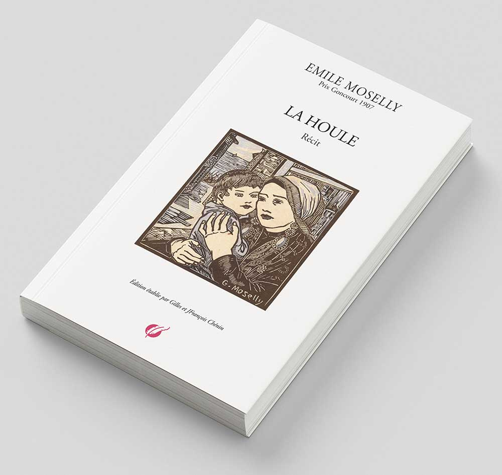

Avec *La Houle*, récit paru en feuilleton de 14 épisodes dans L'Humanité du 27 juin au 11 juillet 1913, puis réédité à titre posthume en 1931 aux éditions Bourrelier-Chimènes, Emile Moselly quitte la Lorraine pour la Côte d'Opale dans le Pays boulonnais, région qu'il connaît bien pour y avoir passé souvent des vacances.

A ce jour, nous connaissons mal les conditions d'écriture de ce récit. Nous avons seulement quelques repères. Un fait est certain : Moselly et sa femme 
affectionnent les bords de mer, le Pays boulonnais donc (où se situe l'histoire de La Houle), mais aussi la Normandie et la Bretagne. Ce sera d'ailleurs au retour de vacances passées à Lesconil (Finistère Sud) qu'Émile Moselly, victime d'un arrêt cardiaque entre Quimper et Lorient, décèdera dans le train, accompagné de sa femme et de deux de ses enfants. Il a alors 48 ans et nous sommes le 2 octobre 1918.

Déjà en 1902, il rapporte ses premières impressions sur les paysages marins (Cf. Golf du Morbihan, Les Cahiers p. 93-97, TheBookEdition, seconde édition, 2022)  ; description du Pays boulonnais en juillet 1903 (Ibid, p.110-113) où il évoque déjà les forces invisibles du vent et de la houle  ; évocation de "choses angoissantes" comme le son de la bouée au Portel (Ibid, p. 132). 

En octobre 1910, Emile Moselly emménage à Rouen où il a été nommé professeur. Le 26 octobre, il relate dans son cahier une promenade sur le port et perçoit "les âpres odeurs de mer qui fouettent (son) imagination et lui donne une sorte d'élan..." Il termine cette promenade et écrit : "*Puis d'autres idées me sont venues en foule et j'ai rêvé d'écrire un recueil de nouvelles où palpiterait le vent du large, où passeraient des bruits de machine et des claquements de voilure, un livre que j'appellerais La Houle.*" 

Plus tard il évoquera ses promenades dans le Pays de Cau, occasion pour Moselly de relier tous ces paysages qui l'enchantent à ce qu'il en connaît à travers les livres qu'il a lus. Et lors de ces promenades "une indicible sensation d'orgueil gonflait (ses) poumons et élargissait (sa) poitrine." Il ajoute : "*j'avais l'illusion que toute cette nature sortant du sommeil m'appartenait, que toute cette terre, toute cette côte battue par les flots était à moi.* (Ibid, p. 132, p. 213-219)" 

Indéniablement, Moselly est attiré par la mer, d'autant plus qu'à partir de septembre 1914 il n'aura plus l'occasion de retourner en Lorraine. Il passera ses étés dans le Calvados et en Bretagne.

Avec *La Houle*, on découvre un Moselly dans un univers inaccoutumé pour lui et pour ses lecteurs.  Et Le lorrain, chantre inépuisable de la terre de ses ancêtres, nous amène au bord de la mer sur la Côte d’Opale dans le Boulonnais.

Dans un monde âpre et rude pour les travailleurs de la mer, l’intrigue linéaire de ce récit rappelle celle de Terres Lorraines. Elle décrit l'histoire d'une veuve de pêcheur qui, en vain, veut éloigner son fils de la mer et l’idylle entre ce jeune homme et une jeune fille qui laisse entrevoir un avenir serein nourri de bonheur conjugal dans une existence paisible à l’abri des dangers mortels de cette mer nourricière mais fatale.

Est mis en scène le terrible dilemme entre la mère et la mer. La mère qui retient et qui enferme pour protéger, et la mer, magnifique et redoutable, qui appelle et qui attire irrésistiblement. Ce fil conducteur est pour Moselly une nouvelle occasion de livrer sa sensibilité à l’égard des petites gens d’humble condi-tion et sa vision pessimiste sur la capacité de l'homme à échapper à son propre destin.

---

## LA CHARRUE D'ÉRABLE

 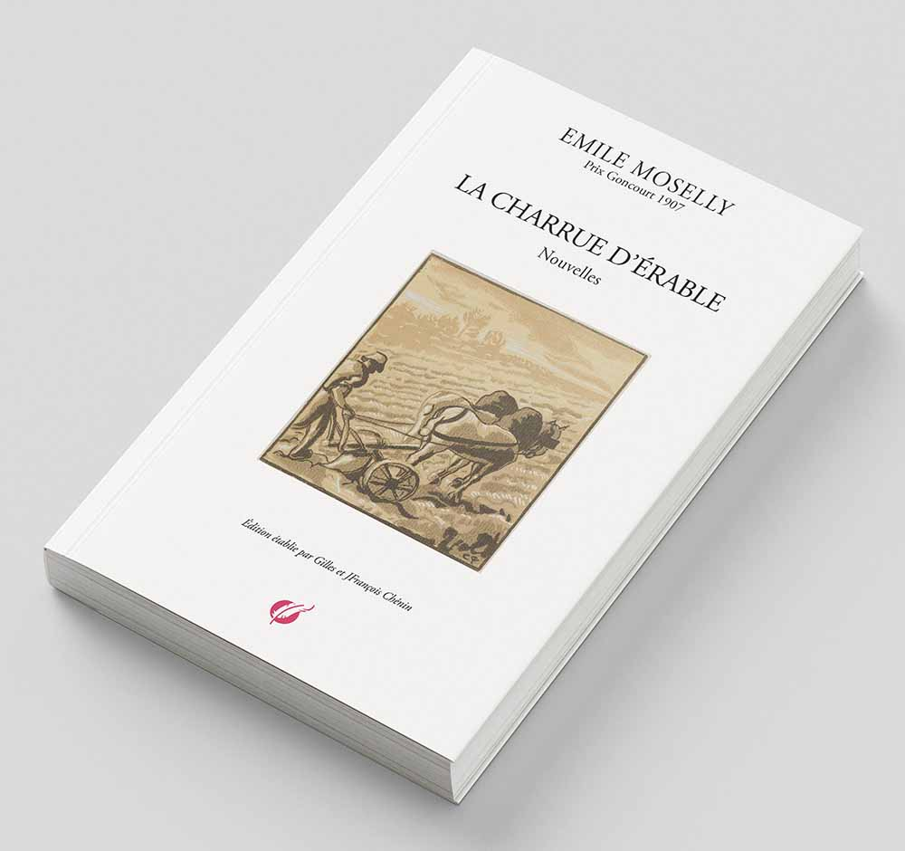

A l’initiative de la société de bibliophiles Le Livre Contemporain, Emile Moselly écrit les dix nouvelles de *la Charrue d’Érable* qu’elle édite en 1912, illustrées de douze compositions pleine page, en camaïeu, d'après des dessins de Camille Pissarro et de vingt vignettes et dix lettrines en couleur, gravées sur bois par 
Lucien Pissarro, son fils, et Esther Pissarro, épouse 
de ce dernier. Le tirage unique de ce livre en 116 exemplaires numérotés a été réalisé par la maison d'édition Eragny Press créée en 1895 à Epping, dans l’Essex (Angleterre) par Lucien Pissarro.

 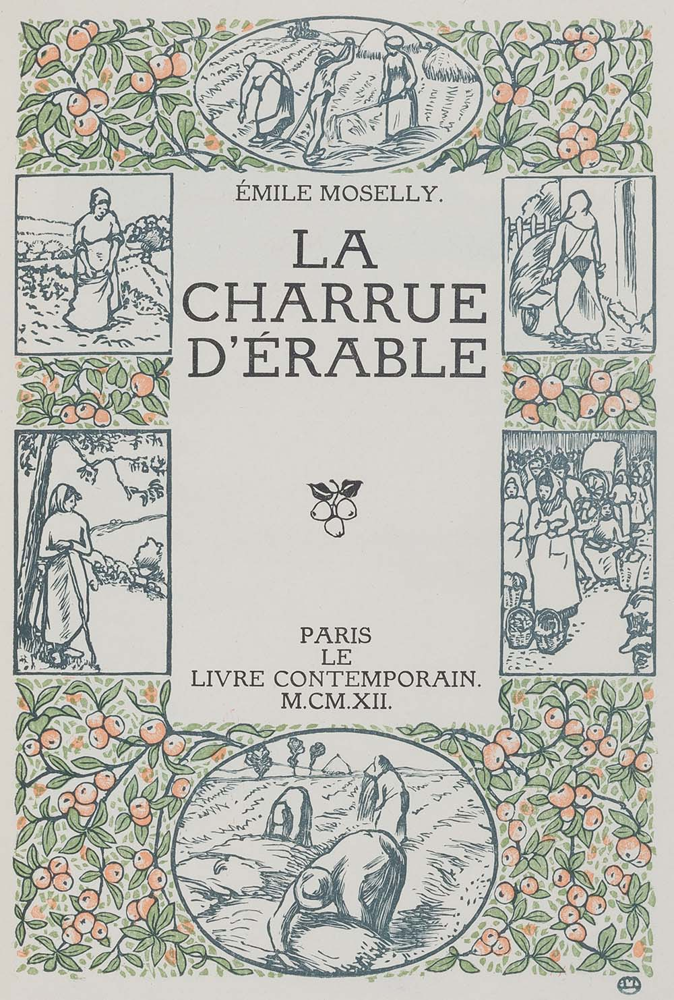

Les nouvelles de ce livre n'avaient jamais été rééditées. Nous les reprenons ici. Les illustrations proviennent de l'édition originale et sont de Lucien Pissarro. Sur les dix nouvelles de l'ouvrage, trois ont été publiées dans une revue : *La Baratte* dans le Pays Lorrain en janvier 1912 ; *La Vision du Père Huot* dans la Bibliothèque Universelle et Revue Suisse en juillet 1912, parue sous le titre *Lavandière Nocturne* dans La Charrue d'Erable ; et *La Moisson* en février 1913, toujours dans la Bibliothèque Universelle et Revue Suisse.

Avec Moselly, nous ne sommes plus dans la stricte perspective d’illustrer les "Travaux des champs", projet pictural de Camille Pissarro. Moselly saisit l’occasion pour explorer (comme dans la plupart de ses écrits) l'âme humaine, ses aspirations et ses tourments.
Emile Moselly n'est jamais agréable ou inquiet pour rien. Avec les portraits qu'il dessine de ses observations pertinentes, nombreuses, maintes fois tournées et 
et retournées, avec ou sans couleur, en pleine lumière ou dans l'ombre, portraits de femmes et d'hommes pour la plupart sortis du "peuple", il tente de cerner ce qui fait l'essence de cette âme humaine, ce qu'elle recèle de petitesse ou de grandeur, de plaisir et de jouissance ou, le plus souvent, de crainte et de peur et affine les visions qu’il se fait de l’humanité.La relation à la mort, le travail et l’effort, les troubles de la folie, la solitude humaine, la bêtise, la misère, mais aussi l'envie et l'ambition, les plaisirs, petits et grands, de la vie, l’espérance d’une existence meilleure, tels sont les sujets développés par Moselly dans les nouvelles. Toute la palette des sentiments qu’il éprouvre y est reprise, de la plénitude de la campagne à la rudesse de la vie rurale, en passant par les hauts et les bas d'existences souvent miséreuses, parfois lassées des vilénies du temps ou de l'époque. Moselly ne s'écarte pas de son projet : donner une parole aux humbles qu'il côtoie et parmi lesquels il a trouvé les portraits vivants qu’il immortalise avec tout son talent littéraire d’impressionniste.

---

## GEORGE SAND

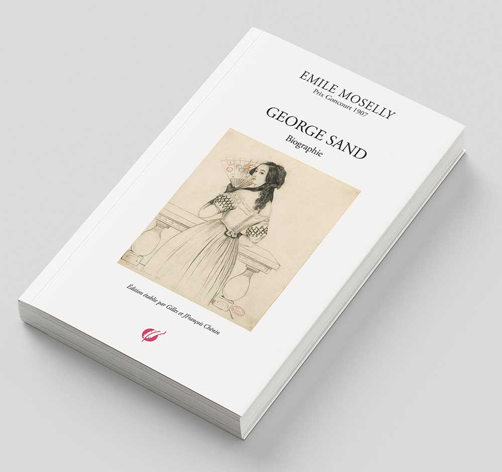

**Armandine-Lucile-Aurore Dupin** vint au monde à Paris le 1er juillet 1804. « Quand je suis née, dit une héroïne de Shakespeare, une étoile dansait. » Pareille joie présida à sa naissance. Son père, un brillant officier de l'Empire, jouait une contredanse sur son violon ; Sa mère, Un peu souffrante, quitta la danse. Au dernier chassez-huit, une sœur de la jeune femme entra en coup de vent : « Venez, venez, Maurice, dit-elle au mari, vous avez une fille. » Puis elle ajouta : « Elle est née dans le rose, et en musique : elle aura du bonheur. »

« *Moi qui suis née en apparence dans les rangs  de l’aristocratie, je tiens au peuple par le sang et par le cœur. Ma mère  […]  était de la race vagabonde et avilie des Bohémiens de ce monde.* » 
Lettre à Charles Poncy (décembre 1843) 
  
« *Moi, je n’ai rien de bourgeois dans le sang.  Je suis la fille d’un patricien et d’une bohémienne […]  Je serai avec l’esclave et avec la bohémienne, et non avec les rois et leurs suppôts.* »  
*Lettre à Alphonse Fleury* (mars 1844)  
George Sand, *Histoire de ma vie*, 1855

**CHAPITRE I - Pèlerinage passionné**

George Sand, la bonne dame de Nohant ! En ce jour de Pentecôte, nous allons chercher ce qui reste d'elle aux lieux où elle a vécu, dans le paysage qu'elle a contemplé. 
Sans doute, on a beaucoup nié et critiqué son œuvre, et, par un de ces retours inévitables qui suivent les grandes réputations, on s'est cruellement vengé de l'avoir adorée. On lui a refusé le talent de la composition, l'art du style, le sens de la psychologie vraie. Et on avait raison, en partie ; mais on ne songeait pas qu'elle avait la fécondité de la nature, dédaigneuse de tout artifice, jetant à profusion ses masses de feuillage et ses eaux vives. 
Le temps a fait son œuvre apaisante. Mettant toutes choses au point et reculant les perspectives, il nous laisse apercevoir, de la plaine où nous marchons, montant très haut dans l'air, l'immense chaîne de montagnes qui forme son œuvre, avec ses glaciers étincelants : Lélia et Jacques, ses vallées fraîches et  ombreuses : Le Champi et la Mare au Diable.  
Nohant. Quelques chaumines éparses sous des branche basses de noyers, des murs croulants où poussent des graminées tremblantes, des mares d'eau vaseuse où des canards s'ébrouent. Partout ces dômes pénétrés de lumière, ces larges feuillages qui versent sur le sol des ombres froides. 
Par échappées, on entrevoit les labours de terre grasse, qui forment un fond de tableau, le décor des premières pages de la Mare au Diable.  
Sur la petite place où des enfants jouent, tandis que des vieux somnolent, près de l'église dont le porche est surmonté d'un auvent de tuiles, porté par quatre poutres à peine équarries, un large silence tombe, ce silence des après-midis de dimanche à la campagne. 
On cause dans l'auberge. L'hôtesse donne le branle à un berceau berrichon où dort un enfant. 
Et ce bruit martèle le silence. On parle de la Bonne Dame de Nohant. Un vieux, qui était son danseur aux jours de bourrée, en a gardé le souvenir d'une personne savante, toujours occupée à étudier les plantes et les bêtes : « On la voyait avec des chenilles dans la main. » Tous vantent sa bonté, sa générosité, et l'un d'eux a cette parole très simple et très émouvante : « Oui, monsieur, il n'y avait pas un malade dans le village qu'elle ne fût aussitôt à la porte. » 
Chose étrange : ils ont entendu parler de Pagello, de toutes ces histoires d'amour dont on a rassasié  les curiosités parisiennes, et d'instinct ils protestent, s'insurgent, se portent garants de l'honneur de la Bonne Dame. N'est-elle pas de la famille ? 
Et voilà que cette paix exquise s'emplit de souvenirs ! Voilà que ce coin de terre envahi d'herbes, ces quelques chaumières qui se cachent, épeurées, sous les arbres, s'agrandissent subitement comme un sanctuaire, comme un de ces lieux saints qui hantera à jamais l'imagination des hommes. Impression émouvante de songer qu'un peu d'histoire vit dans ces murs croulants ! Tant de grands noms, qui ont fait la gloire littéraire du siècle passé, sont évoqués par la contemplation de ces lieux ! C'est ici que Balzac, descendu un soir et la trouva toute pareille à l'image qu'il s'en était formée, rude, franche, en pantalon turc et en pantoufles jaunes, fumant silencieusement pendant qu'il parlait. Et Dumas ! Et Flaubert, qui, voyant s'avancer sous la pluie son cercueil porté par des paysans, enveloppait la scène d'un grand geste, et, pleurant et admirant, s'écriait : « Comme tout cela lui ressemble ! » 
Quand on songe qu'elle marcha par ces petits  chemins tortueux, portant en son cœur le souvenir de Musset, qu'elle avait trahi et qu'elle aimait encore, que des échos ont vibré là, qui se prolongent en nous, que tels vers des Nuits sont venus la frôler au passage, tels vers qui vivront à jamais dans la mémoire des hommes, voilà que ces petits sentiers berrichons, bordés de mares et de clôtures d'osier, s'élargissent soudain sur on ne sait quelle perspective mystérieuse. 
Nous nous promenons dans le parc. Un orage passe au loin ; le ciel à travers les branches, plein de lueurs roses et bleues, a l'air d'une grande coquille de nacre. 
Est-ce une imagination ? Ce parc nous semble encore hanté de sa présence, avec ses larges allées, ses pelouses qui sont des prairies, son petit bois d'arbres clairs, où s’ouvre un trou d'eau caché sous des feuilles mortes. Les choses conservent mieux le souvenir que les hommes ! On la retrouve tout entière dans la disposition de ce jardin sans verdures prétentieuses, sans charmilles alignées, vrai jardin de la  Nouvelle Héloïse, cherchant à se rapprocher de la nature, dans sa grâce abondante et négligée. Dans l'herbe drue, qu'on couperait à pleine faulx, poussent des fleurs toutes simples : digitales des bois et renoncules des prés, seulement un peu plus épanouies par la culture, espèces collectionnées dans la Vallée-Noire par cette fille de Jean-Jacques, éprise de botanique. Une branche d'églantier retombe mollement sur un massif de feuilles : sur le large perron de pierre, un  arceau de fer, rongé de rouille, porte encore une  guirlande de roses, d'un rouge pourpre vivace,  somptueux dans toute cette cendre grise de la mort... 
Et tous ces riens, dont l'arrangement révèle une main artiste, prennent une signification émouvante. Seules, les serres vides largement inondées de soleil, ont un air de délabrement et d'abandon... 
Tant d'œuvres ! Tant de jours ! C'est là tout au fond de ce bois, près du mur bas qui le sépare de la route, qu'elle discuta longuement avec son ami Rollinat les éternels problèmes, qu'elle sentit son âme, au sortir des passions magnifiquement égoïstes, s'ouvrir à la pitié sociale. C'est là qu’elle vécut des heures de méditation, par les nuits froides de janvier, sous le flamboiement des constellations, des étoiles Sirius, Aldébaran, dont la rouge lueur illumine certaines pages de Lélia ; c'est là qu'elle connut ce frisson glacé qu'elle décrit si bien : celle pâleur saisissante de l'aube, après une nuit de travail, quand la clarté renaissante met comme une sensation de vide et d'effroi autour d'elle. 
D'autres nuits furent féeriques. On s'assemblait sur le perron pour entendre le piano de Liszt. La  comtesse d'Agoult, en robe blanche, allait et venait dans un cercle de lumière, pareille à une apparition d'Hoffmann, que la musique aurait évoquée. 
Dans le petit cimetière, envahi d'herbes folles, tout près des croix plantées sur les sépultures de  paysans, dont la poussière reste anonyme. Sa tombe est là, sous une retombée de roses, une lourde dalle de granit, carrée, massive, ayant on ne sait quelle  puissance dans le délabrement des choses voisines. 
Un seul nom : George Sand. 
 
Les traînes. Rien n'égale la nonchalance sinueuse de ces traînes qui changent à chaque tournant. Des ormes étêtés, des saules forment la bordure des enclos. Ce sont ces masses de verdure qui, vues de loin, donnent l'illusion d'une forêt, évanouie dès qu'on  s'approche ; ce sont elles qui ont valu au pays le nom de Vallée‐Noire. La route recouverte de sable chaud et fin luit doucement sous le soleil. Une montée d'air  enflammé charrie les odeurs des haies voisines. Des femmes reviennent des vêpres, et la palpitation des coiffes noires, le glissement silencieux de ces mantes de deuil le long des chemins jette dans la splendeur de ce jour d'été une note mélancolique. 
Une grande paix repose dans ces chambres de verdure. A peine si on rencontre, de temps à autre, une pastoure qui garde son troupeau d'oies sur le bord de la route. Le jars souffle, tend son long cou, claque du bec d'un air menaçant pour protéger sa couvée. Une pouliche, prise de peur, piaffe et tente de s'enfuir. Le fer de ses entraves sonne à ses pieds, et ce bruit, que George Sand a noté, qui retentit, dans son œuvre, soulève en nous de longs échos vibrants. 
Enfin, elle est tout près de nous ; c'est dans ces chemins tortueux que se retrouve encore le meilleur de son être. Entre les racines d'un orme noueux, voici un petit coin abrité revêtu de mousses : au delà, dans une clôture de bois sec, un seigle déjà grand frissonne sous la lumière, un ruisseau coule sur un lit d'herbes, qui semblent vivre, tellement elles ondulent avec  douceur. 
C'est la, sans doute, que l'eǹfant passait ses journées en compagnie des petits pâtres, écoutant leurs récits naïfs, tandis que dans l'air planait la mélopée du  laboureur, chantant à ses bœufs. C'est là que son âme s'ouvrit à cette merveilleuse compréhension de l'âme rustique, simple, patiente, robuste. Des récits étranges, des légendes terribles hantaient ces imaginations  primitives, légendes nées des bruits qu'on entend dans le crépuscule, des formes qu'on croit entrevoir dans l'air mystérieusement agrandi : fadets, sorciers, grand'bête, meneurs de loups et lavandières nocturnes. Tout le peuple des apparitions défilait aux yeux de l'enfant effrayée, et son œuvre, par la suite, fut pénétrée de ce mystère. 
Elle causait avec le chanvreur, avec le porcher, avec le fin laboureur. Poésie ou réalisme ? A quoi bon discuter sur les mots, se jeter à la tête des termes d'école, que la discussion déforme et que chacun entend à sa manière ? Chez elle, comme Goethe, comme chez les très grands, le réel, longuement, habilement observé, se transmuait sous les apparences de  la poésie. Ne vous arrêtez pas au premier aspect,  étudiez les dessous de ces figures paysannes, vous y  retrouverez solidement dessinés les traits éternels  de l’âme rustique, sa bonhomie narquoise, sa malice qui vient de la race, son âpre amour de l'argent et  de la terre. 
Le moulin d'Angibault. Il tourne encore : la roue moussue clapote dans le flot, et le ruisseau, coulant au bas des rives terreuses, se glisse, frétillant et furtif sous les buissons, comme un animal surpris. Des ronces griffantes, s'accrochant aux branches des  ormes, forment des fourrés inextricables. En amont de la passerelle, un grand peuplier, à demi abattu,  se penche sur la vasque d'eau brillante dans une attitude d'abandon. 
La meunière vient à nous, et c'est, dans ce cadre pastoral, la causerie champêtre, faite de riens qui prennent une signification très attirante, au milieu des bruits de l'eau, du frissonnement des feuilles  et des souvenirs. 
George Sand a choisi cet endroit pour y placer la scène d'un de ces romans, où elle traduisait à sa façon le socialisme mystique et rêveur de Pierre Leroux : œuvres fausses, entachées de déclamation, qui témoignent d'un magnifique dédain de la réalité, mais qui ont parfois la fraîcheur d'une églogue antique. Il est aussi loin de nous, ce roman, que l’Astrée. Au bord de ce petit ruisseau, qui prend les airs fabuleux du Lignon, les personnages promenaient leur désespoir d'amour et leurs rêveries humanitaires, touchant optimisme, dont les déclarations se peuvent résumer ainsi : Le monde ira mieux, quand les riches, persuadés que leur richesse est la cause de leurs tourments et la raison de leur infériorité morale, s'en dépouilleront volontairement pour un partage plus équitable. Le monde ira mieux, quand l'amour, créateur de sociétés nouvelles, nivellera les classes, quand de grandes  passions, allumées au cœur des patriciennes, les  jetteront aux bras d'artisans robustes, sympathiques, grands liseurs de Rousseau, et qui avec leurs cheveux longs et leurs mains blanches, ressemblent à des artistes de la Renaissance.  
Aujourd'hui que le socialisme s'est fait âpre,  théoricien, chose de calcul - et c'est la meilleure façon d'aboutir - il est amusant de relire ces pages, sans y ajouter trop de foi, comme on écouterait un conte bleu, échappé à l'imagination d'une grande aïeule. 
La Châtre. Au soir tombant, nous arrivons dans la petite ville. Une impression exquise de calme et de  recueillement flotte sur les maisons désertes, les  habitants étant partis dans la campagne. C'est étrange et saisissant, ce crépuscule dans ces rues emplies de la tombée d'une cendre grise, tandis que deux ou trois silhouettes glissent sans bruit le long des murs. Ce grand silence ferme merveilleusement cette journée, où nous avons marché dans ce Berry gracieux et  monotone, hantés d'une invisible présence, dans  l'immense apaisement qui sort des tombes. 

---

## LES GRENOUILLES DANS LA MARE

 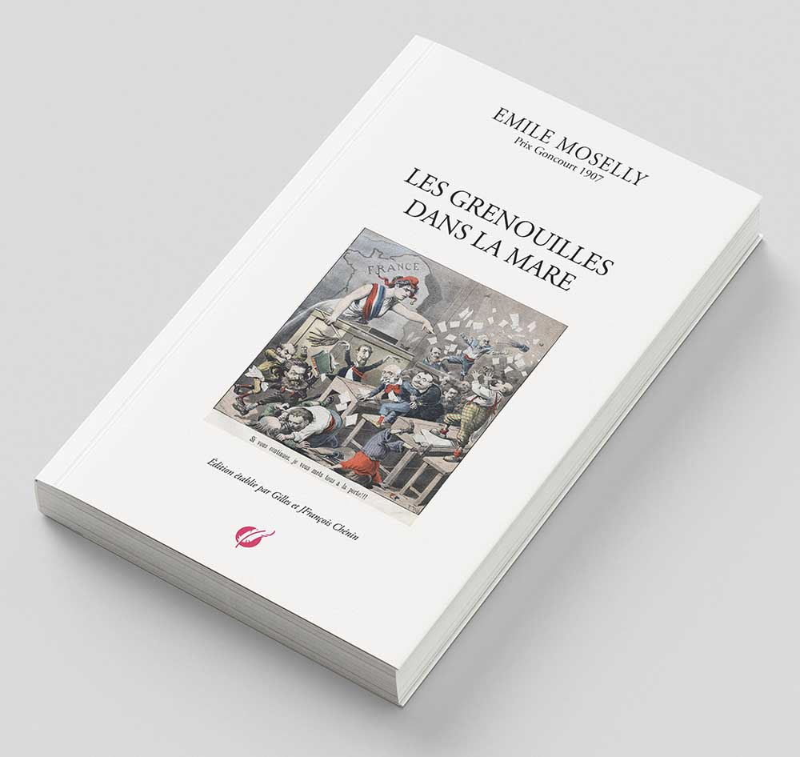

Second roman posthume (le premier : *Les Étudiants*, janvier 1919), *Les Grenouilles dans la Mare* (1920, Édition Albin Michel) est complètement achevé dès juillet 1914. 
Ce volume devait être le premier d'une série de quatre que Moselly se proposait de publier pour décrire l'état d'esprit de la société française au moment de la  déclaration de guerre.  
Le second volume aurait évoqué Charles Péguy et différents milieux intellectuels d'avant-guerre (le faubourg St-Antoine et ses ouvriers aristocratiques, étude sur le tango, la vie parisienne, etc.). Le troisième aurait été le journal d'un savant (botaniste ou entomologiste), genre Sylvestre Bonnard 1 Quant au quatrième, à en juger par les cahiers de Moselly, il aurait fait revivre, en une suite d'impressions et de tableaux recueillis sur le vif, Paris dans les premiers mois de la guerre. 
Avec *Les Grenouilles dans la Mare*, Moselly s'intéresse aux mœurs électorales d'une province du centre (L'Orléanais) qu'il a habitée lui-même pendant plusieurs années. Tout en faisant le procès des politiciens d'arrondissement, dont il met en scène un spécimen des plus  accomplis en la personne du député Grapillard, il raconte la peine des humbles, de ces prolétaires qui gagnent  péniblement leur vie à la sueur de leur front et pour  lesquels, cependant, il entrevoit des jours meilleurs. 
Au député républicain Grapillard, véritable tyranneau de province, qui ne recule devant aucune bassesse pour assurer sa réélection, il oppose un nobliau, le comte  Rocheton des Emblavures, défenseur de la réaction  conservatrice et le chemineau Joseph Chambournac,  interprète des revendications populaires. 

Dans un style alerte et vivifiant, il dépeint avec ironie les mœurs politiques de la Troisième République, les assauts de démagogie et les perversions de la  démocratie parlementaire, bref tous les ingrédients  de « la farce de la Marmite électorale ». 
C'est sans doute dans ce roman que Moselly exprime le plus nettement ses affinités à la cause socialiste. Avec Joseph Chambournac, il s’indigne de la misère de la condition ouvrière et voit dans « le peuple [la] seule force intacte dans la décomposition des partis ». 
Par contraste avec les remugles de la vie politique, Moselly nous offre le spectacle charmant de l’idylle entre le journaliste-écrivain Jacques Pradines et l'exquise  cantatrice Charlotte Maës. La beauté de l’art et de l’amour paraissent alors la planche de salut pour s’élever  au-dessus des miasmes de la mare grenouillante et  donner quelques notes d’espoir dans la nature humaine. 
 
Ce roman est fait de choses vues et scrupuleusement notées par Moselly, dans lequel, selon Charles Daudier,  il a « déployé et affirmé toutes les qualités, toutes les  ressources de son talent souple, subtil et précis ».

1 - *Le Crime de Sylvestre Bonnard* est le premier roman d'Anatole France (1881). Avec cette œuvre, A. France se fait connaître comme romancier, alors qu’il a déjà 37 ans et qu'il est principalement reconnu comme poète affilié au Parnasse. L’œuvre reçoit le prix Montyon de l'Académie française.  Sylvestre Bonnard, membre de l'Institut, est un historien et un philologue, doté d'une érudition non dénuée d'ironie. «Savoir n'est rien - dit-il un jour - imaginer est tout.» Il mène une vie austère au milieu de ses livres. Mais il consacre également tous ses efforts à trouver un manuscrit du XIVe siècle, la Légende dorée de Jacques de Voragine, dont il rêve comme un enfant peut convoiter un jouet extraordinaire. Au cours d'un voyage en Sicile, il fait la connaissance du prince et de la princesse Trépof, mais ne parvient pas à mettre la main sur l'ouvrage. À son retour à Paris, il a la douleur de voir le livre lui échapper encore, lors d'une vente aux enchères. Mais il obtiendra  finalement l'objet convoité. 
Le hasard lui fait rencontrer la petite fille d'une femme qu'il a jadis aimée et, pour protéger l'enfant d'un tuteur abusif, il l'enlève...

---
## LE JOURNAL DE GOTTFRIED MAUSER et CONTES DE GUERRE POUR JEN-PIERRE

 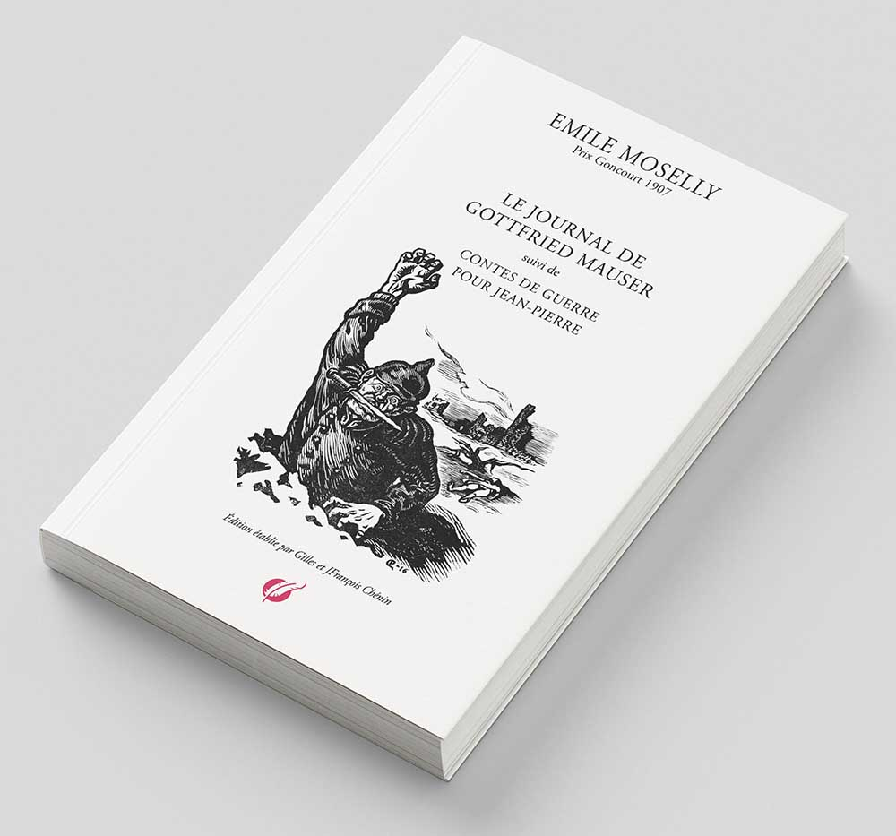

 [*le Journal de Gottfried Mauser*](https://www.thebookedition.com/fr/emile-moselly-gottfried-mauser-p-400357.html)a d'abord été publié dans une version plus courte en quatre épisodes dans le journal Le Temps des 16, 19, 25 décembre 1915 et du 1er janvier 1916. La présente version, plus longue et définitive, a été éditée aux éditions Ollendorff en juin 1916.
*Les Contes de guerre pour Jean-Pierre,* eux, paraissent, à la Librairie Berger-Levrault le 20 avril 1918. Ces deux publications encadrent pratiquement la durée de la Grande Guerre et forment une contribution significative d’Emile Moselly à l’effort de guerre et à la narration de son histoire.

A la veille de la guerre de 1914, E. Moselly est une personnalité reconnue.Comme professeur, les proviseurs le recherchent pour lui confier une classe de première là où il le désirerait, Neuilly ou Paris. Ce sera finalement au lycée Pasteur de Neuilly. Avec un de ses collègues, Armand Weil, il a publié à Toulouse en 1911 un ouvrage classique Le Français de nos enfants. En 1913, il publiera, toujours avec Armand Weil, chez Larousse, une anthologie littéraire et artistique : *Contes et récits du XIXe siècle* (Alfred Saffrey dans l'Amitié Charles Péguy du 15 mars 1966).
Comme critique littéraire, il consacrera des chroniques et études à Emmanuel Delbousquet (L'Âme Latine, 1909), Lucien Descaves (Editions Sansot, 1909), René Perrout (Le Pays Lorrain, 1909), George Sand (Editions d'Art et de Littérature, 1911), Guy de Maupassant (La Revue Bleue, 1914).
Comme romancier, après le prix Goncourt en 1907, il publiera *Joson Meunier* (Ollendorff, décembre 1910), *Fils de Gueux* (Ollendorff, juin 1912), *La Houle* (l'Humanité, juin 1913, ouvrage repris à titre posthume en 1931 aux éditions Bourrelier-Chimènes), *Les Etudiants* (La Grande Revue, 1911 et 1912, réédité en 1919 chez Ollendorff). 
Comme nouvelliste, il écrira pour de nombreux journaux (L'Humanité, Le Temps…) ou revues (La Revue Hebdomadaire, La Revue Bleue, Le Pays Lorrain…) dans lesquels il publie régulièrement des contes, des nouvelles et des chroniques. Entre 1908 et 1914, on recense la publication de 30 nouvelles et chroniques (Pour un bibliographie complète, Cf. Nouvelles, portraits et croquis Vol.1, p. 297 (TheBookEdition, 2023)). Et il reçoit, en 1913, la croix de Chevalier de la Légion d'Honneur.

En juillet 1914, il cherche un logement pour sa famille et, en attendant, réside à Eaubonne chez la mère de sa femme. Fin juillet, il ramène sa mère de 75 ans à Eaubonne et ferme la maison de Chaudeney, qui restera vide. E. Moselly n'y reviendra pas. Le 3 août, l’Allemagne déclare la guerre à la France. La veille, E. Moselly, qui avait été mobilisé à la caserne de Toul, est réformé en raison de sa santé fragile. En septembre, E. Moselly conduit sa famille se réfugier à la Motte Saint-Héray dans le Poitou et il fait sa rentrée le 7 octobre au lycée Pasteur de Neuilly.

E. Moselly a alors 44 ans. Il a acquis une réelle notoriété, reconnu principalement pour ses qualités d’écrivain régionaliste, chantre doux et mélancolique de la Lorraine et de ses petites gens. Ses origines lorraines, les récits de son père Achille qui avait fait les campagnes de Crimée et d’Italie, les lectures des guerres napoléoniennes de Erckmann-Chatrian, la mémoire douloureuse de la guerre de 1870 lui ont conféré, malgré son humanisme, une profonde animosité à l’égard du "boche".

*Le journal de Gottfried Mauser* (1915) et *les Contes de Guerre pour Jean-Pierre* (1918) ne sont pas ses seuls écrits "de guerre" ou sur la guerre. E. Moselly publiera plusieurs nouvelles entre 1915 et 1918 : [*Canons de Lorraine*](https://www.calameo.com/read/00602640657a79f5fd8cb?authid=hO9GH0QXtgwt)* (La Revue Bleue, 1915), *Simple aveu* (Le temps, 1915), [*Le crime de l'Allemagne*](https://www.calameo.com/read/006026406666cf0737169?authid=tsAIWIqU7hlk) (La Revue Bleue, 1917), [*"*Nausicaa*](https://www.calameo.com/read/006026406df27843a0292?authid=ypbU2cfBtwe3)(La revue des Deux Mondes, 1919), [*Prière pour nos mort*](https://www.calameo.com/read/006026406e87b8d532810?authid=pGgryb3NldaG) (Revue France, 1918) et [*Bautru, soldat*](https://www.calameo.com/read/0060264063ecab7fa392e?authid=xLCdEAkmRtWb) (La France Nouvelle, 1918). Toutes ces nouvelles sont précédées de [* Dernier séjour en Lorraine*](https://www.calameo.com/read/006026406772976d7f313?authid=GPJts73OLkyt) datant de 1914 (publié par le Pays Lorrain, à titre posthume, en 1931) (Toutes ces nouvelles ont été publiées dans [*Nouvelles, Portraits et croquis V.2*](https://www.thebookedition.com/fr/emile-moselly-nouvelles-v2-p-396804.html), (TheBookEdition, 2023)) comme si E. Moselly renonçait à écrire sur sa terre natale et ses habitants, sur ce coin de Lorraine animé des vibrations des feuillages, des lumières et des parfums tout au long des boucles de la Moselle qu’il aime observer et raconter. Tous ses écrits à partir de 1914 traduisent son grand désarroi face à la guerre qui se concrétise alors.

L'assassinat de Jean Jaurès, le 31 juillet 1914, dont il est un grand admirateur pour ses prises de positions sociales, humanistes et pacifistes, va, paradoxalement, faciliter le ralliement d'E. Moselly, comme beaucoup de socialistes et plus généralement de la Gauche de l'époque, à l'Union Sacrée. Ses écrits prendront alors une tournure plus belliqueuse et vengeresse, même si - et alors qu'il a dû souffrir, du fait de sa situation de réformé, de ne pouvoir participer physiquement à l’effort de guerre - il exécrait le statut de militaire. Aussi s'emploie-t-il par l’écriture, la  seule arme qu'il sait manier, à combattre de toutes ses forces l’ignominie de l’agression "boche" et l'avilissement par la violence qui n'épargne ni les bourreaux, ni leurs victimes.

Avec Le Journal de Gottfried Mauser, il nous fait entrer dans le quotidien d'un allemand, professeur de musique raffiné, pétri de culture romantique et animé de valeurs supérieures, enrôlé pour combattre dans les rangs de l’armée du Kronprinz et qui se révèle, au fur et à mesure de l’avancée des troupes allemandes à travers la Belgique jusqu'à l'arrivée en France, un acteur impitoyable des plus monstrueuses atrocités commises alors. E. Moselly ne décrit pas des faits de guerre, il raconte la barbarie qui se déchaine contre les civils. L’abondance des détails et le réalisme des situations décrites forment une dénonciation véhémente des crimes de guerre. C’est ce qui donne toute sa valeur à cette contribution. 

E. Moselly n’est pas allé sur le champ de bataille mais il en a recueilli toute l’horreur grâce aux multiples témoignages et reportages publiés dans les journaux de l’époque. Et il trouvera dans la presse toute la matière nécessaire à son récit, presse qui commente au jour le jour "les opérations militaires", les avancées et les reculs des armées (sur les fronts belge et français comme sur le front Est dans les Balkans)  mais aussi "les crimes de l'Allemagne" (Le Temps, Le Matin, l'Est-Républicain…) qui reprennent parfois les "rapports et procès-verbaux d'enquête de la commission instituée en vue de constater les actes commis par l'ennemi en violation du droit des gens" (instituée par un décret du ministère de la Justice le 23 septembre 1914) et qui relateront tous ces faits de barbarie de 1914 à 1918. J. Ernest-Charles dira : "M. Emile Moselly a voulu écrire le roman de la férocité allemande ; mais ce roman, c'est, à très peu de choses près, de l'histoire." (Excelsior - Journal Illustré Quotidien du 8 juillet 1916). Bien au-delà d’un recueil, cet ouvrage est une condamnation irrémédiable de l’esprit germanique et des désastres qu’il provoque.,

Plus doux, moins combatif mais non moins définitif, *Contes de guerre pour Jean-Pierre* prend la forme d’un testament adressé à son dernier fils, Jean-Pierre, né en 1913 (onze ans après sa sœur Germaine et quatorze ans après son frère François). Dans ces contes, E. Moselly endosse son rôle de professeur, et adresse aux enfants et aux adolescents, à travers son petit garçon, une leçon pour ne pas oublier l’horreur de cette guerre (). Si, comme il l'écrit, Le Journal de Gottfried Mauser est "un livre de haine et de colère", les Contes de Guerre s'attachent "à composer quelques récits qui lui (Jean-Pierre) permettront de saisir dans cette atroce guerre des images appelées à durer dans son esprit." Il en appelle à la mémoire. Du "nous ne pardonnerons jamais", il passe au "nous n'oublierons jamais" et, tout en reprenant la parole de l'Antigone de Sophocle "*Je suis née pour l'amour et non pour la haine*", il souligne pourtant et encore que "pardonner à l'envahisseur, c'est trahir nos morts". Mais, ajoute-t-il, "il me semble que leurs mânes (Celles des morts) sont apaisées, qu'ils ressentent une consolation légère, dans la terre sanglante où ils reposent, chaque fois qu'une voix d'enfant prononce le serment solennel de n'oublier jamais." La question du pardon est fondamentale pour E. Moselly. Il la résout par un nécessaire devoir de mémoire.

Ces deux ouvrages ont été bien accueillis par la critique de l’époque. Aux yeux des commentateurs,ils traduisaient fidèlement l’horreur que la sauvagerie des envahisseurs avait suscitée (Charles Daudier en décembre 1918 évoque pour Le Pays Lorrain (N°9, août-septembre 1919) la carrière littéraire d'Emile Moselly. Au chapitre consacré au Journal de Gottfried Mauser, il écrit : "*Le grand drame qui, durant quatre longues années, se déroula sur la scène européenne et au dénouement duquel il n'eut pas la joie d'assister, lui suggéra ce curieux Gottfried Mauser, l'une des plus fines et des plus mordantes satires de la mentalité allemande, que le Temps publia dans ses colonnes en 1915 et qui parut l'année suivante à la librairie Ollendorff. Jamais ouvrage ne lui attira courrier aussi volumineux. Des correspondances lui vinrent, me dit-il, de tous les points du  globe : lettres d'insultes de germanophiles irréductibles, mais aussi, et combien plus nombreuses, lettres d'approbation, ardentes et enthousiastes, d'étrangers favorables à notre cause ou simplement impartiaux*."). Rares sont ceux qui ont souligné le contraste entre le Moselly tendre et poétique de ses productions antérieures et le Moselly féroce et ironique du Journal. Beaucoup de journaux, après une très courte introduction, reprennent des passages de l'ouvrage, le plus souvent sur les saccages auxquels se livrent les "boches" (L'Ouest-Eclair du 2 janvier 1916, Paris-Midi du 23 juin 1916, l'Action du 24 juin 1916, Le Petit Comtois du 6 septembre1916). Ce sera dans l'Excelsior (déjà cité) que J. Ernest-Charles soulignera le mieux les paradoxes auxquels E. Moselly est confronté : "M. Emile Moselly était désigné pour l'écrire (Le Journal de Gottfried Mauser). Non parce qu'il est un romancier de la terre lorraine et que la terre lorraine a souffert plus que toutes les autres peut-être de la brutalité des Allemands. Mais parce que l'auteur de *Jean des Brebis ou Le Livre de la Misère*, qui demeure son ouvrage le plus vrai et le plus pathétique, a toujours eu une pitié infinie pour la souffrance des hommes. Il souffre, il pleure avec les malheureux. Il ne se révolte point, et le sentiment de commisération douloureuse qu'il éprouve, se fond en un attendrissement fraternel. Maintenant, surgissent la haine et la colère. C'est que les méchants ont voulu être méchants, c'est qu'ils se sont appliqués à nuire avec autant d'obstination que de méthode. Il écrit donc par esprit de vengeance - mieux : par esprit de justice - le livre des atrocités allemandes. Son roman est un témoignage. Le plus âpre mais le plus véridique."

Comme un testament encore, E. Moselly, dans la dernière nouvelle des Contes de Guerre, convie son fils à un pèlerinage à travers la Lorraine et l'Alsace bientôt libérées de l'envahisseur. A cette occasion, il retrouve le lyrisme impressionniste de ses écrits lorrains, clôturant, par une marche qui va du cimetière de son village où repose son père aux contreforts vosgiens de l'Alsace, en passant par Metz - "nulle ville n'a davantage [qu'elle] le caractère lorrain" - et Phalsbourg - cette "autre petite ville, pareille à notre Toul, comme elle entourée d'une ceinture de murailles à la Vauban, comme elle repliée et silencieuse" -, le cycle de ses écrits de guerre par une vision apaisée de sa terre natale.

---

## SUZANNE

 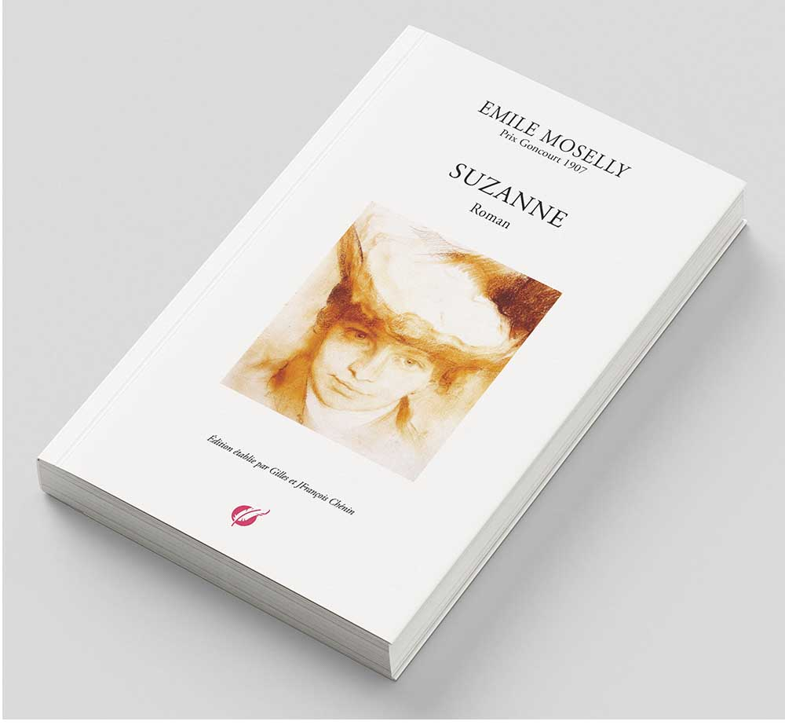

Le roman Suzanne est resté totalement inédit jusqu’à présent. Le manuscrit est introuvable, il a probablement disparu. L’ouvrage nous est parvenu sous la forme d’un tapuscrit, sans doute confectionné il y a plusieurs décennies par un membre de la famille d’Émile Moselly - peut-être sa fille Germaine - et il a été retrouvé dans les archives familiales. Néanmoins on trouve dans ses cahiers, à la date de septembre 1907, l'ébauche du premier chapitre de ce roman.

 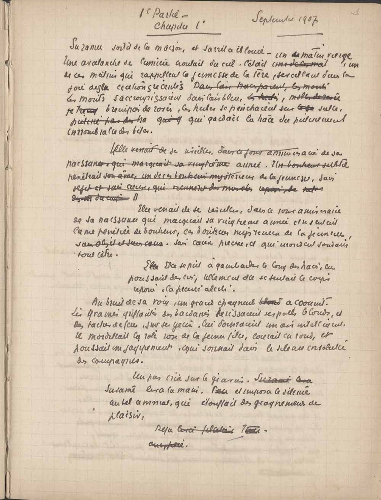

Cet ouvrage a vraisemblablement été écrit entre 1907 et 1910. Charles Daudier (1884-1953, professeur, écrivain, ami de Moselly - *Aux vacances dernières* (N.D.L.R. : 1919), écrit Charles Daudier, *j’ai eu l’occasion de parcourir les cahiers de notes (de Moselly)… En ce qui concerne la Bretagne voici trois tableaux charmants recueillis parmi tant d’autres et qui intéresseront certainement les lecteurs de la Pensée Bretonne. Le premier est extrait d’un roman intitulé Suzanne, entièrement terminé ; les deux derniers sont empruntés à ses souvenirs de Lesconil…* in La Pensée bretonne, 6ème année, n°40 du 15 avril 1920.) [voir La Pensée Bretonne](https://www.calameo.com/read/006026406f2d4250d4235?authid=tg40OW9t4peq)dans un article consacré à Moselly et la Bretagne évoque ce roman, Suzanne, "entièrement terminé" dans lequel il relève un passage sur l'île de Sein pour illustrer l'attrait que la Bretagne exerça sur l'écrivain.  A notre connaissance, c'est l’unique mention de ce roman jamais édité dans la presse ou dans les témoignages de l'époque à l'occasion de la disparition de Moselly.

Suzanne est le seul roman de Moselly dont le personnage central est une femme et c’est ce qui en fait une de ses singularités. Si Moselly a donné une place notable aux femmes dans plusieurs de ses romans (Marthe dans Terres Lorraines, qui se noie par désespoir du départ de Pierre ; Céline l'épouse de Joson Meunier, qui meurt trop jeune ; Louisa, dans Fils de Gueux, dont les mensonges ne détourneront pas Crasmagne de la protéger ; Claudette, qui partage la vie étudiante de Jean Mesnil dans Les étudiants ; Maria, la mère d'Antoine, qui tentera de l'empêcher, en vain, de devenir marin dans La houle ; Charlotte, dans Les grenouilles dans la mare, qui vit son amour avec Jacques pour les beautés de l'art...), toutes n'ont pas la densité romanesque de Suzanne, ballotée par la vie au gré des rencontres qu'elle fera avec des hommes qui la délaisseront.

Cet ouvrage met en évidence la profonde sensibilité qu’éprouvait Moselly à l’égard de la condition féminine. Dans la société patriarcale de la fin du XIX° siècle, qui assignait volontiers aux femmes une place imposée et secondaire, Moselly, à maintes reprises, a exprimé sa commisération et son inquiétude sur le sort réservé à la gent féminine. En témoigne par exemple ce fragment des Cahiers écrit le 27 janvier 1902 intitulé Naissance d’une fille : *“Même sensation d’angoisse que pour le premier, même étonnement devant l’accompli, l’acte d’adhésion dans la Bonté de la vie, foi que rien ne justifie, au fond sourde irritation contre la nature, qui nous vend ainsi le plaisir, et nous trompe, et nous conduit où elle veut. Même interrogation muette devant les petits membres grêles, gauches, la chair rouge et douloureuse, le visage informe. Qu’est-ce que la vie réserve à cela ? Et mon cœur sourd une immense pitié, douloureuse, profonde, intarissable, parce que ce sera une femme, plus faite pour souffrir, pour aimer, une femme qui sera torturée dans son corps, dans son cœur, dans sa pensée, qui sera faite d’amour et de souffrance, qui s’attachera et qui sera trahie peut-être. Les fils seront forts, ils seront des hommes, ils pourront rendre, se venger, répondre. Mais la femme, avec le rôle qu’on lui a fait, dans notre civilisation barbare…”* 

Avec le personnage de Suzanne, Moselly nous donne à voir tout ce qui fait la noblesse et la grandeur d’une jeune femme de cette époque qui affirme, avec une conviction tranquille, sa liberté d'être ce qu'elle est, d'agir selon ses sensations et de suivre son désir de pas être enfermée dans les contraintes patriarcales. Elle n'agit pas en révoltée, et souvent elle subit, mais elle sait se préserver et profiter des moments de la beauté du monde qui l'entoure. Même si elle ne peut échapper à la destinée promise aux jeunes filles de bonne famille de l’époque (couvent, bonnes manières, maîtrise des activités domestiques, perspective de mariage et de vie rangée), et si elle en accepte les conditions sans se révolter face à la muflerie, à l’égoïsme et à la brutalité des hommes, elle trouve un refuge et une compensation dans sa nature contemplative et rêveuse.

Une autre singularité de ce roman réside dans la forte similitude que l’on décèle entre la personnalité de Suzanne, son amour de la nature et son tempérament romanesque, et la propre personnalité de Moselly. On ne peut s’empêcher de la voir comme un double de l’auteur dans lequel ce dernier projette les composantes de sa sensibilité exacerbée. Ainsi, confrontée à l’un des hommes de sa vie, “Suzanne sentait frémir en elle des élans poétiques, mais elle se gardait bien de s’y abandonner devant ce compagnon prosaïque qui ne la comprenait pas.” Comment ne pas rapprocher cette attitude de l’autoportrait masqué que l’on trouve dans cet autre extrait des Cahiers où Moselly décrit la relation entre un homme, qui présente de singulières ressemblances avec Suzanne, et sa femme ? “Il était de la race des poètes et des rêveurs, inhabiles à la vie, gênés par les habitudes réglées de nos existences monotones, ayant toujours l'air de sortir d'un songe quand on leur parle de choses pratiques […] Elle était une petite femme sensée, très pratique, qui accueillait ses exaltations d’un tranquille haussement d’épaule. Quand il s’emballait, comme elle disait, elle avait une façon de casser net l’élan de son lyrisme par une familiarité impertinente. « Pas de phrases », lui disait-elle, ou bien, « Vous m’ennuyez avec vos enfantillages »."

Enfin, ce roman nous offre, pour la seule fois dans la production littéraire de Moselly, une mention délicate mais précise de l’éveil à la sexualité d’une jeune femme : "Elle se mit à haleter, et, nouant ses membres aux membres qui l’étreignaient, inondée de lentes délices, défaillante, pâmée, ravie, elle poussa un grand cri, foudroyée par la révélation du plaisir." Ou nous raconte les affres de Suzanne quand elle surprend les étreintes brutales de deux amants : "Du fond de la nuit où tremblaient des clartés vaporeuses, un couple avait surgi subitement. Deux amants gravissaient la côte. [...] Ils s’arrêtèrent à quelques pas de Suzanne et leurs bouches soudain se nouèrent. Leur baiser dura longtemps. [...] Soudain l’homme s’abattit sur sa compagne, avec l’élan de l’épervier qui se jette sur une proie. [...] Suzanne assista à la lutte effrayante, à la mêlée des deux corps qui se cherchaient. Elle vit tout, elle entendit tout : le souffle rauque de l’homme, le gémissement de la femme, et son cri, pareil au cri d’une bête égorgée."

Ces quelques notations sur ce qui paraît faire de ce roman une œuvre singulière dans la production de Moselly nous amènent à nous interroger sur les raisons qui ont motivé l’absence de publication de ce roman à l’époque.

Sans doute, la période où Suzanne a vraisemblablement été écrit, à l’orée de la première guerre mondiale, n’était guère propice à la publication d’une œuvre aussi romanesque. En supposant qu’il l’ait estimée publiable, Moselly l’a peut-être gardée “sous le coude”, préférant se consacrer à son devoir sacré de dénonciation des horreurs de la guerre (Cf. Le journal de Gottfried Mauser). 

Une autre raison qui a pu motiver la non-publication de Suzanne est sa troublante ressemblance, du moins dans ses prémices, avec le roman Une vie de Maupassant que Moselly vénérait tout particulièrement. Jeanne, l’héroïne d’Une vie, et Suzanne (l’allitération est-elle fortuite ?) ont le même départ dans leur vie de femme : bonne famille, éducation au couvent, rêveries romantiques, rencontre du prince charmant, fiançailles, mariage et voyage de noces, décevante brutalité de l’homme et découverte des émois charnels, tromperie du mari et désillusions, etc. D’aucuns auraient pu facilement accuser Moselly de plagiat et, peut-être, la crainte d’une telle accusation a pu l’inciter à garder ce texte par devers lui. 

Nous y voyons plutôt l’expression d’une profonde admiration pour Maupassant et surtout la volonté d’offrir à ce personnage de femme une destinée plus réjouissante que celle de Jeanne.

Enfin, Suzanne aurait pu être publié à titre posthume comme Les Grenouilles dans lamare en 1920 ou La Houle en 1931, mais cette œuvre est restée sous le boisseau, bien que connue de sa famille. L’hypothèse que nous hasardons sur cette “censure” est que ce roman, dans une famille où dominaient la retenue, la pudeur et parfois le non-dit, s’il avait été proposé au public, aurait donné de Moselly une image un peu scandaleuse, en infraction avec celle de l’auteur sérieux et austère, celui du peuple et de la terre, que l’on connaissait. Puisse cette publication enrichir sans la dénaturer la mémoire d’Émile Moselly en lui apportant le modernisme d’un authentique défenseur de la condition féminine.